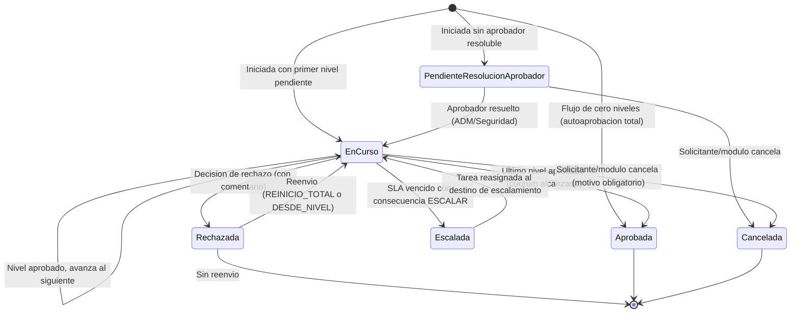

# ESPECIFICACION DE NECESIDADES TECNOLOGICAS
## ENT-MOD-APRO-001 — Motor de Aprobaciones (flujo transversal)
### Sistema Nova | Organizacion Retail Peruana (Cadena / Lukers)

| Campo | Valor |
|---|---|
| Codigo de documento | ENT-MOD-APRO-001 |
| Version | 1.0 |
| Fecha de emision | 30/05/2026 |
| Estado | BORRADOR — Pendiente de validacion con stakeholders |
| Elaborado por | Analista Funcional Senior |
| Sistema | Nova |
| Modulo | Aprobaciones (Fase 0 — habilitador transversal, EP-02) |
| Documentos relacionados | alcance-nova.md v1.0, backlog-epicas.md v1.0, ENT-MOD-MAES-001 v1.0, ENT-MOD-ROLP-001 v1.1, ENT-MOD-DESC-001 v1.2, ENT-MOD-ENCA-001 v1.1, ENT-MOD-TRAS-001 v1.1, ENT-MOD-VAC-001 v1.1, ENT-MOD-ASCE-001 v1.0 |

### Historial de versiones

| Version | Fecha | Descripcion |
|---|---|---|
| 1.0 | 30/05/2026 | Emision inicial. Especificacion funcional base del motor de Aprobaciones transversal. Modela flujos configurables (niveles, aprobadores, delegacion, escalamiento, autoaprobacion) que satisfacen Rol de Personal, Descansos (LSGH/LCGH), Encargatura, Traslados, Vacaciones y Ascenso. Vacios documentados VAC-APRO-01 a VAC-APRO-15. BORRADOR NO VALIDADO. |

---

## INDICE

1. Introduccion y Objetivo del Modulo
2. Alcance y Exclusiones
3. Actores y Roles
4. Casos de Uso Principales
5. Reglas de Negocio
6. Estados y Transiciones
7. Entidades y Atributos Principales
8. Permisos por Rol
9. Integraciones
10. Vacios Funcionales y Preguntas Abiertas

---

## 1. INTRODUCCION Y OBJETIVO DEL MODULO

### 1.1 Contexto del negocio

Nova es un sistema de gestion desarrollado desde cero para una organizacion retail peruana con aproximadamente 100 tiendas distribuidas en multiples zonas geograficas. El grupo empresarial opera bajo dos cadenas comerciales: **Cadena** y **Lukers**. La semana laboral del sistema se define de **domingo a sabado** y es consistente con todos los modulos del sistema.

Los siete modulos funcionales referencian de forma repetida "el modulo de Aprobaciones" y flujos jerarquicos GZ → GG → GT. Cada modulo describe su propio mecanismo de aprobacion con matices distintos:

- **Rol de Personal:** flujo real multi-nivel GZ envia → GG aprueba/rechaza → GT programa, con plazos parametrizables, bloqueo automatico de cajas por incumplimiento, rechazo con comentario obligatorio, reenvio del flujo completo y "version en revision" mientras la version vigente sigue operativa.
- **Descansos (LSGH/LCGH):** licencias que requieren aprobacion de GG y validacion del area de Bienestar (SLA 2 dias habiles).
- **Vacaciones:** la anulacion de un periodo activo requiere autorizacion de Administracion de Ventas o GG (un nivel de autorizacion por encima del GZ).
- **Encargatura:** las programaciones de Administracion Retail NO requieren aprobacion (autoaprobacion / sin flujo); deben quedar activas directamente con auditoria.
- **Ascenso Senior:** solicitud (GZ/GG) → evaluacion → aprobacion de GG, con autoaprobacion de GG como punto abierto en ese modulo.
- **Traslados:** no usa comite de aprobacion (usa firma electronica), pero la anulacion exige motivo obligatorio y trazabilidad equivalente.

Construir un motor unico evita reimplementar esta logica en cada modulo y garantiza consistencia de estados, comentarios obligatorios, notificaciones, SLA, escalamientos y auditoria.

### 1.2 Problema que resuelve

La ausencia de un motor de aprobaciones unico genera:

- **Duplicidad de logica:** cada modulo reimplementa estados (Enviado, Aprobado, Rechazado), comentarios obligatorios, notificaciones y auditoria, con riesgo de inconsistencias.
- **Reglas de SLA y escalamiento dispersas:** los plazos (jueves 23:59, sabado 10:00, SLA Bienestar 2 dias) y sus consecuencias (bloqueo de cajas, recordatorios, escalamiento a AV) viven en cada modulo sin un motor comun que los gobierne.
- **Falta de una bandeja unica de pendientes:** un GG aprueba roles, licencias y ascensos en flujos separados sin un inbox unificado de tareas de aprobacion.
- **Riesgo de auditoria fragmentada:** cada decision de aprobacion/rechazo debe ser trazable de forma uniforme (quien, cuando, comentario, nivel).

### 1.3 Objetivo del modulo

Proveer un motor transversal y configurable de aprobaciones que permita, para cualquier modulo solicitante:

- Definir **plantillas de flujo** configurables: numero de niveles, rol o usuario aprobador de cada nivel, modo de cada nivel (aprobacion jerarquica, autorizacion, autoaprobacion), resolucion del aprobador por jerarquia (zona/empresa).
- Iniciar una **solicitud de aprobacion** desde un modulo, asociada al objeto de negocio (rol semanal, periodo de vacaciones, licencia, ascenso, anulacion de periodo).
- Gestionar la **decision** de cada aprobador (aprobar / rechazar) con **comentario obligatorio** en rechazo (y opcional/obligatorio en aprobacion segun configuracion).
- Soportar **delegacion** (un aprobador delega temporalmente en otro), **escalamiento** (por vencimiento de SLA) y **autoaprobacion** (nivel que se aprueba automaticamente bajo condiciones).
- Gestionar **SLA/plazos** por nivel con **alertas y recordatorios** previos al vencimiento y **consecuencias** configurables al vencer (escalamiento, notificacion, o invocacion de una accion del modulo solicitante, p.ej. bloqueo de cajas).
- Notificar al solicitante, aprobadores y partes interesadas el resultado en cada transicion (push y correo, segun configuracion en Maestros).
- Mantener una **bandeja de pendientes** unificada por aprobador y una **auditoria completa** de cada solicitud y decision.

El motor NO contiene la logica de negocio de cada modulo; expone un contrato para que cada modulo inicie flujos, reciba callbacks de decision y consulte estados.

### 1.4 Relacion con otros modulos

- **Maestros / Configuracion (ENT-MOD-MAES-001):** Aprobaciones consume de Maestros: catalogo de roles funcionales y jerarquia (para resolver el aprobador de cada nivel), zonas y empresas (ambito), feriados (calculo de SLA en dias habiles) y los parametros de plazo/escalamiento de cada flujo. Las plantillas de flujo se definen en Aprobaciones referenciando estos catalogos.
- **Rol de Personal (ENT-MOD-ROLP-001):** flujo FL-ROL multi-nivel GZ→GG→(GT). El motor gestiona estados, plazos y rechazo; al vencer un plazo invoca el callback del Rol para el bloqueo de cajas (la accion fisica vive en Rol/Marcaciones). Soporta "version en revision" como una nueva instancia de flujo sobre el mismo objeto sin afectar la version vigente.
- **Descansos (ENT-MOD-DESC-001):** flujo FL-LSGH/FL-LCGH con nivel de validacion de Bienestar (SLA 2 dias habiles) y aprobacion de GG.
- **Encargatura (ENT-MOD-ENCA-001):** flujo FL-ENCA configurado como autoaprobacion (sin niveles de aprobacion) para Administracion Retail; el registro queda activo directamente con auditoria. Demuestra que el motor soporta "cero niveles".
- **Traslados (ENT-MOD-TRAS-001):** no usa comite de aprobacion; usa el servicio de Firma Electronica. El motor puede registrar la anulacion con motivo obligatorio como evento auditable, pero la firma electronica NO es responsabilidad de Aprobaciones (es servicio aparte). Ver exclusion EX-APRO-01.
- **Vacaciones (ENT-MOD-VAC-001):** flujo FL-VAC-ANULA para la anulacion de periodo activo, que requiere autorizacion de AV o GG (nivel de autorizacion). El registro normal del periodo usa firma electronica, no Aprobaciones.
- **Ascenso Senior (ENT-MOD-ASCE-001):** flujo FL-ASCE solicitud→evaluacion→aprobacion GG, con autoaprobacion de GG como configuracion (punto abierto en ese modulo).
- **Firma Electronica Nova:** servicio independiente. No forma parte del motor de Aprobaciones. Un flujo puede tener un paso que dispare la firma, pero la captura de selfie/GPS/codigo es del servicio de firma.

---

## 2. ALCANCE Y EXCLUSIONES

### 2.1 Dentro del alcance

| # | Funcionalidad |
|---|---|
| 1 | Definicion y mantenimiento de plantillas de flujo de aprobacion configurables (niveles, modo, resolucion de aprobador). |
| 2 | Inicio de una solicitud de aprobacion por un modulo solicitante, asociada a un objeto de negocio. |
| 3 | Resolucion del aprobador de cada nivel por: rol fijo, jerarquia por zona/empresa, usuario especifico, o regla del modulo. |
| 4 | Registro de decision (aprobar/rechazar) con comentario obligatorio en rechazo y configurable en aprobacion. |
| 5 | Soporte de autoaprobacion: nivel que se resuelve automaticamente bajo condicion (incluye flujo de cero niveles). |
| 6 | Soporte de delegacion temporal de un aprobador en otro, con vigencia y auditoria. |
| 7 | Soporte de escalamiento automatico por vencimiento de SLA (al siguiente nivel, a un rol de respaldo o a un destino configurado). |
| 8 | Gestion de SLA/plazos por nivel con alertas/recordatorios previos y consecuencias al vencer (notificacion, escalamiento o invocacion de callback del modulo solicitante). |
| 9 | Reenvio del flujo tras un rechazo (reinicio total o desde un nivel, segun configuracion). |
| 10 | Soporte de flujos paralelos (varios aprobadores del mismo nivel) y secuenciales (niveles encadenados). |
| 11 | Soporte de cuorum por nivel (todos / al menos N / cualquiera) para aprobacion multiple. |
| 12 | Bandeja unificada de pendientes de aprobacion por aprobador, con filtros por tipo de flujo, modulo y antiguedad. |
| 13 | Notificaciones de cada transicion al solicitante, aprobadores y partes interesadas (push y correo, segun Maestros). |
| 14 | Cancelacion/anulacion de una solicitud en curso por el solicitante (con motivo obligatorio). |
| 15 | Callback al modulo solicitante en cada transicion relevante (aprobado, rechazado, vencido) para que el modulo ejecute su efecto de negocio. |
| 16 | Auditoria completa e inmutable de cada solicitud, decision, delegacion, escalamiento y consecuencia. |
| 17 | Consulta y exportacion del historial de aprobaciones por ambito de rol. |

### 2.2 Fuera del alcance

| # | Exclusion | Modulo o sistema responsable |
|---|---|---|
| EX-APRO-01 | Firma electronica (selfie, GPS, codigo). Es un servicio independiente; un flujo puede invocarla pero el motor no la implementa. | Servicio de Firma Electronica Nova |
| EX-APRO-02 | La logica de negocio que decide si un objeto es aprobable (validaciones de dotacion, saldos, conflictos). El motor solo orquesta la decision humana/automatica. | Cada modulo solicitante |
| EX-APRO-03 | El efecto fisico de las consecuencias (bloqueo de cajas en POS, escritura en RMS/OFIPLAN). El motor invoca el callback; el efecto lo ejecuta el modulo dueño. | Rol, Marcaciones, modulos dueños |
| EX-APRO-04 | Definicion de roles funcionales y jerarquia (GT/GZ/GG/AV/AR). | Maestros (catalogo) / Seguridad (asignacion usuario-rol, EX-01) |
| EX-APRO-05 | Autenticacion y gestion de identidades de los aprobadores. | Seguridad / Accesos (pendiente de decision, EX-01) |

### 2.3 Nota de cumplimiento

- `⚠️ DATO SENSIBLE`: una solicitud de aprobacion referencia al colaborador afectado (en licencias, vacaciones, ascensos) y la identidad del aprobador. El motor almacena identificadores y comentarios; no debe exponer datos personales mas alla del minimo necesario para la decision. El acceso a la bandeja y al historial se restringe por ambito de rol.
- `⚠️ REQUIERE VALIDACION COMPLIANCE`: la autoaprobacion (un aprobador que aprueba su propia solicitud, p.ej. GG en Ascenso) elude el control de doble validacion. No se debe especificar como valida sin confirmacion del PO y TI. Se modela como capacidad del motor pero desactivada por defecto y auditada de forma reforzada (RN-APRO-12).
- Los ejemplos de colaboradores y aprobadores usados son ficticios.

---

## 3. ACTORES Y ROLES

| ID | Actor | Tipo | Descripcion |
|---|---|---|---|
| ACT-01 | Solicitante | Usuario o sistema | Quien inicia la solicitud de aprobacion (GZ que envia el rol, GZ que solicita anular periodo de vacaciones, GZ/GG que inicia ascenso, modulo que registra una licencia). |
| ACT-02 | Aprobador | Usuario | Quien decide en un nivel (GG aprueba rol/licencia/ascenso, AV/GG autoriza anulacion de periodo, Bienestar valida licencia medica). Su identidad y ambito se resuelven via Maestros/Seguridad. |
| ACT-03 | Delegado | Usuario | Aprobador que recibe temporalmente la facultad de decidir en lugar del aprobador titular. |
| ACT-04 | Administrador del Sistema (ADM) | Usuario tecnico | Define y mantiene las plantillas de flujo, los SLA y las reglas de escalamiento (los valores de SLA viven en Maestros; la estructura del flujo en Aprobaciones). |
| ACT-05 | Modulo solicitante (sistema) | Sistema | Inicia flujos, recibe callbacks de transicion y consulta estados a traves del contrato del motor. |
| ACT-06 | Sistema Nova — motor de Aprobaciones | Sistema | Ejecuta transiciones automaticas, evalua SLA, dispara recordatorios, escalamientos y autoaprobaciones, y notifica. |
| ACT-07 | Observador / Supervisor | Usuario (solo lectura) | Roles como AV o GG que supervisan el estado de las aprobaciones de su ambito sin decidir. |

**Notas sobre ambito:**
- El motor resuelve el aprobador concreto de cada nivel a partir del catalogo de roles, la jerarquia y el ambito (zona/empresa) provistos por Maestros y la asignacion usuario-rol del modulo de Seguridad (pendiente, EX-01). Mientras Seguridad no este resuelto, la resolucion del aprobador concreto queda como dependencia bloqueante (VAC-APRO-01).
- Toda decision, delegacion y escalamiento queda auditada con identidad del actor.

---

## 4. CASOS DE USO PRINCIPALES

---

### CU-APRO-01: Definir plantilla de flujo de aprobacion

```
ID: CU-APRO-01
Actor principal: Administrador del Sistema (ADM)
Actores secundarios: Maestros (catalogos)
Relacionado: RN-APRO-01, RN-APRO-02, RN-APRO-03, RN-APRO-12, RN-APRO-23

Precondicion:
- El ADM esta autenticado con perfil de configuracion.
- Maestros provee el catalogo de roles, zonas y empresas.

Flujo principal:
1. El ADM accede a Aprobaciones > Plantillas de Flujo.
2. El ADM crea una plantilla y asocia el tipo de objeto de negocio (ROL_SEMANAL, LICENCIA_LSGH, LICENCIA_LCGH, PERIODO_VACACIONES_ANULACION, ASCENSO_SENIOR, etc.) y el modulo solicitante.
3. El ADM define los niveles del flujo en orden. Para cada nivel configura:
   a. Modo del nivel: APROBACION_JERARQUICA, AUTORIZACION, AUTOAPROBACION, VALIDACION_AREA (p.ej. Bienestar).
   b. Resolucion del aprobador: ROL_FIJO, JERARQUIA_POR_ZONA, JERARQUIA_POR_EMPRESA, USUARIO_ESPECIFICO o REGLA_DEL_MODULO.
   c. Cuorum: TODOS, AL_MENOS_N (con N), CUALQUIERA (para niveles con varios aprobadores).
   d. Comentario en aprobacion: OPCIONAL u OBLIGATORIO (el comentario en rechazo es siempre obligatorio, RN-APRO-08).
   e. SLA del nivel (clave de parametro en Maestros) y consecuencia al vencer: ESCALAR, NOTIFICAR, CALLBACK_MODULO (con accion).
   f. Recordatorios previos al vencimiento (anticipaciones, parametrizables en Maestros).
4. El ADM define la politica de rechazo del flujo: REINICIO_TOTAL o REINICIO_DESDE_NIVEL (con nivel).
5. El sistema valida que un flujo con cero niveles solo sea valido si su unico modo es AUTOAPROBACION (RN-APRO-02).
6. Si algun nivel tiene modo AUTOAPROBACION donde el aprobador coincide con el solicitante, el sistema marca la plantilla como "requiere validacion compliance" y exige confirmacion (RN-APRO-12).
7. El ADM guarda y activa la plantilla con vigencia.
8. El sistema registra la plantilla y su version en auditoria.

Flujos alternos:
A1 — Plantilla con niveles paralelos:
  A1.1. El ADM define dos o mas aprobadores en el mismo nivel y selecciona el cuorum.

Excepciones:
E1 — Niveles incoherentes (SLA de un nivel posterior anterior al previo): el sistema rechaza (delega validacion en Maestros, RN-MAES-11).

Postcondicion:
- La plantilla de flujo queda activa y disponible para ser instanciada por el modulo solicitante.
```

---

### CU-APRO-02: Iniciar solicitud de aprobacion

```
ID: CU-APRO-02
Actor principal: Modulo solicitante (ACT-05), iniciada por un Solicitante (ACT-01)
Actores secundarios: Motor de Aprobaciones, Maestros
Relacionado: RN-APRO-04, RN-APRO-05, RN-APRO-06, RN-APRO-13

Precondicion:
- Existe una plantilla de flujo activa para el tipo de objeto.
- El modulo solicitante ha validado que el objeto es elegible para aprobacion (EX-APRO-02).

Flujo principal:
1. El modulo solicitante invoca al motor con: tipo de objeto, id del objeto, datos de contexto (zona, empresa, colaborador afectado, solicitante).
2. El motor selecciona la plantilla de flujo vigente para el tipo de objeto y la fecha (RN-APRO-04).
3. El motor instancia el flujo y resuelve el aprobador del primer nivel segun la regla de resolucion configurada y el contexto (RN-APRO-05).
4. Si el primer nivel es AUTOAPROBACION y se cumple la condicion: el motor lo aprueba automaticamente y avanza al siguiente nivel (o cierra el flujo si era el unico) (RN-APRO-06).
5. El motor crea la(s) tarea(s) de aprobacion pendiente(s) y las agrega a la bandeja del/los aprobador(es) resuelto(s).
6. El motor calcula el vencimiento del SLA del nivel con base en feriados (dias habiles) provistos por Maestros (RN-APRO-13).
7. El motor notifica al/los aprobador(es) (push y correo segun Maestros) y confirma al modulo solicitante el id de la solicitud y el estado inicial.
8. El motor registra el inicio en auditoria.

Flujos alternos:
A1 — No existe plantilla activa para el tipo de objeto:
  A1.1. El motor devuelve error controlado al modulo solicitante; no se inicia el flujo.

A2 — Flujo de cero niveles (autoaprobacion total, p.ej. Encargatura de Admin Retail):
  A2.1. El motor crea la solicitud y la cierra inmediatamente como APROBADA con registro de auditoria, sin tareas pendientes (RN-APRO-02).
  A2.2. El motor invoca el callback de aprobacion del modulo solicitante.

Excepciones:
E1 — No se puede resolver un aprobador para el nivel (jerarquia incompleta / Seguridad no resuelta, VAC-APRO-01):
  El motor deja la solicitud en estado PENDIENTE_RESOLUCION_APROBADOR, notifica al ADM y no avanza hasta que se resuelva el aprobador.

Postcondicion:
- La solicitud queda iniciada con su primer nivel pendiente, autoaprobado o el flujo cerrado segun configuracion.
- El/los aprobador(es) tienen la tarea en su bandeja.
```

---

### CU-APRO-03: Aprobar o rechazar en un nivel

```
ID: CU-APRO-03
Actor principal: Aprobador (ACT-02) o Delegado (ACT-03)
Actores secundarios: Motor de Aprobaciones, Modulo solicitante
Relacionado: RN-APRO-07, RN-APRO-08, RN-APRO-09, RN-APRO-10, RN-APRO-11, RN-APRO-14

Precondicion:
- Existe una tarea de aprobacion pendiente asignada al aprobador (o a su delegado vigente).
- El SLA del nivel no ha vencido con consecuencia de cierre (segun configuracion el vencimiento puede o no cerrar la tarea).

Flujo principal:
1. El aprobador accede a su bandeja de pendientes (web o app movil).
2. El aprobador selecciona la tarea y visualiza el resumen del objeto a aprobar (provisto por el modulo solicitante) y el historial del flujo.
3. El aprobador elige APROBAR o RECHAZAR.
4. Si elige RECHAZAR, el sistema exige comentario obligatorio (RN-APRO-08).
5. Si elige APROBAR, el sistema exige comentario solo si la plantilla lo marca como obligatorio para ese nivel.
6. El motor evalua el cuorum del nivel (RN-APRO-09):
   a. Si el nivel se resuelve (cuorum alcanzado) con decision APROBAR: avanza al siguiente nivel o cierra el flujo como APROBADO si era el ultimo.
   b. Si la decision es RECHAZAR (basta una segun configuracion de rechazo): el flujo pasa a RECHAZADO y aplica la politica de reenvio (RN-APRO-10).
7. En cada transicion, el motor invoca el callback del modulo solicitante (aprobado/rechazado) para que ejecute su efecto de negocio (RN-APRO-14).
8. El motor notifica al solicitante y a las partes interesadas el resultado (RN-APRO-11).
9. El motor registra la decision en auditoria con aprobador, fecha, hora, comentario y nivel.

Flujos alternos:
A1 — El que decide es el delegado vigente del aprobador titular:
  A1.1. El motor valida que la delegacion este vigente (RN-APRO-15) y registra que la decision la tomo el delegado en nombre del titular.

A2 — Nivel APROBADO que avanza a un nivel de VALIDACION_AREA (Bienestar):
  A2.1. El motor crea la tarea de validacion para el area con su propio SLA (p.ej. 2 dias habiles).

Excepciones:
E1 — La tarea ya fue resuelta por otro aprobador del mismo nivel (cuorom CUALQUIERA / concurrencia):
  El sistema informa que la tarea ya no esta pendiente y muestra el estado actual.

E2 — El callback del modulo solicitante falla:
  El motor registra la decision pero marca la propagacion del efecto como PENDIENTE y reintenta segun politica; notifica al modulo y al ADM (RN-APRO-14).

Postcondicion:
- La solicitud avanza, se cierra como APROBADA o pasa a RECHAZADA segun la decision y el cuorum.
- El modulo solicitante fue notificado via callback para ejecutar su efecto de negocio.
- La decision queda auditada.
```

---

### CU-APRO-04: Vencimiento de SLA y escalamiento

```
ID: CU-APRO-04
Actor principal: Sistema Nova — motor de Aprobaciones (ACT-06)
Actores secundarios: Aprobador, Modulo solicitante, partes interesadas
Relacionado: RN-APRO-16, RN-APRO-17, RN-APRO-18, RN-APRO-19

Precondicion:
- Existe una tarea de aprobacion pendiente con SLA definido.

Flujo principal:
1. El motor evalua continuamente (o por job programado) los SLA de las tareas pendientes calculados en dias/horas habiles segun feriados de Maestros.
2. Al alcanzar una anticipacion de recordatorio configurada, el motor envia recordatorio al aprobador (push y correo) (RN-APRO-16).
3. Al vencer el SLA del nivel sin decision, el motor aplica la consecuencia configurada en la plantilla (RN-APRO-17):
   a. ESCALAR: reasigna la tarea al destino de escalamiento (siguiente nivel, rol de respaldo o usuario configurado) y notifica (RN-APRO-18).
   b. NOTIFICAR: envia alerta a las partes interesadas (p.ej. Administracion de Ventas) sin cerrar la tarea.
   c. CALLBACK_MODULO: invoca el callback del modulo solicitante para que ejecute su consecuencia de negocio (p.ej. bloqueo de cajas en Rol de Personal) (RN-APRO-19).
4. El motor registra el vencimiento y la consecuencia aplicada en auditoria.

Flujos alternos:
A1 — Escalamiento agotado (no hay siguiente destino):
  A1.1. El motor escala al rol de maxima autoridad configurado y marca la solicitud como CRITICA, notificando al ADM y a GG.

Excepciones:
E1 — Maestros no provee el calendario de feriados para calcular el SLA:
  El motor usa el ultimo calendario en cache y registra la contingencia (consistente con RN-MAES degradacion).

Postcondicion:
- La tarea fue escalada, notificada o disparo el callback del modulo segun la consecuencia configurada.
- El evento de vencimiento quedo auditado.
```

---

### CU-APRO-05: Delegar facultad de aprobacion

```
ID: CU-APRO-05
Actor principal: Aprobador titular (ACT-02) o Administrador del Sistema (ACT-04)
Actores secundarios: Delegado (ACT-03), Motor de Aprobaciones
Relacionado: RN-APRO-15, RN-APRO-20

Precondicion:
- El aprobador titular tiene facultad de aprobacion sobre uno o varios tipos de flujo.

Flujo principal:
1. El aprobador titular (o el ADM en su nombre) accede a Aprobaciones > Delegaciones.
2. Indica el delegado, el alcance (todos los flujos o tipos especificos), y la vigencia (fecha desde / fecha hasta) (RN-APRO-15).
3. El sistema valida que el delegado tenga un rol compatible con el nivel de aprobacion delegado (RN-APRO-20).
4. El sistema activa la delegacion: durante su vigencia, las nuevas tareas (y opcionalmente las pendientes existentes, segun configuracion) aparecen en la bandeja del delegado.
5. El sistema notifica al delegado.
6. El sistema registra la delegacion en auditoria.

Flujos alternos:
A1 — Revocacion de delegacion:
  A1.1. El titular o el ADM revoca la delegacion antes de su fecha fin; las tareas vuelven al titular.

Excepciones:
E1 — Delegado con rol incompatible (RN-APRO-20):
  El sistema rechaza la delegacion con mensaje de incompatibilidad.

Postcondicion:
- Durante la vigencia, el delegado puede decidir en nombre del titular, con registro de auditoria que identifica a ambos.
```

---

### CU-APRO-06: Consultar bandeja de pendientes

```
ID: CU-APRO-06
Actor principal: Aprobador (ACT-02) / Delegado (ACT-03)
Actores secundarios: ninguno
Relacionado: RN-APRO-21

Precondicion:
- El usuario esta autenticado con un rol aprobador.

Flujo principal:
1. El usuario accede a su bandeja de pendientes unificada (web o app movil).
2. El sistema muestra todas las tareas de aprobacion pendientes asignadas a el (como titular o delegado), de cualquier modulo, con: tipo de flujo, modulo, objeto, solicitante, fecha de ingreso, SLA restante y prioridad/criticidad.
3. El usuario filtra por tipo de flujo, modulo, antiguedad o criticidad.
4. El usuario selecciona una tarea para decidir (CU-APRO-03).

Postcondicion:
- El usuario visualiza y opera sus tareas pendientes desde un unico punto.
```

---

### CU-APRO-07: Cancelar solicitud en curso

```
ID: CU-APRO-07
Actor principal: Solicitante (ACT-01) o Modulo solicitante (ACT-05)
Actores secundarios: Motor de Aprobaciones, aprobadores
Relacionado: RN-APRO-22

Precondicion:
- Existe una solicitud en estado EN_CURSO (no cerrada ni rechazada).

Flujo principal:
1. El solicitante (o el modulo, por una accion de negocio como anulacion del objeto) solicita cancelar el flujo.
2. El sistema exige motivo obligatorio de cancelacion (RN-APRO-22).
3. El motor cierra la solicitud en estado CANCELADA, retira las tareas pendientes de las bandejas y notifica a los aprobadores afectados.
4. El motor registra la cancelacion en auditoria.

Postcondicion:
- La solicitud queda CANCELADA con motivo y responsable; las tareas pendientes desaparecen.
```

---

### CU-APRO-08: Consultar historial de aprobaciones

```
ID: CU-APRO-08
Actor principal: GZ (su ambito), GG, AV, ADM
Actores secundarios: ninguno
Relacionado: RN-APRO-23, RN-APRO-24

Precondicion:
- El usuario esta autenticado con un rol con permiso de consulta.

Flujo principal:
1. El usuario accede a Aprobaciones > Historial.
2. El sistema muestra las solicitudes segun el ambito del rol (GZ: su zona; GG/AV: todas; ADM: todas) con filtros por tipo de flujo, modulo, estado, solicitante, aprobador, rango de fechas.
3. El usuario selecciona una solicitud para ver su traza completa: niveles, decisiones, comentarios, delegaciones, escalamientos, consecuencias y callbacks.
4. El usuario exporta el listado filtrado a Excel (RN-APRO-24).

Excepciones:
E1 — El GZ intenta ver solicitudes fuera de su zona: el sistema filtra automaticamente a su ambito.

Postcondicion:
- El usuario consulta y exporta la trazabilidad de aprobaciones segun su ambito.
```

---

## 5. REGLAS DE NEGOCIO

### 5.1 Definicion de flujos

| ID | Regla | Criterio de verificacion |
|---|---|---|
| RN-APRO-01 | Una plantilla de flujo se compone de cero o mas niveles ordenados. Cada nivel define modo, resolucion de aprobador, cuorum, obligatoriedad de comentario, SLA y consecuencia al vencer. | Crear una plantilla y verificar que todos estos atributos son configurables por nivel. |
| RN-APRO-02 | Un flujo con cero niveles solo es valido si su comportamiento es AUTOAPROBACION total: la solicitud se crea y se cierra como APROBADA de inmediato, con auditoria. Soporta el caso de Encargatura (Admin Retail sin aprobacion). | Iniciar un flujo de cero niveles y verificar que se cierra APROBADO sin tareas pendientes y con registro de auditoria. |
| RN-APRO-03 | Las plantillas de flujo son versionadas con vigencia. Una solicitud usa la version de plantilla vigente al momento de iniciarse y la conserva hasta cerrar, aunque la plantilla cambie despues. | Cambiar una plantilla y verificar que las solicitudes en curso siguen el flujo con el que iniciaron. |

### 5.2 Inicio y resolucion de aprobador

| ID | Regla | Criterio de verificacion |
|---|---|---|
| RN-APRO-04 | El motor selecciona la plantilla vigente para el tipo de objeto y la fecha de inicio. Si no existe plantilla activa, devuelve error y no inicia el flujo. | Iniciar un flujo sin plantilla activa devuelve error controlado. |
| RN-APRO-05 | El aprobador de un nivel se resuelve por la regla configurada (rol fijo, jerarquia por zona, jerarquia por empresa, usuario especifico o regla del modulo) usando el contexto de la solicitud (zona, empresa, colaborador). | Para una solicitud de la zona X, el aprobador jerarquico resuelto es el GG/responsable de la zona X. |
| RN-APRO-06 | Un nivel en modo AUTOAPROBACION se resuelve automaticamente al instanciarse si se cumple su condicion; el flujo avanza o cierra sin tarea humana. | Un nivel autoaprobado no genera tarea pendiente y queda auditado como autoaprobacion. |

### 5.3 Decision, comentarios y cuorum

| ID | Regla | Criterio de verificacion |
|---|---|---|
| RN-APRO-07 | Solo el aprobador resuelto del nivel (o su delegado vigente) puede decidir en ese nivel. Cualquier otro intento es rechazado y auditado. | Un usuario no asignado al nivel no puede aprobar/rechazar la tarea. |
| RN-APRO-08 | El comentario es obligatorio en toda decision de RECHAZO. En APROBACION es obligatorio solo si la plantilla del nivel lo marca. | Rechazar sin comentario es bloqueado; aprobar sin comentario solo se permite si el nivel no lo exige. |
| RN-APRO-09 | El cuorum del nivel (TODOS / AL_MENOS_N / CUALQUIERA) determina cuando el nivel se considera resuelto en aprobacion. Un solo rechazo resuelve el nivel como RECHAZADO salvo configuracion distinta. | Configurar cada cuorum y verificar la condicion de resolucion del nivel. |
| RN-APRO-10 | Tras un RECHAZO, el motor aplica la politica de reenvio de la plantilla: REINICIO_TOTAL (vuelve al solicitante / nivel inicial) o REINICIO_DESDE_NIVEL. El reenvio del Rol de Personal regresa al solicitante y reinicia el flujo completo (consistente con RN-ROLP-72). | Rechazar y verificar que el objeto vuelve al punto definido por la politica de reenvio. |
| RN-APRO-11 | Cada transicion del flujo (aprobado, rechazado, vencido, cancelado) genera notificacion al solicitante y a las partes interesadas configuradas, por los canales activos en Maestros (push/correo). | Verificar la notificacion en cada transicion segun la configuracion de canales. |

### 5.4 Autoaprobacion (control de compliance)

| ID | Regla | Criterio de verificacion |
|---|---|---|
| RN-APRO-12 | La autoaprobacion en la que el aprobador coincide con el solicitante (p.ej. GG que solicita y aprueba un ascenso) elude el control de doble validacion. Esta desactivada por defecto. Activarla requiere confirmacion explicita del PO/TI registrada en la plantilla y genera auditoria reforzada. `⚠️ REQUIERE VALIDACION COMPLIANCE`. | El sistema no permite activar autoaprobacion solicitante=aprobador sin la confirmacion registrada. Cada autoaprobacion de este tipo se marca distintivamente en auditoria. |

### 5.5 SLA, recordatorios y escalamiento

| ID | Regla | Criterio de verificacion |
|---|---|---|
| RN-APRO-13 | El SLA de cada nivel se calcula respetando el calendario de feriados (dias habiles) provisto por Maestros. Los valores de SLA y anticipaciones se leen de Maestros. | El vencimiento de un SLA de 2 dias habiles salta los feriados y fines de semana segun el calendario. |
| RN-APRO-16 | El motor envia recordatorios al aprobador en las anticipaciones configuradas antes del vencimiento del SLA. | Antes del vencimiento, el aprobador recibe los recordatorios configurados (consistente con RN-ROLP-48 alertas previas, RN-VAC-31). |
| RN-APRO-17 | Al vencer el SLA sin decision, el motor aplica la consecuencia configurada del nivel: ESCALAR, NOTIFICAR o CALLBACK_MODULO. | Cada consecuencia se ejecuta segun lo configurado y queda auditada. |
| RN-APRO-18 | El escalamiento reasigna la tarea al destino configurado (siguiente nivel, rol de respaldo o usuario), notificando al nuevo responsable y al titular original. | Al vencer con consecuencia ESCALAR, la tarea aparece en la bandeja del destino de escalamiento. |
| RN-APRO-19 | La consecuencia CALLBACK_MODULO invoca al modulo solicitante para que ejecute su efecto de negocio (p.ej. bloqueo de cajas por incumplimiento de plazo del Rol). El efecto fisico lo ejecuta el modulo, no el motor (EX-APRO-03). | Al vencer el plazo del Rol, el motor invoca el callback y el Rol/Marcaciones ejecuta el bloqueo de cajas. |

### 5.6 Delegacion

| ID | Regla | Criterio de verificacion |
|---|---|---|
| RN-APRO-15 | Una delegacion tiene vigencia temporal (desde/hasta) y alcance (todos los flujos o tipos especificos). Durante la vigencia, las tareas del titular pueden ser decididas por el delegado. | Crear una delegacion y verificar que el delegado puede decidir solo dentro de la vigencia y el alcance. |
| RN-APRO-20 | El delegado debe tener un rol compatible con el nivel de aprobacion delegado. No se puede delegar a un rol de menor autoridad que la requerida por el nivel, salvo configuracion expresa. | El sistema rechaza delegar a un rol incompatible. |

### 5.7 Bandeja, cancelacion, historial

| ID | Regla | Criterio de verificacion |
|---|---|---|
| RN-APRO-14 | En cada transicion relevante, el motor invoca el callback del modulo solicitante. Si el callback falla, la decision se conserva pero la propagacion del efecto queda PENDIENTE y se reintenta segun politica, notificando al modulo y al ADM. | Simular fallo de callback y verificar reintento y notificacion sin perder la decision. |
| RN-APRO-21 | La bandeja de pendientes es unificada por aprobador y muestra tareas de todos los modulos a los que tiene facultad, con SLA restante y criticidad. | Un GG con roles, licencias y ascensos pendientes los ve en una sola bandeja. |
| RN-APRO-22 | Una solicitud en curso puede ser cancelada por el solicitante o el modulo con motivo obligatorio. Las tareas pendientes se retiran de las bandejas. | Cancelar y verificar motivo obligatorio, retiro de tareas y notificacion a aprobadores. |
| RN-APRO-23 | El acceso al historial y a la bandeja se restringe por ambito de rol (GZ: su zona; GG/AV: todas; ADM: todas). | Un GZ no ve solicitudes de otra zona. |
| RN-APRO-24 | El historial de aprobaciones es exportable a Excel con los filtros aplicados, respetando el ambito del rol. La exportacion queda auditada. | La exportacion genera .xlsx con la traza completa visible para el rol. |

### 5.8 Auditoria

| ID | Regla | Criterio de verificacion |
|---|---|---|
| RN-APRO-25 | Toda solicitud, decision, delegacion, escalamiento, autoaprobacion, cancelacion y consecuencia queda en un log de auditoria inmutable con actor, fecha/hora, nivel, comentario y resultado. | Cada evento del ciclo de vida genera un registro de auditoria consultable y no editable. |

---

## 6. ESTADOS Y TRANSICIONES

### 6.1 Maquina de estados de una solicitud de aprobacion



### 6.2 Descripcion de estados

| Estado | Descripcion | Quien lo asigna |
|---|---|---|
| Pendiente Resolucion Aprobador | La solicitud se inicio pero el motor no pudo resolver el aprobador del nivel (jerarquia incompleta / Seguridad no resuelta). | Sistema |
| En Curso | Hay al menos un nivel con tarea pendiente de decision. | Sistema |
| Escalada | Un nivel vencio su SLA con consecuencia de escalamiento y la tarea fue reasignada. | Sistema (automatico) |
| Aprobada | Todos los niveles fueron aprobados (o flujo de cero niveles). El motor invoco el callback de aprobacion del modulo. | Sistema |
| Rechazada | Un nivel rechazo con comentario obligatorio. Puede reenviarse segun politica. | Aprobador |
| Cancelada | El solicitante o el modulo cancelo el flujo con motivo obligatorio. | Solicitante / Modulo |

### 6.3 Estados de una tarea de nivel

| Estado | Descripcion |
|---|---|
| Pendiente | Esperando decision del aprobador resuelto (o delegado). |
| Aprobada | El aprobador aprobo; contribuye al cuorum del nivel. |
| Rechazada | El aprobador rechazo con comentario. |
| Vencida | El SLA se cumplio sin decision; se aplico la consecuencia configurada. |
| Reasignada | La tarea fue escalada o delegada a otro responsable. |
| Retirada | La solicitud fue cancelada; la tarea se retiro de la bandeja. |

---

## 7. ENTIDADES Y ATRIBUTOS PRINCIPALES

### 7.1 Plantilla de flujo (FlujoAprobacion)

| Atributo | Tipo | Obligatorio | Descripcion |
|---|---|---|---|
| id_flujo | UUID | Si | Identificador unico de la plantilla. |
| codigo | String | Si | Codigo logico (FL_ROL, FL_LSGH, FL_LCGH, FL_VAC_ANULA, FL_ASCE, FL_ENCA). |
| tipo_objeto | Enum | Si | Tipo de objeto de negocio que aprueba. |
| modulo_solicitante | Enum | Si | Modulo dueño del objeto. |
| politica_rechazo | Enum | Si | REINICIO_TOTAL / REINICIO_DESDE_NIVEL. |
| nivel_reinicio | Integer | Condicional | Nivel desde el que reinicia si politica = REINICIO_DESDE_NIVEL. |
| version | Integer | Si | Version de la plantilla. |
| vigencia_desde | Date | Si | Inicio de vigencia. |
| vigencia_hasta | Date | No | Fin de vigencia. |
| estado | Enum | Si | ACTIVA / INACTIVA. |

### 7.2 Nivel de flujo (NivelAprobacion)

| Atributo | Tipo | Obligatorio | Descripcion |
|---|---|---|---|
| id_nivel | UUID | Si | Identificador unico. |
| id_flujo | UUID | Si | Plantilla a la que pertenece. |
| orden | Integer | Si | Posicion del nivel en el flujo. |
| modo | Enum | Si | APROBACION_JERARQUICA / AUTORIZACION / AUTOAPROBACION / VALIDACION_AREA. |
| regla_resolucion_aprobador | Enum | Si | ROL_FIJO / JERARQUIA_POR_ZONA / JERARQUIA_POR_EMPRESA / USUARIO_ESPECIFICO / REGLA_DEL_MODULO. |
| rol_o_usuario_aprobador | String | Condicional | Rol o usuario segun la regla de resolucion. |
| cuorum | Enum | Si | TODOS / AL_MENOS_N / CUALQUIERA. |
| cuorum_n | Integer | Condicional | N requerido si cuorum = AL_MENOS_N. |
| comentario_aprobacion | Enum | Si | OPCIONAL / OBLIGATORIO. |
| clave_sla | String | No | Clave del parametro de SLA en Maestros. |
| consecuencia_vencimiento | Enum | Si | ESCALAR / NOTIFICAR / CALLBACK_MODULO / NINGUNA. |
| destino_escalamiento | String | Condicional | Destino si consecuencia = ESCALAR. |
| accion_callback | String | Condicional | Accion del modulo si consecuencia = CALLBACK_MODULO (p.ej. BLOQUEAR_CAJAS). |
| requiere_compliance | Boolean | Si | Marca de autoaprobacion solicitante=aprobador (RN-APRO-12). |

### 7.3 Solicitud de aprobacion (SolicitudAprobacion)

| Atributo | Tipo | Obligatorio | Descripcion |
|---|---|---|---|
| id_solicitud | UUID | Si | Identificador unico. |
| id_flujo | UUID | Si | Plantilla (version) instanciada. |
| tipo_objeto | Enum | Si | Tipo de objeto de negocio. |
| id_objeto | UUID | Si | Identificador del objeto en el modulo dueño. |
| id_modulo_solicitante | Enum | Si | Modulo que inicio la solicitud. |
| id_solicitante | UUID | Si | Usuario o proceso que inicio. |
| id_colaborador_afectado | UUID | No | Colaborador sujeto del flujo (licencia, vacaciones, ascenso). `⚠️ DATO SENSIBLE`. |
| id_zona | UUID | No | Zona de contexto (resolucion de aprobador). |
| id_empresa | Enum | No | Empresa de contexto. |
| nivel_actual | Integer | Si | Nivel en curso. |
| estado | Enum | Si | PENDIENTE_RESOLUCION_APROBADOR / EN_CURSO / ESCALADA / APROBADA / RECHAZADA / CANCELADA. |
| motivo_cancelacion | Text | Condicional | Obligatorio si estado = CANCELADA. |
| fecha_inicio | DateTime | Si | Inicio de la solicitud. |
| fecha_cierre | DateTime | No | Cierre (aprobada/rechazada/cancelada). |

### 7.4 Tarea de aprobacion (TareaAprobacion)

| Atributo | Tipo | Obligatorio | Descripcion |
|---|---|---|---|
| id_tarea | UUID | Si | Identificador unico. |
| id_solicitud | UUID | Si | Solicitud a la que pertenece. |
| id_nivel | UUID | Si | Nivel del flujo. |
| id_aprobador_titular | UUID | Si | Aprobador resuelto del nivel. |
| id_aprobador_efectivo | UUID | No | Quien decidio (titular o delegado). |
| estado | Enum | Si | PENDIENTE / APROBADA / RECHAZADA / VENCIDA / REASIGNADA / RETIRADA. |
| comentario | Text | Condicional | Obligatorio en rechazo. |
| fecha_asignacion | DateTime | Si | Cuando se creo la tarea. |
| fecha_vencimiento_sla | DateTime | No | Vencimiento calculado en dias habiles. |
| fecha_decision | DateTime | No | Cuando se decidio. |

### 7.5 Delegacion (DelegacionAprobacion)

| Atributo | Tipo | Obligatorio | Descripcion |
|---|---|---|---|
| id_delegacion | UUID | Si | Identificador unico. |
| id_titular | UUID | Si | Aprobador que delega. |
| id_delegado | UUID | Si | Quien recibe la facultad. |
| alcance | Enum | Si | TODOS / TIPOS_ESPECIFICOS. |
| tipos_flujo | Lista | Condicional | Tipos si alcance = TIPOS_ESPECIFICOS. |
| vigencia_desde | Date | Si | Inicio de vigencia. |
| vigencia_hasta | Date | Si | Fin de vigencia. |
| estado | Enum | Si | ACTIVA / REVOCADA / EXPIRADA. |

### 7.6 Log de auditoria de aprobacion

| Atributo | Tipo | Descripcion |
|---|---|---|
| id_log | UUID | Identificador del evento. |
| id_solicitud | UUID | Solicitud a la que pertenece. |
| evento | Enum | INICIO / AUTOAPROBACION / DECISION_APROBAR / DECISION_RECHAZAR / DELEGACION / ESCALAMIENTO / VENCIMIENTO_SLA / CALLBACK / CANCELACION / NOTIFICACION. |
| id_nivel | UUID | Nivel asociado si aplica. |
| id_actor | UUID | Usuario o proceso. |
| comentario | Text | Comentario o motivo. |
| resultado | Enum | EXITOSO / FALLIDO. |
| fecha_hora | DateTime | Marca de tiempo. |

### 7.7 Mapeo de flujos reales a la plantilla del motor (base de configuracion)

| Codigo flujo | Origen | Niveles configurados | Notas |
|---|---|---|---|
| FL_ROL | Rol de Personal (RN-ROLP-35..49, 72) | N1: GZ envia (no es aprobacion, es submit) → N2: GG aprueba/rechaza (jerarquia por zona, SLA sabado 10:00, consecuencia CALLBACK_MODULO=BLOQUEAR_CAJAS) → N3: GT programa | Rechazo = REINICIO_TOTAL al GZ/GT. "Version en revision" = nueva solicitud sobre el mismo objeto sin afectar la vigente. |
| FL_LSGH | Descansos (LSGH) | N1: GG aprueba (jerarquia) | Firma electronica posterior, fuera del motor. |
| FL_LCGH | Descansos (LCGH) | N1: GG aprueba | Idem. |
| FL_DESC_MEDICO | Descansos (descanso medico) | N1: VALIDACION_AREA Bienestar (SLA 2 dias habiles, consecuencia NOTIFICAR) | Validacion de documento por Bienestar. |
| FL_VAC_ANULA | Vacaciones (anulacion periodo activo, RN-VAC-24) | N1: AUTORIZACION AV o GG (cuorum CUALQUIERA) | El GZ no puede anular periodo activo por si solo. Motivo obligatorio. |
| FL_ASCE | Ascenso Senior | N1: GZ/GG solicita → N2: GG aprueba (autoaprobacion solicitante=aprobador como punto abierto, RN-APRO-12) | Autoaprobacion GG `⚠️ REQUIERE VALIDACION COMPLIANCE`. |
| FL_ENCA | Encargatura (RN-ENCA-33) | Cero niveles (AUTOAPROBACION total) | Admin Retail sin aprobacion; queda activo con auditoria. |

---

## 8. PERMISOS POR ROL

| Accion | Solicitante | Aprobador | Delegado | ADM | AV / GG (supervisor) |
|---|---|---|---|---|---|
| Definir/editar plantilla de flujo | No | No | No | Si | No |
| Iniciar solicitud (via modulo) | Si | No | No | No | No |
| Aprobar/rechazar tarea de su nivel | No | Si | Si (vigente) | No | No |
| Delegar facultad de aprobacion | No | Si (sobre si) | No | Si (en nombre de) | No |
| Cancelar solicitud propia/del modulo | Si | No | No | Si | No |
| Ver bandeja de pendientes | No | Si | Si | Si | No |
| Consultar historial (su ambito) | Si (sus solicitudes) | Si (sus decisiones) | No | Si (todas) | Si (su ambito) |
| Exportar historial a Excel | No | No | No | Si | Si (su ambito) |
| Activar autoaprobacion solicitante=aprobador | No | No | No | Si (con confirmacion PO/TI) | No |
| Ver log de auditoria de aprobaciones | No | No | No | Si | No |

### 8.1 Nota de ambito

El ambito de cada actor (zona/empresa) se resuelve con los catalogos de Maestros y la asignacion usuario-rol de Seguridad (EX-01). Mientras Seguridad no este resuelto, la resolucion de aprobadores concretos depende de una solucion provisional (VAC-APRO-01). `⚠️ REQUIERE VALIDACION COMPLIANCE` para la activacion de autoaprobacion solicitante=aprobador.

---

## 9. INTEGRACIONES

### 9.1 Maestros / Configuracion (ENT-MOD-MAES-001)

| Aspecto | Detalle |
|---|---|
| Tipo | API interna sincrona / cache. |
| Datos consumidos | Catalogo de roles funcionales y jerarquia, zonas, empresas, feriados (SLA en dias habiles), parametros de SLA/anticipacion/escalamiento por flujo, canales de notificacion activos. |
| Manejo de errores | Si Maestros no responde, el motor usa cache para feriados/parametros; si falta un parametro BLOQUEANTE, deja la solicitud en estado controlado y alerta al ADM. |

### 9.2 Modulos solicitantes (contrato de integracion)

| Operacion | Direccion | Detalle |
|---|---|---|
| iniciar_solicitud | Modulo → Motor | El modulo inicia un flujo con tipo de objeto, id, contexto. |
| consultar_estado | Modulo → Motor | El modulo consulta el estado de una solicitud. |
| cancelar_solicitud | Modulo → Motor | El modulo cancela una solicitud con motivo. |
| callback_transicion | Motor → Modulo | El motor notifica aprobado/rechazado/vencido para que el modulo ejecute su efecto (bloqueo de cajas, escritura RMS/OFIPLAN, cambio de estado del objeto). |

### 9.3 Servicio de notificaciones (push / correo)

| Aspecto | Detalle |
|---|---|
| Tipo | Servicio interno Nova. |
| Cuando | En cada transicion, recordatorio de SLA, escalamiento y resultado. |
| Canales | Push (app movil Nova) y correo, segun switches configurados en Maestros. |

### 9.4 Seguridad / Accesos (pendiente de decision — EX-01)

| Aspecto | Detalle |
|---|---|
| Dependencia | El motor necesita la asignacion usuario-rol y la jerarquia organizacional para resolver el aprobador concreto de cada nivel. Mientras Seguridad no este resuelto, esta resolucion es una dependencia bloqueante (VAC-APRO-01). `⚠️ REQUIERE VALIDACION COMPLIANCE`. |

### 9.5 Servicio de Firma Electronica Nova

| Aspecto | Detalle |
|---|---|
| Relacion | Independiente del motor (EX-APRO-01). Un flujo puede tener un paso que dispare el envio de firma, pero la captura y validacion de firma es del servicio de firma, no de Aprobaciones. |

---

## 10. VACIOS FUNCIONALES Y PREGUNTAS ABIERTAS

> Estado del documento: **BORRADOR NO VALIDADO**. Los siguientes vacios requieren decision del Product Owner y/o stakeholders antes de cerrar la especificacion.

| ID | Area | Pregunta / Vacio | Impacto | Estado |
|---|---|---|---|---|
| VAC-APRO-01 | Resolucion de aprobador | ¿Como se resuelve el aprobador concreto de cada nivel mientras Seguridad/Accesos (EX-01) no este definido? Es dependencia bloqueante para todo el motor. | Alto (bloqueante) | ABIERTO |
| VAC-APRO-02 | Autoaprobacion GG en Ascenso | ¿Se autoriza la autoaprobacion solicitante=aprobador (GG) en el flujo de Ascenso o se exige un segundo aprobador? `⚠️ REQUIERE VALIDACION COMPLIANCE`. | Alto | ABIERTO |
| VAC-APRO-03 | Plazos del Rol como SLA | ¿Los plazos del Rol (jueves 23:59, viernes mediodia, sabado 10:00, domingo mediodia) se modelan como SLA del motor con consecuencia CALLBACK_MODULO, o el Rol los gestiona internamente y solo usa el motor para la decision de GG? | Alto | ABIERTO |
| VAC-APRO-04 | Submit vs aprobacion en el Rol | El "envio del GZ" y la "programacion del GT" no son aprobaciones sino submits. ¿El motor modela estos pasos o solo el nivel de aprobacion de GG? | Medio | ABIERTO |
| VAC-APRO-05 | Politica de reenvio | Para cada flujo, ¿el rechazo reinicia el flujo completo o desde un nivel? El Rol reinicia completo; confirmar para LSGH/LCGH, Ascenso y anulacion de vacaciones. | Medio | ABIERTO |
| VAC-APRO-06 | Bandeja unica vs por modulo | ¿Se confirma una bandeja unica transversal de pendientes para los aprobadores (GG/AV), o cada modulo mantiene su propia vista? | Medio | ABIERTO |
| VAC-APRO-07 | Delegacion | ¿Existe la figura de delegacion de aprobacion en el negocio (vacaciones del GG, ausencias)? ¿Quien puede delegar y en quien? | Medio | ABIERTO |
| VAC-APRO-08 | Escalamiento real | ¿A quien escala cada flujo al vencer el SLA? El Rol notifica a Administracion de Ventas; confirmar destinos de escalamiento por flujo. | Alto | ABIERTO |
| VAC-APRO-09 | Validacion de Bienestar | El nivel de Bienestar (descanso medico) ¿es una aprobacion bloqueante o solo una validacion documental? ¿Que pasa al vencer su SLA de 2 dias habiles? | Alto | ABIERTO |
| VAC-APRO-10 | Anulacion de vacaciones | La autorizacion de AV o GG para anular periodo activo ¿requiere uno o ambos? ¿Cuorum CUALQUIERA o jerarquia? | Medio | ABIERTO |
| VAC-APRO-11 | Notificaciones por flujo | ¿Quienes son las "partes interesadas" notificadas en cada transicion por flujo (mas alla del solicitante y aprobador)? | Bajo | ABIERTO |
| VAC-APRO-12 | Tiempo real vs job | ¿La evaluacion de SLA y consecuencias debe ser en tiempo real o por job programado? Define la precision de los bloqueos de cajas. `PENDIENTE APROBACION TI`. | Medio | ABIERTO |
| VAC-APRO-13 | Idempotencia de callbacks | ¿Que politica de reintento e idempotencia se exige para los callbacks al modulo solicitante para evitar dobles efectos (doble bloqueo de cajas)? `PENDIENTE APROBACION TI`. | Alto | ABIERTO |
| VAC-APRO-14 | Reapertura de flujos cerrados | ¿Se permite reabrir una solicitud Aprobada/Rechazada, o siempre se inicia una nueva (como la "version en revision" del Rol)? | Medio | ABIERTO |
| VAC-APRO-15 | Aprobaciones masivas | ¿El GG necesita aprobar varias solicitudes en lote (p.ej. todos los roles de una semana) desde la bandeja, o una por una? | Medio | ABIERTO |

---

*Documento en estado BORRADOR NO VALIDADO. Version 1.0, 30/05/2026. Especifica el motor de Aprobaciones transversal y configurable que satisface los flujos reales de Rol de Personal, Descansos (LSGH/LCGH/medico), Encargatura (autoaprobacion), Vacaciones (anulacion), Ascenso y la trazabilidad equivalente de Traslados. Requiere resolucion de los vacios VAC-APRO-01 a VAC-APRO-15 con el Product Owner, stakeholders y TI antes de pasar a diseño. Dependencia bloqueante: definicion de Seguridad/Accesos (EX-01). Siguientes agentes: ux-ui-designer y arquitecto-software (en paralelo).*
