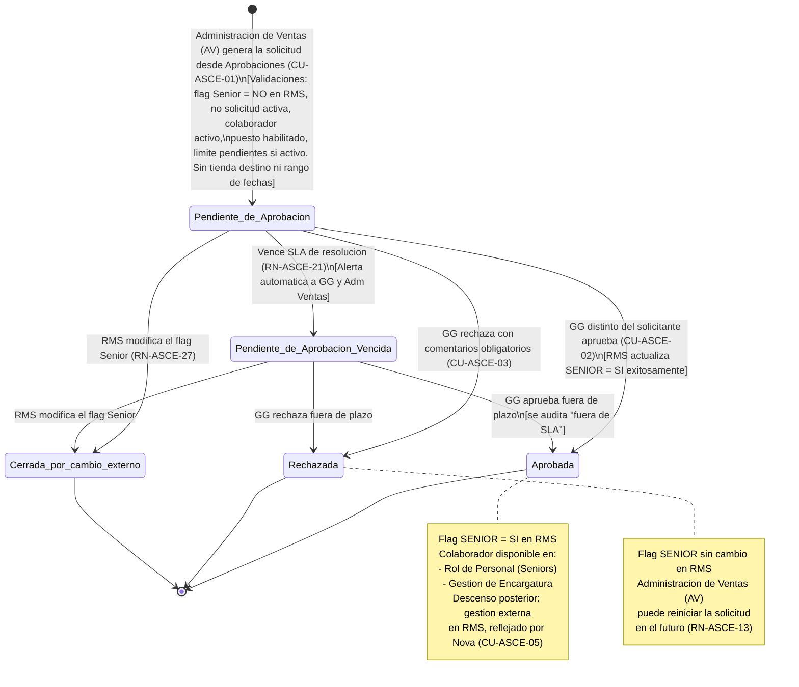

# ESPECIFICACION DE NECESIDADES TECNOLOGICAS
## ENT-MOD-ASCE-001 — Modulo de Ascenso Senior
### Sistema Nova | Organizacion Retail Peruana (Cadena / Lukers)

| Campo | Valor |
|---|---|
| Codigo de documento | ENT-MOD-ASCE-001 |
| Version | 1.3 |
| Fecha de emision | 29/05/2026 |
| Fecha de actualizacion | 31/05/2026 |
| Estado | BORRADOR — Vacios de negocio CERRADOS por el PO / Listo para validacion. Reconciliado con reconciliacion-ux.md (C-01 / H-02 / H-04). Unico pendiente: VAC-ASCE-06 (tecnico, derivado al Arquitecto) |
| Elaborado por | Analista Funcional Senior |
| Sistema | Nova |
| Modulo | Ascenso Senior |
| Documentos relacionados | ENT-MOD-ROLP-001 v1.1, ENT-MOD-ENCA-001 v1.1, ENT-MOD-VAC-001 v1.1, ENT-MOD-MARC-001 v1.1, ENT-MOD-SEGU-001 (rol R-GG-SUP), ENT-MOD-APRO-001 (modulo transversal Aprobaciones — punto de entrada y resolucion del ascenso), Modulo transversal Maestros/Configuracion (alcance-nova.md), reconciliacion-ux.md v1.0 (C-01 / H-02 / H-04) |

### Historial de versiones

| Version | Fecha | Descripcion |
|---|---|---|
| 1.0 | 29/05/2026 | Emision inicial. Especificacion funcional base del modulo Ascenso Senior. Vacios documentados VAC-ASCE-01 a VAC-ASCE-12. |
| 1.1 | 30/05/2026 | Resolucion de los 12 vacios funcionales. Se incorporan nuevas reglas de negocio (RN-ASCE-18 a RN-ASCE-30), nuevo caso de uso CU-ASCE-05 (registro de descenso del flag Senior), nuevo estado "Pendiente de Aprobacion (Vencida)" en la maquina de estados, definicion del historial de cumplimiento (metricas y snapshot), criterio minimo de elegibilidad parametrizable, manejo de auto-solicitud del GG, suplencia de aprobacion y reglas diferenciales por empresa. Vacios tecnicos derivados al Arquitecto (VAC-ASCE-06). Vacios resueltos: 01 (resuelto con opciones para confirmacion PO), 02 (resuelto con opcion para PO), 03 (resuelto con opcion para PO), 04 (resuelto con opcion para PO), 05 (RESUELTO), 06 (DERIVADO A ARQUITECTURA), 07 (resuelto con opcion para PO), 08 (RESUELTO), 09 (RESUELTO), 10 (RESUELTO), 11 (resuelto con opciones para PO), 12 (RESUELTO). |
| 1.2 | 30/05/2026 | Cierre de los 6 vacios que estaban pendientes de confirmacion del PO, con las decisiones confirmadas por la usuaria: VAC-ASCE-01 (Opcion A — Nova solo refleja el descenso; Opcion B fuera de alcance), VAC-ASCE-02 (notificacion al colaborador ascendido = SI confirmado), VAC-ASCE-03 y VAC-ASCE-07 (rol formal GG Suplente R-GG-SUP de ENT-MOD-SEGU-001 como unico aprobador habilitado cuando el GG es solicitante; no "cualquier GG"), VAC-ASCE-04 (SLA = 5 dias habiles, alerta a GG/GZ/Adm. Ventas), VAC-ASCE-11 (sin umbral automatico de bloqueo; panel de historial de cumplimiento de los ultimos 6 meses OBLIGATORIO en la vista de solicitud para decision informada del GG). Se eliminan las marcas de "requiere confirmacion del PO". TODOS los vacios de negocio quedan CERRADOS. Unico pendiente: VAC-ASCE-06 (contrato tecnico del endpoint RMS), que permanece DERIVADO AL ARQUITECTO. |
| 1.3 | 31/05/2026 | Reconciliacion con el prototipo (reconciliacion-ux.md — hallazgos C-01 / H-02 / H-04). Cambios: (1) El flujo de Ascenso Senior se gestiona en el modulo transversal de APROBACIONES, no en Gestion de Equipos. La accion "Ascenso Senior" se retira de Gestion de Equipos; alli solo se muestra un badge "Senior" de solo lectura. (2) Cambio de actor: el PROMOTOR/SOLICITANTE pasa a ser ADMINISTRACION DE VENTAS (AV); ya NO son el GZ ni el GG. El aprobador sigue siendo el GG (con GG Suplente R-GG-SUP para la segregacion cuando aplique). (3) Se aclara que el Ascenso Senior NO tiene "tienda destino" ni "rango de fechas" ni confirmacion directa: es la promocion al flag Senior con panel obligatorio de cumplimiento de 6 meses + aprobacion del GG. (4) Iconografia: badge "Senior" explicito para identificar Seniors; icono de accion de ascenso (sugerido triangulo ascendente) reservado a Aprobaciones. Se actualizan actores (ROL-01), casos de uso (CU-ASCE-01 a CU-ASCE-04), reglas (RN-ASCE-05, RN-ASCE-18, RN-ASCE-24), entidades, permisos e integraciones en consecuencia. |

---

## INDICE

1. Introduccion y Objetivo del Modulo
2. Alcance y Exclusiones
3. Actores y Roles
4. Casos de Uso Principales
5. Reglas de Negocio
6. Estados y Transiciones de la Solicitud
7. Entidades y Atributos Principales
8. Permisos por Rol
9. Integraciones
10. Vacios Funcionales y Preguntas Abiertas

---

## 1. INTRODUCCION Y OBJETIVO DEL MODULO

### 1.1 Contexto del negocio

Nova es un sistema de gestion desarrollado desde cero para una organizacion retail peruana con aproximadamente 100 tiendas distribuidas en multiples zonas geograficas. El grupo empresarial opera bajo dos cadenas comerciales: **Cadena** y **Lukers**. La semana laboral del sistema se define de **domingo a sabado** y es consistente con todos los modulos del sistema.

La categoria Senior es el nivel de rol operativo de mayor responsabilidad dentro de la estructura de tienda. Un colaborador ascendido a Senior queda habilitado para:

- Ser programado en el Rol de Personal con estados de Cobertura de Tienda y Cobertura por Tipo de Venta.
- Ser asignado como encargado en el modulo de Gestion de Encargatura.
- Asumir responsabilidades de cobertura que impactan en cuotas, control de nomina y trazabilidad operativa.

El mecanismo de ascenso a Senior no existe actualmente como proceso sistematizado. La habilitacion del flag "SENIOR" en RMS se realiza de forma manual y sin un flujo de solicitud, validacion de historico de cumplimiento ni trazabilidad centralizada en Nova.

> Nota de reconciliacion (C-01 / H-02): El flujo de Ascenso Senior se gestiona integramente en el modulo transversal de APROBACIONES (no en Gestion de Equipos). El ascenso a Senior es una PROMOCION al flag Senior; NO tiene "tienda destino", NO tiene "rango de fechas" y NO admite confirmacion directa. Consiste exclusivamente en: solicitud iniciada por Administracion de Ventas (AV) + panel obligatorio de cumplimiento de los ultimos 6 meses + aprobacion del GG (con GG Suplente R-GG-SUP para segregacion). En Gestion de Equipos solo se muestra un badge "Senior" de solo lectura para identificar a quien ya es Senior (H-04).

### 1.2 Problema que resuelve

La organizacion carece de un flujo formal y trazable para:

- Solicitar el ascenso de un asesor a la categoria Senior desde el modulo transversal de Aprobaciones, con Administracion de Ventas (AV) como promotor/solicitante.
- Validar el historial de cumplimiento del asesor (ultimos 6 meses) antes de aprobar el ascenso.
- Registrar la decision de Gerencia General (aprobacion o rechazo con comentarios), con segregacion via GG Suplente (R-GG-SUP) cuando aplique.
- Actualizar automaticamente el flag "SENIOR" en RMS una vez aprobado.
- Habilitar al nuevo Senior en el Rol de Personal y en el modulo de Encargatura sin intervencion manual adicional.

### 1.3 Objetivo del modulo

Proveer el flujo de solicitud, evaluacion y aprobacion del ascenso de un asesor a la categoria Senior en Nova, permitiendo:

- Registrar solicitudes de ascenso iniciadas por Administracion de Ventas (AV) desde el modulo transversal de Aprobaciones (NO desde Gestion de Equipos).
- Presentar a Gerencia General el historial de cumplimiento del candidato en los ultimos 6 meses para apoyar la decision (panel obligatorio).
- Gestionar la aprobacion o el rechazo con comentarios por parte de Gerencia General, con segregacion via GG Suplente (R-GG-SUP) cuando aplique.
- Al aprobar: actualizar el flag "SENIOR = SI" en RMS via API en tiempo real, habilitar al colaborador para programacion Senior en el Rol de Personal y para asignacion de encargaturas que requieren perfil Senior.
- Mantener historial completo y auditable de todas las solicitudes de ascenso (aprobadas, rechazadas y pendientes).

### 1.4 Relacion con otros modulos

- **Modulo transversal de Aprobaciones (ENT-MOD-APRO-001):** Es el punto de entrada y de resolucion del flujo de ascenso. Administracion de Ventas (AV) inicia la solicitud desde Aprobaciones y el GG (o GG Suplente R-GG-SUP) la resuelve alli. El modulo de Ascenso Senior aporta las reglas, el panel de cumplimiento de 6 meses y la integracion con RMS; el modulo de Aprobaciones provee la bandeja, el ruteo, la segregacion y los SLAs (C-01 / H-02).
- **Modulo de Gestion de Equipos (App Movil Nova):** NO es punto de entrada del ascenso. Solo muestra un badge "Senior" de solo lectura que indica quien ya es Senior (H-04). La accion de ascenso fue retirada de Gestion de Equipos.
- **Modulo de Rol de Personal (ENT-MOD-ROLP-001):** Al aprobar el ascenso, el colaborador queda habilitado para ser programado como Senior (Proyecto) en el calendario semanal. El modulo de Rol de Personal consulta el flag Senior desde RMS; la actualizacion es inmediata via API.
- **Modulo de Gestion de Encargatura (ENT-MOD-ENCA-001):** Al aprobar el ascenso, el colaborador puede ser asignado a encargaturas que requieren perfil Senior. El modulo de Encargatura valida el flag Senior en RMS en tiempo real.
- **Modulo de Vacaciones (ENT-MOD-VAC-001):** El estado de vacaciones del colaborador es independiente del flujo de ascenso. El ascenso entra en vigor al momento de la aprobacion, independientemente de si el colaborador esta en periodo vacacional activo o programado.
- **RMS (API externa):** Fuente de verdad del flag "SENIOR" por colaborador. Al aprobar el ascenso, Nova actualiza el campo "SENIOR" = "SI" en RMS via API en tiempo real. RMS es tambien la fuente del historial de cumplimiento consultado durante el proceso de evaluacion.

---

## 2. ALCANCE Y EXCLUSIONES

### 2.1 Dentro del alcance

| # | Funcionalidad |
|---|---|
| 1 | Iniciacion de solicitud de ascenso a Senior desde el modulo transversal de Aprobaciones por Administracion de Ventas (AV), seleccionando al asesor candidato. NO se inicia desde Gestion de Equipos ni admite "tienda destino", "rango de fechas" ni "temporal/permanente": es una promocion al flag Senior. |
| 2 | Confirmacion de intencion de ascenso mediante dialogo modal antes de generar la solicitud. |
| 3 | Generacion y registro de la solicitud de ascenso con estado inicial "Pendiente de Aprobacion". |
| 4 | Presentacion a Gerencia General de la solicitud con datos del asesor: tienda base e historial de cumplimiento de los ultimos 6 meses (panel obligatorio). |
| 5 | Aprobacion de la solicitud por Gerencia General (o GG Suplente R-GG-SUP cuando aplique) con actualizacion automatica del flag "SENIOR = SI" en RMS via API en tiempo real. |
| 6 | Habilitacion automatica del colaborador para programacion como Senior en el Rol de Personal y para asignacion en Gestion de Encargatura al aprobar. |
| 7 | Rechazo de la solicitud por Gerencia General con comentarios obligatorios. |
| 8 | Notificacion automatica a Administracion de Ventas (AV) solicitante sobre el resultado (aprobacion o rechazo con comentarios). |
| 9 | Historial de solicitudes de ascenso con filtros por empresa, tienda, colaborador, estado y rango de fechas. |
| 10 | Vista de detalle de cada solicitud con datos completos: solicitante, candidato, historial de cumplimiento, fecha de solicitud, fecha de resolucion, decision y comentarios. |
| 11 | Registro completo de auditoria por cada evento del ciclo de vida de la solicitud. |
| 12 | Exportacion del historial de solicitudes a Excel segun ambito del perfil. |

### 2.2 Fuera del alcance

| # | Exclusion | Modulo o sistema responsable |
|---|---|---|
| 1 | Administracion del maestro de empleados, puestos y flag Senior en RMS | RMS (sistema externo) |
| 2 | Programacion semanal del colaborador como Senior en el calendario | ENT-MOD-ROLP-001 |
| 3 | Registro y gestion de encargaturas del colaborador ascendido | ENT-MOD-ENCA-001 |
| 4 | Iniciacion del descenso o revocacion del flag Senior de un colaborador (la DECISION y EJECUCION del descenso). Nova SI refleja, registra y notifica el descenso detectado en RMS (CU-ASCE-05) | RMS / RRHH (gestion externa; VAC-ASCE-01 CERRADO — Opcion A confirmada por el PO; flujo iniciado desde Nova fuera de alcance) |
| 5 | Calculo de incremento salarial o cambio de puesto derivado del ascenso | Sistema de RRHH / RMS |
| 6 | Gestion de vacaciones, licencias o descansos del colaborador | ENT-MOD-VAC-001, ENT-MOD-DESC-001 |
| 7 | Control de marcaciones del colaborador ascendido | ENT-MOD-MARC-001 |
| 8 | Evaluacion de desempeno o KPIs fuera del historial de cumplimiento de los ultimos 6 meses | Sistema de RRHH |

---

## 3. ACTORES Y ROLES

| ID | Rol | Descripcion | Ambito |
|---|---|---|---|
| ROL-01 | Administracion de Ventas (AV) | PROMOTOR / SOLICITANTE del ascenso (cambio C-01 / H-02; antes esta funcion la tenian GZ/GG). Inicia y registra la solicitud de ascenso a Senior desde el modulo transversal de Aprobaciones, seleccionando al asesor candidato. No puede aprobar ni rechazar solicitudes (segregacion: el solicitante no resuelve). Tambien tiene acceso de consulta y supervision del historial de solicitudes. | Central |
| ROL-02 | Gerencia General (GG) | Recibe la solicitud de ascenso en su bandeja de Aprobaciones, visualiza el panel obligatorio de historial de cumplimiento del candidato (ultimos 6 meses) y toma la decision de aprobar o rechazar con comentarios. NO inicia solicitudes (la iniciacion es competencia de AV). | Central / Multi-zona |
| ROL-03 | Gerente Zonal (GZ) | Acceso de consulta del historial de solicitudes de ascenso de los asesores de su zona. Solo lectura. NO inicia, aprueba ni rechaza solicitudes (la iniciacion paso a AV; la resolucion es del GG/GG Suplente). En Gestion de Equipos visualiza el badge "Senior" de solo lectura. | Zona (multi-tienda) |
| ROL-05 | Gerencia General Suplente (GG Suplente) — rol formal R-GG-SUP definido en el modulo de Seguridad ENT-MOD-SEGU-001 | Rol formal de aprobacion alternativa para garantizar la SEGREGACION. Resuelve (aprueba/rechaza) cuando esta designado como suplente vigente ante ausencia del GG titular, y cuando exista cualquier conflicto de segregacion entre solicitante y aprobador (ver nota de segregacion). No es "cualquier GG": debe poseer el rol formal R-GG-SUP. Mismas capacidades de resolucion que el GG titular dentro de su habilitacion. | Central / Multi-zona |
| ROL-04 | Administrador del Sistema | Configuracion de parametros del modulo: definicion del periodo de historial evaluado (fijo en 6 meses por decision del PO), criterios de presentacion, parametros de notificaciones y SLA de resolucion. Sin capacidad de iniciar, aprobar ni rechazar solicitudes. | Central |

**Notas:**
- El asesor candidato es el sujeto de la solicitud; no opera el modulo directamente. Recibe notificacion automatica si se aprueba su ascenso (configurable en parametros; VAC-ASCE-02 RESUELTO — ver RN-ASCE-11 y RN-ASCE-22).
- El Gerente de Tienda (GT) no tiene acceso a este modulo. La iniciacion de la solicitud de ascenso es competencia exclusiva de Administracion de Ventas (AV); la resolucion, del GG (o GG Suplente).
- Cambio de actor (C-01 / H-02): el promotor/solicitante es ahora Administracion de Ventas (AV); ya NO son el GZ ni el GG. El aprobador sigue siendo el GG. La segregacion de funciones "solicitante distinto de aprobador" se cumple de forma natural porque AV (solicitante) y GG (aprobador) son roles distintos. Cuando por la configuracion organizacional un mismo usuario pudiera ser a la vez solicitante y aprobador, o ante ausencia del GG, la resolucion la realiza un usuario con rol formal GG Suplente (R-GG-SUP) (ver RN-ASCE-18 y RN-ASCE-19).
- El rol GG Suplente (R-GG-SUP) y su asignacion/vigencia se administran en el modulo de Seguridad ENT-MOD-SEGU-001; la delegacion operativa se orquesta via el modulo transversal de Aprobaciones (ENT-MOD-APRO-001). Este modulo de Ascenso Senior consume el aprobador habilitado (RN-ASCE-19).

> ⚠️ DATO SENSIBLE — El historial de cumplimiento del candidato (porcentajes de cuota, rendimiento como Senior) es un dato de desempeno personal del colaborador. Acceso limitado a Administracion de Ventas (AV) (solicitante), GG, GG Suplente (R-GG-SUP) y GZ del ambito del candidato (solo consulta), exclusivamente para la decision de ascenso. No se exporta fuera del modulo ni se comparte con terceros. Los ejemplos de este documento usan datos ficticios.

---

## 4. CASOS DE USO PRINCIPALES

---

### CU-ASCE-01: Solicitar ascenso a Senior

```
ID: CU-ASCE-01
Nombre: Solicitar el ascenso de un asesor a la categoria Senior
Actor principal: Administracion de Ventas (AV)
Relacionado: RN-ASCE-01, RN-ASCE-02, RN-ASCE-03, RN-ASCE-04, RN-ASCE-05, RN-ASCE-06, RN-ASCE-23, RN-ASCE-24, RN-ASCE-26, RN-ASCE-30
```

**Precondicion:**
- El usuario ha iniciado sesion en Nova con perfil Administracion de Ventas (AV).
- El usuario se encuentra en el modulo transversal de Aprobaciones, en la accion de iniciar una solicitud de ascenso a Senior, y selecciona al asesor candidato (NO desde Gestion de Equipos).
- El asesor tiene estado activo en RMS.
- El asesor no tiene el flag "SENIOR = SI" activo en RMS (RN-ASCE-01).
- No existe una solicitud de ascenso en estado "Pendiente de Aprobacion" para el mismo asesor (RN-ASCE-02).
- No existe criterio automatico de bloqueo por cumplimiento: la elegibilidad la decide el GG con base en el historial de los ultimos 6 meses que el sistema presenta de forma obligatoria (RN-ASCE-23, RN-ASCE-06).
- El ascenso NO captura "tienda destino", "rango de fechas" ni modalidad "temporal/permanente": es una promocion al flag Senior.

**Flujo principal:**
1. El usuario (AV) selecciona al asesor candidato e inicia la solicitud de ascenso a Senior desde el modulo de Aprobaciones.
2. El sistema muestra un dialogo de confirmacion: "Desea solicitar el ascenso a Senior para [Nombre del colaborador]? Esta accion generara una solicitud para Gerencia General."
3. El usuario confirma la accion.
4. El sistema ejecuta las validaciones en tiempo real contra RMS y la base de Nova, en este orden: (a) estado activo del colaborador (RN-ASCE-03), (b) flag Senior = NO (RN-ASCE-01), (c) puesto habilitado (RN-ASCE-04), (d) no existe solicitud pendiente para el mismo colaborador (RN-ASCE-02), (e) limite de solicitudes pendientes por zona/GZ no superado, si esta activo (RN-ASCE-24). No se aplica ningun bloqueo automatico por nivel de cumplimiento (RN-ASCE-23).
5. Si todas las validaciones son exitosas, el sistema captura el snapshot del historial de cumplimiento del colaborador de los ultimos 6 meses desde RMS al momento de la solicitud (RN-ASCE-26, RN-ASCE-06) y genera el registro de solicitud de ascenso con:
   - Datos del candidato: codigo, nombre, puesto, empresa, tienda base.
   - Datos del solicitante: usuario AV, rol, fecha y hora de solicitud.
   - Snapshot del historial de cumplimiento de los ultimos 6 meses (congelado a la fecha de solicitud).
   - Estado inicial: "Pendiente de Aprobacion".
   - El registro NO contiene "tienda destino", "rango de fechas" ni modalidad "temporal/permanente" (C-01 / H-02).
6. El sistema encola la solicitud en la bandeja de Aprobaciones del GG y envia una notificacion a Gerencia General informando que existe una nueva solicitud de ascenso pendiente de revision (RN-ASCE-10).
7. El sistema muestra al usuario (AV) confirmacion: "La solicitud de ascenso ha sido enviada a Gerencia General correctamente."
8. El registro queda disponible en el historial de solicitudes con estado "Pendiente de Aprobacion".

**Flujos alternos:**
- A1. El asesor ya tiene el flag "SENIOR = SI" activo en RMS: el sistema muestra el mensaje "El colaborador ya cuenta con la categoria Senior. No es posible generar una nueva solicitud." y no crea el registro (RN-ASCE-01).
- A2. Ya existe una solicitud en estado "Pendiente de Aprobacion" para el mismo asesor: el sistema muestra el mensaje "Ya existe una solicitud de ascenso pendiente para este colaborador. Espere la resolucion antes de generar una nueva." y no crea el registro (RN-ASCE-02).
- A3. El usuario cancela el dialogo de confirmacion: no se genera ningun registro y la pantalla regresa al perfil del asesor.
- A4. El asesor tiene estado inactivo en RMS: el sistema muestra el mensaje "El colaborador no esta activo en el sistema. No es posible generar una solicitud de ascenso." y bloquea la accion (RN-ASCE-03).
- A5. El puesto del asesor no esta en el catalogo de puestos habilitados (RN-ASCE-04): el sistema no presenta al asesor como candidato seleccionable; si la accion se intenta por otra via, muestra "El puesto del colaborador no esta habilitado para el ascenso a Senior." y bloquea.
- A6. Se ha alcanzado el limite maximo de solicitudes pendientes (RN-ASCE-24, si esta activo): el sistema muestra el mensaje "Ha alcanzado el numero maximo de solicitudes de ascenso pendientes permitidas. Espere la resolucion de las solicitudes en curso." y bloquea la generacion. (Nota: no existe bloqueo por nivel de cumplimiento; la elegibilidad la decide el GG, RN-ASCE-23.)

**Excepciones:**
- E1. RMS no responde al validar el flag Senior o al capturar el historial de cumplimiento: el sistema muestra mensaje "No es posible validar el estado del colaborador en este momento. Intente nuevamente mas tarde." y no genera la solicitud hasta restablecer la conexion.
- E2. Error de red en la app movil: el sistema muestra mensaje de error generico y no genera la solicitud.

**Postcondicion:**
- La solicitud de ascenso queda registrada en estado "Pendiente de Aprobacion" con trazabilidad completa del usuario solicitante (AV), fecha y hora.
- La solicitud queda encolada en la bandeja de Aprobaciones del GG y Gerencia General recibio notificacion de nueva solicitud pendiente.
- El historial de solicitudes refleja el nuevo registro.

---

### CU-ASCE-02: Aprobar ascenso a Senior

```
ID: CU-ASCE-02
Nombre: Aprobar la solicitud de ascenso a Senior por Gerencia General
Actor principal: GG, GG Suplente (R-GG-SUP)
Relacionado: RN-ASCE-06, RN-ASCE-07, RN-ASCE-08, RN-ASCE-09, RN-ASCE-10, RN-ASCE-11, RN-ASCE-12, RN-ASCE-18, RN-ASCE-19
```

**Precondicion:**
- El GG (o un usuario con rol formal GG Suplente R-GG-SUP) ha iniciado sesion en Nova (web o app movil) y accede a su bandeja de Aprobaciones.
- Existe al menos una solicitud en estado "Pendiente de Aprobacion" o "Pendiente de Aprobacion (Vencida)".
- El usuario aprobador es distinto del usuario que origino la solicitud (RN-ASCE-18). Dado que el solicitante es Administracion de Ventas (AV) y el aprobador es el GG, la segregacion se cumple por defecto.
- Si por configuracion organizacional el aprobador coincidiera con el solicitante, o el GG titular estuviera ausente, el aprobador debe poseer el rol R-GG-SUP (RN-ASCE-18, RN-ASCE-19).
- El GG accede al detalle de la solicitud que desea resolver.

**Flujo principal:**
1. El GG accede al listado de solicitudes de ascenso y selecciona una solicitud en estado "Pendiente de Aprobacion".
2. El sistema muestra el detalle de la solicitud con la siguiente informacion:
   - Datos del candidato: codigo de empleado, nombre completo, puesto, empresa, tienda base.
   - Datos del solicitante: nombre, rol, fecha y hora de solicitud.
   - Historial de cumplimiento de los ultimos N meses del candidato (RN-ASCE-06, RN-ASCE-25), tomado del snapshot capturado al momento de la solicitud (RN-ASCE-26). El detalle indica la fecha de captura del snapshot. El GG puede solicitar opcionalmente una actualizacion del historial a datos frescos de RMS mediante un boton "Actualizar historial" (RN-ASCE-26).
3. El GG (distinto del solicitante; RN-ASCE-18) revisa la informacion y hace clic en "Aprobar".
4. El sistema muestra dialogo de confirmacion: "Confirma la aprobacion del ascenso a Senior para [Nombre del colaborador]?"
5. El GG confirma la aprobacion.
6. El sistema ejecuta las siguientes acciones en orden:
   a. Actualiza el estado de la solicitud a "Aprobada".
   b. Llama a la API de RMS para actualizar el campo "SENIOR" = "SI" del colaborador en tiempo real (RN-ASCE-07).
   c. Registra la fecha y hora de aprobacion, el usuario aprobador y los comentarios si existen.
   d. Registra el evento en el historial de auditoria.
7. El sistema envia notificacion automatica a Administracion de Ventas (AV) solicitante informando que la solicitud fue aprobada (RN-ASCE-10).
8. Si la notificacion al colaborador esta habilitada en parametros, el sistema envia notificacion al colaborador ascendido (RN-ASCE-11).
9. El sistema muestra confirmacion al GG: "El ascenso ha sido aprobado. El colaborador ya esta habilitado como Senior en el sistema."

**Flujos alternos:**
- A1. La API de RMS devuelve error al intentar actualizar el flag Senior: el sistema no actualiza el estado de la solicitud a "Aprobada", revierte la accion, muestra mensaje de error "No fue posible actualizar el estado en RMS. La solicitud permanece pendiente. Intente nuevamente." y registra el intento fallido en auditoria (RN-ASCE-12).
- A2. El GG cancela el dialogo de confirmacion: la solicitud permanece en estado "Pendiente de Aprobacion" sin cambios.
- A3. El GG desea agregar comentarios antes de aprobar: el sistema muestra campo de texto libre "Comentarios (opcional)" antes del dialogo de confirmacion. Los comentarios quedan registrados en el registro de la solicitud.
- A4. Conflicto de segregacion (el usuario que abre la solicitud es a la vez el solicitante, o el GG titular esta ausente): el sistema bloquea los botones "Aprobar" y "Rechazar" para el solicitante y muestra el mensaje "Por segregacion de funciones, esta solicitud debe ser resuelta por un Gerente General Suplente (R-GG-SUP)." La solicitud queda disponible para resolucion unicamente por un usuario con rol R-GG-SUP (RN-ASCE-18, RN-ASCE-19).
- A5. La solicitud esta en estado "Pendiente de Aprobacion (Vencida)" por superar el SLA: el GG puede igualmente aprobarla; el sistema procesa la aprobacion con normalidad y deja constancia en auditoria de que la resolucion ocurrio fuera de plazo (RN-ASCE-21).

**Excepciones:**
- E1. RMS no esta disponible al momento de la aprobacion: el sistema bloquea la aprobacion y muestra mensaje de error de integracion. No se permite aprobar sin confirmar la actualizacion en RMS.

**Postcondicion:**
- La solicitud queda en estado "Aprobada" con fecha, hora y usuario de aprobacion registrados.
- El flag "SENIOR = SI" queda actualizado en RMS en tiempo real.
- El colaborador queda disponible automaticamente para:
  - Ser programado como Senior (Proyecto) en el Rol de Personal (ENT-MOD-ROLP-001).
  - Ser asignado a encargaturas que requieren perfil Senior en el modulo de Gestion de Encargatura (ENT-MOD-ENCA-001).
- Administracion de Ventas (AV) solicitante recibio notificacion del resultado.
- El historial de auditoria refleja el evento completo.

---

### CU-ASCE-03: Rechazar solicitud de ascenso

```
ID: CU-ASCE-03
Nombre: Rechazar la solicitud de ascenso a Senior por Gerencia General
Actor principal: GG
Relacionado: RN-ASCE-08, RN-ASCE-09, RN-ASCE-10, RN-ASCE-13
```

**Precondicion:**
- El GG ha iniciado sesion en Nova (web o app movil).
- Existe al menos una solicitud en estado "Pendiente de Aprobacion".
- El GG accede al detalle de la solicitud que desea rechazar.

**Flujo principal:**
1. El GG accede al detalle de la solicitud de ascenso en estado "Pendiente de Aprobacion".
2. El sistema muestra el detalle de la solicitud con datos del candidato, del solicitante y el historial de cumplimiento de los ultimos 6 meses (RN-ASCE-06).
3. El GG hace clic en "Rechazar".
4. El sistema muestra el campo obligatorio "Motivo del rechazo" (texto libre, maximo de caracteres parametrizable) y el boton "Confirmar Rechazo" (RN-ASCE-09).
5. El GG ingresa el motivo del rechazo y confirma.
6. El sistema actualiza el estado de la solicitud a "Rechazada" y registra: usuario que rechaza, fecha, hora y motivo del rechazo.
7. El sistema registra el evento en el historial de auditoria.
8. El sistema envia notificacion automatica a Administracion de Ventas (AV) solicitante informando que la solicitud fue rechazada, incluyendo el motivo (RN-ASCE-10).
9. El sistema muestra confirmacion al GG: "La solicitud ha sido rechazada. Administracion de Ventas ha sido notificada."

**Flujos alternos:**
- A1. El GG intenta confirmar el rechazo sin ingresar el motivo: el sistema bloquea la accion y muestra el mensaje "El motivo del rechazo es obligatorio. Por favor ingrese un comentario." (RN-ASCE-09).
- A2. El GG cancela la accion de rechazo: la solicitud permanece en estado "Pendiente de Aprobacion" sin cambios.

**Excepciones:**
- E1. Error al guardar el registro: el sistema muestra mensaje de error y no actualiza el estado de la solicitud.

**Postcondicion:**
- La solicitud queda en estado "Rechazada" con fecha, hora, usuario y motivo del rechazo registrados.
- El flag "SENIOR" del colaborador en RMS no es modificado.
- El colaborador no queda habilitado para programacion Senior ni para asignacion en encargaturas Senior.
- Administracion de Ventas (AV) solicitante recibio notificacion con el motivo del rechazo.
- Administracion de Ventas puede generar una nueva solicitud para el mismo colaborador en el futuro (RN-ASCE-13).

---

### CU-ASCE-04: Consultar historial de solicitudes de ascenso

```
ID: CU-ASCE-04
Nombre: Consultar el historial de solicitudes de ascenso con filtros
Actor principal: Administracion de Ventas (AV), GG, GZ
Relacionado: RN-ASCE-14, RN-ASCE-15, RN-ASCE-16, RN-ASCE-17
```

**Precondicion:**
- El usuario ha iniciado sesion en Nova con perfil Administracion de Ventas (AV), GG o GZ.
- El usuario accede al modulo de Ascenso Senior o a la seccion de historial de solicitudes.

**Flujo principal:**
1. El usuario accede al historial de solicitudes de ascenso.
2. El sistema carga el listado con los filtros por defecto: todas las solicitudes del mes en curso ordenadas por fecha de solicitud descendente (mas reciente primero) (RN-ASCE-14).
3. El sistema aplica automaticamente la restriccion de ambito segun el perfil del usuario (RN-ASCE-15):
   - Administracion de Ventas (AV): ve todas las solicitudes sin restriccion de ambito (incluye las que el mismo genero como solicitante).
   - GG: ve todas las solicitudes sin restriccion de ambito.
   - GZ: solo ve las solicitudes que correspondan a asesores de su zona (solo lectura).
4. Cada fila del listado muestra: Empresa, Tienda base del candidato, Codigo del candidato, Nombre del candidato, Puesto, Solicitante (AV), Fecha de solicitud, Estado, Fecha de resolucion (si aplica).
5. El usuario aplica filtros disponibles: Empresa, Tienda, Codigo de empleado, Solicitante, Estado, Fecha de solicitud (desde / hasta). Todos los filtros son opcionales y se aplican de forma combinada.
6. El sistema recarga el listado segun los filtros seleccionados.
7. El usuario puede hacer clic en un registro para ver su detalle completo (datos del candidato, historial de cumplimiento, datos del solicitante, decision del GG, comentarios).
8. El usuario puede exportar el listado filtrado a Excel (RN-ASCE-16).

**Flujos alternos:**
- A1. No existen solicitudes para los filtros seleccionados: el sistema muestra el listado vacio con mensaje informativo "No se encontraron solicitudes de ascenso para los criterios seleccionados."
- A2. El usuario tiene perfil GZ: el sistema filtra automaticamente los registros al ambito de sus tiendas asignadas. No puede ver solicitudes de otras zonas (RN-ASCE-15). Al exportar, solo exporta registros de su zona.
- A3. El GG (o GG Suplente vigente) accede al detalle de una solicitud en estado "Pendiente de Aprobacion" o "Pendiente de Aprobacion (Vencida)": el sistema habilita las opciones "Aprobar" y "Rechazar" directamente desde la vista de detalle (acceso directo a CU-ASCE-02 y CU-ASCE-03), siempre que el usuario no sea el solicitante (RN-ASCE-18).
- A4. El usuario accede a una solicitud en la que el mismo es el solicitante (conflicto de segregacion): el sistema muestra el detalle en modo lectura, sin botones "Aprobar"/"Rechazar"; la resolucion la realiza un usuario R-GG-SUP (RN-ASCE-18).

**Excepciones:**
- E1. Error de conexion al consultar la base de datos: el sistema muestra mensaje de error y no carga el listado.

**Postcondicion:**
- El listado de solicitudes queda visible con los filtros aplicados.
- El usuario puede navegar por los registros y exportar segun su ambito.

---

### CU-ASCE-05: Registrar y reflejar el descenso/revocacion del flag Senior

```
ID: CU-ASCE-05
Nombre: Reflejar en Nova el descenso o revocacion del flag Senior gestionado en RMS
Actor principal: Sistema Nova (automatismo) / Administracion de Ventas (consulta)
Relacionado: RN-ASCE-20, RN-ASCE-27, RN-ASCE-28
```

> Nota de alcance (DECISION CONFIRMADA POR EL PO — VAC-ASCE-01, Opcion A): La iniciacion del descenso (revertir el flag "SENIOR" a "NO") NO se realiza dentro de Nova. La decision y ejecucion del descenso es competencia de RMS / RRHH (gestion externa). Nova SOLO detecta el cambio, lo registra y notifica para mantener la trazabilidad operativa. La construccion de un flujo de descenso iniciado desde Nova (Opcion B) queda explicitamente FUERA DEL ALCANCE actual y se documenta como mejora futura.

**Precondicion:**
- Un colaborador con flag "SENIOR = SI" en RMS es revertido a "SENIOR = NO" por gestion externa en RMS.
- Existe el evento de sincronizacion o consulta mediante el cual Nova detecta el cambio del flag (detalle tecnico derivado al Arquitecto, ligado a VAC-ASCE-06).

**Flujo principal:**
1. Nova detecta, en el siguiente ciclo de sincronizacion/consulta del flag Senior, que un colaborador previamente Senior tiene ahora "SENIOR = NO" en RMS (RN-ASCE-27).
2. El sistema registra un evento de "Descenso detectado" en el historial de auditoria del colaborador, con: codigo de empleado, fecha y hora de deteccion, flag anterior (SI), flag nuevo (NO), origen "RMS (externo)".
3. El sistema marca al colaborador como no habilitado para nueva programacion Senior en el Rol de Personal y para nuevas asignaciones de encargatura Senior. Dado que ambos modulos consultan el flag en RMS en tiempo real, la inhabilitacion es automatica (RN-ASCE-20).
4. El sistema notifica el descenso al GZ del ambito del colaborador y a Gerencia General, si la notificacion de descenso esta habilitada en parametros (RN-ASCE-28).
5. El registro queda disponible en el historial con la traza del descenso.

**Flujos alternos:**
- A1. El colaborador descendido tiene encargaturas Senior en estado "En Ejecucion": estas no se interrumpen automaticamente desde este modulo; el modulo de Encargatura conserva sus reglas. El descenso solo impide nuevas asignaciones. Se genera alerta a Administracion Retail (coordinacion con ENT-MOD-ENCA-001).
- A2. El descenso ocurre sobre un colaborador con solicitud de ascenso "Pendiente de Aprobacion" (caso atipico): la solicitud pendiente se invalida automaticamente con estado interno de cierre y motivo "Flag Senior modificado externamente"; se notifica a Administracion de Ventas (AV) solicitante (RN-ASCE-27).

**Excepciones:**
- E1. RMS no esta disponible durante la sincronizacion: el sistema reintenta segun la politica de reintentos definida por el Arquitecto (VAC-ASCE-06) y registra el reintento en logs.

**Postcondicion:**
- El descenso queda registrado y auditado en Nova.
- El colaborador no puede ser asignado a nuevas programaciones Senior ni encargaturas Senior.
- GZ y GG fueron notificados, si la notificacion esta habilitada.

> Alcance confirmado por el PO (VAC-ASCE-01, Opcion A): este caso de uso se limita a reflejar, registrar y notificar el descenso detectado en RMS. Nova no inicia ni ejecuta el descenso. La Opcion B (flujo de descenso iniciado desde Nova) queda fuera del alcance actual como mejora futura.

---

## 5. REGLAS DE NEGOCIO

### 5.1 Habilitacion del candidato

| ID | Regla | Verificacion |
|---|---|---|
| RN-ASCE-01 | Solo puede generarse una solicitud de ascenso para un colaborador que no tenga el flag "SENIOR = SI" activo en RMS al momento de la solicitud. Si el flag ya es "SI", el sistema bloquea la solicitud con el mensaje "El colaborador ya cuenta con la categoria Senior." La validacion se realiza en tiempo real contra RMS. | Intentar solicitar el ascenso de un colaborador con flag Senior activo y verificar el rechazo y el mensaje. |
| RN-ASCE-02 | No puede existir mas de una solicitud en estado "Pendiente de Aprobacion" para el mismo colaborador de forma simultanea. Si existe una solicitud activa, el sistema bloquea la nueva con el mensaje "Ya existe una solicitud de ascenso pendiente para este colaborador." | Intentar generar una segunda solicitud para el mismo colaborador con una pendiente activa y verificar el rechazo. |
| RN-ASCE-03 | Solo pueden ser candidatos a ascenso los colaboradores con estado activo en RMS. Los colaboradores con baja, suspension o estado inactivo en RMS no pueden ser objeto de solicitud de ascenso. Mensaje de error: "El colaborador no esta activo en el sistema." | Intentar solicitar el ascenso de un colaborador inactivo y verificar el bloqueo. |
| RN-ASCE-04 | El puesto del candidato debe pertenecer al catalogo de puestos habilitados para la categoria Senior, definido en la tabla de parametros del sistema. Los puestos habilitados por defecto son: Asesor, Secretaria-Cajera, Jefe de Piso, Supervisor de Seccion, Promotor. La lista es parametrizable sin desarrollo adicional. Esta lista debe mantenerse consistente con la regla RN-ROLP-32 (candidatos a Senior en Rol de Personal: asesores, promotores y supervisores de seccion) y con RN-ENCA-06 (puestos habilitados para flag Senior). La fuente unica del catalogo es el modulo transversal de Maestros/Configuracion. | Intentar solicitar el ascenso de un colaborador con puesto no habilitado y verificar el rechazo. Verificar que el catalogo sea editable en parametros y consistente entre modulos. |
| RN-ASCE-23 | Criterio de elegibilidad (DECISION DE NEGOCIO CONFIRMADA POR EL PO — VAC-ASCE-11): NO existe ningun umbral automatico que bloquee la solicitud o la aprobacion por bajo cumplimiento. La elegibilidad la decide el GG. Como contrapartida y requisito funcional FIRME: la vista de solicitud y la vista de evaluacion DEBEN presentar de forma OBLIGATORIA el panel de historial de cumplimiento del asesor de los ULTIMOS 6 MESES (ventana fija), para que el GG decida de manera informada. El panel no puede ocultarse ni omitirse. Las metricas del panel se definen en RN-ASCE-25 y se toman del snapshot congelado al momento de la solicitud (RN-ASCE-26). | Verificar que NO exista bloqueo automatico por cumplimiento. Verificar que el panel de historial de los ultimos 6 meses se muestre siempre y de forma obligatoria en la vista de solicitud/evaluacion. Verificar que el GG pueda aprobar o rechazar con base en su criterio. |
| RN-ASCE-24 | Limite de solicitudes pendientes parametrizable: el sistema puede limitar, de forma opcional y configurable, el numero maximo de solicitudes de ascenso en estado "Pendiente de Aprobacion" simultaneas (global y/o por empresa). Controlado por el parametro ASCE_LIMITE_PENDIENTES (0 = sin limite, valor por defecto). Si se supera, el sistema bloquea la nueva solicitud de AV con mensaje informativo. | Configurar un limite y verificar que al alcanzarlo se bloquee la generacion de nuevas solicitudes. Verificar que con valor 0 no exista restriccion. |

### 5.2 Flujo de solicitud

| ID | Regla | Verificacion |
|---|---|---|
| RN-ASCE-05 | La solicitud de ascenso es iniciada exclusivamente por Administracion de Ventas (AV) desde el modulo transversal de Aprobaciones (cambio C-01 / H-02; antes la iniciaban GZ/GG desde Gestion de Equipos). AV selecciona al asesor candidato e inicia el flujo. La solicitud NO captura "tienda destino", "rango de fechas" ni modalidad "temporal/permanente". La accion de ascenso queda RETIRADA de Gestion de Equipos; alli solo se muestra el badge "Senior" de solo lectura (H-04). El aprobador es el GG; AV (solicitante) y GG (aprobador) son roles distintos, por lo que la segregacion se cumple por defecto (RN-ASCE-18). | Verificar que la accion de iniciar ascenso este disponible solo para AV dentro de Aprobaciones. Verificar que NO exista accion de ascenso en Gestion de Equipos (solo badge Senior de lectura). Verificar que ni GT, ni GZ, ni GG puedan iniciar la solicitud. |
| RN-ASCE-06 | Al presentar la solicitud a Gerencia General, el sistema muestra de forma OBLIGATORIA el historial de cumplimiento del candidato de los ULTIMOS 6 MESES calendario (ventana fija confirmada por el PO en VAC-ASCE-11; desde el mes en curso hacia atras). El parametro ASCE_PERIODO_HISTORIAL_MESES queda fijado en 6 como valor de negocio; cualquier cambio futuro requiere decision del PO. El historial se construye a partir del snapshot capturado al momento de la solicitud (RN-ASCE-26) y se obtiene de RMS (misma fuente de los ratios de RN-ROLP-09 y RN-ROLP-10). | Verificar que el panel de historial muestre exactamente los ultimos 6 meses. Verificar que el panel sea obligatorio en la vista de solicitud y de evaluacion. Verificar que los datos provengan de RMS / snapshot. |
| RN-ASCE-25 | Metricas exactas del historial de cumplimiento presentado al GG (alineadas con los ratios del Rol de Personal, RN-ROLP-09 / RN-ROLP-10): por cada uno de los ultimos N meses se muestra (1) % de cumplimiento de cuota como Asesor. Adicionalmente, si el colaborador tuvo roles/encargaturas Senior previas, se muestra (2) % de cumplimiento como Senior por mes. Para empresa Lukers se incluyen ademas las metricas diferenciadas por tipo de venta cuando existan: % Asesoria y % Tesoro (consistente con RN-ENCA-04). La granularidad es mensual. Si el colaborador no tuvo roles Senior previos, las metricas Senior se muestran como "Sin historial Senior" en lugar de 0%. Los porcentajes se presentan con 1 decimal; valores >= 100% en azul y < 100% en rojo, consistente con el Rol de Personal. | Verificar que las metricas mostradas correspondan a las definidas. Verificar el caso de candidato sin historial Senior previo. Verificar diferenciacion Lukers. |

### 5.3 Aprobacion

| ID | Regla | Verificacion |
|---|---|---|
| RN-ASCE-07 | Al aprobar la solicitud, el sistema llama a la API de RMS para actualizar el campo "SENIOR" = "SI" del colaborador en tiempo real. La aprobacion en Nova y la actualizacion en RMS son atomicas: si la llamada a RMS falla, el estado de la solicitud no cambia a "Aprobada" y se mantiene "Pendiente de Aprobacion". No se permite aprobar sin confirmacion de actualizacion exitosa en RMS. | Simular fallo de la API de RMS durante la aprobacion y verificar que el estado de la solicitud no cambie y que el mensaje de error sea informativo. Verificar que tras restablecer RMS la aprobacion sea posible. |
| RN-ASCE-08 | La aprobacion del ascenso requiere confirmacion expresa del GG mediante dialogo de confirmacion. No es posible deshacer una aprobacion desde Nova; cualquier reversion del flag Senior debe gestionarse directamente en RMS fuera de este modulo (ver RN-ASCE-20 y CU-ASCE-05). | Verificar que el dialogo de confirmacion aparezca antes de ejecutar la aprobacion y que no exista opcion de "Deshacer aprobacion" en Nova. |
| RN-ASCE-18 | Segregacion de funciones (DECISION CONFIRMADA POR EL PO — VAC-ASCE-03; reconciliado C-01): el usuario que origino una solicitud de ascenso NO puede aprobarla ni rechazarla. Como el solicitante es Administracion de Ventas (AV) y el aprobador es el GG, la segregacion se cumple de forma natural por ser roles distintos. No obstante, si por la configuracion de cuentas un mismo usuario fuera a la vez solicitante y aprobador, o si el GG titular estuviera ausente, la solicitud SOLO puede ser resuelta por un usuario con el rol formal GG Suplente (R-GG-SUP de ENT-MOD-SEGU-001). El sistema deshabilita los botones "Aprobar" y "Rechazar" para el usuario solicitante. Esta regla materializa el control corporativo de doble validacion con un aprobador de rol formal y trazable. | Verificar que AV (solicitante) no tenga acceso a "Aprobar"/"Rechazar". Verificar que ante coincidencia solicitante=aprobador o ausencia del GG, solo un usuario R-GG-SUP pueda resolver. |
| RN-ASCE-19 | Suplencia de aprobacion (DECISION CONFIRMADA POR EL PO — VAC-ASCE-07): el rol formal GG Suplente (R-GG-SUP) resuelve solicitudes cuando esta designado como suplente vigente ante ausencia del GG titular y cuando exista un conflicto de segregacion (solicitante = aprobador). La asignacion y vigencia del rol R-GG-SUP se administran en el modulo de Seguridad ENT-MOD-SEGU-001 y la delegacion operativa se orquesta via el modulo transversal de Aprobaciones (ENT-MOD-APRO-001). Toda resolucion realizada bajo el rol R-GG-SUP queda registrada en auditoria identificando esa condicion. | Asignar el rol R-GG-SUP a un usuario y verificar que pueda resolver. Verificar que un usuario sin R-GG-SUP no pueda resolver en un escenario de conflicto de segregacion o ausencia del GG. Verificar que la auditoria registre la condicion de suplente. |

### 5.4 Rechazo

| ID | Regla | Verificacion |
|---|---|---|
| RN-ASCE-09 | El rechazo de la solicitud requiere que el GG ingrese obligatoriamente el motivo del rechazo en campo de texto libre. No es posible confirmar el rechazo sin este campo completado. El maximo de caracteres del campo es parametrizable en la tabla de parametros. | Intentar rechazar sin ingresar motivo y verificar el bloqueo y el mensaje. Verificar que el limite de caracteres sea parametrizable. |
| RN-ASCE-13 | Una solicitud rechazada no bloquea la generacion de nuevas solicitudes para el mismo colaborador en el futuro. Administracion de Ventas (AV) puede volver a iniciar el flujo de ascenso para el mismo asesor en cualquier momento posterior al rechazo. | Generar una nueva solicitud para un colaborador cuya solicitud previa fue rechazada y verificar que el sistema lo permita. |

### 5.5 Impacto del ascenso aprobado

| ID | Regla | Verificacion |
|---|---|---|
| RN-ASCE-11-A | Una vez aprobado el ascenso y actualizado el flag "SENIOR = SI" en RMS, el colaborador queda automaticamente disponible para ser programado como Senior (Proyecto) en el Rol de Personal, sin requerir ninguna accion adicional del GZ ni del GG. El modulo de Rol de Personal consulta el flag Senior directamente desde RMS en tiempo real. | Aprobar un ascenso y verificar que el colaborador aparezca disponible en la vista de Seniors del Rol de Personal en la sesion siguiente del GZ. |
| RN-ASCE-11-B | Una vez aprobado el ascenso, el colaborador queda automaticamente habilitado para ser asignado a encargaturas que requieren perfil Senior en el modulo de Gestion de Encargatura. El modulo de Encargatura valida el flag Senior en RMS en tiempo real. No se requiere ninguna accion adicional en el modulo de Encargatura. | Aprobar un ascenso e intentar programar una encargatura para el colaborador. Verificar que la validacion de flag Senior en Encargatura sea exitosa. |
| RN-ASCE-11-C | El ascenso entra en vigor en el momento de la aprobacion por el GG, independientemente del estado de vacaciones, descansos o cualquier otra condicion del colaborador. Si el colaborador esta en periodo vacacional activo, el flag Senior queda registrado en RMS de inmediato y aplicara a partir de su reintegro operativo. | Aprobar el ascenso de un colaborador con vacaciones activas y verificar que el flag Senior quede actualizado en RMS. Verificar que el sistema no bloquee la aprobacion por este motivo. |
| RN-ASCE-20 | Efecto del descenso (revocacion del flag Senior en RMS): cuando RMS revierte el flag a "SENIOR = NO" por gestion externa, el colaborador deja automaticamente de estar habilitado para nuevas programaciones Senior en el Rol de Personal y para nuevas asignaciones de encargatura Senior, dado que ambos modulos validan el flag en RMS en tiempo real. La iniciacion del descenso no es funcionalidad de Nova en v1.1; Nova solo lo refleja, registra y notifica (CU-ASCE-05). | Revertir el flag Senior en RMS y verificar que el colaborador no pueda ser programado como Senior ni asignado a nuevas encargaturas Senior. |

### 5.6 Notificaciones

| ID | Regla | Verificacion |
|---|---|---|
| RN-ASCE-10 | El sistema envia notificacion automatica en los siguientes eventos: (1) Al generar la solicitud: notificacion a GG informando nueva solicitud pendiente en su bandeja de Aprobaciones. (2) Al aprobar: notificacion a Administracion de Ventas (AV) solicitante con resultado positivo. (3) Al rechazar: notificacion a Administracion de Ventas (AV) solicitante con resultado y motivo del rechazo. Las notificaciones se envian por correo electronico y push en app Nova. Son configurables (activar/desactivar) en la tabla de parametros del sistema. | Verificar recepcion de notificaciones en cada evento. Deshabilitar en parametros y verificar que no se envien. |
| RN-ASCE-11 | Notificacion al colaborador ascendido (DECISION CONFIRMADA POR EL PO — VAC-ASCE-02): al aprobarse el ascenso, el sistema SIEMPRE notifica al colaborador ascendido por correo electronico y push en app Nova (parametro ASCE_NOTIF_COLABORADOR_ASCENSO = SI por defecto). El contenido minimo es: nombre del colaborador, nueva categoria (Senior), fecha de efectividad. | Aprobar un ascenso y verificar que el colaborador reciba correo y push con los datos correctos. |
| RN-ASCE-22 | Contenido del mensaje al colaborador ascendido (confirmado por el PO, VAC-ASCE-02): "Felicitaciones [Nombre]. Has sido ascendido a la categoria Senior con fecha de efectividad [fecha]." Se envia por correo y push, consistente con el modulo de Encargatura (RN-ENCA-34). | Verificar que el texto del mensaje recibido por el colaborador corresponda al definido. |
| RN-ASCE-28 | Notificacion de descenso (decision confirmada por el PO — VAC-ASCE-01 Opcion A): al detectar el descenso del flag Senior (RN-ASCE-27), el sistema notifica al GZ del ambito del colaborador y a Gerencia General, indicando codigo, nombre del colaborador y fecha de deteccion del descenso (parametro ASCE_NOTIF_DESCENSO = SI por defecto). La iniciacion del descenso es externa (RMS); esta notificacion es solo informativa. | Revertir el flag en RMS y verificar que GZ y GG reciban el aviso de descenso. |

### 5.7 Manejo de errores de integracion con RMS

| ID | Regla | Verificacion |
|---|---|---|
| RN-ASCE-12 | Si la API de RMS no esta disponible o responde con error al intentar actualizar el flag Senior durante una aprobacion, el sistema: (1) No cambia el estado de la solicitud a "Aprobada". (2) Muestra al GG el mensaje "No fue posible actualizar el estado Senior en RMS. La solicitud permanece pendiente." (3) Registra el intento fallido en el historial de auditoria con timestamp, usuario y descripcion del error. (4) Permite al GG reintentar la aprobacion cuando RMS este disponible. | Simular fallo de RMS y verificar: estado de solicitud no cambia, mensaje de error correcto, registro en auditoria, posibilidad de reintento. |
| RN-ASCE-29 | Requisito funcional de integracion de escritura (detalle tecnico derivado al Arquitecto): la actualizacion del flag "SENIOR = SI" al aprobar, y la deteccion del cambio del flag a "NO" (descenso), requieren la definicion del endpoint, metodo HTTP, payload, contrato de respuesta (exito/error), idempotencia y politica de reintentos de la API de RMS. Este modulo especifica el COMPORTAMIENTO esperado (operacion atomica, no avanzar estado si falla, registro en auditoria, reintento manual). La especificacion del contrato tecnico es responsabilidad del Arquitecto de Software en coordinacion con el equipo de RMS y queda marcada como PENDIENTE APROBACION TI (VAC-ASCE-06). | Verificar que el comportamiento funcional (atomicidad, manejo de error, auditoria) este especificado. Verificar que el contrato tecnico exista en el documento de arquitectura antes de construir. |

### 5.8 SLA de resolucion, snapshot del historial y deteccion de descenso

| ID | Regla | Verificacion |
|---|---|---|
| RN-ASCE-21 | SLA de resolucion de la solicitud (DECISION CONFIRMADA POR EL PO — VAC-ASCE-04): una solicitud en estado "Pendiente de Aprobacion" tiene un plazo maximo de resolucion de 5 DIAS HABILES (parametro ASCE_SLA_RESOLUCION_DIAS = 5 por defecto; parametrizable en Maestros/Configuracion junto con los demas SLAs, OBJ-06 del alcance). Al superar el plazo sin resolucion, la solicitud transiciona automaticamente al sub-estado "Pendiente de Aprobacion (Vencida)" (no es estado terminal: sigue siendo aprobable/rechazable) y el sistema genera una alerta automatica al GG y a Administracion de Ventas (AV) solicitante. Si el parametro = 0, no hay vencimiento. | Configurar el SLA en 5 dias habiles y verificar que al vencer la solicitud pase a "Vencida" y se genere la alerta a GG y a Administracion de Ventas. Verificar que la solicitud vencida siga siendo resoluble. |
| RN-ASCE-26 | Captura del historial de cumplimiento como snapshot: el historial de los ultimos N meses se consulta a RMS y se congela como snapshot al momento de GENERAR la solicitud (almacenado en historial_cumplimiento_snapshot). Esto garantiza que la decision del GG se tome sobre los mismos datos presentados al generar la solicitud y queda como evidencia historica auditable. El detalle de aprobacion muestra el snapshot e indica su fecha de captura. El GG puede, opcionalmente, refrescar el historial a datos frescos de RMS mediante el boton "Actualizar historial"; si lo hace, el nuevo snapshot reemplaza al anterior dejando traza en auditoria. (VAC-ASCE-10 RESUELTO — snapshot a la solicitud con opcion de refresco manual.) | Generar una solicitud, alterar los datos en RMS, abrir el detalle y verificar que se muestre el snapshot original con su fecha. Usar "Actualizar historial" y verificar que se actualice y quede traza. |
| RN-ASCE-27 | Deteccion del descenso: Nova detecta el cambio del flag Senior de "SI" a "NO" en RMS en el ciclo de sincronizacion/consulta del flag. Al detectarlo registra el evento en auditoria, inhabilita nuevas asignaciones Senior (RN-ASCE-20) y, si existiera una solicitud "Pendiente de Aprobacion" para ese colaborador, la cierra con motivo "Flag Senior modificado externamente". El mecanismo de deteccion (consulta programada vs. evento push de RMS) es un detalle tecnico derivado al Arquitecto (VAC-ASCE-06). | Revertir el flag en RMS y verificar que Nova registre el descenso y cierre cualquier solicitud pendiente del colaborador. |

### 5.9 Reglas diferenciales por empresa

| ID | Regla | Verificacion |
|---|---|---|
| RN-ASCE-30 | El flujo de solicitud, evaluacion y aprobacion del ascenso es IDENTICO para ambas empresas (Cadena y Lukers): mismos estados, mismas validaciones de elegibilidad, mismo flujo de aprobacion y mismas notificaciones. La unica diferencia entre empresas es la presentacion del historial de cumplimiento: para Lukers se incluyen las metricas diferenciadas por tipo de venta (% Asesoria y % Tesoro), consistente con que "Cobertura por Tipo de Venta" solo existe en Lukers (RN-ENCA-04). Los parametros del modulo (periodo de historial, criterio minimo, SLA, notificaciones) pueden configurarse por empresa en Maestros/Configuracion. (VAC-ASCE-12 RESUELTO.) | Verificar que el flujo completo sea identico para Cadena y Lukers. Verificar que el historial de Lukers muestre metricas por tipo de venta y el de Cadena no. Verificar parametrizacion por empresa. |

### 5.10 Auditoria

| ID | Regla | Verificacion |
|---|---|---|
| RN-ASCE-17 | Cada evento del ciclo de vida de la solicitud queda registrado en el historial de auditoria con: usuario que ejecuto la accion, rol del usuario (indicando si actuo como GG Suplente), fecha y hora, accion ejecutada (Creacion de solicitud / Aprobacion / Rechazo / Intento fallido de integracion con RMS / Vencimiento de SLA / Actualizacion de snapshot de historial / Descenso detectado / Cierre por flag modificado externamente), datos del candidato, comentarios si aplica. El historial de auditoria es visible para GG y Administracion de Ventas sin restriccion de ambito, y para el GZ dentro del ambito de su zona. | Ejecutar los flujos completos (incluido descenso y vencimiento) y verificar que el historial refleje todos los eventos con los campos requeridos. Verificar restricciones de ambito por perfil. |

### 5.11 Filtros y visualizacion del historial

| ID | Regla | Verificacion |
|---|---|---|
| RN-ASCE-14 | El historial de solicitudes se carga por defecto mostrando las solicitudes del mes en curso, ordenadas por fecha de solicitud descendente. El usuario puede ampliar el rango de fechas libremente. | Verificar que al ingresar al historial el rango por defecto corresponda al mes en curso. |
| RN-ASCE-15 | El ambito de visualizacion del historial esta restringido por perfil: Administracion de Ventas (AV) y GG ven todas las solicitudes sin restriccion. GZ ve solo las solicitudes que correspondan a asesores de su zona (solo lectura). | Verificar con usuarios de distintos perfiles que el historial respete el ambito definido. |
| RN-ASCE-16 | El historial de solicitudes es exportable a Excel. La exportacion aplica los mismos filtros activos al momento de exportar y respeta las restricciones de ambito del perfil del usuario. | Exportar como GZ y verificar que el archivo incluya solo registros de su zona. Exportar como GG y verificar que incluya todos los registros. |

---

## 6. ESTADOS Y TRANSICIONES DE LA SOLICITUD

### 6.1 Catalogo de estados

| Estado | Descripcion |
|---|---|
| Pendiente de Aprobacion | La solicitud ha sido generada por Administracion de Ventas (AV) desde el modulo de Aprobaciones y esta en espera de resolucion por parte de Gerencia General. Estado en el que la solicitud puede ser aprobada o rechazada. |
| Pendiente de Aprobacion (Vencida) | Sub-estado de "Pendiente de Aprobacion" alcanzado automaticamente al superar el SLA de resolucion configurado (RN-ASCE-21). NO es estado terminal: la solicitud sigue siendo aprobable o rechazable. Se diferencia visualmente y genera alerta a los destinatarios configurados. |
| Aprobada | Gerencia General (o GG Suplente) aprobo el ascenso. El flag "SENIOR = SI" fue actualizado exitosamente en RMS. El colaborador queda habilitado para programacion Senior y para encargaturas Senior. Estado final. Solo lectura. |
| Rechazada | Gerencia General rechazo la solicitud con comentarios obligatorios. El flag Senior del colaborador en RMS no fue modificado. Estado final. Solo lectura. Administracion de Ventas (AV) puede generar una nueva solicitud en el futuro para el mismo colaborador. |
| Cerrada por cambio externo | La solicitud estaba pendiente cuando RMS modifico el flag Senior del colaborador (tipicamente un descenso o un alta externa del flag). El sistema la cierra automaticamente con motivo "Flag Senior modificado externamente" (RN-ASCE-27). Estado final. Solo lectura. |

### 6.2 Maquina de estados



### 6.3 Notas sobre transiciones

- "Aprobada", "Rechazada" y "Cerrada por cambio externo" son estados terminales; no transicionan a ningun otro estado dentro de Nova.
- "Pendiente de Aprobacion (Vencida)" NO es terminal: conserva la capacidad de ser aprobada o rechazada. Es una marca de incumplimiento de SLA que dispara alertas (RN-ASCE-21).
- La reversion de un ascenso aprobado (volver el flag a "SENIOR = NO") se gestiona en RMS fuera de Nova (decision del PO confirmada, VAC-ASCE-01 Opcion A). Nova solo detecta, registra y notifica el descenso (CU-ASCE-05, RN-ASCE-20, RN-ASCE-27, RN-ASCE-28). La construccion de un flujo de descenso iniciado desde Nova queda fuera del alcance actual como mejora futura.
- El estado "Pendiente de Aprobacion" tiene plazo de vencimiento automatico parametrizable (RN-ASCE-21); si el SLA = 0 no hay vencimiento.
- Un rechazo no bloquea la generacion de nuevas solicitudes para el mismo colaborador (RN-ASCE-13).
- Si la actualizacion en RMS falla durante la aprobacion, el estado de la solicitud no avanza a "Aprobada"; permanece en "Pendiente de Aprobacion" y el GG puede reintentar (RN-ASCE-12).

---

## 7. ENTIDADES Y ATRIBUTOS PRINCIPALES

### 7.1 SolicitudAscensoSenior

| Atributo | Tipo | Requerido | Descripcion |
|---|---|---|---|
| id_solicitud | UUID | Si | Identificador unico de la solicitud. Generado por el sistema. |
| id_empresa | Referencia | Si | Empresa a la que pertenece la tienda base del candidato: Cadena o Lukers. |
| id_tienda_base | Referencia | Si | Tienda base del candidato en RMS al momento de la solicitud. |
| codigo_empleado | Texto | Si | Codigo del colaborador candidato en RMS. |
| nombre_empleado | Texto | Si (calculado) | Nombre completo del colaborador, obtenido de RMS al generar la solicitud. |
| puesto_empleado | Texto | Si (calculado) | Puesto del colaborador en RMS al momento de la solicitud. |
| flag_senior_previo | Booleano | Si (calculado) | Valor del flag Senior en RMS al momento de la solicitud. Siempre "NO" al crear; registrado como snapshot. |
| id_solicitante | Referencia | Si | Usuario de Administracion de Ventas (AV) que genero la solicitud. |
| rol_solicitante | Enumerado | Si | Rol del usuario solicitante: "AV" (Administracion de Ventas). |
| fecha_solicitud | Fecha-hora | Si | Timestamp de creacion de la solicitud. Generado por el sistema. |
| estado | Enumerado | Si | Valores: "Pendiente de Aprobacion" / "Pendiente de Aprobacion (Vencida)" / "Aprobada" / "Rechazada" / "Cerrada por cambio externo". |
| requiere_suplente | Booleano | Si (calculado) | Indica si la resolucion debe escalar a un GG Suplente (R-GG-SUP) por conflicto de segregacion (solicitante = aprobador) o ausencia del GG titular. Usado para aplicar RN-ASCE-18. |
| id_aprobador | Referencia | No | Usuario GG (o GG Suplente) que aprobo o rechazo la solicitud. Debe ser distinto de id_solicitante (RN-ASCE-18). Nulo si esta pendiente. |
| aprobador_es_suplente | Booleano | No | Indica si la resolucion la realizo un usuario con rol formal GG Suplente (R-GG-SUP). Es obligatoriamente "SI" cuando requiere_suplente = SI (RN-ASCE-18, RN-ASCE-19). |
| fecha_vencimiento_sla | Fecha-hora | No | Fecha y hora limite de resolucion segun ASCE_SLA_RESOLUCION_DIAS. Nulo si el SLA = 0. |
| motivo_cierre_externo | Texto | No | Motivo cuando estado = "Cerrada por cambio externo" (ej. "Flag Senior modificado externamente"). |
| fecha_resolucion | Fecha-hora | No | Timestamp de aprobacion o rechazo. Nulo si esta pendiente. |
| comentarios_aprobador | Texto largo | Condicional | Comentarios del GG al aprobar (opcional) o motivo del rechazo (obligatorio si estado = "Rechazada"). Maximo de caracteres parametrizable. |
| resultado_api_rms | Enumerado | No | Resultado de la llamada a la API de RMS al aprobar: "Exitoso" / "Fallido" / "No aplica". Registrado para auditoria. |
| historial_cumplimiento_snapshot | JSON | No | Snapshot del historial de cumplimiento de los ultimos 6 meses obtenido de RMS al momento de visualizar la solicitud para aprobacion. Almacenado para trazabilidad historica. |
| fecha_creacion | Fecha-hora | Si | Timestamp de insercion del registro. Igual a fecha_solicitud. |
| fecha_ultima_modificacion | Fecha-hora | No | Timestamp de la ultima modificacion del registro. |

### 7.2 HistorialAuditoriaSolicitudAscenso

| Atributo | Tipo | Descripcion |
|---|---|---|
| id_historial | UUID | Identificador unico del evento de auditoria. |
| id_solicitud | Referencia | Solicitud a la que pertenece el evento. |
| usuario | Referencia | Usuario que ejecuto la accion. |
| rol_usuario | Texto | Rol del usuario al momento del evento. |
| fecha_hora | Fecha-hora | Momento en que se ejecuto la accion. |
| accion | Enumerado | Valores: "Creacion de solicitud" / "Aprobacion" / "Rechazo" / "Intento fallido de actualizacion en RMS". |
| detalle | Texto | Descripcion adicional del evento: motivo de rechazo, descripcion del error de RMS, comentarios del GG. |
| resultado_rms | Texto | Codigo de respuesta y mensaje de la API de RMS si la accion involucraba actualizacion. Nulo si no aplica. |

### 7.3 Parametros del modulo

| Parametro | Descripcion | Valor por defecto (confirmado por el PO) |
|---|---|---|
| ASCE_PERIODO_HISTORIAL_MESES | Numero de meses de historial de cumplimiento a presentar en la solicitud. Fijado como decision de negocio del PO (VAC-ASCE-11); cualquier cambio futuro requiere decision del PO | 6 (ventana fija) |
| ASCE_MAX_CARACTERES_COMENTARIO | Maximo de caracteres permitidos en el campo de comentarios del aprobador y motivo de rechazo | 500 |
| ASCE_PUESTOS_HABILITADOS | Lista de puestos habilitados para solicitud de ascenso Senior | Asesor, Secretaria-Cajera, Jefe de Piso, Supervisor de Seccion, Promotor |
| ASCE_NOTIF_GG_NUEVA_SOLICITUD | Habilitar notificacion a GG al generar nueva solicitud (SI/NO) | SI |
| ASCE_NOTIF_AV_RESOLUCION | Habilitar notificacion a Administracion de Ventas (AV) solicitante sobre resultado de la solicitud (SI/NO). Antes ASCE_NOTIF_GZ_RESOLUCION (renombrado en v1.3 por cambio de actor C-01) | SI |
| ASCE_NOTIF_COLABORADOR_ASCENSO | Notificar al colaborador ascendido (SI/NO). Confirmado SI por el PO (VAC-ASCE-02) | SI |
| ASCE_NOTIF_DESCENSO | Notificar el descenso detectado a GZ y GG (SI/NO). Confirmado SI por el PO (VAC-ASCE-01 Opcion A) | SI |
| ASCE_LIMITE_PENDIENTES | Maximo de solicitudes pendientes simultaneas (global y/o por empresa) (0 = sin limite) | 0 |
| ASCE_SLA_RESOLUCION_DIAS | Plazo maximo de resolucion de una solicitud antes de marcarse Vencida (0 = sin vencimiento). Gestionado en Maestros/Configuracion. Confirmado por el PO (VAC-ASCE-04) | 5 dias habiles |

**Nota:** Se elimina el criterio minimo automatico de elegibilidad (parametros ASCE_CRITERIO_MINIMO_ACTIVO y ASCE_CRITERIO_MINIMO_CUOTA de la v1.1). Por decision del PO (VAC-ASCE-11) NO existe umbral automatico de bloqueo: la elegibilidad la decide el GG con el historial obligatorio de 6 meses (RN-ASCE-23, RN-ASCE-06).

---

## 8. PERMISOS POR ROL

| Funcionalidad | Administracion de Ventas (AV) | GG | GG Suplente (R-GG-SUP) | GZ | Administrador del Sistema |
|---|---|---|---|---|---|
| Iniciar solicitud de ascenso (desde Aprobaciones) | Si (para cualquier asesor elegible) | No | No | No | No |
| Ver solicitud propia generada (detalle) | Si | N/A | N/A | N/A | No |
| Ver todas las solicitudes (historial) | Si (todas) | Si (todas) | Si (todas) | Si (solo su zona, lectura) | No |
| Aprobar solicitud | No (es el solicitante, RN-ASCE-18) | Si (salvo conflicto de segregacion) | Si (cuando es suplente vigente o por conflicto de segregacion) | No | No |
| Rechazar solicitud | No | Si (segun mismas reglas que aprobar) | Si (segun mismas reglas que aprobar) | No | No |
| Ver historial de cumplimiento del candidato | Si (al solicitar y consultar) | Si (en toda solicitud) | Si (en toda solicitud que pueda resolver) | Si (en solicitudes de su zona) | No |
| Exportar historial a Excel | Si (sin restriccion) | Si (sin restriccion) | Si (sin restriccion) | Si (solo su zona) | No |
| Configurar parametros del modulo | No | No | No | No | Si |
| Ver historial de auditoria | Si (todas) | Si (todas) | Si (todas) | Si (solicitudes de su zona) | No |

**Notas:**
- El GT no tiene ninguna forma de acceso a este modulo.
- El colaborador candidato no opera el modulo. Recibe notificacion de su ascenso (ASCE_NOTIF_COLABORADOR_ASCENSO = SI, confirmado por el PO; RN-ASCE-11, RN-ASCE-22).
- La iniciacion de la solicitud es competencia exclusiva de Administracion de Ventas (AV) desde el modulo transversal de Aprobaciones (cambio C-01 / H-02). El GZ y el GG ya NO inician solicitudes; la accion de ascenso fue retirada de Gestion de Equipos (alli solo badge "Senior" de lectura, H-04).
- El aprobador es el GG. AV (solicitante) y GG (aprobador) son roles distintos, por lo que la segregacion se cumple por defecto. Ante conflicto (solicitante = aprobador) o ausencia del GG titular, resuelve un usuario con rol formal GG Suplente (R-GG-SUP), no otro GG titular (RN-ASCE-18). VAC-ASCE-03 CERRADO.
- El rol GG Suplente (R-GG-SUP) se define y administra en el modulo de Seguridad ENT-MOD-SEGU-001; este modulo consume el aprobador habilitado (RN-ASCE-19, VAC-ASCE-07 CERRADO).

---

## 9. INTEGRACIONES

### 9.1 RMS (API externa)

| Evento | Direccion | Descripcion | Modo |
|---|---|---|---|
| Validacion de flag Senior al solicitar | Nova → RMS (consulta) | Al iniciar la solicitud de ascenso, Nova consulta a RMS si el colaborador tiene el flag "SENIOR = SI". Si lo tiene, bloquea la solicitud. Si RMS no responde, bloquea la accion y muestra error. | Sincrono |
| Consulta de estado activo del colaborador | Nova → RMS (consulta) | Al iniciar la solicitud, Nova consulta el estado del colaborador en RMS para verificar que esta activo. | Sincrono |
| Consulta de datos del colaborador | Nova → RMS (consulta) | Nova obtiene nombre completo, puesto, empresa y tienda base del colaborador para mostrarlos en la solicitud y en el detalle de aprobacion. | Sincrono |
| Consulta de historial de cumplimiento | Nova → RMS (consulta) | Al abrir el detalle de la solicitud para aprobacion, Nova consulta a RMS el historial de cumplimiento del candidato en los ultimos N meses (N parametrizable). Incluye porcentaje de cuota mensual y cumplimiento como Senior si aplica. | Sincrono |
| Actualizacion del flag Senior al aprobar | Nova → RMS (escritura) | Al aprobar la solicitud, Nova llama a la API de RMS para actualizar el campo "SENIOR" = "SI" del colaborador. La operacion es atomica: si falla, la aprobacion no se confirma en Nova. | Sincrono / Atomico |
| Deteccion del descenso (flag Senior = NO) | RMS → Nova (deteccion) | Nova detecta que un colaborador previamente Senior fue revertido a "SENIOR = NO" en RMS, para registrar el descenso, inhabilitar nuevas asignaciones y notificar (CU-ASCE-05, RN-ASCE-27). El mecanismo (consulta programada vs. evento push de RMS) es decision del Arquitecto. | A definir (Arquitectura) |

**⚠️ DERIVADO AL ARQUITECTO (VAC-ASCE-06):** El contrato tecnico de la escritura del flag (endpoint, metodo HTTP, payload, formato de respuesta exito/error, idempotencia, politica de reintentos) y del mecanismo de deteccion del descenso NO se especifica en este documento funcional. El comportamiento funcional esperado esta definido en RN-ASCE-07, RN-ASCE-12, RN-ASCE-20, RN-ASCE-27 y RN-ASCE-29. El Arquitecto debe documentar el contrato tecnico en coordinacion con el equipo de RMS antes de la construccion. Estado: PENDIENTE APROBACION TI.

**Canal:** API REST. Mismo canal de integracion definido en ENT-MOD-ROLP-001 y ENT-MOD-ENCA-001. No se desarrolla infraestructura nueva.

**Politica de error:**
- En consultas (validacion, datos del colaborador, historial): si RMS no responde, la operacion queda bloqueada. No se permite generar solicitudes ni aprobar sin respuesta de RMS.
- En escritura (actualizacion del flag): si RMS falla, la aprobacion no se confirma. El estado de la solicitud permanece "Pendiente de Aprobacion". El intento fallido queda registrado en auditoria (RN-ASCE-12).

### 9.2 Modulo de Rol de Personal (ENT-MOD-ROLP-001)

| Evento | Direccion | Descripcion |
|---|---|---|
| Habilitacion automatica para programacion Senior | RMS → Rol de Personal (indirecto) | Al aprobarse el ascenso, Nova actualiza el flag Senior en RMS. El modulo de Rol de Personal consulta el flag Senior directamente desde RMS al construir la vista de Seniors. No hay comunicacion directa entre el modulo de Ascenso y el modulo de Rol de Personal; la habilitacion es automatica a traves de RMS. |

**Nota:** No se requiere evento directo entre modulos. La actualizacion en RMS es suficiente para que el Rol de Personal reconozca al nuevo Senior en la proxima consulta.

### 9.3 Modulo de Gestion de Encargatura (ENT-MOD-ENCA-001)

| Evento | Direccion | Descripcion |
|---|---|---|
| Habilitacion automatica para asignacion de encargatura Senior | RMS → Encargatura (indirecto) | Al aprobarse el ascenso, Nova actualiza el flag Senior en RMS. El modulo de Encargatura valida el flag Senior en RMS en tiempo real al crear una nueva programacion. No hay comunicacion directa entre el modulo de Ascenso y el modulo de Encargatura; la habilitacion es automatica a traves de RMS. |

**Nota:** Igual que con el Rol de Personal, la integracion es indirecta a traves de RMS. No se requiere evento interno entre modulos.

### 9.4 Modulo de Vacaciones (ENT-MOD-VAC-001)

| Evento | Direccion | Descripcion |
|---|---|---|
| Ninguna integracion directa | N/A | El estado de vacaciones del colaborador no bloquea ni condiciona el flujo de ascenso. El ascenso entra en vigor al momento de la aprobacion, independientemente del estado vacacional. Nova no consulta el modulo de Vacaciones durante el flujo de ascenso. |

### 9.5 Notificaciones (correo y push)

| Evento | Direccion | Descripcion |
|---|---|---|
| Notificacion a GG por nueva solicitud | Ascenso → Servicio de notificaciones | Al generar una solicitud, si la notificacion esta habilitada en parametros (ASCE_NOTIF_GG_NUEVA_SOLICITUD = SI), el sistema envia correo y push en app Nova al GG con los datos basicos de la solicitud y el nombre del candidato. |
| Notificacion a AV por resultado | Ascenso → Servicio de notificaciones | Al aprobar o rechazar, si el parametro ASCE_NOTIF_AV_RESOLUCION = SI, el sistema envia correo y push a Administracion de Ventas (AV) solicitante con el resultado y, en caso de rechazo, el motivo. |
| Notificacion al colaborador por ascenso | Ascenso → Servicio de notificaciones | Si el parametro ASCE_NOTIF_COLABORADOR_ASCENSO = SI, el sistema envia correo y push al colaborador ascendido con nombre, nueva categoria y fecha de efectividad. |

**Canal:** Servicio de notificaciones transaccionales de Nova. Mismo servicio utilizado en ENT-MOD-ENCA-001 y ENT-MOD-VAC-001. No se desarrolla infraestructura nueva.

### 9.6 Modulo transversal de Aprobaciones (ENT-MOD-APRO-001) y App Movil Nova

| Evento | Descripcion |
|---|---|
| Punto de entrada de la solicitud | Administracion de Ventas (AV) inicia la solicitud de ascenso a Senior desde el modulo transversal de Aprobaciones (web y/o app movil), seleccionando al asesor candidato (CU-ASCE-01). La solicitud NO captura tienda destino, rango de fechas ni modalidad temporal/permanente: es la promocion al flag Senior con panel obligatorio de cumplimiento de 6 meses. El selector de candidatos solo presenta colaboradores sin flag Senior activo y con puesto habilitado. |
| Recepcion de solicitudes pendientes (GG) | El GG recibe la solicitud en su bandeja de Aprobaciones y notificaciones push/correo cuando existe una nueva solicitud pendiente. Desde la notificacion puede acceder directamente al detalle de la solicitud para resolver (aprobar/rechazar). |
| Gestion de Equipos (solo lectura) | El modulo de Gestion de Equipos en la app movil ya NO inicia el ascenso. Solo muestra un badge "Senior" de solo lectura para identificar a quien ya es Senior (H-04). |

**Nota para UX/UI Designer:** La accion de ascenso vive en Aprobaciones, no en Gestion de Equipos (C-01 / H-02). Iconografia (H-04): reservar un badge "Senior" explicito para indicar quien ya es Senior; usar un icono de accion de ascenso distinto (sugerido triangulo ascendente) en la bandeja de Aprobaciones, NO la estrella (que se confunde con "favorito"). El selector de candidato en Aprobaciones debe condicionar la elegibilidad por: (a) el colaborador no tiene flag Senior activo, (b) el puesto esta en el catalogo habilitado, y (c) el usuario tiene perfil AV.

---

## 10. VACIOS FUNCIONALES Y PREGUNTAS ABIERTAS

**Leyenda de estado:** CERRADO = decision de negocio confirmada por el PO e incorporada al documento. DERIVADO A ARQUITECTURA = el comportamiento funcional esta especificado; el detalle tecnico se traslada al Arquitecto. RESUELTO = decision funcional incorporada (sin necesidad de decision adicional de negocio).

**Estado general (v1.2):** Los 11 vacios de negocio (VAC-ASCE-01 a 05 y 07 a 12) estan CERRADOS con las decisiones confirmadas por el PO el 30/05/2026. El unico pendiente es VAC-ASCE-06, de naturaleza tecnica, DERIVADO AL ARQUITECTO.

| ID | Seccion | Pregunta / Vacio | Impacto | Estado | Resolucion incorporada (confirmada por el PO) |
|---|---|---|---|---|---|
| VAC-ASCE-01 | Alcance | Flujo de descenso/revocacion del flag Senior. | Alto | CERRADO | OPCION A confirmada: Nova SOLO refleja el descenso (lo detecta desde RMS, lo registra y notifica); NO inicia el flujo de descenso. La Opcion B (flujo iniciado desde Nova) queda como mejora futura FUERA DE ALCANCE. Incorporado en CU-ASCE-05, RN-ASCE-20, RN-ASCE-27, RN-ASCE-28, sub-estado "Cerrada por cambio externo", exclusion #4. |
| VAC-ASCE-02 | Notificaciones | Notificacion al colaborador ascendido: valor por defecto y texto. | Medio | CERRADO | SI confirmado: el colaborador siempre es notificado al ser ascendido (ASCE_NOTIF_COLABORADOR_ASCENSO = SI). Texto definido en RN-ASCE-22. Incorporado en RN-ASCE-11, RN-ASCE-22 y parametros. |
| VAC-ASCE-03 | Flujo de aprobacion | GG solicitante y aprobador simultaneo. | Alto | CERRADO | Segregacion estricta confirmada con rol formal: cuando el GG es solicitante, SOLO un usuario con rol GG Suplente (R-GG-SUP de ENT-MOD-SEGU-001) puede resolver; ningun GG titular. Incorporado en RN-ASCE-18, CU-ASCE-02 (precondicion y A4), permisos. |
| VAC-ASCE-04 | Estados | SLA de resolucion y alertas. | Medio | CERRADO | SLA = 5 dias habiles confirmado (ASCE_SLA_RESOLUCION_DIAS = 5). Al vencer, alerta a GG, GZ y Administracion de Ventas y paso a "Pendiente de Aprobacion (Vencida)". Incorporado en RN-ASCE-21. |
| VAC-ASCE-05 | Historial de cumplimiento | Metricas exactas, granularidad y alcance del historial. | Alto | CERRADO | RN-ASCE-25: metricas mensuales alineadas con RN-ROLP-09/10 (% cuota Asesor por mes; % Senior por mes si tuvo roles Senior; % Asesoria y % Tesoro adicionales para Lukers). Granularidad mensual. Candidatos sin historial Senior muestran "Sin historial Senior". |
| VAC-ASCE-06 | Integracion RMS | Endpoint/contrato tecnico de actualizacion del flag SENIOR. | Critico (tecnico) | DERIVADO A ARQUITECTURA | Comportamiento funcional especificado en RN-ASCE-07, RN-ASCE-12, RN-ASCE-20, RN-ASCE-27, RN-ASCE-29 y seccion 9.1. El contrato tecnico (endpoint, metodo, payload, respuesta, idempotencia, reintentos, mecanismo de deteccion del descenso) lo define el Arquitecto en coordinacion con RMS. PENDIENTE APROBACION TI. UNICO VACIO ABIERTO. |
| VAC-ASCE-07 | Roles y permisos | Suplencia de aprobacion. | Medio | CERRADO | Rol formal GG Suplente (R-GG-SUP) confirmado, definido en ENT-MOD-SEGU-001. NO "cualquier GG". Incorporado en ROL-05, RN-ASCE-19. |
| VAC-ASCE-08 | Alcance funcional | Limite de solicitudes pendientes por zona/GZ. | Bajo | CERRADO | RN-ASCE-24, parametro ASCE_LIMITE_PENDIENTES con valor por defecto 0 (sin limite). Configurable si el negocio lo requiere. |
| VAC-ASCE-09 | App movil | Diferencia de interfaz GG vs GZ al iniciar. | Medio | CERRADO | RN-ASCE-05: interfaz de iniciacion identica para GZ y GG; unica diferencia es el ambito de candidatos visibles (GZ su zona, GG todas). |
| VAC-ASCE-10 | Integracion | Momento de captura del historial (snapshot vs fresco). | Medio | CERRADO | RN-ASCE-26: snapshot capturado al GENERAR la solicitud (congelado, auditable), con boton opcional "Actualizar historial" para refrescar a datos de RMS dejando traza. |
| VAC-ASCE-11 | Reglas de negocio | Criterio de elegibilidad automatico. | Alto | CERRADO | SIN umbral automatico de bloqueo (decision del GG). Como contrapartida firme: el panel de historial de cumplimiento de los ULTIMOS 6 MESES (ventana fija) es OBLIGATORIO en la vista de solicitud/evaluacion para decision informada. Se eliminan los parametros de criterio minimo de la v1.1. Incorporado en RN-ASCE-23, RN-ASCE-06, RN-ASCE-25, RN-ASCE-26, CU-ASCE-01 y CU-ASCE-02. |
| VAC-ASCE-12 | Alcance | Reglas diferenciales por empresa (Cadena vs Lukers). | Medio | CERRADO | RN-ASCE-30: flujo identico para ambas empresas; unica diferencia es el historial de Lukers (incluye % Asesoria/% Tesoro). Parametros configurables por empresa en Maestros. |
