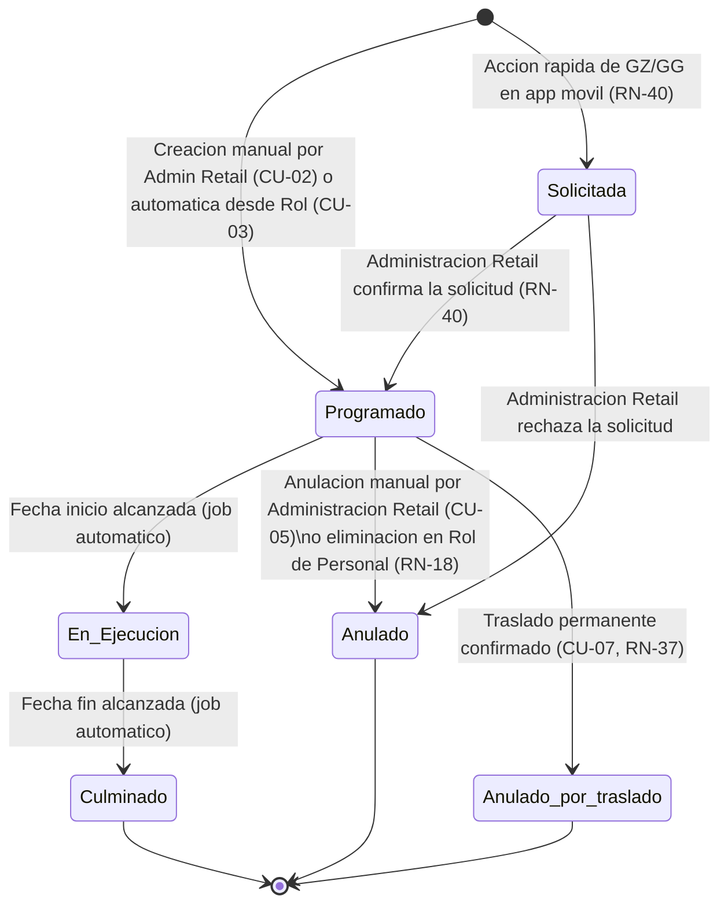

# ESPECIFICACION DE NECESIDADES TECNOLOGICAS
## ENT-MOD-ENCA-001 — Modulo de Gestion de Encargatura
### Sistema Nova | Organizacion Retail Peruana (Cadena / Lukers)

| Campo | Valor |
|---|---|
| Codigo de documento | ENT-MOD-ENCA-001 |
| Version | 1.2 |
| Fecha de emision | 29/05/2026 |
| Fecha de actualizacion | 31/05/2026 |
| Estado | BORRADOR — Pendiente de validacion con stakeholders. Reconciliado con reconciliacion-ux.md (C-03 / H-07) |
| Elaborado por | Analista Funcional Senior |
| Sistema | Nova |
| Modulo | Gestion de Encargatura |
| Documentos relacionados | ENT-MOD-ROLP-001 v1.1, ENT-MOD-DESC-001 v1.3, ENT-MOD-MARC-001 v1.1, reconciliacion-ux.md v1.0 (C-03 / H-07) |

### Historial de versiones

| Version | Fecha | Descripcion |
|---|---|---|
| 1.0 | 29/05/2026 | Emision inicial. Especificacion funcional base del modulo Gestion de Encargatura. Vacios documentados VAC-01 a VAC-12. |
| 1.1 | 29/05/2026 | Vacios resueltos. Se incorporan decisiones VAC-01 a VAC-12: flujo de aprobacion, notificaciones al colaborador, rango de fechas inter-semana, permisos de GZ, integracion sincrona con Rol de Personal, limite configurable de dias consecutivos, notificacion push y correo, regla de tienda a cubrir, carga masiva multi-tipo, historial de auditoria por ambito, exportacion a Excel y bloqueo de marcacion en tienda base. Todos los vacios marcados como RESUELTOS. |
| 1.2 | 31/05/2026 | Reconciliacion con el prototipo (reconciliacion-ux.md — C-03 / H-07). Se MANTIENE: el responsable de gestionar y CONFIRMAR la encargatura es ADMINISTRACION RETAIL (autoaprobacion, sin comite). Se ACLARA que la accion ejecutada por GZ/GG desde la app movil es unicamente una SOLICITUD de encargatura que Administracion Retail confirma; el actor responsable de la confirmacion NO cambia. Se incorpora la nocion de "Solicitud de encargatura" y el nuevo sub-estado "Solicitada (pendiente de confirmacion de Admin Retail)" para las solicitudes originadas por GZ/GG; nueva regla RN-40 (solicitud GZ/GG vs confirmacion Admin Retail) y ajuste de RN-33. Sin cambio del rol responsable. |

---

## INDICE

1. Introduccion y Objetivo del Modulo
2. Alcance y Exclusiones
3. Actores y Roles
4. Casos de Uso Principales
5. Reglas de Negocio
6. Estados y Transiciones
7. Entidades y Atributos Principales
8. Permisos por Rol
9. Integraciones
10. Vacios Funcionales y Preguntas Abiertas

---

## 1. INTRODUCCION Y OBJETIVO DEL MODULO

### 1.1 Contexto del negocio

Nova es un sistema de gestion desarrollado desde cero para una organizacion retail peruana con aproximadamente 100 tiendas distribuidas en multiples zonas geograficas. El grupo empresarial opera bajo dos cadenas comerciales: **Cadena** y **Lukers**. La semana laboral del sistema se define de **domingo a sabado** y es consistente con todos los modulos del sistema.

La encargatura es el mecanismo operativo mediante el cual un colaborador con perfil Senior asume temporalmente la responsabilidad de cobertura de una tienda completa o de un tipo de venta especifico. Este evento tiene implicaciones directas en la asignacion de cuotas, en la trazabilidad de la nomina y en el control de rendimiento individual del colaborador.

### 1.2 Problema que resuelve

La organizacion carece de un registro centralizado y trazable de las encargaturas de personal Senior. La gestion manual en hojas de calculo impide:

- Controlar que un colaborador no sea asignado a dos tiendas simultaneamente.
- Prevenir que dos colaboradores cubran la misma tienda en el mismo dia.
- Aplicar las reglas diferenciales entre empresas (Cobertura por Tipo de Venta solo existe en Lukers).
- Cruzar automaticamente el estado de descanso del colaborador antes de programarlo.
- Dar visibilidad a GZ y GG sobre el estado de encargaturas activas y programadas en toda la zona.

### 1.3 Objetivo del modulo

Proveer el registro, control y seguimiento de las encargaturas de personal Senior en Nova, permitiendo:

- Registrar programaciones de encargatura (Cobertura de Tienda y Cobertura por Tipo de Venta) de forma individual y masiva.
- Aplicar validaciones de negocio automaticas en tiempo real antes de confirmar una programacion.
- Gestionar el ciclo de vida de cada encargatura a traves de sus estados: Programado, En Ejecucion, Culminado, Anulado.
- Recibir automaticamente los registros generados desde el modulo de Rol de Personal al registrar Cobertura de Tienda o Cobertura por Tipo de Venta en el calendario semanal.
- Ofrecer listado con filtros y vista de detalle/edicion a Administracion Retail.
- Proveer vista de supervision de solo lectura a GZ y GG (con posibilidad de permiso de programacion configurable para GZ por parametro).
- Integrar con RMS para validar el flag Senior y los datos del colaborador.
- Integrar con OFIPLAN via BOT para la migracion diferida de registros confirmados.

### 1.4 Relacion con otros modulos

> Nota de reconciliacion (C-03 / H-07): El responsable de gestionar y CONFIRMAR la encargatura es ADMINISTRACION RETAIL (autoaprobacion, sin comite). Esto se MANTIENE. La accion que GZ o GG ejecutan desde la app movil (acciones rapidas de Encargatura) es unicamente una SOLICITUD de encargatura que Administracion Retail confirma; el actor responsable de la confirmacion no cambia. Las encargaturas originadas en el calendario del Rol de Personal y las creadas directamente por Administracion Retail siguen su flujo habitual (autoaprobacion). Ver RN-40 y RN-33.

- **Modulo de Rol de Personal (ENT-MOD-ROLP-001):** Es el punto de entrada automatico para crear registros de encargatura cuando el GZ registra Cobertura de Tienda o Cobertura por Tipo de Venta en el calendario semanal. El calendario del Rol es el unico canal de entrada de encargaturas originadas en la programacion semanal (RN-ROLP-69). Los registros tambien pueden crearse directamente desde este modulo por Administracion Retail. La integracion entre ambos modulos es sincrona: si falla la creacion en Encargatura, se revierte el registro en el Rol de Personal (VAC-05 resuelto).
- **Modulo de Descansos (ENT-MOD-DESC-001):** El sistema consulta este modulo para verificar que el colaborador no tenga descanso, compensacion o licencia activa en las fechas de la encargatura antes de confirmar la programacion.
- **Modulo de Marcaciones (ENT-MOD-MARC-001):** Durante una encargatura activa, el modulo de Marcaciones bloquea la marcacion del colaborador en su tienda base; el colaborador solo puede marcar en la tienda que esta cubriendo (VAC-12 resuelto).
- **Modulo de Traslados:** Al confirmar un traslado permanente, notifica a este modulo para anular automaticamente las encargaturas futuras del colaborador con estado "Anulado por traslado". Las encargaturas ejecutadas se conservan como historico (VAC-02 resuelto — flujo de traslado).
- **RMS (API externa):** Fuente de verdad del flag Senior por colaborador y por puesto. El modulo consulta RMS para validar la habilitacion del colaborador antes de programar.
- **OFIPLAN (BOT):** Receptor de la migracion diferida de encargaturas culminadas.

---

## 2. ALCANCE Y EXCLUSIONES

### 2.1 Dentro del alcance

| # | Funcionalidad |
|---|---|
| 1 | Listado de encargaturas con filtros: Empresa, Tienda, Codigo de empleado, Estado, Fecha inicio, Fecha fin. Vista por defecto: semana actual. |
| 2 | Creacion manual de nueva programacion de encargatura desde modal en este modulo (Administracion Retail). |
| 3 | Creacion automatica de registro de encargatura originado desde el modulo de Rol de Personal al registrar Cobertura de Tienda o Cobertura por Tipo de Venta. Integracion sincrona: si falla Encargatura, se revierte el Rol. |
| 4 | Edicion de encargatura en estado Programado unicamente. |
| 5 | Anulacion de encargatura en estado Programado. |
| 6 | Carga masiva de encargaturas mediante archivo Excel con validacion de errores fila por fila y popup de detalle. El archivo puede contener todos los tipos de cobertura mezclados. Las filas validas se procesan aunque otras tengan error. |
| 7 | Transicion automatica de estados: Programado a En Ejecucion al llegar la fecha de inicio; En Ejecucion a Culminado al llegar la fecha de fin. |
| 8 | Validaciones de negocio en tiempo real: flag Senior, tienda a cubrir (configurable por perfil), conflicto de tiendas, conflicto de cobertura de tienda duplicada, descanso activo, reglas de tipos de venta, limite maximo de dias consecutivos (configurable por perfil en parametros). |
| 9 | Supervision de solo lectura para GZ y GG. Permiso de programacion para GZ configurable en tabla de parametros. |
| 10 | Historial de cambios por registro para auditoria. Visible para Administracion Retail, GZ y GG dentro de su ambito jerarquico. |
| 11 | Integracion con RMS para validacion del flag Senior y datos del colaborador. |
| 12 | Integracion con OFIPLAN via BOT para migracion diferida de registros culminados. |
| 13 | Notificacion automatica al colaborador por correo y push en app Nova al ser programado (tienda a cubrir, fecha inicio, fecha fin, tipo de cobertura). Configurable en tabla de parametros (activar/desactivar). |
| 14 | Exportacion a Excel del listado filtrado. Administracion Retail y GG exportan sin restriccion. GZ exporta solo su zona. |
| 15 | Anulacion automatica de encargaturas futuras del colaborador con estado "Anulado por traslado" al recibir notificacion de traslado permanente desde el modulo de Traslados. |

### 2.2 Fuera del alcance

| # | Exclusion | Modulo o sistema responsable |
|---|---|---|
| 1 | Registro de descansos, compensaciones y licencias del colaborador | ENT-MOD-DESC-001 |
| 2 | Programacion semanal del calendario de Personal Senior | ENT-MOD-ROLP-001 |
| 3 | Registro y validacion de marcaciones biometricas | ENT-MOD-MARC-001 |
| 4 | Administracion del maestro de empleados, puestos y flag Senior | RMS (sistema externo) |
| 5 | Calculo de cuotas y nomina derivadas de la encargatura | RMS y sistema de RRHH |
| 6 | Gestion de traslados permanentes de colaboradores | Modulo de Traslados |
| 7 | Control de jornadas y horarios durante la encargatura | RMS |

---

## 3. ACTORES Y ROLES

| ID | Rol | Descripcion | Ambito |
|---|---|---|---|
| ROL-01 | Administracion Retail | Rol RESPONSABLE de gestionar y CONFIRMAR las encargaturas (autoaprobacion, sin comite) — SE MANTIENE (C-03 / H-07). Unico rol habilitado por defecto para programar, editar, anular, confirmar solicitudes y realizar carga masiva de encargaturas. Acceso total de escritura. Las programaciones que el mismo crea quedan activas directamente con registro en auditoria; las solicitudes originadas por GZ/GG requieren su confirmacion. | Central |
| ROL-02 | Gerente Zonal (GZ) | Por defecto, visualiza y supervisa las encargaturas de las tiendas de su zona (solo lectura). Desde la app movil puede ejecutar acciones rapidas que generan una SOLICITUD de encargatura (no una confirmacion): la solicitud debe ser confirmada por Administracion Retail (RN-40). El permiso de programacion directa para GZ es configurable en la tabla de parametros del sistema. | Zona (multi-tienda) |
| ROL-03 | Gerencia General (GG) | Visualiza y supervisa las encargaturas de todas las zonas (solo lectura). Desde la app movil puede ejecutar acciones rapidas que generan una SOLICITUD de encargatura que Administracion Retail confirma (RN-40). | Central / Multi-zona |

**Notas:**
- El colaborador Senior es el sujeto de la encargatura; no opera el modulo directamente. Recibe notificacion automatica por correo y push en app Nova al ser programado/confirmado (configurable en parametros).
- El Gerente de Tienda (GT) no tiene acceso a este modulo.
- C-03 / H-07: el responsable de la confirmacion es Administracion Retail y NO cambia. La accion de GZ/GG desde la app movil es una SOLICITUD que Administracion Retail confirma (autoaprobacion del responsable; sin comite). Las encargaturas originadas en el calendario del Rol de Personal por el GZ siguen su flujo de creacion automatica habitual (CU-03).
- Los permisos de escritura/confirmacion estan restringidos a Administracion Retail por defecto. El permiso de programacion directa para GZ es configurable por perfil en la tabla de parametros del sistema.

---

## 4. CASOS DE USO PRINCIPALES

---

### CU-01: Consultar listado de encargaturas

```
ID: CU-01
Nombre: Consultar listado de encargaturas con filtros
Actor principal: Administracion Retail, GZ, GG
Relacionado: RN-01, RN-02, RN-03
```

**Precondicion:**
- El usuario ha iniciado sesion en Nova con un perfil habilitado para el modulo de Gestion de Encargatura.

**Flujo principal:**
1. El usuario accede al modulo de Gestion de Encargatura.
2. El sistema carga el listado con los filtros por defecto: semana actual (fecha inicio = domingo de la semana en curso, fecha fin = sabado de la semana en curso) (RN-01).
3. El sistema muestra el listado de encargaturas correspondiente a los filtros por defecto, paginado y ordenado cronologicamente por fecha de inicio ascendente.
4. Cada fila del listado muestra: Empresa, Tienda, Codigo de empleado, Nombre del empleado, Tipo de cobertura, Subtipo (si aplica), Fecha inicio, Fecha fin, Estado, Observaciones.
5. El usuario aplica uno o mas filtros disponibles: Empresa, Tienda, Codigo de empleado, Estado, Fecha inicio, Fecha fin. El rango de fechas puede abarcar multiples semanas; el sistema valida las reglas de conflicto dia por dia dentro del rango completo (RN-30).
6. El sistema recarga el listado segun los filtros seleccionados (RN-02).
7. El usuario puede hacer clic en un registro para ver su detalle.
8. El usuario puede exportar el listado filtrado a Excel (RN-35).

**Flujos alternos:**
- A1. No existen registros para los filtros seleccionados: el sistema muestra el listado vacio con mensaje informativo "No se encontraron encargaturas para los criterios seleccionados".
- A2. El usuario tiene perfil GZ: el sistema filtra automaticamente los registros al ambito de sus tiendas asignadas. No puede ver encargaturas de otras zonas (RN-03). Al exportar, solo exporta registros de su zona (RN-35).
- A3. El usuario tiene perfil GG: el sistema muestra encargaturas de todas las zonas sin restriccion de ambito (RN-03).

**Excepciones:**
- E1. Error de conexion al consultar la base de datos: el sistema muestra mensaje de error y no carga el listado.

**Postcondicion:**
- El listado de encargaturas queda visible con los filtros aplicados y el usuario puede navegar por los registros.

---

### CU-02: Registrar nueva encargatura (manual)

```
ID: CU-02
Nombre: Registrar nueva programacion de encargatura de forma manual
Actor principal: Administracion Retail
Relacionado: RN-04, RN-05, RN-06, RN-07, RN-08, RN-09, RN-10, RN-11, RN-12, RN-13, RN-14, RN-15, RN-30, RN-31, RN-32
```

**Precondicion:**
- El usuario tiene perfil Administracion Retail (o GZ con permiso de programacion habilitado en parametros).
- El usuario se encuentra en el listado del modulo de Gestion de Encargatura.

**Flujo principal:**
1. El usuario hace clic en el boton "Nueva Programacion".
2. El sistema abre el modal de nueva programacion con los siguientes campos:
   - Empresa (obligatorio): selector de valores Cadena / Lukers.
   - Tienda a cubrir (obligatorio): selector filtrado por empresa y por las tiendas que el colaborador puede cubrir segun su perfil (RN-07 revisado). El campo registra la tienda a cubrir; la tienda base del colaborador se guarda como referencia automaticamente (RN-32).
   - Codigo de empleado (obligatorio): campo de busqueda; el sistema muestra nombre, puesto y tienda base del colaborador al ingresar el codigo.
   - Tipo de cobertura (obligatorio): selector con opciones segun empresa (RN-04).
   - Subtipo de venta (obligatorio si Tipo = Cobertura por Tipo de Venta): selector Asesoria / Tesoro (RN-05).
   - Fecha inicio (obligatorio): selector de fecha. Puede ser cualquier fecha dentro del rango permitido; el rango puede cruzar semanas (RN-30).
   - Fecha fin (obligatorio): selector de fecha. Puede ser cualquier fecha dentro del rango permitido; el rango puede cruzar semanas (RN-30).
   - Estado (obligatorio): valor por defecto "Programado", no editable al crear.
   - Observaciones (opcional): campo de texto libre.
3. El usuario completa todos los campos obligatorios.
4. El sistema ejecuta las validaciones de negocio en tiempo real al completar cada campo critico (RN-06 a RN-15, RN-30, RN-31).
5. Si todas las validaciones son exitosas, el usuario hace clic en "Guardar".
6. El sistema registra la encargatura con estado "Programado" y la agrega al listado. No se requiere aprobacion adicional; el registro queda activo directamente (RN-33).
7. El sistema registra el evento en el historial de auditoria con usuario, fecha y hora.
8. Si las notificaciones estan habilitadas en la tabla de parametros, el sistema envia notificacion al colaborador por correo y push en app Nova con: tienda a cubrir, fecha inicio, fecha fin, tipo de cobertura (RN-34).

**Flujos alternos:**
- A1. El usuario selecciona Empresa = Cadena: el sistema oculta la opcion "Cobertura por Tipo de Venta" en el selector de Tipo de cobertura. Solo se muestra "Cobertura de Tienda" (RN-04).
- A2. El usuario selecciona Tipo = Cobertura por Tipo de Venta y luego selecciona Subtipo = Asesoria: el sistema valida que no exista ya una encargatura de Subtipo Tesoro para el mismo colaborador en las mismas fechas (RN-12). Si existe, muestra error.
- A3. El usuario selecciona Tipo = Cobertura por Tipo de Venta y Subtipo = Asesoria, y ademas el mismo registro o una combinacion ya tiene Cobertura de Tienda activa: el sistema permite la combinacion Asesoria + Tienda (RN-13). Similar para Tesoro + Tienda.
- A4. El colaborador no tiene el flag Senior activo en RMS: el sistema muestra el mensaje "El colaborador no esta habilitado como Senior en el sistema" y bloquea el guardado (RN-06).
- A5. El colaborador tiene un descanso, compensacion o licencia activa en alguno de los dias del rango fecha inicio - fecha fin: el sistema muestra el mensaje "El colaborador tiene una programacion de descanso activa en las fechas indicadas" y bloquea el guardado (RN-10).
- A6. El colaborador ya tiene una encargatura en una tienda distinta a la suya en alguno de los dias del rango solicitado: el sistema muestra el mensaje "El colaborador ya tiene una encargatura programada en otra tienda para las fechas indicadas" y bloquea el guardado (RN-08).
- A7. Ya existe otro colaborador con Cobertura de Tienda en la misma tienda para alguno de los dias del rango solicitado: el sistema muestra el mensaje "Ya existe una Cobertura de Tienda activa para esta tienda en las fechas indicadas" y bloquea el guardado (RN-09).
- A8. El numero de dias del rango supera el limite maximo de dias consecutivos configurado para el perfil del colaborador en la tabla de parametros: el sistema muestra el mensaje correspondiente y bloquea el guardado (RN-31).
- A9. El usuario cierra el modal sin guardar: no se crea ningun registro.

**Excepciones:**
- E1. RMS no responde al consultar el flag Senior: el sistema muestra mensaje de error de integracion y no permite continuar hasta restablecer la conexion.
- E2. El modulo de Descansos no responde al consultar el estado del colaborador: el sistema muestra aviso de error de integracion y no permite continuar.

**Postcondicion:**
- La encargatura queda registrada en estado "Programado" con trazabilidad de usuario, fecha y hora de creacion.
- El registro es visible en el listado con los filtros activos.
- Si las notificaciones estan habilitadas, el colaborador recibio notificacion por correo y push.

---

### CU-03: Creacion automatica desde Rol de Personal

```
ID: CU-03
Nombre: Creacion automatica de encargatura desde el modulo de Rol de Personal
Actor principal: Sistema Nova (automatismo originado por GZ en Rol de Personal)
Relacionado: RN-16, RN-17, RN-18, RN-06, RN-07, RN-08, RN-09, RN-10, RN-11, RN-12, RN-13, RN-14, RN-15, RN-30, RN-31, RN-36
```

**Precondicion:**
- El GZ ha registrado en el calendario semanal del Rol de Personal el estado "Cobertura de Tienda" o "Cobertura por Tipo de Venta" para un colaborador Senior.
- El registro en el Rol de Personal ha superado todas las validaciones de ese modulo.

**Flujo principal:**
1. El modulo de Rol de Personal notifica sincronicamente al modulo de Gestion de Encargatura la creacion del evento con los datos: Empresa, Tienda a cubrir, Tienda base del colaborador, Codigo de empleado, Tipo de cobertura, Subtipo (si aplica), Fecha inicio, Fecha fin.
2. El modulo de Gestion de Encargatura ejecuta las validaciones de negocio propias (RN-06 a RN-15, RN-30, RN-31) sobre los datos recibidos.
3. Si todas las validaciones son exitosas: el sistema crea el registro de encargatura con estado "Programado" y consigna como origen "Rol de Personal" en el campo de auditoria. Responde confirmacion al modulo de Rol de Personal.
4. El registro queda visible en el listado del modulo con los demas registros.
5. Si las notificaciones estan habilitadas en la tabla de parametros, el sistema envia notificacion al colaborador por correo y push en app Nova (RN-34).

**Flujos alternos:**
- A1. Alguna validacion de Encargatura falla sobre los datos recibidos del Rol de Personal: el sistema rechaza la creacion, responde con el error al modulo de Rol de Personal, y el Rol de Personal revierte el registro del calendario. Se muestra el error al GZ en tiempo real (RN-36). El GZ debe corregir el calendario del Rol de Personal.
- A2. El estado registrado en el Rol es eliminado por el GZ antes de ser enviado a aprobacion: el modulo de Rol de Personal notifica a Encargatura y el registro queda Anulado automaticamente (RN-18).

**Excepciones:**
- E1. El modulo de Gestion de Encargatura no esta disponible al momento de recibir la notificacion del Rol: dado que la integracion es sincrona, el Rol de Personal recibe error de conexion y no guarda el registro del calendario. El GZ ve el error en pantalla y reintenta cuando el servicio este disponible.

**Postcondicion:**
- El registro de encargatura queda creado con estado "Programado" y con referencia al origen (Rol de Personal).
- El registro es visible y editable por Administracion Retail.

---

### CU-04: Editar encargatura

```
ID: CU-04
Nombre: Editar una programacion de encargatura en estado Programado
Actor principal: Administracion Retail
Relacionado: RN-19, RN-20, RN-06, RN-07, RN-08, RN-09, RN-10, RN-11, RN-12, RN-13, RN-14, RN-15, RN-30, RN-31
```

**Precondicion:**
- El usuario tiene perfil Administracion Retail.
- La encargatura tiene estado "Programado".

**Flujo principal:**
1. El usuario selecciona un registro en estado "Programado" del listado y hace clic en "Editar".
2. El sistema abre el modal de edicion con los datos actuales del registro cargados en los campos.
3. El usuario modifica los campos que requiere: Personal, Tipo de cobertura, Subtipo, Fecha inicio, Fecha fin, Observaciones. Los campos Empresa y Tienda no son modificables en edicion (RN-19).
4. El sistema ejecuta las validaciones de negocio en tiempo real con los nuevos valores (RN-06 a RN-15, RN-30, RN-31).
5. Si todas las validaciones son exitosas, el usuario hace clic en "Guardar".
6. El sistema actualiza el registro y registra el cambio en el historial de auditoria: usuario, fecha, hora, campo modificado, valor anterior, valor nuevo.

**Flujos alternos:**
- A1. El usuario intenta editar un registro con estado "En Ejecucion": el sistema no muestra la opcion "Editar" para ese registro y muestra tooltip "No es posible editar una encargatura en ejecucion" (RN-20).
- A2. El usuario intenta editar un registro con estado "Anulado" o "Culminado": el sistema no muestra la opcion "Editar" (RN-20).
- A3. Alguna validacion de negocio falla con los nuevos datos: el sistema muestra el mensaje de error correspondiente y no guarda los cambios.

**Excepciones:**
- E1. Error de concurrencia (dos usuarios editan el mismo registro simultaneamente): el sistema aplica bloqueo optimista y notifica al segundo usuario que el registro fue modificado.

**Postcondicion:**
- Los cambios quedan registrados con historial de auditoria completo.
- El registro permanece en estado "Programado".

---

### CU-05: Anular encargatura

```
ID: CU-05
Nombre: Anular una programacion de encargatura en estado Programado
Actor principal: Administracion Retail
Relacionado: RN-21, RN-22
```

**Precondicion:**
- El usuario tiene perfil Administracion Retail.
- La encargatura tiene estado "Programado".

**Flujo principal:**
1. El usuario selecciona un registro en estado "Programado" del listado y hace clic en "Anular".
2. El sistema muestra un dialogo de confirmacion: "Esta accion no puede deshacerse. Confirma la anulacion de la encargatura?"
3. El usuario confirma la anulacion.
4. El sistema actualiza el estado del registro a "Anulado".
5. El sistema registra el evento en el historial de auditoria: usuario, fecha, hora, estado anterior (Programado), estado nuevo (Anulado).

**Flujos alternos:**
- A1. El usuario cancela el dialogo de confirmacion: el registro permanece en su estado original sin cambios.
- A2. El usuario intenta anular un registro con estado "En Ejecucion", "Culminado" o "Anulado": el sistema no muestra la opcion "Anular" para ese registro (RN-21).

**Excepciones:**
- E1. Error al guardar el cambio de estado: el sistema muestra mensaje de error y no actualiza el registro.

**Postcondicion:**
- El registro queda en estado "Anulado" con historial de auditoria completo.
- Si la encargatura fue originada desde el Rol de Personal, el modulo notifica al Rol de Personal para que refleje el cambio en el calendario (RN-22).

---

### CU-06: Carga masiva de encargaturas por Excel

```
ID: CU-06
Nombre: Carga masiva de encargaturas mediante archivo Excel
Actor principal: Administracion Retail
Relacionado: RN-23, RN-24, RN-25, RN-26, RN-27, RN-06, RN-07, RN-08, RN-09, RN-10, RN-11, RN-12, RN-13, RN-14, RN-15, RN-30, RN-31
```

**Precondicion:**
- El usuario tiene perfil Administracion Retail.
- El usuario tiene preparado un archivo Excel con el formato requerido por el sistema (RN-23).

**Flujo principal:**
1. El usuario hace clic en el boton "Carga Masiva" en el listado.
2. El sistema muestra el modal de carga masiva con instrucciones y la opcion de descargar la plantilla Excel.
3. El usuario sube el archivo Excel completado. El archivo puede contener todos los tipos de cobertura (Cobertura de Tienda, Cobertura por Tipo de Venta Asesoria, Cobertura por Tipo de Venta Tesoro) en el mismo archivo, mezclados entre filas.
4. El sistema valida el formato del archivo (estructura de columnas, tipos de dato por campo) (RN-24).
5. El sistema procesa fila por fila ejecutando las validaciones de negocio sobre cada registro (RN-06 a RN-15, RN-25, RN-30, RN-31). Cada fila es independiente: las filas validas se registran aunque otras filas del mismo archivo sean invalidas.
6. El sistema presenta el resumen del procesamiento:
   - Total de filas leidas.
   - Filas procesadas correctamente (cargadas con estado Programado).
   - Filas con error (no cargadas).
7. Si existen filas con error, el sistema habilita el boton "Ver detalle de errores" que abre un popup con la lista de filas rechazadas, el numero de fila en el Excel y el motivo del rechazo por cada una (RN-26).
8. Las filas validas quedan registradas como encargaturas con estado "Programado".
9. El usuario puede descargar el reporte de errores en Excel (RN-27).

**Flujos alternos:**
- A1. El archivo no tiene el formato correcto (columnas faltantes o tipos de dato incorrectos): el sistema rechaza el archivo completo antes de procesar filas individuales y muestra el mensaje con la discrepancia de formato.
- A2. Todas las filas son validas: el sistema registra todas las encargaturas y muestra mensaje de exito sin popup de errores.
- A3. Todas las filas tienen error: el sistema no registra ninguna encargatura y muestra el popup de errores con el detalle de cada fila.
- A4. El usuario cierra el modal sin cargar archivo: no se procesa ninguna accion.

**Excepciones:**
- E1. El archivo supera el tamano maximo permitido (parametrizable): el sistema rechaza el archivo con mensaje indicando el limite.
- E2. RMS no responde durante el procesamiento: el sistema detiene el procesamiento, informa cuantas filas se procesaron hasta ese momento y cuantas quedaron pendientes.

**Postcondicion:**
- Las encargaturas validas quedan registradas con estado "Programado" y son visibles en el listado.
- El usuario dispone del reporte de errores para corregir y recargar las filas rechazadas.

---

### CU-07: Anulacion automatica por traslado permanente

```
ID: CU-07
Nombre: Anulacion automatica de encargaturas futuras al confirmar traslado permanente
Actor principal: Sistema Nova (automatismo originado desde el modulo de Traslados)
Relacionado: RN-37, RN-38
```

**Precondicion:**
- El modulo de Traslados ha confirmado un traslado permanente para un colaborador.
- El colaborador tiene una o mas encargaturas en estado "Programado" con fecha de inicio igual o posterior a la fecha de confirmacion del traslado.

**Flujo principal:**
1. El modulo de Traslados notifica al modulo de Gestion de Encargatura la confirmacion del traslado permanente del colaborador, indicando el codigo de empleado y la fecha de efectividad del traslado.
2. El sistema identifica todas las encargaturas del colaborador en estado "Programado" con fecha de inicio igual o posterior a la fecha de efectividad del traslado.
3. El sistema actualiza el estado de dichas encargaturas a "Anulado por traslado".
4. El sistema registra el evento en el historial de auditoria de cada registro afectado: accion "Anulacion automatica por traslado", fecha, hora.
5. El sistema notifica a Administracion Retail con el listado de encargaturas anuladas automaticamente (RN-37).

**Flujos alternos:**
- A1. El colaborador no tiene encargaturas futuras en estado "Programado": el sistema no realiza ninguna accion sobre el modulo de Encargatura.
- A2. El colaborador tiene encargaturas en estado "En Ejecucion" o "Culminado": estas no se anulan; se conservan como historico (RN-38).

**Postcondicion:**
- Las encargaturas futuras del colaborador quedan en estado "Anulado por traslado".
- Las encargaturas ejecutadas o culminadas se conservan como historico sin modificacion.
- Administracion Retail recibio notificacion del resultado.

---

## 5. REGLAS DE NEGOCIO

### 5.1 Filtros y visualizacion del listado

| ID | Regla | Verificacion |
|---|---|---|
| RN-01 | El listado de encargaturas se carga por defecto mostrando la semana actual (fecha inicio = domingo de la semana en curso, fecha fin = sabado de la semana en curso). El usuario puede modificar el rango de fechas libremente, incluyendo rangos que crucen multiples semanas. | Verificar que al ingresar al modulo el rango de fechas corresponda a la semana en curso segun el calendario domingo-sabado. Verificar que el usuario pueda ampliar el rango mas alla de una semana. |
| RN-02 | Los filtros disponibles son: Empresa, Tienda, Codigo de empleado, Estado, Fecha inicio y Fecha fin. Todos los filtros son opcionales. Los filtros se aplican de forma combinada. | Verificar que cada filtro restrinja los resultados correctamente y que la combinacion de multiples filtros sea aditiva (AND). |
| RN-03 | El ambito de visualizacion esta restringido por perfil: Administracion Retail ve todas las tiendas y empresas. GZ ve solo las tiendas de sus zonas asignadas. GG ve todas las tiendas sin restriccion. | Verificar con usuarios de distintos perfiles que el listado respete el ambito definido. |

### 5.2 Habilitacion del colaborador

| ID | Regla | Verificacion |
|---|---|---|
| RN-06 | Solo puede programarse como encargado un colaborador que tenga el flag "Senior" activo en RMS al momento del registro. Los puestos habilitados para tener flag Senior son: Asesores, Secretaria-Cajera, GT, Jefe de Piso, Supervisores de Seccion, Promotores. La lista de puestos habilitados es parametrizable en la tabla de parametros del sistema. | Intentar programar a un colaborador sin flag Senior y verificar el rechazo. Verificar que la lista de puestos habilitados sea modificable por parametro. |
| RN-07 | El campo "Tienda" en el registro de encargatura corresponde a la tienda que el colaborador va a cubrir (no necesariamente su tienda base). La tienda base del colaborador se guarda como referencia en el registro. La restriccion de que tiendas puede cubrir cada colaborador es configurable por perfil en la tabla de parametros del sistema; no se limita a una sola tienda asignada. | Verificar que el selector de tienda muestre las tiendas configuradas como permitidas para el perfil del colaborador. Verificar que la tienda base quede guardada como referencia en el registro. |

### 5.3 Conflictos de programacion

| ID | Regla | Verificacion |
|---|---|---|
| RN-08 | Un colaborador no puede tener dos encargaturas activas (estado Programado o En Ejecucion) que se solapen en fechas, independientemente del tipo de cobertura. La validacion se realiza dia por dia dentro del rango completo, incluso si el rango cruza semanas. Mensaje de error: "El colaborador ya tiene una encargatura programada en las fechas indicadas". | Intentar programar una segunda encargatura con fechas solapadas para el mismo colaborador y verificar el rechazo y el mensaje. |
| RN-09 | No puede haber dos encargaturas de tipo Cobertura de Tienda para la misma tienda con fechas solapadas, independientemente del colaborador asignado. La validacion se realiza dia por dia dentro del rango completo. Mensaje de error: "Ya existe una Cobertura de Tienda activa para esta tienda en las fechas indicadas". | Intentar registrar una segunda Cobertura de Tienda para la misma tienda en el mismo periodo y verificar el rechazo. |
| RN-10 | No puede programarse una encargatura para un colaborador que tenga descanso laboral, compensacion o licencia activa (estado Programado, En Ejecucion o Modificado en el modulo de Descansos) en alguno de los dias del rango de fechas de la encargatura. La validacion se realiza dia por dia. Mensaje de error: "El colaborador tiene una programacion de descanso activa en las fechas indicadas". | Verificar con un colaborador con descanso activo que el sistema rechace la encargatura. |

### 5.4 Tipos de cobertura y empresa

| ID | Regla | Verificacion |
|---|---|---|
| RN-04 | El tipo de cobertura "Cobertura por Tipo de Venta" esta disponible exclusivamente para tiendas de la empresa Lukers. Para tiendas de la empresa Cadena, el unico tipo disponible es "Cobertura de Tienda". | Verificar que al seleccionar Empresa = Cadena el selector de tipo no muestre "Cobertura por Tipo de Venta". Verificar que al seleccionar Empresa = Lukers ambos tipos esten disponibles. |
| RN-05 | Cuando el tipo de cobertura seleccionado es "Cobertura por Tipo de Venta", el usuario debe seleccionar obligatoriamente el subtipo: Asesoria o Tesoro. El campo de subtipo no aplica para "Cobertura de Tienda". | Verificar que al seleccionar "Cobertura por Tipo de Venta" el campo subtipo sea obligatorio y que al seleccionar "Cobertura de Tienda" el campo subtipo no aparezca o este deshabilitado. |

### 5.5 Combinaciones permitidas y prohibidas de tipo de cobertura

| ID | Regla | Verificacion |
|---|---|---|
| RN-11 | La combinacion Asesoria + Tienda (Cobertura por Tipo de Venta Asesoria simultanea a Cobertura de Tienda) esta permitida para el mismo colaborador en las mismas fechas. | Registrar ambos tipos para el mismo colaborador y verificar que el sistema los acepte. |
| RN-12 | La combinacion Tesoro + Tienda (Cobertura por Tipo de Venta Tesoro simultanea a Cobertura de Tienda) esta permitida para el mismo colaborador en las mismas fechas. | Registrar ambos tipos para el mismo colaborador y verificar que el sistema los acepte. |
| RN-13 | La combinacion Asesoria + Tesoro (ambos subtipos de Cobertura por Tipo de Venta para el mismo colaborador en las mismas fechas) esta estrictamente prohibida. Mensaje de error: "No esta permitido programar los subtipos Asesoria y Tesoro simultaneamente para el mismo colaborador". | Intentar registrar ambos subtipos para el mismo colaborador y verificar el rechazo y el mensaje. |

### 5.6 Estados permitidos al crear y editar

| ID | Regla | Verificacion |
|---|---|---|
| RN-14 | Al crear una encargatura (manual o automatica), el estado inicial siempre es "Programado". El campo Estado no es editable al crear. | Verificar que el campo Estado en el modal de creacion sea de solo lectura con valor "Programado". |
| RN-15 | Las fechas de inicio y fin de la encargatura deben ser iguales o posteriores a la fecha actual del sistema. No se pueden programar encargaturas con fecha de inicio en el pasado. Excepcion: registros creados automaticamente desde el Rol de Personal conservan las fechas del calendario aunque alguna sea pasada respecto al momento de creacion automatica. | Verificar que el selector de fecha inicio bloquee fechas pasadas en creacion manual. Verificar que la excepcion automatica funcione correctamente. |

### 5.7 Creacion automatica desde Rol de Personal

| ID | Regla | Verificacion |
|---|---|---|
| RN-16 | Cuando el GZ registra Cobertura de Tienda o Cobertura por Tipo de Venta en el calendario del Rol de Personal, el sistema crea automaticamente el registro en el modulo de Gestion de Encargatura sin intervencion adicional del usuario. El campo origen del registro queda marcado como "Rol de Personal". | Registrar una Cobertura de Tienda en el Rol y verificar que el registro correspondiente aparezca automaticamente en el listado de Encargatura con origen "Rol de Personal". |
| RN-17 | Si la creacion automatica falla por una validacion propia del modulo de Encargatura, el sistema rechaza la creacion, responde con el error al modulo de Rol de Personal, y el Rol de Personal revierte el registro del calendario. El GZ ve el error en pantalla en tiempo real. | Simular un escenario donde el registro del Rol genera un conflicto en Encargatura y verificar que el Rol revierta el registro y el GZ vea el error en tiempo real. |
| RN-18 | Si el GZ elimina del calendario del Rol de Personal un estado de Cobertura de Tienda o Cobertura por Tipo de Venta que ya genero un registro en Encargatura, el modulo de Rol de Personal notifica a Encargatura y el sistema actualiza el estado del registro a "Anulado" automaticamente, siempre que el registro en Encargatura este en estado "Programado". Si el registro ya esta "En Ejecucion", la anulacion automatica no aplica y se genera alerta a Administracion Retail. | Eliminar una Cobertura de Tienda del Rol y verificar que el registro correspondiente en Encargatura pase a "Anulado". Verificar el caso de registro "En Ejecucion". |

### 5.8 Edicion y anulacion

| ID | Regla | Verificacion |
|---|---|---|
| RN-19 | En la edicion de una encargatura, los campos Empresa y Tienda no pueden modificarse. Si se requiere cambiar empresa o tienda, debe anularse el registro y crear uno nuevo. | Verificar que los campos Empresa y Tienda esten deshabilitados en el modal de edicion. |
| RN-20 | Solo pueden editarse o anularse las encargaturas en estado "Programado". Las encargaturas en estado "En Ejecucion", "Culminado" y "Anulado" son de solo lectura. | Verificar que la opcion Editar y Anular no este disponible para registros en estados distintos a "Programado". |
| RN-21 | La anulacion de una encargatura requiere confirmacion expresa del usuario mediante dialogo de confirmacion. No se puede deshacer una anulacion. | Verificar que aparezca el dialogo de confirmacion antes de ejecutar la anulacion y que el estado no cambie si el usuario cancela. |
| RN-22 | Cuando una encargatura originada desde el Rol de Personal es anulada manualmente por Administracion Retail, el sistema notifica al modulo de Rol de Personal para que el calendario refleje el cambio en el estado correspondiente del colaborador. | Anular manualmente un registro con origen "Rol de Personal" y verificar que el Rol de Personal refleje el cambio. |

### 5.9 Carga masiva

| ID | Regla | Verificacion |
|---|---|---|
| RN-23 | El archivo Excel de carga masiva debe contener las siguientes columnas en el orden indicado: (1) Empresa, (2) Tienda a cubrir (codigo), (3) Codigo de empleado, (4) Tipo de cobertura, (5) Subtipo de venta (obligatorio si tipo = Cobertura por Tipo de Venta; vacio si tipo = Cobertura de Tienda), (6) Fecha inicio (formato DD/MM/AAAA), (7) Fecha fin (formato DD/MM/AAAA), (8) Observaciones (opcional). El sistema debe ofrecer la descarga de la plantilla desde el modal de carga masiva. El archivo puede contener todos los tipos de cobertura mezclados en el mismo archivo. | Verificar que la plantilla descargable tenga exactamente estas columnas. Verificar que el sistema acepte filas de distintos tipos de cobertura en el mismo archivo. |
| RN-24 | Antes de procesar las filas individualmente, el sistema valida el formato general del archivo: existencia de todas las columnas requeridas, que las fechas tengan el formato DD/MM/AAAA, que los valores de Empresa, Tipo de cobertura y Subtipo correspondan a los catalogos validos del sistema. Si el archivo no supera esta validacion de formato, el sistema lo rechaza completamente sin procesar ninguna fila. | Cargar un archivo con formato incorrecto y verificar que el sistema lo rechace antes de procesar filas individuales. |
| RN-25 | Cada fila del archivo Excel es validada individualmente contra todas las reglas de negocio del modulo (RN-06 a RN-15, RN-30, RN-31). Las filas invalidas no se registran. Las filas validas se registran aunque otras filas del mismo archivo sean invalidas. El procesamiento no se detiene por filas con error; todas las filas son evaluadas. | Cargar un archivo con mezcla de filas validas e invalidas y verificar que solo se registren las validas y que todas las filas hayan sido evaluadas. |
| RN-26 | El sistema genera un popup de detalle de errores que lista por cada fila rechazada: numero de fila en el Excel, datos identificadores (Empresa, Tienda, Codigo empleado, Fechas) y motivo del rechazo. El popup debe ser legible y navegable si la cantidad de errores es grande. | Cargar un archivo con multiples errores y verificar que el popup muestre todos los errores con su detalle. |
| RN-27 | El usuario puede descargar el reporte de errores de la carga masiva en formato Excel. El reporte incluye las mismas columnas del archivo original mas una columna adicional "Motivo de rechazo". | Verificar la descarga del reporte de errores y que la columna de motivo este presente y sea descriptiva. |

### 5.10 Auditoria

| ID | Regla | Verificacion |
|---|---|---|
| RN-28 | Cada creacion, edicion y anulacion de encargatura queda registrada en el historial de auditoria con: usuario que realizo la accion, fecha y hora, accion ejecutada (Creacion / Edicion / Anulacion), campo modificado (en caso de edicion), valor anterior y valor nuevo. El historial es visible para Administracion Retail, GZ y GG dentro de su ambito jerarquico: GZ ve solo el historial de las tiendas de su zona; GG ve el historial de todas las tiendas. | Ejecutar creacion, edicion y anulacion y verificar que el historial refleje los tres eventos con todos los campos requeridos. Verificar que GZ no vea historial de tiendas fuera de su zona. |
| RN-29 | El campo "Origen" de cada registro indica si la encargatura fue creada manualmente por Administracion Retail o automaticamente desde el modulo de Rol de Personal. Este campo no es editable. | Verificar que registros creados manualmente muestren origen "Manual" y los automaticos muestren origen "Rol de Personal". |

### 5.11 Rango de fechas y limite de dias consecutivos

| ID | Regla | Verificacion |
|---|---|---|
| RN-30 | El rango de fechas de una encargatura puede cruzar semanas (el dia de inicio y el dia de fin pueden pertenecer a semanas distintas segun el calendario domingo-sabado). El sistema valida las reglas de conflicto dia por dia dentro del rango completo, sin restriccion al limite de la semana. | Programar una encargatura con fecha de inicio en una semana y fecha de fin en la semana siguiente y verificar que el sistema la acepte si no hay conflictos diarios. Verificar que los conflictos se detecten dia a dia. |
| RN-31 | El limite maximo de dias consecutivos de encargatura es configurable por perfil en la tabla de parametros del sistema. Si el rango solicitado supera el limite configurado para el perfil del colaborador, el sistema bloquea el guardado y muestra el mensaje: "El rango de fechas supera el limite maximo de dias consecutivos de encargatura permitido para este perfil". | Configurar un limite y verificar que el sistema rechace rangos que lo superen. Verificar que el limite sea editable en la tabla de parametros sin desarrollo adicional. |

### 5.12 Flujo de aprobacion

| ID | Regla | Verificacion |
|---|---|---|
| RN-33 | Las programaciones de encargatura creadas o CONFIRMADAS por Administracion Retail no requieren aprobacion adicional de ningun otro rol ni comite (autoaprobacion del responsable). El registro queda en estado "Programado" directamente. La trazabilidad se garantiza mediante el historial de auditoria. Administracion Retail es el responsable de la confirmacion y este rol no cambia (C-03 / H-07). | Crear/confirmar una encargatura como Administracion Retail y verificar que quede en estado "Programado" sin solicitar aprobacion de otro rol. Verificar que el evento quede en el historial de auditoria. |
| RN-40 | Las acciones rapidas de Encargatura que GZ o GG ejecutan desde la app movil generan una SOLICITUD de encargatura, NO una confirmacion. La solicitud queda en sub-estado "Solicitada (pendiente de confirmacion de Admin Retail)" y se encola para que Administracion Retail la confirme. Solo al confirmarla Administracion Retail, la encargatura pasa a estado "Programado" (autoaprobacion del responsable, sin comite). El actor responsable de la confirmacion es siempre Administracion Retail y no cambia por el hecho de que la solicitud se origine en GZ/GG (C-03 / H-07). La solicitud aplica las mismas validaciones de negocio (RN-06 a RN-15, RN-30, RN-31) al confirmarse. | Ejecutar una accion rapida de encargatura como GZ/GG en la app y verificar que se genere una "Solicitada (pendiente de confirmacion de Admin Retail)". Verificar que solo Administracion Retail pueda confirmarla y que al confirmar pase a "Programado". |

### 5.13 Notificaciones al colaborador

| ID | Regla | Verificacion |
|---|---|---|
| RN-34 | Al programar una encargatura (creacion manual o automatica), el sistema envia una notificacion automatica al colaborador por correo electronico y por push en la app Nova, con el siguiente contenido minimo: tienda a cubrir, fecha inicio, fecha fin, tipo de cobertura. La notificacion es configurable en la tabla de parametros del sistema (activar / desactivar por empresa, por tipo de cobertura o de forma global). Si la notificacion esta desactivada en parametros, no se envia ninguna comunicacion. | Habilitar la notificacion en parametros, crear una encargatura y verificar que el colaborador recibio correo y push con los datos correctos. Deshabilitar la notificacion en parametros y verificar que no se envie ninguna comunicacion. |

### 5.14 Exportacion del listado

| ID | Regla | Verificacion |
|---|---|---|
| RN-35 | El listado de encargaturas es exportable a Excel. La exportacion aplica los mismos filtros activos en la pantalla al momento de exportar. Administracion Retail y GG exportan sin restriccion de ambito. GZ exporta unicamente los registros de sus tiendas asignadas, sin posibilidad de exportar registros de otras zonas. | Exportar como Administracion Retail y verificar que el archivo incluya todos los registros filtrados. Exportar como GZ y verificar que el archivo solo incluya registros de su zona. |

### 5.15 Integracion con modulo de Traslados

| ID | Regla | Verificacion |
|---|---|---|
| RN-37 | Al recibir la notificacion de confirmacion de traslado permanente desde el modulo de Traslados, el sistema anula automaticamente todas las encargaturas del colaborador en estado "Programado" con fecha de inicio igual o posterior a la fecha de efectividad del traslado. El estado de dichas encargaturas cambia a "Anulado por traslado". El sistema notifica a Administracion Retail con el listado de encargaturas anuladas. | Confirmar un traslado permanente y verificar que las encargaturas futuras del colaborador pasen a "Anulado por traslado" y que Administracion Retail reciba la notificacion. |
| RN-38 | Las encargaturas del colaborador en estado "En Ejecucion" o "Culminado" al momento de confirmar el traslado permanente no se modifican. Se conservan como historico sin cambio de estado. | Verificar que los registros en "En Ejecucion" y "Culminado" no cambien de estado al procesarse el traslado. |

### 5.16 Integracion con modulo de Marcaciones

| ID | Regla | Verificacion |
|---|---|---|
| RN-39 | Durante una encargatura en estado "En Ejecucion", el modulo de Marcaciones bloquea la marcacion del colaborador en su tienda base. El colaborador solo puede marcar asistencia en la tienda que esta cubriendo segun el registro de encargatura activa. Si el colaborador intenta marcar en su tienda base, el modulo de Marcaciones muestra un mensaje explicativo: "Tienes una encargatura activa en [nombre de tienda a cubrir]. Debes marcar en esa tienda durante el periodo de encargatura." | Activar una encargatura (estado En Ejecucion) e intentar marcar en la tienda base del colaborador. Verificar el bloqueo y el mensaje. Verificar que la marcacion en la tienda cubierta sea exitosa. |

### 5.17 Integracion sincrona entre Rol de Personal y Encargatura

| ID | Regla | Verificacion |
|---|---|---|
| RN-36 | La comunicacion entre el modulo de Rol de Personal y el modulo de Encargatura es sincrona. El modulo de Rol de Personal espera la respuesta de Encargatura antes de confirmar el guardado del calendario. Si Encargatura responde con error de validacion, el Rol de Personal revierte el registro y muestra el error al GZ en tiempo real. Si Encargatura no esta disponible, el Rol de Personal tampoco guarda el registro y muestra error de servicio no disponible. | Simular un fallo en el modulo de Encargatura durante el registro en el Rol de Personal y verificar que el Rol no guarde el registro y muestre el error al GZ. |

---

## 6. ESTADOS Y TRANSICIONES

### 6.1 Catalogo de estados

| Estado | Descripcion |
|---|---|
| Solicitada (pendiente de confirmacion de Admin Retail) | Sub-estado inicial de una encargatura ORIGINADA por una accion rapida de GZ/GG en la app movil (RN-40). Es una solicitud que aun no es una encargatura confirmada. Solo Administracion Retail puede confirmarla (pasa a "Programado") o rechazarla (pasa a "Anulado"). No habilita marcacion ni cobertura mientras no se confirme. |
| Programado | La encargatura ha sido registrada o confirmada por Administracion Retail (manual, automaticamente desde el Rol, o por confirmacion de una solicitud GZ/GG) y aun no ha comenzado. Es el unico estado editable y anulable. |
| En Ejecucion | La fecha de inicio de la encargatura ha llegado y la fecha de fin aun no ha transcurrido. Solo lectura. |
| Culminado | La fecha de fin de la encargatura ha transcurrido. Estado final de cumplimiento. Solo lectura. |
| Anulado | La encargatura fue cancelada manualmente por Administracion Retail o automaticamente por eliminacion en el Rol de Personal (si el registro estaba en Programado). Estado final. Solo lectura. |
| Anulado por traslado | La encargatura fue cancelada automaticamente al confirmarse un traslado permanente del colaborador. Solo aplica a encargaturas futuras en estado Programado al momento del traslado. Estado final. Solo lectura. |

### 6.2 Maquina de estados



### 6.3 Notas sobre transiciones

- La transicion de "Solicitada (pendiente de confirmacion de Admin Retail)" a "Programado" solo la realiza Administracion Retail al confirmar la solicitud originada por GZ/GG (RN-40). El rol responsable de la confirmacion no cambia (C-03 / H-07).
- Las transiciones de "Programado" a "En Ejecucion" y de "En Ejecucion" a "Culminado" son ejecutadas por jobs automaticos del sistema al inicio del dia correspondiente.
- Un registro "En Ejecucion" no puede anularse directamente desde este modulo. Si existe una necesidad operativa de interrumpir una encargatura en curso, Administracion Retail debe coordinar la accion fuera del sistema.
- Un registro "Culminado", "Anulado" o "Anulado por traslado" no puede transicionar a ningun otro estado.
- La edicion esta habilitada exclusivamente en estado "Programado".

---

## 7. ENTIDADES Y ATRIBUTOS PRINCIPALES

### 7.1 Encargatura

| Atributo | Tipo | Requerido | Descripcion |
|---|---|---|---|
| id_encargatura | UUID | Si | Identificador unico del registro. Generado por el sistema. |
| id_empresa | Referencia | Si | Empresa a la que pertenece la tienda a cubrir: Cadena o Lukers. |
| id_tienda_cubierta | Referencia | Si | Tienda que el colaborador va a cubrir durante la encargatura. |
| id_tienda_base | Referencia | Si (calculado) | Tienda base del colaborador en RMS al momento del registro. Se guarda como referencia. |
| codigo_empleado | Texto | Si | Codigo del colaborador en RMS. |
| nombre_empleado | Texto | Si (calculado) | Nombre completo del colaborador, obtenido de RMS al ingresar el codigo. |
| puesto_empleado | Texto | Si (calculado) | Puesto del colaborador en RMS al momento del registro. |
| tipo_cobertura | Enumerado | Si | Valores: "Cobertura de Tienda" / "Cobertura por Tipo de Venta". |
| subtipo_venta | Enumerado | Condicional | Valores: "Asesoria" / "Tesoro". Obligatorio si tipo_cobertura = "Cobertura por Tipo de Venta". Nulo si tipo_cobertura = "Cobertura de Tienda". |
| fecha_inicio | Fecha | Si | Fecha de inicio de la encargatura (inclusive). |
| fecha_fin | Fecha | Si | Fecha de fin de la encargatura (inclusive). fecha_fin >= fecha_inicio. El rango puede cruzar semanas. |
| estado | Enumerado | Si | Valores: "Solicitada (pendiente de confirmacion de Admin Retail)" / "Programado" / "En Ejecucion" / "Culminado" / "Anulado" / "Anulado por traslado". |
| observaciones | Texto largo | No | Campo libre de observaciones. Maximo de caracteres: parametrizable. |
| origen | Enumerado | Si | Valores: "Manual" (Admin Retail) / "Rol de Personal" / "Solicitud GZ/GG (app movil)". Indica como fue creado el registro. No editable. |
| id_usuario_confirmacion | Referencia | No | Usuario de Administracion Retail que confirmo la solicitud (aplica cuando origen = "Solicitud GZ/GG"). El responsable de la confirmacion es siempre Administracion Retail (RN-40). |
| fecha_creacion | Fecha-hora | Si | Timestamp de creacion del registro. Generado por el sistema. |
| usuario_creacion | Referencia | Si | Usuario que creo el registro. En creacion automatica, se consigna el usuario del sistema. |
| fecha_ultima_modificacion | Fecha-hora | No | Timestamp de la ultima modificacion. Nulo si no ha sido editado. |
| usuario_ultima_modificacion | Referencia | No | Usuario que realizo la ultima modificacion. |

### 7.2 HistorialAuditoriaEncargatura

| Atributo | Tipo | Descripcion |
|---|---|---|
| id_historial | UUID | Identificador unico del evento de auditoria. |
| id_encargatura | Referencia | Encargatura a la que pertenece el evento. |
| usuario | Referencia | Usuario que ejecuto la accion. |
| fecha_hora | Fecha-hora | Momento en que se ejecuto la accion. |
| accion | Enumerado | Valores: "Creacion" / "Edicion" / "Anulacion" / "Cambio de Estado" / "Anulacion automatica por traslado". |
| campo_modificado | Texto | Campo que fue modificado (aplica en edicion). |
| valor_anterior | Texto | Valor del campo antes del cambio. |
| valor_nuevo | Texto | Valor del campo despues del cambio. |

### 7.3 CargaMasivaEncargatura

| Atributo | Tipo | Descripcion |
|---|---|---|
| id_carga | UUID | Identificador unico del proceso de carga masiva. |
| usuario | Referencia | Usuario que ejecuto la carga. |
| fecha_hora | Fecha-hora | Momento de la carga. |
| nombre_archivo | Texto | Nombre del archivo Excel cargado. |
| total_filas | Entero | Total de filas leidas en el archivo. |
| filas_exitosas | Entero | Filas procesadas y registradas correctamente. |
| filas_con_error | Entero | Filas rechazadas por error de validacion. |
| detalle_errores | JSON | Lista de errores por fila: numero de fila, datos identificadores, motivo de rechazo. |

---

## 8. PERMISOS POR ROL

| Funcionalidad | Administracion Retail | GZ | GG |
|---|---|---|---|
| Ver listado (todas las tiendas) | Si | No (solo su zona) | Si |
| Ver listado (tiendas de su zona) | Si | Si | Si |
| Ver detalle de un registro | Si | Si | Si |
| Generar SOLICITUD de encargatura (accion rapida app movil) | No (crea directo) | Si (genera solicitud) | Si (genera solicitud) |
| Confirmar SOLICITUD de encargatura originada por GZ/GG | Si (responsable, RN-40) | No | No |
| Crear encargatura manual | Si | Configurable por parametro | No |
| Editar encargatura (estado Programado) | Si | Configurable por parametro | No |
| Anular encargatura (estado Programado) | Si | Configurable por parametro | No |
| Carga masiva Excel | Si | No | No |
| Ver historial de auditoria (ambito propio) | Si | Si (solo su zona) | Si (todas las zonas) |
| Descargar reporte de errores de carga masiva | Si | No | No |
| Exportar listado a Excel (ambito propio) | Si (sin restriccion) | Si (solo su zona) | Si (sin restriccion) |

**Notas:**
- GZ tiene acceso de solo lectura al modulo por defecto. El permiso de programacion (crear, editar, anular) para GZ es configurable por perfil en la tabla de parametros del sistema, sin requerir desarrollo adicional.
- Administracion Retail es el unico rol con permisos completos de escritura por defecto y el unico habilitado para carga masiva.
- El historial de auditoria es visible para todos los roles (Administracion Retail, GZ, GG) dentro de su ambito jerarquico.
- La exportacion a Excel esta disponible para todos los roles, restringida al ambito de cada perfil.

---

## 9. INTEGRACIONES

### 9.1 RMS (API externa)

| Evento | Direccion | Descripcion |
|---|---|---|
| Validacion flag Senior | Nova → RMS (consulta) | Al ingresar el codigo de empleado en el modal de creacion o edicion, Nova consulta a RMS si el colaborador tiene el flag Senior activo para su puesto. Si RMS no responde, el sistema bloquea la operacion y muestra error de integracion. |
| Consulta datos del colaborador | Nova → RMS (consulta) | Nova obtiene nombre, puesto, tienda base y tiendas habilitadas para cobertura del colaborador para mostrarlos en el modal y para las validaciones de RN-06 y RN-07. |

**Canal:** API REST. Misma integracion existente en ENT-MOD-ROLP-001 y ENT-MOD-MARC-001. No se desarrolla infraestructura nueva.

**Politica de error:** Si RMS no responde, la operacion de creacion o edicion queda bloqueada hasta restablecer la conexion. No se permite crear encargaturas sin validar el flag Senior en tiempo real.

### 9.2 Modulo de Descansos (ENT-MOD-DESC-001)

| Evento | Direccion | Descripcion |
|---|---|---|
| Consulta estado del colaborador | Nova Encargatura → Nova Descansos (consulta interna) | Al crear o editar una encargatura, el modulo consulta al modulo de Descansos si el colaborador tiene descanso, compensacion o licencia activa en el rango de fechas indicado, dia por dia. Si el modulo de Descansos no responde, la operacion queda bloqueada. |

**Canal:** Integracion interna entre modulos de Nova (llamada sincronica).

### 9.3 Modulo de Rol de Personal (ENT-MOD-ROLP-001)

| Evento | Direccion | Descripcion |
|---|---|---|
| Creacion automatica de encargatura | Rol de Personal → Encargatura (notificacion sincronica) | Al registrar Cobertura de Tienda o Cobertura por Tipo de Venta en el calendario del Rol, el modulo de Rol notifica sincronicamente al modulo de Encargatura. Si Encargatura falla o no esta disponible, el Rol revierte el registro del calendario y el GZ ve el error en tiempo real (RN-36). |
| Anulacion automatica de encargatura | Rol de Personal → Encargatura (notificacion interna) | Al eliminar una Cobertura de Tienda o Cobertura por Tipo de Venta del calendario del Rol (antes del envio a aprobacion), el modulo de Rol notifica al modulo de Encargatura para anular el registro si esta en estado Programado (RN-18). |
| Notificacion de anulacion manual | Encargatura → Rol de Personal (notificacion interna) | Cuando Administracion Retail anula una encargatura con origen "Rol de Personal", el modulo notifica al Rol de Personal para reflejar el cambio en el calendario (RN-22). |

**Canal:** Integracion sincronica interna entre modulos de Nova. El mecanismo tecnico (REST interno, eventos, etc.) es decision del Arquitecto de Software.

### 9.4 OFIPLAN (BOT)

| Evento | Direccion | Descripcion |
|---|---|---|
| Migracion de encargatura culminada | Nova → OFIPLAN (via BOT) | Las encargaturas que alcanzan el estado "Culminado" se migran a OFIPLAN via BOT en tiempos parametrizables. El BOT gestiona la migracion diferida; Nova no escribe directamente en OFIPLAN. Los campos y formato a migrar deben coordinarse con el equipo de OFIPLAN. |

**Canal:** Mismo canal BOT definido en ENT-MOD-ROLP-001 y ENT-MOD-DESC-001. No se desarrolla infraestructura nueva.

### 9.5 Modulo de Traslados

| Evento | Direccion | Descripcion |
|---|---|---|
| Notificacion de traslado permanente | Traslados → Encargatura (notificacion interna) | Al confirmar un traslado permanente de un colaborador, el modulo de Traslados notifica a Encargatura con el codigo de empleado y la fecha de efectividad. Encargatura anula automaticamente las encargaturas futuras del colaborador en estado Programado con estado "Anulado por traslado" y notifica a Administracion Retail (CU-07, RN-37, RN-38). |

**Canal:** Integracion interna entre modulos de Nova. Mecanismo a definir con el Arquitecto.

### 9.6 Modulo de Marcaciones (ENT-MOD-MARC-001)

| Evento | Direccion | Descripcion |
|---|---|---|
| Consulta encargatura activa | Marcaciones → Encargatura (consulta interna) | Al intentar registrar una marcacion, el modulo de Marcaciones consulta a Encargatura si el colaborador tiene una encargatura en estado "En Ejecucion" para la fecha actual. Si existe, Marcaciones bloquea la marcacion en la tienda base y solo permite la marcacion en la tienda cubierta (RN-39). |

**Canal:** Integracion sincronica interna entre modulos de Nova.

### 9.7 Notificaciones (correo y push)

| Evento | Direccion | Descripcion |
|---|---|---|
| Notificacion al colaborador | Encargatura → Servicio de notificaciones | Al crear una encargatura (manual o automatica), si la notificacion esta habilitada en la tabla de parametros, el sistema envia correo electronico y push en app Nova al colaborador con los datos de la encargatura (RN-34). Configurable por empresa, tipo de cobertura o de forma global. |

**Canal:** Servicio de notificaciones transaccionales de Nova. Mismo servicio utilizado en otros modulos.

---

## 10. VACIOS FUNCIONALES Y PREGUNTAS ABIERTAS

| ID | Seccion | Pregunta / Vacio | Impacto | Estado |
|---|---|---|---|---|
| VAC-01 | Flujo de aprobacion | Las programaciones creadas/confirmadas por Administracion Retail no requieren aprobacion adicional ni comite (autoaprobacion del responsable). Quedan activas directamente con registro en auditoria. RECONCILIADO C-03 / H-07: el responsable de la confirmacion es Administracion Retail y NO cambia; las acciones rapidas de GZ/GG en la app movil son SOLICITUDES que Admin Retail confirma (RN-40). | Alto | RESUELTO / RECONCILIADO (C-03 / H-07) |
| VAC-02 | Notificaciones y traslados | Al confirmar traslado permanente, el modulo de Traslados notifica a Encargatura. Las encargaturas futuras del colaborador se anulan automaticamente con estado "Anulado por traslado". Las ejecutadas se mantienen como historico. Notificacion a Administracion Retail. | Medio | RESUELTO |
| VAC-03 | Rango de fechas inter-semana | Se permite cruzar semanas en el rango de fechas. El sistema valida reglas de conflicto dia por dia dentro del rango completo. | Medio | RESUELTO |
| VAC-04 | Permisos GZ | GZ es solo lectura por defecto. Permiso de programacion configurable por perfil en tabla de parametros. | Alto | RESUELTO |
| VAC-05 | Integracion sincrona Rol-Encargatura | Integracion sincrona entre Rol de Personal y Encargatura. Si falla la creacion en Encargatura, se revierte el registro en el Rol y se muestra error al usuario en tiempo real. | Alto | RESUELTO |
| VAC-06 | Limite de dias consecutivos | Limite maximo de dias consecutivos de encargatura configurable por perfil en tabla de parametros. | Medio | RESUELTO |
| VAC-07 | Notificaciones al colaborador | Notificacion automatica al colaborador por correo y push en app Nova al ser programado (tienda a cubrir, fecha inicio, fecha fin, tipo de cobertura). Configurable en tabla de parametros (activar/desactivar). | Medio | RESUELTO |
| VAC-08 | Regla de tienda a cubrir | El campo "tienda" en el registro es la tienda a cubrir. La tienda base del colaborador se guarda como referencia. La restriccion de que tiendas puede cubrir cada colaborador es configurable por perfil, sin limitar a una sola tienda asignada. | Critico | RESUELTO |
| VAC-09 | Carga masiva multi-tipo | La carga masiva Excel permite todos los tipos de cobertura en el mismo archivo. Validacion fila por fila. Las filas validas se procesan aunque otras tengan error. Las filas con error se reportan en popup de detalle. | Medio | RESUELTO |
| VAC-10 | Historial de auditoria por ambito | Historial de auditoria visible para todos los roles (Administracion Retail, GZ, GG) dentro de su ambito jerarquico. | Bajo | RESUELTO |
| VAC-11 | Exportacion a Excel | Exportacion a Excel del listado filtrado. Administracion Retail y GG exportan sin restriccion. GZ exporta solo su zona. | Bajo | RESUELTO |
| VAC-12 | Bloqueo de marcacion en tienda base | Durante encargatura activa, el modulo de Marcaciones bloquea la marcacion del colaborador en su tienda base. Solo puede marcar en la tienda que esta cubriendo. Mensaje explicativo al intentar marcar en tienda base. | Medio | RESUELTO |
