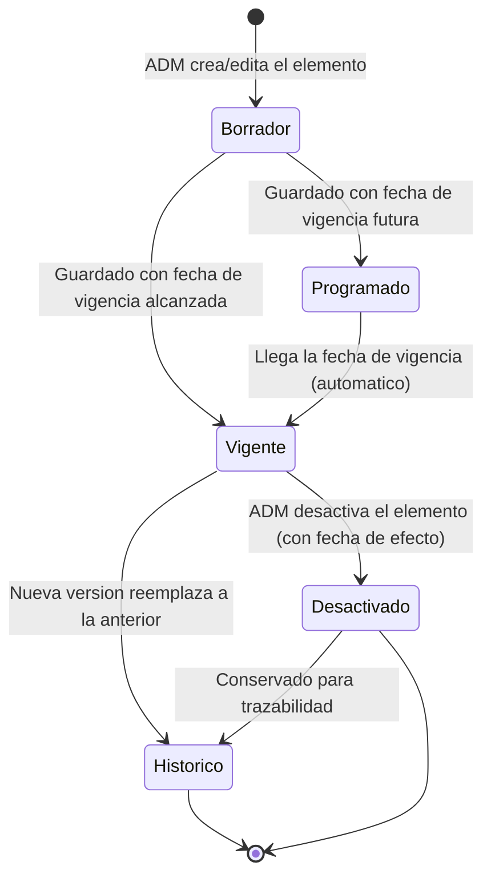

# ESPECIFICACION DE NECESIDADES TECNOLOGICAS
## ENT-MOD-MAES-001 — Modulo de Maestros / Configuracion
### Sistema Nova | Organizacion Retail Peruana (Cadena / Lukers)

| Campo | Valor |
|---|---|
| Codigo de documento | ENT-MOD-MAES-001 |
| Version | 1.3 |
| Fecha de emision | 30/05/2026 |
| Fecha de actualizacion | 31/05/2026 |
| Estado | BORRADOR — Pendiente de validacion con stakeholders |
| Elaborado por | Analista Funcional Senior |
| Sistema | Nova |
| Modulo | Maestros / Configuracion (Fase 0 — habilitador transversal, EP-01) |
| Documentos relacionados | alcance-nova.md v1.0, backlog-epicas.md v1.0, ENT-MOD-ROLP-001 v1.1, ENT-MOD-MARC-001 v1.1, ENT-MOD-DESC-001 v1.2, ENT-MOD-ENCA-001 v1.1, ENT-MOD-TRAS-001 v1.1, ENT-MOD-VAC-001 v1.1, ENT-MOD-ASCE-001 v1.2, ENT-MOD-APRO-001 v1.0, ENT-MOD-SEGU-001 v1.1 |

### Historial de versiones

| Version | Fecha | Descripcion |
|---|---|---|
| 1.0 | 30/05/2026 | Emision inicial. Consolidacion de los catalogos y parametros transversales dispersos en los 7 modulos funcionales y en el motor de Aprobaciones. Especificacion funcional base. Vacios documentados VAC-MAES-01 a VAC-MAES-14. BORRADOR NO VALIDADO. |
| 1.1 | 30/05/2026 | Consolidacion de parametros nuevos como fuente unica del sistema. Se incorporan al catalogo de parametros (seccion 7.6): parametros confirmados de Ascenso v1.2 (ASCE_SLA_RESOLUCION_DIAS, ASCE_PERIODO_HISTORIAL_MESES, ASCE_NOTIF_COLABORADOR_ASCENSO, ASCE_NOTIF_DESCENSO, ASCE_ALERTA_SLA_DESTINATARIOS, ASCE_PUESTOS_HABILITADOS_SENIOR, ASCE_LIMITE_PENDIENTES, ASCE_MAX_CARACTERES_MOTIVO); parametros de SLA/escalamiento por flujo del motor de Aprobaciones (APRO_SLA_<FLUJO>_<NIVEL>, APRO_ESCALAMIENTO_<FLUJO>_<NIVEL>, APRO_ANTICIPACION_RECORDATORIO, APRO_ALERTA_SLA_DESTINATARIOS); y parametros de configuracion (no identidades) del modulo de Seguridad (SEGU_PWD_*, SEGU_LOGIN_*, SEGU_SESION_*, SEGU_MFA_*, SEGU_AUTENTICACION_METODO). Se agrega CU-MAES-04 nota sobre destinatarios de alerta. VAC-MAES-11 y VAC-MAES-13 marcados RESUELTOS por ENT-MOD-SEGU-001. Nuevos vacios VAC-MAES-15 a VAC-MAES-18. Actualizado historial y relacion de documentos. |
| 1.3 | 31/05/2026 | Incorporacion de los parametros de la **recuperacion de contrasena por codigo OTP** confirmada por el PO (ENT-MOD-SEGU-001 v1.1, CU-SEGU-10, RN-SEGU-32 a 39; reconciliacion-ux.md P-10/C-06): SEGU_OTP_LONGITUD (6), SEGU_OTP_TTL_MIN (10), SEGU_OTP_MAX_INTENTOS (5), SEGU_OTP_MAX_REENVIOS (3), SEGU_OTP_REENVIO_ESPERA_SEG (60), SEGU_OTP_COOLDOWN_MIN (15). Se actualiza la nota de frontera de provision de parametros de Seguridad para incluir la familia SEGU_OTP_*. Sin cambios de reglas de negocio de Maestros. BORRADOR NO VALIDADO. |
| 1.2 | 30/05/2026 | Incorporacion de las decisiones del PO sobre los vacios de negocio. RESUELTOS: VAC-MAES-15 (SLA uniforme de 2 dias habiles para FL_LSGH, FL_LCGH y FL_VAC_ANULA; se fijan los parametros APRO_SLA_*), VAC-MAES-03 (semanas de campaña cargadas manualmente por ADM con anticipacion; nueva RN-MAES-21 y CU-MAES-08), VAC-MAES-04 (ROL_TOPE_CUOTA_ASESOR pasa a configurable por tienda, definido pero NO integrado a la logica aun), VAC-MAES-08 (criticidad de consumo MIXTA: impacto economico/legal = BLOQUEANTE, resto = DEGRADABLE; nueva RN-MAES-19), VAC-MAES-09 (solo ADM escribe, GG solo solicita; refuerzo RN-MAES-18), VAC-MAES-14 (calendario igual en ambas empresas, parametrizable a futuro), VAC-MAES-10 (sin cambios retroactivos salvo correccion de error historico autorizada por ADM y auditada; nueva RN-MAES-20). CERRADOS EN LA PARTE DE NEGOCIO con derivacion tecnica: VAC-MAES-05 (dotacion minima la provee RMS; contrato a TI/Arquitecto, vinculado a VAC-MAES-12) y VAC-MAES-01 (feriados modelo hibrido: fuente regional oficial + carga manual del ADM; integracion regional derivada a TI/Arquitecto). Se actualizan RN-MAES-01/02/05, entidades Feriado y Tienda, catalogo de parametros (criticidad y tope por tienda), CU-MAES-01 y CU-MAES-03. Permanecen ABIERTOS por insumo del negocio: VAC-MAES-02, 06, 07. Derivados a TI/Arquitecto: VAC-MAES-12, 16, 17, 18. |

---

## INDICE

1. Introduccion y Objetivo del Modulo
2. Alcance y Exclusiones
3. Actores y Roles
4. Casos de Uso Principales
5. Reglas de Negocio
6. Estados y Transiciones (vigencia de parametros y catalogos)
7. Entidades y Atributos Principales
8. Permisos por Rol
9. Integraciones
10. Vacios Funcionales y Preguntas Abiertas

---

## 1. INTRODUCCION Y OBJETIVO DEL MODULO

### 1.1 Contexto del negocio

Nova es un sistema de gestion desarrollado desde cero para una organizacion retail peruana con aproximadamente 100 tiendas distribuidas en multiples zonas geograficas. El grupo empresarial opera bajo dos cadenas comerciales: **Cadena** y **Lukers**. La semana laboral del sistema se define de **domingo a sabado** y es consistente con todos los modulos del sistema.

Los siete modulos funcionales (Rol de Personal, Marcaciones, Descansos, Encargatura, Traslados, Vacaciones y Ascenso) referencian de forma repetida un conjunto comun de catalogos y parametros: el calendario de feriados, el maestro de tiendas con su atributo de ubicacion (Centro Comercial / Pie de Calle), la empresa a la que pertenece cada tienda, los puestos del personal, los limites por puesto, los plazos y tolerancias de cada flujo, los umbrales de alerta y las semanas de campaña/alta demanda. Hoy estos datos estan dispersos como "tablas de parametros" mencionadas en cada documento, sin una definicion unica ni un responsable de mantenimiento centralizado.

### 1.2 Problema que resuelve

La ausencia de un modulo de Maestros/Configuracion unico genera:

- **Duplicidad e inconsistencia:** cada modulo asume su propia "tabla de parametros" sin garantia de que el valor de, por ejemplo, el limite de dias de descanso laboral o el plazo del GZ sea el mismo en todos los puntos donde se usa.
- **Imposibilidad de aplicar reglas diferenciales por empresa:** Cadena y Lukers tienen reglas distintas (dias no compensables, existencia de Cobertura por Tipo de Venta solo en Lukers, semanas de campaña, tope de cuota por asesor) que requieren una fuente parametrica unica.
- **Falta de un calendario de feriados unico:** el Rol marca feriados en el encabezado, Vacaciones cuenta feriados dentro del periodo, Descansos genera compensaciones por feriado laborado. Todos necesitan el mismo calendario maestro (nacional + local por tienda).
- **Riesgo de que cambios de parametro no queden auditados** ni versionados, cuando muchos de ellos tienen efecto legal/economico (plazos que disparan bloqueo de cajas, tope de cuota, dias indemnizables).

### 1.3 Objetivo del modulo

Proveer el repositorio unico, versionado y auditado de catalogos y parametros transversales de Nova, permitiendo:

- Mantener el **calendario maestro de feriados** (nacionales y locales por tienda/zona) consumido por Rol, Descansos, Vacaciones y Aprobaciones (calculo de dias habiles para SLA).
- Mantener el **maestro de tiendas** con atributo de ubicacion (CC/PC), zona y empresa, sincronizado con RMS como fuente de verdad y enriquecido con atributos operativos propios de Nova.
- Mantener el **maestro de empresas/cadenas** (Cadena, Lukers) y sus reglas diferenciales.
- Mantener el **catalogo de puestos** y sus limites operativos (maximo de dias de descanso laboral, elegibilidad de estados, dotacion minima de asesores por tienda).
- Mantener el **catalogo de zonas** y la **dotacion minima por tienda** (tabla de equipos de tienda) consumida por Vacaciones, Descansos y Encargatura.
- Configurar los **parametros por empresa**: semana laboral, dias no compensables, semanas de campaña/alta demanda, tope de cuota por asesor, tolerancias y umbrales.
- Configurar los **parametros por modulo y por flujo**: plazos/SLA, anticipaciones de alerta, limites de dias, umbrales de notificacion, activacion/desactivacion de notificaciones, parametros de firma electronica.
- Garantizar **vigencia temporal, versionado y auditoria** de todo parametro o catalogo, de modo que un cambio no altere retroactivamente eventos ya ejecutados.

### 1.4 Relacion con otros modulos

- **Aprobaciones (ENT-MOD-APRO-001):** consume el calendario de feriados para calcular SLA en dias habiles, los plazos/escalamientos parametrizados y las definiciones de jerarquia (zonas, empresa) para resolver quien es el aprobador. La definicion de plantillas de flujo de aprobacion reside en Aprobaciones; Maestros provee los catalogos base (zonas, empresas, puestos, roles, feriados) que esas plantillas referencian.
- **Rol de Personal (ENT-MOD-ROLP-001):** consume feriados (encabezado del calendario, RN-ROLP-64), tope de cuota por asesor por empresa (S/3,000 parametrizable, RN-ROLP-21), plazos de envio/aprobacion, limites de descanso por puesto, columnas de ratios por empresa.
- **Marcaciones (ENT-MOD-MARC-001):** consume tolerancias de marcacion, parametros del canal Nova-POS, umbrales de alerta part-time.
- **Descansos (ENT-MOD-DESC-001):** consume dias no compensables por empresa, Tabla 04 de propuesta de 3 fechas por empresa, limites de descanso/compensacion por puesto, SLA de Bienestar.
- **Encargatura (ENT-MOD-ENCA-001):** consume flag de existencia de Cobertura por Tipo de Venta por empresa, limite de dias consecutivos por perfil, permiso de programacion de GZ configurable.
- **Traslados (ENT-MOD-TRAS-001):** consume limite maximo de dias de traslado temporal, anticipacion de replicacion de huella, tiempos de migracion OFIPLAN, permiso de traslado fuera de zona.
- **Vacaciones (ENT-MOD-VAC-001):** consume minimo de asesores (dotacion minima), umbrales de sugerencia, minimo de dias por periodo/fraccion, anticipacion de alertas, umbral de dias indemnizables, color de alerta de Mes Obligatorio.
- **Ascenso Senior (ENT-MOD-ASCE-001 v1.2):** consume del catalogo de puestos habilitados para Senior (ASCE_PUESTOS_HABILITADOS_SENIOR, consistente con RN-ROLP-32 y RN-ENCA-06), la ventana fija del historial de cumplimiento (ASCE_PERIODO_HISTORIAL_MESES = 6), el SLA de resolucion (ASCE_SLA_RESOLUCION_DIAS = 5 dias habiles), los switches de notificacion al colaborador ascendido y de descenso, los destinatarios de la alerta por SLA vencido y el limite de solicitudes pendientes. Todos consolidados en la seccion 7.6.
- **RMS (API externa):** fuente de verdad del maestro de empleados, puestos, tiendas base, flag Senior y tipo part/full-time. Maestros sincroniza tiendas y puestos desde RMS y los enriquece con atributos operativos de Nova (CC/PC, zona Nova si difiere, parametros).
- **Seguridad / Accesos (ENT-MOD-SEGU-001 v1.0):** la exclusion EX-01 quedo resuelta: Seguridad se construye como modulo propio. Maestros define el catalogo de roles funcionales (GT, GZ, GG, GG Suplente, AV, AR, BIEN, ADM, etc.) que Seguridad operacionaliza, y la estructura organizacional (empresas, zonas, tiendas, puestos). Adicionalmente, Maestros es la fuente unica de los **parametros de configuracion** del modulo de Seguridad (politica de contrasenas, bloqueo por intentos, expiracion de sesion, MFA, metodo de autenticacion), tal como lo declara RN-SEGU-10/12/13/14/15 ("parametrizable en Maestros"). Maestros NO administra **identidades**: la asignacion usuario-rol-ambito, la jerarquia, la delegacion y la suplencia viven en Seguridad (ENT-MOD-SEGU-001). `⚠️ DATO SENSIBLE` — la separacion es deliberada: Maestros guarda parametros, no identidades.

---

## 2. ALCANCE Y EXCLUSIONES

### 2.1 Dentro del alcance

| # | Funcionalidad |
|---|---|
| 1 | Mantenimiento del calendario maestro de feriados nacionales (vigente para todas las tiendas). |
| 2 | Mantenimiento de feriados locales/regionales asociables a una o varias tiendas o zonas. |
| 3 | Mantenimiento del maestro de empresas/cadenas (Cadena, Lukers) y sus atributos. |
| 4 | Mantenimiento del catalogo de zonas y su asignacion de tiendas. |
| 5 | Mantenimiento del maestro de tiendas: codigo, nombre, empresa, zona, ubicacion CC/PC, estado (activa/suspendida/cerrada), dotacion minima de asesores. Sincronizacion base desde RMS y enriquecimiento con atributos Nova. |
| 6 | Mantenimiento del catalogo de puestos (Senior, Gerente Titular, Asesor, Secretaria, Auxiliar, Sastre, etc.) y sus limites operativos por empresa. |
| 7 | Configuracion de parametros por empresa: semana laboral, dias no compensables, semanas de campaña/alta demanda, tope de cuota por asesor, existencia de Cobertura por Tipo de Venta. |
| 8 | Configuracion de parametros por modulo/flujo: plazos y SLA, anticipaciones de alerta, limites de dias, umbrales de notificacion, switches de notificacion (push/correo), parametros de firma electronica, tiempos de migracion OFIPLAN. |
| 9 | Definicion de la tabla de equipos de tienda (dotacion minima) consumida por Vacaciones, Descansos y Encargatura. |
| 10 | Catalogo de roles funcionales del negocio (GT, GZ, GG, AV, AR, ADM) y su jerarquia, para consumo del motor de Aprobaciones y del futuro modulo de Seguridad. |
| 11 | Versionado y vigencia temporal de catalogos y parametros (fecha desde / fecha hasta) sin alteracion retroactiva de eventos ya ejecutados. |
| 12 | Historial de auditoria de toda alta, modificacion, desactivacion o cambio de vigencia de un catalogo o parametro (quien, cuando, valor anterior, valor nuevo). |
| 13 | Consulta de parametros y catalogos por los demas modulos mediante un servicio de configuracion centralizado (API interna de configuracion). |
| 14 | Importacion masiva del calendario de feriados anual mediante archivo (Excel/CSV) con validacion fila por fila. |
| 15 | Gestion de la Tabla 04 de propuesta de compensacion (3 fechas) por empresa, consumida por Descansos. |

### 2.2 Fuera del alcance

| # | Exclusion | Modulo o sistema responsable |
|---|---|---|
| 1 | Alta, baja y modificacion del maestro de empleados (datos personales, contrato, puesto asignado, flag Senior, tipo part/full-time) | RMS (sistema externo, fuente de verdad) |
| 2 | Gestion de usuarios, credenciales y autenticacion; asignacion usuario-rol-ambito; jerarquia organizacional; delegacion y suplencia (IDENTIDADES). Maestros solo guarda los valores PARAMETRICOS de la politica de seguridad (SEGU_*), no las identidades. | Seguridad / Accesos (ENT-MOD-SEGU-001) |
| 3 | Definicion de las plantillas de flujo de aprobacion (niveles, aprobadores, escalamiento) | Aprobaciones (ENT-MOD-APRO-001). Maestros solo provee los catalogos base. |
| 4 | Calculo de nomina, saldos vacacionales y horarios teoricos | OFIPLAN y RMS (sistemas externos) |
| 5 | Logica de negocio especifica de cada modulo (validaciones, transiciones). Maestros solo provee los valores parametricos; la logica reside en cada modulo. | Cada modulo funcional |
| 6 | Contenido juridico de adendas y documentos de firma | RRHH |

### 2.3 Nota de cumplimiento

- El maestro de tiendas y zonas contiene datos operativos, no datos personales. `⚠️ DATO SENSIBLE`: el catalogo de roles funcionales y su futura asociacion a usuarios (en el modulo de Seguridad) maneja informacion de identidad; su administracion debe quedar fuera de Maestros y resolverse con TI/Compliance (EX-01). Maestros solo define el catalogo de roles, no la asignacion usuario-rol.
- Los ejemplos de tiendas, codigos de empleado y nombres usados en este documento son ficticios.

---

## 3. ACTORES Y ROLES

| ID | Rol | Descripcion | Ambito |
|---|---|---|---|
| ACT-01 | Administrador del Sistema (ADM) | Unico rol con permiso de escritura sobre catalogos y parametros. Crea, edita, versiona y desactiva feriados, tiendas (atributos Nova), parametros por empresa y por modulo. Ejecuta importaciones masivas. | Central |
| ACT-02 | Gerencia General (GG) | Consulta de parametros y catalogos. Puede solicitar cambios de parametro de impacto de negocio (tope de cuota, plazos) que el ADM aplica. Sin escritura directa (configurable, ver VAC-MAES-09). | Central / Multi-zona |
| ACT-03 | Administracion de Ventas (AV) / Administracion Retail (AR) | Consulta de catalogos y parametros de los modulos que operan. Sin escritura sobre Maestros. | Central |
| ACT-04 | Modulos funcionales de Nova (consumidores) | Sistema. Consumen catalogos y parametros vigentes mediante el servicio de configuracion centralizado. No escriben. | Sistema |
| ACT-05 | RMS (sistema externo) | Provee la sincronizacion base de tiendas y puestos. Fuente de verdad de los atributos que no son propios de Nova. | Sistema externo |

**Notas sobre ambito:**
- Por defecto, solo ADM escribe sobre Maestros. La posibilidad de delegar mantenimiento de feriados o de ciertos parametros a GG es un punto abierto (VAC-MAES-09).
- Toda escritura sobre un parametro de impacto de negocio (plazos que disparan bloqueo de cajas, tope de cuota, dias no compensables) queda registrada en auditoria con responsable y justificacion. `⚠️ REQUIERE VALIDACION COMPLIANCE` para parametros que alteran consecuencias economicas/legales.

---

## 4. CASOS DE USO PRINCIPALES

---

### CU-MAES-01: Mantener calendario de feriados

```
ID: CU-MAES-01
Actor principal: Administrador del Sistema (ADM)
Actores secundarios: Sistema Nova, modulos consumidores (Rol, Descansos, Vacaciones, Aprobaciones)
Relacionado: RN-MAES-01, RN-MAES-02, RN-MAES-03, RN-MAES-18

Precondicion:
- El ADM esta autenticado en Nova con perfil de configuracion.

Flujo principal:
1. El ADM accede a la seccion Maestros > Calendario de Feriados.
2. El sistema muestra los feriados del año seleccionado, indicando alcance (Nacional / Local), origen (REGIONAL_OFICIAL / MANUAL_ADM) y, para los locales, las tiendas o zonas asociadas (RN-MAES-01).
3. El ADM crea un nuevo feriado manual (origen MANUAL_ADM): ingresa fecha, descripcion, alcance (Nacional o Local), empresa(s) aplicables y, si es Local, las tiendas o zonas asociadas (RN-MAES-01).
4. El sistema valida que no exista ya un feriado nacional en la misma fecha con el mismo alcance (RN-MAES-02).
5. El sistema valida que la fecha sea coherente con el año seleccionado.
6. El sistema registra el feriado con vigencia y origen, y lo deja disponible para los modulos consumidores.
7. El sistema registra el alta en el log de auditoria con el origen MANUAL_ADM (RN-MAES-18, RN-MAES-16).

Flujos alternos:
A1 — Importacion masiva del calendario anual (carga manual del ADM):
  A1.1. El ADM carga un archivo Excel/CSV con el calendario de feriados (origen MANUAL_ADM).
  A1.2. El sistema valida fila por fila (fecha valida, alcance valido, tienda/zona existente para locales).
  A1.3. Las filas validas se importan; las filas con error se muestran en un detalle con el motivo. Las filas validas se procesan aunque otras fallen.

A3 — Consumo automatico desde la fuente regional oficial (origen REGIONAL_OFICIAL):
  A3.1. El sistema consume periodicamente los feriados publicados por la fuente/calendario regional oficial y los incorpora al calendario maestro con origen REGIONAL_OFICIAL (modelo hibrido, RN-MAES-01, VAC-MAES-01).
  A3.2. El ADM puede ajustar manualmente un feriado regional para una tienda/zona; el ajuste se registra como una version de origen MANUAL_ADM, conservando la trazabilidad del origen (RN-MAES-02, RN-MAES-16).
  A3.3. El contrato tecnico de esta integracion (protocolo, frecuencia, fuente) se deriva a TI/Arquitecto y permanece `PENDIENTE APROBACION TI` (ver integracion 9.5 y VAC-MAES-01).

A2 — Edicion de feriado:
  A2.1. El ADM edita la descripcion o el alcance de un feriado existente.
  A2.2. El sistema crea una nueva version del feriado con la nueva vigencia, sin alterar eventos pasados que ya lo consumieron (RN-MAES-03).

Excepciones:
E1 — Feriado duplicado (RN-MAES-02):
  El sistema rechaza el alta y muestra el feriado existente que genera el conflicto.

Postcondicion:
- El feriado queda disponible para todos los modulos consumidores a partir de su fecha de vigencia.
- El cambio queda auditado.
```

---

### CU-MAES-02: Mantener maestro de tiendas

```
ID: CU-MAES-02
Actor principal: Administrador del Sistema (ADM)
Actores secundarios: RMS, modulos consumidores
Relacionado: RN-MAES-04, RN-MAES-05, RN-MAES-06, RN-MAES-07, RN-MAES-18

Precondicion:
- El ADM esta autenticado.
- RMS ha sincronizado la lista base de tiendas.

Flujo principal:
1. El ADM accede a Maestros > Tiendas.
2. El sistema muestra el listado de tiendas con: codigo, nombre, empresa, zona, ubicacion (CC/PC), estado (Activa / Suspendida / Cerrada), dotacion minima de asesores.
3. El ADM selecciona una tienda y completa o edita los atributos operativos propios de Nova: ubicacion CC/PC, zona Nova, dotacion minima de asesores (RN-MAES-04, RN-MAES-05).
4. El sistema valida que la tienda pertenezca a una unica empresa (Cadena o Lukers) y a una unica zona vigente (RN-MAES-06).
5. El sistema valida que la dotacion minima sea un entero mayor o igual a cero.
6. El ADM guarda los cambios.
7. El sistema registra los cambios con vigencia y los publica a los modulos consumidores.
8. El sistema registra la modificacion en el log de auditoria.

Flujos alternos:
A1 — Cambio de estado de tienda a Suspendida o Cerrada:
  A1.1. El ADM cambia el estado de la tienda y registra fecha de efecto y motivo.
  A1.2. El sistema notifica a Rol de Personal para bloquear la programacion de esa tienda desde la fecha de efecto (consistente con ENT-MOD-ROLP-001 punto 28 de alcance).

A2 — Atributo no presente en RMS:
  A2.1. Si una tienda no llega desde RMS, el sistema no permite crearla manualmente; el alta de tiendas es responsabilidad de RMS (RN-MAES-07).

Excepciones:
E1 — RMS no disponible durante la sincronizacion base:
  El sistema opera con la ultima sincronizacion vigente y alerta al ADM de la antiguedad de los datos.

Postcondicion:
- La tienda queda con sus atributos operativos completos y disponibles para los modulos consumidores.
```

---

### CU-MAES-03: Configurar parametros por empresa

```
ID: CU-MAES-03
Actor principal: Administrador del Sistema (ADM)
Actores secundarios: GG (solicitante de cambio), modulos consumidores
Relacionado: RN-MAES-08, RN-MAES-09, RN-MAES-10, RN-MAES-17, RN-MAES-18, RN-MAES-19, RN-MAES-20, RN-MAES-21

Precondicion:
- El ADM esta autenticado.

Flujo principal:
1. El ADM accede a Maestros > Parametros por Empresa y selecciona la empresa (Cadena o Lukers).
2. El sistema muestra los parametros vigentes de la empresa: semana laboral (inicio/fin), dias no compensables, semanas de campaña/alta demanda, tope de cuota por asesor, existencia de Cobertura por Tipo de Venta (true/false), Tabla 04 de propuesta de compensacion.
3. El ADM modifica el valor de un parametro e ingresa la fecha de vigencia desde la cual aplica y una justificacion (obligatoria para parametros de impacto de negocio, RN-MAES-17).
4. El sistema valida el tipo, formato y rango del parametro segun su definicion (RN-MAES-08).
5. El sistema valida que la fecha de vigencia no sea anterior a hoy para parametros que alteran flujos en curso (RN-MAES-10).
6. El ADM guarda.
7. El sistema crea una nueva version vigente del parametro sin alterar el valor que aplico a eventos ya ejecutados (RN-MAES-09).
8. El sistema registra el cambio en el log de auditoria con valor anterior, valor nuevo, responsable y justificacion (RN-MAES-18).

Flujos alternos:
A1 — Parametro marcado como de impacto de negocio sin justificacion:
  A1.1. El sistema bloquea el guardado hasta que se ingrese la justificacion obligatoria (RN-MAES-17).

A2 — Carga de semanas de campaña / alta demanda (CAMPANA_SEMANAS):
  A2.1. El ADM carga manualmente y con anticipacion las semanas de campaña por empresa y rango de fechas (RN-MAES-21, VAC-MAES-03).
  A2.2. Los modulos consumidores (Rol, Vacaciones) las leen vigentes a la fecha del evento.

A3 — Correccion de error historico (vigencia retroactiva excepcional):
  A3.1. El ADM solicita una correccion retroactiva por error historico; el sistema exige justificacion obligatoria y la marca como correccion (RN-MAES-20).
  A3.2. Si el parametro es de impacto economico/legal, el sistema marca el cambio como `⚠️ REQUIERE VALIDACION COMPLIANCE` y lo audita de forma reforzada.

Excepciones:
E1 — Valor fuera de rango (RN-MAES-08):
  El sistema rechaza el guardado con mensaje que indica el rango permitido.

E2 — Vigencia retroactiva ordinaria (no correccion de error):
  El sistema rechaza el guardado (RN-MAES-10, RN-MAES-20).

Postcondicion:
- El nuevo valor del parametro aplica a partir de su fecha de vigencia para los modulos consumidores.
- El cambio queda auditado (reforzado si es correccion retroactiva de impacto economico/legal).
```

---

### CU-MAES-04: Configurar parametros por modulo y por flujo

```
ID: CU-MAES-04
Actor principal: Administrador del Sistema (ADM)
Actores secundarios: modulos consumidores, Aprobaciones
Relacionado: RN-MAES-08, RN-MAES-09, RN-MAES-11, RN-MAES-17, RN-MAES-18

Precondicion:
- El ADM esta autenticado.

Flujo principal:
1. El ADM accede a Maestros > Parametros por Modulo y selecciona el modulo (Rol, Marcaciones, Descansos, Encargatura, Traslados, Vacaciones, Ascenso, Aprobaciones).
2. El sistema muestra los parametros configurables del modulo seleccionado con su valor vigente, tipo, unidad y rango permitido (ver seccion 7.6 catalogo de parametros).
3. El ADM modifica un parametro (por ejemplo: plazo de envio del GZ, anticipacion de alerta, limite de dias de traslado temporal, minimo de dias por fraccion de vacaciones, SLA de Bienestar) e ingresa fecha de vigencia.
4. El sistema valida tipo, formato, rango y obligatoriedad (RN-MAES-08).
5. Para parametros de plazo/SLA, el sistema valida coherencia entre plazos encadenados (por ejemplo, el plazo de aprobacion del GG no puede ser anterior al plazo de envio del GZ) (RN-MAES-11).
6. El ADM guarda.
7. El sistema versiona el parametro y lo publica a los consumidores.
8. El sistema registra el cambio en auditoria.

Flujos alternos:
A1 — Activar/desactivar una notificacion (switch push/correo):
  A1.1. El ADM activa o desactiva un canal de notificacion para un evento de un modulo (por ejemplo, notificacion al colaborador al ser programado en Encargatura, o ASCE_NOTIF_COLABORADOR_ASCENSO / ASCE_NOTIF_DESCENSO en Ascenso).
  A1.2. El cambio aplica inmediatamente a los nuevos eventos.

A2 — Configurar destinatarios de una alerta por SLA vencido:
  A2.1. El ADM edita la lista de roles destinatarios de una alerta de SLA vencido (parametros de tipo LISTA<ROL>, por ejemplo ASCE_ALERTA_SLA_DESTINATARIOS = [GG, GZ, AV] o APRO_ALERTA_SLA_DESTINATARIOS por flujo).
  A2.2. El sistema valida que cada rol exista en el catalogo de roles funcionales (RN-MAES-10).
  A2.3. El cambio aplica a las alertas de vencimiento posteriores. El modulo consumidor (Ascenso o Aprobaciones) resuelve los usuarios concretos de esos roles via el servicio de resolucion de Seguridad.

Excepciones:
E1 — Plazos incoherentes (RN-MAES-11):
  El sistema rechaza el guardado e indica el conflicto de orden entre plazos.

Postcondicion:
- El parametro del modulo queda vigente y disponible.
```

---

### CU-MAES-05: Mantener catalogo de puestos y limites por puesto

```
ID: CU-MAES-05
Actor principal: Administrador del Sistema (ADM)
Actores secundarios: RMS, modulos consumidores (Rol, Descansos, Encargatura)
Relacionado: RN-MAES-12, RN-MAES-13, RN-MAES-18

Precondicion:
- El ADM esta autenticado.
- RMS ha sincronizado la lista base de puestos.

Flujo principal:
1. El ADM accede a Maestros > Puestos.
2. El sistema muestra los puestos sincronizados desde RMS (Senior, Gerente Titular, Asesor, Secretaria, Auxiliar, Sastre, etc.) con sus atributos operativos Nova.
3. El ADM configura por puesto y por empresa: maximo de dias de descanso laboral por semana, estados elegibles en el calendario del Rol, si participa de Cobertura de Tienda / Cobertura por Tipo de Venta, si genera fila de ratios Senior (RN-MAES-12).
4. El sistema valida coherencia: por ejemplo, Cobertura por Tipo de Venta solo se habilita si la empresa tiene ese atributo activo (RN-MAES-13).
5. El ADM guarda.
6. El sistema versiona y publica.
7. El sistema registra el cambio en auditoria.

Excepciones:
E1 — Limite incoherente con la semana laboral:
  El sistema rechaza un maximo de dias de descanso mayor a los dias de la semana laboral.

Postcondicion:
- El catalogo de puestos queda con sus limites operativos configurados por empresa.
```

---

### CU-MAES-06: Consultar configuracion (servicio centralizado)

```
ID: CU-MAES-06
Actor principal: Modulos funcionales de Nova (ACT-04), Aprobaciones
Actores secundarios: ninguno
Relacionado: RN-MAES-14, RN-MAES-15

Precondicion:
- El modulo consumidor requiere un parametro o catalogo para ejecutar una validacion o calculo.

Flujo principal:
1. El modulo consumidor invoca el servicio de configuracion centralizado solicitando un parametro, catalogo o feriado, indicando la fecha de referencia.
2. El sistema devuelve el valor vigente para esa fecha de referencia (no el valor actual, sino el que aplicaba en esa fecha) (RN-MAES-14).
3. El modulo consumidor aplica el valor en su logica.

Flujos alternos:
A1 — El parametro no existe para la empresa o modulo solicitado:
  A1.1. El sistema devuelve el valor por defecto del parametro si esta definido, o un error controlado si es obligatorio y no tiene default (RN-MAES-15).

Excepciones:
E1 — El servicio de configuracion no responde:
  El modulo consumidor aplica su politica de degradacion (cache local de ultimos valores o bloqueo de la operacion segun criticidad del parametro). Definicion de criticidad por parametro: VAC-MAES-08.

Postcondicion:
- El modulo consumidor obtiene el valor parametrico vigente para la fecha de referencia.
```

---

### CU-MAES-07: Consultar historial de cambios de configuracion

```
ID: CU-MAES-07
Actor principal: Administrador del Sistema (ADM), Gerencia General (GG, solo lectura)
Actores secundarios: ninguno
Relacionado: RN-MAES-16, RN-MAES-18

Precondicion:
- El usuario esta autenticado con perfil habilitado.

Flujo principal:
1. El usuario accede a Maestros > Historial de Configuracion.
2. El sistema muestra el log de cambios filtrable por catalogo/parametro, empresa, modulo, rango de fechas y usuario.
3. Cada registro muestra: elemento modificado, valor anterior, valor nuevo, fecha de vigencia, usuario, justificacion, fecha y hora del cambio.
4. El usuario puede exportar el historial filtrado a Excel.

Postcondicion:
- El usuario consulta la trazabilidad completa de cambios de configuracion segun su ambito.
```

---

## 5. REGLAS DE NEGOCIO

### 5.1 Feriados

| ID | Regla | Criterio de verificacion |
|---|---|---|
| RN-MAES-01 | Un feriado tiene alcance Nacional (aplica a todas las tiendas de la(s) empresa(s) indicadas) o Local (aplica solo a las tiendas o zonas asociadas). El calendario de feriados se alimenta por un **modelo hibrido de dos origenes** (VAC-MAES-01): (a) **REGIONAL_OFICIAL**: feriados consumidos automaticamente desde fuentes/calendarios regionales oficiales (la integracion con esa fuente se deriva a TI/Arquitecto, ver VAC-MAES-01 e integracion 9.5); y (b) **MANUAL_ADM**: feriados locales que el ADM agrega o ajusta manualmente por tienda o zona dentro de Nova. Ambos origenes conviven en el mismo calendario maestro. | Al crear un feriado se exige seleccionar el alcance y el origen queda registrado. Si es Local, debe asociarse al menos una tienda o zona. Verificar que el sistema muestre feriados de ambos origenes y que el ADM pueda agregar/ajustar manualmente un feriado local. |
| RN-MAES-02 | No pueden existir dos feriados nacionales en la misma fecha para la misma empresa. Los feriados locales pueden coexistir con un nacional en la misma fecha. Un feriado de origen MANUAL_ADM puede ajustar o complementar uno de origen REGIONAL_OFICIAL para una tienda/zona, quedando registrado el origen de cada version (RN-MAES-16). | El sistema valida unicidad de fecha + alcance Nacional + empresa antes de guardar. Verificar que un ajuste manual del ADM sobre un feriado regional quede auditado con su origen. |
| RN-MAES-03 | La edicion de un feriado no altera retroactivamente los eventos de otros modulos que ya lo consumieron (compensaciones generadas, dias de vacaciones contados). El cambio aplica desde su fecha de vigencia. | Un evento ejecutado antes de la fecha de vigencia del cambio conserva el valor de feriado con el que se calculo. |

### 5.2 Tiendas y zonas

| ID | Regla | Criterio de verificacion |
|---|---|---|
| RN-MAES-04 | Toda tienda tiene exactamente un atributo de ubicacion: Centro Comercial (CC) o Pie de Calle (PC). | El campo ubicacion es obligatorio y de valor unico por tienda. |
| RN-MAES-05 | La **dotacion minima de asesores por tienda la provee RMS** como fuente de verdad (VAC-MAES-05). Nova la **consume** (no la gestiona ni la edita): es un atributo de tienda sincronizado desde RMS, vigente a la fecha del evento, usado por Vacaciones, Descansos y Encargatura para la regla de dotacion minima. El ADM no edita este valor en Maestros; el atributo es de solo lectura en Nova y se actualiza por la sincronizacion con RMS. El contrato tecnico de la sincronizacion (frecuencia, endpoint) se deriva a TI/Arquitecto, vinculado a VAC-MAES-12. `PENDIENTE APROBACION TI`. | El campo dotacion_minima_asesores se muestra como solo lectura en Maestros y refleja el valor de RMS. La validacion de dotacion en los modulos consume el valor vigente a la fecha del evento. Verificar que un cambio del valor en RMS se refleje en Nova sin edicion manual. |
| RN-MAES-06 | Toda tienda pertenece a una unica empresa (Cadena o Lukers) y a una unica zona vigente. La empresa de la tienda es la fuente para aplicar reglas diferenciales por empresa en todos los modulos. | El sistema valida unicidad de empresa y de zona vigente por tienda. |
| RN-MAES-07 | El alta y baja de tiendas es responsabilidad de RMS. Maestros no crea ni elimina tiendas; solo enriquece atributos operativos Nova y gestiona estado operativo (Activa/Suspendida/Cerrada). | No existe accion de "crear tienda" manual en Maestros. |

### 5.3 Parametros por empresa y por modulo

| ID | Regla | Criterio de verificacion |
|---|---|---|
| RN-MAES-08 | Todo parametro tiene definidos: tipo de dato, unidad, rango permitido (min/max o conjunto de valores), obligatoriedad y valor por defecto. El sistema valida tipo, formato y rango antes de aceptar un valor. | Intentar guardar un valor fuera de rango o de tipo incorrecto es rechazado con mensaje que indica el rango/formato esperado. |
| RN-MAES-09 | Todo parametro y catalogo es versionado con vigencia temporal (fecha desde / fecha hasta). Un cambio crea una nueva version sin sobrescribir la anterior. Los modulos consumen el valor vigente a la fecha de referencia del evento. | Consultar un parametro con una fecha pasada devuelve el valor que estaba vigente en esa fecha, no el actual. |
| RN-MAES-10 | Un parametro que altera flujos en curso (plazos, topes, dias no compensables) no puede tener fecha de vigencia anterior a la fecha actual del sistema. | El sistema rechaza fechas de vigencia retroactivas para parametros marcados como de flujo en curso. |
| RN-MAES-11 | Los parametros de plazo/SLA encadenados deben mantener coherencia de orden (el plazo de un nivel posterior de aprobacion no puede ser anterior al de un nivel previo). | El sistema valida el orden de los plazos del flujo al guardar y rechaza configuraciones incoherentes. |

### 5.4 Puestos

| ID | Regla | Criterio de verificacion |
|---|---|---|
| RN-MAES-12 | Cada puesto tiene, por empresa, un conjunto de limites operativos: maximo de dias de descanso laboral por semana, estados elegibles en el Rol, participacion en coberturas y generacion de ratios Senior. | Los modulos consumen estos limites del catalogo (por ejemplo, RN-ROLP-19 maximo de dias de descanso laboral). |
| RN-MAES-13 | Cobertura por Tipo de Venta solo puede habilitarse para un puesto si la empresa tiene el atributo "existe_cobertura_tipo_venta" activo (solo Lukers por defecto). | El sistema impide habilitar Cobertura por Tipo de Venta en puestos de empresas que no tienen el atributo activo. |

### 5.5 Servicio de configuracion

| ID | Regla | Criterio de verificacion |
|---|---|---|
| RN-MAES-14 | El servicio de configuracion devuelve siempre el valor vigente a la fecha de referencia solicitada por el consumidor, no el valor actual. | Una validacion de un evento del 01/06 consulta el parametro vigente al 01/06 aunque el parametro haya cambiado despues. |
| RN-MAES-15 | Si un parametro obligatorio no esta definido para la combinacion empresa/modulo solicitada y no tiene valor por defecto, el servicio devuelve error controlado y el modulo consumidor no continua la operacion. | Una consulta de parametro obligatorio sin valor ni default retorna error; el evento no se ejecuta. |

### 5.6 Auditoria y gobierno

| ID | Regla | Criterio de verificacion |
|---|---|---|
| RN-MAES-16 | Todo cambio de catalogo o parametro queda en el log de auditoria con: elemento, valor anterior, valor nuevo, fecha de vigencia, usuario, fecha/hora y justificacion (si aplica). | Cada accion de escritura genera un registro de auditoria consultable y exportable. |
| RN-MAES-17 | Los parametros marcados como "de impacto de negocio" (plazos que disparan bloqueo de cajas, tope de cuota por asesor, dias no compensables, dias indemnizables, dotacion minima) exigen justificacion obligatoria al modificarse. `⚠️ REQUIERE VALIDACION COMPLIANCE`. | El sistema bloquea el guardado de un parametro de impacto sin justificacion. |
| RN-MAES-18 | Solo el rol ADM tiene permiso de escritura sobre Maestros. La escritura NO se delega a ningun otro rol (decision del PO, VAC-MAES-09). GG (y otros roles) solo pueden SOLICITAR cambios, que el ADM aplica con justificacion obligatoria auditada (RN-MAES-16/17). No existe configuracion de delegacion de escritura sobre Maestros. | El sistema rechaza escritura desde roles distintos de ADM y registra el intento. Verificar que no exista opcion de delegar la escritura. |

### 5.7 Criticidad de consumo, vigencia retroactiva y semanas de campaña

| ID | Regla | Criterio de verificacion |
|---|---|---|
| RN-MAES-19 | La criticidad de consumo de cada parametro es MIXTA segun su naturaleza (VAC-MAES-08): los parametros de **impacto economico/legal** (tope de cuota por asesor, dias no compensables, plazos que disparan bloqueo de cajas, limites por puesto) son **BLOQUEANTES** — si el servicio de configuracion no entrega su valor vigente, el modulo consumidor NO ejecuta la operacion. El resto de parametros es **DEGRADABLE** — el consumidor usa el ultimo valor en cache. El atributo criticidad_consumo del catalogo (seccion 7.6) refleja esta clasificacion por parametro. | Forzar la indisponibilidad del servicio y verificar que un parametro BLOQUEANTE detenga la operacion y uno DEGRADABLE use cache. |
| RN-MAES-20 | NO se permiten cambios retroactivos de parametros ni catalogos (vigencia anterior a la fecha actual), consistente con RN-MAES-10. UNICA excepcion: la **correccion de un error historico**, autorizada por el ADM y registrada en auditoria con justificacion obligatoria. Para parametros de impacto economico/legal, la correccion retroactiva es `⚠️ REQUIERE VALIDACION COMPLIANCE` (VAC-MAES-10). | Intentar una vigencia retroactiva ordinaria y verificar el rechazo. Verificar que una correccion de error historico requiera autorizacion ADM, justificacion y quede auditada con marca de correccion. |
| RN-MAES-21 | Las **semanas de campaña / alta demanda** se cargan manualmente en Maestros por el ADM con anticipacion (VAC-MAES-03). Se definen por empresa y por rango de fechas. Los modulos que las consumen (Rol, Vacaciones) las leen vigentes a la fecha del evento. Las reglas concretas que cada campaña activa (bloqueo de vacaciones, dotacion, tope distinto) se definen en los modulos consumidores; Maestros solo provee el catalogo de semanas de campaña. | El ADM carga una semana de campaña con anticipacion y los modulos consumidores la leen. Verificar que se defina por empresa y rango de fechas y quede auditada. |

---

## 6. ESTADOS Y TRANSICIONES (vigencia de parametros y catalogos)

### 6.1 Maquina de estados de un elemento de configuracion (parametro, feriado, atributo de tienda)



### 6.2 Descripcion de estados

| Estado | Descripcion | Quien lo asigna |
|---|---|---|
| Borrador | El elemento esta siendo creado o editado y aun no guardado. | ADM |
| Programado | El elemento esta guardado con fecha de vigencia futura; aun no aplica. | ADM / Sistema |
| Vigente | El elemento aplica y es devuelto por el servicio de configuracion para la fecha de referencia correspondiente. | Sistema (al alcanzar la vigencia) |
| Desactivado | El elemento dejo de aplicar desde su fecha de efecto, pero se conserva. | ADM |
| Historico | Version reemplazada por una posterior. Se conserva para reconstruir el valor que aplico en cualquier fecha pasada. | Sistema |

---

## 7. ENTIDADES Y ATRIBUTOS PRINCIPALES

### 7.1 Empresa / Cadena

| Atributo | Tipo | Obligatorio | Descripcion |
|---|---|---|---|
| id_empresa | Enum | Si | Valores: CADENA, LUKERS. |
| nombre | String | Si | Nombre comercial de la empresa. |
| dia_inicio_semana | Enum | Si | Dia de inicio de la semana laboral (por defecto DOMINGO). |
| existe_cobertura_tipo_venta | Boolean | Si | Indica si la empresa usa Cobertura por Tipo de Venta (true en Lukers por defecto). |
| dias_no_compensables | Lista | No | Conjunto de dias/conceptos no compensables propios de la empresa. |
| tope_cuota_asesor | Decimal | No | Tope de cuota aproximada por asesor (S/3,000 por defecto en Cadena). |
| estado | Enum | Si | VIGENTE / DESACTIVADO. |

### 7.2 Zona

| Atributo | Tipo | Obligatorio | Descripcion |
|---|---|---|---|
| id_zona | UUID | Si | Identificador unico de la zona. |
| nombre | String | Si | Nombre de la zona. |
| id_empresa | Enum | No | Empresa principal de la zona si aplica (una zona puede agrupar tiendas de una empresa). |
| estado | Enum | Si | VIGENTE / DESACTIVADO. |

### 7.3 Tienda

| Atributo | Tipo | Obligatorio | Descripcion |
|---|---|---|---|
| id_tienda | UUID | Si | Identificador unico (alineado con RMS). |
| codigo | String | Si | Codigo de tienda (fuente RMS). |
| nombre | String | Si | Nombre de la tienda. |
| id_empresa | Enum | Si | CADENA / LUKERS. |
| id_zona | UUID | Si | Zona a la que pertenece. |
| ubicacion | Enum | Si | CC (Centro Comercial) / PC (Pie de Calle). |
| dotacion_minima_asesores | Integer | Si | Minimo de asesores activos requerido. **Provisto por RMS** (fuente de verdad) y de **solo lectura** en Nova (RN-MAES-05, VAC-MAES-05). Sincronizado, no editable por el ADM. |
| estado_operativo | Enum | Si | ACTIVA / SUSPENDIDA / CERRADA. |
| fecha_efecto_estado | Date | Condicional | Fecha desde la cual aplica el estado operativo si es Suspendida/Cerrada. |
| origen | Enum | Si | RMS (datos base) / NOVA (atributos enriquecidos). |

### 7.4 Feriado

| Atributo | Tipo | Obligatorio | Descripcion |
|---|---|---|---|
| id_feriado | UUID | Si | Identificador unico. |
| fecha | Date | Si | Fecha del feriado. |
| descripcion | String | Si | Nombre del feriado. |
| alcance | Enum | Si | NACIONAL / LOCAL. |
| origen | Enum | Si | REGIONAL_OFICIAL (consumido de la fuente regional, ver 9.5) / MANUAL_ADM (cargado o ajustado manualmente por el ADM). Modelo hibrido (RN-MAES-01, VAC-MAES-01). |
| empresas_aplicables | Lista<Enum> | Si | Empresas a las que aplica. |
| tiendas_o_zonas | Lista<UUID> | Condicional | Obligatorio si alcance = LOCAL. |
| compensable | Boolean | Si | Indica si el feriado laborado genera compensacion (consumido por Descansos). |
| vigencia_desde | Date | Si | Inicio de vigencia de la version. |
| vigencia_hasta | Date | No | Fin de vigencia (nulo si vigente). |

### 7.5 Puesto

| Atributo | Tipo | Obligatorio | Descripcion |
|---|---|---|---|
| id_puesto | UUID | Si | Identificador unico (alineado con RMS). |
| nombre | String | Si | Nombre del puesto. |
| genera_ratios_senior | Boolean | Si | Indica si genera columnas de ratios en el Rol. |
| max_dias_descanso_laboral | Integer | Si (por empresa) | Maximo de dias de descanso laboral por semana, por empresa. |
| participa_cobertura_tienda | Boolean | Si | Participa de Cobertura de Tienda. |
| participa_cobertura_tipo_venta | Boolean | Si | Participa de Cobertura por Tipo de Venta (solo si empresa lo permite). |
| estados_elegibles_rol | Lista | Si | Estados que puede tener en el calendario del Rol. |

### 7.6 Parametro de configuracion

| Atributo | Tipo | Obligatorio | Descripcion |
|---|---|---|---|
| id_parametro | UUID | Si | Identificador unico. |
| clave | String | Si | Clave logica del parametro (ej. ROL_PLAZO_ENVIO_GZ, TRAS_MAX_DIAS_TEMPORAL, VAC_MIN_DIAS_FRACCION). |
| modulo | Enum | Si | Modulo o flujo al que pertenece (incl. APROBACIONES). |
| id_empresa | Enum | Condicional | Empresa si el parametro es diferencial por empresa; nulo si es global. |
| tipo_dato | Enum | Si | ENTERO / DECIMAL / BOOLEAN / FECHA / HORA / TEXTO / LISTA. |
| unidad | String | No | Unidad (dias, horas, soles, %). |
| valor | Variant | Si | Valor vigente. |
| valor_por_defecto | Variant | No | Valor por defecto si no se configura. |
| rango_min | Variant | No | Limite inferior permitido. |
| rango_max | Variant | No | Limite superior permitido. |
| es_impacto_negocio | Boolean | Si | Marca para exigir justificacion obligatoria al cambiar. |
| criticidad_consumo | Enum | Si | BLOQUEANTE / DEGRADABLE — define el comportamiento del consumidor si el servicio no responde (VAC-MAES-08). |
| vigencia_desde | Date | Si | Inicio de vigencia. |
| vigencia_hasta | Date | No | Fin de vigencia. |

#### Catalogo inicial de parametros consolidado (no exhaustivo, base para refinamiento)

> Columna **Criticidad**: BLOQUEANTE para parametros de impacto economico/legal; DEGRADABLE para el resto (RN-MAES-19, VAC-MAES-08).

| Clave | Modulo | Ambito | Tipo | Criticidad | Origen documental |
|---|---|---|---|---|---|
| ROL_PLAZO_ENVIO_GZ | Rol | Global | HORA/FECHA | BLOQUEANTE (dispara bloqueo de cajas) | RN-ROLP-35 (jueves 23:59) |
| ROL_PLAZO_EXTENDIDO_GZ | Rol | Global | HORA/FECHA | BLOQUEANTE (dispara bloqueo de cajas) | RN-ROLP-39 (viernes mediodia) |
| ROL_PLAZO_APROBACION_GG | Rol | Global | HORA/FECHA | BLOQUEANTE (dispara bloqueo de cajas) | RN-ROLP-42 (sabado 10:00) |
| ROL_PLAZO_PROGRAMACION_GT | Rol | Global | HORA/FECHA | BLOQUEANTE (dispara bloqueo de cajas) | RN-ROLP-45/47 (domingo mediodia) |
| ROL_TOPE_CUOTA_ASESOR | Rol | **Por tienda** | DECIMAL (soles) | BLOQUEANTE | RN-ROLP-21 (S/3,000 ref.); VAC-MAES-04 — **DEFINIDO, NO INTEGRADO AUN / pendiente de activacion** (ver nota) |
| CAMPANA_SEMANAS | Transversal | Por empresa | LISTA<RANGO_FECHAS> | DEGRADABLE | RN-MAES-21 (VAC-MAES-03); carga manual ADM |
| DESC_MAX_DIAS_DESCANSO_LABORAL | Descansos | Por empresa/puesto | ENTERO | BLOQUEANTE (limite por puesto) | RN-ROLP-19 / Descansos |
| DESC_TABLA04_FECHAS_COMPENSACION | Descansos | Por empresa | LISTA | DEGRADABLE | Tabla 04 (3 fechas) |
| DESC_SLA_BIENESTAR | Descansos | Global | ENTERO (dias habiles) | DEGRADABLE | SLA Bienestar (2 dias) |
| DESC_DIAS_NO_COMPENSABLES | Descansos | Por empresa | LISTA | BLOQUEANTE | VAC-MAES-02 (pendiente lista de negocio) |
| ENCA_MAX_DIAS_CONSECUTIVOS | Encargatura | Por perfil | ENTERO | BLOQUEANTE (limite por puesto) | ENCA VAC-resuelto |
| ENCA_PERMISO_PROGRAMACION_GZ | Encargatura | Global | BOOLEAN | DEGRADABLE | ROL-02 ENCA |
| ENCA_NOTIF_COLABORADOR | Encargatura | Global | BOOLEAN | DEGRADABLE | Alcance 13 ENCA |
| TRAS_MAX_DIAS_TEMPORAL | Traslados | Global | ENTERO | DEGRADABLE | RN-TRAS-25 |
| TRAS_ANTICIPACION_REPLICACION_HUELLA | Traslados | Global | ENTERO (dias) | DEGRADABLE | RN-TRAS-12 |
| TRAS_TIEMPO_MIGRACION_OFIPLAN | Traslados | Global | ENTERO | DEGRADABLE | RN-TRAS-13 |
| TRAS_PERMISO_FUERA_ZONA | Traslados | Global | BOOLEAN | DEGRADABLE | VAC-TRAS-02 |
| VAC_MIN_DIAS_PERIODO | Vacaciones | Global | ENTERO | DEGRADABLE | RN-VAC-08B |
| VAC_MIN_DIAS_FRACCION | Vacaciones | Global | ENTERO | DEGRADABLE | RN-VAC-34 |
| VAC_UMBRAL_INDEMNIZABLES | Vacaciones | Global | ENTERO | DEGRADABLE | RN-VAC-32 |
| VAC_UMBRAL_MES_OBLIGATORIO | Vacaciones | Global | ENTERO (meses) | DEGRADABLE | RN-VAC-19 |
| VAC_ANTICIPACION_MIN_REGISTRO | Vacaciones | Global | ENTERO (dias habiles) | DEGRADABLE | RN-VAC-06C |
| FIRMA_INTENTOS_MAX | Transversal | Global | ENTERO | DEGRADABLE | TRAS/VAC firma |
| FIRMA_EXPIRACION_CODIGO | Transversal | Global | ENTERO (min) | DEGRADABLE | TRAS/VAC firma |

> **Nota VAC-MAES-04 (tope de cuota por asesor):** el parametro ROL_TOPE_CUOTA_ASESOR pasa de ambito por empresa a **configurable por tienda**. En esta fase queda **definido en el catalogo pero NO integrado a la logica de negocio** (no se aplica aun la validacion de tope en el envio del Rol); su activacion queda pendiente de una fase posterior. Hasta su activacion, el valor de referencia S/3,000 se conserva como dato historico de la regla RN-ROLP-21.

#### Catalogo consolidado — parametros de Ascenso Senior (confirmados, ENT-MOD-ASCE-001 v1.2)

> Estos parametros fueron confirmados por el PO al cerrar los vacios de Ascenso (v1.2). Su fuente unica es Maestros. Vigencia: a partir del 30/05/2026. Auditados (RN-MAES-16). Los marcados como impacto de negocio exigen justificacion al cambiar (RN-MAES-17).

| ID / Clave | Descripcion | Tipo de dato | Valor por defecto | Ambito | Impacto negocio | Regla / modulo de origen |
|---|---|---|---|---|---|---|
| ASCE_SLA_RESOLUCION_DIAS | SLA de resolucion de la solicitud de ascenso. Al superarlo, la solicitud pasa a "Pendiente de Aprobacion (Vencida)" y se dispara la alerta. | ENTERO (dias habiles) | 5 | Global | Si | ENT-MOD-ASCE-001 RN-ASCE-21, VAC-ASCE-04 |
| ASCE_PERIODO_HISTORIAL_MESES | Ventana fija del panel de historial de cumplimiento que ve el GG para decidir el ascenso (ultimos N meses). Valor de negocio fijado; cambio requiere decision del PO. | ENTERO (meses) | 6 | Global | Si | ENT-MOD-ASCE-001 RN-ASCE-06, RN-ASCE-23, VAC-ASCE-11 |
| ASCE_NOTIF_COLABORADOR_ASCENSO | Notificar al colaborador (correo + push) cuando es ascendido a Senior. | BOOLEAN | SI | Global | No | ENT-MOD-ASCE-001 RN-ASCE-11, RN-ASCE-22, VAC-ASCE-02 |
| ASCE_NOTIF_DESCENSO | Notificar al GZ del ambito y a GG el descenso del flag Senior reflejado desde RMS. | BOOLEAN | SI | Global | No | ENT-MOD-ASCE-001 RN-ASCE-28, VAC-ASCE-01 |
| ASCE_ALERTA_SLA_DESTINATARIOS | Destinatarios de la alerta cuando vence el SLA de resolucion del ascenso. Lista de roles configurable. | LISTA<ROL> | [GG, GZ, AV] | Global | No | ENT-MOD-ASCE-001 RN-ASCE-21, VAC-ASCE-04 |
| ASCE_PUESTOS_HABILITADOS_SENIOR | Catalogo de puestos elegibles para ascenso a Senior. Fuente unica; debe ser consistente con RN-ROLP-32 y RN-ENCA-06. | LISTA<PUESTO> | [Asesor, Secretaria-Cajera, Jefe de Piso, Supervisor de Seccion, Promotor] | Global | Si | ENT-MOD-ASCE-001 RN-ASCE-04 |
| ASCE_LIMITE_PENDIENTES | Maximo de solicitudes de ascenso pendientes simultaneas por GZ y/o zona. 0 = sin limite. | ENTERO | 0 | Global | No | ENT-MOD-ASCE-001 RN-ASCE-24 |
| ASCE_MAX_CARACTERES_MOTIVO | Maximo de caracteres del motivo de rechazo de una solicitud de ascenso. | ENTERO | 500 | Global | No | ENT-MOD-ASCE-001 RN-ASCE-09 |

#### Catalogo consolidado — parametros del motor de Aprobaciones (SLA / escalamiento por flujo, ENT-MOD-APRO-001)

> El motor de Aprobaciones define la ESTRUCTURA de las plantillas de flujo (niveles, modo, cuorum); los VALORES de SLA, anticipaciones y destinos de escalamiento son parametros y viven en Maestros (RN-APRO-13, RN-APRO-16/17/18). La clave incluye el codigo de flujo y el nivel para evitar duplicidad. Los flujos de referencia provienen de la tabla 7.7 de ENT-MOD-APRO-001 (FL_ROL, FL_LSGH, FL_LCGH, FL_DESC_MEDICO, FL_VAC_ANULA, FL_ASCE, FL_ENCA).

| ID / Clave | Descripcion | Tipo de dato | Valor por defecto | Ambito | Impacto negocio | Regla / modulo de origen |
|---|---|---|---|---|---|---|
| APRO_SLA_<FLUJO>_<NIVEL> | SLA del nivel de aprobacion de un flujo (ej. APRO_SLA_FL_ROL_GG, APRO_SLA_FL_DESC_MEDICO_BIENESTAR, APRO_SLA_FL_ASCE_GG). Calculado en dias/horas habiles segun feriados. | ENTERO (horas o dias habiles) | Por flujo (ver nota) | Por flujo / nivel | Si | ENT-MOD-APRO-001 RN-APRO-13/17 |
| APRO_ESCALAMIENTO_<FLUJO>_<NIVEL> | Destino de escalamiento al vencer el SLA del nivel (siguiente nivel, rol de respaldo o usuario). | ENUM / ROL | Por flujo | Por flujo / nivel | Si | ENT-MOD-APRO-001 RN-APRO-18 |
| APRO_ANTICIPACION_RECORDATORIO | Anticipacion(es) con que se envia recordatorio al aprobador antes del vencimiento del SLA. | LISTA<ENTERO> (horas) | [24, 1] | Por flujo (override) | No | ENT-MOD-APRO-001 RN-APRO-16 |
| APRO_ALERTA_SLA_DESTINATARIOS | Destinatarios de la alerta cuando un flujo vence su SLA con consecuencia NOTIFICAR (ej. AV en el Rol). | LISTA<ROL> | Por flujo | Por flujo | No | ENT-MOD-APRO-001 RN-APRO-17 |
| APRO_CONSECUENCIA_VENCIMIENTO_<FLUJO>_<NIVEL> | Consecuencia al vencer el SLA (ESCALAR / NOTIFICAR / CALLBACK_MODULO / NINGUNA). Define la estructura pero su seleccion por flujo se parametriza. | ENUM | Por flujo | Por flujo / nivel | Si | ENT-MOD-APRO-001 RN-APRO-17 |

##### Valores de SLA por flujo CONFIRMADOS por el PO (VAC-MAES-15 RESUELTO)

> SLA de resolucion en dias habiles, calculado segun el calendario de feriados (RN-APRO-13). Vigencia: a partir del 30/05/2026.

| ID / Clave | Flujo | Nivel | Valor confirmado | Origen documental |
|---|---|---|---|---|
| APRO_SLA_FL_LSGH_GG | FL_LSGH (licencia LSGH) | GG | **2 dias habiles** | VAC-MAES-15 (PO); ENT-MOD-DESC-001 |
| APRO_SLA_FL_LCGH_GG | FL_LCGH (licencia LCGH) | GG | **2 dias habiles** | VAC-MAES-15 (PO); ENT-MOD-DESC-001 |
| APRO_SLA_FL_VAC_ANULA_AVGG | FL_VAC_ANULA (anulacion periodo activo) | AV / GG (autorizacion) | **2 dias habiles** | VAC-MAES-15 (PO); ENT-MOD-VAC-001 RN-VAC-24 |
| APRO_SLA_FL_DESC_MEDICO_BIENESTAR | FL_DESC_MEDICO (descanso medico) | Bienestar (VALIDACION_AREA) | 2 dias habiles (ya confirmado) | ENT-MOD-DESC-001 SLA Bienestar |
| APRO_SLA_FL_ASCE_GG | FL_ASCE (ascenso) | GG | 5 dias habiles (ya confirmado) | ENT-MOD-ASCE-001 RN-ASCE-21 |

> Nota de valores por flujo (SLA del Rol): los plazos del Rol de Personal (jueves 23:59, viernes mediodia, sabado 10:00, domingo mediodia) ya estan parametrizados como ROL_PLAZO_* (tabla anterior). Queda por confirmar con el PO/TI si el motor de Aprobaciones los consume como APRO_SLA_FL_ROL_* o el Rol los gestiona internamente (VAC-APRO-03 / VAC-MAES-16).

#### Catalogo consolidado — parametros de configuracion de Seguridad (NO identidades, ENT-MOD-SEGU-001)

> ENT-MOD-SEGU-001 declara explicitamente (RN-SEGU-10/12/13/14/15) que la politica de seguridad es "parametrizable en Maestros". Maestros guarda SOLO estos valores de configuracion; las IDENTIDADES (usuarios, roles asignados, ambitos, jerarquia, delegaciones, suplencias) viven en Seguridad y NO se duplican aqui.

| ID / Clave | Descripcion | Tipo de dato | Valor por defecto | Ambito | Impacto negocio | Regla / modulo de origen |
|---|---|---|---|---|---|---|
| SEGU_PWD_LONGITUD_MINIMA | Longitud minima de la contrasena. | ENTERO | 10 | Global | Si | ENT-MOD-SEGU-001 RN-SEGU-10 |
| SEGU_PWD_COMPLEJIDAD | Reglas de complejidad exigidas (mayus/minus/numero/simbolo). | LISTA | [MAYUS, MINUS, NUMERO, SIMBOLO] | Global | Si | ENT-MOD-SEGU-001 RN-SEGU-10 |
| SEGU_PWD_EXPIRACION_DIAS | Dias de vigencia de la contrasena antes de exigir cambio. | ENTERO (dias) | 90 | Global | Si | ENT-MOD-SEGU-001 RN-SEGU-10/12 |
| SEGU_PWD_HISTORIAL_NO_REUSO | Cantidad de contrasenas recientes que no pueden reutilizarse. | ENTERO | 5 | Global | No | ENT-MOD-SEGU-001 RN-SEGU-10 |
| SEGU_LOGIN_MAX_INTENTOS | Maximo de intentos fallidos antes del bloqueo temporal. | ENTERO | 5 | Global | Si | ENT-MOD-SEGU-001 RN-SEGU-12 |
| SEGU_LOGIN_BLOQUEO_MINUTOS | Tiempo de bloqueo automatico tras superar los intentos fallidos. | ENTERO (min) | 30 | Global | No | ENT-MOD-SEGU-001 RN-SEGU-12 |
| SEGU_SESION_INACTIVIDAD_MIN | Expiracion de la sesion por inactividad. | ENTERO (min) | 30 | Global | No | ENT-MOD-SEGU-001 RN-SEGU-15 |
| SEGU_SESION_ABSOLUTA_HORAS | Expiracion absoluta de la sesion. | ENTERO (horas) | 12 | Global | No | ENT-MOD-SEGU-001 RN-SEGU-15 |
| SEGU_AUTENTICACION_METODO | Metodo de autenticacion (LOCAL / SSO). `PENDIENTE APROBACION TI`. | ENUM | LOCAL | Global | Si | ENT-MOD-SEGU-001 RN-SEGU-13, VAC-SEGU-01 |
| SEGU_MFA_HABILITADO_POR_ROL | Roles u operaciones que requieren segundo factor (MFA). | LISTA<ROL> | [] (desactivado) | Global | Si | ENT-MOD-SEGU-001 RN-SEGU-14, VAC-SEGU-02 |
| SEGU_OTP_LONGITUD | Cantidad de digitos del codigo OTP de recuperacion de contrasena. | ENTERO | 6 | Global | Si | ENT-MOD-SEGU-001 RN-SEGU-33 |
| SEGU_OTP_TTL_MIN | Vigencia (caducidad) del codigo OTP de recuperacion, en minutos. | ENTERO (min) | 10 | Global | Si | ENT-MOD-SEGU-001 RN-SEGU-34 |
| SEGU_OTP_MAX_INTENTOS | Maximo de intentos de verificacion del codigo OTP antes de invalidarlo. | ENTERO | 5 | Global | Si | ENT-MOD-SEGU-001 RN-SEGU-35 |
| SEGU_OTP_MAX_REENVIOS | Maximo de reenvios del codigo OTP por solicitud de recuperacion. | ENTERO | 3 | Global | No | ENT-MOD-SEGU-001 RN-SEGU-36 |
| SEGU_OTP_REENVIO_ESPERA_SEG | Tiempo minimo de espera entre reenvios del codigo OTP, en segundos. | ENTERO (seg) | 60 | Global | No | ENT-MOD-SEGU-001 RN-SEGU-36 |
| SEGU_OTP_COOLDOWN_MIN | Enfriamiento tras superar el maximo de intentos de verificacion del OTP, en minutos. | ENTERO (min) | 15 | Global | No | ENT-MOD-SEGU-001 RN-SEGU-35 |

### 7.7 Log de auditoria de configuracion

| Atributo | Tipo | Descripcion |
|---|---|---|
| id_log | UUID | Identificador del evento. |
| entidad | Enum | FERIADO / TIENDA / EMPRESA / ZONA / PUESTO / PARAMETRO. |
| id_entidad | UUID | Identificador del elemento modificado. |
| accion | Enum | ALTA / MODIFICACION / DESACTIVACION / CAMBIO_VIGENCIA / IMPORTACION. |
| valor_anterior | Text | Valor previo (JSON o texto). |
| valor_nuevo | Text | Valor nuevo. |
| justificacion | Text | Justificacion (obligatoria si es_impacto_negocio). |
| id_usuario | UUID | Usuario que realizo el cambio. |
| fecha_hora | DateTime | Marca de tiempo. |

---

## 8. PERMISOS POR ROL

| Accion | ADM | GG | AV / AR | Modulos consumidores |
|---|---|---|---|---|
| Crear/editar feriados | Si | No (solicita) | No | No |
| Importar calendario de feriados | Si | No | No | No |
| Editar atributos Nova de tienda (CC/PC, dotacion, estado) | Si | No | No | No |
| Crear tienda | No (lo hace RMS) | No | No | No |
| Configurar parametros por empresa | Si | No (solicita) | No | No |
| Configurar parametros por modulo/flujo | Si | No (solicita) | No | No |
| Configurar limites por puesto | Si | No | No | No |
| Consultar catalogos y parametros (UI) | Si | Si | Si (de sus modulos) | No |
| Consumir configuracion via servicio centralizado | No aplica | No aplica | No aplica | Si |
| Consultar historial de configuracion | Si | Si (solo lectura) | No | No |
| Exportar historial a Excel | Si | Si | No | No |

### 8.1 Nota de gobierno

La escritura sobre Maestros esta restringida al rol ADM por defecto. GG puede solicitar cambios de parametros de impacto de negocio que el ADM aplica con justificacion. La eventual delegacion de mantenimiento de feriados a GG queda como VAC-MAES-09. `⚠️ REQUIERE VALIDACION COMPLIANCE` para cambios de parametros con consecuencia economica/legal.

---

## 9. INTEGRACIONES

### 9.1 RMS (API externa)

| Aspecto | Detalle |
|---|---|
| Tipo | API REST / sincronizacion periodica. |
| Datos recibidos | Maestro base de tiendas (codigo, nombre, empresa), de puestos y la **dotacion minima de asesores por tienda** (RN-MAES-05, VAC-MAES-05; RMS es la fuente de verdad y Nova solo la consume en modo lectura). |
| Datos enriquecidos en Nova | Ubicacion CC/PC, zona Nova, estado operativo, limites por puesto. (La dotacion minima NO se enriquece en Nova: proviene de RMS.) |
| Manejo de errores | Si RMS no responde en la sincronizacion, Nova opera con la ultima version vigente y alerta al ADM de la antiguedad. No se crean tiendas/puestos manualmente. |
| Responsable de definicion del contrato | Arquitecto de Software en coordinacion con el equipo de RMS. Incluye el contrato de sincronizacion de la dotacion minima (VAC-MAES-05 + VAC-MAES-12). `PENDIENTE APROBACION TI`. |

### 9.2 Servicio de configuracion centralizado (API interna Nova)

| Aspecto | Detalle |
|---|---|
| Tipo | API interna sincrona / cache. |
| Consumidores | Los 7 modulos funcionales, el motor de Aprobaciones y el modulo de Seguridad (para la politica de contrasenas, bloqueo, sesion, MFA y metodo de autenticacion). |
| Funcion | Devolver el valor vigente de un parametro, catalogo o feriado para una fecha de referencia. |
| Manejo de errores | Segun criticidad del parametro (BLOQUEANTE: bloquea la operacion del consumidor; DEGRADABLE: usa cache). Ver VAC-MAES-08. |

### 9.3 Aprobaciones (ENT-MOD-APRO-001)

| Accion | Detalle |
|---|---|
| Provision de catalogos base | Maestros provee zonas, empresas, puestos, roles funcionales y feriados que las plantillas de flujo de Aprobaciones referencian para resolver aprobadores y calcular SLA en dias habiles. |
| Provision de plazos/SLA | Los parametros de plazo y escalamiento de cada flujo se almacenan en Maestros y se consumen por Aprobaciones. |

### 9.4 Seguridad / Accesos (ENT-MOD-SEGU-001 v1.0)

| Accion | Detalle |
|---|---|
| Provision del catalogo de roles funcionales | Maestros define el catalogo de roles (GT, GZ, GG, GG Suplente, AV, AR, BIEN, ADM, etc.) y la estructura organizacional (empresas, zonas, tiendas, puestos). Seguridad referencia estos identificadores y los operacionaliza como conjuntos de permisos con ambito. |
| Provision de los parametros de configuracion de Seguridad | Maestros es la fuente unica de la politica de seguridad (SEGU_PWD_*, SEGU_LOGIN_*, SEGU_SESION_*, SEGU_OTP_*, SEGU_MFA_HABILITADO_POR_ROL, SEGU_AUTENTICACION_METODO), tal como lo declara RN-SEGU-10/12/13/14/15 y RN-SEGU-32 a 39 (recuperacion por OTP). |
| Limite — identidades | La asignacion usuario-rol-ambito, la jerarquia, la delegacion y la suplencia son IDENTIDADES y viven en Seguridad (ENT-MOD-SEGU-001). Maestros NO las administra ni las duplica. `⚠️ DATO SENSIBLE`. |

### 9.5 Fuente regional oficial de feriados (modelo hibrido, VAC-MAES-01)

| Aspecto | Detalle |
|---|---|
| Tipo | Integracion con fuente/calendario regional oficial de feriados (consumo periodico). |
| Datos recibidos | Feriados nacionales y regionales oficiales, incorporados al calendario maestro con origen REGIONAL_OFICIAL (RN-MAES-01). |
| Relacion con la carga manual | Conviven con los feriados de origen MANUAL_ADM. El ADM puede ajustar manualmente un feriado regional para una tienda/zona; el ajuste queda como version MANUAL_ADM auditada (RN-MAES-02, RN-MAES-16). |
| Responsable de definicion del contrato | El protocolo, frecuencia y fuente concreta se derivan a TI/Arquitecto. `PENDIENTE APROBACION TI` (VAC-MAES-01). La carga manual del ADM es funcionalidad de Nova ya especificada (CU-MAES-01). |

---

## 10. VACIOS FUNCIONALES Y PREGUNTAS ABIERTAS

> Estado del documento: **BORRADOR NO VALIDADO**. Los siguientes vacios requieren decision del Product Owner y/o stakeholders antes de cerrar la especificacion.

| ID | Area | Pregunta / Vacio | Impacto | Estado |
|---|---|---|---|---|
| VAC-MAES-01 | Feriados locales | ¿Como se determina el feriado local de una tienda: por ubicacion geografica (distrito/region) o por asignacion manual a tiendas/zonas? ¿Existe una fuente oficial (calendario regional) a integrar? | Alto | **CERRADO EN NEGOCIO / DERIVADO TI (v1.2)** — Decision PO: **modelo hibrido**. Nova consume feriados desde fuentes/calendarios regionales oficiales (origen REGIONAL_OFICIAL) Y el ADM agrega/ajusta feriados locales manualmente por tienda/zona (origen MANUAL_ADM). Reflejado en RN-MAES-01/02, entidad Feriado (atributo origen) y CU-MAES-01 (A3). La integracion con la fuente regional se deriva a TI/Arquitecto (`PENDIENTE APROBACION TI`, integracion 9.5); la carga manual es funcionalidad de Nova ya especificada. |
| VAC-MAES-02 | Compensacion de feriados por empresa | ¿Que feriados son compensables y cuales no por cada empresa (Cadena/Lukers)? Se requiere la lista oficial de "dias no compensables" para parametrizar correctamente Descansos. | Alto | **ABIERTO — pendiente de insumo del negocio** (PO/RRHH debe entregar la lista oficial de dias no compensables por empresa). El parametro DESC_DIAS_NO_COMPENSABLES esta definido en el catalogo; falta el dato. |
| VAC-MAES-03 | Semanas de campaña/alta demanda | ¿Quien define las semanas de campaña, con que anticipacion y que reglas activan (bloqueo de vacaciones, cambio de dotacion minima, tope de cuota distinto)? | Alto | **RESUELTO (v1.2)** — Decision PO: el ADM las **carga manualmente en Maestros con anticipacion**, por empresa y rango de fechas (parametro CAMPANA_SEMANAS). Reflejado en RN-MAES-21 y CU-MAES-03 (A2). Las reglas que cada campaña activa se definen en los modulos consumidores (Rol, Vacaciones). |
| VAC-MAES-04 | Tope de cuota por asesor | El valor S/3,000 (Cadena) ¿es fijo, varia por temporada o por tienda? ¿Lukers tiene tope equivalente? | Medio | **RESUELTO PARCIAL (v1.2)** — Decision PO: el parametro ROL_TOPE_CUOTA_ASESOR pasa a **configurable por tienda**, pero queda **DEFINIDO, NO INTEGRADO AUN** a la logica de negocio en esta fase (pendiente de activacion en fase posterior). Reflejado en el catalogo de parametros y su nota. |
| VAC-MAES-05 | Dotacion minima por tienda | ¿La dotacion minima es un valor unico por tienda o varia por dia de semana / temporada? ¿La provee RMS o se define en Nova? | Alto | **CERRADO EN NEGOCIO / DERIVADO TI (v1.2)** — Decision PO: la **dotacion minima la provee RMS** (fuente de verdad); Nova la **consume** en modo lectura (no la gestiona). Reflejado en RN-MAES-05 y entidad Tienda (atributo de solo lectura). El contrato de sincronizacion se deriva a TI/Arquitecto, vinculado a VAC-MAES-12 (`PENDIENTE APROBACION TI`). |
| VAC-MAES-06 | Tabla 04 de compensacion | Se requiere el detalle de la Tabla 04 (logica de propuesta de 3 fechas) por empresa para parametrizarla. | Medio | **ABIERTO — pendiente de insumo del negocio** (PO/RRHH debe entregar el detalle de la Tabla 04 por empresa). El parametro DESC_TABLA04_FECHAS_COMPENSACION esta definido; falta el dato. |
| VAC-MAES-07 | Catalogo de puestos | ¿La lista definitiva de puestos y sus limites por empresa esta confirmada por RRHH? ¿El flag Senior y tipo part/full-time viene solo de RMS? | Medio | **ABIERTO — pendiente de insumo del negocio** (PO/RRHH debe confirmar la lista definitiva de puestos y limites por empresa). El flag Senior y tipo part/full-time provienen de RMS (confirmado). |
| VAC-MAES-08 | Criticidad de consumo | ¿Que parametros son BLOQUEANTES (la operacion no procede sin ellos) y cuales DEGRADABLES (se usa cache) si el servicio de configuracion no responde? | Alto | **RESUELTO (v1.2)** — Decision PO: criticidad **MIXTA segun parametro**. Impacto economico/legal (tope de cuota, dias no compensables, plazos que disparan bloqueo de cajas, limites por puesto) = **BLOQUEANTE**; el resto = **DEGRADABLE** (cache). Reflejado en RN-MAES-19 y en la columna Criticidad del catalogo de parametros. |
| VAC-MAES-09 | Delegacion de escritura | ¿Se permite delegar el mantenimiento de feriados u otros catalogos a GG u otro rol, o queda exclusivo de ADM? | Medio | **RESUELTO (v1.2)** — Decision PO: **solo ADM escribe** sobre Maestros; NO se delega. GG solo solicita cambios, que el ADM aplica con justificacion auditada. Reflejado en RN-MAES-18 (reforzado). |
| VAC-MAES-10 | Vigencia retroactiva | ¿Existe algun parametro o catalogo que SI requiera cambio retroactivo (correccion de error historico) y bajo que control/aprobacion? | Medio | **RESUELTO (v1.2)** — Decision PO: NO se permiten cambios retroactivos, **salvo correccion de error historico** autorizada por el ADM, justificada y auditada (`⚠️ REQUIERE VALIDACION COMPLIANCE` para impacto economico/legal). Reflejado en RN-MAES-20 y CU-MAES-03 (A3/E2). |
| VAC-MAES-11 | Multi-zona del GZ | El maestro debe soportar que un GZ tenga tiendas de una o varias zonas (ENT-MOD-ROLP-001). ¿La relacion GZ-zona se administra en Maestros o en Seguridad? | Alto | **RESUELTO (v1.1)** — La relacion usuario-rol-ambito (incluido el GZ multi-zona) se administra en el modulo de **Seguridad (ENT-MOD-SEGU-001)**, mediante la entidad AsignacionUsuarioRolAmbito y RN-SEGU-06 (multi-zona). Maestros solo provee el catalogo de zonas/empresas/tiendas que el ambito referencia (RN-MAES-06). |
| VAC-MAES-12 | Sincronizacion con RMS | ¿Cual es la frecuencia y el contrato de sincronizacion de tiendas/puestos con RMS? ¿Tiempo real, diaria, on-demand? `PENDIENTE APROBACION TI`. | Alto | ABIERTO |
| VAC-MAES-13 | Roles funcionales vs Seguridad | ¿El catalogo de roles funcionales se define en Maestros y la asignacion en Seguridad, o todo el catalogo de roles vive en el futuro modulo de Seguridad? Depende de la decision EX-01. | Alto | **RESUELTO (v1.1)** — Decision confirmada en **ENT-MOD-SEGU-001** (EX-01 resuelta como modulo propio): el **catalogo de roles funcionales y la estructura organizacional** viven en Maestros (RN-MAES-10); la **asignacion** usuario-rol-ambito, la jerarquia, la delegacion y la suplencia viven en Seguridad. Coherente con EX-SEGU-02 de ENT-MOD-SEGU-001. |
| VAC-MAES-14 | Calendario por empresa | ¿La semana laboral domingo-sabado es identica en ambas empresas o Lukers difiere? El alcance la declara parametrizable por empresa; confirmar si efectivamente difiere. | Bajo | **RESUELTO (v1.2)** — Decision PO: el calendario es **identico en ambas empresas** (Cadena y Lukers), misma semana laboral domingo-sabado. Se mantiene el atributo dia_inicio_semana parametrizable por empresa por si difiere a futuro, pero hoy el valor es identico. |
| VAC-MAES-15 | Valores de SLA/escalamiento por flujo de Aprobaciones | ¿Cuales son los valores concretos de APRO_SLA_<FLUJO>_<NIVEL> para cada flujo (FL_LSGH, FL_LCGH, FL_VAC_ANULA)? FL_ASCE (5 dias) y FL_DESC_MEDICO (2 dias Bienestar) ya estaban confirmados. | Alto | **RESUELTO (v1.2)** — Decision PO: SLA **uniforme de 2 dias habiles** para FL_LSGH, FL_LCGH y FL_VAC_ANULA. Fijados los parametros APRO_SLA_FL_LSGH_GG, APRO_SLA_FL_LCGH_GG y APRO_SLA_FL_VAC_ANULA_AVGG = 2 dias habiles (tabla de valores confirmados, seccion 7.6). Consistente con FL_ASCE=5 y FL_DESC_MEDICO=2 ya confirmados. (Los destinos de escalamiento y consecuencia por flujo restantes siguen como detalle de configuracion del motor.) |
| VAC-MAES-16 | Plazos del Rol como SLA del motor | ¿Los plazos del Rol (ROL_PLAZO_*) se exponen tambien como APRO_SLA_FL_ROL_* y los consume el motor de Aprobaciones, o el Rol los gestiona internamente? Ligado a VAC-APRO-03. `PENDIENTE APROBACION TI`. | Medio | ABIERTO |
| VAC-MAES-17 | Valores definitivos de la politica de Seguridad | Los valores por defecto de SEGU_PWD_*, SEGU_LOGIN_*, SEGU_SESION_* son propuestos por el Analista. ¿El area de TI/Seguridad confirma o ajusta estos valores (longitud minima, expiracion, intentos, tiempos de sesion)? `PENDIENTE APROBACION TI` (ligado a VAC-SEGU-01/02). | Medio | ABIERTO |
| VAC-MAES-18 | Granularidad de la clave de parametro por flujo/nivel | ¿La convencion de clave APRO_SLA_<FLUJO>_<NIVEL> es adecuada para el Arquitecto, o se prefiere una tabla relacional flujo-nivel-parametro? Decision tecnica a confirmar con Arquitectura. | Bajo | ABIERTO |

---

### 10.1 Resumen de estado de vacios (v1.2)

- **RESUELTOS por el PO:** VAC-MAES-03, VAC-MAES-04 (parcial: definido, no integrado aun), VAC-MAES-08, VAC-MAES-09, VAC-MAES-10, VAC-MAES-14, VAC-MAES-15. Mas los previos VAC-MAES-11 y VAC-MAES-13 (RESUELTOS por ENT-MOD-SEGU-001 en v1.1).
- **CERRADOS EN NEGOCIO, contrato tecnico derivado a TI/Arquitecto:** VAC-MAES-01 (feriados — fuente regional, integracion 9.5) y VAC-MAES-05 (dotacion minima — sincronizacion RMS).
- **ABIERTOS, pendientes de insumo del negocio (PO/RRHH debe entregar listas/datos oficiales):** VAC-MAES-02 (dias no compensables por empresa), VAC-MAES-06 (Tabla 04), VAC-MAES-07 (catalogo de puestos).
- **DERIVADOS a TI/Arquitecto (`PENDIENTE APROBACION TI` / Arquitectura):** VAC-MAES-12 (contrato sync RMS, incluye dotacion minima), VAC-MAES-16 (plazos del Rol como SLA del motor, ligado a VAC-APRO-03), VAC-MAES-17 (valores definitivos de la politica de Seguridad), VAC-MAES-18 (convencion de claves de parametro por flujo/nivel).

---

*Documento en estado BORRADOR NO VALIDADO. Version 1.2, 30/05/2026. Consolida como fuente unica del sistema los catalogos y parametros transversales de los 7 modulos funcionales, del motor de Aprobaciones, del modulo de Ascenso Senior (v1.2) y de la configuracion (no identidades) del modulo de Seguridad. Incorpora las decisiones del PO sobre los vacios de negocio: RESUELTOS VAC-MAES-03/04/08/09/10/14/15 (mas 11 y 13 desde v1.1); CERRADOS EN NEGOCIO con derivacion tecnica VAC-MAES-01 y 05; ABIERTOS por insumo del negocio VAC-MAES-02/06/07; DERIVADOS a TI/Arquitecto VAC-MAES-12/16/17/18. Siguientes agentes: ux-ui-designer y arquitecto-software (en paralelo).*
