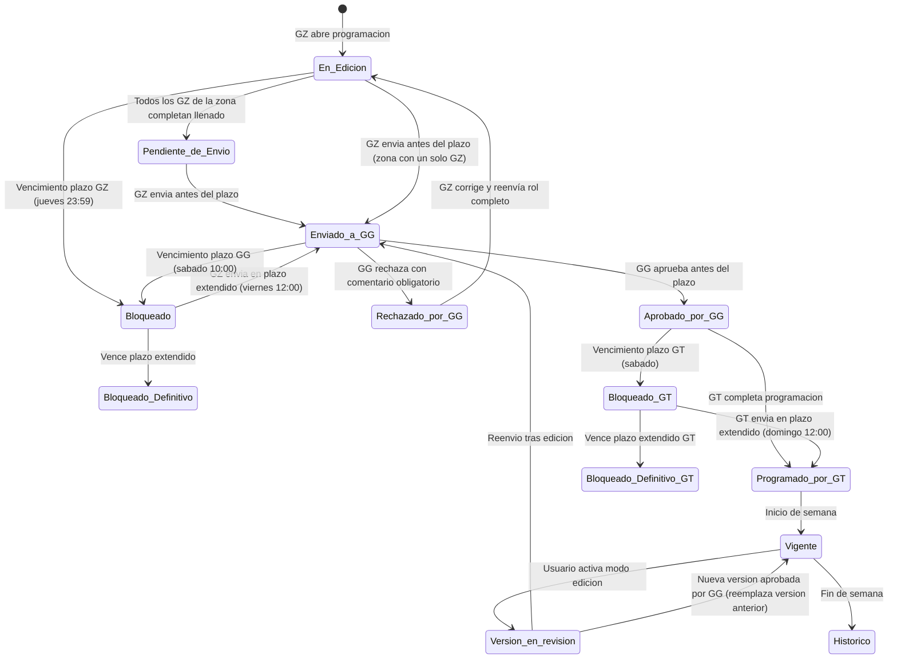

# ESPECIFICACION DE NECESIDADES TECNOLOGICAS
## ENT-MOD-ROLP-001 — Modulo de Rol de Personal
### Sistema Nova | Organizacion Retail Peruana (Cadena / Lukers)

| Campo | Valor |
|---|---|
| Codigo de documento | ENT-MOD-ROLP-001 |
| Version | 1.1 |
| Fecha de emision | 29/05/2026 |
| Estado | BORRADOR — Pendiente de validacion con stakeholders |
| Elaborado por | Analista Funcional Senior |
| Sistema | Nova |
| Modulo | Rol de Personal |
| Documentos relacionados | ENT-MOD-MARC-001 v1.1, ENT-MOD-DESC-001 v1.2 |

### Historial de versiones

| Version | Fecha | Descripcion |
|---|---|---|
| 1.0 | 29/05/2026 | Emision inicial. Especificacion funcional base del modulo Rol de Personal. Vacios documentados VAC-01 a VAC-25. |
| 1.1 | 29/05/2026 | Incorporacion de decisiones de negocio que resuelven VAC-01 a VAC-25. Actualizacion de reglas de negocio (RN-12, RN-21, RN-24, RN-36, RN-37, RN-42, RN-54 a RN-56, RN-57, RN-58, RN-61 a RN-73), casos de uso (CU-01, CU-03, CU-07, CU-08, CU-09, CU-10, CU-11, CU-12, CU-13), entidades, tabla de permisos e integraciones. Todos los vacios marcados como RESUELTOS. |

---

## INDICE

1. Introduccion y Objetivo del Modulo
2. Alcance y Exclusiones
3. Actores y Roles
4. Casos de Uso Principales
5. Reglas de Negocio
6. Estados del Rol y Transiciones
7. Entidades y Atributos Principales
8. Permisos por Rol
9. Integraciones
10. Vacios Funcionales y Preguntas Abiertas

---

## 1. INTRODUCCION Y OBJETIVO DEL MODULO

### 1.1 Contexto del negocio

Nova es un sistema de gestion desarrollado desde cero para una organizacion retail peruana con aproximadamente 100 tiendas distribuidas en multiples zonas geograficas. El grupo empresarial opera bajo dos cadenas comerciales: **Cadena** y **Lukers**. La semana laboral del sistema se define de **domingo a sabado** y es consistente con todos los modulos del sistema.

El personal de tienda se organiza por puestos: Seniors, Gerentes Titulares (asesores con cobertura de tienda), Asesores, Secretarias, Auxiliares y Sastres. La programacion semanal es el instrumento operativo central que determina la disponibilidad real del personal en cada tienda y dia de la semana.

### 1.2 Problema que resuelve

La organizacion carece de un sistema centralizado que permita:

- Programar semanalmente el estado de cada colaborador (descanso, cobertura, compensacion) de forma estructurada y trazable.
- Controlar los flujos de aprobacion jerarquica (GZ → GG → GT) con plazos y consecuencias automaticas por incumplimiento.
- Visualizar indicadores de rendimiento (ratios de cumplimiento de cuota y cobertura) directamente en el calendario de programacion para apoyar la toma de decisiones.
- Calcular y distribuir la cuota diaria por asesor disponible.
- Sincronizar la programacion aprobada con el sistema externo RMS (fuente de verdad de empleados y programaciones) y con el sistema POS/Cajas (bloqueo por incumplimiento).

### 1.3 Objetivo del modulo

Proveer el calendario semanal de programacion de personal de Nova que permita:

- Registrar los estados semanales de cada colaborador por tienda y puesto.
- Gestionar el flujo de aprobacion jerarquico con control de plazos y bloqueos automaticos.
- Mostrar ratios de rendimiento historico como apoyo a la decision de programacion de seniors.
- Calcular la cuota diaria aproximada por asesor disponible.
- Registrar los descansos laborales y compensaciones directamente desde el calendario (siendo el unico canal de entrada para estos eventos segun ENT-MOD-DESC-001).
- Proveer la vista especial de Sastres con sugerencia por logica parametrizable del sistema.
- Generar el historial de cambios para auditoria.

### 1.4 Relacion con otros modulos

- **Modulo de Descansos (ENT-MOD-DESC-001):** El calendario del Rol de Personal es el unico canal de registro de descansos laborales y compensaciones. El modulo de Descansos gestiona la logica de negocio y el historial; la interfaz de entrada reside en este modulo.
- **Modulo de Marcaciones (ENT-MOD-MARC-001):** El rol aprobado es la fuente de verdad para validar si un colaborador debe o no marcar asistencia en una tienda y dia determinado.
- **Modulo de Gestion de Encargatura:** Las coberturas de tienda y coberturas por tipo de venta se rigen bajo las reglas de encargatura. El calendario del Rol de Personal es el punto de entrada unico para registrar Cobertura de Tienda; el sistema crea automaticamente el registro correspondiente en Gestion de Encargatura. Este modulo es dependencia directa.
- **Modulo de Traslados:** Un traslado activo puede afectar la disponibilidad del colaborador en la tienda base y en la tienda destino.
- **Sistema POS / Cajas:** Receptor de los bloqueos automaticos por incumplimiento de plazos de aprobacion. Se reutiliza el canal de integracion Nova-POS ya definido en el modulo de Marcaciones.
- **RMS (API externa):** Fuente de verdad de empleados, programaciones, horarios, cuotas y ventas. Toda programacion aprobada se sincroniza hacia RMS. Al detectar baja en RMS, el empleado queda inactivo en el calendario desde esa fecha.
- **OFIPLAN (BOT):** Receptor de migraciones diferidas del rol aprobado.

---

## 2. ALCANCE Y EXCLUSIONES

### 2.1 Dentro del alcance

| # | Funcionalidad |
|---|---|
| 1 | Configuracion de filtros de programacion (año, semana, zona, tienda, puesto) con valores por defecto segun perfil. Filtros Zona y Tienda son opcionales. |
| 2 | Visualizacion del calendario semanal de domingo a sabado con columnas configurables por empresa y puesto |
| 3 | Registro de estados diarios por colaborador: Descanso Laboral, Cobertura de Tienda, Compensacion por Feriado Laborado, Compensacion por Descanso Laboral no Gozado, Cobertura por Tipo de Venta |
| 4 | Programacion individual de un estado en una celda del calendario |
| 5 | Programacion multiple (bloque) de un estado en varias celdas del mismo colaborador |
| 6 | Eliminacion de un estado programado antes del envio a aprobacion |
| 7 | Visualizacion de ratios de rendimiento historico para puestos de tipo Senior (por empresa) |
| 8 | Calculo y visualizacion de cuota aproximada diaria por asesor disponible (automatico desde RMS) |
| 9 | Adicion de personal Senior a la vista por parte de GG y GZ |
| 10 | Flujo de aprobacion GZ → GG → GT con plazos parametrizables |
| 11 | Bloqueo automatico de cajas por incumplimiento de plazos de aprobacion |
| 12 | Desbloqueo de cajas mediante codigo de autorizacion emitido por GZ |
| 13 | Edicion de rol aprobado o en curso con restriccion de dias pasados y reenvio a aprobacion. La programacion original sigue vigente mientras la nueva version esta en revision. |
| 14 | Vista especial de Sastres con sugerencia de programacion basada en reglas parametrizables del sistema, editable y aprobable por GZ |
| 15 | Cuadro de pendientes interactivo (compensaciones sin fecha asignada unicamente) |
| 16 | Historial de modificaciones para auditoria (visible para GZ de su zona, GG y Administracion de Ventas para todas) |
| 17 | Limitacion de programacion maxima a la semana siguiente a la semana actual |
| 18 | Envio masivo de correo al cierre del plazo del GZ (un correo por zona con programacion completa) |
| 19 | Alertas de vencimiento de plazo para GT (11:00 am y 11:30 am del dia limite) |
| 20 | Integracion con RMS para sincronizacion del rol aprobado |
| 21 | Integracion con OFIPLAN (BOT) para migracion diferida |
| 22 | Indicador visual de feriados en encabezado del calendario (tomado del calendario maestro de feriados) |
| 23 | Indicador visual de asistencia por empleado y dia en semana en curso (solo informativo) |
| 24 | Vista de comparacion programado vs asistencia real para semanas cerradas (exportable a Excel) |
| 25 | Exportacion del calendario a Excel y PDF segun perfil |
| 26 | Vista resumen ejecutivo por zona para GG |
| 27 | Notificacion automatica a GT cuando el GZ envia el rol de zona |
| 28 | Gestion de bloqueo de programacion ante suspension o cierre de tienda |
| 29 | Gestion de inactivacion de empleado en calendario ante baja en RMS |

### 2.2 Fuera del alcance

| # | Exclusion | Modulo responsable |
|---|---|---|
| 1 | Gestion de licencias (vacaciones, licencias medicas, LSGH, LCGH) | ENT-MOD-DESC-001 |
| 2 | Logica de negocio de encargaturas y cobertura de tienda | Modulo de Gestion de Encargatura |
| 3 | Logica de negocio de traslados | Modulo de Traslados |
| 4 | Registro y validacion de marcaciones biometricas | ENT-MOD-MARC-001 |
| 5 | Administracion maestro de empleados, puestos y cuotas | RMS (sistema externo) |
| 6 | Motor de inteligencia artificial para sugerencia de Sastres (la logica es del sistema, basada en reglas parametrizables; no se usa IA externa) | N/A — la logica reside en Nova |
| 7 | Calculo de nomina y descuentos | Sistema de RRHH |
| 8 | Administracion de horarios teoricos | RMS (sistema externo) |

---

## 3. ACTORES Y ROLES

| ID | Rol | Descripcion | Ambito |
|---|---|---|---|
| ROL-01 | Administrador de Ventas | Perfil de soporte operativo central. Acceso de consulta y configuracion de parametros. Acceso al historial de todas las zonas. | Central |
| ROL-02 | Senior | Colaborador que puede cubrir tiendas como encargado. No tiene acceso a la programacion del rol. Es sujeto de programacion. | Tienda |
| ROL-03 | Gerencia General (GG) | Nivel maximo de aprobacion del rol. Puede agregar seniors, aprobar roles enviados por GZ y editar roles. Vista resumen ejecutivo por zona. Acceso al historial de todas las zonas. | Central / Multi-zona |
| ROL-04 | Gerente de Ventas / Zonal (GZ) | Responsable de programar y enviar el rol de su zona a aprobacion. Puede agregar seniors. Emite codigos de desbloqueo. Vista consolidada de todas sus tiendas. Acceso al historial de su zona. | Zona (multi-tienda) |
| ROL-05 | Gerente de Tienda (GT) | Responsable de programar el rol de asesores, secretarias, auxiliares y sastres de su tienda, una vez que el GZ ha enviado el rol de la zona. Solo ve su tienda. No accede al historial de modificaciones. | Tienda |

**Notas sobre ambito:**
- Un GZ puede tener asignadas tiendas de una o varias zonas.
- Un GT tiene acceso exclusivo a su tienda base.
- El Senior es sujeto de programacion; no opera el modulo directamente.
- El GZ puede ver todas sus tiendas en vista consolidada cuando no selecciona tienda especifica. Si requiere detalle de una tienda, selecciona el filtro de tienda especifica (VAC-01 / VAC-21 RESUELTOS).

---

## 4. CASOS DE USO PRINCIPALES

---

### CU-01: Acceso y configuracion de filtros de programacion

```
ID: CU-01
Nombre: Acceso y configuracion de filtros de programacion
Actor principal: GZ, GT, GG, Administrador de Ventas
Relacionado: RN-01, RN-02, RN-03, RN-04, RN-05, RN-06, RN-07, RN-61, RN-62
```

**Precondicion:**
- El usuario ha iniciado sesion en Nova con un perfil habilitado para el modulo de Rol de Personal.
- El usuario tiene al menos una tienda asignada.

**Flujo principal:**
1. El usuario accede al modulo de Rol de Personal.
2. El sistema carga los filtros con los valores por defecto segun el perfil del usuario (RN-01 a RN-06).
3. Si el usuario tiene una sola tienda asignada, los campos Año, Semana, Empresa, Zona y Tienda se preseleccionan automaticamente (RN-06). El usuario puede modificar Año y Semana dentro del rango permitido.
4. Si el usuario tiene mas de una tienda, los campos Zona y Tienda muestran "Seleccione". El campo Puesto se preselecciona en "Seniors" (RN-07).
5. El usuario selecciona Zona (opcional): el sistema filtra las tiendas correspondientes a esa zona en orden alfabetico.
6. El usuario selecciona Tienda (opcional).
7. El usuario selecciona Puesto si desea cambiar el valor por defecto.
8. El sistema carga el calendario semanal segun los filtros seleccionados (continua en CU-02).

**Comportamiento segun perfil cuando Tienda no es seleccionada (VAC-01 / VAC-21 RESUELTOS):**
- **GZ sin filtro de tienda:** el sistema carga vista consolidada de todas las tiendas de su zona (o de todas sus zonas si tampoco selecciono Zona). Ver RN-61.
- **GT:** siempre ve solo su tienda. No puede seleccionar otras tiendas. Ver RN-62.
- **GG / Administrador de Ventas sin filtro de tienda:** el sistema carga vista consolidada de todas las tiendas segun Zona seleccionada o de todas las zonas si tampoco selecciono Zona.

**Flujos alternos:**
- A1. El usuario selecciona una semana distinta a la semana siguiente: el sistema valida que no supere la semana siguiente a la actual (RN-08). Si la supera, muestra el mensaje: "No se puede programar mas alla de la semana siguiente a la actual".
- A2. El usuario selecciona el puesto "Seniors" cuando su perfil es Gerente de Tienda: el sistema no muestra la opcion "Seniors" en el selector de puesto (RN-03).
- A3. El usuario selecciona el filtro "Sastres": el sistema reemplaza el calendario normal por la vista especial de Sastres (CU-12). Ver RN-63.

**Excepciones:**
- E1. El usuario no tiene tiendas asignadas: el sistema muestra un mensaje informativo y no carga el calendario.

**Postcondicion:**
- Los filtros quedan configurados y el sistema presenta el calendario semanal o la vista especial de Sastres correspondiente.

---

### CU-02: Visualizacion del calendario semanal

```
ID: CU-02
Nombre: Visualizacion del calendario semanal
Actor principal: GZ, GT, GG, Administrador de Ventas
Relacionado: RN-09, RN-10, RN-11, RN-12, RN-13, RN-14, RN-15, RN-64, RN-65, RN-66, RN-67, RN-68
```

**Precondicion:**
- Los filtros de programacion estan configurados (CU-01 completado).

**Flujo principal:**
1. El sistema consulta a RMS los datos de empleados activos para la tienda, puesto y semana seleccionados. Los empleados con baja en RMS desde la fecha en curso no aparecen en el calendario para dias posteriores a la baja (RN-67).
2. El sistema construye la tabla del calendario con las columnas correspondientes segun empresa y puesto:
   - Columnas fijas: Tienda, Puesto, Personal.
   - Si Empresa = Cadena y Puesto = Seniors: columnas de ratios segun RN-09.
   - Si Empresa = Lukers y Puesto = Seniors: columnas de ratios segun RN-10.
   - Columnas de dias: domingo a sabado con cabecera en formato "DIA – FECHA" (ej. DOMINGO 29-JUN). Los dias feriados se resaltan visualmente en el encabezado (color distinto o icono) tomando datos del calendario maestro de feriados (RN-64).
3. El sistema muestra los estados ya programados en cada celda (dia × colaborador) con el color correspondiente al estado (RN-18).
4. Si el puesto es Gt/Ases y el usuario es Gerente de Tienda: el sistema muestra en la parte inferior de cada columna de dia la cuota aproximada por asesor (RN-17 a RN-21).
5. Si la semana visualizada es la semana en curso: el sistema agrega indicador visual por empleado y dia mostrando si ya marco asistencia. El indicador es solo informativo y no editable desde este modulo (RN-65).
6. El sistema muestra el cuadro de pendientes en la parte inferior del calendario (CU-13).
7. Si el rol tiene estado "Version en revision" (edicion en curso de rol aprobado): el sistema muestra el indicador "Version en revision" sin afectar la operacion de la programacion vigente (RN-66).

**Flujos alternos:**
- A1. No hay empleados activos para el filtro seleccionado: el sistema muestra el calendario vacio con mensaje informativo.
- A2. El puesto seleccionado es Seniors: el sistema muestra la lista de seniors programados la semana anterior como punto de partida (RN-31).
- A3. El usuario consulta una semana anterior a la actual: el sistema muestra el calendario en modo solo lectura para todos los roles con acceso al modulo (RN-68).

**Excepciones:**
- E1. RMS no responde: el sistema muestra mensaje de error de conectividad y no carga el calendario.

**Postcondicion:**
- El calendario semanal esta visible con todos los estados, ratios, indicadores de asistencia y feriados correspondientes.

---

### CU-03: Programacion individual de estado

```
ID: CU-03
Nombre: Programacion individual de estado en una celda del calendario
Actor principal: GZ, GT
Relacionado: RN-18, RN-19, RN-20, RN-21, RN-22, RN-23, RN-24, RN-25, RN-26, RN-27, RN-28, RN-29, RN-69, RN-70
```

**Precondicion:**
- El calendario semanal esta visible (CU-02 completado).
- La celda seleccionada no tiene un estado programado (o es elegible para estado dual segun RN-25).
- El rol no ha sido enviado a aprobacion, o si fue aprobado, el modo edicion esta activo (CU-11).

**Flujo principal:**
1. El usuario hace clic en una celda libre del calendario (interseccion dia × colaborador).
2. El sistema despliega el selector de estados disponibles para ese colaborador segun su puesto y empresa (RN-18).
3. El usuario selecciona un estado.
4. Si el estado requiere parametro adicional (compensacion → feriado/semana laborada; cobertura de tienda → tienda destino; cobertura por tipo de venta → tipo de venta): el sistema muestra el campo requerido.
5. El usuario completa los parametros adicionales si corresponde.
6. El sistema valida las reglas de negocio aplicables (RN-19 a RN-29).
7. Si todas las validaciones son exitosas: el sistema registra el estado en la celda y actualiza el cuadro de pendientes si aplica.
8. Si el puesto es Gt/Ases y el actor es GT: el sistema recalcula la cuota aproximada por asesor para los dias afectados (RN-14).
9. Si el estado registrado es Cobertura de Tienda: el sistema crea automaticamente el registro correspondiente en el modulo de Gestion de Encargatura (RN-69).

**Flujos alternos:**
- A1. El estado seleccionado es "Cobertura de Tienda" y el actor no tiene permiso configurado: el sistema rechaza la accion con mensaje de permiso insuficiente (RN-70). Por defecto solo el GZ registra Cobertura de Tienda; los permisos son configurables en tabla de parametros.
- A2. El estado seleccionado es "Cobertura por Tipo de Venta" y la empresa no es Lukers: el sistema no muestra esta opcion en el selector.
- A3. El estado es "Descanso Laboral" y se supera el limite por puesto: el sistema muestra el mensaje "Alcanzo el maximo de dias de descanso laboral" y no registra el estado (RN-19).
- A4. El estado es "Compensacion" y no existe feriado o semana laborada pendiente de compensar para ese colaborador: el sistema informa que no hay conceptos disponibles para compensar.

**Excepciones:**
- E1. Error de concurrencia (dos usuarios modifican la misma celda simultaneamente): el sistema aplica bloqueo optimista y notifica al segundo usuario con el estado actualizado.

**Postcondicion:**
- El estado queda registrado en la celda con el color correspondiente.
- El cuadro de pendientes se actualiza si el estado afecta un concepto pendiente.
- La cuota aproximada por asesor se recalcula si aplica.
- Si el estado es Cobertura de Tienda, el registro en Gestion de Encargatura queda creado automaticamente.

---

### CU-04: Programacion multiple de estados (bloque)

```
ID: CU-04
Nombre: Programacion multiple de estados en bloque
Actor principal: GZ, GT
Relacionado: RN-27, RN-28 y todas las RN aplicables a CU-03
```

**Precondicion:**
- El calendario semanal esta visible.
- El actor mantiene presionada una celda para activar el modo de seleccion multiple.

**Flujo principal:**
1. El usuario mantiene presionada una celda del calendario.
2. El sistema activa el modo de seleccion multiple para ese colaborador.
3. El usuario selecciona celdas adicionales del mismo colaborador que no tengan estado programado.
4. El sistema resalta las celdas seleccionadas visualmente.
5. El usuario confirma la seleccion y elige el estado a aplicar.
6. El sistema valida las reglas de negocio (RN-27) para cada celda seleccionada individualmente.
7. El sistema aplica el estado en todas las celdas que superan la validacion. Las celdas que no superan la validacion quedan sin cambio y el sistema notifica cuales fueron rechazadas y por que.
8. Se actualiza el cuadro de pendientes y la cuota aproximada si aplica.

**Flujos alternos:**
- A1. El usuario intenta seleccionar celdas de distintos colaboradores en el mismo bloque: el sistema restringe la seleccion al colaborador de la primera celda seleccionada (RN-28).
- A2. Alguna celda del bloque ya tiene un estado programado distinto de Descanso Laboral (cuando el estado a aplicar es Cobertura por Tipo de Venta): el sistema aplica solo en celdas elegibles.

**Postcondicion:**
- Los estados validos quedan registrados en bloque.
- Se informa al usuario de las celdas omitidas con su motivo.

---

### CU-05: Eliminacion de estado programado

```
ID: CU-05
Nombre: Eliminacion de estado programado en una celda
Actor principal: GZ, GT
Relacionado: RN-29, RN-30
```

**Precondicion:**
- La celda contiene un estado programado.
- El rol no ha sido enviado a aprobacion (o el modo edicion esta activo para dias no pasados — CU-11).

**Flujo principal:**
1. El usuario hace clic sobre una celda con estado programado.
2. El sistema despliega el menu contextual con la opcion "Eliminar".
3. El usuario selecciona "Eliminar".
4. El sistema elimina el estado de la celda.
5. Si el estado eliminado era una compensacion: el sistema revierte el contador del cuadro de pendientes para ese concepto (RN-30).
6. Si aplica: el sistema recalcula la cuota aproximada por asesor.

**Flujos alternos:**
- A1. El rol ya fue enviado a aprobacion y no esta en modo edicion: el sistema no muestra la opcion "Eliminar" en el menu contextual.
- A2. El dia corresponde a un dia pasado en modo edicion: el sistema no permite eliminar (RN-29).

**Postcondicion:**
- La celda queda libre.
- El cuadro de pendientes se actualiza si corresponde.
- La cuota aproximada se recalcula si aplica.

---

### CU-06: Adicion de personal Senior

```
ID: CU-06
Nombre: Adicion de un colaborador Senior a la vista de programacion
Actor principal: GG, GZ
Relacionado: RN-31, RN-32, RN-33, RN-34
```

**Precondicion:**
- El calendario esta en vista "Seniors".
- El actor tiene perfil GG o GZ.

**Flujo principal:**
1. El usuario hace clic en el boton "Agregar".
2. El sistema despliega una lista de asesores, promotores y supervisores de seccion pertenecientes a la zona del usuario, que no esten ya incluidos en la vista actual.
3. El usuario selecciona el colaborador a agregar.
4. El sistema añade al colaborador como una fila nueva en el calendario con todas las celdas libres.
5. El colaborador aparece con sus ratios de rendimiento correspondientes si existen datos en RMS.

**Flujos alternos:**
- A1. El colaborador agregado no es programado en ningun dia de la semana actual: el sistema no lo incluye automaticamente en la semana siguiente (RN-33).
- A2. El colaborador fue agregado y programado en al menos un dia: el sistema lo incluye automaticamente en la semana siguiente (RN-34).

**Excepciones:**
- E1. No existen colaboradores disponibles para agregar en la zona: el sistema informa con mensaje "No hay personal disponible para agregar en esta zona".

**Postcondicion:**
- El colaborador queda disponible para programacion en la semana actual.

---

### CU-07: Envio a aprobacion por Gerente Zonal

```
ID: CU-07
Nombre: Envio del rol semanal a aprobacion por el Gerente Zonal
Actor principal: GZ
Relacionado: RN-35, RN-36, RN-37, RN-38, RN-39, RN-40, RN-41, RN-71, RN-72
```

**Precondicion:**
- El GZ tiene al menos un rol de tienda en estado "En Edicion" o "Pendiente de Envio".
- Si hay mas de un GZ responsable de la zona: todos deben haber completado el llenado. El sistema muestra indicador de quien falta (RN-36).
- Ningun dia del rol de asesores tiene cuota aproximada por asesor mayor a S/3,000 (parametrizable; aplica solo para empresa Cadena) (RN-21).
- La fecha y hora actual no supera el jueves a las 11:59 pm de la semana en curso (plazo parametrizable) (RN-35).

**Flujo principal:**
1. El GZ revisa el calendario completo de su zona.
2. El GZ hace clic en "Enviar a Aprobacion".
3. El sistema valida los prerequisitos (RN-35 a RN-41).
4. Si todas las validaciones son exitosas:
   a. El sistema registra el rol con estado "Enviado a GG".
   b. El sistema sincroniza la programacion en Nova para todas las tiendas de la zona.
   c. El sistema programa el envio masivo de un correo por zona a las 11:59 pm del jueves. El correo contiene la programacion completa de la zona y se envia una vez que todos los responsables de la zona han completado su parte (RN-37).
   d. El sistema envia notificacion automatica a los GT de las tiendas de la zona (por correo y push en app Nova) indicando que ya pueden programar su rol (RN-71).
5. La fecha y hora de envio quedan registradas en el historial.

**Flujos alternos:**
- A1. El plazo vence (jueves 11:59 pm) sin envio: el sistema ejecuta el bloqueo automatico de cajas de todas las tiendas del GZ (RN-38). Ver CU-10.
- A2. El GZ envia el rol entre el vencimiento del plazo inicial y el vencimiento del plazo extendido (viernes mediodia): el sistema acepta el envio, registra el incumplimiento y desbloquea las cajas (RN-39).
- A3. La cuota por asesor en algun dia supera S/3,000 (Cadena): el sistema bloquea el envio y muestra el dia y el monto que genera el conflicto (RN-21).
- A4. No todos los GZ de la zona han completado su parte: el sistema bloquea el envio y muestra el indicador de quien falta (RN-36).

**Excepciones:**
- E1. Error de comunicacion con RMS durante la sincronizacion: el sistema revierte el estado del rol a "Pendiente de Envio" y notifica al GZ.

**Postcondicion:**
- El rol queda en estado "Enviado a GG".
- El correo masivo queda programado o enviado segun el horario.
- Los GT de las tiendas reciben notificacion.
- El GG puede acceder al rol para aprobacion (CU-08).

---

### CU-08: Aprobacion del rol por Gerencia General

```
ID: CU-08
Nombre: Aprobacion del rol semanal por el Gerente General
Actor principal: GG
Relacionado: RN-42, RN-43, RN-44, RN-45, RN-72, RN-73
```

**Precondicion:**
- El GZ ha enviado el rol (estado "Enviado a GG").
- La fecha y hora actual no supera el sabado a las 10:00 am (plazo parametrizable) (RN-42).

**Flujo principal:**
1. El GG accede al modulo y visualiza los roles enviados pendientes de aprobacion. El sistema muestra la vista resumen ejecutivo por zona (RN-73).
2. El GG revisa el calendario semanal de cada zona.
3. El GG hace clic en "Aprobar".
4. El sistema registra el rol con estado "Aprobado por GG".
5. El sistema habilita al GT de cada tienda aprobada para ingresar y programar su propio rol (condicion para CU-09).
6. La fecha y hora de aprobacion quedan registradas en el historial.

**Flujos alternos:**
- A1. El GG rechaza el rol con comentarios: el sistema regresa el rol al estado "En Edicion" con comentario obligatorio. El GZ recibe notificacion con el motivo del rechazo. El GZ debe corregir y reenviar el rol completo de la zona (RN-72).
- A2. El GZ rechaza el rol del GT con comentarios antes de enviarlo a GG: el sistema regresa el rol del GT al estado "En Edicion" con comentario obligatorio. El GT debe corregir y reenviar (RN-72).
- A3. El plazo vence (sabado 10:00 am) sin aprobacion: el sistema envia recordatorio automatico al GG a 1 hora antes del plazo. Al vencer sin accion: cajas bloqueadas automaticamente y notificacion a Administracion de Ventas (RN-44). Los plazos y destinatarios son parametrizables.
- A4. El GG accede a la vista resumen ejecutivo: el sistema muestra estado del rol por zona (Pendiente/Enviado/Aprobado/Rechazado), porcentaje de tiendas con rol completo, alertas de plazos proximos a vencer y cajas bloqueadas activas (RN-73).

**Postcondicion:**
- El rol queda en estado "Aprobado por GG".
- Los GT de las tiendas incluidas quedan habilitados para programar su propio rol.

---

### CU-09: Programacion del rol por Gerente de Tienda

```
ID: CU-09
Nombre: Programacion del rol de asesores por el Gerente de Tienda
Actor principal: GT
Relacionado: RN-44, RN-45, RN-46, RN-47, RN-48, RN-49
```

**Precondicion:**
- El GG ha aprobado el rol de la zona correspondiente (estado "Aprobado por GG") (RN-44).
- La fecha actual es sabado o antes (plazo parametrizable) (RN-45).
- El GT accede al modulo con puesto "Gt/Ases" seleccionado.

**Flujo principal:**
1. El GT accede al calendario de su tienda para la semana programada.
2. El sistema muestra todos los asesores con tienda base en la tienda del GT, junto con la cuota aproximada por asesor por dia.
3. El GT programa los estados de cada asesor segun la disponibilidad (CU-03, CU-04).
4. El GT revisa que la cuota por asesor no supere el limite parametrizable en ningun dia (aplica para Cadena).
5. El GT hace clic en "Enviar" para cerrar su programacion.
6. El sistema registra el rol del GT con estado "Programado por GT".
7. Se actualiza el historial.

**Flujos alternos:**
- A1. El plazo vence (sabado) sin programacion del GT: el sistema bloquea la caja de su tienda el domingo (RN-46). Ver CU-10.
- A2. La cuota por asesor en algun dia supera S/3,000 (Cadena): el sistema bloquea el envio (RN-21).

**Excepciones:**
- E1. El rol del GZ aun no fue aprobado por GG: el sistema muestra mensaje "El rol de su zona no ha sido aprobado aun. No puede programar su rol." (RN-44).

**Postcondicion:**
- El rol del GT queda registrado en estado "Programado por GT".
- El historial refleja la fecha y hora de programacion.

---

### CU-10: Bloqueo y desbloqueo de cajas por incumplimiento

```
ID: CU-10
Nombre: Bloqueo automatico y desbloqueo de cajas por incumplimiento de plazos
Actor principal: Sistema (automatico), GZ (emite codigo), GT (recibe codigo)
Relacionado: RN-38, RN-39, RN-40, RN-41, RN-43, RN-44, RN-46, RN-47, RN-48, RN-49
```

**Precondicion:**
- Se ha vencido un plazo de programacion o aprobacion sin cumplimiento.

**Flujo principal — Incumplimiento GZ:**
1. El sistema detecta que el jueves 11:59 pm vencio sin que el GZ enviara el rol.
2. El sistema envia la señal de bloqueo al sistema POS de todas las tiendas del GZ: estado "Ventas Bloqueadas". (Se reutiliza el canal de integracion Nova-POS del modulo de Marcaciones. No se desarrolla infraestructura nueva.)
3. El GZ recibe notificacion de incumplimiento.
4. El GZ emite un codigo de desbloqueo individual para cada tienda desde Nova (web o app movil).
5. El GT ingresa el codigo en su sistema POS: las cajas se desbloquean.
6. El GZ tiene plazo hasta el viernes al mediodia para enviar el rol (plazo extendido parametrizable) (RN-39).
7. Si el GZ envia el rol antes del viernes al mediodia: el sistema registra el envio, las cajas no vuelven a bloquearse.
8. Si el viernes al mediodia vence sin envio: el sistema vuelve a bloquear las cajas de las tiendas pendientes (RN-40).

**Flujo principal — Incumplimiento GT:**
1. El sistema detecta que el sabado vencio sin que el GT programara su rol.
2. El domingo el sistema envia la señal de bloqueo al POS de la tienda del GT: "Ventas Bloqueadas".
3. El GT recibe notificacion.
4. El GT solicita al GZ un codigo de desbloqueo.
5. El GZ emite el codigo desde Nova.
6. El GT ingresa el codigo en el POS: la caja se desbloquea.
7. El GT tiene plazo hasta el domingo al mediodia para enviar su rol (RN-47).
8. Alertas previas al vencimiento del domingo: a las 11:00 am ("Queda 1 hora para enviar su rol") y a las 11:30 am ("Quedan 30 minutos para enviar su rol") (RN-48).
9. Si el domingo al mediodia vence sin programacion: las cajas vuelven a bloquearse (RN-49).

**Flujo principal — Incumplimiento GG (aprobacion):**
1. El sistema detecta que el sabado 10:00 am esta proximo a vencer.
2. El sistema envia recordatorio automatico al GG a 1 hora antes del plazo (RN-44).
3. Si el sabado 10:00 am vence sin aprobacion: el sistema envia señal de bloqueo al POS de todas las tiendas con roles no aprobados y notifica a Administracion de Ventas (RN-43, RN-44). Los plazos y destinatarios son parametrizables.

**Excepciones:**
- E1. El sistema POS no recibe la señal de bloqueo: se genera alerta en el modulo de operaciones para seguimiento manual.
- E2. El codigo de desbloqueo ya fue utilizado o esta vencido: el sistema rechaza el codigo con mensaje de error y el GZ debe emitir uno nuevo.

**Postcondicion:**
- Las cajas quedan en el estado correspondiente segun el cumplimiento de los plazos.
- Todos los eventos de bloqueo y desbloqueo quedan registrados en el historial de auditoria.

---

### CU-11: Edicion de rol aprobado o en curso

```
ID: CU-11
Nombre: Edicion de un rol que ya fue aprobado o esta en curso de la semana
Actor principal: GZ, GT, GG
Relacionado: RN-50, RN-51, RN-52, RN-53, RN-66
```

**Precondicion:**
- El rol tiene estado "Aprobado por GG" o "En curso" (semana actual).
- El usuario accede a la semana correspondiente.

**Flujo principal:**
1. El usuario accede a la semana del rol aprobado o en curso.
2. El sistema detecta que el rol ya fue aprobado y muestra el boton "Editar".
3. El usuario hace clic en "Editar".
4. El sistema habilita la edicion exclusivamente para los dias iguales o posteriores al dia actual (RN-50). Los dias pasados quedan bloqueados.
5. El sistema muestra el indicador "Version en revision" en el calendario para todos los usuarios (RN-66). La programacion original sigue vigente y la operacion no se interrumpe.
6. El usuario realiza las modificaciones necesarias (CU-03, CU-04, CU-05).
7. El usuario envia nuevamente el rol a aprobacion: GT → GZ → GG (RN-51).
8. El sistema registra las modificaciones en el historial de cambios con usuario, fecha, hora y detalle del cambio (RN-52).
9. Una vez aprobada la nueva version: la nueva version reemplaza a la anterior (RN-53). El indicador "Version en revision" desaparece.

**Flujos alternos:**
- A1. El usuario intenta modificar un dia pasado: el sistema bloquea la interaccion en esa celda con tooltip "No se puede modificar dias pasados".

**Postcondicion:**
- Las modificaciones quedan en historial de auditoria.
- El rol entra nuevamente al flujo de aprobacion hasta ser aprobado por GG.
- La programacion vigente original se mantiene operativa hasta que la nueva version sea aprobada.

---

### CU-12: Vista de Sastres con sugerencia por logica parametrizable

```
ID: CU-12
Nombre: Visualizacion y edicion de la vista de Sastres con sugerencia basada en reglas parametrizables
Actor principal: GZ (aprobacion), GT (visualizacion y edicion previa)
Relacionado: RN-54, RN-55, RN-56, RN-63
```

**Precondicion:**
- El usuario selecciona el filtro de Puesto = "Sastres".
- Existen sastres asignados a la tienda o zona seleccionada.

**Flujo principal:**
1. El sistema reemplaza el calendario normal por la vista especial de Sastres al seleccionar el filtro "Sastres" (RN-63). La vista es independiente del calendario normal y agrupa a todos los sastres segun los filtros de zona o tienda seleccionados.
2. El sistema calcula la sugerencia de programacion de descansos para la semana seleccionada usando la logica del sistema basada en reglas parametrizables (no IA externa). Las sugerencias son transparentes, auditables y editables (RN-54, RN-55).
3. El sistema muestra la sugerencia en las celdas correspondientes con una marca visual que la identifica como "Sugerencia del sistema".
4. El GZ o GT puede aceptar la sugerencia o editarla (agregar, modificar o eliminar estados sugeridos). Los cambios son editables antes de aprobar.
5. El GZ aprueba la programacion de sastres.
6. La programacion aprobada se registra en el sistema y sigue el flujo normal de envio y aprobacion.

**Flujos alternos:**
- A1. El motor de reglas no genera sugerencia: el sistema informa "Sugerencia no disponible" y permite la programacion manual.
- A2. El GT modifica la sugerencia: los cambios quedan pendientes de aprobacion por GZ.

**Postcondicion:**
- La programacion de sastres queda aprobada por GZ con o sin modificacion de la sugerencia del sistema.

---

### CU-13: Visualizacion del cuadro de pendientes

```
ID: CU-13
Nombre: Visualizacion y actualizacion interactiva del cuadro de pendientes
Actor principal: GZ, GT, GG (solo lectura), Administrador de Ventas (solo lectura)
Relacionado: RN-57, RN-58, RN-59, RN-60
```

**Precondicion:**
- El calendario semanal esta visible.

**Flujo principal:**
1. El sistema muestra el cuadro de pendientes en la parte inferior del calendario.
2. El cuadro lista para cada colaborador del calendario unicamente las compensaciones sin fecha asignada (RN-57):
   - Feriados pendientes de compensar (cantidad de dias).
   - Descansos laborales no gozados pendientes de compensar (cantidad de semanas o dias).
   - Las compensaciones ya programadas en semanas futuras no aparecen en el cuadro.
3. Cuando el usuario programa una compensacion en el calendario (CU-03): el sistema descuenta automaticamente el concepto correspondiente del cuadro de pendientes en tiempo real.
4. Cuando el usuario elimina una compensacion (CU-05): el sistema revierte el contador en tiempo real.

**Flujos alternos:**
- A1. Un colaborador no tiene pendientes: el sistema muestra "0" o la fila queda vacia segun diseño de UX.

**Postcondicion:**
- El cuadro de pendientes refleja en todo momento el estado real de los conceptos pendientes de compensacion sin fecha asignada para los colaboradores visibles en el calendario.

---

### CU-14: Consulta de historial de modificaciones

```
ID: CU-14
Nombre: Consulta del historial de modificaciones del rol
Actor principal: GZ (su zona), GG (todas), Administrador de Ventas (todas)
Relacionado: RN-52, RN-61b
```

**Precondicion:**
- El usuario tiene perfil GZ, GG o Administrador de Ventas.

**Flujo principal:**
1. El usuario accede a la opcion de historial de modificaciones del rol.
2. El sistema muestra el historial de cambios segun el ambito del perfil:
   - GZ: solo registros de su zona.
   - GG y Administrador de Ventas: registros de todas las zonas.
3. Cada registro muestra: usuario, fecha, hora, celda modificada, estado anterior y estado nuevo.

**Flujos alternos:**
- A1. El usuario tiene perfil GT: el sistema no muestra la opcion de historial de modificaciones.

**Postcondicion:**
- El usuario puede consultar el historial de cambios segun su ambito de acceso.

---

### CU-15: Exportacion del calendario

```
ID: CU-15
Nombre: Exportacion del calendario a Excel o PDF
Actor principal: GZ, GT, GG, Administrador de Ventas
Relacionado: RN-74
```

**Precondicion:**
- El calendario semanal esta visible o el usuario solicita exportacion desde el historial.

**Flujo principal:**
1. El usuario selecciona la opcion de exportar (Excel o PDF).
2. El sistema aplica la restriccion de ambito segun perfil (RN-74):
   - GZ: exporta datos de su zona.
   - GT: exporta datos de su tienda.
   - GG y Administrador de Ventas: sin restriccion de ambito.
3. El sistema genera el archivo en el formato seleccionado.
4. El archivo queda disponible para descarga.

**Postcondicion:**
- El archivo exportado contiene los datos del ambito correspondiente al perfil del usuario.

---

### CU-16: Vista de comparacion programado vs asistencia real

```
ID: CU-16
Nombre: Vista de comparacion programado vs asistencia real para semanas cerradas
Actor principal: GZ, GG, Administrador de Ventas
Relacionado: RN-75
```

**Precondicion:**
- La semana seleccionada es una semana ya cerrada (historica).
- El usuario tiene perfil GZ, GG o Administrador de Ventas.

**Flujo principal:**
1. El usuario accede a la semana cerrada en el calendario.
2. El sistema muestra la vista comparativa con la programacion planificada y la asistencia real registrada (RN-75).
3. El usuario puede exportar la comparacion a Excel.

**Postcondicion:**
- El usuario puede analizar las desviaciones entre la programacion y la asistencia real.

---

## 5. REGLAS DE NEGOCIO

### 5.1 Filtros y navegacion

| ID | Regla | Verificacion |
|---|---|---|
| RN-01 | El campo Año muestra por defecto el año correspondiente a la semana siguiente a la fecha actual del sistema. | Verificar que al ingresar al modulo el año del filtro sea correcto segun el calendario de semanas. |
| RN-02 | El campo Semana muestra por defecto la semana siguiente a la semana actual. Ejemplo: si hoy es martes 2 de julio 2025 (semana 27), se muestra la semana 28 (6–12 de julio). | Verificar para fechas de prueba en distintas posiciones de la semana (inicio, medio, fin). |
| RN-03 | El selector de Puesto no muestra la opcion "Seniors" cuando el perfil del usuario es Gerente de Tienda. | Verificar que el listado de opciones de puesto no incluya Seniors para el perfil GT. |
| RN-04 | El campo Zona muestra unicamente las zonas asignadas al usuario, en orden alfabetico. Si el usuario tiene tiendas en mas de una zona, el campo muestra "Seleccione" por defecto. | Verificar que un usuario multi-zona vea "Seleccione" y que un usuario de una sola zona tenga la zona preseleccionada. |
| RN-05 | El campo Tienda esta condicionado por la zona seleccionada y muestra las tiendas en orden alfabetico. Si el usuario tiene mas de una tienda, muestra "Seleccione" por defecto. | Verificar el filtrado de tiendas al cambiar zona y el comportamiento con usuario de tienda unica. |
| RN-06 | Cuando el usuario tiene una sola tienda asignada, los campos Año, Semana, Empresa, Zona y Tienda se preseleccionan automaticamente. El usuario puede modificar Año y Semana dentro del rango permitido. | Verificar con usuario de tienda unica que los campos queden preseleccionados. |
| RN-07 | Cuando el usuario tiene mas de una tienda asignada, el campo Puesto se preselecciona en "Seniors". | Verificar con usuario multi-tienda. |
| RN-08 | No se puede programar una semana mas alla de la semana siguiente a la semana actual. El sistema muestra el mensaje: "No se puede programar mas alla de la semana siguiente a la actual". Esta regla aplica a todos los perfiles. | Intentar seleccionar la semana actual + 2 y verificar el rechazo. |

### 5.1b Filtros — Comportamiento segun perfil (VAC-01 / VAC-21 RESUELTOS)

| ID | Regla | Verificacion |
|---|---|---|
| RN-61 | Los filtros Zona y Tienda son opcionales. Sin filtro de Tienda, el GZ ve todas las tiendas de su zona (o zonas si tampoco filtro por Zona) en vista consolidada. El GT siempre ve solo su tienda sin posibilidad de cambiar el filtro de Tienda. | Verificar que GZ sin filtro de tienda vea vista consolidada. Verificar que GT no pueda seleccionar otra tienda. |
| RN-62 | El GT siempre ve solo su tienda base, independientemente de los filtros seleccionados. El sistema ignora o bloquea cualquier seleccion de tienda distinta a la suya. | Verificar que el selector de tienda del GT este fijo o deshabilitado para tiendas distintas. |
| RN-63 | Al seleccionar Puesto = "Sastres", el sistema reemplaza el calendario normal por la vista especial de Sastres. La vista de Sastres es independiente y usa logica del sistema basada en reglas parametrizables (no IA externa). Las sugerencias son transparentes, auditables y editables antes de aprobar. | Verificar que al seleccionar Sastres el calendario normal desaparezca y se muestre la vista especial. |

### 5.2 Ratios de rendimiento — Cadena

| ID | Regla | Verificacion |
|---|---|---|
| RN-09 | En la vista Seniors de empresa Cadena, el calendario muestra las siguientes columnas de ratio en el orden indicado: (1) [Mes Anterior] Asesor %, (2) [Mes Actual] Asesor %, (3) [Mes Anterior] Senior %, (4) [Mes Actual] Senior %, (5) Sem [#-4] Senior %, (6) Sem [#-3] Senior %, (7) Sem [#-2] Senior %, (8) Sem [#-1] Senior %. Los porcentajes se presentan con 1 decimal. Valores >= 100% se muestran en texto azul; valores < 100% en texto rojo. | Verificar columnas, calculo de semanas relativas, y colores con datos de prueba. |

### 5.3 Ratios de rendimiento — Lukers

| ID | Regla | Verificacion |
|---|---|---|
| RN-10 | En la vista Seniors de empresa Lukers, el calendario muestra las siguientes columnas de ratio: (1) [Mes Anterior] % Cuota Asesor, (2) [Mes Actual] % Cuota Asesor, (3) [Mes Anterior] Senior %, (4) [Mes Actual] Senior %, (5) Ases 3 Semanas % (parametrizable), (6) Teso 3 Semanas % (parametrizable), (7) Sem [#-3] Senior %, (8) Sem [#-2] Senior %, (9) Sem [#-1] Senior %. Formato identico a RN-09. | Verificar columnas, parametrizacion del numero de semanas y colores. |

### 5.4 Cuota aproximada por asesor (VAC-03 RESUELTO)

| ID | Regla | Verificacion |
|---|---|---|
| RN-11 | La cuota aproximada por asesor es visible unicamente para el Gerente de Tienda en la programacion de asesores (puesto Gt/Ases). | Verificar que GZ y GG no la vean en esta vista. |
| RN-12 | La cuota proyectada del dia = Venta del mismo dia de la semana anterior dividido entre la Cuota del asesor de ese dia. Es un calculo automatico obtenido desde RMS; no es un parametro configurable. El resultado es solo informativo y no se carga a RMS. | Verificar que el calculo sea automatico y que no exista campo de configuracion para esta formula. Verificar que el valor no se sincronice a RMS. |
| RN-13 | La cuota por asesor de un dia = cuota diaria ÷ cantidad de asesores activos disponibles ese dia (asesores sin Descanso Laboral, sin Compensacion y sin Vacaciones activas). El resultado es solo informativo y no se carga a RMS. | Verificar el calculo con distintas combinaciones de asesores disponibles. |
| RN-14 | Si se programa un estado que reduce la disponibilidad de un asesor para un dia, la cuota por asesor se recalcula automaticamente para ese dia. | Programar un descanso y verificar el recalculo en tiempo real. |
| RN-15 | Si se elimina un estado que habia reducido la disponibilidad de un asesor, la cuota por asesor se recalcula automaticamente. | Eliminar un estado y verificar el recalculo. |
| RN-16 | (Trasladado — ver RN-21) |  |
| RN-17 | La cuota aproximada por asesor se muestra en la parte inferior de cada columna de dia en el calendario. | Verificar posicion visual. |

### 5.5 Estados y restricciones de programacion

| ID | Regla | Verificacion |
|---|---|---|
| RN-18 | Los estados disponibles para programar son: (1) Descanso Laboral [Verde], (2) Cobertura de Tienda [Azul], (3) Compensacion por Feriado Laborado [Naranja], (4) Compensacion por Descanso Laboral no Gozado [Naranja], (5) Cobertura por Tipo de Venta [Amarillo]. El orden de visualizacion sigue el numero de orden definido. | Verificar que los estados se muestren en el orden correcto. |
| RN-19 | El estado Descanso Laboral aplica para todos los colaboradores. No puede superar el limite maximo de dias por puesto (parametrizable). Error: "Alcanzo el maximo de dias de descanso laboral". | Intentar superar el limite y verificar el mensaje de error. |
| RN-20 | El estado Cobertura de Tienda no aplica para: sastres, auxiliares, reponedores, prevencionistas y Gerentes de Tienda. El calendario del Rol de Personal es el punto de entrada unico; al registrar este estado el sistema crea automaticamente el registro en Gestion de Encargatura. | Verificar que estos perfiles/puestos no vean la opcion y que la creacion automatica en Encargatura se ejecute. |
| RN-21 | No se puede enviar el rol a aprobacion si algun dia tiene cuota por asesor mayor a S/3,000 (monto parametrizable). Esta restriccion aplica exclusivamente para la empresa Cadena. Para Lukers no aplica. | Verificar que el envio quede bloqueado para Cadena y no bloqueado para Lukers ante el mismo escenario. |
| RN-22 | El estado Compensacion requiere que el usuario seleccione el feriado o la semana laborada que se esta compensando. La compensacion es 1 a 1 (un dia de compensacion por cada dia de feriado o descanso laborado). | Verificar que sin seleccion del concepto a compensar no se pueda guardar. |
| RN-23 | El estado Cobertura de Tienda requiere que el GZ seleccione la tienda que el colaborador cubrira. Se rige bajo las reglas del modulo de Gestion de Encargatura. | Verificar que sin tienda destino no se pueda guardar. |
| RN-24 | El estado Cobertura por Tipo de Venta aplica unicamente para tiendas de empresa Lukers. No aplica para Gerentes de Tienda. El usuario debe seleccionar el tipo de venta. Por defecto solo el GZ puede registrar este estado; los permisos son configurables por roles y perfiles en tabla de parametros. | Verificar exclusion de Cadena y GT. Verificar que el permiso sea configurable. |
| RN-25 | La Cobertura por Tipo de Venta es el unico estado que puede coexistir con Descanso Laboral en el mismo dia para el mismo colaborador. Todos los demas estados son mutuamente excluyentes en el mismo dia. | Verificar que solo esta combinacion dual es permitida. |
| RN-26 | Los estados Compensacion por Feriado Laborado y Compensacion por Descanso Laboral no Gozado aplican para todos los colaboradores sin restriccion de puesto. | Verificar disponibilidad para todos los puestos. |

### 5.6 Programacion multiple

| ID | Regla | Verificacion |
|---|---|---|
| RN-27 | La programacion multiple se activa al mantener presionada una celda del calendario. Solo permite seleccionar celdas del mismo colaborador. Las celdas ya programadas (con un estado distinto al compatible) no pueden incluirse en el bloque. | Verificar que no se puedan seleccionar celdas de otros colaboradores. |
| RN-28 | Al aplicar un estado en bloque, cada celda es validada individualmente. Las celdas que no superan la validacion quedan sin cambio. El sistema informa las celdas rechazadas y el motivo. | Verificar reporte de celdas rechazadas en bloque. |

### 5.7 Eliminacion de estado

| ID | Regla | Verificacion |
|---|---|---|
| RN-29 | Un estado programado puede eliminarse unicamente antes de que el rol sea enviado a aprobacion o, si el rol esta en modo edicion (CU-11), solo para dias iguales o posteriores a la fecha actual. | Verificar que no se pueda eliminar estados de dias pasados en modo edicion. |
| RN-30 | Al eliminar una compensacion, el contador del cuadro de pendientes revierte el concepto compensado en tiempo real. | Verificar reversion del contador. |

### 5.8 Adicion de personal Senior

| ID | Regla | Verificacion |
|---|---|---|
| RN-31 | En la vista Seniors, el sistema muestra por defecto los colaboradores que fueron programados en la semana anterior. | Verificar que la semana siguiente muestre los seniors de la semana anterior. |
| RN-32 | Solo GG y GZ pueden agregar personal Senior. La lista de candidatos incluye asesores, promotores y supervisores de seccion de la zona del usuario. | Verificar que GT y Admin de Ventas no tengan el boton "Agregar" en la vista Seniors. |
| RN-33 | Si un colaborador es agregado a la vista Seniors pero no se le programa ningun estado durante esa semana, no aparecera automaticamente en la semana siguiente. | Agregar un senior sin programarlo y verificar que no aparece la semana siguiente. |
| RN-34 | Si un colaborador es agregado y se le programa al menos un estado durante la semana, aparecera automaticamente en la semana siguiente. | Agregar y programar un senior y verificar que aparece la semana siguiente. |

### 5.9 Flujo de aprobacion — Gerente Zonal

| ID | Regla | Verificacion |
|---|---|---|
| RN-35 | El plazo del GZ para enviar el rol es el jueves a las 11:59 pm de la semana en programacion (parametrizable por empresa). | Verificar que al pasar la hora limite no se pueda enviar por la via normal. |
| RN-36 | Si hay mas de un GZ responsable de la misma zona, todos deben haber completado el llenado de su parte antes de poder enviar el rol de la zona. El sistema muestra indicador de quien falta. El envio queda bloqueado hasta que todos completen. | Verificar que el envio quede bloqueado y que el indicador muestre correctamente quien falta. |
| RN-37 | Al enviar el rol, el sistema sincroniza la programacion en Nova para todas las tiendas incluidas y programa el envio de un unico correo por zona (con la programacion completa) a las 11:59 pm del jueves. El correo se envia una vez que todos los responsables de la zona han completado su parte. | Verificar la sincronizacion, que sea un solo correo por zona y que contenga la programacion completa. |
| RN-38 | Si el GZ no envia el rol antes del jueves 11:59 pm, el sistema bloquea automaticamente las cajas de todas las tiendas del GZ con estado "Ventas Bloqueadas". | Verificar el bloqueo automatico. |
| RN-39 | El GZ tiene un plazo extendido hasta el viernes al mediodia para enviar el rol con las cajas desbloqueadas mediante codigo. | Verificar que el envio sea posible en el periodo extendido. |
| RN-40 | Si el GZ no envia el rol antes del viernes al mediodia, las cajas de las tiendas pendientes vuelven a bloquearse automaticamente. | Verificar el re-bloqueo automatico al vencer el plazo extendido. |
| RN-41 | El GZ emite un codigo de desbloqueo individual por tienda para el periodo de plazo extendido. | Verificar la emision y uso del codigo. |

### 5.10 Flujo de aprobacion — Gerencia General

| ID | Regla | Verificacion |
|---|---|---|
| RN-42 | El plazo del GG para aprobar los roles enviados por GZ es el sabado a las 10:00 am (parametrizable). | Verificar que al pasar el plazo se ejecute el bloqueo. |
| RN-43 | Si el GG no aprueba un rol antes del sabado 10:00 am, las cajas de las tiendas con roles no aprobados quedan bloqueadas automaticamente y se notifica a Administracion de Ventas. | Verificar el bloqueo automatico y la notificacion. |
| RN-44 | El sistema envia recordatorio automatico al GG a 1 hora antes del plazo del sabado. Al vencer sin accion: cajas bloqueadas automaticamente y notificacion a Administracion de Ventas. Los plazos y destinatarios de notificacion son parametrizables en tabla de parametros. | Verificar el recordatorio, el bloqueo y la notificacion. Verificar que plazos y destinatarios sean parametrizables. |
| RN-45 | El rechazo del rol por GG o GZ requiere comentarios obligatorios. El rechazo obliga a corregir y reenviar el rol completo (de zona en caso de rechazo por GG, de tienda en caso de rechazo por GZ). | Verificar que no se pueda rechazar sin comentario y que el rol completo deba ser reenviado. |

### 5.11 Flujo de aprobacion — Gerente de Tienda

| ID | Regla | Verificacion |
|---|---|---|
| RN-46 | El GT solo puede acceder a programar su rol una vez que el GG ha aprobado el rol de la zona. Si el GG no ha aprobado, el sistema muestra: "El rol de su zona no ha sido aprobado aun. No puede programar su rol." | Verificar el bloqueo previo a la aprobacion del GG. |
| RN-47 | El plazo del GT para completar su programacion es el sabado (parametrizable). | Verificar que al vencer el sabado se ejecute el bloqueo. |
| RN-48 | Si el GT no completa su programacion antes del sabado, el sistema bloquea la caja de su tienda el domingo. | Verificar el bloqueo automatico el domingo. |
| RN-49 | El GT dispone de un plazo extendido hasta el domingo al mediodia, con la caja desbloqueada mediante codigo emitido por el GZ. | Verificar el plazo extendido y el codigo. |
| RN-48b | El sistema envia alertas al GT a las 11:00 am del domingo ("Queda 1 hora para enviar su rol") y a las 11:30 am del domingo ("Quedan 30 minutos para enviar su rol"). | Verificar el envio de alertas en los tiempos indicados. |
| RN-49b | Si el GT no envia su rol antes del domingo al mediodia, las cajas vuelven a bloquearse automaticamente. | Verificar el re-bloqueo automatico. |

### 5.12 Edicion de rol aprobado o en curso

| ID | Regla | Verificacion |
|---|---|---|
| RN-50 | En modo edicion de un rol aprobado o en curso, solo pueden modificarse los dias iguales o posteriores a la fecha actual del sistema. Los dias pasados estan bloqueados para edicion. | Verificar que las celdas de dias pasados no sean editables. |
| RN-51 | Toda modificacion de un rol aprobado requiere reenvio al flujo de aprobacion completo: GT → GZ → GG. | Verificar que tras la edicion el rol vuelva al estado inicial del flujo. |
| RN-52 | Cada modificacion de un rol queda registrada en el historial de cambios con: usuario, fecha, hora, celda modificada, estado anterior y estado nuevo. | Verificar el registro de auditoria tras cada modificacion. |
| RN-53 | Una vez aprobada la nueva version del rol editado, reemplaza a la version anterior. | Verificar que la version anterior ya no sea vigente. |
| RN-66 | Mientras una nueva version del rol esta en revision (enviada a aprobacion pero aun no aprobada), la programacion original sigue vigente. El sistema muestra el indicador "Version en revision" en el calendario sin afectar la operacion actual. | Verificar que el indicador aparezca y que la programacion vigente no cambie hasta la aprobacion de la nueva version. |

### 5.13 Vista de Sastres (VAC-10 / VAC-13 RESUELTOS)

| ID | Regla | Verificacion |
|---|---|---|
| RN-54 | La vista de Sastres es independiente y reemplaza el calendario normal al seleccionar el filtro "Sastres". Agrupa a todos los sastres segun los filtros de zona o tienda seleccionados. El GZ puede ver sastres de multiples tiendas si no filtra por tienda especifica. | Verificar que la vista agrupe correctamente y que el GZ pueda ver multiples tiendas. |
| RN-55 | El sistema genera sugerencias de programacion para Sastres y Seniors usando logica del sistema basada en reglas parametrizables. No se usa inteligencia artificial externa. Las sugerencias son transparentes, auditables y editables antes de ser aprobadas por el GZ. | Verificar que no exista dependencia de servicio de IA externo. Verificar que las sugerencias sean editables. |
| RN-56 | La sugerencia del sistema en la vista de Sastres es editable: el GZ o GT puede aceptar, modificar o rechazar cada estado sugerido. La sugerencia no tiene efecto hasta ser aprobada por el GZ. | Verificar que la sugerencia no quede guardada sin aprobacion del GZ. |

### 5.14 Cuadro de pendientes (VAC-11 RESUELTO)

| ID | Regla | Verificacion |
|---|---|---|
| RN-57 | El cuadro de pendientes muestra unicamente compensaciones sin fecha asignada. Las compensaciones ya programadas en semanas futuras no aparecen en el cuadro. El cuadro no es editable directamente; solo se actualiza por las acciones de programacion y eliminacion en el calendario. | Verificar que compensaciones ya programadas en futuro no aparezcan. Verificar ausencia de campos de entrada directa. |
| RN-58 | El cuadro de pendientes muestra: feriados pendientes de compensar y descansos laborales no gozados pendientes de compensar sin fecha asignada, para cada colaborador visible en el calendario. | Verificar que los conceptos pendientes correspondan al historial del colaborador y que los ya programados no aparezcan. |
| RN-59 | Al programar una compensacion en el calendario, el contador del concepto compensado se reduce en 1 en tiempo real (sin necesidad de refrescar la pagina). | Verificar actualizacion en tiempo real. |
| RN-60 | Al eliminar una compensacion, el contador del concepto compensado se incrementa en 1 en tiempo real. | Verificar reversion en tiempo real. |

### 5.15 Funcionalidades adicionales resueltas

| ID | Regla | Verificacion |
|---|---|---|
| RN-64 | Los dias feriados se resaltan visualmente en el encabezado del calendario (color distinto o icono) tomando datos del calendario maestro de feriados del sistema. | Verificar que los feriados del maestro aparezcan resaltados en el encabezado del calendario. |
| RN-65 | Para la semana en curso, el calendario agrega un indicador visual por empleado y dia mostrando si ya marco asistencia. El indicador es solo informativo y no es editable desde el modulo de Rol de Personal. | Verificar que el indicador sea visible y que no habilite edicion. |
| RN-67 | Al detectar baja en RMS, el empleado queda inactivo en el calendario desde la fecha de baja. Los dias anteriores se mantienen como historico. El sistema genera alerta automatica a GZ y GT. No se permite nueva programacion desde la fecha de baja. | Verificar que el empleado dado de baja no aparezca en dias posteriores a la baja, que los historicos se mantengan y que la alerta se envie. |
| RN-68 | Los roles de semanas anteriores son consultables en modo solo lectura para todos los roles con acceso al modulo. | Verificar que semanas pasadas no sean editables para ningun perfil. |
| RN-69 | Al registrar Cobertura de Tienda desde el calendario del Rol, el sistema crea automaticamente el registro en el modulo de Gestion de Encargatura. El calendario del Rol de Personal es el punto de entrada unico para este evento. | Verificar que al guardar una Cobertura de Tienda exista el registro correspondiente en Encargatura. |
| RN-70 | Por defecto solo el GZ puede registrar Cobertura de Tienda y solo el GZ puede registrar Cobertura por Tipo de Venta. Los permisos para estos estados son configurables por roles y perfiles en la tabla de parametros del sistema. | Verificar el comportamiento por defecto y que el cambio de parametro sea efectivo. |
| RN-71 | Al enviar el rol de zona, el sistema envia notificacion automatica a los GT de las tiendas incluidas por correo electronico y push en app Nova, indicando que ya pueden programar su rol de tienda. | Verificar que los GT reciban notificacion por ambos canales al envio del rol de zona. |
| RN-72 | El rechazo del rol (por GZ al GT o por GG al GZ) requiere comentarios obligatorios. El actor rechazado debe corregir y reenviar el rol completo (no solo las celdas modificadas). La aprobacion es por zona completa. | Verificar que no se pueda rechazar sin comentario y que se exija reenvio del rol completo. |
| RN-73 | El GG tiene acceso a una vista resumen ejecutivo por zona que muestra: estado del rol (Pendiente/Enviado/Aprobado/Rechazado), porcentaje de tiendas con rol completo, alertas de plazos proximos a vencer y cajas bloqueadas activas. | Verificar que la vista ejecutiva muestre todos los indicadores descritos. |
| RN-74 | La exportacion del calendario esta disponible en formatos Excel y PDF. El GZ exporta datos de su zona, el GT solo datos de su tienda, el GG y Administracion de Ventas sin restriccion de ambito. | Verificar las restricciones de exportacion por perfil. |
| RN-75 | La vista de comparacion programado vs asistencia real esta disponible para semanas cerradas. Es visible para GZ (su zona), GG (todas) y Administracion de Ventas (todas). El GT no tiene acceso. La vista es exportable a Excel. | Verificar acceso por perfil y que el GT no pueda acceder. Verificar exportacion a Excel. |
| RN-76 | Al suspender o cerrar una tienda, se bloquea nueva programacion desde esa fecha. Los dias anteriores se mantienen como historico. El sistema envia notificacion automatica a GZ y Administracion de Ventas. | Verificar el bloqueo de programacion desde la fecha de suspension y la notificacion automatica. |

---

## 6. ESTADOS DEL ROL Y TRANSICIONES

### 6.1 Estados del documento de Rol (flujo de aprobacion)

| Estado | Descripcion | Actor que lo establece |
|---|---|---|
| En Edicion | El rol esta siendo construido o editado por el GZ. | Sistema (al crear o al regresar de un rechazo) |
| Pendiente de Envio | El rol esta completo pero no ha sido enviado a GG. | Sistema (al completar el llenado de todos los GZ de la zona) |
| Enviado a GG | El GZ envio el rol dentro del plazo. Esperando aprobacion de GG. | GZ |
| Rechazado por GG | El GG rechazo el rol con comentario obligatorio. Regresa al GZ para correccion y reenvio del rol completo. | GG |
| Aprobado por GG | El GG aprobo el rol. El GT queda habilitado para programar su parte. | GG |
| Programado por GT | El GT completo la programacion de asesores. | GT |
| Version en revision | El rol aprobado o vigente tiene una version en proceso de reaprobacion. La version original sigue vigente. | Sistema (al activar modo edicion en rol aprobado) |
| Vigente | El rol esta activo en la semana en curso. | Sistema (al inicio de la semana) |
| Historico | La semana del rol ya concluyo. Consultable en modo solo lectura. | Sistema (al cierre de la semana) |
| Bloqueado — Ventas Bloqueadas | El plazo vencio sin cumplimiento. Las cajas de las tiendas estan bloqueadas. | Sistema (automatico) |

### 6.2 Diagrama de transiciones (Mermaid)



### 6.3 Estados de celda del calendario

| Estado | Color | Empresa | Puestos aplicables |
|---|---|---|---|
| Vacio (sin estado) | Sin color (fondo blanco) | Ambas | Todos |
| Descanso Laboral | Verde | Ambas | Todos |
| Cobertura de Tienda | Azul | Ambas | Excluye: sastres, auxiliares, reponedores, prevencionistas, GT |
| Compensacion por Feriado Laborado | Naranja | Ambas | Todos |
| Compensacion por Descanso Laboral no Gozado | Naranja | Ambas | Todos |
| Cobertura por Tipo de Venta | Amarillo | Solo Lukers | Excluye GT |

---

## 7. ENTIDADES Y ATRIBUTOS PRINCIPALES

### 7.1 RolSemanal

| Atributo | Tipo | Descripcion |
|---|---|---|
| id | UUID | Identificador unico del rol |
| empresa | Enum (Cadena, Lukers) | Empresa del grupo |
| zona_id | FK | Zona a la que pertenece el rol |
| tienda_id | FK | Tienda a la que pertenece el rol (puede ser nula si es un rol de zona) |
| anio | Integer | Año del calendario |
| numero_semana | Integer | Numero de semana ISO (domingo a sabado) |
| fecha_inicio | Date | Domingo de la semana |
| fecha_fin | Date | Sabado de la semana |
| puesto | Enum (Seniors, GtAses, Secretarias, Auxiliares, Sastres) | Tipo de puesto del rol |
| estado | Enum | Estado del flujo de aprobacion (ver seccion 6.1) |
| version | Integer | Numero de version del rol (para ediciones) |
| version_vigente_id | FK RolSemanal / Null | Referencia a la version actualmente vigente cuando hay una version en revision |
| creado_por | FK Usuario | Usuario que creo el rol |
| fecha_creacion | DateTime | Fecha y hora de creacion |
| enviado_por_gz | FK Usuario | GZ que realizo el envio |
| fecha_envio_gz | DateTime | Fecha y hora del envio del GZ |
| aprobado_por_gg | FK Usuario | GG que aprobo |
| fecha_aprobacion_gg | DateTime | Fecha y hora de aprobacion del GG |
| programado_por_gt | FK Usuario | GT que completo la programacion |
| fecha_programacion_gt | DateTime | Fecha y hora de programacion del GT |

### 7.2 ProgramacionDia

| Atributo | Tipo | Descripcion |
|---|---|---|
| id | UUID | Identificador unico |
| rol_semanal_id | FK | Rol al que pertenece |
| colaborador_id | FK | Colaborador programado |
| fecha | Date | Dia especifico de la programacion |
| estado | Enum | Estado programado para ese dia (ver seccion 6.3) |
| tienda_cobertura_id | FK Tienda / Null | Tienda a cubrir (solo Cobertura de Tienda) |
| tipo_venta | String / Null | Tipo de venta (solo Cobertura por Tipo de Venta) |
| concepto_compensacion_id | FK / Null | Feriado o descanso que se compensa (solo Compensaciones) |
| es_sugerencia_sistema | Boolean | Indica si el estado fue sugerido por la logica del sistema (Sastres / Seniors) |
| registrado_por | FK Usuario | Usuario que realizo el registro |
| fecha_registro | DateTime | Fecha y hora del registro |
| encargatura_id | FK Encargatura / Null | Referencia al registro creado automaticamente en Gestion de Encargatura (solo Cobertura de Tienda) |

### 7.3 RatioRendimiento

| Atributo | Tipo | Descripcion |
|---|---|---|
| id | UUID | Identificador unico |
| colaborador_id | FK | Colaborador |
| empresa | Enum | Cadena o Lukers |
| tipo_ratio | Enum | Asesor_MesAnterior, Asesor_MesActual, Senior_MesAnterior, Senior_MesActual, Senior_SemRelativa, Ases3Sem, Teso3Sem |
| referencia_semana | Integer / Null | Semana de referencia para ratios de semanas relativas |
| referencia_mes | Integer / Null | Mes de referencia para ratios mensuales |
| referencia_anio | Integer | Año de referencia |
| porcentaje | Decimal(5,1) | Valor del ratio en porcentaje |
| fuente | Enum (RMS) | Sistema origen del dato |

### 7.4 CuotaAproximadaDia

| Atributo | Tipo | Descripcion |
|---|---|---|
| id | UUID | Identificador unico |
| rol_semanal_id | FK | Rol al que pertenece |
| tienda_id | FK | Tienda |
| fecha | Date | Dia del calculo |
| venta_dia_semana_anterior | Decimal | Venta del mismo dia de la semana anterior (obtenida de RMS) |
| cuota_asesor_dia_semana_anterior | Decimal | Cuota del asesor del mismo dia de la semana anterior (obtenida de RMS) |
| cuota_proyectada_dia | Decimal | Resultado del calculo: venta_dia_semana_anterior / cuota_asesor_dia_semana_anterior (solo informativo, no se carga a RMS) |
| asesores_disponibles | Integer | Cantidad de asesores disponibles ese dia |
| cuota_por_asesor | Decimal | Resultado del calculo distribuido (solo informativo) |

### 7.5 BloqueoTienda

| Atributo | Tipo | Descripcion |
|---|---|---|
| id | UUID | Identificador unico |
| tienda_id | FK | Tienda bloqueada |
| rol_semanal_id | FK | Rol que origino el bloqueo |
| motivo | Enum | VencimientoGZ, VencimientoGG, VencimientoGT |
| fecha_bloqueo | DateTime | Cuando se ejecuto el bloqueo |
| fecha_desbloqueo | DateTime / Null | Cuando se ejecuto el desbloqueo |
| desbloqueado_por | FK Usuario / Null | GZ que emitio el codigo de desbloqueo |
| codigo_desbloqueo | String / Null | Codigo emitido para desbloqueo temporal |
| codigo_usado_en | DateTime / Null | Cuando se uso el codigo |

### 7.6 HistorialCambioRol

| Atributo | Tipo | Descripcion |
|---|---|---|
| id | UUID | Identificador unico |
| rol_semanal_id | FK | Rol modificado |
| programacion_dia_id | FK / Null | Celda modificada |
| tipo_evento | Enum | Creacion, Modificacion, Eliminacion, Envio, Aprobacion, Rechazo, Bloqueo, Desbloqueo |
| estado_anterior | String / Null | Estado previo a la modificacion |
| estado_nuevo | String / Null | Estado posterior a la modificacion |
| usuario_id | FK | Usuario que realizo el evento |
| fecha_evento | DateTime | Fecha y hora del evento |
| comentario | String / Null | Comentario del GG/GZ en rechazo u observaciones |

### 7.7 ParametroRol

| Atributo | Tipo | Descripcion |
|---|---|---|
| id | UUID | Identificador unico |
| empresa | Enum | Cadena o Lukers |
| clave | String | Nombre del parametro |
| valor | String | Valor del parametro |
| descripcion | String | Descripcion del parametro |
| Ejemplos de clave: | | plazo_envio_gz (jueves 23:59), plazo_aprobacion_gg (sabado 10:00), plazo_programacion_gt (sabado), limite_cuota_asesor_dia (3000; aplica solo Cadena), semanas_ratio_lukers (3), limite_descanso_por_puesto, destinatarios_notificacion_bloqueo, permiso_cobertura_tienda_por_rol, permiso_cobertura_tipo_venta_por_rol |

### 7.8 AlertaFeriado (referencia al calendario maestro)

| Atributo | Tipo | Descripcion |
|---|---|---|
| fecha_feriado | Date | Fecha del feriado segun calendario maestro |
| descripcion | String | Descripcion del feriado |
| empresa | Enum / Null | Si aplica para una empresa especifica o para ambas |
| Nota: | | Esta entidad es de referencia. El calendario maestro de feriados es administrado fuera del modulo de Rol de Personal. |

### 7.9 TiendaEstado

| Atributo | Tipo | Descripcion |
|---|---|---|
| id | UUID | Identificador unico |
| tienda_id | FK | Tienda |
| estado | Enum (Activa, Suspendida, Cerrada) | Estado operativo de la tienda |
| fecha_cambio | Date | Fecha desde la que aplica el nuevo estado |
| motivo | String / Null | Motivo de la suspension o cierre |
| Nota: | | Al registrar suspension o cierre, el sistema bloquea nueva programacion desde esa fecha y notifica a GZ y Administracion de Ventas (RN-76). |

---

## 8. PERMISOS POR ROL

| Accion | Administrador de Ventas | Senior | GG | GZ | GT |
|---|---|---|---|---|---|
| Ver el calendario semanal | Si (solo lectura) | No | Si | Si | Si (su tienda) |
| Ver calendarios de semanas anteriores (modo solo lectura) | Si | No | Si | Si | Si (su tienda) |
| Programar estado en calendario | No | No | Si | Si | Si (su tienda, puestos habilitados) |
| Eliminar estado en calendario | No | No | Si | Si | Si (su tienda, solo antes de envio) |
| Programacion multiple (bloque) | No | No | Si | Si | Si |
| Ver ratios de rendimiento | Si | No | Si | Si | No (no es su vista) |
| Ver cuota aproximada por asesor | No | No | No | No | Si (puesto Gt/Ases) |
| Agregar personal Senior | No | No | Si | Si | No |
| Enviar rol a aprobacion (GZ) | No | No | No | Si | No |
| Aprobar rol (GG) | No | No | Si | No | No |
| Rechazar rol (GG) con comentario obligatorio | No | No | Si | No | No |
| Rechazar rol del GT (GZ) con comentario obligatorio | No | No | No | Si | No |
| Programar rol de asesores (GT) | No | No | No | No | Si |
| Editar rol aprobado o en curso | No | No | Si | Si | Si (su tienda) |
| Ver y usar modo edicion | No | No | Si | Si | Si |
| Emitir codigo de desbloqueo de caja | No | No | No | Si | No |
| Usar codigo de desbloqueo en POS | No | No | No | No | Si |
| Ver cuadro de pendientes | Si (lectura) | No | Si (lectura) | Si | Si |
| Ver vista de Sastres | No | No | Si | Si | Si (su tienda) |
| Aprobar sugerencia del sistema de Sastres | No | No | No | Si | No |
| Editar sugerencia del sistema de Sastres | No | No | No | Si | Si |
| Ver historial de cambios | Si (todas las zonas) | No | Si (todas las zonas) | Si (su zona) | No |
| Configurar parametros del modulo | Si | No | No | No | No |
| Registrar Cobertura de Tienda (por defecto) | No | No | No | Si | No |
| Registrar Cobertura por Tipo de Venta (por defecto) | No | No | No | Si | No |
| Ver vista resumen ejecutivo por zona | No | No | Si | No | No |
| Ver comparacion programado vs asistencia real | Si | No | Si | Si | No |
| Exportar calendario (Excel/PDF) | Si (sin restriccion) | No | Si (sin restriccion) | Si (su zona) | Si (su tienda) |

**Nota:** Los permisos de "Registrar Cobertura de Tienda" y "Registrar Cobertura por Tipo de Venta" son configurables por roles y perfiles en la tabla de parametros del sistema (RN-70).

---

## 9. INTEGRACIONES

### 9.1 RMS (API externa — fuente de verdad)

| # | Sentido | Dato | Frecuencia | Notas |
|---|---|---|---|---|
| INT-01 | RMS → Nova | Lista de colaboradores activos por tienda y puesto | Bajo demanda (al cargar el calendario) | Base para construir las filas del calendario. Si RMS notifica baja de un empleado, Nova lo marca como inactivo desde la fecha de baja (RN-67). |
| INT-02 | RMS → Nova | Ventas del mismo dia de la semana anterior y cuota del asesor de ese dia | Bajo demanda (al calcular cuota aproximada) | La cuota proyectada = venta dia semana anterior / cuota asesor dia semana anterior. Calculo automatico desde RMS, no configurable (RN-12). |
| INT-03 | RMS → Nova | Ventas y cumplimiento de cuota por colaborador (ratios) | Bajo demanda (al cargar vista Seniors) | Fuente de los ratios mensuales y semanales |
| INT-04 | RMS → Nova | Programaciones y horarios del colaborador | Bajo demanda | Insumo para determinar disponibilidad |
| INT-05 | Nova → RMS | Rol aprobado (programacion semanal por colaborador y dia) | Al aprobar el GG y al aprobar el GG post-edicion | Sincronizacion del rol aprobado como programacion vigente. La cuota aproximada NO se sincroniza a RMS (solo informativa). |

### 9.2 OFIPLAN (BOT — migracion diferida)

| # | Sentido | Dato | Frecuencia | Notas |
|---|---|---|---|---|
| INT-06 | Nova → OFIPLAN | Rol aprobado (migracion diferida) | Posterior a la aprobacion del GG | El BOT consume el rol aprobado en diferido para actualizacion en OFIPLAN |

### 9.3 Modulo de Descansos (ENT-MOD-DESC-001)

| # | Relacion | Descripcion |
|---|---|---|
| INT-07 | Bidireccional | El calendario del Rol de Personal es el unico canal de entrada para Descansos Laborales y Compensaciones. El modulo de Descansos provee la lista de conceptos pendientes de compensar SIN fecha asignada para el cuadro de pendientes y valida los limites por puesto y semana. |
| INT-08 | Descansos → Rol | Al registrar un descanso o compensacion en el calendario, el modulo de Descansos actualiza el saldo y el historial correspondiente. |
| INT-09 | Descansos → Rol | El modulo de Descansos provee la lista de feriados pendientes y descansos no gozados sin fecha asignada por colaborador para alimentar el cuadro de pendientes. Las compensaciones ya programadas en semanas futuras no se incluyen. |

### 9.4 Modulo de Marcaciones (ENT-MOD-MARC-001)

| # | Relacion | Descripcion |
|---|---|---|
| INT-10 | Rol → Marcaciones | El rol aprobado es la fuente de verdad para que el modulo de Marcaciones valide si un colaborador debe o no marcar en una tienda y dia determinado. Una programacion activa (descanso, cobertura, compensacion) bloquea la marcacion del colaborador en su tienda base si aplica. |

### 9.5 Modulo de Gestion de Encargatura

| # | Relacion | Descripcion |
|---|---|---|
| INT-11 | Encargatura → Rol | Las reglas de Cobertura de Tienda y Cobertura por Tipo de Venta se rigen bajo las reglas del modulo de Gestion de Encargatura. El Rol de Personal delega la logica de negocio de encargatura a este modulo. |
| INT-12 | Rol → Encargatura | Al registrar una Cobertura de Tienda en el calendario, el sistema crea automaticamente el registro en el modulo de Encargatura. El calendario del Rol de Personal es el punto de entrada unico para este evento. No se desarrolla infraestructura nueva; se reutiliza la integracion existente. |

### 9.6 Modulo de Traslados

| # | Relacion | Descripcion |
|---|---|---|
| INT-13 | Traslados → Rol | Un traslado activo puede afectar la disponibilidad del colaborador en la tienda base y en la tienda destino. El modulo de Rol consulta al modulo de Traslados para validar la disponibilidad del colaborador antes de registrar un estado. |

### 9.7 Sistema POS / Cajas

| # | Sentido | Dato | Frecuencia | Notas |
|---|---|---|---|---|
| INT-14 | Nova → POS | Señal de bloqueo de caja por incumplimiento | Automatico al vencer el plazo | El POS recibe la señal y bloquea las operaciones de venta. Se reutiliza el canal de integracion Nova-POS ya definido en el modulo de Marcaciones. No se desarrolla infraestructura nueva (VAC-07 RESUELTO). |
| INT-15 | Nova → POS | Codigo de desbloqueo de caja | Bajo demanda (emitido por GZ) | El POS valida el codigo y habilita temporalmente las operaciones. |
| INT-16 | Nova → POS | Señal de re-bloqueo | Automatico al vencer el plazo extendido | El POS recibe la señal y vuelve a bloquear las operaciones. |

### 9.8 Motor de sugerencias de Sastres y Seniors (logica interna del sistema)

| # | Sentido | Dato | Frecuencia | Notas |
|---|---|---|---|---|
| INT-17 | Nova (interno) | Datos de sastres/seniors, disponibilidad historica, descansos previos | Bajo demanda (al abrir vista Sastres o Seniors) | El motor de reglas es interno al sistema Nova. No requiere servicio de IA externo. Las reglas son parametrizables (VAC-10 / VAC-11 / VAC-13 RESUELTOS). |
| INT-18 | Nova (interno) | Sugerencia de programacion (estado por dia x colaborador) | Bajo demanda | Nova muestra la sugerencia con marca visual. La sugerencia es transparente, auditable y editable antes de aprobar. |

---

## 10. VACIOS FUNCIONALES Y PREGUNTAS ABIERTAS

Todos los vacios documentados en la version 1.0 han sido resueltos con las decisiones de negocio incorporadas en la version 1.1. A continuacion se registra el estado final de cada vacio.

### 10.1 Vacios resueltos (originalmente de alta prioridad)

| ID | Area | Decision tomada | Seccion actualizada |
|---|---|---|---|
| VAC-01 | Filtros | RESUELTO. Los filtros Zona y Tienda son opcionales. Sin filtro de Tienda, el GZ ve todas las tiendas de su zona en vista consolidada. El GT siempre ve solo su tienda. | RN-61, RN-62, CU-01 |
| VAC-02 | Correo masivo | RESUELTO. El envio del correo se bloquea hasta que todos los responsables de la zona completen su rol. El sistema muestra indicador de quien falta. El correo es uno solo por zona con programacion completa. | RN-36, RN-37, CU-07 |
| VAC-03 | Cuota aproximada | RESUELTO. La cuota proyectada del dia = Venta del mismo dia de la semana anterior / Cuota del asesor de ese dia. Es calculo automatico desde RMS, no parametro configurable. La cuota no se carga a RMS. | RN-12, 7.4 CuotaAproximadaDia |
| VAC-04 | Cuota aproximada | RESUELTO. La restriccion de cuota maxima por asesor (S/3,000 parametrizable) aplica solo para la empresa Cadena. | RN-21 |
| VAC-05 | Cobertura de Tienda | RESUELTO. Al registrar Cobertura de Tienda desde el calendario del Rol, el sistema crea automaticamente el registro en Gestion de Encargatura. El calendario es el punto de entrada unico. | RN-69, INT-12, CU-03 |
| VAC-06 | Cobertura por Tipo de Venta | RESUELTO. Por defecto solo el GZ registra Cobertura por Tipo de Venta. Los permisos son configurables por roles y perfiles en tabla de parametros. | RN-70, RN-24, tabla de permisos |
| VAC-07 | Bloqueo de cajas | RESUELTO. Se reutiliza el canal de integracion Nova-POS ya definido en el modulo de Marcaciones. No se desarrolla infraestructura nueva. | INT-14, INT-15, INT-16, CU-10 |
| VAC-08 | Edicion con version en revision | RESUELTO. La programacion original sigue vigente mientras la nueva version esta en revision. El sistema muestra indicador "Version en revision" sin afectar la operacion actual. | RN-66, CU-11, estado "Version en revision" |
| VAC-09 | Flujo de aprobacion — rechazo | RESUELTO. Aprobacion por zona completa. Rechazo con comentarios obliga a corregir y reenviar el rol completo. | RN-45, RN-72, CU-08 |
| VAC-10 | Vista de Sastres | RESUELTO. La vista de Sastres es independiente y reemplaza el calendario normal al seleccionar ese filtro. Usa logica del sistema basada en reglas parametrizables (no IA). Las sugerencias son editables y requieren aprobacion del GZ. | RN-54, RN-55, RN-56, RN-63, CU-12 |
| VAC-11 | Cuadro de pendientes | RESUELTO. El cuadro de pendientes muestra unicamente compensaciones sin fecha asignada. Las ya programadas en semanas futuras no aparecen. | RN-57, RN-58, CU-13 |
| VAC-12 | Vencimiento plazo GG | RESUELTO. Recordatorio automatico al GG a 1 hora antes del plazo del sabado. Al vencer sin accion: cajas bloqueadas automaticamente y notificacion a Administracion de Ventas. Plazos y destinatarios parametrizables. | RN-44, ParametroRol, CU-10 |
| VAC-13 | Motor de sugerencias | RESUELTO. Sastres y Seniors usan logica del sistema basada en reglas parametrizables, no IA. Las sugerencias son transparentes, auditables y editables antes de aprobar. | RN-55, INT-17, INT-18, seccion 2.2 |
| VAC-14 | Historial de modificaciones | RESUELTO. Visible solo para GZ (su zona), GG (todas) y Administracion de Ventas (todas). El GT no tiene acceso. | RN-52, tabla de permisos, CU-14 |
| VAC-15 | Suspension o cierre de tienda | RESUELTO. Al suspender o cerrar una tienda, se bloquea nueva programacion desde esa fecha. Dias anteriores se mantienen como historico. Notificacion automatica a GZ y Administracion de Ventas. | RN-76, entidad TiendaEstado |

### 10.2 Vacios resueltos (originalmente de media prioridad)

| ID | Area | Decision tomada | Seccion actualizada |
|---|---|---|---|
| VAC-16 | Indicador de asistencia en calendario | RESUELTO. El calendario muestra la programacion planificada como base. Para la semana en curso agrega indicador visual por empleado y dia mostrando si ya marco asistencia. Solo informativo, no editable desde el Rol de Personal. | RN-65, CU-02 |
| VAC-17 | Semanas anteriores en modo lectura | RESUELTO. Roles de semanas anteriores consultables en modo solo lectura para todos los roles con acceso al modulo. | RN-68, CU-02 |
| VAC-18 | Exportacion | RESUELTO. Exportacion a Excel y PDF. GZ exporta su zona, GT solo su tienda, Administracion de Ventas y GG sin restriccion. | RN-74, CU-15, tabla de permisos |
| VAC-19 | Baja de empleado en RMS | RESUELTO. Al detectar baja en RMS, el empleado queda inactivo en el calendario desde esa fecha. Dias anteriores se mantienen como historico. Alerta automatica a GZ y GT. No se permite nueva programacion desde la fecha de baja. | RN-67, INT-01, 1.4 |
| VAC-20 | Vista resumen GG | RESUELTO. GG tiene vista resumen ejecutivo por zona con: estado del rol, porcentaje de tiendas con rol completo, alertas de plazos proximos a vencer y cajas bloqueadas activas. | RN-73, CU-08 |
| VAC-21 | Vista consolidada GZ | RESUELTO. GZ puede ver todas sus tiendas en vista consolidada cuando no selecciona tienda especifica. Si quiere detalle de una tienda, selecciona el filtro de tienda especifica. | RN-61, CU-01 |
| VAC-22 | Notificacion GT al envio de rol de zona | RESUELTO. Notificacion automatica al GT por correo y push en app Nova cuando el GZ envia el rol de zona y el GT ya puede programar su rol. | RN-71, CU-07 |
| VAC-23 | Feriados en calendario | RESUELTO. Los dias feriados se resaltan visualmente en el encabezado del calendario (color distinto o icono) tomando datos del calendario maestro de feriados. | RN-64, CU-02 |
| VAC-24 | Rechazo del GT por GZ | RESUELTO. El GZ puede rechazar el rol del GT con comentarios obligatorios antes de enviarlo a GG. El GT debe corregir y reenviar. | RN-45, RN-72, CU-08 |
| VAC-25 | Comparacion programado vs real | RESUELTO. Vista de comparacion programado vs asistencia real para semanas cerradas. Visible para GZ, GG y Administracion de Ventas. Exportable a Excel. | RN-75, CU-16, tabla de permisos |

### 10.3 Vacios pendientes

No existen vacios pendientes en esta version. Si durante el desarrollo o la validacion con stakeholders surgen nuevas preguntas, se documentaran en la version 1.2.

---

## APENDICE: MATRIZ DE TRAZABILIDAD

| Requerimiento funcional | Caso de Uso | Regla(s) de Negocio | Criterio de Aceptacion |
|---|---|---|---|
| Configuracion de filtros con valores por defecto segun perfil | CU-01 | RN-01 a RN-08, RN-61, RN-62 | Al ingresar al modulo, los filtros reflejan el año y semana correctos. Usuario GT no ve "Seniors". Usuario con 1 tienda tiene todos los filtros preseleccionados. GZ sin filtro de tienda ve vista consolidada. GT siempre ve solo su tienda. |
| Visualizacion de calendario con ratios por empresa | CU-02 | RN-09, RN-10 | Vista Seniors Cadena muestra 8 columnas de ratio. Vista Seniors Lukers muestra 9 columnas. Valores >= 100% en azul, < 100% en rojo. |
| Calculo y visualizacion de cuota aproximada por asesor | CU-02, CU-03, CU-04, CU-05 | RN-11 a RN-17, RN-21 | Cuota visible solo para GT en puesto Gt/Ases. Calculo automatico desde RMS (venta semana anterior / cuota asesor semana anterior). No configurable. No se carga a RMS. Restriccion de S/3,000 solo para Cadena. |
| Feriados resaltados en encabezado del calendario | CU-02 | RN-64 | Los dias feriados del calendario maestro aparecen con color distinto o icono en el encabezado del calendario. |
| Indicador de asistencia en semana en curso | CU-02 | RN-65 | El indicador por empleado y dia aparece en la semana en curso. No es editable desde el Rol de Personal. |
| Indicador "Version en revision" | CU-02, CU-11 | RN-66 | Al editar un rol aprobado, aparece el indicador sin interrumpir la programacion vigente. |
| Programacion individual de estados con validaciones | CU-03 | RN-18 a RN-26, RN-69, RN-70 | Cada estado respeta restricciones de puesto, empresa y actor. Cobertura de Tienda crea registro automatico en Encargatura. Permisos de Cobertura configurables. |
| Programacion multiple en bloque | CU-04 | RN-27, RN-28 | Solo celdas del mismo colaborador. Validacion individual. Reporte de celdas rechazadas. |
| Eliminacion de estado con actualizacion de pendientes | CU-05 | RN-29, RN-30 | No se elimina en dias pasados ni tras aprobacion sin modo edicion. Cuadro de pendientes se actualiza en tiempo real. |
| Adicion de personal Senior por GG/GZ | CU-06 | RN-31 a RN-34 | Solo GG y GZ tienen boton "Agregar". Candidatos son de la zona del usuario. Persistencia condicionada a si se programa o no. |
| Flujo de aprobacion GZ con plazos y bloqueo de cajas | CU-07, CU-10 | RN-35 a RN-41, RN-71 | Envio bloqueado hasta que todos los GZ de la zona completen (con indicador de quien falta). Un solo correo por zona con programacion completa. Notificacion automatica a GT por correo y push. Bloqueo automatico de cajas. Plazo extendido. Re-bloqueo si no envia. Reutiliza canal Nova-POS de Marcaciones. |
| Aprobacion por GG con plazo, bloqueo y vista ejecutiva | CU-08, CU-10 | RN-42, RN-43, RN-44, RN-45, RN-72, RN-73 | Recordatorio a GG 1 hora antes del plazo. Bloqueo automatico y notificacion a Administracion de Ventas al vencer. Rechazo requiere comentario y reenvio del rol completo. Vista ejecutiva por zona disponible. |
| Programacion del GT condicionada a aprobacion GG | CU-09, CU-10 | RN-46 a RN-49b | GT no puede programar sin aprobacion del GG. Bloqueo el domingo si no programa. Alertas a las 11:00 y 11:30. |
| Edicion de rol aprobado con auditoria y version vigente | CU-11 | RN-50 a RN-53, RN-66 | Solo dias presentes y futuros editables. Reenvio al flujo completo. Historial registra cada cambio. Programacion original vigente durante la revision. Indicador "Version en revision" visible. |
| Vista Sastres con sugerencia por logica parametrizable | CU-12 | RN-54, RN-55, RN-56, RN-63 | Vista independiente que reemplaza calendario normal. Logica interna del sistema (no IA externa). Sugerencias transparentes, auditables y editables. Solo aprobable por GZ. |
| Cuadro de pendientes — solo compensaciones sin fecha | CU-13 | RN-57 a RN-60 | Muestra solo compensaciones sin fecha asignada. Las ya programadas en futuro no aparecen. No editable directamente. Se actualiza en tiempo real. |
| Historial de cambios con acceso restringido | CU-14 | RN-52 | GZ ve su zona, GG y Administracion de Ventas ven todas. GT no tiene acceso. |
| Exportacion segun perfil | CU-15 | RN-74 | GZ exporta su zona, GT su tienda, GG y Admin sin restriccion. Formatos Excel y PDF. |
| Comparacion programado vs real | CU-16 | RN-75 | Disponible para semanas cerradas. Visible para GZ, GG y Administracion de Ventas. GT no accede. Exportable a Excel. |
| Baja de empleado en RMS | CU-02 | RN-67 | Empleado inactivo desde la fecha de baja. Dias anteriores como historico. Alerta a GZ y GT. Sin nueva programacion desde la baja. |
| Semanas anteriores en modo lectura | CU-02 | RN-68 | Todos los perfiles con acceso al modulo pueden consultar semanas pasadas. Ningun perfil puede editar semanas pasadas. |
| Suspension o cierre de tienda | N/A (evento del sistema) | RN-76 | Nueva programacion bloqueada desde la fecha. Historico conservado. Notificacion a GZ y Administracion de Ventas. |

---

*Documento generado el 29/05/2026. Version 1.1.*
*Estado: BORRADOR — Pendiente de validacion con stakeholders.*
*Todos los vacios funcionales (VAC-01 a VAC-25) han sido resueltos e incorporados en esta version.*
*Proxima accion recomendada: Sesion de validacion con PO, GZ y GG para confirmar las decisiones incorporadas antes de iniciar el diseno UX/UI y la especificacion de arquitectura.*
