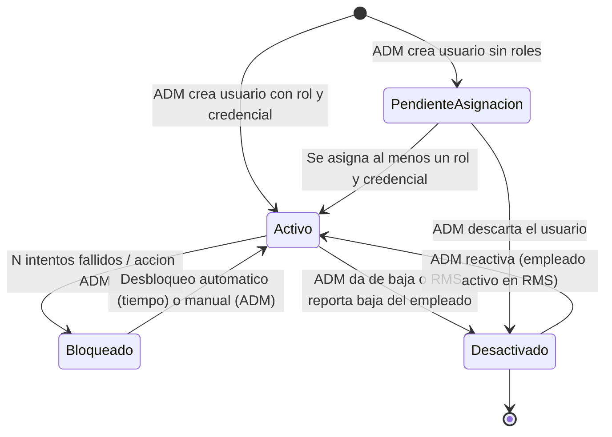
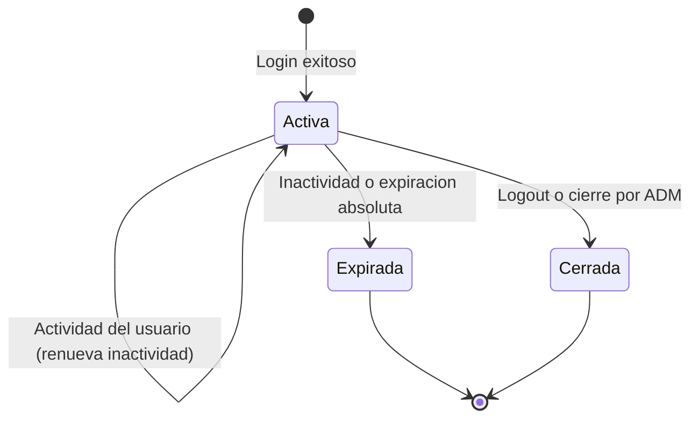
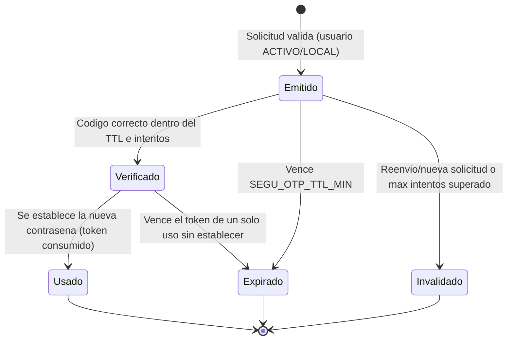

# ESPECIFICACION DE NECESIDADES TECNOLOGICAS
## ENT-MOD-SEGU-001 — Modulo de Seguridad / Accesos (Identidades, Roles, Ambito)
### Sistema Nova | Organizacion Retail Peruana (Cadena / Lukers)

| Campo | Valor |
|---|---|
| Codigo de documento | ENT-MOD-SEGU-001 |
| Version | 1.1 |
| Fecha de emision | 30/05/2026 |
| Fecha de ultima actualizacion | 31/05/2026 |
| Estado | BORRADOR — Pendiente de validacion con stakeholders / PO / TI |
| Elaborado por | Analista Funcional Senior |
| Sistema | Nova |
| Modulo | Seguridad / Accesos (Fase 0 — habilitador transversal, EX-01 resuelto como modulo propio) |
| Documentos relacionados | alcance-nova.md v1.0, ENT-MOD-MAES-001 v1.0, ENT-MOD-APRO-001 v1.0, ENT-MOD-ROLP-001 v1.1, ENT-MOD-ASCE-001 v1.1, ENT-MOD-TRAS-001 v1.1, ENT-MOD-DESC-001 v1.2, ENT-MOD-VAC-001 v1.1, ENT-MOD-ENCA-001 v1.1, ENT-MOD-MARC-001 v1.1 |

### Historial de versiones

| Version | Fecha | Descripcion |
|---|---|---|
| 1.0 | 30/05/2026 | Emision inicial. Especificacion funcional base del modulo de Seguridad/Accesos de Nova, construido DESDE CERO como modulo propio (resuelve la exclusion EX-01 del alcance global). Modela RBAC con ambito (scoped RBAC): usuarios vinculados al empleado de RMS, roles del negocio componibles, permisos granulares por modulo/accion, asignaciones usuario-rol-ambito (empresa/zona/tienda) apoyadas en los catalogos de MAES-001, jerarquia organizacional, autenticacion/autorizacion, delegacion y suplencia, y auditoria. Resuelve el bloqueante VAC-APRO-01 del motor de Aprobaciones. Vacios documentados VAC-SEGU-01 a VAC-SEGU-16. BORRADOR NO VALIDADO. |
| 1.1 | 31/05/2026 | Incorpora la funcionalidad de **autoservicio de RECUPERACION DE CONTRASENA POR CODIGO OTP de 6 digitos** (solicitar codigo por correo -> verificar codigo -> establecer nueva contrasena sujeta a la politica SEGU_PWD_*), confirmada por el PO y derivada de `reconciliacion-ux.md` (P-10 / C-06). Origen: confirmacion del PO sobre el login web/movil. Cambios: nuevo CU-SEGU-10 (recuperacion por OTP); nuevas reglas RN-SEGU-32 a RN-SEGU-39 (envio anti-enumeracion, formato y caducidad del codigo, limite de intentos de verificacion, limite y contador de reenvio, invalidacion tras uso/expiracion, reuso de politica de contrasenas, auditoria del evento, no-inicio de sesion automatica); nueva entidad CodigoRecuperacionOTP (seccion 7.9) y nuevos eventos de auditoria (RECUP_PWD_SOLICITUD / RECUP_PWD_VERIFICACION / RECUP_PWD_CAMBIO / RECUP_PWD_BLOQUEO); nuevos parametros SEGU_OTP_TTL_MIN, SEGU_OTP_LONGITUD, SEGU_OTP_MAX_INTENTOS, SEGU_OTP_MAX_REENVIOS, SEGU_OTP_REENVIO_ESPERA_SEG, SEGU_OTP_COOLDOWN_MIN (parametrizados en MAES-001). Se actualiza CU-SEGU-08 A1 (auto-restablecimiento) para apuntar al nuevo CU-SEGU-10 y se ajusta VAC-SEGU-03. Nuevos vacios VAC-SEGU-17 a VAC-SEGU-19. Contrato API (endpoints solicitar/verificar/establecer) anadido a `seguridad-api.yaml` v1.1. BORRADOR NO VALIDADO. |

---

## INDICE

1. Introduccion y Objetivo del Modulo
2. Alcance y Exclusiones
3. Actores y Roles
4. Casos de Uso Principales
5. Reglas de Negocio
6. Estados y Transiciones
7. Entidades y Atributos Principales
8. Permisos por Rol (matriz de permisos granulares)
9. Integraciones
10. Vacios Funcionales y Preguntas Abiertas

---

## 1. INTRODUCCION Y OBJETIVO DEL MODULO

### 1.1 Contexto del negocio

Nova es un sistema de gestion desarrollado desde cero para una organizacion retail peruana con aproximadamente 100 tiendas distribuidas en multiples zonas geograficas. El grupo empresarial opera bajo dos cadenas comerciales: **Cadena** y **Lukers**. La semana laboral del sistema se define de **domingo a sabado** y es consistente con todos los modulos del sistema.

Los nueve modulos de Nova (7 funcionales + Aprobaciones + Maestros) asumen de forma repetida un conjunto de roles del negocio: Gerente de Tienda (GT), Gerente Zonal/de Ventas (GZ), Gerencia General (GG), Administracion de Ventas (AV), Administracion Retail (AR), Area de Bienestar, Senior, Colaborador/Empleado (EMP) y Administrador del Sistema (ADM). Cada modulo restringe lo que un usuario ve y hace en funcion de su rol Y de su **ambito** organizacional: un GZ opera solo las tiendas de su(s) zona(s); un GT solo su tienda; un GG y AV ven todas las zonas; AR escribe sobre encargaturas centralmente; Bienestar valida licencias medicas.

Hasta la decision documentada en este documento, la Seguridad/Accesos figuraba como exclusion EX-01 del alcance global: "los modulos asumen roles pero ninguna especificacion define el modulo que los administra". Esta ausencia bloqueaba el motor de Aprobaciones (VAC-APRO-01: imposibilidad de resolver el aprobador concreto de un nivel) y a todos los modulos que filtran por ambito.

**DECISION:** la Seguridad de Nova se construye desde cero como modulo propio (no se reutiliza un sistema externo). Este documento especifica ese modulo.

### 1.2 Problema que resuelve

La ausencia de un modulo de Seguridad/Accesos propio genera:

- **Imposibilidad de resolver el aprobador concreto:** el motor de Aprobaciones necesita saber "quien es el GG de la zona X de la empresa Lukers" para asignar la tarea. Sin asignacion usuario-rol-ambito y sin jerarquia, no puede resolver ni escalar (VAC-APRO-01, bloqueante).
- **Falta de enforcement de ambito uniforme:** cada modulo describe su propio filtro (GZ: su zona; GT: su tienda; GG/AV: todas) sin una fuente unica que defina que tiendas/zonas/empresas ve cada usuario.
- **Identidades sin gobierno:** los modulos asumen que existe un usuario autenticado con un rol, pero no hay alta/baja de usuarios, politica de credenciales, ni vinculacion con el empleado de RMS.
- **Auditoria de accesos fragmentada:** cada decision se audita en su modulo, pero no existe traza centralizada de quien tiene que permisos, quien los otorgo, ni de los inicios de sesion y cambios de rol.
- **Segregacion de funciones sin soporte tecnico:** Ascenso exige solicitante != aprobador (RN-ASCE-18) y Aprobaciones desactiva por defecto la autoaprobacion solicitante=aprobador (RN-APRO-12). Estas reglas requieren conocer la identidad y el rol efectivo del actor.

### 1.3 Objetivo del modulo

Proveer el modulo transversal de Seguridad/Accesos de Nova que permita:

- Gestionar **usuarios** de Nova (alta, baja, edicion, estados, credenciales), vinculados al empleado de RMS cuando corresponda.
- Definir un modelo **RBAC con ambito (scoped RBAC)**: roles del negocio **componibles**, compuestos de **permisos granulares** por modulo y accion, y asignaciones usuario-rol acotadas a un **ambito** (empresa, zona, tienda).
- Mantener la **jerarquia organizacional** (quien es superior de quien) para que Aprobaciones resuelva aprobadores y escale por jerarquia y ambito.
- **Autenticar** a los usuarios (login, politica de credenciales, sesiones) y **autorizar** cada accion (enforcement de permisos y ambito) de forma transversal a los 9 modulos.
- Soportar **delegacion** y **suplencia** de roles/aprobacion (necesario para el escalamiento de Aprobaciones y el GG Suplente de Ascenso).
- Mantener una **auditoria** completa de accesos (login/logout) y de cambios de usuarios, roles, permisos, asignaciones de ambito y delegaciones.
- Apoyarse en los catalogos de **Maestros (MAES-001)** sin duplicarlos: empresas, zonas, tiendas, puestos y el catalogo de roles funcionales viven en Maestros; Seguridad referencia esos identificadores y administra la **asignacion** usuario-rol-ambito y la jerarquia.

El modulo NO contiene la logica de negocio de cada modulo funcional; expone un servicio de autenticacion, un servicio de autorizacion (¿este usuario puede ejecutar esta accion sobre este ambito?) y un servicio de resolucion de aprobador/ambito consumido por Aprobaciones y por todos los modulos.

### 1.4 Relacion con otros modulos

- **Maestros / Configuracion (ENT-MOD-MAES-001):** Seguridad consume de Maestros el catalogo de **empresas** (CADENA/LUKERS), **zonas**, **tiendas** (con su empresa y zona) y **puestos**, y el **catalogo de roles funcionales** (GT, GZ, GG, AV, AR, ADM y los adicionales de este documento). Seguridad NO redefine estos catalogos; los referencia por identificador. Resuelve ademas el punto abierto VAC-MAES-11 / VAC-MAES-13: la relacion usuario-rol y usuario-ambito (incluido el GZ multi-zona) se administra en Seguridad, mientras el catalogo de roles y la estructura organizacional (zonas/empresas/tiendas) vive en Maestros.
- **Aprobaciones (ENT-MOD-APRO-001):** consumidor critico. Seguridad expone el **servicio de resolucion de aprobador** que, dado un nivel (regla JERARQUIA_POR_ZONA / JERARQUIA_POR_EMPRESA / ROL_FIJO / USUARIO_ESPECIFICO) y un contexto (empresa, zona, tienda, solicitante), devuelve el/los usuario(s) concreto(s) que deben decidir, mas su superior jerarquico para el escalamiento. Esto resuelve el bloqueante VAC-APRO-01 y habilita RN-APRO-05, RN-APRO-07, RN-APRO-18 y RN-APRO-20. La **delegacion** y la **suplencia** (GG Suplente de Ascenso) se asientan en Seguridad y las consume Aprobaciones (RN-APRO-15/20, RN-ASCE-19).
- **Rol de Personal (ENT-MOD-ROLP-001):** consume el ambito del usuario para el filtrado del calendario (GZ: vista consolidada de sus tiendas/zonas; GT: solo su tienda; GG/AV: todas) y la jerarquia GZ->GG->GT. El enforcement de "GT solo ve su tienda" (RN-ROLP-62) y del historial por ambito (RN-ROLP-61b) se basa en Seguridad.
- **Ascenso Senior (ENT-MOD-ASCE-001):** consume la identidad del solicitante para la **segregacion de funciones** (solicitante != aprobador, RN-ASCE-18) y la **suplencia de aprobacion** (GG Suplente, RN-ASCE-19). El rol GG Suplente y su vigencia se administran en Seguridad.
- **Traslados (ENT-MOD-TRAS-001):** consume el ambito del GZ (colaborador debe pertenecer a su zona) y el permiso configurable de traslado fuera de zona (TRAS_PERMISO_FUERA_ZONA, definido en Maestros pero verificado sobre el ambito del usuario en Seguridad).
- **Descansos / Vacaciones / Encargatura / Marcaciones:** consumen el enforcement de permisos y ambito (Bienestar valida licencias; AV modifica marcaciones de la semana en curso; AR escribe encargaturas; GZ autoriza desbloqueos de su zona).
- **RMS (API externa):** fuente de verdad del **empleado** (codigo, datos personales, puesto, tienda base, estado activo/baja, flag Senior). Seguridad NO administra empleados; **vincula** un usuario de Nova a un codigo de empleado de RMS y gestiona unicamente credenciales, roles, ambito y jerarquia. El contrato tecnico de la vinculacion se deriva al Arquitecto (VAC-SEGU-10).
- **Servicio de notificaciones / Firma Electronica:** Seguridad puede proveer el canal de contacto (correo) del usuario para notificaciones y para el codigo de firma electronica; la firma es servicio aparte.

---

## 2. ALCANCE Y EXCLUSIONES

### 2.1 Dentro del alcance

| # | Funcionalidad |
|---|---|
| 1 | Alta, edicion, activacion/desactivacion (baja logica) y bloqueo de usuarios de Nova. |
| 2 | Vinculacion de un usuario al empleado de RMS (codigo de empleado) para usuarios que son personal; soporte de usuarios no-empleado (tecnicos/centrales) sin vinculo RMS. |
| 3 | Gestion de credenciales: contrasena con politica (complejidad, expiracion, historial), restablecimiento, primer cambio obligatorio, bloqueo por intentos fallidos. |
| 3b | **Recuperacion de contrasena por autoservicio mediante codigo OTP de 6 digitos** enviado al correo de contacto: solicitar codigo, verificar codigo y establecer nueva contrasena (sujeta a la politica SEGU_PWD_*), con caducidad del codigo, limite de intentos de verificacion, limite/contador de reenvio, anti-enumeracion (no revelar si el correo existe), invalidacion del codigo tras uso o expiracion, y auditoria del evento. |
| 4 | Definicion de roles del negocio componibles, basados en el catalogo de roles funcionales de Maestros, como conjuntos de permisos granulares. |
| 5 | Catalogo de permisos granulares por modulo y accion (CRUD y acciones de negocio: aprobar, enviar, autorizar, exportar, configurar). |
| 6 | Asignacion usuario-rol con ambito (empresa, zona, tienda): un usuario puede tener uno o varios roles, cada uno acotado a un ambito; un GZ puede tener varias zonas (resuelve VAC-MAES-11). |
| 7 | Modelado de la jerarquia organizacional (quien es superior de quien) por ambito, para resolucion de aprobadores y escalamiento. |
| 8 | Servicio de resolucion de aprobador y de superior jerarquico, consumido por Aprobaciones (resuelve VAC-APRO-01). |
| 9 | Autenticacion: login con usuario/contrasena, gestion de sesiones (expiracion por inactividad y absoluta), logout, cierre de sesiones activas. |
| 10 | Autorizacion: servicio de enforcement que responde si un usuario puede ejecutar una accion sobre un ambito (rol + permiso + ambito), consumido por los 9 modulos en web y app movil. |
| 11 | Delegacion temporal de un rol/facultad de un usuario en otro, con vigencia y alcance, base de la delegacion de Aprobaciones (RN-APRO-15). |
| 12 | Suplencia de rol: designacion de un suplente vigente para un titular (base del GG Suplente de Ascenso, RN-ASCE-19). |
| 13 | Validacion de compatibilidad de rol del delegado/suplente respecto del nivel/rol delegado (base de RN-APRO-20). |
| 14 | Soporte funcional para la segregacion de funciones: identificar al solicitante y bloquear que sea el mismo que aprueba (apoyo a RN-ASCE-18, RN-APRO-12). |
| 15 | Auditoria de accesos (login exitoso/fallido, logout, bloqueo) y de cambios de usuario, rol, permiso, asignacion de ambito, jerarquia, delegacion y suplencia. |
| 16 | Consulta y exportacion del listado de usuarios, sus roles y ambitos, y del log de auditoria de accesos, segun ambito del rol consultor. |
| 17 | Reflejo del estado del empleado en RMS sobre el usuario: si RMS reporta baja del empleado, el usuario vinculado se desactiva automaticamente (consistente con RN-ROLP-67 inactivacion por baja). |

### 2.2 Fuera del alcance

| # | Exclusion | Modulo o sistema responsable |
|---|---|---|
| EX-SEGU-01 | Alta, baja y datos del empleado (datos personales, contrato, puesto, tienda base, flag Senior, estado activo). | RMS (sistema externo, fuente de verdad) |
| EX-SEGU-02 | Definicion de los catalogos base de empresas, zonas, tiendas, puestos y del catalogo de roles funcionales. Seguridad los REFERENCIA, no los crea. | Maestros (ENT-MOD-MAES-001) |
| EX-SEGU-03 | Definicion de las plantillas de flujo de aprobacion (niveles, modo, cuorum, SLA). Seguridad solo provee la resolucion del aprobador/ambito y la jerarquia. | Aprobaciones (ENT-MOD-APRO-001) |
| EX-SEGU-04 | La logica de negocio de cada modulo (que es aprobable, validaciones de dotacion, saldos). Seguridad solo dice si el usuario PUEDE ejecutar la accion. | Cada modulo funcional |
| EX-SEGU-05 | Captura de firma electronica (selfie/GPS/codigo). Es servicio independiente; Seguridad puede proveer el correo del usuario pero no implementa la firma. | Servicio de Firma Electronica Nova |
| EX-SEGU-06 | El contrato tecnico de SSO/MFA y de la vinculacion con RMS (protocolo, frecuencia, endpoints). Se especifica el COMPORTAMIENTO funcional; el contrato lo define el Arquitecto. | Arquitecto de Software / TI |

### 2.3 Nota de cumplimiento

- `⚠️ DATO SENSIBLE`: el modulo administra **identidades** (usuario, correo, vinculo al codigo de empleado de RMS) y **credenciales**. Las contrasenas nunca se almacenan en claro ni se exponen; se almacenan con hash robusto (detalle tecnico al Arquitecto, VAC-SEGU-09). El acceso al listado de usuarios y a la asignacion de roles/ambito se restringe al ADM y a roles autorizados, y queda auditado.
- `⚠️ REQUIERE VALIDACION COMPLIANCE`: la **delegacion** y la **suplencia** transfieren temporalmente la facultad de decidir (incluida la aprobacion). Pueden eludir el control de "aprobador titular" si se configuran mal. Se modelan con vigencia, alcance, validacion de compatibilidad de rol y auditoria reforzada; su activacion para flujos de aprobacion debe confirmarse con PO/TI.
- `⚠️ REQUIERE VALIDACION COMPLIANCE`: la asignacion de roles de alto privilegio (ADM, GG) y cualquier cambio de ambito que amplie el acceso de un usuario a mas tiendas/zonas debe quedar auditada con responsable y justificacion. La segregacion de funciones (solicitante != aprobador) es un control corporativo que este modulo habilita; no debe deshabilitarse sin confirmacion del PO y TI.
- Los ejemplos de usuarios, codigos de empleado, zonas y tiendas usados son ficticios.

---

## 3. ACTORES Y ROLES

### 3.1 Actores que operan el modulo de Seguridad

| ID | Actor | Tipo | Descripcion | Ambito |
|---|---|---|---|---|
| ACT-01 | Administrador del Sistema (ADM) | Usuario tecnico | Unico rol con escritura plena sobre Seguridad por defecto: crea usuarios, asigna roles y ambito, define jerarquia, gestiona delegaciones/suplencias, restablece credenciales. | Central |
| ACT-02 | Administrador de Seguridad delegado | Usuario | Rol opcional/componible para delegar parte de la gestion de usuarios (p.ej. solo restablecer contrasenas o solo dentro de un ambito). Sujeto a VAC-SEGU-12. | Central / acotado |
| ACT-03 | Usuario de Nova (cualquier rol del negocio) | Usuario | Se autentica, gestiona su propia sesion y su contrasena, consulta su perfil y sus roles/ambito. | Su ambito |
| ACT-04 | GG / AV (supervisor) | Usuario (consulta) | Consulta de usuarios y asignaciones de su ambito (configurable). Sin escritura por defecto. | Central / Multi-zona |
| ACT-05 | Modulos de Nova (sistema) | Sistema | Consumen los servicios de autenticacion, autorizacion y resolucion de aprobador/ambito. No escriben sobre Seguridad. | Sistema |
| ACT-06 | Motor de Aprobaciones (sistema) | Sistema | Consumidor critico del servicio de resolucion de aprobador, superior jerarquico, delegado y suplente vigente. | Sistema |
| ACT-07 | RMS (sistema externo) | Sistema externo | Provee el estado del empleado vinculado (activo/baja) y el codigo de empleado al que se ata un usuario. | Sistema externo |
| ACT-08 | Proveedor de identidad (IdP) corporativo | Sistema externo (opcional) | Si se decide SSO/MFA, provee la autenticacion federada. Opcional, sujeto a VAC-SEGU-01. | Sistema externo |

### 3.2 Catalogo de ROLES del negocio administrados por Seguridad

Los roles funcionales se definen en el catalogo de Maestros (RN-MAES-10) y Seguridad los hace operables como conjuntos de permisos granulares con ambito. Son **componibles**: un usuario puede acumular varios roles, cada uno con su ambito.

| ID rol | Rol del negocio | Origen documental | Ambito tipico | Notas |
|---|---|---|---|---|
| R-ADM | Administrador del Sistema | alcance-nova / todos | Central (sin ambito) | Configuracion transversal; escritura en Maestros y Seguridad. |
| R-GG | Gerencia General | ROLP ROL-03, ASCE ROL-02, APRO ACT-02 | Central / Multi-zona | Aprueba roles, licencias, ascensos; supervision ejecutiva. Aprobador jerarquico de nivel superior. |
| R-GG-SUP | Gerencia General Suplente | ASCE ROL-05, APRO RN-APRO-15/20 | Central / Multi-zona | Aprobacion alterna del GG mientras este designado suplente vigente. Se gestiona como suplencia (ver seccion 5.6). |
| R-GZ | Gerente Zonal / de Ventas | ROLP ROL-04, TRAS ACT-01, ASCE ROL-01 | Zona(s) (multi-tienda) | Programa/envia rol de su zona, registra traslados/vacaciones, solicita ascensos/licencias, emite codigos de desbloqueo. Multi-zona posible. |
| R-GT | Gerente de Tienda | ROLP ROL-05, alcance GT | Una tienda | Programa el rol de su tienda; solo ve su tienda. |
| R-AV | Administracion de Ventas | ROLP ROL-01, alcance AV | Central | Soporte operativo: modifica marcaciones de la semana en curso, autoriza anulaciones, recibe escalamientos, consulta historiales globales. |
| R-AR | Administracion Retail | alcance AR, ENCA | Central | Escritura sobre encargaturas (programa, edita, carga masiva); programaciones de Encargatura sin aprobacion (autoaprobacion, FL_ENCA). |
| R-BIEN | Area de Bienestar | DESC, APRO FL_DESC_MEDICO | Central | Valida documentos de descanso medico (SLA 2 dias habiles). Nivel VALIDACION_AREA en Aprobaciones. |
| R-SENIOR | Senior (sujeto) | ROLP ROL-02, ASCE | Tienda | Sujeto de programacion/encargatura/ascenso. Por defecto NO opera modulos; su existencia como rol permite habilitar accesos futuros. Acceso minimo (perfil propio) sujeto a VAC-SEGU-05. |
| R-EMP | Empleado / Colaborador | alcance EMP | Tienda / Central | Marca por huella, sube sustentos, firma documentos en app movil. Acceso a su propio perfil y a la app de firma. |

**Notas sobre ambito y roles:**
- El **ambito** no es un rol: es la acotacion (empresa, zona, tienda) de cada asignacion de rol. Un mismo rol (p.ej. R-GZ) aplicado a distintos ambitos produce visibilidades distintas. Ver entidad AsignacionUsuarioRolAmbito (seccion 7.3).
- Un usuario puede ser, por ejemplo, GZ de las zonas Z1 y Z2 de la empresa CADENA (dos asignaciones del mismo rol, dos ambitos), resolviendo el requisito multi-zona (VAC-MAES-11).
- El "Gerente de Tiendas / GG superior" mencionado en el alcance se modela como una asignacion de R-GG (o un rol superior parametrizable) cuyo ambito abarca varias zonas; es el destino natural de escalamiento (RN-SEGU-18).
- La pertenencia del usuario a una tienda/zona/empresa como **sujeto** (donde trabaja) proviene de RMS (tienda base). El **ambito de gestion** (que tiendas administra) lo define la asignacion de Seguridad. Son conceptos distintos (VAC-SEGU-06).

> ⚠️ DATO SENSIBLE — La asignacion usuario-rol-ambito revela la estructura organizacional y la identidad de los responsables. Su consulta y edicion se restringe a ADM (y consulta a GG/AV de su ambito), y queda auditada.

---

## 4. CASOS DE USO PRINCIPALES

---

### CU-SEGU-01: Crear usuario y vincularlo al empleado de RMS

```
ID: CU-SEGU-01
Actor principal: Administrador del Sistema (ADM)
Actores secundarios: RMS, Maestros, servicio de notificaciones
Relacionado: RN-SEGU-01, RN-SEGU-02, RN-SEGU-03, RN-SEGU-26

Precondicion:
- El ADM esta autenticado con permiso SEGU.USUARIO.CREAR.
- Maestros provee empresas, zonas y tiendas; RMS provee el maestro de empleados.

Flujo principal:
1. El ADM accede a Seguridad > Usuarios > Nuevo.
2. El ADM indica si el usuario es PERSONAL (vinculado a empleado RMS) o TECNICO/CENTRAL (sin vinculo RMS).
3. Si es PERSONAL: el ADM busca el empleado por codigo/nombre en RMS y lo selecciona. El sistema valida que el empleado este activo en RMS (RN-SEGU-02) y que no exista ya otro usuario activo vinculado a ese codigo de empleado (RN-SEGU-03).
4. El sistema precarga datos no sensibles del empleado desde RMS (nombre, codigo, tienda base, puesto) solo como referencia; no los almacena como fuente de verdad (RN-SEGU-26).
5. El ADM define el nombre de usuario (login) y el correo de contacto.
6. El sistema genera una credencial inicial (contrasena temporal) o dispara el flujo de establecimiento de contrasena por correo, segun politica (RN-SEGU-10).
7. El ADM asigna al menos un rol con su ambito (continua en CU-SEGU-03) o guarda el usuario sin roles (estado PENDIENTE_ASIGNACION).
8. El sistema crea el usuario en estado ACTIVO o PENDIENTE_ASIGNACION y registra el alta en auditoria (RN-SEGU-25).
9. El sistema notifica al usuario su acceso inicial con cambio de contrasena obligatorio en el primer ingreso (RN-SEGU-11).

Flujos alternos:
A1 — Usuario TECNICO/CENTRAL sin vinculo RMS:
  A1.1. El ADM no selecciona empleado; el usuario queda sin codigo de empleado y debe justificar el tipo (p.ej. cuenta de servicio o central). Sujeto a VAC-SEGU-04.

Excepciones:
E1 — El empleado seleccionado tiene baja/inactivo en RMS:
  El sistema bloquea la creacion con mensaje "El empleado no esta activo en RMS. No es posible crear el usuario." (RN-SEGU-02).
E2 — Ya existe un usuario activo vinculado a ese codigo de empleado:
  El sistema rechaza con mensaje y muestra el usuario existente (RN-SEGU-03).

Postcondicion:
- El usuario queda creado, vinculado (si aplica) y con credencial inicial; el alta queda auditada.
```

---

### CU-SEGU-02: Autenticarse en Nova (login y sesion)

```
ID: CU-SEGU-02
Actor principal: Usuario de Nova (cualquier rol)
Actores secundarios: IdP corporativo (si SSO), servicio de notificaciones
Relacionado: RN-SEGU-10, RN-SEGU-11, RN-SEGU-12, RN-SEGU-13, RN-SEGU-14, RN-SEGU-15

Precondicion:
- El usuario existe en estado ACTIVO con al menos un rol asignado (o PENDIENTE_ASIGNACION segun politica).

Flujo principal:
1. El usuario abre Nova (web o app movil) e ingresa usuario y contrasena.
2. El sistema valida las credenciales contra el almacen seguro (hash). Si SSO esta activo, delega en el IdP (RN-SEGU-13, VAC-SEGU-01).
3. El sistema verifica el estado del usuario (ACTIVO), que no este BLOQUEADO y que la contrasena no este expirada (RN-SEGU-12).
4. Si la contrasena requiere cambio (primer ingreso o expirada): el sistema fuerza el cambio antes de continuar (RN-SEGU-11).
5. Si MFA esta activo para el rol/operacion: el sistema solicita el segundo factor (RN-SEGU-14, VAC-SEGU-02).
6. El sistema crea una sesion con expiracion por inactividad y expiracion absoluta (RN-SEGU-15).
7. El sistema carga el contexto de seguridad del usuario: roles, ambitos y permisos efectivos, para que los modulos lo consuman.
8. El sistema registra el login exitoso en auditoria de accesos (RN-SEGU-25).

Flujos alternos:
A1 — SSO corporativo: el usuario se autentica en el IdP y Nova recibe la identidad federada; Nova mapea la identidad al usuario y carga roles/ambito (VAC-SEGU-01).

Excepciones:
E1 — Credenciales invalidas: el sistema incrementa el contador de intentos fallidos y, al superar el maximo parametrizable, bloquea el usuario temporalmente (RN-SEGU-12). Registra el intento fallido en auditoria.
E2 — Usuario desactivado o empleado dado de baja en RMS: el sistema niega el acceso con mensaje generico de seguridad y registra el intento (RN-SEGU-22).

Postcondicion:
- El usuario queda autenticado con una sesion activa y su contexto de seguridad cargado; el evento queda auditado.
```

---

### CU-SEGU-03: Asignar roles y ambito a un usuario

```
ID: CU-SEGU-03
Actor principal: Administrador del Sistema (ADM)
Actores secundarios: Maestros (empresas/zonas/tiendas), modulos consumidores
Relacionado: RN-SEGU-04, RN-SEGU-05, RN-SEGU-06, RN-SEGU-07, RN-SEGU-08, RN-SEGU-25

Precondicion:
- El usuario destino existe.
- Maestros provee el catalogo de empresas, zonas y tiendas vigentes.

Flujo principal:
1. El ADM accede a Seguridad > Usuarios > [usuario] > Roles y Ambito.
2. El ADM selecciona un rol del catalogo (R-GZ, R-GT, R-GG, R-AV, R-AR, R-BIEN, etc.).
3. El ADM define el ambito de esa asignacion segun el tipo de rol (RN-SEGU-05):
   a. Rol de tienda (R-GT): una tienda especifica (la tienda debe existir en Maestros).
   b. Rol de zona (R-GZ): una o varias zonas de una empresa (multi-zona permitido, RN-SEGU-06).
   c. Rol central (R-GG, R-AV, R-AR, R-BIEN, R-ADM): ambito CENTRAL (todas las zonas/empresas) o acotado a empresa si aplica.
4. El sistema valida que el ambito sea coherente con el tipo de rol (RN-SEGU-05) y que las tiendas/zonas pertenezcan a la empresa indicada (consistencia con MAES RN-MAES-06).
5. El ADM puede agregar mas asignaciones (mismo o distinto rol, mismo o distinto ambito) — roles componibles (RN-SEGU-04).
6. El sistema calcula y muestra los permisos efectivos resultantes y el ambito consolidado del usuario (RN-SEGU-07).
7. Para asignaciones de alto privilegio (R-ADM, R-GG) o ampliacion de ambito, el sistema exige justificacion (RN-SEGU-08).
8. El ADM guarda. El sistema versiona la asignacion con vigencia y registra el cambio en auditoria (RN-SEGU-25).

Flujos alternos:
A1 — Revocar una asignacion: el ADM marca fin de vigencia de una asignacion; los modulos dejan de considerarla a partir de esa fecha.
A2 — Asignacion temporal: el ADM define vigencia desde/hasta para una asignacion con fecha de fin (p.ej. encargatura de gestion temporal).

Excepciones:
E1 — Ambito incoherente con el rol (p.ej. R-GT con varias tiendas, o tienda de otra empresa): el sistema rechaza con mensaje que indica el ambito permitido para el rol (RN-SEGU-05).

Postcondicion:
- El usuario queda con sus roles y ambitos efectivos; los modulos y Aprobaciones consumen la nueva configuracion; el cambio queda auditado.
```

---

### CU-SEGU-04: Resolver aprobador y superior jerarquico (servicio para Aprobaciones)

```
ID: CU-SEGU-04
Actor principal: Motor de Aprobaciones (ACT-06)
Actores secundarios: Seguridad (jerarquia y asignaciones), Maestros (zonas/empresas)
Relacionado: RN-SEGU-16, RN-SEGU-17, RN-SEGU-18, RN-SEGU-19, RN-SEGU-20

Precondicion:
- Aprobaciones instancia un nivel de un flujo con una regla de resolucion (ROL_FIJO / JERARQUIA_POR_ZONA / JERARQUIA_POR_EMPRESA / USUARIO_ESPECIFICO) y un contexto (empresa, zona, tienda, id_solicitante).

Flujo principal:
1. Aprobaciones invoca el servicio de resolucion de aprobador de Seguridad con: regla de resolucion, rol objetivo (p.ej. R-GG), y contexto (empresa, zona, tienda, solicitante).
2. El sistema resuelve el/los usuario(s) que tienen el rol objetivo con un ambito que cubre el contexto (RN-SEGU-16):
   a. JERARQUIA_POR_ZONA: usuario(s) con el rol objetivo cuyo ambito incluye la zona del contexto.
   b. JERARQUIA_POR_EMPRESA: usuario(s) con el rol objetivo cuyo ambito incluye la empresa del contexto.
   c. ROL_FIJO: usuario(s) con el rol objetivo en ambito central.
   d. USUARIO_ESPECIFICO: el usuario indicado por id.
3. El sistema aplica la segregacion de funciones: excluye del resultado al usuario solicitante cuando la politica del nivel lo exige (apoyo a RN-ASCE-18 y RN-APRO-12) (RN-SEGU-19).
4. El sistema aplica delegacion/suplencia vigente: si el aprobador resuelto tiene un delegado o suplente vigente para ese tipo de flujo, devuelve tambien al delegado/suplente como aprobador efectivo (RN-SEGU-20).
5. El sistema devuelve a Aprobaciones: lista de aprobador(es) titular(es), aprobador(es) efectivo(s) (incluye delegado/suplente), y el superior jerarquico para escalamiento (RN-SEGU-18).
6. El sistema registra la consulta de resolucion en auditoria tecnica (trazabilidad de quien fue resuelto y por que).

Flujos alternos:
A1 — Multiples aprobadores resueltos (varios GZ en una zona, o varios GG): el servicio devuelve todos; Aprobaciones aplica el cuorum del nivel (RN-APRO-09).

Excepciones:
E1 — No se resuelve ningun aprobador para el contexto (jerarquia incompleta: no hay usuario con el rol objetivo y ambito que cubra la zona/empresa):
  El servicio devuelve VACIO con codigo APROBADOR_NO_RESOLUBLE. Aprobaciones deja la solicitud en PENDIENTE_RESOLUCION_APROBADOR y notifica al ADM (cierra el comportamiento de CU-APRO-02 E1). El ADM corrige la asignacion/jerarquia (CU-SEGU-03) y reintenta (RN-SEGU-17).

Postcondicion:
- Aprobaciones obtiene el/los aprobador(es) concreto(s), su superior jerarquico y los delegados/suplentes vigentes; queda resuelto el bloqueante VAC-APRO-01.
```

---

### CU-SEGU-05: Autorizar una accion (servicio de enforcement)

```
ID: CU-SEGU-05
Actor principal: Modulos de Nova (ACT-05)
Actores secundarios: ninguno
Relacionado: RN-SEGU-21, RN-SEGU-22, RN-SEGU-23

Precondicion:
- El usuario tiene una sesion activa y un contexto de seguridad cargado (CU-SEGU-02).

Flujo principal:
1. Un modulo, antes de ejecutar una accion sensible, invoca el servicio de autorizacion con: id_usuario, permiso requerido (p.ej. ROLP.ROL.ENVIAR) y ambito objetivo (empresa/zona/tienda del objeto).
2. El sistema verifica que el usuario tenga, mediante alguno de sus roles, el permiso requerido (RN-SEGU-21).
3. El sistema verifica que el ambito objetivo este cubierto por el ambito de la asignacion que otorga ese permiso (RN-SEGU-22): un GZ solo aprueba/envia sobre tiendas de su(s) zona(s); un GT solo sobre su tienda; GG/AV sobre todas.
4. El sistema responde PERMITIDO o DENEGADO; si DENEGADO, indica el motivo (permiso ausente o ambito fuera de alcance).
5. El modulo ejecuta o bloquea la accion segun la respuesta.
6. Los intentos DENEGADOS sobre acciones criticas se registran en auditoria (RN-SEGU-23).

Flujos alternos:
A1 — Accion sobre un objeto sin ambito definido (configuracion central): el sistema valida solo el permiso, sin filtro de ambito.

Excepciones:
E1 — El servicio de autorizacion no responde: el modulo aplica politica de fallo seguro (denegar por defecto para acciones de escritura/aprobacion). Detalle de degradacion a definir (VAC-SEGU-13).

Postcondicion:
- El modulo conoce si el usuario puede ejecutar la accion sobre el ambito; los intentos denegados criticos quedan auditados.
```

---

### CU-SEGU-06: Delegar un rol/facultad temporalmente

```
ID: CU-SEGU-06
Actor principal: Usuario titular o Administrador del Sistema (ADM)
Actores secundarios: Aprobaciones, usuario delegado
Relacionado: RN-SEGU-27, RN-SEGU-28, RN-SEGU-29

Precondicion:
- El titular posee el rol/facultad a delegar.

Flujo principal:
1. El titular (o el ADM en su nombre) accede a Seguridad > Delegaciones > Nueva.
2. Indica el delegado, el alcance (rol completo o tipos de flujo/acciones especificas), el ambito y la vigencia (desde/hasta) (RN-SEGU-27).
3. El sistema valida que el delegado tenga un rol compatible con la facultad delegada (no se delega a un rol de menor autoridad que la requerida, salvo configuracion expresa) (RN-SEGU-28).
4. El sistema activa la delegacion: durante la vigencia, el contexto de seguridad del delegado incluye la facultad delegada acotada al ambito y alcance (RN-SEGU-29).
5. Aprobaciones, al resolver aprobadores, considera al delegado vigente (CU-SEGU-04 paso 4).
6. El sistema notifica al delegado y registra la delegacion en auditoria.

Flujos alternos:
A1 — Revocacion anticipada: el titular o el ADM revoca la delegacion antes de su fin; la facultad vuelve al titular de inmediato.

Excepciones:
E1 — Delegado con rol incompatible: el sistema rechaza con mensaje de incompatibilidad (RN-SEGU-28).

Postcondicion:
- Durante la vigencia, el delegado puede ejercer la facultad en nombre del titular, con auditoria que identifica a ambos.
```

---

### CU-SEGU-07: Designar suplente de un rol (base del GG Suplente)

```
ID: CU-SEGU-07
Actor principal: Administrador del Sistema (ADM)
Actores secundarios: Aprobaciones, Ascenso, usuario suplente
Relacionado: RN-SEGU-30, RN-SEGU-31, RN-SEGU-19

Precondicion:
- Existe un usuario titular de un rol (p.ej. GG) y un usuario candidato a suplente con rol compatible.

Flujo principal:
1. El ADM accede a Seguridad > Suplencias > Nueva.
2. Indica el rol titular (p.ej. R-GG), el usuario suplente (p.ej. con R-GG-SUP) y la vigencia (RN-SEGU-30).
3. El sistema valida la compatibilidad del rol del suplente con el rol titular (RN-SEGU-31).
4. Durante la vigencia, el suplente puede ejercer las facultades del titular (aprobar/rechazar) cuando el titular no este disponible o cuando la segregacion de funciones lo requiera (solicitante = titular). Aplica al GG Suplente de Ascenso (RN-ASCE-19) y a la suplencia para autoaprobacion solicitante=aprobador.
5. Toda resolucion realizada por el suplente se registra en auditoria identificando que actuo en calidad de suplente (RN-SEGU-31).

Flujos alternos:
A1 — Suplencia permanente vs temporal: la suplencia puede tener vigencia abierta (suplente designado estable) o acotada (ausencia del titular). Sujeto a VAC-SEGU-08.

Excepciones:
E1 — No existe suplente designado y el titular es el solicitante (auto-solicitud): la solicitud queda a la espera de otro aprobador habilitado o del suplente; Aprobaciones la mantiene pendiente (consistente con RN-ASCE-18 A4).

Postcondicion:
- El suplente queda habilitado para ejercer la facultad del titular dentro de la vigencia, con auditoria de su calidad de suplente.
```

---

### CU-SEGU-08: Gestionar credenciales (cambio, restablecimiento, bloqueo)

```
ID: CU-SEGU-08
Actor principal: Usuario (cambio propio) / ADM (restablecimiento)
Actores secundarios: servicio de notificaciones
Relacionado: RN-SEGU-10, RN-SEGU-11, RN-SEGU-12

Precondicion:
- El usuario existe.

Flujo principal:
1. El usuario accede a su perfil > Cambiar contrasena, o el ADM accede a Seguridad > Usuarios > [usuario] > Restablecer.
2. El sistema valida la politica de contrasenas: longitud minima, complejidad, no reutilizacion del historial reciente, no igual a la actual (RN-SEGU-10).
3. En cambio propio, el sistema exige la contrasena actual; en restablecimiento por ADM, genera una temporal con cambio obligatorio al ingresar (RN-SEGU-11).
4. El sistema actualiza la credencial (almacenada como hash) y registra el cambio en auditoria (sin almacenar el valor).
5. El sistema notifica al usuario el cambio de credencial.

Flujos alternos:
A1 — Auto-restablecimiento por olvido: el usuario inicia la recuperacion de contrasena por codigo OTP de 6 digitos desde la pantalla de login (ver CU-SEGU-10). Aplica a usuarios con metodo de autenticacion LOCAL; los usuarios SSO recuperan en el IdP corporativo (RN-SEGU-32, VAC-SEGU-03).
A2 — Desbloqueo de usuario bloqueado por intentos fallidos: el ADM desbloquea manualmente o el sistema lo desbloquea tras el tiempo parametrizable (RN-SEGU-12).

Excepciones:
E1 — Contrasena no cumple la politica: el sistema rechaza e indica los requisitos no cumplidos (RN-SEGU-10).

Postcondicion:
- La credencial queda actualizada conforme a la politica; el cambio queda auditado (sin exponer el valor).
```

---

### CU-SEGU-09: Consultar usuarios, asignaciones y auditoria de accesos

```
ID: CU-SEGU-09
Actor principal: ADM (todo), GG/AV (su ambito, consulta)
Actores secundarios: ninguno
Relacionado: RN-SEGU-24, RN-SEGU-25

Precondicion:
- El usuario esta autenticado con permiso de consulta de Seguridad.

Flujo principal:
1. El usuario accede a Seguridad > Usuarios o > Auditoria de Accesos.
2. El sistema muestra el listado de usuarios con su estado, roles y ambito, filtrable por rol, empresa, zona, tienda y estado, restringido al ambito del consultor (RN-SEGU-24).
3. El usuario consulta la auditoria de accesos: login exitoso/fallido, logout, bloqueos, cambios de rol/ambito, delegaciones y suplencias, con actor, fecha/hora e identificador del objeto (RN-SEGU-25).
4. El usuario exporta el listado filtrado a Excel (la exportacion queda auditada).

Excepciones:
E1 — Un GG/AV intenta ver usuarios fuera de su ambito: el sistema filtra automaticamente a su alcance.

Postcondicion:
- El usuario consulta y exporta la informacion de seguridad segun su ambito; la consulta/exportacion queda auditada.
```

---

### CU-SEGU-10: Recuperar contrasena por codigo OTP (autoservicio)

```
ID: CU-SEGU-10
Actor principal: Usuario de Nova (no autenticado, olvido su contrasena)
Actores secundarios: servicio de notificaciones (correo), Maestros (politica SEGU_OTP_* y SEGU_PWD_*)
Relacionado: RN-SEGU-32, RN-SEGU-33, RN-SEGU-34, RN-SEGU-35, RN-SEGU-36, RN-SEGU-37, RN-SEGU-38, RN-SEGU-39, RN-SEGU-10, RN-SEGU-25
Disparador UX: pantalla de login web/movil, opcion "Olvide mi contrasena" (reconciliacion-ux.md P-10 / C-06).

Precondicion:
- El usuario NO esta autenticado.
- El metodo de autenticacion del usuario es LOCAL (los usuarios SSO recuperan en el IdP, RN-SEGU-32).

Flujo principal (tres pasos: solicitar -> verificar -> establecer):
1. SOLICITAR. El usuario ingresa su correo en la pantalla "Olvide mi contrasena".
2. El sistema, SIN revelar si el correo existe (anti-enumeracion, RN-SEGU-32), responde siempre con un mensaje generico: "Si el correo esta registrado, enviaremos un codigo de verificacion." (RN-SEGU-32).
3. Si el correo corresponde a un usuario ACTIVO con metodo LOCAL, el sistema genera un codigo OTP numerico de SEGU_OTP_LONGITUD digitos (6 por defecto, RN-SEGU-33), lo almacena hasheado con vigencia de SEGU_OTP_TTL_MIN minutos (RN-SEGU-34), invalida cualquier codigo OTP anterior no usado del mismo usuario (RN-SEGU-37) y lo envia al correo. Registra el evento RECUP_PWD_SOLICITUD en auditoria (RN-SEGU-39).
4. El sistema muestra la pantalla de ingreso del codigo con el correo enmascarado (p.ej. j****@e****.com) y un contador para reenvio (RN-SEGU-36).
5. VERIFICAR. El usuario ingresa el codigo de 6 digitos.
6. El sistema valida el codigo contra el almacenado, que no este expirado ni usado, y que no se haya superado el limite de intentos SEGU_OTP_MAX_INTENTOS (RN-SEGU-35). Si es valido, lo marca VERIFICADO y emite un token de un solo uso, de corta vigencia, habilitante del paso 8 (RN-SEGU-37). Registra RECUP_PWD_VERIFICACION (RN-SEGU-39).
7. ESTABLECER. El sistema presenta el formulario de nueva contrasena.
8. El usuario ingresa la nueva contrasena (y su confirmacion). El sistema valida la politica SEGU_PWD_* (longitud, complejidad, no reutilizacion del historial reciente, no igual a la actual) reutilizando RN-SEGU-10 (RN-SEGU-38).
9. El sistema actualiza la credencial (hash), pone requiere_cambio = false, invalida el codigo OTP y el token de un solo uso (RN-SEGU-37), reinicia el contador de intentos fallidos de login y, por seguridad, cierra las sesiones activas del usuario (RN-SEGU-38). Registra RECUP_PWD_CAMBIO (RN-SEGU-39).
10. El sistema NO inicia sesion automaticamente: redirige al login para que el usuario ingrese con su nueva contrasena (RN-SEGU-38). Notifica al correo que la contrasena fue cambiada.

Flujos alternos:
A1 — Reenvio del codigo: durante el paso 5 el usuario solicita "Reenviar codigo". El sistema solo permite el reenvio tras SEGU_OTP_REENVIO_ESPERA_SEG segundos y hasta SEGU_OTP_MAX_REENVIOS veces por solicitud; cada reenvio invalida el codigo anterior y emite uno nuevo con su propio TTL (RN-SEGU-36, RN-SEGU-37).
A2 — Correo no registrado / usuario inexistente o no LOCAL: el sistema igualmente muestra el mensaje generico del paso 2 y NO envia codigo; no se distingue del caso valido (RN-SEGU-32).
A3 — Usuario con metodo SSO: el sistema muestra mensaje generico y orienta a recuperar en el IdP corporativo; no genera OTP local (RN-SEGU-32, VAC-SEGU-19).

Excepciones:
E1 — Codigo incorrecto: el sistema incrementa el contador de intentos y muestra "El codigo ingresado no es valido." Al alcanzar SEGU_OTP_MAX_INTENTOS, invalida el codigo y aplica un enfriamiento de SEGU_OTP_COOLDOWN_MIN minutos antes de permitir una nueva solicitud; registra RECUP_PWD_BLOQUEO (RN-SEGU-35, RN-SEGU-39).
E2 — Codigo expirado: el sistema muestra "El codigo expiro. Solicita uno nuevo." e invalida el codigo (RN-SEGU-34, RN-SEGU-37).
E3 — Codigo ya usado: el sistema rechaza con "El codigo ya fue utilizado. Solicita uno nuevo." (RN-SEGU-37).
E4 — Nueva contrasena no cumple la politica: el sistema rechaza e indica los requisitos no cumplidos sin consumir el token de un solo uso (RN-SEGU-38, RN-SEGU-10).
E5 — Limite de reenvios alcanzado: el sistema bloquea el reenvio e indica reintentar mas tarde (RN-SEGU-36).

Postcondicion exito:
- La credencial queda actualizada conforme a la politica; el codigo OTP y el token quedan invalidados; el evento de recuperacion queda auditado en sus tres fases; el usuario debe autenticarse con la nueva contrasena.

Postcondicion fallo:
- La credencial no cambia; el codigo se invalida y/o queda en enfriamiento; el intento queda auditado. Por anti-enumeracion, el comportamiento observable no revela la existencia del correo.
```

---

## 5. REGLAS DE NEGOCIO

### 5.1 Usuarios y vinculacion con RMS

| ID | Regla | Criterio de verificacion |
|---|---|---|
| RN-SEGU-01 | Un usuario de Nova es de tipo PERSONAL (vinculado a un codigo de empleado de RMS) o TECNICO/CENTRAL (sin vinculo). El tipo es obligatorio al crear el usuario. | Crear un usuario de cada tipo y verificar el atributo tipo_usuario. |
| RN-SEGU-02 | Solo puede vincularse un usuario PERSONAL a un empleado con estado ACTIVO en RMS. Si el empleado tiene baja/inactivo, la creacion/vinculacion se bloquea. | Intentar crear un usuario sobre un empleado inactivo en RMS y verificar el rechazo. |
| RN-SEGU-03 | No puede existir mas de un usuario ACTIVO vinculado al mismo codigo de empleado de RMS simultaneamente. | Intentar vincular dos usuarios activos al mismo empleado y verificar el rechazo. |
| RN-SEGU-22 | Si RMS reporta la baja del empleado vinculado, el usuario correspondiente se desactiva automaticamente y se le niega el acceso, conservando el registro para auditoria (consistente con RN-ROLP-67). | Dar de baja un empleado en RMS y verificar que su usuario no pueda autenticarse y quede DESACTIVADO. |
| RN-SEGU-26 | Seguridad NO almacena como fuente de verdad los datos personales del empleado (nombre, puesto, tienda base). Solo guarda el vinculo (codigo de empleado) y consulta RMS cuando los necesita. Los datos mostrados son referenciales. `⚠️ DATO SENSIBLE`. | Verificar que al cambiar un dato del empleado en RMS, Nova refleje el dato actualizado sin requerir edicion manual en Seguridad. |

### 5.2 Roles, permisos y composicion

| ID | Regla | Criterio de verificacion |
|---|---|---|
| RN-SEGU-04 | Los roles son componibles: un usuario puede tener una o varias asignaciones de rol, simultaneas, cada una con su propio ambito. Los permisos efectivos del usuario son la union de los permisos de sus roles vigentes. | Asignar dos roles a un usuario y verificar que sus permisos efectivos sean la union de ambos. |
| RN-SEGU-21 | Un rol es un conjunto de permisos granulares (modulo + accion). Una accion solo se autoriza si alguno de los roles vigentes del usuario incluye el permiso requerido. | Intentar una accion sin el permiso y verificar la denegacion; agregar el permiso via rol y verificar que se permita. |
| RN-SEGU-07 | El sistema calcula y muestra los permisos efectivos y el ambito consolidado de un usuario a partir de todas sus asignaciones vigentes, para evitar ambiguedad en la administracion. | Abrir el detalle de un usuario con varios roles y verificar la vista de permisos/ambito consolidados. |
| RN-SEGU-08 | La asignacion de roles de alto privilegio (R-ADM, R-GG) o cualquier ampliacion de ambito que aumente el acceso de un usuario exige justificacion obligatoria y queda en auditoria reforzada. `⚠️ REQUIERE VALIDACION COMPLIANCE`. | Intentar asignar R-GG sin justificacion y verificar el bloqueo; verificar el registro de auditoria con justificacion. |

### 5.3 Ambito y multi-zona

| ID | Regla | Criterio de verificacion |
|---|---|---|
| RN-SEGU-05 | El ambito de una asignacion debe ser coherente con el tipo de rol: rol de tienda -> exactamente una tienda; rol de zona -> una o varias zonas de una empresa; rol central -> CENTRAL o acotado a empresa. El sistema rechaza ambitos incoherentes. | Intentar asignar R-GT a varias tiendas o R-GZ sin zona y verificar el rechazo. |
| RN-SEGU-06 | Un usuario con rol de zona (R-GZ) puede tener varias zonas asignadas, incluso de la misma o distinta empresa segun configuracion. Resuelve el requisito multi-zona del GZ (ROLP nota de ambito, VAC-MAES-11). | Asignar dos zonas a un GZ y verificar que su vista consolidada abarque las tiendas de ambas zonas. |
| RN-SEGU-09 | Las tiendas, zonas y empresas del ambito se referencian por identificador desde Maestros; Seguridad no las redefine. Una asignacion a una tienda/zona inexistente o no vigente en Maestros es rechazada. | Intentar asignar un ambito a una zona desactivada en Maestros y verificar el rechazo. |
| RN-SEGU-22 (ambito) | El enforcement de una accion verifica que el ambito objetivo del objeto este cubierto por el ambito de la asignacion que otorga el permiso. Un GZ no puede operar tiendas fuera de su(s) zona(s); un GT solo su tienda. | Un GZ intenta enviar el rol de una tienda fuera de su zona y el sistema deniega por ambito. |

### 5.4 Autenticacion y credenciales

| ID | Regla | Criterio de verificacion |
|---|---|---|
| RN-SEGU-10 | La politica de contrasenas (longitud minima, complejidad, expiracion, no reutilizacion del historial reciente) es parametrizable en Maestros y se valida en cada cambio. Las contrasenas se almacenan con hash robusto, nunca en claro. `⚠️ DATO SENSIBLE`. | Intentar establecer una contrasena que no cumple la politica y verificar el rechazo con el detalle de requisitos. |
| RN-SEGU-11 | En el primer ingreso y tras un restablecimiento por ADM, el sistema obliga al cambio de contrasena antes de permitir cualquier otra operacion. | Crear un usuario, ingresar con la temporal y verificar que se fuerce el cambio. |
| RN-SEGU-12 | El sistema bloquea temporalmente al usuario tras N intentos fallidos consecutivos (N parametrizable). El desbloqueo es automatico tras un tiempo parametrizable o manual por el ADM. Una contrasena puede expirar segun la politica. | Fallar N veces el login y verificar el bloqueo; verificar el desbloqueo automatico/manual. |
| RN-SEGU-13 | El metodo de autenticacion (credencial local o SSO corporativo) es una decision configurable. Si SSO esta activo, Nova delega la verificacion de identidad en el IdP y mapea la identidad al usuario. `PENDIENTE APROBACION TI` (VAC-SEGU-01). | Con SSO activo, autenticarse via IdP y verificar el mapeo a roles/ambito de Nova. |
| RN-SEGU-14 | El MFA (segundo factor) es opcional y configurable por rol u operacion sensible. Por defecto desactivado. Su activacion para roles de alto privilegio es recomendada y debe confirmarse con PO/TI. `REQUIERE DECISION` (VAC-SEGU-02). | Activar MFA para R-ADM y verificar que se solicite el segundo factor en el login. |
| RN-SEGU-15 | Una sesion tiene expiracion por inactividad y expiracion absoluta, ambas parametrizables. Al expirar, el usuario debe reautenticarse. El ADM puede cerrar sesiones activas de un usuario. | Dejar la sesion inactiva el tiempo parametrizado y verificar que expire; el ADM cierra una sesion y el usuario es desconectado. |

### 5.5 Resolucion de aprobador, jerarquia y escalamiento (consumido por Aprobaciones)

| ID | Regla | Criterio de verificacion |
|---|---|---|
| RN-SEGU-16 | Dado un rol objetivo y un contexto (empresa, zona, tienda), Seguridad resuelve el/los usuario(s) que tienen ese rol con un ambito que cubre el contexto. Es la base de RN-APRO-05 (resolucion del aprobador del nivel). | Para una solicitud de la zona Z1, el servicio devuelve el/los GG cuyo ambito cubre Z1. |
| RN-SEGU-17 | Si no existe ningun usuario que satisfaga el rol objetivo y el ambito del contexto (jerarquia incompleta), el servicio responde APROBADOR_NO_RESOLUBLE. Aprobaciones deja la solicitud en PENDIENTE_RESOLUCION_APROBADOR y se notifica al ADM. Resuelve CU-APRO-02 E1. | Eliminar la asignacion del GG de una zona y verificar que la solicitud quede PENDIENTE_RESOLUCION_APROBADOR y se alerte al ADM. |
| RN-SEGU-18 | La jerarquia organizacional define, para cada rol/ambito, su superior jerarquico (GT -> GZ de su zona -> GG de su(s) zona(s)/empresa -> GG superior/maxima autoridad central). El servicio devuelve el superior para el escalamiento de Aprobaciones (RN-APRO-18) y para el escalamiento agotado (RN-APRO CU-APRO-04 A1). | Solicitar el superior jerarquico de un GZ de Z1 y verificar que devuelva el GG cuyo ambito cubre Z1; agotado, la maxima autoridad central. |
| RN-SEGU-19 | El servicio aplica segregacion de funciones cuando el nivel lo exige: excluye al usuario solicitante del conjunto de aprobadores resueltos. Habilita RN-ASCE-18 (solicitante != aprobador) y soporta RN-APRO-12 (autoaprobacion solicitante=aprobador desactivada por defecto). `⚠️ REQUIERE VALIDACION COMPLIANCE`. | Generar una solicitud cuyo solicitante coincide con el unico aprobador resuelto y verificar que el servicio lo excluya y devuelva el suplente, o NO_RESOLUBLE si no hay otro. |
| RN-SEGU-20 | El servicio incluye en los aprobadores efectivos a los delegados y suplentes vigentes del aprobador titular para el tipo de flujo consultado. Base de RN-APRO-15/20 (delegacion) y RN-ASCE-19 (GG Suplente). | Designar un delegado vigente del GG y verificar que el servicio lo devuelva como aprobador efectivo. |

### 5.6 Delegacion y suplencia

| ID | Regla | Criterio de verificacion |
|---|---|---|
| RN-SEGU-27 | Una delegacion tiene titular, delegado, alcance (rol completo o acciones/tipos de flujo especificos), ambito y vigencia (desde/hasta). Durante la vigencia, el delegado ejerce la facultad delegada. | Crear una delegacion acotada a un tipo de flujo y verificar que el delegado solo pueda ejercerla en ese alcance y vigencia. |
| RN-SEGU-28 | El delegado debe tener un rol compatible con la facultad delegada; no se delega a un rol de menor autoridad que la requerida, salvo configuracion expresa. Habilita RN-APRO-20. | Intentar delegar la aprobacion de GG a un usuario con rol incompatible y verificar el rechazo. |
| RN-SEGU-29 | Una delegacion puede revocarse antes de su fin; al revocar o expirar, la facultad vuelve al titular de inmediato y deja de aparecer en el contexto del delegado. | Revocar una delegacion vigente y verificar que el delegado pierda la facultad de inmediato. |
| RN-SEGU-30 | Una suplencia designa a un suplente para un rol titular con vigencia. El suplente ejerce las facultades del titular cuando este no esta disponible o cuando la segregacion lo requiere (titular = solicitante). Base del GG Suplente (RN-ASCE-19). `⚠️ REQUIERE VALIDACION COMPLIANCE`. | Designar un GG Suplente y verificar que pueda resolver una solicitud cuando el titular es el solicitante. |
| RN-SEGU-31 | Toda accion ejercida por un delegado o suplente queda en auditoria identificando tanto al titular como al delegado/suplente y la calidad en que actuo. | Verificar en auditoria que una aprobacion por suplente registre titular + suplente + calidad de suplente. |

### 5.7 Autorizacion (enforcement)

| ID | Regla | Criterio de verificacion |
|---|---|---|
| RN-SEGU-23 | Los intentos de accion DENEGADOS sobre operaciones criticas (aprobar, enviar, configurar, exportar datos sensibles, cambiar roles) quedan registrados en auditoria con usuario, accion, ambito y motivo de la denegacion. | Provocar una denegacion por ambito y verificar el registro en auditoria. |
| RN-SEGU-24 | La consulta de usuarios, roles y ambito se restringe al ambito del consultor: ADM ve todo; GG/AV ven su ambito (configurable). Un consultor no ve usuarios fuera de su alcance. | Un GG consulta usuarios y verifica que solo vea los de su ambito. |

### 5.8 Auditoria

| ID | Regla | Criterio de verificacion |
|---|---|---|
| RN-SEGU-25 | Toda alta/baja/edicion de usuario, asignacion/revocacion de rol-ambito, cambio de jerarquia, delegacion, suplencia, login exitoso/fallido, logout y bloqueo queda en un log de auditoria inmutable con actor, fecha/hora, objeto y resultado. | Cada evento del ciclo de vida genera un registro de auditoria consultable y no editable. |

### 5.9 Recuperacion de contrasena por codigo OTP (autoservicio)

| ID | Regla | Criterio de verificacion |
|---|---|---|
| RN-SEGU-32 | La recuperacion de contrasena por OTP es **anti-enumeracion**: ante la solicitud, el sistema responde siempre con el mismo mensaje generico ("Si el correo esta registrado, enviaremos un codigo de verificacion") y con el mismo comportamiento observable, exista o no el correo, sin revelar si esta registrado, su estado o su metodo de autenticacion. Solo genera y envia OTP a usuarios ACTIVO con metodo LOCAL; los usuarios SSO recuperan en el IdP. `⚠️ DATO SENSIBLE` (correo). | Solicitar recuperacion con un correo inexistente y uno valido y verificar respuesta y latencia indistinguibles; verificar que solo el valido reciba el codigo. |
| RN-SEGU-33 | El codigo OTP es numerico de SEGU_OTP_LONGITUD digitos (6 por defecto), generado con aleatoriedad criptografica. Se almacena hasheado, nunca en claro, y nunca se devuelve en ninguna respuesta de la API. `⚠️ DATO SENSIBLE`. | Generar un codigo y verificar que tenga 6 digitos, que no se exponga en la respuesta y que el almacen contenga solo el hash. |
| RN-SEGU-34 | El codigo OTP caduca a los SEGU_OTP_TTL_MIN minutos de su emision (parametrizable en Maestros). Vencido el TTL, el codigo no es valido para verificacion. | Emitir un codigo, esperar mas de SEGU_OTP_TTL_MIN y verificar que sea rechazado por expiracion (CU-SEGU-10 E2). |
| RN-SEGU-35 | La verificacion del codigo admite como maximo SEGU_OTP_MAX_INTENTOS intentos fallidos. Al alcanzarlo, el codigo se invalida y se aplica un enfriamiento de SEGU_OTP_COOLDOWN_MIN minutos antes de permitir una nueva solicitud para ese correo/usuario, mitigando fuerza bruta. | Fallar SEGU_OTP_MAX_INTENTOS veces y verificar la invalidacion del codigo y el enfriamiento (CU-SEGU-10 E1). |
| RN-SEGU-36 | El reenvio del codigo se permite solo tras SEGU_OTP_REENVIO_ESPERA_SEG segundos desde el ultimo envio y hasta SEGU_OTP_MAX_REENVIOS veces por solicitud; el sistema lleva un contador de reenvios. Superado el limite, se bloquea el reenvio. | Reenviar antes del tiempo de espera (rechazo) y superar SEGU_OTP_MAX_REENVIOS (bloqueo, CU-SEGU-10 E5). |
| RN-SEGU-37 | Un codigo OTP es de un solo uso y se invalida: (a) tras una verificacion exitosa, (b) al expirar el TTL, (c) al emitirse un nuevo codigo (solicitud o reenvio invalida el anterior), (d) al superar el maximo de intentos. La verificacion exitosa emite un token de un solo uso, de corta vigencia, requerido para establecer la nueva contrasena; ese token tambien se invalida tras su uso. | Verificar que un codigo usado, expirado, superado o reemplazado sea rechazado, y que el token de un solo uso no sirva dos veces. |
| RN-SEGU-38 | La nueva contrasena establecida por OTP esta sujeta a la misma politica que cualquier cambio (RN-SEGU-10): longitud SEGU_PWD_LONGITUD_MINIMA, complejidad SEGU_PWD_COMPLEJIDAD, no reutilizacion SEGU_PWD_HISTORIAL_NO_REUSO y no igual a la actual. Tras el cambio: requiere_cambio = false, se reinicia el contador de intentos fallidos de login, se cierran las sesiones activas del usuario y NO se inicia sesion automaticamente (se redirige al login). | Establecer una contrasena que viola la politica (rechazo) y una valida (acepta, cierra sesiones, no autentica automaticamente). |
| RN-SEGU-39 | Las tres fases del flujo (solicitud, verificacion, cambio) y el bloqueo por exceso de intentos quedan en el log de auditoria con eventos RECUP_PWD_SOLICITUD / RECUP_PWD_VERIFICACION / RECUP_PWD_CAMBIO / RECUP_PWD_BLOQUEO, con actor (usuario afectado), canal, fecha/hora y resultado, sin almacenar el codigo ni la contrasena. `⚠️ REQUIERE VALIDACION COMPLIANCE` (trazabilidad del evento de recuperacion). | Ejecutar un flujo completo y un flujo fallido y verificar los registros de auditoria correspondientes sin datos sensibles en claro. |

---

## 6. ESTADOS Y TRANSICIONES

### 6.1 Maquina de estados de un usuario



### 6.2 Descripcion de estados del usuario

| Estado | Descripcion | Quien lo asigna |
|---|---|---|
| Pendiente Asignacion | Usuario creado sin roles asignados; no puede operar modulos hasta tener al menos un rol. | ADM |
| Activo | Usuario operativo con credencial valida y al menos un rol; puede autenticarse. | ADM / Sistema |
| Bloqueado | Acceso suspendido temporalmente por intentos fallidos o por accion del ADM. | Sistema / ADM |
| Desactivado | Baja logica: por accion del ADM o por baja del empleado en RMS. Se conserva para auditoria. | ADM / Sistema (RMS) |

### 6.3 Estados de una asignacion / delegacion / suplencia

| Estado | Descripcion |
|---|---|
| Vigente | La asignacion/delegacion/suplencia esta activa dentro de su vigencia y es considerada por los modulos y Aprobaciones. |
| Programada | Tiene fecha de inicio futura; aun no aplica. |
| Revocada | Finalizada antes de su fecha fin por el titular o el ADM. |
| Expirada | Alcanzo su fecha fin; ya no aplica. Se conserva para trazabilidad. |

### 6.4 Maquina de estados de una sesion



### 6.5 Maquina de estados de un codigo de recuperacion OTP



---

## 7. ENTIDADES Y ATRIBUTOS PRINCIPALES

> Nota: las entidades Empresa, Zona, Tienda y Puesto NO se definen aqui; viven en Maestros (MAES-001 secciones 7.1-7.5) y se referencian por identificador. El catalogo de Roles funcionales tambien se origina en Maestros (RN-MAES-10); Seguridad lo operacionaliza como conjuntos de permisos.

### 7.1 Usuario (Usuario)

| Atributo | Tipo | Obligatorio | Descripcion |
|---|---|---|---|
| id_usuario | UUID | Si | Identificador unico del usuario en Nova. |
| nombre_usuario | String | Si | Login unico. |
| tipo_usuario | Enum | Si | PERSONAL / TECNICO_CENTRAL (RN-SEGU-01). |
| id_empleado_rms | String | Condicional | Codigo de empleado de RMS si tipo = PERSONAL. `⚠️ DATO SENSIBLE`. |
| correo_contacto | String | Si | Correo para notificaciones, restablecimiento y codigo de firma. `⚠️ DATO SENSIBLE`. |
| estado | Enum | Si | PENDIENTE_ASIGNACION / ACTIVO / BLOQUEADO / DESACTIVADO. |
| metodo_autenticacion | Enum | Si | LOCAL / SSO (VAC-SEGU-01). |
| mfa_habilitado | Boolean | Si | Indica si el usuario requiere segundo factor (VAC-SEGU-02). |
| fecha_alta | DateTime | Si | Fecha de creacion. |
| fecha_baja | DateTime | No | Fecha de desactivacion si aplica. |

### 7.2 Credencial (Credencial) `⚠️ DATO SENSIBLE`

| Atributo | Tipo | Obligatorio | Descripcion |
|---|---|---|---|
| id_credencial | UUID | Si | Identificador. |
| id_usuario | UUID | Si | Usuario propietario. |
| hash_password | String | Si | Hash robusto de la contrasena. Nunca en claro (RN-SEGU-10). |
| fecha_ultimo_cambio | DateTime | Si | Para control de expiracion. |
| requiere_cambio | Boolean | Si | Forzar cambio en el proximo ingreso (RN-SEGU-11). |
| intentos_fallidos | Integer | Si | Contador para bloqueo (RN-SEGU-12). |
| bloqueado_hasta | DateTime | No | Fin del bloqueo temporal si aplica. |
| historial_hashes | Lista | No | Hashes recientes para impedir reutilizacion (politica). |

### 7.3 Asignacion usuario-rol-ambito (AsignacionUsuarioRolAmbito)

| Atributo | Tipo | Obligatorio | Descripcion |
|---|---|---|---|
| id_asignacion | UUID | Si | Identificador. |
| id_usuario | UUID | Si | Usuario. |
| id_rol | Enum/UUID | Si | Rol del catalogo (R-GG, R-GZ, R-GT, R-AV, R-AR, R-BIEN, R-ADM, R-GG-SUP, etc.). |
| tipo_ambito | Enum | Si | CENTRAL / EMPRESA / ZONA / TIENDA. |
| id_empresa | Enum | Condicional | Empresa del ambito (referencia Maestros) si aplica. |
| ids_zona | Lista<UUID> | Condicional | Una o varias zonas (referencia Maestros) si rol de zona (RN-SEGU-06). |
| id_tienda | UUID | Condicional | Tienda (referencia Maestros) si rol de tienda. |
| justificacion | Text | Condicional | Obligatoria para roles de alto privilegio o ampliacion de ambito (RN-SEGU-08). |
| vigencia_desde | Date | Si | Inicio de vigencia. |
| vigencia_hasta | Date | No | Fin de vigencia (nulo si indefinida). |
| estado | Enum | Si | VIGENTE / PROGRAMADA / REVOCADA / EXPIRADA. |

### 7.4 Rol y Permiso (Rol, Permiso, RolPermiso)

| Entidad | Atributo | Tipo | Descripcion |
|---|---|---|---|
| Rol | id_rol | Enum/UUID | Codigo del rol funcional (origen catalogo Maestros). |
| Rol | nombre | String | Nombre del rol del negocio. |
| Rol | nivel_autoridad | Integer | Nivel relativo para validar compatibilidad de delegacion/suplencia (RN-SEGU-28/31). |
| Permiso | id_permiso | UUID | Identificador del permiso granular. |
| Permiso | clave | String | Clave logica: MODULO.RECURSO.ACCION (p.ej. ROLP.ROL.ENVIAR, APRO.TAREA.APROBAR, SEGU.USUARIO.CREAR). |
| Permiso | modulo | Enum | Modulo al que pertenece. |
| Permiso | accion | Enum | CREAR / LEER / EDITAR / ELIMINAR / ENVIAR / APROBAR / RECHAZAR / AUTORIZAR / EXPORTAR / CONFIGURAR. |
| RolPermiso | id_rol + id_permiso | Relacion | Permisos que componen cada rol (roles componibles, RN-SEGU-04/21). |

### 7.5 Jerarquia organizacional (NodoJerarquia)

| Atributo | Tipo | Obligatorio | Descripcion |
|---|---|---|---|
| id_nodo | UUID | Si | Identificador del nodo jerarquico. |
| id_rol | Enum | Si | Rol del nodo (GT, GZ, GG, GG superior). |
| tipo_ambito | Enum | Si | TIENDA / ZONA / EMPRESA / CENTRAL. |
| id_ambito | UUID | Condicional | Referencia a la tienda/zona/empresa de Maestros. |
| id_nodo_superior | UUID | No | Nodo superior para escalamiento (RN-SEGU-18). Nulo en la maxima autoridad. |

### 7.6 Delegacion (Delegacion) y Suplencia (Suplencia)

| Entidad | Atributo | Tipo | Descripcion |
|---|---|---|---|
| Delegacion | id_delegacion | UUID | Identificador. |
| Delegacion | id_titular | UUID | Usuario que delega. |
| Delegacion | id_delegado | UUID | Usuario que recibe la facultad. |
| Delegacion | alcance | Enum | ROL_COMPLETO / ACCIONES_ESPECIFICAS / TIPOS_FLUJO. |
| Delegacion | detalle_alcance | Lista | Acciones o tipos de flujo si alcance acotado. |
| Delegacion | tipo_ambito + id_ambito | Enum/UUID | Ambito de la delegacion. |
| Delegacion | vigencia_desde / vigencia_hasta | Date | Vigencia. |
| Delegacion | estado | Enum | VIGENTE / PROGRAMADA / REVOCADA / EXPIRADA. |
| Suplencia | id_suplencia | UUID | Identificador. |
| Suplencia | id_rol_titular | Enum | Rol titular suplido (p.ej. R-GG). |
| Suplencia | id_usuario_titular | UUID | Titular (opcional si la suplencia es por rol/ambito). |
| Suplencia | id_usuario_suplente | UUID | Suplente designado (p.ej. R-GG-SUP). |
| Suplencia | tipo_ambito + id_ambito | Enum/UUID | Ambito de la suplencia. |
| Suplencia | vigencia_desde / vigencia_hasta | Date | Vigencia (VAC-SEGU-08). |
| Suplencia | estado | Enum | VIGENTE / PROGRAMADA / REVOCADA / EXPIRADA. |

### 7.7 Sesion (Sesion)

| Atributo | Tipo | Descripcion |
|---|---|---|
| id_sesion | UUID | Identificador de la sesion. |
| id_usuario | UUID | Usuario autenticado. |
| canal | Enum | WEB / APP_MOVIL. |
| fecha_inicio | DateTime | Inicio de la sesion. |
| ultima_actividad | DateTime | Para expiracion por inactividad (RN-SEGU-15). |
| expira_en | DateTime | Expiracion absoluta. |
| estado | Enum | ACTIVA / EXPIRADA / CERRADA. |

### 7.8 Log de auditoria de seguridad

| Atributo | Tipo | Descripcion |
|---|---|---|
| id_log | UUID | Identificador del evento. |
| evento | Enum | LOGIN_OK / LOGIN_FALLIDO / LOGOUT / BLOQUEO / DESBLOQUEO / ALTA_USUARIO / EDIT_USUARIO / BAJA_USUARIO / ASIGNA_ROL / REVOCA_ROL / CAMBIO_AMBITO / CAMBIO_JERARQUIA / DELEGACION / REVOCA_DELEGACION / SUPLENCIA / CAMBIO_CREDENCIAL / RECUP_PWD_SOLICITUD / RECUP_PWD_VERIFICACION / RECUP_PWD_CAMBIO / RECUP_PWD_BLOQUEO / DENEGACION_ACCESO / EXPORTACION. |
| id_actor | UUID | Usuario o proceso que ejecuta. |
| id_objeto | UUID | Usuario/asignacion/delegacion afectado. |
| en_calidad_de | Enum | TITULAR / DELEGADO / SUPLENTE (RN-SEGU-31). |
| detalle | Text | Datos del evento (sin exponer credenciales ni codigos OTP). |
| resultado | Enum | EXITOSO / FALLIDO / DENEGADO. |
| fecha_hora | DateTime | Marca de tiempo. |

### 7.9 Codigo de recuperacion OTP (CodigoRecuperacionOTP) `⚠️ DATO SENSIBLE`

> Soporta CU-SEGU-10. El codigo se almacena siempre hasheado y nunca se expone. La invalidacion tras uso/expiracion (RN-SEGU-37) se modela por el atributo `estado` y `expira_en`.

| Atributo | Tipo | Obligatorio | Descripcion |
|---|---|---|---|
| id_otp | UUID | Si | Identificador del codigo de recuperacion. |
| id_usuario | UUID | Si | Usuario propietario (resuelto internamente; no se expone si el correo existe, RN-SEGU-32). |
| hash_codigo | String | Si | Hash robusto del codigo OTP de 6 digitos. Nunca en claro (RN-SEGU-33). |
| canal_envio | Enum | Si | CORREO (unico canal en esta version; SMS fuera de alcance, VAC-SEGU-18). |
| emitido_en | DateTime | Si | Marca de emision. |
| expira_en | DateTime | Si | emitido_en + SEGU_OTP_TTL_MIN (RN-SEGU-34). |
| intentos_verificacion | Integer | Si | Contador de intentos fallidos (max SEGU_OTP_MAX_INTENTOS, RN-SEGU-35). |
| reenvios | Integer | Si | Contador de reenvios de la solicitud (max SEGU_OTP_MAX_REENVIOS, RN-SEGU-36). |
| estado | Enum | Si | EMITIDO / VERIFICADO / USADO / EXPIRADO / INVALIDADO (seccion 6.5). |
| token_un_solo_uso | String | No | Token de corta vigencia emitido tras verificacion, requerido para establecer la nueva contrasena; se invalida tras su uso (RN-SEGU-37). Hasheado. |

---

## 8. PERMISOS POR ROL (matriz de permisos granulares)

### 8.1 Permisos sobre el propio modulo de Seguridad

| Permiso (clave) | R-ADM | R-GG | R-AV | R-GZ | R-GT | R-AR | R-BIEN | R-EMP/R-SENIOR |
|---|---|---|---|---|---|---|---|---|
| SEGU.USUARIO.CREAR | Si | No | No | No | No | No | No | No |
| SEGU.USUARIO.EDITAR | Si | No | No | No | No | No | No | No |
| SEGU.USUARIO.BAJA | Si | No | No | No | No | No | No | No |
| SEGU.ROL.ASIGNAR | Si | No | No | No | No | No | No | No |
| SEGU.AMBITO.ASIGNAR | Si | No | No | No | No | No | No | No |
| SEGU.JERARQUIA.EDITAR | Si | No | No | No | No | No | No | No |
| SEGU.DELEGACION.CREAR (propia) | Si (en nombre de) | Si | Si | Si | Si | Si | Si | No |
| SEGU.SUPLENCIA.DESIGNAR | Si | No | No | No | No | No | No | No |
| SEGU.CREDENCIAL.RESTABLECER (terceros) | Si | No | No | No | No | No | No | No |
| SEGU.CREDENCIAL.CAMBIAR (propia) | Si | Si | Si | Si | Si | Si | Si | Si |
| SEGU.USUARIO.CONSULTAR | Si (todo) | Si (su ambito) | Si (su ambito) | No | No | No | No | No |
| SEGU.AUDITORIA.CONSULTAR | Si | Si (su ambito) | No | No | No | No | No | No |
| SEGU.AUDITORIA.EXPORTAR | Si | Si (su ambito) | No | No | No | No | No | No |

### 8.2 Mapa resumen de permisos del negocio que cada rol porta (consumidos por los modulos)

> Detalle ilustrativo. El catalogo exhaustivo de permisos por modulo se consolida con cada modulo funcional; aqui se fija el principio de que cada accion sensible de los modulos tiene un permiso granular y un ambito.

| Capacidad de negocio (permiso) | Rol(es) que lo porta | Ambito |
|---|---|---|
| ROLP.ROL.PROGRAMAR_TIENDA | R-GT (su tienda), R-GZ (sus tiendas) | Tienda / Zona |
| ROLP.ROL.ENVIAR (a GG) | R-GZ | Zona |
| ROLP.ROL.APROBAR | R-GG (+ delegado/suplente) | Multi-zona |
| ROLP.CODIGO_DESBLOQUEO.EMITIR | R-GZ | Zona |
| ROLP.HISTORIAL.CONSULTAR | R-GZ (su zona), R-GG/R-AV (todas) | Zona / Central |
| APRO.TAREA.APROBAR / APRO.TAREA.RECHAZAR | Rol aprobador del nivel (resuelto por ambito) + delegado/suplente | Segun nivel |
| APRO.PLANTILLA.CONFIGURAR | R-ADM | Central |
| DESC.LICENCIA_MEDICA.VALIDAR | R-BIEN | Central |
| TRAS.TRASLADO.REGISTRAR | R-GZ | Zona (fuera de zona segun TRAS_PERMISO_FUERA_ZONA) |
| VAC.PERIODO.ANULAR_AUTORIZAR | R-AV, R-GG | Central |
| ASCE.SOLICITUD.CREAR | R-GZ (su zona), R-GG (todas) | Zona / Central |
| ASCE.SOLICITUD.RESOLVER | R-GG, R-GG-SUP (solicitante != aprobador) | Multi-zona |
| ENCA.ENCARGATURA.PROGRAMAR | R-AR (+ R-GZ si ENCA_PERMISO_PROGRAMACION_GZ) | Central / Zona |
| MARC.MARCACION.MODIFICAR (semana en curso) | R-AV | Central |
| MAES.PARAMETRO.CONFIGURAR | R-ADM | Central |

### 8.3 Nota de ambito y compliance

El enforcement combina **permiso** (¿el rol incluye la accion?) y **ambito** (¿la asignacion cubre la empresa/zona/tienda del objeto?). Un GZ con ROLP.ROL.APROBAR no aprobaria fuera de su zona porque su ambito no la cubre. La segregacion de funciones (ASCE.SOLICITUD.RESOLVER con solicitante != aprobador) y la desactivacion por defecto de la autoaprobacion solicitante=aprobador son controles corporativos habilitados por Seguridad. `⚠️ REQUIERE VALIDACION COMPLIANCE` para cualquier asignacion de R-ADM/R-GG, cambio de ambito ampliatorio, y para activar delegacion/suplencia sobre facultades de aprobacion.

---

## 9. INTEGRACIONES

### 9.1 Maestros / Configuracion (ENT-MOD-MAES-001)

| Aspecto | Detalle |
|---|---|
| Tipo | API interna sincrona / cache (servicio de configuracion centralizado, CU-MAES-06). |
| Datos consumidos | Catalogo de empresas, zonas, tiendas (con su empresa/zona), puestos, catalogo de roles funcionales (RN-MAES-10), y la politica de credenciales/sesiones parametrizada (longitud, expiracion, intentos, tiempos de sesion, MFA). |
| Que NO hace | Seguridad NO crea ni redefine empresas/zonas/tiendas/puestos/roles; los referencia. Resuelve VAC-MAES-11 y VAC-MAES-13 administrando la asignacion usuario-rol-ambito y la jerarquia. |
| Manejo de errores | Si Maestros no responde, Seguridad usa cache de catalogos para resolver ambitos; un cambio de catalogo (zona desactivada) invalida asignaciones inconsistentes en la siguiente sincronizacion. |

### 9.2 Aprobaciones (ENT-MOD-APRO-001) — consumidor critico

| Operacion | Direccion | Detalle |
|---|---|---|
| resolver_aprobador | Aprobaciones -> Seguridad | Dado regla de resolucion + contexto (empresa/zona/tienda/solicitante), devuelve aprobador(es) titular(es), efectivo(s) (incl. delegado/suplente) y superior jerarquico. Resuelve VAC-APRO-01. |
| resolver_superior_jerarquico | Aprobaciones -> Seguridad | Para escalamiento por SLA (RN-APRO-18) y escalamiento agotado a maxima autoridad (CU-APRO-04 A1). |
| validar_segregacion | Aprobaciones -> Seguridad | Excluye al solicitante del conjunto de aprobadores cuando el nivel lo exige (RN-APRO-12, RN-ASCE-18). |
| consultar_delegacion_suplencia | Aprobaciones -> Seguridad | Devuelve delegados/suplentes vigentes para el tipo de flujo (RN-APRO-15/20, RN-ASCE-19). |

### 9.3 Modulos funcionales de Nova (servicio de autorizacion)

| Operacion | Direccion | Detalle |
|---|---|---|
| autenticar | Modulo/Usuario -> Seguridad | Login y carga del contexto de seguridad (roles, ambitos, permisos). |
| autorizar | Modulo -> Seguridad | ¿Puede el usuario ejecutar la accion (permiso) sobre el ambito objetivo? Respuesta PERMITIDO/DENEGADO. |
| contexto_usuario | Modulo -> Seguridad | Obtener roles, ambito consolidado y permisos efectivos para filtrar vistas (p.ej. GT solo su tienda). |

### 9.4 RMS (API externa)

| Aspecto | Detalle |
|---|---|
| Tipo | API REST / sincronizacion. `PENDIENTE APROBACION TI` (VAC-SEGU-10). |
| Datos consumidos | Estado del empleado (activo/baja) para vinculacion y desactivacion automatica del usuario (RN-SEGU-02/22); datos referenciales (nombre, puesto, tienda base) no almacenados como fuente de verdad (RN-SEGU-26). |
| Responsable de definicion del contrato | Arquitecto de Software en coordinacion con el equipo de RMS. |

### 9.5 Proveedor de identidad corporativo (IdP) — opcional

| Aspecto | Detalle |
|---|---|
| Relacion | Si se decide SSO (VAC-SEGU-01) y/o MFA (VAC-SEGU-02), Seguridad delega la verificacion de identidad y mapea la identidad federada al usuario de Nova, conservando el modelo de roles/ambito propio. |
| Responsable | Arquitecto / TI. `PENDIENTE APROBACION TI`. |

### 9.6 Servicio de notificaciones / Firma Electronica

| Aspecto | Detalle |
|---|---|
| Relacion | Seguridad provee el correo de contacto del usuario para notificaciones y para el codigo de firma electronica. La firma es servicio independiente (EX-SEGU-05). El **envio del codigo OTP de recuperacion** (CU-SEGU-10) usa este mismo servicio de correo; el contrato/plantilla del correo y la garantia de entrega los define el Arquitecto/TI (VAC-SEGU-17). |

### 9.7 Contrato API de recuperacion por OTP (derivado al Arquitecto)

El comportamiento funcional de la recuperacion por OTP (CU-SEGU-10) se expresa en tres operaciones que deben formar parte del contrato `docs/software-factory/architecture/api-contracts/seguridad-api.yaml` (tag "Recuperacion de contrasena"):

| Operacion funcional | Endpoint sugerido | Entrada | Salida / comportamiento | Reglas |
|---|---|---|---|---|
| Solicitar codigo | `POST /auth/password-recovery/request` | correo | Respuesta generica 202 indistinguible (anti-enumeracion); envia OTP solo a usuario ACTIVO/LOCAL; correo enmascarado. | RN-SEGU-32/33/34/37/39 |
| Verificar codigo | `POST /auth/password-recovery/verify` | correo + codigo de 6 digitos | 200 con token de un solo uso si valido; 422/429 si invalido/expirado/bloqueado por intentos. | RN-SEGU-35/37/39 |
| Establecer nueva contrasena | `POST /auth/password-recovery/reset` | token de un solo uso + nueva contrasena | 204 si cumple politica SEGU_PWD_*; cierra sesiones; no inicia sesion; 422 si viola politica. | RN-SEGU-38/10/37/39 |

> **PENDIENTE coordinacion con Arquitectura.** Los tres endpoints, esquemas y codigos de error se anaden a `seguridad-api.yaml` v1.1 siguiendo el estilo del archivo (sin host real, ejemplos ficticios, `security: []` por ser flujo no autenticado, codigos RFC 7807). El detalle criptografico del hash del OTP, el rate-limiting de borde y la plantilla de correo quedan derivados al Arquitecto/TI (VAC-SEGU-17, ligado a VAC-SEGU-09).

---

## 10. VACIOS FUNCIONALES Y PREGUNTAS ABIERTAS

> Estado del documento: **BORRADOR NO VALIDADO**. Los siguientes vacios requieren decision del Product Owner, stakeholders y/o TI antes de cerrar la especificacion.

| ID | Area | Pregunta / Vacio | Impacto | Estado |
|---|---|---|---|---|
| VAC-SEGU-01 | Autenticacion (SSO) | ¿Nova usa credenciales locales propias o se integra con un IdP corporativo (SSO/LDAP/OIDC)? Define el modelo de login y el contrato del IdP. `PENDIENTE APROBACION TI`. | Alto | ABIERTO |
| VAC-SEGU-02 | MFA | ¿Se exige segundo factor (MFA) para roles de alto privilegio (ADM, GG) u operaciones sensibles? Recomendado para ADM/GG. `⚠️ REQUIERE VALIDACION COMPLIANCE`. | Alto | ABIERTO |
| VAC-SEGU-03 | Auto-restablecimiento | RESUELTO PARCIAL: el PO confirmo el autoservicio de recuperacion por **codigo OTP de 6 digitos al correo** (CU-SEGU-10, RN-SEGU-32 a 39; reconciliacion-ux.md P-10/C-06). Queda confirmar la madurez/garantia de entrega del canal de correo (VAC-SEGU-17) y si convive con restablecimiento por ADM (si, ambos coexisten). | Medio | RESUELTO PARCIAL |
| VAC-SEGU-04 | Usuarios no-empleado | ¿Que politica aplica a usuarios TECNICO/CENTRAL sin vinculo RMS (cuentas de servicio, central, contratistas)? ¿Quien los autoriza y revisa? | Medio | ABIERTO |
| VAC-SEGU-05 | Acceso de Senior/Colaborador | ¿El Senior y el Colaborador (EMP) tienen usuario y acceso (app movil para marcar/firmar), o solo son sujetos sin login? El alcance indica que EMP firma y marca en la app: requiere usuario. Confirmar alcance del acceso. | Alto | ABIERTO |
| VAC-SEGU-06 | Ambito sujeto vs gestion | La tienda base del usuario (donde trabaja, de RMS) y su ambito de gestion (que tiendas administra, de Seguridad) son distintos. ¿Hay casos donde deban coincidir o validarse cruzadamente? | Medio | ABIERTO |
| VAC-SEGU-07 | GZ multi-empresa | ¿Un GZ puede gestionar zonas de ambas empresas (Cadena y Lukers) simultaneamente, o el ambito se restringe a una empresa? Afecta la resolucion de aprobador por empresa. | Alto | ABIERTO |
| VAC-SEGU-08 | Suplencia: vigencia y origen | ¿La suplencia (GG Suplente) es un designado estable o se activa solo ante ausencia/segregacion del titular? ¿Quien la designa: ADM o el propio GG? `⚠️ REQUIERE VALIDACION COMPLIANCE`. | Alto | ABIERTO |
| VAC-SEGU-09 | Almacen de credenciales | Politica criptografica de almacenamiento de contrasenas (algoritmo de hash, parametros, rotacion). Detalle tecnico. `PENDIENTE APROBACION TI`. | Alto | ABIERTO |
| VAC-SEGU-10 | Contrato de vinculacion RMS | ¿Como se vincula el usuario al empleado y como se detecta la baja (push de RMS vs consulta programada)? Frecuencia y endpoints. `PENDIENTE APROBACION TI`. | Alto | ABIERTO |
| VAC-SEGU-11 | Jerarquia: fuente y mantenimiento | ¿La jerarquia organizacional (GT->GZ->GG->GG superior) se mantiene manualmente en Seguridad o se deriva de los ambitos asignados? ¿Quien valida que este completa para evitar APROBADOR_NO_RESOLUBLE? | Alto | ABIERTO |
| VAC-SEGU-12 | Delegacion de administracion | ¿Se permite un rol "Administrador de Seguridad delegado" (p.ej. solo restablecer contrasenas o solo dentro de un ambito), o la administracion es exclusiva del ADM central? | Medio | ABIERTO |
| VAC-SEGU-13 | Degradacion del enforcement | Si el servicio de autorizacion no responde, ¿se deniega todo (fallo seguro) o se permite lectura con cache? Define la disponibilidad vs. seguridad. `PENDIENTE APROBACION TI`. | Alto | ABIERTO |
| VAC-SEGU-14 | Multiplicidad de aprobadores por ambito | Si una zona tiene varios GZ o una empresa varios GG (ROLP RN-36 menciona varios GZ por zona), ¿como se decide el cuorum y el destinatario de la tarea? Se delega el cuorum a Aprobaciones, pero ¿todos reciben la tarea o uno designado? | Medio | ABIERTO |
| VAC-SEGU-15 | Caducidad de roles | ¿Las asignaciones de rol de alto privilegio deben recertificarse periodicamente (revision de accesos), conforme a buenas practicas de compliance? `⚠️ REQUIERE VALIDACION COMPLIANCE`. | Medio | ABIERTO |
| VAC-SEGU-16 | Retencion de auditoria | ¿Cual es el periodo de retencion del log de auditoria de accesos y cambios de permisos (requisito regulatorio/trazabilidad)? `⚠️ REQUIERE VALIDACION COMPLIANCE`. | Medio | ABIERTO |
| VAC-SEGU-17 | Canal de envio del OTP | ¿El servicio de correo corporativo garantiza la entrega y el tiempo de llegada del codigo OTP (SLA de entrega, antispam)? La plantilla del correo y el contrato del proveedor se derivan al Arquitecto/TI. `PENDIENTE APROBACION TI`. | Medio | ABIERTO |
| VAC-SEGU-18 | Canal alterno SMS para OTP | ¿La recuperacion por OTP se limita al correo o debe ofrecer tambien SMS/otro canal? En esta version solo correo (canal_envio = CORREO). Confirmar con PO si se requiere segundo canal. | Bajo | ABIERTO |
| VAC-SEGU-19 | Recuperacion para usuarios SSO | Para usuarios con metodo SSO, la recuperacion ocurre en el IdP corporativo (RN-SEGU-32). ¿El sistema debe enlazar/orientar al portal del IdP o solo mostrar mensaje generico? Ligado a VAC-SEGU-01. | Bajo | ABIERTO |

---

### 10.1 Cierre del bloqueante VAC-APRO-01 del motor de Aprobaciones

El motor de Aprobaciones documenta como bloqueante de todo el motor el vacio **VAC-APRO-01**: "¿Como se resuelve el aprobador concreto de cada nivel mientras Seguridad/Accesos no este definido?". Este modulo lo **resuelve** de la siguiente forma:

1. **Asignacion usuario-rol-ambito** (entidad 7.3, RN-SEGU-04/05/06): define que usuario concreto tiene el rol GG/GZ/etc. y sobre que empresa/zona/tienda. Es el dato que faltaba para pasar de "rol abstracto" a "persona concreta".
2. **Servicio resolver_aprobador** (CU-SEGU-04, RN-SEGU-16): dado el contexto de la solicitud (empresa, zona, tienda, solicitante) y la regla de resolucion del nivel (JERARQUIA_POR_ZONA / JERARQUIA_POR_EMPRESA / ROL_FIJO / USUARIO_ESPECIFICO), devuelve el/los usuario(s) concreto(s). Esto habilita directamente **RN-APRO-05** (resolucion del aprobador del nivel) y **RN-APRO-07** (solo el aprobador resuelto decide).
3. **Jerarquia y superior jerarquico** (entidad 7.5, RN-SEGU-18): provee el destino de escalamiento por SLA (**RN-APRO-18**) y la maxima autoridad para el escalamiento agotado (**CU-APRO-04 A1**).
4. **Segregacion de funciones** (RN-SEGU-19): excluye al solicitante del conjunto de aprobadores, habilitando **RN-ASCE-18** y soportando **RN-APRO-12** (autoaprobacion solicitante=aprobador desactivada por defecto).
5. **Delegacion y suplencia** (RN-SEGU-20/27/30): devuelve delegados y suplentes vigentes, habilitando **RN-APRO-15/20** (delegacion del motor) y **RN-ASCE-19** (GG Suplente).
6. **Manejo de jerarquia incompleta** (RN-SEGU-17): cuando no hay aprobador resoluble, el servicio responde APROBADOR_NO_RESOLUBLE y Aprobaciones deja la solicitud en PENDIENTE_RESOLUCION_APROBADOR (cerrando el comportamiento de **CU-APRO-02 E1** sin dejar el flujo en limbo).

Con Seguridad como modulo propio, **VAC-APRO-01 deja de ser bloqueante** y se transforma en una dependencia resuelta: Aprobaciones consume `resolver_aprobador`, `resolver_superior_jerarquico`, `validar_segregacion` y `consultar_delegacion_suplencia` (seccion 9.2). Quedan abiertas, no bloqueantes para el diseño del motor, las decisiones de detalle: GZ multi-empresa (VAC-SEGU-07), multiplicidad de aprobadores por ambito y cuorum (VAC-SEGU-14) y origen/vigencia de la suplencia (VAC-SEGU-08).

---

*Documento en estado BORRADOR NO VALIDADO. Version 1.1, 31/05/2026. Especifica el modulo de Seguridad/Accesos de Nova construido desde cero (RBAC con ambito), resolviendo la exclusion EX-01 del alcance global y el bloqueante VAC-APRO-01 del motor de Aprobaciones. La v1.1 incorpora el autoservicio de recuperacion de contrasena por codigo OTP de 6 digitos (CU-SEGU-10, RN-SEGU-32 a 39), confirmado por el PO (reconciliacion-ux.md P-10/C-06). Se apoya en los catalogos de Maestros (MAES-001) sin duplicarlos y deriva al Arquitecto los contratos tecnicos de SSO/MFA, almacen de credenciales, vinculacion con RMS y los endpoints de recuperacion por OTP (seccion 9.7, seguridad-api.yaml). Requiere resolucion de los vacios VAC-SEGU-01 a VAC-SEGU-19 con el Product Owner, stakeholders y TI antes de pasar a diseño. Siguientes agentes: ux-ui-designer y arquitecto-software (en paralelo).*
