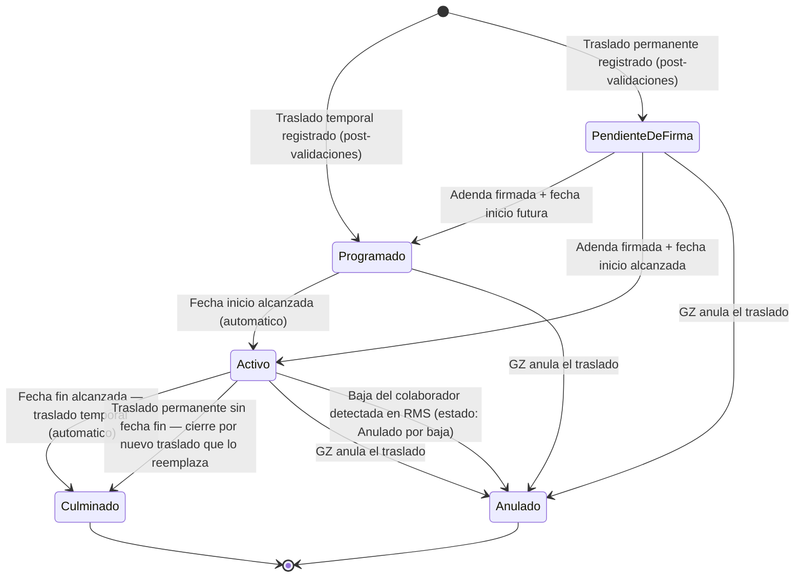

# ESPECIFICACION DE NECESIDADES TECNOLOGICAS
## ENT-MOD-TRAS-001 — Modulo de Traslados
### Sistema Nova | Organizacion Retail Peruana (Cadena / Lukers)

| Campo | Valor |
|---|---|
| Codigo de documento | ENT-MOD-TRAS-001 |
| Version | 1.1 |
| Fecha de emision | 29/05/2026 |
| Estado | VALIDADO — Vacios VAC-TRAS-01 a VAC-TRAS-14 resueltos |
| Elaborado por | Analista Funcional Senior |
| Sistema | Nova |
| Modulo | Traslados |
| Documentos relacionados | ENT-MOD-MARC-001 v1.1, ENT-MOD-DESC-001 v1.2, ENT-MOD-ROLP-001 v1.1, ENT-MOD-ENCA-001 v1.1 |

### Historial de versiones

| Version | Fecha | Descripcion |
|---|---|---|
| 1.0 | 29/05/2026 | Emision inicial. Especificacion funcional base del modulo Traslados. Vacios documentados VAC-TRAS-01 a VAC-TRAS-14. |
| 1.1 | 29/05/2026 | Vacios resueltos. Se incorporan las decisiones del Product Owner y stakeholders para VAC-TRAS-01 a VAC-TRAS-14. Seccion 10 actualizada con estado RESUELTO y decision registrada para cada vacio. Reglas de negocio y casos de uso complementados donde corresponde. |

---

## INDICE

1. Introduccion y Objetivo del Modulo
2. Alcance y Exclusiones
3. Actores y Roles
4. Casos de Uso Principales
5. Reglas de Negocio
6. Estados y Transiciones
7. Entidades y Atributos Principales
8. Permisos por Rol
9. Integraciones
10. Vacios Funcionales y Preguntas Abiertas

---

## 1. INTRODUCCION Y OBJETIVO DEL MODULO

### 1.1 Contexto del negocio

Nova es un sistema de gestion desarrollado desde cero para una organizacion retail peruana con aproximadamente 100 tiendas distribuidas en multiples zonas geograficas. El grupo empresarial opera bajo dos cadenas comerciales: **Cadena** y **Lukers**. La semana laboral del sistema se define de **domingo a sabado** y es consistente con todos los modulos del sistema.

El traslado de personal es la operacion formal mediante la cual un colaborador de tienda cambia su lugar de trabajo de forma temporal o permanente dentro de la red de tiendas. Este evento tiene implicaciones directas en la programacion semanal, el control de asistencia, la gestion de documentos laborales y la sincronizacion con los sistemas externos de nomina y planificacion de recursos.

### 1.2 Problema que resuelve

La organizacion carece de un mecanismo centralizado para gestionar los movimientos de personal entre tiendas. La gestion manual en hojas de calculo o correos electronicos impide:

- Controlar que un colaborador no sea programado o asignado en conflicto con un traslado activo.
- Garantizar que la firma de la adenda de cambio de centro de labores se obtenga antes de habilitar la marcacion en la tienda destino en traslados permanentes.
- Replicar automaticamente la huella biometrica del colaborador al dispositivo de la tienda destino.
- Bloquear la marcacion del colaborador ante una adenda no firmada.
- Anular automaticamente encargaturas futuras al concretar un traslado permanente.
- Sincronizar el estado del colaborador en RMS y OFIPLAN de forma trazable y auditada.

### 1.3 Objetivo del modulo

Proveer el registro, control y seguimiento de los traslados de personal de tienda en Nova, permitiendo:

- Registrar traslados temporales y permanentes con validaciones automaticas en tiempo real.
- Gestionar el flujo de firma electronica de la adenda de cambio de centro de labores para traslados permanentes.
- Bloquear y habilitar la marcacion del colaborador en funcion del estado de firma de la adenda.
- Replicar la huella biometrica del colaborador a la tienda destino de forma automatica.
- Retornar automaticamente al colaborador a su tienda base al vencer la fecha fin de un traslado temporal.
- Anular encargaturas futuras del colaborador al confirmar un traslado permanente.
- Sincronizar el estado con RMS y OFIPLAN en los tiempos parametrizados.
- Ofrecer consulta de historial de traslados con filtros por colaborador, tienda, tipo y estado.

### 1.4 Relacion con otros modulos

- **Modulo de Marcaciones (ENT-MOD-MARC-001):** El modulo de Traslados indica a Marcaciones bloquear la marcacion del colaborador en su tienda base cuando el traslado permanente esta registrado y la adenda no ha sido firmada. Al firmarse la adenda, Traslados notifica a Marcaciones para habilitar la marcacion en la tienda destino. Adicionalmente, Traslados instruye la replicacion de la huella biometrica del colaborador al dispositivo de la tienda destino en ambos tipos de traslado.
- **Modulo de Descansos (ENT-MOD-DESC-001):** Validacion bidireccional. Al registrar un traslado, el sistema verifica en Descansos si el colaborador tiene descansos o compensaciones en el rango de fechas. Al registrar un descanso, Descansos verifica en Traslados si hay un traslado programado en esa fecha.
- **Modulo de Encargatura (ENT-MOD-ENCA-001):** Al confirmar un traslado permanente, Traslados notifica a Encargatura para anular con estado "Anulado por traslado" todas las encargaturas futuras del colaborador. Las encargaturas ya ejecutadas o en ejecucion se conservan como historico.
- **Modulo de Rol de Personal (ENT-MOD-ROLP-001):** Durante el periodo de un traslado temporal, el colaborador aparece en el calendario de programacion de la tienda destino para permitir su inclusion en el rol semanal.
- **RMS (API externa):** Fuente de verdad del estado y datos del colaborador. El estado del colaborador se actualiza en RMS al confirmar el traslado.
- **OFIPLAN (BOT):** Receptor de la migracion diferida de traslados permanentes confirmados. Los tiempos de migracion son parametrizables.
- **Firma Electronica Nova:** Servicio propio del sistema Nova que gestiona la firma de la adenda de cambio de centro de labores mediante selfie, coordenadas GPS y codigo enviado al correo del colaborador.
- **App Movil Nova:** El colaborador firma la adenda desde la app movil Nova. El GZ registra y gestiona los traslados desde el modulo de Gestion de Equipos de la app movil.

---

## 2. ALCANCE Y EXCLUSIONES

### 2.1 Dentro del alcance

- Registro de traslados temporales de personal de tienda.
- Registro de traslados permanentes de personal de tienda con flujo de firma electronica.
- Gestion del ciclo de vida del traslado: Programado, Pendiente de Firma, Activo, Culminado, Anulado.
- Bloqueo y habilitacion de marcacion segun estado de firma de adenda.
- Replicacion de huella biometrica a tienda destino.
- Retorno automatico al vencer la fecha fin de un traslado temporal.
- Anulacion automatica de encargaturas futuras al confirmar traslado permanente.
- Validacion bidireccional de conflictos con el modulo de Descansos.
- Validacion de conflicto con encargaturas activas antes de registrar traslado.
- Sincronizacion con RMS via API al confirmar traslado.
- Migracion a OFIPLAN via BOT con tiempos parametrizables para traslados permanentes.
- Consulta de historial de traslados por colaborador, tienda, tipo y estado.
- Anulacion de traslado por parte del GZ dentro de las restricciones de negocio.
- Auditoria completa de acciones sobre traslados (usuario, fecha, hora, accion).

### 2.2 Fuera del alcance

- Traslados de personal de oficina o central. Este modulo aplica exclusivamente a personal de tienda.
- Gestion de cambios de cargo, categoria o remuneracion. Ese proceso pertenece a OFIPLAN y RRHH.
- Programacion semanal del colaborador en la tienda destino. Esa responsabilidad pertenece al modulo de Rol de Personal.
- Generacion del contenido legal de la adenda. El sistema gestiona el flujo de firma; el contenido juridico es responsabilidad del area de RRHH.
- Gestion de licencias, vacaciones o ausencias de largo plazo. Pertenece al modulo de Descansos.
- Traslados entre empresas distintas (de Cadena a Lukers o viceversa). Los movimientos entre Cadena y Lukers constituyen un proceso de cese y reingreso gestionado exclusivamente por RRHH y OFIPLAN. Este modulo aplica unicamente a traslados dentro de la misma empresa. (Resuelto: VAC-TRAS-01)

---

## 3. ACTORES Y ROLES

| ID | Actor | Tipo | Descripcion |
|---|---|---|---|
| ACT-01 | Gerente Zonal (GZ) | Usuario principal | Registra, gestiona y anula traslados del personal de su zona. Accede desde la app movil Nova (modulo Gestion de Equipos). |
| ACT-02 | Colaborador (Asesor) | Usuario externo | Recibe la notificacion de adenda y la firma desde la app movil Nova. No inicia el flujo de traslado. |
| ACT-03 | Administracion de Ventas | Usuario supervisor | Consulta y supervisa traslados de todas las zonas. Sin capacidad de registro o modificacion. |
| ACT-04 | Gerencia General (GG) | Usuario supervisor | Consulta y supervisa traslados a nivel empresa. Sin capacidad de registro o modificacion. |
| ACT-05 | Administrador del Sistema | Usuario tecnico | Configura parametros del modulo: tiempos de migracion a OFIPLAN, umbrales de notificacion, parametros de firma electronica. |
| ACT-06 | Sistema Nova (automatico) | Sistema | Ejecuta el retorno automatico al vencer traslados temporales, anula encargaturas futuras, instruye replicacion de huella y sincronizacion con RMS y OFIPLAN. |
| ACT-07 | Servicio de Firma Electronica Nova | Sistema externo | Gestiona el envio de la adenda, la captura de selfie, coordenadas GPS y codigo por correo, y el registro de la firma del colaborador. |

---

## 4. CASOS DE USO PRINCIPALES

---

### CU-TRAS-01: Registrar traslado temporal

```
ID: CU-TRAS-01
Actor principal: Gerente Zonal (GZ)
Actores secundarios: Sistema Nova (ACT-06), Modulo de Descansos, Modulo de Encargatura, RMS
Relacionado: RN-TRAS-01, RN-TRAS-02, RN-TRAS-03, RN-TRAS-04, RN-TRAS-05, RN-TRAS-07, RN-TRAS-08, RN-TRAS-12

Precondicion:
- El GZ esta autenticado en la app movil Nova.
- El colaborador pertenece a una tienda dentro de la zona del GZ.
- El colaborador es personal de tienda (no personal de oficina/central).

Flujo principal:
1. El GZ accede al modulo Gestion de Equipos en la app movil Nova y selecciona la opcion Traslados.
2. El GZ selecciona al colaborador a trasladar desde la lista de personal de su zona.
3. El sistema consulta RMS para obtener el estado vigente del colaborador y confirma que es personal de tienda activo.
4. El GZ selecciona el tipo de traslado: Temporal.
5. El GZ ingresa fecha inicio, fecha fin y tienda destino.
6. El sistema valida que la fecha inicio sea posterior o igual a la fecha actual (RN-TRAS-02).
7. El sistema valida que la fecha fin sea posterior a la fecha inicio (RN-TRAS-03).
8. El sistema valida que no exista un traslado activo o programado del colaborador que se solape con el rango de fechas ingresado (RN-TRAS-04).
9. El sistema consulta el modulo de Descansos para verificar que no existan descansos o compensaciones del colaborador en el rango de fechas que impidan el traslado (RN-TRAS-05).
10. El sistema verifica que el colaborador no tenga una encargatura activa en el rango de fechas ingresado (RN-TRAS-07).
11. El sistema presenta al GZ el resumen del traslado para confirmacion: colaborador, tienda origen, tienda destino, fecha inicio, fecha fin.
12. El GZ confirma el registro.
13. El sistema crea el traslado en estado Programado.
14. El sistema instruye la replicacion de la huella biometrica del colaborador al dispositivo de la tienda destino antes de la fecha inicio (RN-TRAS-12).
15. El sistema instruye al modulo de Marcaciones bloquear la marcacion del colaborador en su tienda base durante el periodo del traslado temporal, con mensaje informativo (VAC-TRAS-07 resuelto).
16. El sistema actualiza el estado del colaborador en RMS via API.
17. El sistema registra la accion en el log de auditoria.
Nota: Los traslados temporales NO generan notificacion push ni correo al colaborador en esta version del modulo (VAC-TRAS-04 resuelto).

Flujos alternos:
A1 — Colaborador sin huella enrolada:
  A1.1. En el paso 14, si el colaborador no tiene huella biometrica enrolada, el sistema genera una alerta al GZ indicando que debe coordinarse el enrolamiento antes de la fecha inicio.
  A1.2. El traslado se registra de todas formas en estado Programado.
  A1.3. El sistema registra la alerta en el log de auditoria.

A2 — Tienda destino sin dispositivo biometrico disponible:
  A2.1. El sistema genera una alerta al GZ indicando la situacion del dispositivo.
  A2.2. El traslado se registra en estado Programado.
  A2.3. El sistema registra la alerta en el log de auditoria.

Excepciones:
E1 — Existe solapamiento con traslado previo (RN-TRAS-04):
  El sistema muestra mensaje de error indicando el traslado que genera el conflicto (fechas y tienda). El GZ debe corregir las fechas o anular el traslado previo antes de continuar.

E2 — Existe descanso o compensacion en el rango (RN-TRAS-05):
  El sistema muestra el detalle del conflicto (tipo, fechas del descanso). El GZ no puede continuar hasta resolver el conflicto en el modulo de Descansos.

E3 — Existe encargatura activa en el rango (RN-TRAS-07):
  El sistema muestra el detalle de la encargatura activa. El GZ no puede continuar; debe anular la encargatura antes de registrar el traslado.

E4 — RMS no disponible:
  El sistema muestra mensaje de error de integracion y no permite continuar el registro. El GZ debe reintentar cuando el servicio este disponible.

E5 — Fecha inicio en el pasado (RN-TRAS-02):
  El sistema muestra mensaje de error. El GZ debe corregir la fecha.

Postcondicion:
- El traslado queda registrado en estado Programado.
- El colaborador aparece en el calendario de la tienda destino para el rango de fechas indicado en el modulo de Rol de Personal.
- La replicacion de huella biometrica a la tienda destino ha sido instruida.
- La marcacion del colaborador en su tienda base queda bloqueada con mensaje informativo durante el periodo del traslado temporal.
- El estado del colaborador ha sido actualizado en RMS.
- No se genera notificacion al colaborador por traslado temporal en esta version del modulo.
```

---

### CU-TRAS-02: Registrar traslado permanente

```
ID: CU-TRAS-02
Actor principal: Gerente Zonal (GZ)
Actores secundarios: Sistema Nova (ACT-06), Servicio de Firma Electronica Nova, Modulo de Descansos, Modulo de Encargatura, RMS, OFIPLAN
Relacionado: RN-TRAS-01, RN-TRAS-02, RN-TRAS-04, RN-TRAS-05, RN-TRAS-06, RN-TRAS-07, RN-TRAS-08, RN-TRAS-09, RN-TRAS-12, RN-TRAS-13

Precondicion:
- El GZ esta autenticado en la app movil Nova.
- El colaborador pertenece a una tienda dentro de la zona del GZ.
- El colaborador es personal de tienda activo.

Flujo principal:
1. El GZ accede al modulo Gestion de Equipos y selecciona la opcion Traslados.
2. El GZ selecciona al colaborador a trasladar.
3. El sistema consulta RMS y confirma que el colaborador es personal de tienda activo.
4. El GZ selecciona el tipo de traslado: Permanente.
5. El GZ ingresa fecha inicio y tienda destino. No se ingresa fecha fin.
6. El sistema valida que la fecha inicio sea posterior o igual a la fecha actual (RN-TRAS-02).
7. El sistema valida que no exista un traslado activo o programado que se solape con la fecha inicio en adelante (RN-TRAS-04).
8. El sistema consulta el modulo de Descansos para verificar que no existan conflictos en las fechas proximas al inicio del traslado (RN-TRAS-05).
9. El sistema verifica que el colaborador no tenga encargatura activa en la fecha de inicio del traslado (RN-TRAS-07).
10. El sistema presenta al GZ el resumen del traslado: colaborador, tienda origen, tienda destino, fecha inicio, tipo Permanente.
11. El GZ confirma el registro.
12. El sistema crea el traslado en estado Pendiente de Firma.
13. El sistema envia la adenda de cambio de centro de labores al colaborador a traves del Servicio de Firma Electronica Nova (RN-TRAS-08): notificacion push y correo electronico con codigo de firma.
14. El sistema instruye la replicacion de la huella biometrica del colaborador al dispositivo de la tienda destino antes de la fecha inicio (RN-TRAS-12).
15. El sistema anula automaticamente todas las encargaturas futuras del colaborador con estado "Anulado por traslado" en el modulo de Encargatura (RN-TRAS-09).
16. El sistema actualiza el estado del colaborador en RMS via API.
17. El sistema registra la accion en el log de auditoria.

Flujos alternos:
A1 — El colaborador tenia encargaturas futuras:
  A1.1. En el paso 15, si existen encargaturas futuras, el sistema las anula todas con estado "Anulado por traslado" y registra el ID del traslado como referencia en cada encargatura anulada.
  A1.2. Se genera una notificacion al GZ con el listado de encargaturas anuladas.

A2 — Colaborador sin huella enrolada:
  A2.1. El sistema genera una alerta al GZ indicando que debe coordinarse el enrolamiento antes de la fecha inicio.
  A2.2. El traslado se registra en estado Pendiente de Firma.

Excepciones:
E1 — Existe solapamiento con traslado previo (RN-TRAS-04):
  El sistema muestra el detalle del conflicto. El GZ debe resolverlo antes de continuar.

E2 — Existe descanso o compensacion en conflicto (RN-TRAS-05):
  El sistema muestra el detalle del descanso. El GZ no puede continuar hasta resolver el conflicto.

E3 — Existe encargatura activa en la fecha de inicio (RN-TRAS-07):
  El sistema muestra el detalle de la encargatura. El GZ debe anularla antes de continuar.

E4 — Fallo en el envio de la adenda:
  El sistema registra el fallo, mantiene el traslado en estado Pendiente de Firma y reintenta el envio segun la politica de reintentos configurada por el Administrador del Sistema. Se notifica al GZ del fallo.

E5 — RMS no disponible:
  El sistema muestra mensaje de error y no permite continuar.

Postcondicion:
- El traslado queda registrado en estado Pendiente de Firma.
- La adenda ha sido enviada al colaborador para firma electronica.
- La replicacion de huella biometrica a la tienda destino ha sido instruida.
- Las encargaturas futuras del colaborador han sido anuladas con estado "Anulado por traslado".
- El estado del colaborador ha sido actualizado en RMS.
- La marcacion del colaborador permanece en su estado actual hasta que inicie el periodo del traslado (ver CU-TRAS-04).
```

---

### CU-TRAS-03: Flujo de firma electronica de adenda

```
ID: CU-TRAS-03
Actor principal: Colaborador (ACT-02)
Actores secundarios: Servicio de Firma Electronica Nova, Sistema Nova (ACT-06), Modulo de Marcaciones
Relacionado: RN-TRAS-08, RN-TRAS-10, RN-TRAS-11, RN-TRAS-13

Precondicion:
- Existe un traslado permanente en estado Pendiente de Firma asociado al colaborador.
- El colaborador tiene la app movil Nova instalada y su sesion activa o puede autenticarse.
- El colaborador ha recibido la notificacion push y/o el correo con el codigo de firma.

Flujo principal:
1. El colaborador recibe la notificacion push en la app movil Nova indicando que tiene una adenda pendiente de firma.
2. El colaborador accede a la seccion de documentos pendientes de firma en la app movil Nova.
3. El sistema muestra el detalle de la adenda: datos del colaborador, tienda origen, tienda destino, fecha de inicio del traslado.
4. El colaborador inicia el proceso de firma electronica.
5. El Servicio de Firma Electronica Nova solicita al colaborador:
   a. Captura de selfie.
   b. Captura de coordenadas GPS del dispositivo.
   c. Ingreso del codigo de firma recibido por correo electronico.
6. El colaborador completa los tres elementos de verificacion.
7. El Servicio de Firma Electronica Nova valida los elementos y registra la firma con marca de tiempo, selfie, coordenadas GPS y codigo utilizado.
8. El sistema actualiza el estado del traslado de Pendiente de Firma a Activo (si la fecha inicio ya fue alcanzada) o a Programado (si la fecha inicio es futura) (RN-TRAS-10).
9. El sistema notifica a Marcaciones para habilitar la marcacion del colaborador en la tienda destino a partir de la fecha inicio del traslado (RN-TRAS-11).
10. El sistema notifica al GZ que la adenda ha sido firmada.
11. El sistema encola la migracion del traslado en OFIPLAN via BOT segun el tiempo parametrizado (RN-TRAS-13).
12. El sistema registra la accion en el log de auditoria con todos los elementos de la firma.

Flujos alternos:
A1 — El colaborador no tiene acceso a la app movil Nova:
  A1.1. El colaborador puede acceder a la firma desde la version web de Nova si el canal web esta habilitado para este proceso.
  A1.2. Si el canal web no esta habilitado, el GZ debe coordinar con el area de TI.

A2 — El codigo de firma ha expirado:
  A2.1. El sistema muestra mensaje indicando que el codigo ha expirado.
  A2.2. El colaborador puede solicitar el reenvio del codigo desde la app movil Nova.
  A2.3. El Servicio de Firma Electronica Nova genera un nuevo codigo y lo envia al correo del colaborador.

A3 — El GPS del dispositivo no esta disponible:
  A3.1. El Servicio de Firma Electronica Nova muestra mensaje de error indicando que las coordenadas GPS son requeridas.
  A3.2. El colaborador debe activar el GPS del dispositivo para continuar.

Excepciones:
E1 — El colaborador ingresa un codigo incorrecto mas de N intentos (N parametrizable):
  El sistema bloquea el proceso de firma e informa al GZ. El Administrador del Sistema puede desbloquear el proceso o generar un nuevo envio de adenda.

E2 — El Servicio de Firma Electronica Nova no esta disponible:
  El sistema muestra mensaje de error al colaborador. El traslado permanece en estado Pendiente de Firma. El sistema reintenta la conexion segun politica configurada.

Postcondicion:
- La firma electronica de la adenda queda registrada con selfie, coordenadas GPS, codigo, marca de tiempo y ID del traslado.
- El traslado pasa a estado Programado o Activo segun la fecha inicio.
- La marcacion en la tienda destino queda habilitada a partir de la fecha inicio.
- La migracion a OFIPLAN ha sido encolada.
- El GZ ha sido notificado de la firma.
```

---

### CU-TRAS-04: Bloqueo de marcacion por firma pendiente

```
ID: CU-TRAS-04
Actor principal: Sistema Nova — automatico (ACT-06)
Actores secundarios: Modulo de Marcaciones, Colaborador, GZ
Relacionado: RN-TRAS-14, RN-TRAS-15

Precondicion:
- Existe un traslado permanente en estado Pendiente de Firma.
- La fecha inicio del traslado ha sido alcanzada.
- El colaborador no ha firmado la adenda.

Flujo principal:
1. El sistema evalua diariamente (o en tiempo real al momento de la marcacion) si existen traslados permanentes cuya fecha inicio ha llegado y cuya adenda no ha sido firmada.
2. El sistema instruye al modulo de Marcaciones el bloqueo de la marcacion del colaborador en su tienda base a partir de la fecha inicio del traslado (RN-TRAS-14).
3. El modulo de Marcaciones bloquea el intento de marcacion del colaborador en la tienda base: el dispositivo biometrico rechaza la marcacion y muestra un mensaje indicando que el colaborador tiene un traslado pendiente de firma.
4. El sistema envia una notificacion de recordatorio al colaborador (push y correo) indicando que debe firmar la adenda para poder marcar asistencia.
5. El sistema notifica al GZ del bloqueo activo para su seguimiento.
6. El sistema registra el bloqueo en el log de auditoria.

Flujos alternos:
A1 — El colaborador firma la adenda mientras el bloqueo esta activo:
  A1.1. Al completarse la firma (CU-TRAS-03), el sistema instruye a Marcaciones levantar el bloqueo en la tienda base.
  A1.2. El sistema habilita la marcacion del colaborador en la tienda destino.
  A1.3. El GZ recibe notificacion de que el bloqueo ha sido levantado.

Excepciones:
E1 — El colaborador intenta marcar repetidamente en tienda base:
  Cada intento es rechazado y registrado en el log de Marcaciones. Se genera una alerta al GZ si los intentos superan un umbral configurable en el mismo dia.

Postcondicion:
- La marcacion del colaborador en tienda base esta bloqueada mientras la adenda no sea firmada.
- El colaborador y el GZ han sido notificados.
- El bloqueo queda registrado en el log de auditoria.
```

---

### CU-TRAS-05: Retorno automatico al vencer traslado temporal

```
ID: CU-TRAS-05
Actor principal: Sistema Nova — automatico (ACT-06)
Actores secundarios: Modulo de Marcaciones, Modulo de Rol de Personal, RMS
Relacionado: RN-TRAS-16, RN-TRAS-17

Precondicion:
- Existe un traslado temporal en estado Activo.
- La fecha actual es igual a la fecha fin del traslado mas un dia (inicio del primer dia sin traslado) o segun la logica de corte parametrizada.

Flujo principal:
1. El sistema ejecuta el proceso automatico de evaluacion de vencimiento de traslados temporales (frecuencia: diaria, al inicio de la jornada o segun parametro configurado).
2. El sistema identifica todos los traslados temporales cuya fecha fin ha sido alcanzada o superada.
3. Para cada traslado identificado, el sistema actualiza el estado a Culminado.
4. El sistema notifica al modulo de Marcaciones que el colaborador ha vuelto a su tienda base: se habilita la marcacion en tienda base y se revoca la habilitacion en tienda destino (RN-TRAS-16).
5. El sistema notifica al modulo de Rol de Personal que el colaborador ya no aparece en el calendario de la tienda destino (RN-TRAS-17).
6. El sistema actualiza el estado del colaborador en RMS via API.
7. El sistema notifica al GZ del retorno automatico del colaborador.
8. El sistema notifica al colaborador que ha retornado a su tienda base al vencer el traslado temporal (canal: notificacion push y correo electronico) (VAC-TRAS-06 resuelto).
9. El sistema registra la accion en el log de auditoria.

Excepciones:
E1 — RMS no disponible al momento del retorno:
  El sistema registra el intento fallido, actualiza el estado del traslado a Culminado en Nova y encola el reintento de sincronizacion con RMS. El GZ es notificado del fallo de sincronizacion.

E2 — El colaborador tiene un nuevo traslado programado que inicia inmediatamente despues:
  El sistema culmina el traslado anterior y activa el siguiente segun su flujo correspondiente (temporal o permanente).

Postcondicion:
- El traslado temporal queda en estado Culminado.
- El colaborador ha vuelto a marcar en su tienda base.
- El colaborador ya no aparece en el calendario de la tienda destino.
- El estado del colaborador ha sido actualizado en RMS.
- El GZ ha sido notificado del retorno.
```

---

### CU-TRAS-06: Consultar historial de traslados

```
ID: CU-TRAS-06
Actor principal: Gerente Zonal (GZ), Administracion de Ventas, Gerencia General (GG), Colaborador (ACT-02 — solo lectura, solo sus propios traslados, si el parametro de visibilidad esta habilitado)
Actores secundarios: ninguno
Relacionado: RN-TRAS-18, RN-TRAS-19

Precondicion:
- El usuario esta autenticado en Nova (app movil o web segun rol).
- El usuario tiene permisos de consulta sobre el modulo de Traslados.

Flujo principal:
1. El usuario accede a la seccion de historial de traslados.
2. El sistema muestra una lista paginada de traslados con los siguientes filtros disponibles:
   - Colaborador (nombre o codigo).
   - Tienda origen.
   - Tienda destino.
   - Tipo de traslado (Temporal / Permanente).
   - Estado (Programado, Pendiente de Firma, Activo, Culminado, Anulado).
   - Rango de fechas (fecha inicio del traslado).
   - Empresa (Cadena / Lukers).
3. El usuario aplica los filtros deseados.
4. El sistema muestra los resultados filtrados con los campos: ID traslado, colaborador, tienda origen, tienda destino, tipo, fecha inicio, fecha fin (si aplica), estado, fecha de registro, registrado por.
5. El usuario selecciona un traslado para ver su detalle.
6. El sistema muestra el detalle completo incluyendo: datos de firma electronica (si aplica), log de auditoria de acciones sobre el traslado, encargaturas anuladas asociadas (si aplica).
7. El usuario puede exportar la lista filtrada a Excel (RN-TRAS-18).

Excepciones:
E1 — El GZ intenta consultar traslados fuera de su zona:
  El sistema filtra automaticamente los resultados a la zona del GZ. No se muestran traslados de otras zonas.

Postcondicion:
- El usuario ha podido consultar y filtrar el historial de traslados segun sus permisos de ambito.
```

---

### CU-TRAS-07: Anular traslado

```
ID: CU-TRAS-07
Actor principal: Gerente Zonal (GZ)
Actores secundarios: Sistema Nova (ACT-06), Modulo de Marcaciones, Modulo de Rol de Personal, RMS
Relacionado: RN-TRAS-20, RN-TRAS-21, RN-TRAS-22

Precondicion:
- El GZ esta autenticado en la app movil Nova.
- Existe un traslado en estado Programado, Pendiente de Firma o Activo registrado en la zona del GZ.

Flujo principal:
1. El GZ accede al historial de traslados y selecciona el traslado que desea anular.
2. El sistema valida que el traslado este en un estado anulable (Programado, Pendiente de Firma o Activo) (RN-TRAS-20).
3. El sistema valida que el traslado sea de la zona del GZ (RN-TRAS-19).
4. El GZ selecciona la accion Anular y debe ingresar obligatoriamente el motivo de anulacion.
5. El sistema solicita confirmacion al GZ.
6. El GZ confirma la anulacion.
7. El sistema actualiza el estado del traslado a Anulado y registra el motivo y el usuario que realizo la anulacion.
8. El sistema instruye al modulo de Marcaciones revertir los bloqueos o habilitaciones aplicadas por el traslado (RN-TRAS-21):
   - Si el traslado era permanente y estaba en Pendiente de Firma: se levanta el bloqueo anticipatorio si corresponde.
   - Si el traslado estaba Activo (temporal o permanente con firma): se revoca la habilitacion en tienda destino y se restaura la marcacion en tienda base.
9. El sistema notifica al modulo de Rol de Personal que el colaborador ya no aparece en el calendario de la tienda destino.
10. El sistema actualiza el estado del colaborador en RMS via API (RN-TRAS-22).
11. El sistema notifica al colaborador de la anulacion del traslado (push y correo).
12. El sistema registra la accion completa en el log de auditoria.

Flujos alternos:
A1 — El traslado anulado era permanente y tenia encargaturas anuladas por el traslado:
  A1.1. El sistema notifica al GZ que las encargaturas que fueron anuladas por este traslado NO se reactivan automaticamente.
  A1.2. El GZ debe reprogramar las encargaturas manualmente si lo considera pertinente.

Excepciones:
E1 — El traslado esta en estado Culminado o ya Anulado (RN-TRAS-20):
  El sistema muestra mensaje indicando que el traslado no puede anularse en su estado actual.

E2 — El traslado no pertenece a la zona del GZ:
  El sistema muestra mensaje de acceso denegado.

Postcondicion:
- El traslado queda en estado Anulado con motivo y responsable registrados.
- Los efectos del traslado sobre Marcaciones y Rol de Personal han sido revertidos.
- El colaborador ha sido notificado.
- El estado del colaborador ha sido actualizado en RMS.
- La accion queda registrada en el log de auditoria.
```

---

## 5. REGLAS DE NEGOCIO

### 5.1 Elegibilidad y alcance

| ID | Regla | Criterio de verificacion |
|---|---|---|
| RN-TRAS-01 | Solo se puede registrar un traslado para personal de tienda activo. Personal de oficina, central o con estado inactivo en RMS no puede ser trasladado. La tienda destino debe pertenecer a la misma empresa que la tienda origen del colaborador (Cadena a Cadena, Lukers a Lukers). Los movimientos entre empresas distintas quedan fuera del alcance de este modulo. | Al seleccionar un colaborador, el sistema consulta RMS y valida que el tipo de personal sea "tienda" y el estado sea "activo". Al seleccionar la tienda destino, el sistema valida que pertenezca a la misma empresa que la tienda origen. Si no se cumple alguna condicion, el sistema bloquea el registro y muestra el motivo. |
| RN-TRAS-06 | Un colaborador solo puede tener un traslado activo o programado a la vez. | El sistema verifica que no exista ningun traslado en estado Programado, Pendiente de Firma o Activo para el colaborador en cualquier rango de fechas que se solape con el nuevo traslado. Si existe solapamiento, el registro es bloqueado. |

### 5.2 Validaciones de fechas

| ID | Regla | Criterio de verificacion |
|---|---|---|
| RN-TRAS-02 | La fecha inicio del traslado no puede ser anterior a la fecha actual del sistema. | El sistema compara la fecha inicio ingresada con la fecha actual. Si es anterior, muestra error y bloquea el registro. |
| RN-TRAS-03 | En traslados temporales, la fecha fin debe ser estrictamente posterior a la fecha inicio. | El sistema valida que fecha_fin > fecha_inicio. Si no se cumple, muestra error y bloquea el registro. |
| RN-TRAS-04 | No puede existir solapamiento de fechas entre dos traslados del mismo colaborador. | El sistema consulta todos los traslados del colaborador en estados Programado, Pendiente de Firma y Activo. Si el rango [fecha_inicio_nuevo, fecha_fin_nuevo] se intersecta con cualquier rango existente, el registro es bloqueado. |

### 5.3 Validaciones de conflicto con otros modulos

| ID | Regla | Criterio de verificacion |
|---|---|---|
| RN-TRAS-05 | No se puede registrar un traslado si el colaborador tiene alguno de los siguientes registros activos o aprobados que se solapen con el rango de fechas del traslado: descanso laboral, compensacion, cobertura de tienda, cobertura por tipo de venta, descanso medico, vacaciones o licencia. El bloqueo es duro; no se permite registro con advertencia ni con aprobacion posterior. El GZ debe resolver el conflicto antes de continuar. | El sistema consulta el modulo de Descansos. Si existe cualquier registro de los tipos enumerados en estados aprobado o activo que se solape con el rango del traslado, el registro es bloqueado con mensaje que detalla el tipo y fechas del conflicto. No existe opcion de "continuar de todas formas". |
| RN-TRAS-07 | No se puede registrar un traslado si el colaborador tiene una encargatura activa o programada que se solape con el rango de fechas del traslado. | El sistema consulta el modulo de Encargatura. Si existe una encargatura en estado Programado, En Ejecucion o Pendiente en el rango de fechas, el registro es bloqueado. |

### 5.4 Traslado permanente — firma electronica

| ID | Regla | Criterio de verificacion |
|---|---|---|
| RN-TRAS-08 | Todo traslado permanente requiere la firma electronica de una adenda de cambio de centro de labores por parte del colaborador antes de que la marcacion en la tienda destino sea habilitada. | El sistema no habilita la marcacion en tienda destino hasta que el estado del traslado sea Programado (post-firma) o Activo. El estado Pendiente de Firma no habilita marcacion en tienda destino. |
| RN-TRAS-09 | Al confirmar el registro de un traslado permanente, el sistema anula automaticamente todas las encargaturas futuras del colaborador con estado "Anulado por traslado". Las encargaturas en ejecucion o culminadas se conservan como historico. | El sistema consulta Encargatura y anula todos los registros con fecha inicio mayor a la fecha actual y que pertenezcan al colaborador. Cada registro anulado debe contener el ID del traslado como referencia. |
| RN-TRAS-10 | Al registrarse la firma de la adenda, el estado del traslado permanente transiciona: a Activo si la fecha inicio ha sido alcanzada, o a Programado si la fecha inicio es futura. | El sistema compara la fecha de firma con la fecha inicio del traslado. Si fecha_firma >= fecha_inicio, el estado pasa a Activo. Si fecha_firma < fecha_inicio, el estado pasa a Programado. |
| RN-TRAS-11 | La habilitacion de marcacion en la tienda destino para traslados permanentes se activa en la fecha inicio del traslado, siempre que la adenda haya sido firmada. | El sistema evalua diariamente (o al momento de la marcacion) si la fecha inicio ha llegado y la adenda esta firmada. Solo bajo ambas condiciones se habilita la marcacion en tienda destino. |

### 5.5 Bloqueo de marcacion

| ID | Regla | Criterio de verificacion |
|---|---|---|
| RN-TRAS-14 | Si la fecha inicio de un traslado permanente ha llegado y la adenda no ha sido firmada, el sistema bloquea la marcacion del colaborador en su tienda base. | El dispositivo biometrico de la tienda base rechaza la marcacion del colaborador. El sistema registra el intento bloqueado en el log de Marcaciones. |
| RN-TRAS-15 | El bloqueo de marcacion se levanta automaticamente en el momento en que el colaborador firma la adenda (si la fecha inicio ya paso) o en la fecha inicio (si la firma se realizou antes). | El sistema instruye a Marcaciones levantar el bloqueo inmediatamente despues de registrar la firma valida de la adenda. |

### 5.6 Traslado temporal — visibilidad y retorno

| ID | Regla | Criterio de verificacion |
|---|---|---|
| RN-TRAS-16 | En traslados temporales, el colaborador aparece en la lista de asesores de la tienda destino durante el periodo del traslado para fines de programacion en Rol de Personal. La marcacion en la tienda base queda bloqueada con mensaje informativo durante el periodo del traslado; el colaborador solo puede marcar en la tienda destino. | El modulo de Rol de Personal muestra al colaborador en la lista de la tienda destino durante el rango de fechas del traslado temporal. El modulo de Marcaciones bloquea la marcacion en tienda base con mensaje informativo. Fuera del rango, el colaborador aparece unicamente en su tienda base y la marcacion en tienda base es habilitada automaticamente. |
| RN-TRAS-17 | Al vencer la fecha fin de un traslado temporal, el sistema retorna automaticamente al colaborador a su tienda base. El retorno no requiere accion manual del GZ. | El proceso automatico diario identifica traslados temporales cuya fecha_fin sea menor a la fecha actual y los marca como Culminado, revertiendo la habilitacion de marcacion en tienda destino. |

### 5.7 Biometria

| ID | Regla | Criterio de verificacion |
|---|---|---|
| RN-TRAS-12 | La huella biometrica del colaborador debe ser replicada al dispositivo de la tienda destino antes de la fecha inicio del traslado, tanto para traslados temporales como permanentes. Si la replicacion esta incompleta con la anticipacion configurada en tabla de parametros antes de la fecha inicio, el sistema alerta al GT de la tienda destino para que realice el enrolamiento manual del colaborador. El traslado no se bloquea por fallo de replicacion. | El sistema instruye la replicacion al registrar el traslado. El log de auditoria debe registrar la fecha y estado de la replicacion (exitosa / fallida). Si la replicacion falla o esta pendiente dentro del umbral de anticipacion parametrizado, se genera alerta al GT de la tienda destino, al GZ y al Administrador del Sistema. El GT de destino es responsable de garantizar la operatividad biometrica del colaborador en su tienda. |

### 5.8 Integraciones externas

| ID | Regla | Criterio de verificacion |
|---|---|---|
| RN-TRAS-13 | La migracion del traslado permanente a OFIPLAN via BOT se realiza en tiempos parametrizables configurados por el Administrador del Sistema. | La migracion se encola al registrarse la firma de la adenda. El tiempo de ejecucion del BOT es configurable por parametro. El log de auditoria registra la fecha y resultado de cada ejecucion del BOT. |

### 5.9 Consulta y auditoria

| ID | Regla | Criterio de verificacion |
|---|---|---|
| RN-TRAS-18 | El historial de traslados es exportable a Excel con los filtros aplicados en la consulta. | La exportacion genera un archivo .xlsx con todos los campos de la lista. La accion de exportacion queda registrada en el log de auditoria con el usuario y fecha. |
| RN-TRAS-19 | El GZ solo puede consultar, registrar y anular traslados del personal de su propia zona. | El sistema aplica filtrado por zona del GZ autenticado. Cualquier intento de acceso a datos de otra zona es rechazado con mensaje de acceso denegado. |

### 5.10 Anulacion

| ID | Regla | Criterio de verificacion |
|---|---|---|
| RN-TRAS-20 | Solo se pueden anular traslados en estados Programado, Pendiente de Firma o Activo. Los traslados en estado Culminado o Anulado no pueden ser anulados. | El sistema valida el estado del traslado antes de mostrar la opcion de anulacion. Si el estado no es anulable, la opcion no esta disponible. |
| RN-TRAS-21 | Al anular un traslado, el sistema revierte los efectos sobre Marcaciones y Rol de Personal: levanta bloqueos aplicados y elimina la habilitacion en tienda destino. | El sistema verifica el estado de Marcaciones asociado al traslado e instruye la reversion. El log de auditoria registra los cambios revertidos. |
| RN-TRAS-22 | Al anular un traslado, el sistema actualiza el estado del colaborador en RMS via API. | El sistema llama a la API de RMS con el estado revertido. Si RMS no esta disponible, se encola el reintento y se notifica al GZ del fallo temporal. |
| RN-TRAS-23 | Las encargaturas anuladas automaticamente por un traslado permanente NO se reactivan al anular el traslado. El GZ debe reprogramarlas manualmente si lo requiere. | Al anular el traslado, el sistema no modifica el estado de las encargaturas anuladas. El GZ es notificado de este comportamiento en el mensaje de confirmacion de anulacion. |

---

## 6. ESTADOS Y TRANSICIONES

### 6.1 Maquina de estados del traslado



### 6.2 Descripcion de estados

| Estado | Descripcion | Quien lo asigna |
|---|---|---|
| Programado | El traslado ha sido registrado y validado. La fecha inicio es futura. Para traslados permanentes: la adenda ya fue firmada. | Sistema (al registrar traslado temporal) o Sistema (al firmar adenda con fecha inicio futura). |
| Pendiente de Firma | El traslado permanente ha sido registrado y la adenda ha sido enviada al colaborador pero aun no firmada. | Sistema automatico al registrar traslado permanente. |
| Activo | La fecha inicio ha sido alcanzada y el traslado esta en plena ejecucion. Para permanentes: requiere adenda firmada. Para temporales: activacion automatica. | Sistema automatico al alcanzar la fecha inicio. |
| Culminado | El traslado ha concluido: fecha fin alcanzada (temporal) o cierre formal (permanente por nuevo traslado o baja). | Sistema automatico (temporal) o proceso de cierre (permanente). |
| Anulado | El traslado fue cancelado por el GZ antes de culminar. Se conserva el registro con motivo y responsable. | GZ (accion manual). |

### 6.3 Estados de la adenda de firma electronica

| Estado | Descripcion |
|---|---|
| Pendiente | La adenda fue enviada al colaborador y aun no ha sido firmada. |
| Firmada | El colaborador completo el proceso de firma con selfie, GPS y codigo. |
| Expirada | El codigo de firma expiro sin ser utilizado y no se ha generado reenvio. |
| Bloqueada | El colaborador supero el numero maximo de intentos fallidos de firma. |

---

## 7. ENTIDADES Y ATRIBUTOS PRINCIPALES

### 7.1 Traslado

| Atributo | Tipo | Obligatorio | Descripcion |
|---|---|---|---|
| id_traslado | UUID | Si | Identificador unico del traslado. |
| id_colaborador | UUID | Si | Referencia al colaborador trasladado. |
| id_tienda_origen | UUID | Si | Tienda base del colaborador al momento del traslado. |
| id_tienda_destino | UUID | Si | Tienda a la que se traslada el colaborador. |
| tipo_traslado | Enum | Si | Valores: TEMPORAL, PERMANENTE. |
| fecha_inicio | Date | Si | Fecha en que inicia el traslado. |
| fecha_fin | Date | Condicional | Requerido solo para traslados TEMPORALES. Nulo para PERMANENTE. |
| estado | Enum | Si | Valores: PROGRAMADO, PENDIENTE_FIRMA, ACTIVO, CULMINADO, ANULADO. |
| motivo_anulacion | Text | Condicional | Requerido si el estado es ANULADO. |
| id_usuario_registro | UUID | Si | GZ que registro el traslado. |
| fecha_registro | DateTime | Si | Fecha y hora de creacion del registro. |
| id_usuario_anulacion | UUID | Condicional | GZ que anulo el traslado. |
| fecha_anulacion | DateTime | Condicional | Fecha y hora de la anulacion. |
| id_empresa | Enum | Si | Valores: CADENA, LUKERS. |
| estado_replicacion_huella | Enum | Si | Valores: PENDIENTE, EXITOSA, FALLIDA. |
| fecha_replicacion_huella | DateTime | No | Fecha y hora en que se realizo la replicacion. |
| estado_sincronizacion_rms | Enum | Si | Valores: PENDIENTE, EXITOSA, FALLIDA. |
| fecha_sincronizacion_rms | DateTime | No | Fecha y hora de la ultima sincronizacion con RMS. |

### 7.2 Adenda de firma electronica

| Atributo | Tipo | Obligatorio | Descripcion |
|---|---|---|---|
| id_adenda | UUID | Si | Identificador unico de la adenda. |
| id_traslado | UUID | Si | Traslado al que corresponde la adenda. |
| estado_adenda | Enum | Si | Valores: PENDIENTE, FIRMADA, EXPIRADA, BLOQUEADA. |
| fecha_envio | DateTime | Si | Fecha y hora en que se envio la adenda al colaborador. |
| fecha_firma | DateTime | Condicional | Fecha y hora en que el colaborador firmo la adenda. |
| selfie_url | String | Condicional | URL de la selfie capturada durante la firma. |
| coordenadas_gps | String | Condicional | Latitud y longitud capturadas durante la firma. |
| codigo_firma_hash | String | Si | Hash del codigo de firma enviado al correo (no se almacena el codigo en claro). |
| intentos_fallidos | Integer | Si | Contador de intentos de firma fallidos. Default: 0. |
| fecha_expiracion_codigo | DateTime | Si | Fecha y hora en que expira el codigo de firma actual. |

### 7.3 Log de auditoria de traslado

| Atributo | Tipo | Descripcion |
|---|---|---|
| id_log | UUID | Identificador unico del evento. |
| id_traslado | UUID | Traslado al que pertenece el evento. |
| accion | Enum | Valores: REGISTRO, ENVIO_ADENDA, FIRMA_ADENDA, ACTIVACION, CULMINACION, ANULACION, BLOQUEO_MARCACION, REVERSION_BLOQUEO, REPLICACION_HUELLA, SINCRONIZACION_RMS, MIGRACION_OFIPLAN. |
| resultado | Enum | Valores: EXITOSO, FALLIDO. |
| detalle | Text | Descripcion del evento o mensaje de error. |
| id_usuario | UUID | Usuario o proceso que origino el evento. |
| fecha_hora | DateTime | Marca de tiempo del evento. |

---

## 8. PERMISOS POR ROL

| Accion | Gerente Zonal (GZ) | Administracion de Ventas | Gerencia General (GG) | Administrador del Sistema | Colaborador |
|---|---|---|---|---|---|
| Registrar traslado temporal | Si (solo su zona) | No | No | No | No |
| Registrar traslado permanente | Si (solo su zona) | No | No | No | No |
| Anular traslado | Si (solo su zona, estados validos) | No | No | No | No |
| Consultar historial (propia zona) | Si | No aplica | No aplica | Si | No aplica |
| Consultar historial (todas las zonas) | No | Si | Si | Si | No |
| Consultar historial propio (solo lectura) | No aplica | No aplica | No aplica | No aplica | Si (configurable por parametro) |
| Ver detalle de traslado | Si (solo su zona) | Si | Si | Si | Si (solo propios) |
| Exportar historial a Excel | Si (solo su zona) | Si | Si | Si | No |
| Reenviar adenda de firma | Si (solo su zona) | No | No | Si | No |
| Configurar parametros del modulo | No | No | No | Si | No |
| Ver log de auditoria | No | No | No | Si | No |
| Desbloquear proceso de firma bloqueado | No | No | No | Si | No |
| Desbloquear marcacion manualmente (traslado permanente sin firma, casos excepcionales) | Si (solo su zona, con motivo obligatorio) | No | No | Si | No |

### 8.1 Ambito de datos del Gerente Zonal

El GZ unicamente puede ver, registrar y operar sobre el personal de las tiendas asignadas a su zona. El sistema aplica el filtro de zona en todas las consultas y acciones. Cualquier intento de acceder a datos de otra zona es rechazado por el sistema con mensaje de acceso denegado y registrado en el log de auditoria.

---

## 9. INTEGRACIONES

### 9.1 RMS (API externa)

| Aspecto | Detalle |
|---|---|
| Tipo de integracion | API REST sincrona. |
| Cuando se invoca | Al seleccionar un colaborador para registrar un traslado (validacion de elegibilidad) y al confirmar el traslado (actualizacion de estado). |
| Datos enviados | ID del colaborador, tipo de traslado, tienda destino, fecha inicio, fecha fin (si aplica), estado del traslado. |
| Datos recibidos | Estado del colaborador en RMS, tipo de personal (tienda / oficina / central), datos basicos del colaborador. |
| Manejo de errores | Si RMS no esta disponible al registrar, el sistema bloquea el registro y muestra mensaje de error. Si no esta disponible al actualizar estado, encola el reintento y notifica al GZ. |
| Responsable de definicion del contrato | Arquitecto de Software en coordinacion con el equipo de RMS. |

### 9.2 OFIPLAN (BOT)

| Aspecto | Detalle |
|---|---|
| Tipo de integracion | BOT de migracion diferida (asincrona). |
| Cuando se invoca | Al registrarse la firma de la adenda de un traslado permanente. |
| Datos migrados | Datos del traslado permanente confirmado: colaborador, tienda origen, tienda destino, fecha inicio, datos de la firma electronica. |
| Tiempo de ejecucion | Parametrizable por el Administrador del Sistema. |
| Manejo de errores | El BOT registra el resultado de cada ejecucion (exitosa / fallida). En caso de fallo, reintenta segun politica configurada. El Administrador del Sistema puede monitorear el estado de la cola de migracion. |
| Responsable de definicion | Arquitecto de Software en coordinacion con el equipo de OFIPLAN. |

### 9.3 Servicio de Firma Electronica Nova

| Aspecto | Detalle |
|---|---|
| Tipo de integracion | Servicio interno de Nova. |
| Cuando se invoca | Al registrar un traslado permanente (envio de adenda) y durante el proceso de firma del colaborador. |
| Flujo | Nova envia la solicitud de firma al servicio con los datos de la adenda y el colaborador. El servicio gestiona el envio del codigo por correo, la captura de selfie, GPS y codigo en la app movil Nova, y notifica a Nova el resultado de la firma. |
| Datos registrados | Selfie (URL segura), coordenadas GPS, hash del codigo, marca de tiempo de firma, ID del colaborador, ID del traslado. |
| Manejo de errores | Ver CU-TRAS-03 Excepciones. |

### 9.4 Modulo de Marcaciones (ENT-MOD-MARC-001)

| Accion | Cuando | Detalle |
|---|---|---|
| Bloqueo de marcacion en tienda base | Al alcanzarse la fecha inicio de un traslado permanente sin adenda firmada. | Traslados notifica a Marcaciones con el ID del colaborador y el ID de la tienda base. Marcaciones bloquea el acceso biometrico. |
| Habilitacion de marcacion en tienda destino | Al firmarse la adenda (si fecha inicio ya paso) o al alcanzarse la fecha inicio (si adenda ya fue firmada). | Traslados notifica a Marcaciones con el ID del colaborador y el ID de la tienda destino. |
| Instruccion de replicacion de huella | Al registrar cualquier tipo de traslado. | Traslados notifica a Marcaciones para replicar la huella del colaborador al dispositivo de la tienda destino. |
| Reversion de bloqueos / habilitaciones | Al anular un traslado o al culminar un traslado temporal. | Traslados notifica a Marcaciones para revertir los cambios aplicados por el traslado. |

### 9.5 Modulo de Descansos (ENT-MOD-DESC-001)

| Accion | Cuando | Detalle |
|---|---|---|
| Consulta de conflictos al registrar traslado | Al ingresar las fechas del traslado antes de confirmar. | Traslados consulta a Descansos si el colaborador tiene descansos, compensaciones o licencias aprobadas en el rango de fechas. |
| Consulta de conflictos al registrar descanso | Desde el modulo de Descansos al registrar un nuevo descanso o compensacion. | Descansos consulta a Traslados si el colaborador tiene un traslado programado en la fecha del nuevo descanso. |

### 9.6 Modulo de Encargatura (ENT-MOD-ENCA-001)

| Accion | Cuando | Detalle |
|---|---|---|
| Validacion de conflicto antes de registrar traslado | Al validar el nuevo traslado. | Traslados consulta a Encargatura si el colaborador tiene encargaturas activas o programadas en el rango de fechas del traslado. |
| Anulacion automatica de encargaturas futuras | Al confirmar un traslado permanente. | Traslados notifica a Encargatura para anular con estado "Anulado por traslado" todas las encargaturas futuras del colaborador. Cada encargatura anulada registra el ID del traslado como referencia. |

### 9.7 Modulo de Rol de Personal (ENT-MOD-ROLP-001)

| Accion | Cuando | Detalle |
|---|---|---|
| Habilitacion del colaborador en calendario de tienda destino | Al registrar un traslado temporal (desde estado Programado). | Traslados notifica a Rol de Personal que el colaborador debe aparecer en el calendario de la tienda destino durante el rango de fechas del traslado. |
| Eliminacion del colaborador del calendario de tienda destino | Al culminar o anular un traslado temporal. | Traslados notifica a Rol de Personal que el colaborador deja de aparecer en el calendario de la tienda destino. |

### 9.8 App Movil Nova

| Actor | Funcionalidad en la app |
|---|---|
| Gerente Zonal | Registro de traslados, consulta de historial, anulacion, reenvio de adenda, desbloqueo manual de marcacion (con motivo obligatorio). Acceso desde el modulo Gestion de Equipos. |
| Colaborador | Recepcion de notificacion de adenda pendiente, visualizacion del documento y proceso de firma electronica (selfie, GPS, codigo). Consulta de historial propio de traslados en modo solo lectura (si el parametro de visibilidad esta habilitado para el rol Colaborador). Recepcion de notificacion de retorno a tienda base al vencer traslado temporal. |

---

## 10. VACIOS FUNCIONALES Y PREGUNTAS ABIERTAS

Todos los vacios fueron resueltos en la sesion de validacion con el Product Owner y los stakeholders de negocio el 29/05/2026. Las decisiones quedan incorporadas como reglas y restricciones vigentes del modulo.

| ID | Area | Pregunta / Vacio original | Impacto | Estado |
|---|---|---|---|---|
| VAC-TRAS-01 | Alcance | ¿Se contemplan traslados entre empresas distintas (Cadena / Lukers)? | Alto | RESUELTO |
| VAC-TRAS-02 | Permisos de zona | ¿Puede el GZ trasladar personal fuera de su zona? | Alto | RESUELTO |
| VAC-TRAS-03 | Bloqueo de marcacion | ¿Hay periodo de gracia antes del bloqueo por firma pendiente? | Alto | RESUELTO |
| VAC-TRAS-04 | Notificaciones — traslado temporal | ¿Los traslados temporales generan notificacion al colaborador? | Medio | RESUELTO |
| VAC-TRAS-05 | Limite de dias — traslado temporal | ¿Existe un limite maximo de dias para un traslado temporal? | Alto | RESUELTO |
| VAC-TRAS-06 | Cierre de traslados | ¿Como se cierra un traslado temporal y uno permanente? | Alto | RESUELTO |
| VAC-TRAS-07 | Marcacion en tienda base durante traslado temporal | ¿Puede el colaborador marcar en tienda base durante traslado temporal? | Alto | RESUELTO |
| VAC-TRAS-08 | Fallo de replicacion de huella | ¿Que ocurre si la replicacion de huella falla antes del inicio del traslado? | Alto | RESUELTO |
| VAC-TRAS-09 | Modificacion de traslado | ¿En que estados puede modificarse un traslado? | Alto | RESUELTO |
| VAC-TRAS-10 | Baja en RMS durante traslado activo | ¿Que ocurre con el traslado si se detecta baja del colaborador en RMS? | Alto | RESUELTO |
| VAC-TRAS-11 | Exportacion | ¿Se requiere exportacion del historial de traslados? ¿Con que ambito por rol? | Medio | RESUELTO |
| VAC-TRAS-12 | Bloqueo por conflicto con otros modulos | ¿El bloqueo al registrar traslado es duro contra todos los estados del alcance? | Alto | RESUELTO |
| VAC-TRAS-13 | Traslados consecutivos | ¿Se permiten traslados consecutivos del mismo colaborador? ¿Con que validaciones? | Alto | RESUELTO |
| VAC-TRAS-14 | Visibilidad del historial en app movil para el colaborador | ¿Puede el colaborador ver su historial de traslados en la app movil? | Medio | RESUELTO |

---

### Decisiones registradas por vacio

**VAC-TRAS-01 — RESUELTO**
Los traslados aplican unicamente dentro de la misma empresa. Un colaborador de Cadena solo puede ser trasladado a tiendas de Cadena; un colaborador de Lukers, solo a tiendas de Lukers. Los movimientos entre Cadena y Lukers son un proceso de cese y reingreso gestionado exclusivamente por RRHH y OFIPLAN, y quedan fuera del alcance de este modulo.
Impacto en especificacion: RN-TRAS-01 se complementa con validacion de empresa. CU-TRAS-01 y CU-TRAS-02 deben verificar que tienda_origen y tienda_destino pertenecen a la misma empresa antes de permitir el registro.

---

**VAC-TRAS-02 — RESUELTO**
Por defecto, el GZ solo puede trasladar personal de las tiendas de su propia zona. La posibilidad de trasladar personal fuera de zona es un permiso configurable en tabla de parametros del sistema. El Administrador del Sistema puede habilitar o deshabilitar esta capacidad por GZ o por zona.
Impacto en especificacion: RN-TRAS-19 se complementa: si el parametro de traslado_fuera_de_zona esta habilitado para el GZ autenticado, el sistema permite seleccionar como colaborador origen a personal de otra zona. El log de auditoria registra la excepcion de ambito con el parametro que la habilitaba.

---

**VAC-TRAS-03 — RESUELTO**
No existe periodo de gracia. El bloqueo de marcacion para traslados permanentes sin firma aplica desde el primer momento del inicio del traslado (al alcanzarse la fecha inicio sin adenda firmada). El GZ puede desbloquear manualmente la marcacion en casos excepcionales; el motivo del desbloqueo es obligatorio y queda registrado en el log de auditoria.
Impacto en especificacion: RN-TRAS-14 confirma bloqueo inmediato sin gracia. Se agrega RN-TRAS-24 para el desbloqueo manual por GZ. La tabla de permisos en seccion 8 se actualiza para reflejar esta capacidad del GZ.

---

**VAC-TRAS-04 — RESUELTO**
Los traslados temporales NO generan notificacion al colaborador en la version actual del modulo. Unicamente los traslados permanentes tienen el proceso completo de adenda y firma electronica con notificacion al colaborador. Esta decision puede revisarse en una iteracion futura.
Impacto en especificacion: CU-TRAS-01 (traslado temporal) se actualiza eliminando el paso de notificacion al colaborador del flujo principal. La postcondicion de CU-TRAS-01 se ajusta en consecuencia.

---

**VAC-TRAS-05 — RESUELTO**
El limite maximo de dias para un traslado temporal es configurable en tabla de parametros del sistema. Si al registrar un traslado temporal el rango de fechas supera el limite configurado, el sistema genera una alerta al GZ y le sugiere convertir el traslado en permanente. El GZ puede ignorar la sugerencia y registrar el traslado temporal de todas formas si el sistema lo permite, o el parametro puede configurarse como limite duro bloqueante segun decision del Administrador del Sistema.
Impacto en especificacion: Se agrega RN-TRAS-25 para la validacion del limite de dias de traslado temporal. El Administrador del Sistema configura el valor del limite y si es alerta o bloqueo duro.

---

**VAC-TRAS-06 — RESUELTO**
Al vencer la fecha fin de un traslado temporal, el sistema cierra automaticamente el registro con estado Culminado y notifica al colaborador que retorna a su tienda base. Para traslados permanentes, el cierre ocurre unicamente si se registra un nuevo traslado que lo reemplace (el nuevo traslado cierra el anterior al activarse) o si se detecta la baja del colaborador en RMS.
Impacto en especificacion: La maquina de estados en seccion 6 ya recoge estos flujos. CU-TRAS-05 se actualiza para incluir la notificacion al colaborador en el retorno automatico del traslado temporal. Se aclara que no existe una accion manual de "cerrar traslado permanente" por parte del GZ; el cierre es siempre consecuencia de otro evento del sistema.

---

**VAC-TRAS-07 — RESUELTO**
Durante el periodo de un traslado temporal, el colaborador solo puede marcar en la tienda destino. La marcacion en la tienda base queda bloqueada con un mensaje informativo que indica que el colaborador se encuentra en traslado temporal. Este comportamiento es identico al bloqueo aplicado en traslados permanentes con firma pendiente en lo que respecta a la tienda base.
Impacto en especificacion: RN-TRAS-16 se actualiza: durante un traslado temporal el colaborador aparece en el calendario de la tienda destino pero la marcacion en tienda base queda bloqueada con mensaje informativo. Se agrega este comportamiento al flujo de CU-TRAS-01 (paso de instruccion a Marcaciones).

---

**VAC-TRAS-08 — RESUELTO**
Si la replicacion de huella falla antes del inicio del traslado, el GT (Gerente de Tienda) de la tienda destino realiza el enrolamiento manual del colaborador. El sistema alerta al GT de la tienda destino con anticipacion parametrizable (configurable en tabla de parametros) si detecta que la replicacion esta incompleta antes de la fecha inicio del traslado. El traslado no se bloquea por fallo de replicacion; la responsabilidad de garantizar la operatividad biometrica recae en el GT de destino.
Impacto en especificacion: RN-TRAS-12 se complementa con el flujo de alerta anticipada al GT de destino y la descripcion del enrolamiento manual como alternativa. El atributo estado_replicacion_huella en la entidad Traslado ya recoge los valores PENDIENTE, EXITOSA, FALLIDA.

---

**VAC-TRAS-09 — RESUELTO**
La modificacion de un traslado solo es posible cuando se encuentra en estado Programado. Una vez que el traslado pasa a estado Activo, no se permite modificacion; el GZ debe anular el traslado activo y crear uno nuevo con los datos corregidos.
Impacto en especificacion: Se agrega RN-TRAS-26 para la restriccion de modificacion por estado. CU-TRAS-07 (anulacion) es el flujo que aplica cuando se requiere corregir un traslado en estado Activo.

---

**VAC-TRAS-10 — RESUELTO**
Al detectar la baja del colaborador en RMS, el sistema cierra automaticamente el traslado activo con estado "Anulado por baja". Se genera notificacion al GZ y a Administracion de Ventas. El colaborador desaparece del calendario de programacion de ambas tiendas (origen y destino) a partir de la fecha de baja registrada en RMS.
Impacto en especificacion: Se agrega RN-TRAS-27 para el cierre automatico por baja en RMS. La maquina de estados en seccion 6 se complementa con la transicion Activo → Anulado (por baja en RMS). El log de auditoria debe registrar el evento con la fuente "RMS — baja detectada".

---

**VAC-TRAS-11 — RESUELTO**
El historial de traslados es exportable a Excel. El ambito de la exportacion sigue la misma logica de permisos que la consulta: el GZ exporta unicamente los traslados de su zona; Administracion de Ventas y Gerencia General exportan sin restriccion de zona.
Impacto en especificacion: RN-TRAS-18 ya recoge la exportacion a Excel. Se complementa con la restriccion de ambito por rol, consistente con RN-TRAS-19.

---

**VAC-TRAS-12 — RESUELTO**
El bloqueo al detectar conflictos antes de registrar un traslado es duro (bloqueo total) contra TODOS los siguientes estados activos del colaborador en el rango de fechas: descanso laboral, compensaciones, cobertura de tienda, cobertura por tipo de venta, descanso medico, vacaciones, licencias y encargatura activa. El GZ debe resolver cualquier conflicto antes de poder registrar el traslado. No se permite registro con advertencia ni con aprobacion posterior.
Impacto en especificacion: RN-TRAS-05 y RN-TRAS-07 se actualizan para precisar que el bloqueo es duro y la lista de estados bloqueantes es exhaustiva segun la enumeracion anterior. Los mensajes de error de los casos de uso deben detallar el tipo de conflicto detectado.

---

**VAC-TRAS-13 — RESUELTO**
Se permiten traslados consecutivos del mismo colaborador sin solapamiento de fechas. El sistema valida que no exista solapamiento entre traslados del mismo colaborador. Adicionalmente, el sistema valida que los dias acumulados de traslados temporales consecutivos no superen el limite maximo configurable en tabla de parametros (el mismo parametro definido en VAC-TRAS-05). El sistema alerta al GZ si los traslados consecutivos acumulan dias proximos al limite.
Impacto en especificacion: RN-TRAS-04 ya cubre el no solapamiento. Se agrega RN-TRAS-28 para la validacion de dias acumulados en traslados temporales consecutivos del mismo colaborador.

---

**VAC-TRAS-14 — RESUELTO**
El historial de traslados es visible para el colaborador en la app movil Nova en modo solo lectura. El colaborador ve unicamente sus propios traslados. La visibilidad de esta funcionalidad para el colaborador es configurable por rol en tabla de parametros del sistema.
Impacto en especificacion: Se agrega ACT-02 (Colaborador) como actor con acceso de solo lectura al historial en CU-TRAS-06. La tabla de permisos en seccion 8 se actualiza para reflejar esta capacidad del colaborador. Se agrega el canal App Movil Nova en la seccion 9.8 para la consulta de historial por el colaborador.

---

### Nuevas reglas de negocio derivadas de la resolucion de vacios

Las siguientes reglas complementan la seccion 5 del documento como resultado directo de las decisiones anteriores:

| ID | Regla | Criterio de verificacion |
|---|---|---|
| RN-TRAS-24 | El GZ puede desbloquear manualmente la marcacion de un colaborador cuyo traslado permanente esta en estado Pendiente de Firma o Activo (sin firma), en casos excepcionales. El motivo del desbloqueo es obligatorio. | El sistema registra el desbloqueo en el log de auditoria con usuario, fecha, hora y motivo. La marcacion en tienda base queda habilitada hasta que el colaborador firme la adenda o el traslado sea anulado. |
| RN-TRAS-25 | En traslados temporales, si el rango de fechas supera el limite maximo de dias configurado en tabla de parametros, el sistema alerta al GZ y sugiere convertir el traslado en permanente. El Administrador del Sistema puede configurar si el limite actua como alerta o como bloqueo duro. | El sistema calcula (fecha_fin - fecha_inicio) en dias y compara contra el parametro. Si se supera, se muestra alerta o se bloquea el registro segun la configuracion. |
| RN-TRAS-26 | Un traslado solo puede ser modificado cuando se encuentra en estado Programado. En estado Activo no se permite modificacion; el GZ debe anular el traslado y crear uno nuevo. | El sistema no presenta la opcion de modificacion si el estado del traslado es distinto de Programado. |
| RN-TRAS-27 | Al detectarse la baja del colaborador en RMS, el sistema cierra automaticamente el traslado activo con estado "Anulado por baja", notifica al GZ y a Administracion de Ventas, y elimina al colaborador de los calendarios de ambas tiendas a partir de la fecha de baja. | El evento de baja en RMS dispara el proceso automatico. El log de auditoria registra la accion con fuente "RMS — baja detectada". El estado del traslado pasa a Anulado con subestado "por baja". |
| RN-TRAS-28 | Los traslados temporales consecutivos del mismo colaborador son permitidos siempre que no exista solapamiento de fechas. El sistema valida que los dias acumulados de traslados temporales no superen el limite maximo configurable en tabla de parametros. Si se aproxima o supera el limite acumulado, el sistema alerta al GZ. | El sistema suma los dias de todos los traslados temporales activos y programados del colaborador en un periodo definido por parametro. Si la suma supera el limite, genera alerta. |

---

*Documento actualizado el 29/05/2026. Version 1.1. Estado: VALIDADO. Todos los vacios VAC-TRAS-01 a VAC-TRAS-14 han sido resueltos con el Product Owner y las areas de negocio. El documento esta listo para ser consumido por UX/UI Designer, Arquitecto de Software y QA Tester.*
