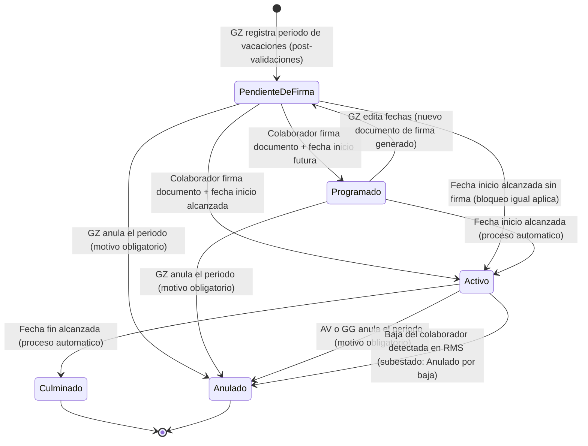

# ESPECIFICACION DE NECESIDADES TECNOLOGICAS
## ENT-MOD-VAC-001 — Modulo de Vacaciones
### Sistema Nova | Organizacion Retail Peruana (Cadena / Lukers)

| Campo | Valor |
|---|---|
| Codigo de documento | ENT-MOD-VAC-001 |
| Version | 1.2 |
| Fecha de emision | 29/05/2026 |
| Fecha de actualizacion | 31/05/2026 |
| Estado | VALIDADO — Vacios VAC-VAC-01 a VAC-VAC-22 resueltos. Reconciliado con reconciliacion-ux.md (C-02 / H-09) |
| Elaborado por | Analista Funcional Senior |
| Sistema | Nova |
| Modulo | Vacaciones |
| Documentos relacionados | ENT-MOD-MARC-001 v1.1, ENT-MOD-DESC-001 v1.3, ENT-MOD-ROLP-001 v1.1, ENT-MOD-ENCA-001 v1.1, ENT-MOD-TRAS-001 v1.1, reconciliacion-ux.md v1.0 (C-02 / H-09) |

### Historial de versiones

| Version | Fecha | Descripcion |
|---|---|---|
| 1.0 | 29/05/2026 | Emision inicial. Especificacion funcional base del modulo Vacaciones. Vacios documentados VAC-VAC-01 a VAC-VAC-22. |
| 1.1 | 29/05/2026 | Vacios VAC-VAC-01 a VAC-VAC-22 resueltos con decisiones del Product Owner y stakeholders. Seccion 10 actualizada con resoluciones. Estado del documento actualizado a VALIDADO. |
| 1.2 | 31/05/2026 | Reconciliacion con el prototipo (reconciliacion-ux.md). C-02 / H-03: se explicita que Vacaciones forma parte del MOTOR ÚNICO de ausencias programadas que comparte con Descansos y Licencias, con validacion de NO-CRUCE transversal bidireccional (nueva regla RN-VAC-09B; refuerzo de RN-VAC-09 y RN-VAC-10). C-02 / H-09: se confirma y explicita que la anulacion de un periodo ACTIVO requiere autorizacion de AV o GG (refuerzo de RN-VAC-24 y CU-VAC-05; sin cambio de comportamiento, queda explicito). |

---

## INDICE

1. Introduccion y Objetivo del Modulo
2. Alcance y Exclusiones
3. Actores y Roles
4. Casos de Uso Principales
5. Reglas de Negocio
6. Estados y Transiciones
7. Entidades y Atributos Principales
8. Permisos por Rol
9. Integraciones
10. Vacios Funcionales y Preguntas Abiertas

---

## 1. INTRODUCCION Y OBJETIVO DEL MODULO

### 1.1 Contexto del negocio

Nova es un sistema de gestion desarrollado desde cero para una organizacion retail peruana con aproximadamente 100 tiendas distribuidas en multiples zonas geograficas. El grupo empresarial opera bajo dos cadenas comerciales: **Cadena** y **Lukers**. La semana laboral del sistema se define de **domingo a sabado** y es consistente con todos los modulos del sistema.

El personal de tienda acumula dias de descanso vacacional conforme a la legislacion laboral peruana y a las politicas internas del grupo. La gestion de este beneficio involucra tres categorias de dias: dias pendientes (dias acumulados y disponibles para goce), dias indemnizables (dias acumulados no gozados que se convierten en una obligacion economica para la empresa) y dias truncos (dias acumulados en el periodo actual en curso, no cumplido el año).

La ausencia de un mecanismo centralizado impide al Gerente Zonal tomar decisiones oportunas sobre la programacion de vacaciones, controlar el riesgo legal derivado de dias indemnizables y garantizar la operatividad minima de la tienda durante el periodo vacacional del personal.

### 1.2 Problema que resuelve

La organizacion carece de una herramienta que permita:

- Visualizar de forma consolidada el estado vacacional de cada colaborador de tienda (dias pendientes, indemnizables, truncos) en tiempo real desde OFIPLAN.
- Identificar de forma proactiva a los colaboradores cuya situacion vacacional representa un riesgo legal o economico para la empresa (dias indemnizables o dias proximos a convertirse en indemnizables).
- Registrar periodos de vacaciones de forma controlada, con validaciones automaticas que eviten conflictos con traslados y descansos activos y que garanticen la dotacion minima operativa de la tienda.
- Reflejar el estado vacacional del colaborador en los sistemas de marcacion, planificacion y nomina de forma automatica y trazable.
- Emitir el documento de vacaciones al colaborador mediante firma electronica antes del inicio del periodo.

### 1.3 Objetivo del modulo

Proveer el registro, control y seguimiento de los periodos de vacaciones del personal de tienda en Nova, permitiendo:

- Visualizar el listado de personal activo con su estado vacacional actualizado en tiempo real desde OFIPLAN via BOT.
- Generar sugerencias automaticas de salida de vacaciones basadas en reglas de negocio parametrizables, considerando dias indemnizables, dias proximos a vencer y dotacion minima de la tienda.
- Registrar el periodo de vacaciones del colaborador con validaciones bidireccionales contra los modulos de Traslados y Descansos (bloqueo duro).
- Gestionar el flujo de firma electronica del documento de vacaciones a traves del servicio propio de Firma Electronica Nova.
- Reflejar el estado "Vacaciones" en RMS via API y migrar el periodo a OFIPLAN via BOT en tiempos parametrizables.
- Bloquear la marcacion de asistencia del colaborador durante el periodo vacacional, en consistencia con el comportamiento del modulo de Marcaciones.
- Reflejar el periodo vacacional en el calendario del modulo de Rol de Personal.
- Auditar todas las acciones sobre vacaciones con trazabilidad completa.

### 1.4 Relacion con otros modulos

- **Modulo de Marcaciones (ENT-MOD-MARC-001):** El colaborador en vacaciones no puede marcar asistencia. El modulo de Vacaciones notifica a Marcaciones el bloqueo de marcacion al inicio del periodo y el levantamiento al termino. El comportamiento es equivalente al de un descanso programado en el modulo de Marcaciones.
- **Modulo de Descansos (ENT-MOD-DESC-001) — Motor unico de ausencias (C-02 / H-03):** Descansos, Licencias y Vacaciones comparten un MOTOR/CALENDARIO ÚNICO de "ausencias programadas" con una sola fuente de verdad. Validacion de NO-CRUCE transversal bidireccional y bloqueo duro: al registrar vacaciones, el sistema verifica que no existan descansos, compensaciones o licencias (de cualquier tipo) activas o en aprobacion que se solapen con el periodo; al registrar un descanso o licencia, el modulo de Descansos verifica en Vacaciones si hay un periodo registrado en esas fechas. La regla es la misma materializada en ambos extremos (RN-VAC-09, RN-VAC-09B y RN-DESC-67).
- **Modulo de Traslados (ENT-MOD-TRAS-001):** Validacion bidireccional y bloqueo duro. Al registrar vacaciones, el sistema verifica que no exista un traslado activo o programado que se solape con el periodo vacacional. Al registrar un traslado, el modulo de Traslados verifica en Vacaciones si hay un periodo registrado en esas fechas.
- **Modulo de Rol de Personal (ENT-MOD-ROLP-001):** El periodo de vacaciones se refleja en el calendario semanal del Rol de Personal, mostrando al colaborador con estado "Vacaciones" en los dias correspondientes. El colaborador en vacaciones no es considerado disponible para programacion.
- **Modulo de Encargatura (ENT-MOD-ENCA-001):** La tabla de equipos de tienda, que define el minimo de asesores activos requeridos, es consultada por el modulo de Vacaciones para la regla de dotacion minima, de forma consistente con Descansos.
- **RMS (API externa):** El estado del colaborador se actualiza en RMS al confirmar el registro de vacaciones y al finalizar el periodo.
- **OFIPLAN (BOT):** Fuente de datos de dias de vacaciones (pendientes, indemnizables, truncos) consultada en tiempo real via BOT. Receptor de la migracion del periodo de vacaciones registrado en Nova, en tiempos parametrizables.
- **Servicio de Firma Electronica Nova:** Gestiona el envio y firma del documento de vacaciones mediante selfie, coordenadas GPS y codigo por correo electronico del colaborador.
- **App Movil Nova:** El colaborador recibe la notificacion y firma el documento de vacaciones desde la app movil Nova. El GZ registra y gestiona los periodos desde el modulo de Gestion de Equipos.

---

## 2. ALCANCE Y EXCLUSIONES

### 2.1 Dentro del alcance

- Visualizacion del listado de personal activo de tienda con estado vacacional (dias pendientes, indemnizables, truncos, totales y mes obligatorio) actualizado desde OFIPLAN.
- Sugerencia automatica de salida de vacaciones basada en reglas parametrizables (dias indemnizables y dias proximos a indemnizarse, dotacion minima de tienda).
- Registro del periodo de vacaciones por parte del GZ, con validaciones bidireccionales contra Traslados y Descansos (bloqueo duro).
- Flujo de firma electronica del documento de vacaciones: notificacion al colaborador, captura de selfie, GPS y codigo por correo, registro de firma.
- Edicion del periodo de vacaciones en estado Pendiente de Firma o Programado (con nueva firma requerida si el periodo estaba firmado).
- Anulacion de vacaciones registradas con motivo obligatorio y autorizacion segun estado del periodo.
- Bloqueo y levantamiento de marcacion de asistencia del colaborador durante el periodo vacacional.
- Reflejo del periodo vacacional en el calendario del Rol de Personal.
- Sincronizacion del estado "Vacaciones" en RMS via API.
- Migracion del periodo de vacaciones a OFIPLAN via BOT en tiempos parametrizables.
- Auditoria completa de todas las acciones (usuario, fecha, hora, accion, resultado).
- Consulta de historial de vacaciones con filtros por colaborador, tienda, estado y rango de fechas.
- Exportacion del historial y del listado principal a Excel segun ambito de rol del usuario.
- Configuracion de parametros del modulo por parte del Administrador del Sistema.
- Vista consolidada por zona para el GZ con metricas de vacaciones (programadas, pendientes, mes obligatorio proximo, saldo indemnizable).
- Alertas automaticas al GZ y Administracion de Ventas por Mes Obligatorio proximo y umbral de dias indemnizables.

### 2.2 Fuera del alcance

- Calculo del saldo de dias de vacaciones. Este calculo es responsabilidad de OFIPLAN; Nova consume el dato via BOT.
- Liquidacion economica de dias vacaciones indemnizables. Pertenece al modulo de Nominas y a OFIPLAN/RRHH.
- Gestion de licencias, permisos o ausencias distintas a vacaciones. Pertenece al modulo de Descansos.
- Generacion del contenido legal del documento de vacaciones. El sistema gestiona el flujo de firma; el contenido juridico es responsabilidad del area de RRHH.
- Vacaciones de personal de oficina o central. Este modulo aplica exclusivamente a personal de tienda.
- Traslados entre empresas (Cadena a Lukers o viceversa). Fuera del alcance de todos los modulos operativos de Nova.
- Alta o baja de colaboradores en RMS. RMS es la fuente de verdad; Nova solo consume.
- Correcciones de periodos de vacaciones en el pasado. Se gestionan directamente en OFIPLAN por RRHH.
- Liquidacion de dias pendientes por cese del colaborador. Es responsabilidad de RRHH/OFIPLAN.

---

## 3. ACTORES Y ROLES

| ID | Actor | Tipo | Descripcion |
|---|---|---|---|
| ACT-01 | Gerente Zonal (GZ) | Usuario principal | Registra, edita y anula periodos de vacaciones del personal de su zona. Accede desde el modulo Gestion de Equipos en la app movil Nova o desde la interfaz web. Por defecto gestiona solo su zona; el acceso fuera de zona es configurable en la tabla de parametros. |
| ACT-02 | Colaborador (Asesor / Personal de Tienda) | Usuario externo | Recibe el documento de vacaciones para firma electronica desde la app movil Nova. No inicia ni modifica el flujo de vacaciones. No recibe notificacion de registro; solo recibe el documento para firma. |
| ACT-03 | Administracion de Ventas (AV) | Usuario supervisor | Consulta y supervisa el estado vacacional de todas las zonas y tiendas. Autoriza la anulacion de periodos en estado Activo. |
| ACT-04 | Gerencia General (GG) | Usuario supervisor | Consulta y supervisa a nivel empresa. Autoriza la anulacion de periodos en estado Activo junto con AV. |
| ACT-05 | Administrador del Sistema | Usuario tecnico | Configura los parametros del modulo: umbrales de sugerencia automatica, minimo de asesores, tiempos de migracion a OFIPLAN, parametros de firma electronica, anticipacion de alertas, minimo de dias por periodo, minimo por fraccion, umbral de dias indemnizables para alertas, color de alerta para Mes Obligatorio. |
| ACT-06 | Sistema Nova (automatico) | Sistema | Ejecuta sugerencias automaticas, bloqueos y levantamientos de marcacion, activacion automatica del periodo al llegar la fecha inicio, cierre automatico al llegar la fecha fin, anulacion por baja detectada en RMS, sincronizacion con RMS y migracion a OFIPLAN. |
| ACT-07 | Servicio de Firma Electronica Nova | Sistema interno | Gestiona el envio del documento de vacaciones, la captura de selfie, coordenadas GPS y codigo por correo, y el registro de la firma del colaborador. |

---

## 4. CASOS DE USO PRINCIPALES

---

### CU-VAC-01: Consultar listado de vacaciones del personal

```
ID: CU-VAC-01
Actor principal: Gerente Zonal (GZ)
Actores secundarios: Administracion de Ventas (ACT-03), Gerencia General (ACT-04)
Relacionado: RN-VAC-01, RN-VAC-02, RN-VAC-03, RN-VAC-04, RN-VAC-05

Precondicion:
- El usuario esta autenticado en Nova (app movil o interfaz web segun rol).
- El usuario tiene permisos de consulta sobre el modulo de Vacaciones.

Flujo principal:
1. El usuario accede al modulo de Vacaciones desde Gestion de Equipos (GZ) o desde el modulo
   central de supervision (AV / GG).
2. El sistema presenta el listado de personal activo de tienda con los siguientes campos por
   colaborador (RN-VAC-01, RN-VAC-02):
   - Tienda
   - Cargo
   - Nombre del colaborador
   - Dias Indemnizables
   - Dias Pendientes
   - Dias Truncos (informativo; no disponible para programar)
   - Dias Totales (suma de Indemnizables + Pendientes + Truncos; informativo)
   - Mes Obligatorio (resaltado con color de alerta parametrizable cuando el mes esta proximo
     o ya llego)
3. Los datos de dias son consumidos desde OFIPLAN via BOT y se muestran actualizados en tiempo
   real (RN-VAC-03). OFIPLAN es la fuente de verdad para todos los saldos.
4. Solo se muestran colaboradores con estado activo en RMS. Los colaboradores cesados no
   aparecen en el listado (RN-VAC-04).
5. El GZ visualiza unicamente el personal de las tiendas asignadas a su zona (por defecto).
   El acceso fuera de zona es configurable en la tabla de parametros (RN-VAC-05). AV y GG
   visualizan el personal de todas las zonas y tiendas.
6. El usuario puede aplicar filtros sobre el listado:
   - Tienda
   - Cargo
   - Empresa (Cadena / Lukers)
   - Zona (disponible para AV y GG)
   - Con dias indemnizables (si/no)
   - Mes obligatorio (mes seleccionado)
7. El usuario puede ordenar el listado por cualquier columna.
8. El usuario puede seleccionar un colaborador para ver el detalle de su situacion vacacional e
   iniciar la gestion de salida de vacaciones.
9. El GZ puede acceder a la vista consolidada de zona con metricas agregadas.
10. El usuario puede exportar el listado principal a Excel segun ambito de rol.

Flujos alternos:
A1 — OFIPLAN no disponible o BOT con fallo:
  A1.1. El sistema muestra una alerta indicando que los datos de dias de vacaciones no estan
        disponibles en tiempo real y presenta los ultimos datos sincronizados con marca de
        timestamp de la ultima actualizacion exitosa.
  A1.2. El sistema continua operativo para el registro de vacaciones con los datos disponibles.
  A1.3. El sistema registra el fallo de conexion en el log de auditoria.

Excepciones:
E1 — El GZ intenta acceder a datos de una tienda fuera de su zona sin permiso configurado:
  El sistema filtra automaticamente los resultados a la zona del GZ. No se muestran
  colaboradores de otras zonas.

Postcondicion:
- El usuario ha visualizado el listado de personal activo con estado vacacional actualizado.
- El listado es el punto de entrada para la gestion de salida de vacaciones (CU-VAC-02) y para
  la sugerencia automatica (CU-VAC-03).
```

---

### CU-VAC-02: Registrar salida de vacaciones

```
ID: CU-VAC-02
Actor principal: Gerente Zonal (GZ)
Actores secundarios: Sistema Nova (ACT-06), Servicio de Firma Electronica Nova (ACT-07),
                     Modulo de Descansos, Modulo de Traslados, RMS, OFIPLAN
Relacionado: RN-VAC-06, RN-VAC-07, RN-VAC-08, RN-VAC-09, RN-VAC-10, RN-VAC-11,
             RN-VAC-12, RN-VAC-13, RN-VAC-14, RN-VAC-15, RN-VAC-16

Precondicion:
- El GZ esta autenticado en Nova.
- El colaborador pertenece a una tienda de la zona del GZ (o zona habilitada por parametro).
- El colaborador es personal de tienda activo (estado activo en RMS validado en tiempo real).
- No existe un periodo de vacaciones en estado Pendiente de Firma, Programado o Activo para
  el mismo colaborador.

Flujo principal:
1. El GZ selecciona al colaborador desde el listado del modulo de Vacaciones (CU-VAC-01).
2. El sistema muestra el panel de detalle del colaborador con su situacion vacacional actual:
   dias indemnizables, pendientes, truncos y mes obligatorio. El saldo disponible para programar
   es Dias Indemnizables + Dias Pendientes (los truncos son solo informativos).
3. El GZ selecciona la accion "Registrar salida de vacaciones".
4. El GZ ingresa:
   - Fecha inicio del periodo de vacaciones.
   - Fecha fin del periodo de vacaciones.
5. El sistema valida que la fecha inicio no sea anterior a la fecha actual del sistema
   (RN-VAC-06). No se permiten registros retroactivos.
6. El sistema valida que la fecha fin sea estrictamente posterior a la fecha inicio (RN-VAC-07).
7. El sistema calcula el numero de dias del periodo en dias corridos (incluyendo feriados y
   fines de semana) y lo muestra al GZ para confirmacion.
8. El sistema valida que el numero de dias del periodo no sea menor al minimo parametrizado
   (RN-VAC-08B).
9. El sistema valida que el numero de dias del periodo no supere el saldo disponible del
   colaborador (Indemnizables + Pendientes) segun OFIPLAN, ni el tope maximo configurable
   si esta definido (RN-VAC-08).
10. El sistema consulta el modulo de Descansos para verificar que no existan descansos,
    compensaciones o licencias activas o aprobadas del colaborador que se solapen con el rango
    de fechas indicado. Si existe conflicto, el bloqueo es duro (RN-VAC-09).
11. El sistema consulta el modulo de Traslados para verificar que no exista un traslado activo
    o programado del colaborador que se solape con el rango de fechas. Si existe conflicto, el
    bloqueo es duro (RN-VAC-10).
12. El sistema verifica que la tienda no quede con menos del minimo de asesores activos
    requerido segun la tabla de equipos de tienda, considerando el rango completo del periodo
    de vacaciones (RN-VAC-11). El colaborador en vacaciones es contado como no disponible en
    el calculo de dotacion minima. Si la tienda queda por debajo del minimo en alguna fecha del
    rango, el bloqueo es duro.
13. El sistema valida que la anticipacion minima parametrizada se cumpla (por defecto 3 dias
    habiles antes de la fecha inicio) (RN-VAC-06C).
14. El sistema presenta al GZ el resumen del registro para confirmacion: colaborador, tienda,
    cargo, periodo (fecha inicio - fecha fin), numero de dias, y resultado de validaciones.
15. El GZ confirma el registro.
16. El sistema crea el periodo de vacaciones en estado Pendiente de Firma.
17. El sistema envia el documento de vacaciones al colaborador a traves del Servicio de Firma
    Electronica Nova exclusivamente. El colaborador no recibe notificacion de registro; solo
    recibe el documento para firma (RN-VAC-12).
18. El sistema actualiza el estado del colaborador en RMS via API (RN-VAC-13).
19. El sistema registra la accion en el log de auditoria.

Flujos alternos:
A1 — El GZ proviene de una sugerencia automatica (CU-VAC-03):
  A1.1. Los campos de fecha inicio y fecha fin pueden venir pre-completados desde la sugerencia.
  A1.2. El GZ puede modificar las fechas antes de confirmar.
  A1.3. El flujo continua desde el paso 5.

Excepciones:
E1 — Fecha inicio en el pasado (RN-VAC-06):
  El sistema muestra mensaje de error. No se permiten registros retroactivos.

E2 — Fecha fin anterior o igual a fecha inicio (RN-VAC-07):
  El sistema muestra mensaje de error. El GZ debe corregir las fechas.

E3 — Periodo inferior al minimo de dias (RN-VAC-08B):
  El sistema muestra mensaje de error indicando el minimo de dias configurado.

E4 — Periodo excede dias disponibles del colaborador (RN-VAC-08):
  El sistema muestra mensaje de error indicando el saldo disponible (Indemnizables + Pendientes)
  segun OFIPLAN. El GZ debe ajustar el periodo.

E5 — Conflicto con descanso, compensacion o licencia activa (RN-VAC-09):
  El sistema muestra el detalle del conflicto (tipo, fechas). El GZ no puede continuar hasta
  resolver el conflicto en el modulo de Descansos.

E6 — Conflicto con traslado activo o programado (RN-VAC-10):
  El sistema muestra el detalle del conflicto (tipo, tienda destino, fechas). El GZ no puede
  continuar hasta resolver el conflicto en el modulo de Traslados.

E7 — Dotacion minima de tienda insuficiente (RN-VAC-11):
  El sistema muestra el detalle de las fechas en que la tienda quedaria por debajo del minimo
  de asesores e indica el minimo requerido. El GZ debe ajustar el periodo o coordinar el
  traslado temporal de refuerzo antes de registrar las vacaciones.

E8 — Anticipacion minima no cumplida (RN-VAC-06C):
  El sistema muestra mensaje de error indicando la anticipacion minima configurada.

E9 — Colaborador inactivo o cesado en RMS:
  El sistema bloquea el registro. No se puede registrar vacaciones para colaborador inactivo
  o cesado. El sistema valida el estado en RMS en tiempo real antes de permitir el registro.

E10 — RMS no disponible:
  El sistema muestra mensaje de error de integracion y no permite confirmar el registro.

E11 — Fallo en el envio del documento de firma:
  El sistema registra el fallo, mantiene el registro en estado Pendiente de Firma y reintenta el
  envio segun la politica de reintentos configurada. Se notifica al GZ del fallo de envio.

Postcondicion:
- El periodo de vacaciones queda registrado en estado Pendiente de Firma.
- El documento de vacaciones ha sido enviado al colaborador para firma electronica.
- El estado del colaborador ha sido actualizado en RMS.
- La accion queda registrada en el log de auditoria.
```

---

### CU-VAC-02B: Flujo de firma electronica del documento de vacaciones

```
ID: CU-VAC-02B
Actor principal: Colaborador (ACT-02)
Actores secundarios: Servicio de Firma Electronica Nova (ACT-07), Sistema Nova (ACT-06),
                     Modulo de Marcaciones, Modulo de Rol de Personal, OFIPLAN
Relacionado: RN-VAC-12, RN-VAC-14, RN-VAC-15, RN-VAC-16, RN-VAC-17

Precondicion:
- Existe un periodo de vacaciones en estado Pendiente de Firma para el colaborador.
- El colaborador tiene la app movil Nova instalada y puede autenticarse.
- El colaborador ha recibido el documento de firma electronica.

Flujo principal:
1. El colaborador recibe en la app movil Nova el documento de vacaciones pendiente de firma
   (no recibe notificacion de registro previo; solo recibe el documento para firma).
2. El colaborador accede a la seccion de documentos pendientes en la app movil Nova.
3. El sistema muestra el detalle del documento: nombre del colaborador, tienda, periodo de
   vacaciones (fecha inicio - fecha fin), numero de dias.
4. El colaborador inicia el proceso de firma electronica.
5. El Servicio de Firma Electronica Nova solicita:
   a. Captura de selfie.
   b. Captura de coordenadas GPS del dispositivo.
   c. Ingreso del codigo de firma recibido por correo electronico.
6. El colaborador completa los tres elementos.
7. El Servicio de Firma Electronica Nova valida los elementos y registra la firma con marca de
   tiempo, selfie, coordenadas GPS y codigo utilizado.
8. El sistema actualiza el estado del periodo de vacaciones:
   - A Programado si la fecha inicio es futura.
   - A Activo si la fecha inicio ya fue alcanzada (RN-VAC-14).
9. El sistema notifica al modulo de Marcaciones para bloquear la marcacion del colaborador
   durante todo el rango del periodo de vacaciones a partir de la fecha inicio (RN-VAC-15).
10. El sistema notifica al modulo de Rol de Personal para reflejar el estado "Vacaciones" en
    el calendario semanal del colaborador en los dias correspondientes (RN-VAC-16).
11. El sistema encola la migracion del periodo de vacaciones a OFIPLAN via BOT. El descuento
    del saldo en OFIPLAN se realiza cuando el periodo entra en estado Activo (fecha inicio)
    via BOT. Si el periodo se anula antes de iniciar, el saldo no se afecta en OFIPLAN
    (RN-VAC-17).
12. El sistema notifica al GZ que el documento ha sido firmado.
13. El sistema registra la accion en el log de auditoria con todos los elementos de la firma.

Flujos alternos:
A1 — El codigo de firma ha expirado:
  A1.1. El sistema muestra mensaje indicando que el codigo ha expirado.
  A1.2. El colaborador puede solicitar el reenvio del codigo desde la app movil.
  A1.3. El Servicio de Firma Electronica Nova genera un nuevo codigo y lo envia al correo.

A2 — GPS del dispositivo no disponible:
  A2.1. El sistema muestra mensaje indicando que las coordenadas GPS son requeridas.
  A2.2. El colaborador debe activar el GPS para continuar.

Excepciones:
E1 — El colaborador supera el numero maximo de intentos fallidos de firma (N parametrizable):
  El sistema bloquea el proceso de firma y notifica al GZ. El Administrador del Sistema puede
  desbloquear el proceso o generar un nuevo envio del documento.

E2 — Servicio de Firma Electronica no disponible:
  El sistema muestra mensaje de error. El periodo de vacaciones permanece en Pendiente de Firma.
  El sistema reintenta la conexion segun politica configurada.

E3 — El colaborador no firma antes de la fecha inicio del periodo:
  El sistema aplica bloqueo de marcacion desde el inicio del periodo sin firma. No existe periodo
  de gracia. Se envia alerta al colaborador (X dias antes, parametrizable) y al GZ y
  Administracion de Ventas (Y dias antes, parametrizable). Al llegar la fecha sin firma: bloqueo
  activo + notificacion al GZ y AV. El GZ puede desbloquear manualmente con motivo obligatorio.

Postcondicion:
- La firma electronica queda registrada con selfie, coordenadas GPS, codigo, marca de tiempo e
  ID del periodo de vacaciones.
- El periodo pasa a estado Programado o Activo segun la fecha inicio.
- La marcacion del colaborador queda bloqueada para el rango del periodo a partir de la fecha
  inicio.
- El periodo aparece en el calendario del Rol de Personal.
- La migracion a OFIPLAN ha sido encolada para ejecucion en la fecha inicio.
- El GZ ha sido notificado de la firma.
```

---

### CU-VAC-03: Sugerencia automatica de vacaciones

```
ID: CU-VAC-03
Actor principal: Gerente Zonal (GZ)
Actores secundarios: Sistema Nova (ACT-06)
Relacionado: RN-VAC-18, RN-VAC-19, RN-VAC-20, RN-VAC-21, RN-VAC-11

Precondicion:
- El GZ esta autenticado en Nova.
- Existe personal en el listado de vacaciones de la zona del GZ.
- Los datos de dias de OFIPLAN estan disponibles.

Flujo principal:
1. El GZ accede al modulo de Vacaciones y selecciona la accion "Sugerencia automatica" o
   accede al panel de sugerencias del sistema.
2. El sistema ejecuta el algoritmo de sugerencia con las siguientes reglas (RN-VAC-18,
   RN-VAC-19, RN-VAC-20):
   a. Incluye a los colaboradores con dias indemnizables (Dias Indemnizables > 0).
   b. Incluye a los colaboradores cuyos dias pendientes esten a 3 meses o menos de convertirse
      en indemnizables (Mes Obligatorio es el mes en curso o los 3 meses siguientes).
      El umbral en meses es parametrizable.
   c. Excluye a los colaboradores que ya tienen un periodo de vacaciones en estado Pendiente de
      Firma, Programado o Activo.
   d. No genera sugerencia si la tienda queda con menos del minimo de asesores activos segun
      la tabla de equipos de tienda, evaluando el periodo propuesto (RN-VAC-11, RN-VAC-21).
3. Para cada colaborador elegible, el sistema genera una sugerencia de periodo de vacaciones
   (fecha inicio sugerida y fecha fin sugerida) priorizando los colaboradores con mayor
   urgencia (dias indemnizables primero, luego dias proximos a vencer).
4. El sistema presenta la lista de sugerencias al GZ con los siguientes datos por sugerencia:
   - Nombre del colaborador
   - Tienda
   - Cargo
   - Dias Indemnizables
   - Dias Pendientes
   - Mes Obligatorio
   - Fecha inicio sugerida
   - Fecha fin sugerida
   - Motivo de la sugerencia (Indemnizable / Proximo a vencer)
5. El GZ puede:
   a. Aceptar la sugerencia tal cual: el sistema precarga los datos en el formulario de registro
      (CU-VAC-02) para que el GZ confirme.
   b. Modificar las fechas de la sugerencia antes de registrar.
   c. Descartar la sugerencia de un colaborador especifico.
   d. Descartar todas las sugerencias.

Flujos alternos:
A1 — No existen colaboradores elegibles para sugerencia:
  El sistema muestra mensaje informativo indicando que no hay colaboradores con dias
  indemnizables ni con dias proximos a convertirse en indemnizables en la zona del GZ.

A2 — Todos los colaboradores elegibles tienen conflicto de dotacion minima:
  El sistema muestra los colaboradores elegibles pero indica para cada uno que la tienda
  quedaria por debajo del minimo requerido con el periodo sugerido. El GZ puede ajustar
  manualmente las fechas o coordinar refuerzos antes de registrar.

Excepciones:
E1 — OFIPLAN no disponible:
  El sistema no puede ejecutar el algoritmo de sugerencia sin datos actualizados de dias.
  Se muestra mensaje de error indicando la indisponibilidad y se sugiere reintentar.

Postcondicion:
- El GZ ha recibido la lista de sugerencias de salida de vacaciones.
- Si el GZ acepta una sugerencia, el sistema precarga el formulario de registro (CU-VAC-02)
  con los datos de la sugerencia aceptada.
- Las sugerencias descartadas no generan ningun registro en el sistema.
```

---

### CU-VAC-04: Editar periodo de vacaciones

```
ID: CU-VAC-04
Actor principal: Gerente Zonal (GZ)
Actores secundarios: Sistema Nova (ACT-06), Servicio de Firma Electronica Nova (ACT-07)
Relacionado: RN-VAC-22, RN-VAC-23, RN-VAC-06, RN-VAC-07, RN-VAC-08, RN-VAC-09,
             RN-VAC-10, RN-VAC-11

Precondicion:
- El GZ esta autenticado en Nova.
- Existe un periodo de vacaciones en estado Pendiente de Firma o Programado perteneciente a
  un colaborador de la zona del GZ.

Flujo principal:
1. El GZ accede al historial o al panel de vacaciones del colaborador y selecciona el periodo
   que desea editar.
2. El sistema verifica que el periodo este en estado Pendiente de Firma o Programado
   (RN-VAC-22). Si el periodo esta en estado Activo, Culminado o Anulado, la edicion es
   bloqueada.
3. El GZ modifica la fecha inicio y/o la fecha fin del periodo.
4. El sistema re-ejecuta todas las validaciones del flujo de registro:
   - Fecha inicio no en pasado (RN-VAC-06).
   - Fecha fin posterior a fecha inicio (RN-VAC-07).
   - Dias del nuevo periodo no exceden dias disponibles (RN-VAC-08).
   - Sin conflictos con Descansos (RN-VAC-09).
   - Sin conflictos con Traslados (RN-VAC-10).
   - Dotacion minima de tienda satisfecha en el nuevo rango (RN-VAC-11).
5. Si todas las validaciones pasan, el sistema actualiza el periodo de vacaciones con las
   nuevas fechas.
6. Si el periodo estaba en estado Pendiente de Firma:
   a. El sistema invalida el documento de firma anterior.
   b. El sistema genera y envia un nuevo documento de vacaciones al colaborador con las fechas
      actualizadas (RN-VAC-23).
   c. El estado del periodo permanece en Pendiente de Firma.
   d. Con las mismas reglas de bloqueo de marcacion sin firma (sin periodo de gracia).
7. Si el periodo estaba en estado Programado (firma ya completada) y se modifica la fecha:
   a. El sistema invalida el documento de firma anterior.
   b. El sistema genera y envia un nuevo documento de vacaciones al colaborador con las fechas
      actualizadas (RN-VAC-23B). El periodo pasa a estado Pendiente de Firma hasta nueva firma.
   c. Sin nueva firma el periodo queda en Pendiente de Firma con las mismas reglas de bloqueo.
   d. Al firmarse el nuevo documento: el sistema actualiza el calendario del Rol de Personal,
      la instruccion de bloqueo de marcacion, el estado en RMS via API y encola nueva migracion
      a OFIPLAN.
8. El sistema registra la accion de edicion en el log de auditoria con los valores anteriores y
   nuevos de las fechas.

Excepciones:
E1 — El periodo esta en estado Activo, Culminado o Anulado (RN-VAC-22):
  El sistema muestra mensaje indicando que el periodo no puede editarse en su estado actual.

E2 — Cualquier validacion de fechas, dias o conflictos falla:
  El sistema muestra el detalle del error. El GZ debe corregir o resolver el conflicto antes de
  guardar los cambios.

Postcondicion:
- El periodo de vacaciones queda actualizado con las nuevas fechas en estado Pendiente de Firma.
- Se ha enviado un nuevo documento de firma al colaborador (independientemente del estado previo).
- La edicion queda registrada en el log de auditoria.
```

---

### CU-VAC-05: Anular periodo de vacaciones

```
ID: CU-VAC-05
Actor principal: Gerente Zonal (GZ) / Administracion de Ventas (AV) / Gerencia General (GG)
Actores secundarios: Sistema Nova (ACT-06), Modulo de Marcaciones, Modulo de Rol de Personal,
                     RMS
Relacionado: RN-VAC-24, RN-VAC-25, RN-VAC-26

Precondicion:
- El usuario esta autenticado en Nova con rol que permite anulacion.
- Existe un periodo de vacaciones en estado Pendiente de Firma, Programado o Activo.
- Si el estado es Activo, la anulacion requiere autorizacion de Administracion de Ventas o
  Gerencia General.

Flujo principal:
1. El GZ accede al historial o al panel de vacaciones del colaborador y selecciona el periodo
   que desea anular.
2. El sistema verifica que el periodo este en un estado anulable: Pendiente de Firma,
   Programado o Activo (RN-VAC-24).
3. Si el periodo esta en estado Activo, el sistema EXIGE autorizacion de Administracion de
   Ventas (AV) o Gerencia General (GG) (C-02 / H-09, RN-VAC-24): el usuario que ejecuta la
   anulacion debe ser AV o GG, o el GZ debe contar con autorizacion registrada de AV o GG. El
   GZ por si solo no puede anular un periodo activo. El mecanismo operativo del flujo de
   autorizacion (delegacion, registro) se orquesta via el modulo transversal de Aprobaciones;
   el detalle tecnico queda a cargo del Arquitecto.
4. El usuario ingresa obligatoriamente el motivo de anulacion.
5. El sistema presenta un mensaje de confirmacion.
6. El usuario confirma la anulacion.
7. El sistema actualiza el estado del periodo a Anulado, registrando el motivo, el usuario y la
   fecha y hora de la anulacion.
8. El sistema instruye al modulo de Marcaciones revertir el bloqueo de marcacion aplicado al
   colaborador por el periodo de vacaciones (RN-VAC-25):
   - Si el periodo estaba en Pendiente de Firma: no habia bloqueo activo aun; no se requiere
     reversion.
   - Si el periodo estaba en Programado o Activo: el bloqueo se revierte inmediatamente.
9. El sistema notifica al modulo de Rol de Personal para eliminar el estado "Vacaciones" del
   calendario del colaborador en los dias del periodo anulado.
10. El sistema actualiza el estado del colaborador en RMS via API (RN-VAC-26).
11. El sistema notifica al colaborador de la anulacion (push y correo electronico).
12. El sistema notifica al GZ y a Administracion de Ventas de la anulacion.
13. El sistema registra la accion completa en el log de auditoria.

Flujos alternos:
A1 — El periodo ya fue parcialmente ejecutado (estado Activo con dias ya transcurridos):
  A1.1. AV o GG anula el periodo incluso si ya esta en curso (con motivo obligatorio).
  A1.2. El sistema anula el periodo completo. El saldo en OFIPLAN no se revierte automaticamente
        desde Nova; la correccion es responsabilidad de RRHH/OFIPLAN.
  A1.3. Se aplica el comportamiento de reversion de marcaciones y calendario descrito en los
        pasos 8 y 9.
  A1.4. El sistema notifica al GZ y a Administracion de Ventas.

Excepciones:
E1 — El periodo esta en estado Culminado o ya Anulado (RN-VAC-24):
  El sistema muestra mensaje indicando que el periodo no puede anularse en su estado actual.

E2 — El periodo no pertenece a la zona del GZ:
  El sistema muestra mensaje de acceso denegado.

E3 — Anulacion de periodo Activo sin autorizacion de AV o GG:
  El sistema bloquea la accion y muestra mensaje indicando que la anulacion de un periodo activo
  requiere autorizacion de Administracion de Ventas o Gerencia General.

E4 — RMS no disponible al actualizar estado:
  El sistema actualiza el estado en Nova a Anulado, encola el reintento de sincronizacion con
  RMS y notifica al GZ del fallo temporal de sincronizacion.

Postcondicion:
- El periodo de vacaciones queda en estado Anulado con motivo, usuario y timestamp registrados.
- El sistema ha revertido el estado en RMS.
- Los efectos sobre Marcaciones y Rol de Personal han sido revertidos.
- El colaborador, el GZ y Administracion de Ventas han sido notificados.
- La accion queda registrada en el log de auditoria.
```

---

### CU-VAC-06: Consultar historial de vacaciones

```
ID: CU-VAC-06
Actor principal: Gerente Zonal (GZ), Administracion de Ventas (ACT-03), Gerencia General (ACT-04)
Actores secundarios: ninguno
Relacionado: RN-VAC-27, RN-VAC-28, RN-VAC-05

Precondicion:
- El usuario esta autenticado en Nova.
- El usuario tiene permisos de consulta sobre el modulo de Vacaciones.

Flujo principal:
1. El usuario accede a la seccion de historial de vacaciones.
2. El sistema muestra una lista paginada de periodos de vacaciones con los siguientes filtros:
   - Colaborador (nombre o codigo).
   - Tienda.
   - Cargo.
   - Empresa (Cadena / Lukers).
   - Estado del periodo (Pendiente de Firma, Programado, Activo, Culminado, Anulado).
   - Rango de fechas (fecha inicio del periodo).
   - Zona (disponible para AV y GG).
3. El usuario aplica los filtros deseados.
4. El sistema muestra los resultados con los campos: ID periodo, colaborador, tienda, cargo,
   fecha inicio, fecha fin, numero de dias, estado, fecha de registro, registrado por.
5. El usuario selecciona un periodo para ver su detalle completo: datos de firma electronica
   (si aplica), log de auditoria de acciones, motivo de anulacion (si aplica).
6. El usuario puede exportar el listado filtrado a Excel (RN-VAC-27). El GZ exporta su zona,
   Administracion de Ventas y GG exportan sin restriccion de zona.

Excepciones:
E1 — El GZ intenta consultar periodos fuera de su zona:
  El sistema filtra automaticamente los resultados a la zona del GZ.

Postcondicion:
- El usuario ha podido consultar el historial de periodos de vacaciones segun sus permisos
  de ambito.
```

---

### CU-VAC-07: Vista consolidada por zona (GZ)

```
ID: CU-VAC-07
Actor principal: Gerente Zonal (GZ)
Actores secundarios: ninguno
Relacionado: RN-VAC-31

Precondicion:
- El GZ esta autenticado en Nova.

Flujo principal:
1. El GZ accede a la vista consolidada de su zona desde el modulo de Vacaciones.
2. El sistema muestra las siguientes metricas por zona y desglosadas por tienda:
   - Total de colaboradores con vacaciones programadas (estado Programado o Activo).
   - Total de colaboradores pendientes de programar (sin periodo activo o programado).
   - Total de colaboradores con Mes Obligatorio proximo o vencido.
   - Total de colaboradores con saldo de dias indemnizables (Indemnizables > 0).
3. El GZ puede exportar la vista consolidada a Excel.

Postcondicion:
- El GZ ha visualizado el resumen de estado vacacional de su zona.
```

---

## 5. REGLAS DE NEGOCIO

### 5.1 Visualizacion del listado

| ID | Regla | Criterio de verificacion |
|---|---|---|
| RN-VAC-01 | El listado de vacaciones muestra unicamente colaboradores con estado activo en RMS. Los colaboradores con estado cesado, suspendido o inactivo no aparecen en el listado. | El sistema consulta el estado del colaborador en RMS. Si el estado no es activo, el colaborador no se incluye en el listado del modulo de Vacaciones. |
| RN-VAC-02 | Los campos mostrados por colaborador en el listado son: Tienda, Cargo, Nombre, Dias Indemnizables, Dias Pendientes, Dias Truncos (informativo), Dias Totales (informativo: suma de los tres) y Mes Obligatorio. El saldo disponible para programar vacaciones es Dias Indemnizables + Dias Pendientes; los dias truncos no forman parte del saldo programable. | El sistema muestra los truncos como campo informativo con etiqueta clara. El campo Dias Totales suma los tres componentes. La validacion de saldo para registro usa exclusivamente Indemnizables + Pendientes. |
| RN-VAC-03 | Los datos de dias de vacaciones (Indemnizables, Pendientes, Truncos) provienen exclusivamente de OFIPLAN y se obtienen via BOT en tiempo real. Nova no calcula ni mantiene estos saldos. OFIPLAN es la fuente de verdad. | Ante cualquier discrepancia de saldo, la fuente de verdad es OFIPLAN. El sistema indica la fecha y hora de la ultima sincronizacion exitosa junto a los datos. |
| RN-VAC-04 | Solo se muestran colaboradores activos (no cesados) en el listado. | Al sincronizar con RMS, el sistema aplica un filtro de estado activo antes de construir el listado. |
| RN-VAC-05 | El GZ gestiona por defecto solo el personal de las tiendas asignadas a su zona. El acceso fuera de zona es configurable en la tabla de parametros del sistema. AV y GG visualizan el personal de todas las zonas sin restriccion. | El sistema aplica el filtro de zona sobre el GZ en todas las consultas. El acceso fuera de zona queda registrado en el log de auditoria. |

### 5.2 Campo Mes Obligatorio

| ID | Regla | Criterio de verificacion |
|---|---|---|
| RN-VAC-06B | El campo Mes Obligatorio indica el mes a partir del cual debe programarse la salida de vacaciones del colaborador para el periodo anual vigente. Se calcula como: mes del aniversario laboral retrocedido 3 meses. Ejemplo: aniversario en octubre = Mes Obligatorio julio. | El sistema obtiene la fecha de ingreso de RMS y calcula el proximo aniversario. El campo se muestra como nombre de mes y anio (ej: "Julio 2026"). |
| RN-VAC-06C | El campo Mes Obligatorio se resalta con el color de alerta definido en la tabla de parametros cuando el mes esta proximo o ya llego. El color de alerta es parametrizable por el Administrador del Sistema. | El sistema compara el Mes Obligatorio con el mes actual. Si el mes ya llego o es el siguiente segun el umbral configurado, aplica el color de alerta parametrizado. |

### 5.3 Validaciones del periodo de vacaciones

| ID | Regla | Criterio de verificacion |
|---|---|---|
| RN-VAC-06 | La fecha inicio del periodo de vacaciones no puede ser anterior a la fecha actual del sistema. No se permiten registros retroactivos en Nova. Las correcciones de periodos pasados se gestionan directamente en OFIPLAN por RRHH. | El sistema compara la fecha inicio con la fecha actual. Si es anterior, bloquea el registro con mensaje de error. |
| RN-VAC-06C | La fecha inicio del periodo debe cumplir con la anticipacion minima configurada en parametros (por defecto: 3 dias habiles antes de la fecha inicio). El valor es parametrizable. | El sistema calcula la anticipacion en dias habiles entre la fecha actual y la fecha inicio. Si es menor al minimo configurado, bloquea el registro. |
| RN-VAC-07 | La fecha fin del periodo de vacaciones debe ser estrictamente posterior a la fecha inicio. | El sistema valida que fecha_fin > fecha_inicio. Si no se cumple, muestra error y bloquea. |
| RN-VAC-08 | El numero de dias del periodo de vacaciones no puede superar el saldo disponible del colaborador (Dias Indemnizables + Dias Pendientes) segun OFIPLAN. Los dias truncos no se consideran disponibles para programar. Existe un tope maximo adicional configurable en parametros. | El sistema calcula dias corridos del periodo (incluyendo feriados y fines de semana) y compara contra el saldo disponible y el tope maximo si esta definido. Si supera alguno, bloquea el registro. |
| RN-VAC-08B | El numero de dias del periodo de vacaciones no puede ser menor al minimo configurado en parametros. | El sistema valida que el numero de dias del periodo sea mayor o igual al minimo parametrizado. Si no se cumple, bloquea el registro con mensaje indicando el minimo. |
| RN-VAC-08C | El periodo de vacaciones se calcula en dias corridos incluyendo feriados y fines de semana. Los feriados dentro del periodo vacacional se cuentan como dias de vacaciones y no se excluyen del saldo. | El sistema calcula (fecha_fin - fecha_inicio + 1) en dias calendario sin excluir feriados ni fines de semana. |
| RN-VAC-15B | Un colaborador solo puede tener un periodo de vacaciones activo o programado a la vez. No se permite registrar un nuevo periodo si ya existe uno en estado Pendiente de Firma, Programado o Activo. | El sistema verifica la existencia de periodos en los estados indicados antes de permitir el registro. |
| RN-VAC-17B | El sistema valida el estado activo del colaborador en RMS en tiempo real antes de permitir el registro de vacaciones. No se puede registrar vacaciones para un colaborador inactivo o cesado. | El sistema llama a la API de RMS al iniciar el flujo de registro. Si el estado no es activo, bloquea el registro con mensaje de error. |

### 5.4 Validaciones de conflicto con otros modulos (bloqueo duro)

| ID | Regla | Criterio de verificacion |
|---|---|---|
| RN-VAC-09 | No se puede registrar un periodo de vacaciones si el colaborador tiene algun registro activo o en aprobacion en el modulo de Descansos que se solape con el rango de fechas del periodo: descanso laboral, compensacion, cobertura, descanso medico o licencia de cualquier tipo (incluye estados Programado, En ejecucion, Modificado, Pendiente de aprobacion y En validacion Bienestar). El bloqueo es duro. | El sistema consulta el modulo de Descansos. Si existe conflicto, bloquea el registro con detalle del tipo y fechas. |
| RN-VAC-09B | Motor unico de ausencias y no-cruce transversal (C-02 / H-03): Vacaciones forma parte del motor/calendario unico de "ausencias programadas" que comparte con Descansos y Licencias. La validacion de no-cruce es transversal y bidireccional: ninguna ausencia (descanso, compensacion, licencia o vacaciones) puede solaparse con otra para el mismo colaborador. Esta regla es la misma que RN-DESC-67 del modulo de Descansos, materializada desde el lado de Vacaciones. El bloqueo es duro (no hint) y aplica tanto al registro como a la edicion (CU-VAC-04). | Intentar registrar vacaciones que se solapen con cualquier tipo de ausencia previa y verificar el bloqueo. Intentar registrar una ausencia en Descansos que se solape con vacaciones y verificar el bloqueo desde el otro extremo. |
| RN-VAC-10 | No se puede registrar un periodo de vacaciones si el colaborador tiene un traslado activo o programado que se solape con el rango de fechas del periodo. El bloqueo es duro. | El sistema consulta el modulo de Traslados. Si existe conflicto, bloquea el registro con detalle. |
| RN-VAC-11 | No se puede registrar un periodo de vacaciones si la tienda queda con menos del minimo de asesores activos requerido en alguna fecha dentro del rango del periodo. El colaborador en vacaciones se cuenta como no disponible en el calculo de dotacion minima en todos los modulos. El minimo se obtiene de la tabla de equipos de tienda. El bloqueo es duro. | El sistema evalua la disponibilidad dia a dia en el rango. Si alguna fecha cae por debajo del minimo, bloquea el registro con detalle de fechas afectadas. |

### 5.5 Firma electronica

| ID | Regla | Criterio de verificacion |
|---|---|---|
| RN-VAC-12 | Todo periodo de vacaciones requiere la firma electronica del documento de vacaciones por parte del colaborador. El colaborador NO recibe notificacion de registro; solo recibe el documento de firma electronica para que lo firme. El documento se envia inmediatamente despues del registro por el GZ. | El sistema no transiciona el periodo a estado Programado o Activo sin firma registrada. La comunicacion al colaborador es exclusivamente el documento de firma. |
| RN-VAC-12B | Si el colaborador no firma antes de la fecha inicio del periodo, el bloqueo de marcacion se aplica igualmente desde el inicio del periodo (sin periodo de gracia). El sistema envia alertas parametrizables: X dias antes al colaborador y Y dias antes al GZ y Administracion de Ventas. Al llegar la fecha inicio sin firma: bloqueo activo + notificacion a GZ y AV. El GZ puede desbloquear manualmente con motivo obligatorio. Los valores X e Y son configurables en la tabla de parametros. | El sistema verifica diariamente los periodos en Pendiente de Firma con fecha inicio proxima. Genera alertas segun los umbrales configurados. Aplica el bloqueo en la fecha inicio sin requerir firma previa. |
| RN-VAC-13 | Al confirmar el registro del periodo de vacaciones (estado Pendiente de Firma), el sistema actualiza el estado del colaborador en RMS via API de forma inmediata. | El sistema llama a la API de RMS al registrar el periodo. Si RMS no esta disponible, bloquea el registro. |
| RN-VAC-14 | Al registrarse la firma del documento de vacaciones, el estado del periodo transiciona: a Activo si la fecha inicio ya fue alcanzada, o a Programado si la fecha inicio es futura. | El sistema compara la fecha de firma con la fecha inicio. Si fecha_firma >= fecha_inicio, estado pasa a Activo. Si fecha_firma < fecha_inicio, estado pasa a Programado. |

### 5.6 Impacto en Marcaciones y Rol de Personal

| ID | Regla | Criterio de verificacion |
|---|---|---|
| RN-VAC-15 | El colaborador en estado de vacaciones no puede marcar asistencia durante el periodo vacacional. Al firmarse el documento de vacaciones, el sistema instruye al modulo de Marcaciones bloquear la marcacion del colaborador para todo el rango del periodo, a partir de la fecha inicio. Si el periodo no fue firmado y llega la fecha inicio, el bloqueo se aplica igualmente (ver RN-VAC-12B). | El modulo de Marcaciones bloquea los intentos de marcacion del colaborador en su tienda durante el rango del periodo. El sistema registra cada intento bloqueado en el log de Marcaciones. |
| RN-VAC-16 | El periodo de vacaciones se refleja en el calendario semanal del modulo de Rol de Personal, mostrando al colaborador con el estado "Vacaciones" en los dias correspondientes. El colaborador en vacaciones no es considerado disponible para programacion semanal en todos los modulos. | Al firmarse el documento (o al activarse el bloqueo sin firma), el sistema notifica al modulo de Rol de Personal. El colaborador no puede ser incluido en la programacion en esos dias. |

### 5.7 Integracion con OFIPLAN

| ID | Regla | Criterio de verificacion |
|---|---|---|
| RN-VAC-17 | La migracion del periodo de vacaciones a OFIPLAN via BOT se ejecuta cuando el periodo entra en estado Activo (fecha inicio). Si el periodo se anula antes de iniciar, el saldo no se afecta en OFIPLAN. La migracion se encola al registrarse la firma y se ejecuta en la fecha inicio. En caso de anulacion antes del inicio, se cancela la migracion encolada. | La migracion se encola al completarse la firma con ejecucion diferida a la fecha inicio. El log registra fecha y resultado de cada ejecucion del BOT. En caso de fallo, reintenta segun politica configurada. |

### 5.8 Sugerencia automatica

| ID | Regla | Criterio de verificacion |
|---|---|---|
| RN-VAC-18 | La sugerencia automatica incluye obligatoriamente a los colaboradores con dias indemnizables (Dias Indemnizables > 0). Estos tienen prioridad maxima en el algoritmo. | El sistema filtra del listado a los colaboradores con Dias Indemnizables > 0. Si existen, aparecen primero en la lista de sugerencias. |
| RN-VAC-19 | La sugerencia automatica incluye a los colaboradores cuyos dias pendientes esten a 3 meses o menos de convertirse en indemnizables. El umbral de 3 meses es parametrizable en la tabla de parametros. | El sistema evalua el campo Mes Obligatorio de cada colaborador. El umbral en meses es configurable por el Administrador del Sistema. |
| RN-VAC-20 | La sugerencia automatica no incluye a colaboradores que ya tienen un periodo de vacaciones registrado en estado Pendiente de Firma, Programado o Activo. | El sistema verifica el estado vacacional actual del colaborador antes de incluirlo en las sugerencias. |
| RN-VAC-21 | La sugerencia automatica no genera una propuesta para un colaborador si con el periodo sugerido la tienda queda con menos del minimo de asesores activos requerido en alguna fecha del rango. El minimo se obtiene de la tabla de equipos de tienda. | El algoritmo simula la ausencia del colaborador y verifica la dotacion minima. Si la tienda quedaria por debajo del minimo, el colaborador no aparece en las sugerencias o aparece con alerta de dotacion insuficiente (comportamiento parametrizable). |

### 5.9 Edicion y anulacion

| ID | Regla | Criterio de verificacion |
|---|---|---|
| RN-VAC-22 | Un periodo de vacaciones solo puede ser editado cuando se encuentra en estado Pendiente de Firma o Programado. Los periodos en estado Activo, Culminado o Anulado no pueden ser editados. | El sistema no presenta la opcion de edicion si el estado del periodo es Activo, Culminado o Anulado. |
| RN-VAC-23 | Si se edita un periodo en estado Pendiente de Firma o en estado Programado, el sistema invalida el documento de firma anterior y genera y envia un nuevo documento con las fechas actualizadas. El periodo pasa a estado Pendiente de Firma hasta que el colaborador firme el nuevo documento. Las mismas reglas de bloqueo sin firma aplican. | El sistema marca el documento anterior como invalidado, genera un nuevo documento y lo envia al colaborador. El periodo pasa a Pendiente de Firma. |
| RN-VAC-23B | La edicion de un periodo firmado (estado Programado) invalida el documento anterior y genera nuevo proceso de firma electronica. Sin nueva firma el periodo queda en Pendiente de Firma con las mismas reglas de bloqueo de marcacion. | El sistema verifica el estado del documento de firma al editar. Si habia firma, invalida y reinicia el proceso. |
| RN-VAC-24 | Solo se pueden anular periodos en estado Pendiente de Firma o Programado por el GZ (con motivo obligatorio). La anulacion de un periodo en estado ACTIVO requiere AUTORIZACION de Administracion de Ventas (AV) o Gerencia General (GG) y motivo obligatorio (C-02 / H-09 — confirmado y explicito): el GZ por si solo NO puede anular un periodo activo; debe ejecutarlo AV/GG o contar con su autorizacion registrada. Los periodos en estado Culminado o Anulado no pueden ser anulados. | El sistema valida el estado del periodo y el rol del usuario antes de mostrar la opcion de anulacion. Bloquea la confirmacion si el campo de motivo esta vacio o si el rol no tiene autorizacion para el estado actual. Verificar que el GZ no pueda anular un periodo Activo sin autorizacion de AV/GG. |
| RN-VAC-25 | Al anular un periodo de vacaciones, el sistema revierte todos los efectos aplicados sobre el modulo de Marcaciones (levanta el bloqueo de marcacion) y sobre el modulo de Rol de Personal (elimina el estado Vacaciones del calendario del colaborador en los dias del periodo). El sistema notifica al colaborador. | El sistema verifica el estado de los efectos aplicados e instruye la reversion a cada modulo. El log de auditoria registra los cambios revertidos. |
| RN-VAC-26 | Al anular un periodo de vacaciones, el sistema actualiza el estado del colaborador en RMS via API. Si RMS no esta disponible, se encola el reintento y se notifica al GZ del fallo temporal. | El sistema llama a la API de RMS con el estado revertido. El log de auditoria registra el resultado de la llamada. |

### 5.10 Consulta, exportacion y auditoria

| ID | Regla | Criterio de verificacion |
|---|---|---|
| RN-VAC-27 | El historial de periodos de vacaciones y el listado principal son exportables a Excel con los filtros aplicados. El GZ exporta unicamente los periodos de su zona. Administracion de Ventas y GG exportan sin restriccion de zona. | La exportacion genera un archivo .xlsx con todos los campos del listado. La accion queda registrada en el log de auditoria. |
| RN-VAC-28 | Toda accion sobre un periodo de vacaciones queda registrada en el log de auditoria con: usuario o proceso que origino el evento, fecha y hora, accion ejecutada, resultado y detalle o mensaje de error si aplica. | El log de auditoria es inmutable. No puede ser eliminado ni modificado por ningun actor. |

### 5.11 Cierre automatico del periodo

| ID | Regla | Criterio de verificacion |
|---|---|---|
| RN-VAC-29 | Al alcanzarse la fecha fin del periodo de vacaciones, el sistema cierra automaticamente el periodo con estado Culminado. El cierre no requiere accion manual. El sistema notifica al modulo de Marcaciones para habilitar la marcacion del colaborador y al Rol de Personal para actualizar el calendario. El sistema actualiza el estado en RMS. | El proceso automatico identifica los periodos cuya fecha_fin ha sido alcanzada y los marca como Culminado, ejecutando las notificaciones e integraciones correspondientes. |

### 5.12 Baja del colaborador durante vacaciones

| ID | Regla | Criterio de verificacion |
|---|---|---|
| RN-VAC-30 | Si se detecta la baja del colaborador en RMS durante un periodo de vacaciones activo, el sistema cierra automaticamente el periodo con estado Anulado por baja. El saldo no es afectado en OFIPLAN desde Nova. La liquidacion de dias pendientes es responsabilidad de RRHH/OFIPLAN fuera del alcance de Nova. Se notifica al GZ y a Administracion de Ventas. El colaborador desaparece del calendario de programacion desde la fecha de baja. | El evento de baja en RMS dispara el proceso automatico. El log de auditoria registra la accion con fuente "RMS - baja detectada". La notificacion a GZ y AV se ejecuta automaticamente. |

### 5.13 Alertas automaticas y umbrales

| ID | Regla | Criterio de verificacion |
|---|---|---|
| RN-VAC-31 | El sistema envia alertas automaticas al GZ y a Administracion de Ventas cuando el Mes Obligatorio de un colaborador esta proximo segun el umbral configurado en parametros. La anticipacion de la alerta es parametrizable. | El sistema evalua diariamente el Mes Obligatorio de cada colaborador activo. Si el mes esta dentro del umbral configurado, genera la notificacion al GZ y a AV. |
| RN-VAC-32 | El sistema envia alertas automaticas al GZ y a Administracion de Ventas cuando un colaborador supera el umbral de dias indemnizables configurado en la tabla de parametros. | El sistema evalua el campo Dias Indemnizables de cada colaborador. Si supera el umbral, genera la notificacion. |

### 5.14 Fraccionamiento de vacaciones

| ID | Regla | Criterio de verificacion |
|---|---|---|
| RN-VAC-33 | Las vacaciones fraccionadas estan permitidas aunque no son el escenario ideal. El colaborador puede tener multiples periodos de vacaciones en distintos momentos del ejercicio, siempre que no exista un periodo en estado Pendiente de Firma, Programado o Activo al momento de registrar el nuevo. | El sistema permite el registro de un nuevo periodo una vez que el anterior ha culminado o sido anulado. |
| RN-VAC-34 | El minimo de dias por fraccion de vacaciones es configurable en la tabla de parametros. El sistema valida el saldo disponible y la dotacion minima de tienda por cada fraccion individualmente. | El sistema aplica el minimo configurado al validar cada periodo fraccionado. La validacion de saldo y dotacion se ejecuta de forma independiente para cada fraccion. |

### 5.15 Ascenso durante vacaciones

| ID | Regla | Criterio de verificacion |
|---|---|---|
| RN-VAC-35 | El ascenso a Senior de un colaborador en vacaciones es independiente del estado de vacaciones. El proceso de aprobacion del ascenso sigue su flujo normal con aprobacion requerida. El ascenso entra en vigor al retornar de vacaciones o en la fecha definida en el proceso de ascenso, lo que ocurra despues de la aprobacion. | El modulo de ascenso no bloquea el flujo por estado de vacaciones del colaborador. La fecha efectiva del ascenso se determina segun las reglas del proceso de ascenso. |

---

## 6. ESTADOS Y TRANSICIONES

### 6.1 Maquina de estados del periodo de vacaciones



### 6.2 Descripcion de estados

| Estado | Descripcion | Quien lo asigna |
|---|---|---|
| Pendiente de Firma | El periodo ha sido registrado y validado por el GZ. El documento de vacaciones ha sido enviado al colaborador para firma. La firma no ha sido completada aun. | Sistema automatico al confirmar el registro del GZ. |
| Programado | El colaborador ha firmado el documento de vacaciones y la fecha inicio es futura. El bloqueo de marcacion y el reflejo en el Rol de Personal estan activos. | Sistema automatico al registrar la firma con fecha inicio futura. |
| Activo | La fecha inicio ha sido alcanzada y el periodo de vacaciones esta en curso. El colaborador no puede marcar asistencia (con o sin firma). | Sistema automatico al alcanzar la fecha inicio (desde Programado o desde Pendiente de Firma). |
| Culminado | El periodo de vacaciones ha concluido al alcanzarse la fecha fin. La marcacion del colaborador ha sido habilitada. | Sistema automatico al alcanzar la fecha fin. |
| Anulado | El periodo fue cancelado, o fue cerrado por baja del colaborador en RMS. Se conserva el registro con motivo, responsable y timestamp. | GZ (Pendiente de Firma o Programado, motivo obligatorio), AV o GG (periodo Activo, motivo obligatorio) o Sistema automatico (baja en RMS). |

### 6.3 Estados del documento de firma electronica

| Estado | Descripcion |
|---|---|
| Pendiente | El documento fue enviado al colaborador y aun no ha sido firmado. |
| Firmado | El colaborador completo el proceso de firma con selfie, GPS y codigo. |
| Expirado | El codigo de firma expiro sin ser utilizado. |
| Bloqueado | El colaborador supero el numero maximo de intentos fallidos. |
| Invalidado | El documento fue reemplazado por una edicion del periodo. |

### 6.4 Notas sobre transiciones

- Un periodo en estado Culminado o Anulado no puede pasar a ningun otro estado.
- Un periodo en estado Activo solo puede ser anulado por Administracion de Ventas o Gerencia General.
- La firma del documento transiciona el periodo desde Pendiente de Firma hacia Programado o Activo. Sin embargo, al alcanzarse la fecha inicio sin firma, el periodo transiciona a Activo igualmente y el bloqueo de marcacion aplica desde esa fecha.
- La edicion de un periodo en estado Programado invalida la firma anterior y lo devuelve a Pendiente de Firma.

---

## 7. ENTIDADES Y ATRIBUTOS PRINCIPALES

### 7.1 Periodo de Vacaciones

| Atributo | Tipo | Obligatorio | Descripcion |
|---|---|---|---|
| id_periodo_vacaciones | UUID | Si | Identificador unico del periodo de vacaciones. |
| id_colaborador | UUID | Si | Referencia al colaborador al que corresponde el periodo. |
| id_tienda | UUID | Si | Tienda del colaborador al momento del registro. |
| id_empresa | Enum | Si | Valores: CADENA, LUKERS. |
| id_zona | UUID | Si | Zona a la que pertenece la tienda al momento del registro. |
| fecha_inicio | Date | Si | Primer dia del periodo de vacaciones. |
| fecha_fin | Date | Si | Ultimo dia del periodo de vacaciones (inclusive). |
| dias_periodo | Integer | Si | Numero de dias corridos del periodo (fecha_fin - fecha_inicio + 1, incluyendo feriados y fines de semana). |
| estado | Enum | Si | Valores: PENDIENTE_FIRMA, PROGRAMADO, ACTIVO, CULMINADO, ANULADO. |
| motivo_anulacion | Text | Condicional | Requerido si el estado es ANULADO. |
| subestado_anulacion | Enum | No | Valores: POR_GZ, POR_AV_GG, POR_BAJA_RMS. Solo aplica cuando estado = ANULADO. |
| id_usuario_registro | UUID | Si | GZ que registro el periodo. |
| fecha_registro | DateTime | Si | Fecha y hora de creacion del registro. |
| id_usuario_anulacion | UUID | Condicional | Usuario que anulo el periodo, si aplica. |
| fecha_anulacion | DateTime | Condicional | Fecha y hora de la anulacion, si aplica. |
| origen_sugerencia | Boolean | Si | Indica si el periodo fue originado desde la sugerencia automatica. Default: false. |
| estado_sincronizacion_rms | Enum | Si | Valores: PENDIENTE, EXITOSA, FALLIDA. |
| fecha_sincronizacion_rms | DateTime | No | Fecha y hora de la ultima sincronizacion con RMS. |
| estado_migracion_ofiplan | Enum | Si | Valores: PENDIENTE, ENCOLADO, EXITOSA, FALLIDA, CANCELADA. |
| fecha_migracion_ofiplan | DateTime | No | Fecha y hora de la ultima ejecucion del BOT para este periodo. |

### 7.2 Documento de Firma Electronica de Vacaciones

| Atributo | Tipo | Obligatorio | Descripcion |
|---|---|---|---|
| id_documento_firma | UUID | Si | Identificador unico del documento de firma. |
| id_periodo_vacaciones | UUID | Si | Periodo al que corresponde el documento. |
| estado_documento | Enum | Si | Valores: PENDIENTE, FIRMADO, EXPIRADO, BLOQUEADO, INVALIDADO. |
| fecha_envio | DateTime | Si | Fecha y hora en que se envio el documento al colaborador. |
| fecha_firma | DateTime | Condicional | Fecha y hora en que el colaborador firmo el documento. |
| selfie_url | String | Condicional | URL segura de la selfie capturada durante la firma. |
| coordenadas_gps | String | Condicional | Latitud y longitud capturadas durante la firma. |
| codigo_firma_hash | String | Si | Hash del codigo de firma enviado por correo (no se almacena en claro). |
| intentos_fallidos | Integer | Si | Contador de intentos de firma fallidos. Default: 0. |
| fecha_expiracion_codigo | DateTime | Si | Fecha y hora en que expira el codigo de firma actual. |
| es_vigente | Boolean | Si | Indica si este documento es el vigente para el periodo. False si fue invalidado por una edicion. |

### 7.3 Snapshot de saldo vacacional al momento del registro

| Atributo | Tipo | Obligatorio | Descripcion |
|---|---|---|---|
| id_snapshot | UUID | Si | Identificador unico del snapshot. |
| id_periodo_vacaciones | UUID | Si | Periodo al que corresponde el snapshot. |
| dias_indemnizables | Integer | Si | Dias indemnizables del colaborador segun OFIPLAN al momento del registro. |
| dias_pendientes | Integer | Si | Dias pendientes segun OFIPLAN al momento del registro. |
| dias_truncos | Integer | Si | Dias truncos segun OFIPLAN al momento del registro (informativo). |
| dias_disponibles | Integer | Si | Saldo disponible para programar: Indemnizables + Pendientes al momento del registro. |
| dias_totales | Integer | Si | Suma de los tres componentes al momento del registro (informativo). |
| fecha_consulta_ofiplan | DateTime | Si | Fecha y hora de la consulta a OFIPLAN que produjo estos valores. |

### 7.4 Log de auditoria del periodo de vacaciones

| Atributo | Tipo | Descripcion |
|---|---|---|
| id_log | UUID | Identificador unico del evento de auditoria. |
| id_periodo_vacaciones | UUID | Periodo al que pertenece el evento. |
| accion | Enum | Valores: REGISTRO, EDICION, ENVIO_DOCUMENTO_FIRMA, FIRMA_DOCUMENTO, ACTIVACION, CULMINACION, ANULACION, BLOQUEO_MARCACION, LEVANTAMIENTO_MARCACION, SINCRONIZACION_RMS, MIGRACION_OFIPLAN, INVALIDACION_DOCUMENTO, REENVIO_DOCUMENTO, DESBLOQUEO_MANUAL_GZ, ALERTA_ENVIADA. |
| resultado | Enum | Valores: EXITOSO, FALLIDO. |
| detalle | Text | Descripcion del evento o mensaje de error. Para EDICION: incluye valores anteriores y nuevos. |
| id_usuario | UUID | Usuario o proceso que origino el evento. |
| fecha_hora | DateTime | Marca de tiempo del evento. |

---

## 8. PERMISOS POR ROL

| Accion | Gerente Zonal (GZ) | Administracion de Ventas (AV) | Gerencia General (GG) | Administrador del Sistema | Colaborador |
|---|---|---|---|---|---|
| Ver listado de vacaciones (propia zona) | Si | No aplica | No aplica | Si | No |
| Ver listado de vacaciones (todas las zonas) | No (configurable) | Si | Si | Si | No |
| Registrar periodo de vacaciones | Si (zona habilitada) | No | No | No | No |
| Editar periodo de vacaciones | Si (zona habilitada, estados validos) | No | No | No | No |
| Anular periodo Pendiente de Firma o Programado | Si (zona habilitada, motivo obligatorio) | Si | Si | No | No |
| Anular periodo Activo | No | Si (motivo obligatorio) | Si (motivo obligatorio) | No | No |
| Desbloquear marcacion manualmente (con motivo) | Si (solo su zona) | No | No | No | No |
| Ver detalle de periodo | Si (zona habilitada) | Si | Si | Si | Si (solo propio, si parametro habilitado) |
| Ver historial de vacaciones (propia zona) | Si | No aplica | No aplica | Si | No |
| Ver historial de vacaciones (todas las zonas) | No | Si | Si | Si | No |
| Exportar historial a Excel (propia zona) | Si | No aplica | No aplica | Si | No |
| Exportar historial a Excel (todas las zonas) | No | Si | Si | Si | No |
| Ver sugerencia automatica | Si (zona habilitada) | No | No | No | No |
| Ver vista consolidada por zona | Si (propia zona) | Si (todas) | Si (todas) | Si | No |
| Firmar documento de vacaciones | No | No | No | No | Si (solo propio) |
| Reenviar documento de firma | Si (zona habilitada) | No | No | Si | No |
| Desbloquear proceso de firma bloqueado | No | No | No | Si | No |
| Configurar parametros del modulo | No | No | No | Si | No |
| Ver log de auditoria | No | No | No | Si | No |

### 8.1 Ambito de datos del Gerente Zonal

El GZ gestiona por defecto solo el personal de las tiendas asignadas a su zona. El acceso fuera de zona es configurable en la tabla de parametros del sistema. Cualquier acceso fuera de zona queda registrado en el log de auditoria.

### 8.2 Visibilidad del colaborador

El colaborador puede visualizar sus propios periodos de vacaciones en la app movil Nova en modo solo lectura. Esta funcionalidad es configurable por rol en la tabla de parametros del sistema. El colaborador solo puede ver sus propios datos.

---

## 9. INTEGRACIONES

### 9.1 OFIPLAN (BOT) — Fuente de datos de saldo vacacional

| Aspecto | Detalle |
|---|---|
| Tipo de integracion | BOT de consulta y migracion. |
| Lectura — cuando se invoca | Al cargar el listado del modulo de Vacaciones y al registrar o editar un periodo (para validar el saldo disponible). La lectura es en tiempo real. |
| Lectura — datos recibidos | Dias Indemnizables, Dias Pendientes, Dias Truncos por colaborador. Fecha de ingreso del colaborador (para calculo del Mes Obligatorio). OFIPLAN es la fuente de verdad; Nova no calcula saldos. |
| Escritura — cuando se invoca | Al alcanzarse la fecha inicio del periodo (estado Activo). El descuento del saldo en OFIPLAN se realiza en ese momento via BOT. Si el periodo se anula antes de iniciar, la migracion encolada es cancelada y el saldo no se afecta. |
| Escritura — datos enviados | Datos del periodo de vacaciones: colaborador, tienda, fecha inicio, fecha fin, numero de dias, estado. |
| Tiempo de ejecucion escritura | Parametrizable por el Administrador del Sistema. |
| Manejo de errores lectura | Si el BOT no esta disponible, el sistema muestra los ultimos datos con timestamp de la ultima sincronizacion y alerta al usuario. El registro de vacaciones puede proceder con los datos disponibles. |
| Manejo de errores escritura | En caso de fallo, el BOT reintenta segun politica configurada. El Administrador del Sistema puede monitorear la cola de migracion. |
| Responsable de definicion | Arquitecto de Software en coordinacion con el equipo de OFIPLAN. |

### 9.2 RMS (API externa) — Estado del colaborador

| Aspecto | Detalle |
|---|---|
| Tipo de integracion | API REST sincrona. |
| Cuando se invoca | Al cargar el listado (consulta de estado y datos del colaborador), al iniciar el flujo de registro (validacion de estado activo en tiempo real) y al confirmar el registro, la edicion o la anulacion de un periodo (actualizacion de estado). |
| Datos enviados | ID del colaborador, estado del periodo de vacaciones, fecha inicio, fecha fin. |
| Datos recibidos | Estado del colaborador (activo/cesado), datos basicos del colaborador, fecha de ingreso. |
| Manejo de errores | Si RMS no esta disponible al registrar o actualizar estado, el sistema bloquea la accion y muestra mensaje de error. Si la indisponibilidad ocurre durante la actualizacion post-anulacion, encola el reintento y notifica al GZ. |
| Responsable de definicion | Arquitecto de Software en coordinacion con el equipo de RMS. |

### 9.3 Servicio de Firma Electronica Nova

| Aspecto | Detalle |
|---|---|
| Tipo de integracion | Servicio interno de Nova. |
| Cuando se invoca | Al registrar un periodo de vacaciones (envio del documento al colaborador) y durante el proceso de firma del colaborador en la app movil. |
| Flujo | Nova envia la solicitud de firma al servicio con los datos del periodo y del colaborador. El servicio gestiona el envio del codigo por correo, la captura de selfie, GPS y codigo en la app movil, y notifica a Nova el resultado de la firma. |
| Datos registrados | Selfie (URL segura), coordenadas GPS, hash del codigo, marca de tiempo de firma, ID del colaborador, ID del periodo. |
| Manejo de errores | Si el servicio no esta disponible, el periodo permanece en Pendiente de Firma y el sistema reintenta segun politica configurada. Ver CU-VAC-02B Excepciones. |

### 9.4 Modulo de Marcaciones (ENT-MOD-MARC-001)

| Accion | Cuando | Detalle |
|---|---|---|
| Bloqueo de marcacion | Al firmarse el documento de vacaciones o al alcanzarse la fecha inicio sin firma (lo que ocurra primero). | Vacaciones notifica a Marcaciones con el ID del colaborador, la tienda y el rango de fechas del periodo. Marcaciones bloquea el acceso del colaborador durante todo el rango. |
| Levantamiento de bloqueo por culminacion | Al alcanzarse automaticamente la fecha fin del periodo. | Vacaciones notifica a Marcaciones para habilitar nuevamente la marcacion del colaborador en su tienda. |
| Levantamiento de bloqueo por anulacion | Al anularse el periodo por autoridad competente o por baja en RMS. | Vacaciones notifica a Marcaciones para revertir el bloqueo activo asociado al periodo anulado. |
| Desbloqueo manual por GZ | Cuando el GZ desbloquea manualmente un colaborador con periodo sin firma (con motivo obligatorio). | Vacaciones notifica a Marcaciones del desbloqueo manual. El log de auditoria registra el evento con el motivo y el usuario. |

### 9.5 Modulo de Descansos (ENT-MOD-DESC-001)

| Accion | Cuando | Detalle |
|---|---|---|
| Consulta de conflictos al registrar vacaciones | Al ingresar el rango de fechas antes de confirmar el registro. | Vacaciones consulta a Descansos si el colaborador tiene descansos, compensaciones o licencias activas o aprobadas en el rango. Si existe conflicto, el registro es bloqueado (bloqueo duro). |
| Consulta de conflictos al registrar descanso | Desde el modulo de Descansos al registrar un nuevo descanso. | Descansos consulta a Vacaciones si el colaborador tiene un periodo de vacaciones registrado en las fechas del nuevo descanso. Si existe conflicto, el registro de descanso es bloqueado. |

### 9.6 Modulo de Traslados (ENT-MOD-TRAS-001)

| Accion | Cuando | Detalle |
|---|---|---|
| Consulta de conflictos al registrar vacaciones | Al ingresar el rango de fechas antes de confirmar el registro. | Vacaciones consulta a Traslados si el colaborador tiene un traslado activo o programado en el rango. Si existe conflicto, el registro es bloqueado (bloqueo duro). |
| Consulta de conflictos al registrar traslado | Desde el modulo de Traslados al registrar un nuevo traslado. | Traslados consulta a Vacaciones si el colaborador tiene un periodo de vacaciones registrado en las fechas del nuevo traslado. Si existe conflicto, el registro de traslado es bloqueado. |

### 9.7 Modulo de Rol de Personal (ENT-MOD-ROLP-001)

| Accion | Cuando | Detalle |
|---|---|---|
| Reflejo del periodo en el calendario | Al firmarse el documento de vacaciones o al activarse el bloqueo sin firma. | Vacaciones notifica a Rol de Personal para actualizar el estado del colaborador como "Vacaciones" en el calendario semanal. El colaborador en vacaciones no es disponible en todos los modulos. |
| Eliminacion del estado en el calendario | Al anularse el periodo o al culminarse automaticamente. | Vacaciones notifica a Rol de Personal para revertir el estado "Vacaciones" del calendario del colaborador. |

### 9.8 Modulo de Encargatura — Tabla de equipos de tienda (ENT-MOD-ENCA-001)

| Accion | Cuando | Detalle |
|---|---|---|
| Consulta del minimo de asesores activos | Al registrar vacaciones y al ejecutar la sugerencia automatica. | Vacaciones consulta la tabla de equipos de tienda para obtener el numero minimo de asesores activos requeridos por tienda. Esta es la misma tabla que utiliza el modulo de Descansos. El colaborador en vacaciones se cuenta como no disponible en todos los modulos. |

### 9.9 App Movil Nova

| Actor | Funcionalidad en la app |
|---|---|
| Gerente Zonal | Consulta del listado de vacaciones del personal de su zona, registro de periodos de vacaciones, visualizacion de sugerencias automaticas, edicion y anulacion de periodos (segun estado y autorizacion), reenvio del documento de firma, desbloqueo manual de marcacion con motivo. Acceso desde el modulo Gestion de Equipos. |
| Colaborador | Recepcion del documento de vacaciones para firma (sin notificacion de registro previo), proceso de firma electronica (selfie, GPS, codigo). Consulta de historial propio de periodos de vacaciones en modo solo lectura (configurable por rol en tabla de parametros). |

---

## 10. VACIOS FUNCIONALES Y PREGUNTAS ABIERTAS

Todos los vacios documentados en la version 1.0 han sido resueltos con el Product Owner y los stakeholders de negocio. El documento avanza a estado VALIDADO.

| ID | Area | Pregunta / Vacio original | Decision / Resolucion | Estado |
|---|---|---|---|---|
| VAC-VAC-01 | Saldo de dias — calculo | ¿Los dias truncos son excluidos del saldo disponible para programar vacaciones? | Dias truncos son solo informativos. Saldo disponible para programar = Dias Indemnizables + Dias Pendientes. Nova no calcula saldos; OFIPLAN es la fuente de verdad. Incorporado en RN-VAC-02 y RN-VAC-08. | RESUELTO |
| VAC-VAC-02 | Notificacion al colaborador al registrar | ¿El colaborador recibe notificacion al registrar vacaciones? ¿Existe plazo maximo para firmar? | El colaborador NO recibe notificacion al registrar vacaciones. Solo recibe el documento de firma electronica para que lo firme. Incorporado en RN-VAC-12 y CU-VAC-02B. | RESUELTO |
| VAC-VAC-03 | Firma electronica — bloqueo de marcacion sin firma | ¿Que ocurre si el colaborador no ha firmado cuando llega la fecha inicio? | Sin periodo de gracia. Bloqueo de marcacion desde el inicio del periodo sin firma. Alertas parametrizables: X dias antes al colaborador, Y dias antes al GZ y Administracion de Ventas. Al llegar la fecha sin firma: bloqueo + notificacion a GZ y AV. El GZ puede desbloquear manualmente con motivo obligatorio. Incorporado en RN-VAC-12B, CU-VAC-02B y tabla de permisos. | RESUELTO |
| VAC-VAC-04 | Anulacion de periodo activo | ¿Puede el GZ anular un periodo Activo? ¿Con que restricciones? | Anulacion de periodo activo permitida solo con autorizacion de Administracion de Ventas o GG, con motivo obligatorio. Sistema revierte estado en RMS y notifica al colaborador. El GZ no puede anular un periodo Activo por si solo. Incorporado en RN-VAC-24, CU-VAC-05 y tabla de permisos. | RESUELTO |
| VAC-VAC-05 | Ambito del GZ fuera de su zona | ¿El GZ puede gestionar fuera de su zona? | GZ gestiona solo su zona por defecto. Permiso fuera de zona configurable en tabla de parametros. Incorporado en RN-VAC-05 y tabla de permisos. | RESUELTO |
| VAC-VAC-06 | Periodos fraccionados | ¿Se permiten vacaciones fraccionadas? | Vacaciones fraccionadas permitidas aunque no son el escenario ideal. Minimo de dias por fraccion configurable en parametros. Sistema valida saldo disponible y dotacion minima por cada fraccion. Incorporado en RN-VAC-33 y RN-VAC-34. | RESUELTO |
| VAC-VAC-07 | Anticipacion minima para registrar | ¿Existe una anticipacion minima obligatoria antes de la fecha inicio? | Anticipacion minima configurable en parametros. Por defecto 3 dias habiles antes de la fecha inicio. Incorporado en RN-VAC-06C y CU-VAC-02. | RESUELTO |
| VAC-VAC-08 | Campo Mes Obligatorio — alerta visual | ¿Como se destaca el Mes Obligatorio cuando esta proximo o ya llego? | Campo Mes Obligatorio se resalta con color de alerta parametrizable cuando el mes esta proximo o ya llego. Color configurable en tabla de parametros. Incorporado en RN-VAC-06C. | RESUELTO |
| VAC-VAC-09 | Vista consolidada por zona para GZ | ¿El GZ tiene una vista resumen de su zona? | Vista consolidada por zona para GZ con: total colaboradores con vacaciones programadas, pendientes de programar, con mes obligatorio proximo y con saldo indemnizable. Exportable a Excel. Incorporado en CU-VAC-07 y RN-VAC-31. | RESUELTO |
| VAC-VAC-10 | Historial de vacaciones en app para el colaborador | ¿Puede el colaborador ver su historial en la app movil? | Historial de vacaciones visible para el colaborador en app movil en modo solo lectura. Configurable por rol en tabla de parametros. Incorporado en seccion 8.2 y tabla de permisos. | RESUELTO |
| VAC-VAC-11 | Cese del colaborador con periodo activo | ¿Como se gestiona el cese durante vacaciones activas? | Cese en RMS anula automaticamente vacaciones programadas con estado "Anulado por baja". Saldo no afectado en OFIPLAN desde Nova. Notificacion a GZ y Administracion de Ventas. Liquidacion de dias pendientes es responsabilidad de RRHH/OFIPLAN fuera del alcance. Incorporado en RN-VAC-30 y CU-VAC-05. | RESUELTO |
| VAC-VAC-12 | Registro retroactivo | ¿Puede el Administrador registrar vacaciones con fecha de inicio en el pasado? | No se permiten registros retroactivos en Nova. Correcciones de periodos pasados se gestionan directamente en OFIPLAN por RRHH. Incorporado en RN-VAC-06 y seccion 2.2. | RESUELTO |
| VAC-VAC-13 | Descuento del saldo en OFIPLAN | ¿Cuando se descuenta el saldo en OFIPLAN? ¿Como se evita doble descuento? | El descuento en OFIPLAN se realiza cuando el periodo entra en estado Activo (fecha inicio) via BOT. Si se anula antes de iniciar, el saldo no se afecta en OFIPLAN (migracion cancelada). Incorporado en RN-VAC-17 y seccion 9.1. | RESUELTO |
| VAC-VAC-14 | Modificacion de periodo firmado | ¿Se requiere nueva firma si el GZ edita un periodo ya firmado (Programado)? | Edicion de periodo firmado invalida el documento anterior y genera nuevo proceso de firma electronica. Sin nueva firma el periodo queda en Pendiente de Firma con las mismas reglas de bloqueo. Incorporado en RN-VAC-23B, CU-VAC-04 y maquina de estados. | RESUELTO |
| VAC-VAC-15 | Alertas automaticas por Mes Obligatorio y dias indemnizables | ¿El sistema envia alertas automaticas? ¿A quienes y con que frecuencia? | Alertas automaticas a GZ y Administracion de Ventas cuando un colaborador supera el umbral de dias indemnizables (configurable en parametros) y cuando el Mes Obligatorio esta proximo (anticipacion parametrizable). Incorporado en RN-VAC-31, RN-VAC-32 y CU-VAC-07. | RESUELTO |
| VAC-VAC-16 | Exportacion del listado principal | ¿El listado principal es exportable a Excel? | Exportacion a Excel del listado completo. GZ exporta su zona, Administracion de Ventas y GG sin restriccion. Incorporado en RN-VAC-27, CU-VAC-01 y tabla de permisos. | RESUELTO |
| VAC-VAC-17 | Validacion de estado activo en RMS al registrar | ¿Se valida el estado del colaborador en RMS en tiempo real antes de registrar? | Sistema valida estado activo en RMS en tiempo real antes de permitir el registro de vacaciones. No se puede registrar para colaborador inactivo o cesado. Incorporado en RN-VAC-17B y CU-VAC-02. | RESUELTO |
| VAC-VAC-18 | Minimo y maximo de dias por periodo | ¿Existe un minimo o maximo de dias por periodo? | Minimo de dias por periodo configurable en parametros. Maximo = saldo disponible total (Indemnizables + Pendientes), con posibilidad de tope adicional configurable en parametros. Incorporado en RN-VAC-08 y RN-VAC-08B. | RESUELTO |
| VAC-VAC-19 | Colaborador en vacaciones y dotacion minima | ¿El colaborador en vacaciones se cuenta como no disponible en dotacion minima? | Colaborador en vacaciones se cuenta como no disponible en el calculo de dotacion minima en todos los modulos. Incorporado en RN-VAC-11 y seccion 9.8. | RESUELTO |
| VAC-VAC-20 | Notificaciones automaticas por Mes Obligatorio proximo | ¿El sistema notifica automaticamente al GZ y AV por Mes Obligatorio? | Notificacion automatica a GZ y Administracion de Ventas con anticipacion parametrizable antes del Mes Obligatorio. Incorporado en RN-VAC-31. | RESUELTO |
| VAC-VAC-21 | Dias feriados dentro del periodo vacacional | ¿Los feriados se descuentan del saldo o se incluyen? | Los feriados dentro del periodo vacacional se cuentan como dias calendario. No se excluyen del saldo. El periodo se calcula en dias corridos incluyendo feriados y fines de semana. Incorporado en RN-VAC-08C. | RESUELTO |
| VAC-VAC-22 | Ascenso durante vacaciones activas | ¿El ascenso a Senior bloquea o es bloqueado por el estado de vacaciones? | El ascenso a Senior es independiente del estado de vacaciones. El proceso de aprobacion sigue su flujo normal. El ascenso entra en vigor al retornar de vacaciones o en la fecha definida, lo que ocurra despues de la aprobacion. Incorporado en RN-VAC-35. | RESUELTO |

---

*Documento actualizado el 29/05/2026. Version 1.1. Estado: VALIDADO. Todos los vacios VAC-VAC-01 a VAC-VAC-22 han sido resueltos e incorporados en las reglas de negocio, casos de uso e integraciones correspondientes. El documento es consumible por UX/UI Designer, Arquitecto de Software y QA Tester.*
