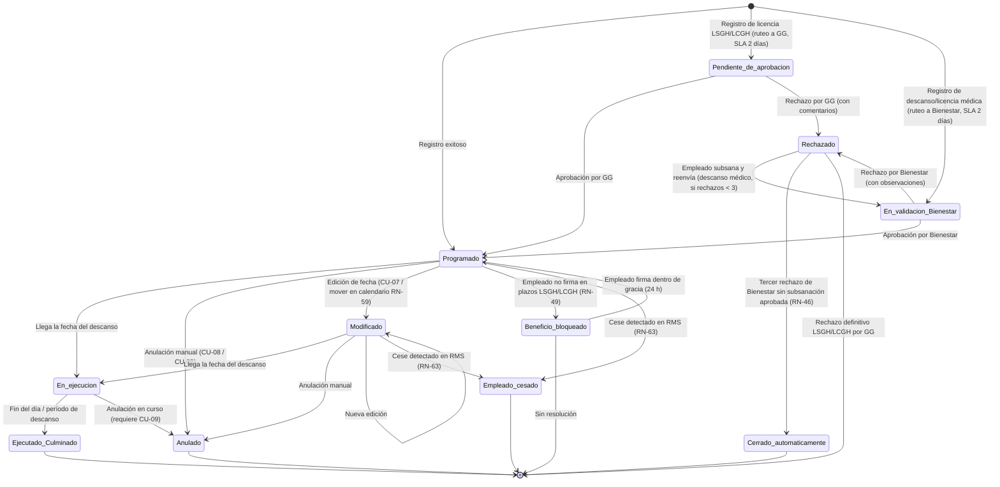

# ENT-MOD-DESC-001 — Especificación de Necesidades Tecnológicas: Módulo de Descansos de Personal
**Sistema:** Nova  
**Empresa:** Organización Retail Peruana (Cadena / Lukers)  
**Versión:** 1.3  
**Fecha:** 31/05/2026  
**Estado:** BORRADOR — Pendiente validación con Product Owner. Reconciliado con reconciliacion-ux.md (C-02 / H-03 / H-08 / H-12 / H-13 / H-20)  
**Autor:** Analista Funcional Senior  
**Historial de cambios:**
- v1.0 (29/05/2026): Versión inicial.
- v1.1 (29/05/2026): Incorporación de decisiones VAC-01, VAC-04, VAC-06, VAC-09, VAC-14, VAC-17 y nuevas decisiones sobre mínimo de asesores disponibles, primera semana de empleado, integración con calendario del Rol de Personal y sugerencia automática.
- v1.2 (29/05/2026): Segunda ronda de vacíos resueltos: VAC-02, VAC-03, VAC-05, VAC-07, VAC-08, VAC-08B, VAC-10, VAC-11, VAC-12, VAC-13, VAC-15, VAC-16, VAC-18, VAC-20. Incorporación de reglas RN-50 a RN-65, actualización de CU-05, CU-08, CU-09, nuevas entidades SaldoCompensacion, HistorialAuditoria, ParametroCese, actualización de permisos e integraciones.
- v1.3 (31/05/2026): Reconciliación con el prototipo (reconciliacion-ux.md). C-02 / H-03: se formaliza que Descansos, Licencias y Vacaciones comparten un MOTOR ÚNICO de "ausencias programadas" con VALIDACIÓN DE NO-CRUCE transversal (bloqueo de solapamientos de cualquier tipo de ausencia para un mismo empleado) — nuevas reglas RN-66 (motor único) y RN-67 (no-cruce transversal). H-08: estados de aprobación visibles "Pendiente de aprobación" y "En validación Bienestar"; ruteo por tipo (LSGH/LCGH → GG, SLA 2 días; Descanso/Licencia médica → Bienestar, SLA 2 días) — RN-68. H-20: adjuntar certificado en licencia médica — RN-69. H-12/H-13: validación dura (no solo hints) de cruces, más de un descanso por semana, exceso de días, dotación mínima bajo umbral, feriados y "Mes Obligatorio" — RN-70. Actualización de la máquina de estados, CU-04, CU-05, CU-06, integraciones con Vacaciones y Aprobaciones.

---

## Tabla de contenido

1. Introducción y Objetivo del Módulo  
2. Alcance y Exclusiones  
3. Actores y Roles  
4. Casos de Uso Principales  
5. Reglas de Negocio  
6. Estados y Transiciones  
7. Entidades y Atributos Principales  
8. Permisos por Rol  
9. Integraciones  
10. Vacíos Funcionales y Preguntas Abiertas  

---

## 1. Introducción y Objetivo del Módulo

### 1.1 Contexto

Nova es un sistema nuevo construido desde cero para una organización retail peruana que opera bajo dos empresas del grupo: **Cadena** y **Lukers**, con aproximadamente 100 tiendas activas. El sistema gestiona la operación de personal en tiendas y en administración central.

La semana laboral del sistema se define de **domingo a sábado** y es parametrizable por empresa.

### 1.2 Objetivo del Módulo

El módulo de **Descansos de Personal** tiene como objetivo centralizar, controlar y trazabilizar todos los eventos de ausencia planificada o no planificada de los colaboradores, incluyendo:

- Descansos laborales ordinarios (semanales)
- Compensaciones por días trabajados en feriados o en descansos semanales
- Licencias médicas, vacaciones, licencias sin goce y con goce de haber
- Apoyos en oficina (solo personal de central)

El módulo garantiza el cumplimiento de las reglas operativas por puesto, empresa, tienda y semana, reduciendo el riesgo de sobredotación o subdotación de personal en tienda, y generando los registros necesarios para la integración con RMS y OFIPLAN.

**Nota importante sobre el calendario:** El módulo de Descansos NO dispone de un calendario propio. El registro de descansos se realiza directamente desde el **calendario semanal del Rol de Personal**. El módulo de Descansos gestiona exclusivamente la lógica de negocio, el historial y el listado de registros.

### 1.3 Alineación con otros módulos de Nova

- **Motor único de ausencias programadas (C-02 / H-03):** Descansos, Licencias (médica, LSGH, LCGH) y Vacaciones comparten un único motor/calendario de "ausencias programadas" con una sola fuente de verdad y una **validación de no-cruce transversal**: no pueden coexistir dos ausencias de cualquier tipo solapadas para el mismo empleado. Las reglas de no-cruce de este módulo (RN-16, RN-66, RN-67) y las del módulo de Vacaciones (RN-VAC-09) son la misma regla materializada en ambos extremos. Ver RN-66 y RN-67.
- **Módulo de Marcaciones:** fuente de alertas por inasistencias; el descanso médico se origina desde una falta detectada.
- **Módulo de Rol de Personal:** punto de entrada para el registro de descansos; el calendario semanal de este módulo es el único canal de registro de descansos laborales y compensaciones. Los descansos interactúan con el rol vigente.
- **Módulo de Aprobaciones:** receptor de solicitudes de licencias sin/con goce de haber (ruteo a GG) y de descanso médico/licencia médica (ruteo a Bienestar), con estados de aprobación visibles (RN-68).
- **Módulo de Vacaciones (ENT-MOD-VAC-001):** comparte el motor único de ausencias programadas; la validación de no-cruce es bidireccional (RN-67, RN-VAC-09).
- **Módulo de Traslados:** validación bidireccional con programaciones de descanso/compensación (VAC-05).
- **App Móvil Nova:** canal para que el empleado visualice documentos, adjunte el certificado de licencia médica (H-20) y ejecute la firma electrónica.

---

## 2. Alcance y Exclusiones

### 2.1 Dentro del alcance

| # | Funcionalidad |
|---|---|
| 1 | Registro manual de descanso laboral desde el calendario semanal del Rol de Personal |
| 2 | Sugerencia automática de descansos laborales y compensaciones desde el calendario semanal del Rol de Personal mediante el botón "Sugerencia Automática" |
| 3 | Registro y gestión de compensaciones laborales (feriado laborado / descanso semanal laborado / descanso no gozado) |
| 4 | Registro de licencias con flujo de documentación (descanso médico, vacaciones, LSGH, LCGH) |
| 5 | Flujo de aprobación de licencias sin/con goce de haber con firma electrónica |
| 6 | Flujo de descanso médico con validación por Bienestar |
| 7 | Edición y anulación de descansos y compensaciones con restricciones por semana, empresa y rol |
| 8 | Anulación de descanso para habilitar la marcación del empleado (flujo de código de autorización) |
| 9 | Anulación automática de faltas cuando administración central registra un descanso retroactivo |
| 10 | Envío de notificaciones y correos por cada evento (registro, edición, anulación) |
| 11 | Jobs automáticos de compensaciones pendientes, recordatorios y programación automática |
| 12 | Vista de listado con filtros diferenciados para tienda y central |
| 13 | Parámetros por empresa y tienda: motivos habilitados, límites de descanso por puesto, días/semanas no permitidas, plazos |
| 14 | Integración con RMS, OFIPLAN y Firma Electrónica Nova |
| 15 | Contador de saldo diferenciado por tipo de compensación visible en calendario y listado |
| 16 | Historial de auditoría completo por registro (usuario, campo, valor anterior, valor nuevo) |
| 17 | Vista consolidada por zona para GZ exportable a Excel |
| 18 | Validación bidireccional con módulo de Traslados para detectar conflictos de fechas |
| 19 | Gestión de cese de empleado con alertas por tipo de compensación pendiente |
| 20 | Comportamiento diferenciado de pantalla según perfil (Central vs Tienda — misma pantalla) |
| 21 | Reprogramación automática de compensación anulada con autorización a nueva fecha válida según Tabla 04 |

### 2.2 Fuera del alcance

| # | Exclusión | Justificación |
|---|---|---|
| 1 | Cálculo de remuneraciones o liquidaciones derivadas de los descansos | Pertenece al módulo de Nóminas |
| 2 | Gestión de horas extras | Módulo separado; se menciona en reporte de compensaciones pendientes solo a nivel de columna |
| 3 | Administración del catálogo de feriados nacionales y locales | Pertenece a configuración/maestros del sistema |
| 4 | Alta/baja de empleados en RMS | RMS es la fuente de verdad; Nova solo consume |
| 5 | Gestión de turnos y horarios de trabajo | Módulo de Rol de Personal |
| 6 | Interfaz de administración de usuarios y roles del sistema | Módulo de Seguridad/Accesos |
| 7 | Calendario propio del módulo de Descansos | El registro de descansos se realiza desde el calendario semanal del Rol de Personal |

---

## 3. Actores y Roles

| ID | Actor | Perfil | Descripción |
|---|---|---|---|
| ACT-01 | Gerente de Tienda (GT) | Tienda | Registra descansos laborales y compensaciones para su tienda. Primer nivel en el flujo de descanso médico. Puede anular compensaciones de la semana en curso sin autorización adicional. |
| ACT-02 | Asesor Senior / Supervisor de Sección | Tienda | Registra faltas en alertas de marcaciones. Puede registrar descansos según configuración. |
| ACT-03 | Gerente Zonal (GZ) | Zonal / Central | Emite códigos de autorización para habilitar marcación cuando se anula un descanso. Autoriza anulación de compensaciones de semanas anteriores dentro del rango permitido. Solicita licencias sin/con goce. Recibe notificación cuando se bloquea el beneficio de un empleado por falta de firma. Gestiona los códigos de autorización desde un único lugar (web o app móvil). |
| ACT-04 | Gerente de Ventas (GV) | Central / Zonal | Recibe copias de correos de compensaciones. Supervisa cumplimiento. |
| ACT-05 | Gerente General (GG) | Central | Aprueba o rechaza licencias sin/con goce de haber en el módulo de Aprobaciones. |
| ACT-06 | Administración de Ventas (AV) | Central | Recibe copias de correos. Supervisa operaciones de personal. Recibe notificaciones de escalamiento por SLA de Bienestar vencido. Recibe alertas por compensaciones pendientes en caso de cese. |
| ACT-07 | Área de Bienestar | Central | Valida documentos de descanso médico en un plazo de 2 días hábiles. |
| ACT-08 | Nóminas | Central | Recibe CCO en correos de programación automática de compensaciones. |
| ACT-09 | Empleado / Colaborador | Tienda / Central | Recibe notificaciones, sube sustentos de descanso médico en app Nova, firma documentos de licencia. Puede ver historial en app si el parámetro está habilitado (VAC-10). |
| ACT-10 | Administración Central | Central | Registra descansos retroactivos para empleados; puede ver registros de todas las tiendas; tiene los motivos de Central habilitados sin restricción de edición por semanas. |
| ACT-11 | Sistema Nova (automatismos) | Sistema | Ejecuta jobs programados, sugerencias automáticas, anulación automática de faltas, envío de correos, reprogramación automática de compensaciones anuladas, alertas de cese, escalamiento de SLA Bienestar. |

---

## 4. Casos de Uso Principales

### CU-01: Registrar Descanso Laboral (Manual)

```
ID: CU-01
Actor principal: Gerente de Tienda (ACT-01) / Administración Central (ACT-10)
Relacionado: RN-01, RN-02, RN-03, RN-04, RN-05, RN-06, RN-07, RN-08, RN-37, RN-40, RN-57
```

**Precondición:**
- El actor está autenticado en Nova con permisos de registro de descansos.
- El actor se encuentra en el calendario semanal del Rol de Personal.
- La semana objetivo está dentro del rango de edición permitido (semana en curso o semana anterior para tienda; sin restricción si es central).
- Existe al menos un empleado activo en la tienda sincronizado desde RMS.

**Flujo principal:**

1. El actor accede al calendario semanal del módulo de Rol de Personal.
2. El sistema muestra el calendario de la semana en curso con los empleados de la tienda (consumido desde RMS). Si un empleado lleva menos de 7 días desde su alta en RMS, el sistema muestra el indicador visual "Nuevo ingreso" junto a su nombre (RN-40). El sistema muestra el contador de saldo de compensaciones diferenciado por tipo (feriados pendientes / descansos no gozados pendientes) junto a cada empleado (RN-60).
3. El actor selecciona el empleado y la fecha de descanso.
4. El sistema valida:
   a. Que el motivo "Descanso laboral" esté habilitado para el perfil del empleado según su rol (tienda ve solo sus motivos; central ve todos sus motivos sin restricción) (RN-57).
   b. Que el número de descansos de la semana no supere el máximo permitido para el puesto (RN-02).
   c. Que no exista programación de descanso simultánea para asesor y asesor senior en la misma fecha con disponibilidad reducida (RN-06).
   d. Que no se programe descanso para la totalidad de empleados del mismo perfil en esa fecha (RN-07).
   e. Que quede al menos 1 asesor disponible en la tienda ese día (RN-38).
   f. Para puestos con 1 día de descanso semanal: solo se ingresa fecha inicio; la fecha fin queda bloqueada (RN-03).
   g. Para puestos con 2 días de descanso semanal: rango máximo de 1 día después de la fecha inicio (RN-04).
5. Si todas las validaciones pasan, el sistema registra el descanso con estado "Programado".
6. El sistema actualiza la vista del calendario semanal.

**Flujos alternos:**

- A1. El empleado tiene indicador "Nuevo ingreso": el registro procede normalmente pero sin generar acumulación de compensación en caso de descanso no gozado durante esa primera semana (RN-41).
- A2. El empleado pertenece a central: el sistema habilita todos los motivos sin restricción de semana de edición, con el comportamiento diferenciado por perfil definido en RN-57.

**Excepciones:**

- E1. El puesto del empleado ya alcanzó el máximo de descansos de la semana: el sistema muestra mensaje de error indicando el límite y sugiere registrar una compensación en su lugar.
- E2. La fecha cae fuera del rango de edición permitido: el sistema bloquea el registro y muestra mensaje con el rango permitido.
- E3. Se intenta programar un segundo descanso a un puesto de 1 día máximo: el sistema rechaza y muestra mensaje indicando que el día adicional debe registrarse como compensación.
- E4. El sistema no puede conectar con RMS para validar datos del empleado: el sistema muestra aviso de error de integración y no permite el registro hasta restablecer la conexión.
- E5. No queda ningún asesor disponible en tienda ese día tras el descanso propuesto: el sistema bloquea el registro con mensaje indicando incumplimiento del mínimo de disponibilidad (RN-38).

**Postcondición:**
- El descanso queda registrado en estado "Programado" con trazabilidad de fecha, empleado, motivo, tienda y usuario que registró.
- El registro está disponible en el listado de descansos.

---

### CU-02: Sugerencia Automática de Descansos y Compensaciones

```
ID: CU-02
Actor principal: Gerente de Tienda (ACT-01) / Administración Central (ACT-10)
Relacionado: RN-02, RN-03, RN-04, RN-05, RN-06, RN-07, RN-09, RN-38, RN-39, RN-42, RN-43
```

**Precondición:**
- El actor está autenticado con permisos de registro.
- El actor se encuentra en el calendario semanal del módulo de Rol de Personal.
- Existe programación semanal cargada desde el módulo de Rol de Personal / RMS.

**Flujo principal:**

1. El actor hace clic en el botón "Sugerencia Automática" dentro del calendario semanal del Rol de Personal.
2. El sistema analiza la programación semanal del personal de la tienda desde RMS.
3. El sistema aplica las reglas de negocio (límites por puesto, días no permitidos, restricciones de coincidencia de perfiles, mínimo de asesores disponibles RN-38) y genera una propuesta de descansos laborales por empleado y fecha.
4. Para empleados que tienen compensaciones pendientes, el sistema genera adicionalmente una propuesta de fecha de compensación (1 sola fecha sugerida por empleado), mostrando siempre la fecha origen que se está compensando (RN-42).
5. El sistema presenta la propuesta completa en pantalla, con los descansos sugeridos y, si aplica, la compensación propuesta con su fecha origen. Las sugerencias son editables antes de confirmar.
6. El actor revisa la propuesta, puede ajustar manualmente cada ítem.
7. El actor confirma la propuesta. La propuesta confirmada pasa a aprobación del Gerente Zonal (RN-43).
8. Una vez aprobada por el GZ, el sistema registra todos los ítems confirmados con estado "Programado".

**Flujos alternos:**

- A1. El actor rechaza toda la propuesta: no se registra ningún descanso y se descarta la propuesta.
- A2. El actor modifica parcialmente la propuesta antes de confirmar: el sistema registra solo los ítems confirmados y aprobados.
- A3. El actor selecciona una compensación pendiente desde el modal de compensación (en lugar del calendario): el sistema muestra la fecha origen de la compensación junto a 3 fechas propuestas para que el actor elija (RN-42B).

**Excepciones:**

- E1. No hay datos de programación disponibles en RMS para la semana: el sistema muestra aviso y no genera propuesta.
- E2. Ningún empleado cumple condiciones para descanso esa semana (todos ya tienen descanso registrado): el sistema informa que no hay descansos pendientes de proponer.
- E3. El GZ rechaza la propuesta: los ítems no se registran y el sistema notifica al GT para que ajuste la propuesta.

**Postcondición:**
- Los descansos confirmados y aprobados por GZ quedan en estado "Programado".
- Las compensaciones propuestas confirmadas y aprobadas quedan en estado "Programado" con las fechas asignadas.

---

### CU-03: Registrar Compensación Laboral

```
ID: CU-03
Actor principal: Gerente de Tienda (ACT-01) / Sistema Nova (ACT-11) / Administración Central (ACT-10)
Relacionado: RN-09, RN-10, RN-10B, RN-11, RN-12, RN-13, RN-13B, RN-13C, RN-14, RN-14B, RN-15, RN-44, RN-45, RN-58
```

**Precondición:**
- Existe al menos 1 día acumulado de compensación para el empleado (feriado laborado, descanso semanal laborado o descanso no gozado en semana no primera).
- El actor tiene permisos de registro de compensaciones.

**Flujo principal:**

1. El actor accede al módulo de Descansos (o al calendario del Rol de Personal) y selecciona la opción de registrar compensación para un empleado.
2. El sistema muestra el contador de saldo diferenciado: feriados pendientes y descansos no gozados pendientes, con la fecha origen de cada acumulado (RN-60).
3. El sistema genera 3 fechas propuestas de compensación aplicando los criterios de la Tabla 04 según la empresa del empleado (Cadena o Lukers):
   - Excluye días no permitidos (viernes, sábado, domingo para Lukers; viernes, sábado, domingo en CC y viernes, sábado en PC para Cadena).
   - Excluye semanas de alta demanda parametrizadas.
   - Excluye feriados.
   - Respeta el máximo de 2 días de compensación por semana.
   - Para Cadena: valida cuota mínima dinámica por asesor calculada como cuota de tienda (desde RMS vía API) ÷ cantidad de asesores activos de la tienda en ese momento (RN-13C).
   - El algoritmo prioriza las fechas más próximas disponibles (RN-44).
4. El sistema muestra las 3 fechas propuestas al actor, indicando junto a cada una la fecha origen de la compensación.
5. El actor selecciona una de las 3 fechas propuestas. Si el actor tiene permisos para ingresar fecha manual, puede hacerlo siempre que la fecha supere las mismas validaciones de la Tabla 04 (RN-58).
6. El sistema valida la fecha seleccionada contra todas las restricciones (RN-11, RN-12, RN-13).
7. El sistema registra la compensación con estado "Programado".
8. El sistema envía correo al empleado con las 3 fechas propuestas y la fecha seleccionada (RN-14).
   - Asunto: "Compensación correspondiente al descanso no gozado de la semana del [fecha inicio] al [fecha fin] de [mes] de [año]" (o equivalente según tipo de compensación).
   - Copia a Gerente de Ventas y Administración de Ventas.
   - Formato de correo parametrizable.

**Flujos alternos:**

- A1. El registro lo ejecuta el Job Automático (ACT-11): el sistema selecciona automáticamente la primera fecha disponible que cumpla la Tabla 04, priorizando fechas más próximas y respetando el límite de 2 compensaciones por semana (RN-44). El sistema registra la compensación sin interacción humana (aplica cuando no se ha programado la compensación antes del 5to día del mes siguiente). El correo al empleado usa el mismo formato que el manual, con una línea adicional: el texto parametrizable definido en RN-45 (por defecto: "Esta compensación fue programada automáticamente por el sistema.").
- A2. Es semana de campaña para la empresa: se flexibilizan restricciones de días no permitidos según parametrización (RN-15).

**Excepciones:**

- E1. No hay fechas disponibles que cumplan todos los criterios de la Tabla 04 dentro del mes siguiente: el sistema alerta al actor y solicita criterio de desempate o escala al administrador del sistema.
- E2. La fecha propuesta por el actor no cumple las restricciones: el sistema muestra el motivo del rechazo.
- E3. El plazo máximo de compensación (último día del mes siguiente) ya venció para tienda: el sistema alerta y registra la compensación igualmente, pero genera una alerta de incumplimiento de plazo.
- E4. La API de RMS no devuelve la cuota de tienda para Cadena: el sistema no puede calcular la cuota dinámica, bloquea la propuesta para esas fechas y muestra alerta de error de integración.

**Postcondición:**
- La compensación queda registrada en estado "Programado" con fecha, tipo, empleado, fecha origen y usuario que registró.
- El empleado recibe correo de notificación.
- GV y AV reciben copia del correo.

---

### CU-04: Registrar Licencia (Modal con Documentos)

```
ID: CU-04
Actor principal: Gerente de Tienda (ACT-01) / Gerente Zonal (ACT-03) / Administración Central (ACT-10)
Relacionado: RN-16, RN-17, RN-18, RN-66, RN-67, RN-68, RN-69, RN-70
```

**Precondición:**
- El actor tiene permisos para registrar el tipo de licencia en cuestión.
- El tipo de licencia está habilitado para el perfil del empleado (central: todos; tienda: solo descanso laboral y compensaciones).
- No existe otra programación para las fechas del período de licencia.

**Flujo principal:**

1. El actor selecciona al empleado y el tipo de licencia (vacaciones, descanso médico, LSGH, LCGH).
2. El sistema abre un modal de registro de licencia.
3. El modal solicita:
   - Fechas de inicio y fin de la licencia.
   - Documentos de evidencia o sustento (carga de archivos). Para licencia/descanso médico, el certificado médico es adjuntable y obligatorio (RN-69, H-20).
   - Comentarios (obligatorios para LSGH y LCGH).
4. El actor completa el formulario y adjunta los documentos requeridos.
5. El sistema ejecuta la validación de no-cruce transversal del motor único de ausencias: bloquea (validación dura) si existe cualquier otra ausencia programada (descanso, compensación, licencia o vacaciones) que se solape con las fechas indicadas para el mismo empleado (RN-16, RN-66, RN-67). Aplica además las validaciones duras de exceso de días, dotación mínima, feriados y "Mes Obligatorio" cuando correspondan (RN-70).
6. El sistema registra la licencia con el estado de aprobación correspondiente según el ruteo por tipo (RN-68):
   - LSGH / LCGH: estado "Pendiente de aprobación" (ruteo a GG, SLA 2 días).
   - Descanso médico / licencia médica: estado "En validación Bienestar" (ruteo a Bienestar, SLA 2 días).
7. Según el tipo de licencia, se dispara el flujo específico (CU-05 para descanso/licencia médica, CU-06 para LSGH/LCGH).

**Flujos alternos:**

- A1. El actor cierra el modal sin completar: no se registra ningún dato.

**Excepciones:**

- E1. Existe una ausencia programada (descanso, compensación, licencia o vacaciones) que se solapa con alguna de las fechas del período: el sistema muestra las fechas y el tipo de ausencia en conflicto y bloquea el registro (validación dura de no-cruce) hasta resolver el conflicto (RN-67).
- E2. Los documentos requeridos no se adjuntan (incluido el certificado de licencia médica): el sistema bloquea el registro e indica qué documentos son obligatorios (RN-69).

**Postcondición:**
- La licencia queda registrada con documentos adjuntos y con estado de aprobación visible: "Pendiente de aprobación" (LSGH/LCGH) o "En validación Bienestar" (médica).
- Se dispara el flujo de validación o aprobación correspondiente al tipo según el ruteo (RN-68).

---

### CU-05: Flujo de Descanso Médico

```
ID: CU-05
Actor principal: Gerente de Tienda / Senior (ACT-01, ACT-02), Empleado (ACT-09), Área de Bienestar (ACT-07)
Relacionado: RN-19, RN-20, RN-21, RN-22, RN-23, RN-46, RN-47, RN-50, RN-51, RN-65, RN-67, RN-68, RN-69
```

**Precondición:**
- Se ha registrado una falta del empleado en el módulo de Marcaciones (primer día de inasistencia).
- El empleado cuenta con acceso a la app móvil Nova.

**Flujo principal:**

1. El GT o Asesor Senior registra la falta del empleado en la alerta de marcaciones del módulo correspondiente.
2. El empleado ingresa a la app Nova y sube los documentos de sustento de descanso médico, incluido el certificado médico (RN-69, H-20), indicando las fechas del descanso. El sistema valida el no-cruce transversal contra cualquier otra ausencia programada del empleado (RN-67).
3. El sistema registra los sustentos, deja el caso en estado visible "En validación Bienestar" y lo rutea al Área de Bienestar para revisión (SLA 2 días hábiles) (RN-68).
4. El Área de Bienestar revisa los documentos dentro de los 2 días hábiles siguientes (RN-19).
5. Bienestar aprueba el descanso médico.
6. El sistema escribe directamente en RMS vía API en tiempo real el estado "DESCANSO MÉDICO" para los días correspondientes (RN-47).
7. El sistema programa la migración del registro a OFIPLAN via BOT en los tiempos parametrizables (RN-22).
8. El registro en Nova queda con estado "Ejecutado / Culminado".

**Flujos alternos:**

- A1. Bienestar tiene observaciones sobre los documentos:
  1. Bienestar rechaza la solicitud e ingresa comentarios explicando la observación.
  2. El sistema notifica al empleado con el detalle de la observación e incrementa el contador de rechazos.
  3. El empleado subsana y vuelve a subir los documentos corregidos en la app Nova.
  4. Bienestar tiene nuevamente 2 días hábiles para la revisión del reenvío (RN-20).
  5. Si aprueba: continúa desde paso 6 del flujo principal.
  6. Si vuelve a rechazar y es el tercer rechazo: el sistema cierra automáticamente el caso (RN-46) y notifica al GT y al empleado.
  7. Si vuelve a rechazar y no es el tercer rechazo: se repite el ciclo desde el paso A1.2.

- A2. Feriado dentro del rango del descanso médico activo (RN-65):
  1. El sistema detecta que una fecha del período es feriado.
  2. El feriado se contabiliza como día de descanso médico, no como día laborado.
  3. No se genera compensación adicional por el feriado.

**Excepciones:**

- E1. El empleado no sube documentos dentro del plazo parametrizable: el sistema genera alerta al GT. El plazo y destinatario de la alerta son parametrizables en tabla de parámetros (RN-50).
- E2. Bienestar no revisa en los 2 días hábiles: el sistema genera notificación automática a Administración de Ventas. El destinatario del escalamiento y el plazo exacto son parametrizables en tabla de parámetros (RN-51).
- E3. El sistema no puede escribir en RMS vía API: el registro en Nova queda en estado intermedio y se reintenta según política de reintentos (a definir con Arquitecto).

**Postcondición:**
- El estado "DESCANSO MÉDICO" queda registrado en RMS en tiempo real para los días correspondientes.
- El registro en Nova es trazable con todos los documentos adjuntos, historial de revisiones de Bienestar, contador de rechazos y fecha de aprobación.
- La migración a OFIPLAN queda programada.

---

### CU-06: Flujo de Licencia Sin Goce / Con Goce de Haber

```
ID: CU-06
Actor principal: Gerente Zonal (ACT-03), Gerente General (ACT-05), Empleado (ACT-09)
Relacionado: RN-24, RN-25, RN-26, RN-27, RN-48, RN-49, RN-47, RN-56, RN-67, RN-68
```

**Precondición:**
- El Gerente Zonal tiene acceso al módulo "Gestión de Equipos" con permisos de solicitud de licencias.
- Existe un empleado activo para quien se solicita la licencia.

**Flujo principal:**

1. El Gerente Zonal ingresa al módulo "Gestión de Equipos" y crea una solicitud de licencia sin goce (LSGH) o con goce de haber (LCGH).
2. El GZ selecciona el empleado, el tipo de licencia, el período (fechas inicio y fin) y añade comentarios obligatorios. El sistema valida el no-cruce transversal contra cualquier otra ausencia programada del empleado (RN-67).
3. El sistema registra la solicitud en estado visible "Pendiente de aprobación" y la rutea al módulo "Aprobaciones" de Gerencia General (ruteo LSGH/LCGH → GG, SLA 2 días) (RN-68).
4. El Gerente General recibe la solicitud en su módulo de Aprobaciones y la revisa. El GG siempre es el aprobador de LSGH/LCGH; sin embargo, para descansos de Central el aprobador es configurable por jerarquía en tabla de parámetros (RN-56).
5. El GG aprueba la solicitud.
6. El sistema envía el documento de licencia al servicio de Firma Electrónica Nova.
7. El sistema notifica al empleado vía correo y/o app móvil para que ingrese a firmar el documento. El plazo para firmar es parametrizable; el valor por defecto es 3 días hábiles (RN-48).
8. El empleado firma el documento en la app Nova (selfie + coordenadas GPS + código por correo) dentro del plazo establecido.
9. El sistema registra el documento firmado en el módulo de licencias de Nova.
10. El sistema escribe directamente en RMS vía API en tiempo real el código correspondiente (LSGH o LCGH) (RN-47).
11. El sistema programa la migración a OFIPLAN via BOT.
12. El registro queda en estado "Ejecutado / Culminado".

**Flujos alternos:**

- A1. El GG rechaza la solicitud:
  1. El GG ingresa comentarios obligatorios explicando el rechazo.
  2. El sistema actualiza el estado a "Rechazado".
  3. El sistema notifica al GZ y al empleado con los comentarios del rechazo.
  4. El GZ puede iniciar una nueva solicitud si aplica.
- A2. El empleado no firma dentro del plazo de 3 días hábiles (o el configurado):
  1. El sistema reenvía automáticamente la notificación de firma al empleado con 24 horas de gracia adicionales (RN-49).
  2. Si el empleado firma dentro de las 24 horas de gracia: continúa desde el paso 9 del flujo principal.
  3. Si el empleado no firma en las 24 horas de gracia: el sistema bloquea el beneficio asociado a la licencia y notifica al GZ (RN-49).

**Excepciones:**

- E1. El servicio de Firma Electrónica no está disponible: el sistema registra el intento fallido y reintenta según política de reintentos. El sistema puede usar un flujo de firma alternativo (canal de contingencia) mientras el servicio principal no esté disponible; política a definir con Arquitecto (RN-52).
- E2. El sistema no puede escribir en RMS vía API post-firma: el registro queda en estado intermedio y se reintenta.

**Postcondición:**
- La licencia aprobada y firmada queda registrada en Nova con trazabilidad completa.
- El estado del empleado en RMS refleja LSGH o LCGH en los días correspondientes (escritura en tiempo real vía API).
- La migración a OFIPLAN está programada.
- Si el empleado no firmó en los plazos establecidos: el beneficio queda bloqueado y el GZ notificado.

---

### CU-07: Editar Descanso / Compensación

```
ID: CU-07
Actor principal: Gerente de Tienda (ACT-01) / Administración Central (ACT-10)
Relacionado: RN-28, RN-29, RN-30, RN-14
```

**Precondición:**
- Existe un descanso o compensación en estado "Programado" o "Modificado".
- La fecha de registro cae dentro del rango de edición permitido (semana en curso o semana anterior para tienda; sin restricción para central).
- El actor tiene permisos de edición.

**Flujo principal:**

1. El actor localiza el registro en el listado y selecciona la opción "Editar".
2. El sistema solicita confirmación antes de proceder con la edición.
3. El actor confirma.
4. El sistema abre el formulario de edición con los datos actuales del registro.
5. El actor modifica los campos permitidos (principalmente la fecha). El sistema permite además mover una programación arrastrándola en el calendario a otra fecha (RN-59).
6. El sistema valida las nuevas fechas contra las mismas reglas del registro original (límites por puesto, días no permitidos, Tabla 04 para compensaciones). Si la fecha destino ya tiene otra programación para ese empleado, no cumple Tabla 04, o afecta la dotación mínima, el sistema bloquea el movimiento y muestra el motivo (RN-59).
7. El sistema guarda los cambios y actualiza el estado a "Modificado". Registra en historial de auditoría: usuario, fecha/hora, campo modificado, valor anterior, valor nuevo (RN-61).
8. Si es una compensación: el sistema envía correo al empleado con asunto "Cambio de fecha de compensación laboral" con copia a GV y AV (RN-30).

**Excepciones:**

- E1. La nueva fecha no cumple las validaciones: el sistema muestra el motivo y no guarda el cambio.
- E2. El registro ya está en estado "En ejecución", "Ejecutado" o "Anulado": el sistema bloquea la edición.
- E3. La fecha del registro cae fuera del rango de edición permitido para tienda: el sistema bloquea la edición e informa el rango permitido.

**Postcondición:**
- El registro queda en estado "Modificado" con historial de auditoría completo (fecha anterior, fecha nueva, usuario, timestamp).
- El empleado recibe correo de notificación si aplica.

---

### CU-08: Anular Descanso / Compensación

```
ID: CU-08
Actor principal: Gerente de Tienda (ACT-01) / Gerente Zonal (ACT-03) / Administración Central (ACT-10)
Relacionado: RN-28, RN-29, RN-31, RN-14, RN-53, RN-54, RN-61
```

**Precondición:**
- Existe un registro en estado "Programado" o "Modificado".
- El actor tiene permisos de anulación según el rango de semana del registro.

**Flujo principal:**

1. El actor selecciona el registro y elige la opción "Anular".
2. El sistema valida la autorización requerida según la semana del registro (RN-53, RN-54):
   - Si es compensación de la semana en curso: el GT puede anular directamente, sin autorización adicional.
   - Si es compensación de semanas anteriores (dentro del rango permitido): el sistema requiere autorización del GZ antes de proceder.
3. Si se requiere autorización del GZ: el sistema solicita al GZ que confirme la anulación. El GZ puede aprobar desde web o app móvil.
4. Una vez autorizado (o si no se requería autorización), el sistema solicita confirmación previa con mensaje de advertencia.
5. El actor confirma la anulación.
6. El sistema actualiza el estado a "Anulado" y registra en historial de auditoría: usuario, campo, valor anterior, valor nuevo, timestamp (RN-61).
7. Si es una compensación: el sistema envía correo al empleado con asunto "Anulación de compensación laboral" con copia a GV y AV (RN-31).
8. El día compensado vuelve a quedar como pendiente. El sistema reprograma automáticamente la compensación en otra fecha válida según Tabla 04 (RN-53B). El empleado recibe correo de la nueva programación automática.

**Excepciones:**

- E1. El registro ya está en estado "En ejecución": el sistema alerta que no es posible anular un descanso en curso sin primero ejecutar el flujo de anulación para habilitar marcación (ver CU-09).
- E2. El registro está en estado "Ejecutado" o "Anulado": el sistema bloquea la operación.
- E3. El GZ no autoriza la anulación: el sistema mantiene el estado original del registro.
- E4. No existe fecha válida para la reprogramación automática dentro del período permitido: el sistema alerta al GT y al GZ e incorpora la compensación al saldo pendiente sin programar fecha.

**Postcondición:**
- El registro queda en estado "Anulado" con historial de auditoría completo.
- Si la compensación fue anulada con autorización, queda reprogramada automáticamente en nueva fecha válida (o en saldo pendiente si no hubo fecha disponible).
- El empleado recibe correo de notificación.

---

### CU-09: Anular Descanso Programado para que Empleado Labore

```
ID: CU-09
Actor principal: Gerente de Tienda (ACT-01), Gerente Zonal (ACT-03)
Relacionado: RN-32, RN-33, RN-34, RN-35, RN-55
```

**Precondición:**
- Existe un descanso en estado "Programado" para el empleado en la fecha en cuestión.
- El empleado decide o necesita laborar en ese día.

**Flujo principal:**

1. El GT anula el descanso del empleado siguiendo el flujo CU-08.
2. El sistema solicita al GT que registre una nueva fecha de descanso dentro de la misma semana (RN-32).
3. El GT registra la nueva fecha de descanso.
4. El Gerente Zonal emite el código de autorización para habilitar la marcación del empleado en el sistema. El código es el mismo mecanismo centralizado del módulo de Marcaciones; el GZ lo gestiona desde un único lugar en web o app móvil (RN-55).
5. El sistema habilita la marcación para el empleado en la fecha correspondiente.
6. El empleado puede fichar normalmente.

**Flujos alternos:**

- A1. El GT no desea registrar una nueva fecha de descanso en la semana:
  1. El GT declina el registro de nueva fecha.
  2. Recién en ese momento se procede con la emisión del código de autorización del Zonal (RN-55).
  3. El día trabajado se acumula como compensación pendiente para el empleado.
- A2. Es semana de campaña:
  1. Los códigos de autorización del Zonal se exoneran (RN-34).
  2. El GT puede habilitar directamente la marcación sin código de Zonal.

**Excepciones:**

- E1. El Zonal no emite el código de autorización: el sistema mantiene la marcación bloqueada para ese empleado en esa fecha.
- E2. No es posible reasignar descanso en la misma semana (todos los días ya tienen restricciones): el GT declina y se acumula la compensación.

**Postcondición:**
- El descanso original queda en estado "Anulado".
- Si se registró nueva fecha: nuevo descanso en estado "Programado" en la nueva fecha.
- La marcación del empleado queda habilitada para el día laborado.
- Si no se registró nueva fecha: el día se acumula como compensación pendiente.

---

### CU-10: Vista Consolidada por Zona (GZ)

```
ID: CU-10
Actor principal: Gerente Zonal (ACT-03)
Relacionado: RN-62
```

**Precondición:**
- El GZ está autenticado con permisos de visualización de su zona.

**Flujo principal:**

1. El GZ accede al módulo de Descansos y selecciona la vista "Consolidado de Zona".
2. El sistema muestra el panel consolidado con:
   - Total de compensaciones pendientes por tienda.
   - Descansos programados de la semana actual.
   - Empleados sin descanso asignado en la semana.
   - Alertas de compensaciones próximas a vencer.
3. El GZ puede filtrar por tienda, semana o tipo de compensación.
4. El GZ selecciona "Exportar a Excel".
5. El sistema genera el archivo Excel con los datos del panel y lo descarga.

**Postcondición:**
- El GZ dispone de visión consolidada de su zona y puede actuar sobre las alertas identificadas.

---

### CU-11: Gestión de Cese de Empleado

```
ID: CU-11
Actor principal: Sistema Nova (ACT-11)
Relacionado: RN-63
```

**Precondición:**
- RMS notifica o el sistema detecta el cese de un empleado con registros activos o saldos de compensación pendientes.

**Flujo principal:**

1. El sistema detecta el cese del empleado en RMS.
2. El sistema evalúa los saldos y registros del empleado y aplica la estrategia de liberación por tipo (RN-63):
   - Compensación por feriado laborado: genera alerta a GZ y AV.
   - Compensación por descanso no gozado: genera alerta a GZ y AV.
   - Descanso médico en curso: notificación a Bienestar para cierre del caso.
   - Vacaciones pendientes: alerta a GZ y AV (puede derivar a pago de beneficio).
3. Las compensaciones no se cancelan automáticamente. Quedan en historial con estado "Empleado cesado".
4. El sistema registra el evento de cese en el historial de auditoría del empleado.

**Postcondición:**
- Los saldos y registros del empleado cesado quedan en historial con estado "Empleado cesado".
- Los destinatarios alertados reciben notificación con el detalle del tipo de compensación pendiente.

---

## 5. Reglas de Negocio

### 5.1 Motivos de Descanso por Perfil

| ID | Regla |
|---|---|
| RN-01 | El motivo "Descanso laboral" está habilitado para empleados de tienda y de central. |
| RN-01B | Los motivos "Compensación por feriado laborado" y "Compensación por descanso semanal laborado" están habilitados para tienda y central. |
| RN-01C | Los motivos "Apoyo en oficina", "Descanso médico", "Vacaciones", "Licencia sin goce de haber" y "Licencia con goce de haber" están habilitados exclusivamente para empleados de central. |
| RN-01D | El catálogo de motivos habilitados por perfil (tienda/central) es parametrizable por empresa. |

### 5.2 Límites de Descanso por Puesto

| ID | Regla |
|---|---|
| RN-02 | Cada puesto tiene un número máximo de días de descanso y un número máximo de días de trabajo por semana, ambos parametrizables por empresa y tienda. Los valores por defecto son los definidos en la Tabla de Puestos de la sección de contexto. |
| RN-03 | Para puestos con máximo de 1 día de descanso semanal: al registrar el descanso solo se ingresa la fecha de inicio; la fecha fin queda bloqueada y automáticamente igual a la fecha inicio. Si se intenta registrar un segundo día en la misma semana, el sistema rechaza el registro e indica que debe ser una compensación. |
| RN-04 | Para puestos con máximo de 2 días de descanso semanal: el rango de fechas tiene un máximo de 1 día de diferencia entre fecha inicio y fecha fin. Un día adicional en la misma semana solo puede registrarse como compensación. |

### 5.3 Acumulación de Compensaciones

| ID | Regla |
|---|---|
| RN-05 | Si un empleado labora en un día feriado, acumula +1 día de compensación de tipo "Compensación por feriado laborado". |
| RN-05B | Si un empleado labora en su día de descanso semanal establecido, acumula +1 día de compensación de tipo "Compensación por descanso semanal laborado". |
| RN-05C | Si un empleado no alcanza el número de días de descanso establecidos para la semana, acumula los días pendientes como compensación. Esta regla no aplica para la primera semana del empleado en la empresa (RN-41). |
| RN-05D | Las acumulaciones de compensación son individuales por empleado y se mantienen como saldo hasta que se programen y ejecuten. |

### 5.4 Plazos de Compensación

| ID | Regla |
|---|---|
| RN-08 | Para empleados de tienda: la compensación debe realizarse a más tardar el último día del mes siguiente a la acumulación. Este plazo es parametrizable por empresa. |
| RN-08B | Para empleados de central: no existe restricción de plazo para ejecutar la compensación. |

### 5.5 Propuesta de Fechas para Compensación (Tabla 04)

| ID | Regla |
|---|---|
| RN-09 | Al registrar una compensación, el sistema siempre debe proponer 3 fechas candidatas basadas en los criterios de la Tabla 04 según la empresa del empleado. |
| RN-10 | Para Lukers: los días viernes, sábado y domingo están excluidos como fechas de compensación. |
| RN-10B | Para Cadena en centros comerciales (CC): los días viernes, sábado y domingo están excluidos. Para Cadena en piso de calle (PC): los días viernes y sábado están excluidos. El tipo de ubicación de cada tienda (CC / PC) es un atributo del maestro de tiendas en Nova, configurable por Administración (RN-39). |
| RN-11 | Las semanas de alta demanda del primer semestre (para Lukers: semanas 24, 25, 29, 30, 31; para Cadena: semanas de pico parametrizables) están excluidas para programar compensaciones. |
| RN-12 | Las semanas de navidad (para Lukers: semanas 50, 51, 52; para Cadena: semanas de pico parametrizables) están excluidas para programar compensaciones. |
| RN-13 | Los feriados están excluidos como fechas de compensación para ambas empresas. |
| RN-13B | El máximo de compensaciones programables por semana para un empleado es de 2 días, para ambas empresas. |
| RN-13C | Para Cadena: la cuota mínima por asesor se calcula dinámicamente como: cuota de tienda (obtenida desde RMS vía API) ÷ cantidad de asesores activos de la tienda en ese momento. Si la semana propuesta no alcanza esta cuota mínima dinámica para el asesor, la fecha no es válida como propuesta de compensación. |

### 5.6 Restricciones de Coincidencia de Perfiles

| ID | Regla |
|---|---|
| RN-06 | No se puede programar descanso simultáneo para un asesor y un asesor senior en la misma fecha, siempre y cuando el personal disponible ese día sea únicamente un asesor. |
| RN-07 | No se puede programar descanso para la totalidad de empleados de un mismo perfil en la misma fecha. Este límite es parametrizable por perfil. |

### 5.7 Restricciones de Edición

| ID | Regla |
|---|---|
| RN-28 | Para tiendas: solo se permiten modificaciones (edición y anulación) sobre registros de descansos de la semana en curso y la semana inmediatamente anterior. Este rango es parametrizable por empresa. |
| RN-29 | Para administración central: no existen restricciones de semana para editar o anular descansos. |

### 5.8 Notificaciones por Compensación

| ID | Regla |
|---|---|
| RN-14 | Al registrar una compensación, el sistema envía correo al empleado con las 3 fechas propuestas y la fecha seleccionada. El asunto del correo para descanso no gozado debe incluir el rango de fechas de la semana: "compensación correspondiente al descanso no gozado de la semana del [DD] al [DD] de [mes] de [año]". El formato del correo es parametrizable. |
| RN-14B | El correo de registro de compensación se copia al Gerente de Ventas y a Administración de Ventas. |
| RN-30 | Al editar una compensación, el sistema envía correo al empleado con asunto "Cambio de fecha de compensación laboral", con copia a GV y AV. |
| RN-31 | Al anular una compensación, el sistema envía correo al empleado con asunto "Anulación de compensación laboral", con copia a GV y AV. |

### 5.9 Anulación para Habilitar Marcación

| ID | Regla |
|---|---|
| RN-32 | Al anular un descanso para que el empleado labore, el sistema solicita primero registrar una nueva fecha de descanso dentro de la misma semana. Solo si el GT declina registrar la nueva fecha, se habilita la emisión del código de autorización. |
| RN-33 | El Gerente Zonal debe emitir un código de autorización para habilitar la marcación del empleado en el día en que laborará durante su descanso original. |
| RN-34 | Durante semanas de campaña, los códigos de autorización del Zonal se exoneran. El criterio de "semana de campaña" es parametrizable por empresa en la tabla de parámetros. Las semanas de campaña se declaran mediante parametrización manual por el Administrador del Sistema (RN-64). |
| RN-35 | Si el empleado labora en el día que tenía programado su descanso, ese día se acumula como compensación pendiente si no se asignó un nuevo descanso en la misma semana. |

### 5.10 Registro Central y Anulación Automática de Faltas

| ID | Regla |
|---|---|
| RN-36 | Cuando administración central registra un descanso para un empleado en fechas donde existen faltas registradas, el sistema anula automáticamente dichas faltas cambiando su estado a "Anulado" en el módulo de Marcaciones. |

### 5.11 Flujo de Descanso Médico

| ID | Regla |
|---|---|
| RN-19 | El Área de Bienestar tiene un plazo máximo de 2 días hábiles para revisar y aprobar o rechazar los documentos de sustento de un descanso médico, contados desde la fecha en que el empleado los subió. |
| RN-20 | Si Bienestar rechaza con observaciones, el empleado subsana y vuelve a subir documentos. Bienestar tiene nuevamente 2 días hábiles para la revisión del reenvío. |
| RN-21 | Una vez aprobado por Bienestar, el sistema registra automáticamente el estado "DESCANSO MÉDICO" en RMS para los días correspondientes sin intervención manual. |
| RN-22 | El registro de descanso médico en RMS se migra a OFIPLAN via BOT en tiempos parametrizables. El BOT de OFIPLAN solo maneja esta migración diferida; la escritura en RMS la realiza Nova directamente vía API en tiempo real. |
| RN-23 | El GT o Asesor Senior registra la falta del primer día de inasistencia en el módulo de Marcaciones antes de que el empleado pueda iniciar el flujo de descanso médico en la app. |
| RN-46 | El ciclo rechazo-subsanación de Bienestar tiene un máximo de 3 rechazos. Al producirse el tercer rechazo sin subsanación aprobada, el sistema cierra automáticamente el caso de descanso médico y notifica al GT y al empleado. |

### 5.12 Flujo de Licencias LSGH / LCGH

| ID | Regla |
|---|---|
| RN-24 | Solo el Gerente Zonal puede iniciar una solicitud de LSGH o LCGH desde el módulo "Gestión de Equipos". |
| RN-25 | Los comentarios son obligatorios al crear una solicitud de LSGH o LCGH. |
| RN-26 | Las solicitudes de LSGH y LCGH requieren aprobación del Gerente General desde el módulo de Aprobaciones. El GG debe incluir comentarios si rechaza. Las licencias LSGH/LCGH mantienen siempre su flujo de aprobación por GG (RN-56). |
| RN-27 | Una vez aprobada la licencia por el GG, el flujo de firma electrónica es obligatorio antes de registrar el estado en RMS. La firma requiere: selfie del empleado + coordenadas GPS + código por correo. |

### 5.13 Restricción de Registro por Fecha Preexistente

| ID | Regla |
|---|---|
| RN-16 | El sistema no permite registrar ningún tipo de licencia o descanso en fechas donde ya existe otra programación activa (estado Programado, En ejecución, Modificado, Pendiente de aprobación o En validación Bienestar) para el mismo empleado. Esta es la materialización local de la regla de no-cruce transversal del motor único de ausencias (RN-67); el alcance abarca descansos, compensaciones, licencias de todo tipo y vacaciones. El bloqueo es duro (validación dura, no hint). |
| RN-17 | Los documentos de evidencia son obligatorios para registrar descanso médico, vacaciones, LSGH y LCGH. El tipo y cantidad de documentos requeridos es parametrizable. |
| RN-18 | El sistema valida la existencia de documentos adjuntos antes de confirmar el registro de cualquier licencia. |

### 5.14 Mínimo de Asesores Disponibles

| ID | Regla |
|---|---|
| RN-38 | Para programar un descanso a un asesor o senior de tienda en una fecha determinada, debe quedar al menos 1 asesor disponible (no en descanso ni en licencia) en esa tienda ese día. El mínimo se obtiene de la tabla de equipos de tienda en Nova y se evalúa por tienda, no de forma global. |

### 5.15 Tipo de Tienda para Cadena

| ID | Regla |
|---|---|
| RN-39 | El tipo de ubicación de una tienda Cadena (Centro Comercial — CC / Piso de Calle — PC) es un atributo del maestro de tiendas en Nova, configurable por Administración. Este atributo determina qué días de la semana quedan excluidos para compensaciones (RN-10B). |

### 5.16 Indicador "Nuevo Ingreso" y Primera Semana

| ID | Regla |
|---|---|
| RN-40 | El sistema muestra el indicador visual "Nuevo ingreso" en el calendario semanal del Rol de Personal durante los primeros 7 días desde la fecha de alta del empleado en RMS. El indicador es informativo y no genera bloqueos en el registro de descansos. |
| RN-41 | Los descansos no gozados durante la primera semana del empleado no generan acumulación de compensación (excepción a RN-05C). "Primera semana" corresponde a la semana ISO en la que se produce el alta del empleado en RMS. |

### 5.17 Sugerencia Automática desde el Calendario

| ID | Regla |
|---|---|
| RN-42 | El botón "Sugerencia Automática" en el calendario semanal del Rol de Personal propone, para compensaciones desde el calendario: 1 sola fecha sugerida por empleado, mostrando siempre la fecha origen del acumulado que se está compensando. |
| RN-42B | Cuando se accede a la sugerencia de compensación desde el modal de compensación, el sistema muestra la fecha origen del acumulado más 3 fechas propuestas para que el usuario elija entre ellas. |
| RN-43 | Las sugerencias automáticas de descansos y compensaciones son editables antes de confirmar y requieren aprobación del Gerente Zonal antes de quedar registradas con estado "Programado". |

### 5.18 Job Automático de Compensaciones

| ID | Regla |
|---|---|
| RN-44 | El job automático del 5to día del mes siguiente selecciona para cada compensación pendiente la primera fecha disponible que cumpla íntegramente los criterios de la Tabla 04, respetando los días y semanas no permitidos y el límite de 2 compensaciones por semana. Entre varias fechas válidas, el job prioriza siempre las fechas más próximas. El job del 4to día del mes garantiza que todas las compensaciones queden programadas antes del vencimiento del plazo. |
| RN-45 | El correo generado por el job automático de compensaciones usa el mismo formato parametrizable que el correo de compensación manual, con una línea adicional cuyo texto es parametrizable. El texto por defecto es: "Esta compensación fue programada automáticamente por el sistema." |

### 5.19 Escritura en RMS

| ID | Regla |
|---|---|
| RN-47 | Nova escribe directamente en RMS vía API en tiempo real para los estados de descanso médico (aprobado por Bienestar) y licencias LSGH/LCGH (aprobadas por GG y firmadas). El BOT de OFIPLAN gestiona únicamente la migración diferida hacia OFIPLAN y no interviene en la escritura a RMS. |

### 5.20 Firma Electrónica — Plazos y Bloqueo de Beneficio

| ID | Regla |
|---|---|
| RN-48 | El plazo para que el empleado firme el documento de licencia LSGH/LCGH es parametrizable. El valor por defecto es 3 días hábiles desde la notificación. |
| RN-49 | Si el empleado no firma dentro del plazo establecido (RN-48), el sistema reenvía automáticamente la notificación de firma una única vez, concediendo 24 horas de gracia adicionales. Si el empleado continúa sin firmar al vencer las 24 horas de gracia, el sistema bloquea el beneficio asociado a la licencia y notifica al Gerente Zonal. |

### 5.21 SLA Bienestar — Plazo del Empleado y Escalamiento

| ID | Regla |
|---|---|
| RN-50 | El empleado tiene un plazo máximo parametrizable para subir los documentos de sustento de descanso médico desde el primer día de falta. Si vence el plazo sin subida de documentos, el sistema genera alerta al GT. El plazo y el destinatario de la alerta son configurables en la tabla de parámetros del sistema. |
| RN-51 | Si el Área de Bienestar no revisa los documentos en los 2 días hábiles establecidos (RN-19), el sistema genera automáticamente una notificación de escalamiento a Administración de Ventas. El destinatario exacto del escalamiento y el plazo de disparador son parametrizables en la tabla de parámetros del sistema. |

### 5.22 Firma Electrónica — Contingencia

| ID | Regla |
|---|---|
| RN-52 | Si el servicio de Firma Electrónica no está disponible, el sistema registra el intento fallido y reintenta según la política de reintentos definida por el Arquitecto. La política de contingencia (canal alternativo vs. bloqueo del proceso) debe ser confirmada y parametrizada. |

### 5.23 Anulación de Compensaciones — Autorización por Nivel

| ID | Regla |
|---|---|
| RN-53 | El GT puede anular compensaciones programadas de la semana en curso sin requerir autorización adicional. |
| RN-53B | Cuando una compensación programada es anulada con autorización (por el GZ para semanas anteriores), el sistema la reprograma automáticamente en otra fecha válida según Tabla 04. No existe el escenario de compensación vencida sin programar, ya que el job del 4to día garantiza que todas las compensaciones estén programadas antes del vencimiento. |
| RN-54 | Las compensaciones de semanas anteriores (dentro del rango de edición permitido por RN-28) requieren autorización del GZ para ser anuladas. |

### 5.24 Código de Autorización Zonal — Mecanismo Centralizado

| ID | Regla |
|---|---|
| RN-55 | El código de autorización para habilitar marcación es el mismo mecanismo centralizado del módulo de Marcaciones. El GZ gestiona todos los códigos de autorización desde un único lugar (web o app móvil) independientemente de si el origen es el módulo de Descansos o el módulo de Marcaciones. |

### 5.25 Aprobación de Descansos Central

| ID | Regla |
|---|---|
| RN-56 | Los descansos del personal de Central tienen aprobadores configurables por jerarquía en la tabla de parámetros del sistema. Las licencias LSGH y LCGH mantienen siempre su flujo de aprobación obligatorio por el Gerente General, independientemente de cualquier parametrización. |

### 5.26 Comportamiento Diferenciado Central vs Tienda

| ID | Regla |
|---|---|
| RN-57 | El módulo de Descansos usa la misma pantalla para Central y Tienda. El comportamiento se diferencia por perfil de usuario: Central habilita todos los motivos configurados para su perfil sin restricción de edición por semanas. Tienda ve únicamente sus motivos habilitados con restricción de semana en curso y semana anterior. La pantalla es única; la diferenciación se aplica mediante la lógica de permisos y parámetros. |

### 5.27 Ingreso de Fecha Manual en Compensación

| ID | Regla |
|---|---|
| RN-58 | El actor puede ingresar una fecha manual de compensación distinta a las 3 propuestas si el sistema le otorga el permiso correspondiente. La fecha manual debe superar las mismas validaciones de la Tabla 04 que las fechas propuestas automáticamente. El permiso de ingreso de fecha manual es configurable por rol. |

### 5.28 Mover Programación en el Calendario

| ID | Regla |
|---|---|
| RN-59 | Desde el calendario semanal del Rol de Personal se puede mover (arrastrar) una programación de descanso o compensación a otra fecha. El sistema valida en tiempo real al soltar el elemento en la fecha destino: (a) que la fecha destino no tenga otra programación para ese empleado, (b) que cumpla los criterios de la Tabla 04, (c) que respete la dotación mínima. Si alguna validación falla, el sistema bloquea el movimiento y muestra el motivo. Esta funcionalidad aplica a todos los roles con acceso al calendario, respetando sus permisos de edición. |

### 5.29 Contador de Saldo por Tipo de Compensación

| ID | Regla |
|---|---|
| RN-60 | El sistema muestra un contador de saldo diferenciado por tipo de compensación (feriados pendientes / descansos no gozados pendientes) visible tanto en el calendario semanal del Rol de Personal como en el listado del módulo de Descansos. El contador se actualiza en tiempo real con cada acumulación, programación o ejecución de compensación. |

### 5.30 Historial de Auditoría por Registro

| ID | Regla |
|---|---|
| RN-61 | Cada registro del módulo de Descansos tiene un historial de auditoría completo que registra: usuario que realizó el cambio, fecha y hora del cambio, campo modificado, valor anterior y valor nuevo. El historial es visible para GT (solo su tienda), GZ (solo su zona), AV y GG (todas las tiendas). |

### 5.31 Vista Consolidada por Zona

| ID | Regla |
|---|---|
| RN-62 | El GZ dispone de una vista consolidada de su zona que muestra: total de compensaciones pendientes por tienda, descansos programados de la semana, empleados sin descanso asignado en la semana, y alertas de compensaciones próximas a vencer. La vista es exportable a Excel. |

### 5.32 Gestión de Cese de Empleado

| ID | Regla |
|---|---|
| RN-63 | Al detectar el cese de un empleado en RMS, el sistema aplica las siguientes estrategias de liberación por tipo de saldo o registro activo: (a) Compensación por feriado laborado pendiente: alerta a GZ y AV; (b) Compensación por descanso no gozado pendiente: alerta a GZ y AV; (c) Descanso médico en curso: notificación a Bienestar para cierre del caso; (d) Vacaciones pendientes: alerta a GZ y AV (puede derivar a pago de beneficio). Las compensaciones no se cancelan automáticamente; quedan en historial con estado "Empleado cesado". Los destinatarios y estrategias de liberación por tipo son configurables en la tabla de parámetros. |

### 5.33 Semanas de Campaña

| ID | Regla |
|---|---|
| RN-64 | La declaración de una semana como "semana de campaña" se realiza mediante parametrización manual por el Administrador del Sistema en la tabla de parámetros. No existe cálculo automático. Cada empresa (Cadena / Lukers) puede tener su propio calendario de semanas de campaña. Durante semanas de campaña se flexibilizan las restricciones de días no permitidos para compensaciones y se exoneran los códigos de autorización del Zonal para habilitar marcaciones. |

### 5.34 Feriados dentro de Descanso Médico

| ID | Regla |
|---|---|
| RN-65 | Los feriados que caen dentro del rango de un descanso médico activo se contabilizan como días de descanso médico. No generan compensación adicional para el empleado. |

### 5.35 Motor Único de Ausencias Programadas y No-Cruce Transversal (C-02 / H-03)

| ID | Regla |
|---|---|
| RN-66 | Descansos laborales, compensaciones, licencias (médica, LSGH, LCGH), apoyos en oficina y vacaciones se gestionan sobre un MOTOR/CALENDARIO ÚNICO de "ausencias programadas", con una sola fuente de verdad. No existen calendarios paralelos: cualquier ausencia de cualquier tipo se registra y consulta contra el mismo motor. El módulo de Vacaciones (ENT-MOD-VAC-001) participa del mismo motor; su validación de no-cruce (RN-VAC-09) y la de este módulo (RN-16, RN-67) son la misma regla materializada en ambos extremos. |
| RN-67 | Validación de NO-CRUCE transversal (validación dura, no hint): el sistema bloquea el registro o la edición de cualquier ausencia (descanso, compensación, licencia o vacaciones) cuando se solapa, en al menos un día, con otra ausencia ya existente para el mismo empleado, independientemente del tipo. La validación se evalúa día a día sobre el rango completo, considerando los estados Programado, En ejecución, Modificado, Pendiente de aprobación y En validación Bienestar. Ante conflicto, el sistema muestra el tipo y las fechas de la ausencia en conflicto y no permite continuar. Esta regla es bidireccional con Vacaciones y con Traslados. |

### 5.36 Estados de Aprobación Visibles y Ruteo por Tipo (H-08)

| ID | Regla |
|---|---|
| RN-68 | Los flujos de aprobación exponen estados intermedios VISIBLES; no saltan directo a "Programado"/"En ejecución". (a) LSGH y LCGH: estado "Pendiente de aprobación"; ruteo al Gerente General (GG) con SLA de 2 días. (b) Descanso médico y licencia médica: estado "En validación Bienestar"; ruteo al Área de Bienestar con SLA de 2 días. El SLA de cada ruta es parametrizable; al vencer dispara el escalamiento correspondiente (RN-51 para Bienestar). El estado de aprobación es visible para el empleado y para los roles con visibilidad del registro. |

### 5.37 Certificado en Licencia Médica (H-20)

| ID | Regla |
|---|---|
| RN-69 | En el flujo de descanso médico / licencia médica, el empleado puede adjuntar el certificado médico desde la app Nova (o el actor que registra desde web/central). El certificado es un documento de sustento obligatorio para el tipo médico (consistente con RN-17) y pasa por la validación del Área de Bienestar (CU-05). El tipo y cantidad de documentos requeridos para el tipo médico es parametrizable. |

### 5.38 Validación Dura de Reglas de Programación (H-12 / H-13)

| ID | Regla |
|---|---|
| RN-70 | Al programar Descansos, Compensaciones, Licencias o Vacaciones, las siguientes reglas se aplican como VALIDACIÓN DURA (bloqueo efectivo, no solo hint visual): (a) no-cruce de ausencias para el mismo empleado (RN-16, RN-67); (b) no más de un descanso por semana por encima del máximo del puesto (RN-02, RN-03, RN-04); (c) no exceder los días permitidos por puesto/semana; (d) no dejar la dotación mínima de la tienda bajo el umbral configurado (RN-38); (e) respetar feriados y semanas no permitidas (RN-13, RN-11, RN-12); (f) respetar el "Mes Obligatorio" de vacaciones cuando aplique (coordinación con RN-VAC-06B). Cuando cualquiera de estas validaciones falla, el sistema impide guardar y muestra el motivo específico. Los hints visuales se mantienen como ayuda, pero la decisión final es el bloqueo. |

---

## 6. Estados y Transiciones

### 6.1 Catálogo de Estados

| Estado | Descripción |
|---|---|
| Programado | El descanso/compensación/licencia ha sido registrado y está pendiente de ejecutarse. |
| En ejecución | El descanso está ocurriendo en la fecha actual. |
| Ejecutado / Culminado | El descanso ha transcurrido y se completó correctamente. |
| Anulado | El registro fue cancelado manualmente o automáticamente. |
| Modificado | El registro fue editado al menos una vez (fecha u otro campo). Conserva trazabilidad del historial. |
| Pendiente de aprobación | Aplica a licencias LSGH/LCGH y a descansos de Central pendientes de aprobación por el GG (ruteo a GG, SLA 2 días) (RN-68). Estado visible. |
| En validación Bienestar | Aplica a descanso médico / licencia médica pendiente de validación por el Área de Bienestar (ruteo a Bienestar, SLA 2 días) (RN-68). Estado visible. Reemplaza el uso de "Pendiente de aprobación" para el flujo médico. |
| Rechazado | Bienestar rechazó el sustento de descanso médico, o GG rechazó la solicitud de LSGH/LCGH. |
| Cerrado automáticamente | Aplica exclusivamente al descanso médico cuando se alcanza el máximo de 3 rechazos sin aprobación (RN-46). |
| Beneficio bloqueado | Aplica a LSGH/LCGH cuando el empleado no firma en los plazos establecidos (RN-49). |
| Empleado cesado | Aplica a registros de compensaciones o descansos de empleados con cese detectado en RMS. No se cancelan automáticamente (RN-63). |

### 6.2 Máquina de Estados



### 6.3 Notas sobre Transiciones

- Un registro en estado "Anulado" no puede pasar a ningún otro estado.
- Un registro en estado "Ejecutado / Culminado" no puede ser editado ni anulado.
- El estado "Modificado" no reemplaza al estado base; es un indicador de historial. La lógica de flujo (En ejecución, Ejecutado) aplica igual que sobre "Programado".
- El estado "Rechazado" en descanso médico permite reingreso a "En validación Bienestar" hasta el segundo rechazo inclusive. En el tercer rechazo el sistema transiciona automáticamente a "Cerrado automáticamente" (RN-46).
- Los estados "Pendiente de aprobación" (LSGH/LCGH) y "En validación Bienestar" (médico) son visibles y no se omiten: el sistema no salta directo a "Programado"/"En ejecución" (RN-68).
- En LSGH/LCGH el rechazo del GG es terminal desde el punto de vista de esa solicitud; el GZ debe iniciar una nueva.
- El estado "Beneficio bloqueado" se activa únicamente para LSGH/LCGH cuando vence la gracia de firma (RN-49).
- El estado "Empleado cesado" aplica sobre registros de compensaciones o descansos de empleados cesados; los registros no se eliminan ni cancelan automáticamente (RN-63).
- Mover una programación en el calendario (drag-and-drop) genera una transición Programado → Modificado con validación en tiempo real (RN-59).

---

## 7. Entidades y Atributos Principales

> Nota: Los nombres de entidades y atributos son funcionales. La nomenclatura técnica y el modelo de datos físico son responsabilidad del Arquitecto de Software y el DBA.

### 7.1 RegistroDescanso (entidad central)

| Atributo | Descripción | Obligatorio |
|---|---|---|
| id_descanso | Identificador único del registro | Sí |
| id_empleado | Referencia al empleado (sincronizado desde RMS) | Sí |
| id_empresa | Empresa del grupo (Cadena / Lukers) | Sí |
| id_tienda | Tienda o sede central | Sí |
| motivo_descanso | Catálogo: Descanso laboral, Compensación feriado, Compensación DSL, Apoyo oficina, Descanso médico, Vacaciones, LSGH, LCGH | Sí |
| fecha_inicio | Fecha inicio del descanso | Sí |
| fecha_fin | Fecha fin del descanso | Sí |
| estado | Catálogo de estados (sección 6.1) incluye "Pendiente de aprobación", "En validación Bienestar" y "Empleado cesado" | Sí |
| tipo_origen | Manual / Sugerencia automática aprobada / Job automático | Sí |
| semana_iso | Número de semana ISO correspondiente | Sí |
| id_usuario_registro | Usuario que creó el registro | Sí |
| fecha_registro | Timestamp de creación | Sí |
| id_usuario_ultima_modificacion | Usuario que realizó el último cambio | No |
| fecha_ultima_modificacion | Timestamp de la última modificación | No |
| comentarios | Campo libre de texto | No |
| id_compensacion_origen | Referencia al acumulado de compensación que origina este registro, si aplica | No |
| contador_rechazos_bienestar | Número de rechazos acumulados de Bienestar (aplica solo a descanso médico; máximo 3 según RN-46) | No |
| fecha_notificacion_firma | Timestamp de envío de la notificación de firma al empleado (aplica a LSGH/LCGH) | No |
| estado_firma | Pendiente / Firmado / Gracia / Bloqueado (aplica a LSGH/LCGH) | No |
| es_empleado_cesado | Flag que indica si el registro pertenece a un empleado cesado (RN-63) | No |

### 7.2 AcumuladoCompensacion

| Atributo | Descripción |
|---|---|
| id_acumulado | Identificador único |
| id_empleado | Empleado |
| tipo_compensacion | Feriado laborado / DSL laborado / Descanso no gozado |
| fecha_origen | Fecha en que se generó el acumulado |
| semana_origen | Semana en que se generó |
| dias_acumulados | Cantidad de días pendientes |
| estado | Pendiente / Programado / Ejecutado / Empleado cesado |
| id_descanso_asociado | Referencia al RegistroDescanso de compensación programada |

### 7.3 DocumentoSustento

| Atributo | Descripción |
|---|---|
| id_documento | Identificador único |
| id_descanso | Referencia al RegistroDescanso |
| tipo_documento | Categoría del documento (certificado médico, etc.) |
| nombre_archivo | Nombre del archivo adjunto |
| url_almacenamiento | Ruta en el sistema de almacenamiento |
| fecha_carga | Timestamp de carga |
| id_empleado_carga | Quién subió el documento |

### 7.4 HistorialDescanso

| Atributo | Descripción |
|---|---|
| id_historial | Identificador único |
| id_descanso | Referencia al RegistroDescanso |
| estado_anterior | Estado antes del cambio |
| estado_nuevo | Estado después del cambio |
| campo_modificado | Campo que cambió (fecha, estado, motivo, etc.) |
| valor_anterior | Valor antes del cambio |
| valor_nuevo | Valor después del cambio |
| id_usuario | Usuario que realizó el cambio |
| timestamp | Fecha y hora del cambio |
| comentario | Observación del cambio (obligatorio en rechazo) |

> Nota v1.2: Esta entidad cubre el historial de auditoría completo por registro requerido por RN-61. Es visible para GT (su tienda), GZ (su zona), AV y GG.

### 7.5 ParametroDescanso (configuración por empresa/tienda)

| Atributo | Descripción |
|---|---|
| id_parametro | Identificador único |
| id_empresa | Empresa (Cadena / Lukers) |
| id_tienda | Tienda específica o null para global |
| puesto | Nombre del puesto |
| dias_descanso_max_semana | Máximo de días de descanso por semana |
| dias_trabajo_max_semana | Máximo de días de trabajo por semana |
| semanas_no_permitidas | Lista de números de semana ISO excluidas para compensación |
| dias_semana_no_permitidos | Lista de días de semana excluidos para compensación |
| plazo_compensacion_meses | Meses para ejecutar compensación (default: 1 mes siguiente) |
| semanas_edicion_permitidas | Cantidad de semanas hacia atrás que se pueden editar (default: 1) |
| max_pct_perfil_descanso | Porcentaje máximo del perfil que puede tener descanso simultáneo |
| plazo_firma_dias_habiles | Días hábiles para firma de LSGH/LCGH (default: 3) |
| texto_compensacion_automatica | Texto adicional en correo de compensación automática (default: "Esta compensación fue programada automáticamente por el sistema.") |
| plazo_empleado_docs_medicos_dias | Días hábiles para que el empleado suba documentos de descanso médico (RN-50) |
| destinatario_alerta_docs_medicos | Rol destinatario de la alerta si el empleado no sube documentos (RN-50) |
| plazo_escalamiento_bienestar_dias | Días hábiles de inactividad de Bienestar antes del escalamiento (RN-51) |
| destinatario_escalamiento_bienestar | Rol destinatario del escalamiento por SLA Bienestar vencido (default: AV) (RN-51) |
| visibilidad_historial_app_empleado | Boolean: habilita o deshabilita el historial de descansos para el empleado en la app móvil (RN-59B) |
| semanas_campana | Lista de números de semana ISO declaradas como semanas de campaña por empresa (RN-64) |
| aprobador_descanso_central | Rol o usuario configurado como aprobador de descansos de Central por jerarquía (RN-56) |
| estrategia_cese_por_tipo | Mapa de estrategias de liberación y destinatarios por tipo de compensación en caso de cese (RN-63) |
| permite_fecha_manual_compensacion | Boolean por rol: si el usuario puede ingresar fecha manual en compensación (RN-58) |

### 7.6 MaestroTienda (atributos relevantes para Descansos)

| Atributo | Descripción |
|---|---|
| id_tienda | Identificador único de tienda |
| id_empresa | Empresa (Cadena / Lukers) |
| tipo_ubicacion | Tipo de ubicación para Cadena: CC (Centro Comercial) / PC (Piso de Calle). Configurable por Administración Central. Aplica para determinar días excluidos en compensaciones (RN-10B, RN-39). |
| minimo_asesores_disponibles | Mínimo de asesores que deben permanecer disponibles en la tienda para permitir programar descanso (RN-38). Se evalúa por tienda. |

### 7.7 SaldoCompensacion (vista/contador por empleado)

> Entidad nueva en v1.2 para soportar RN-60.

| Atributo | Descripción |
|---|---|
| id_saldo | Identificador único |
| id_empleado | Empleado |
| feriados_pendientes | Cantidad de días de compensación por feriado laborado pendientes |
| descansos_no_gozados_pendientes | Cantidad de días de compensación por descanso no gozado pendientes |
| fecha_ultimo_calculo | Timestamp del último recálculo del saldo |

### 7.8 RegistroCese (evento de cese por empleado)

> Entidad nueva en v1.2 para soportar RN-63.

| Atributo | Descripción |
|---|---|
| id_cese | Identificador único |
| id_empleado | Empleado cesado |
| fecha_cese | Fecha de detección del cese en RMS |
| registros_afectados | Lista de id_descanso afectados |
| alertas_enviadas | Log de alertas generadas (tipo, destinatario, timestamp) |
| estado_proceso | Pendiente de gestión / Gestionado |

---

## 8. Permisos por Rol

| Acción | GT / Senior | Gerente Zonal | GV / AV | GG | Bienestar | Admin Central | Empleado |
|---|---|---|---|---|---|---|---|
| Registrar descanso laboral (tienda) desde calendario Rol de Personal | SI | SI | NO | NO | NO | SI | NO |
| Registrar compensación (tienda) | SI | SI | NO | NO | NO | SI | NO |
| Usar botón Sugerencia Automática | SI | SI | NO | NO | NO | SI | NO |
| Aprobar propuesta de Sugerencia Automática | NO | SI | NO | NO | NO | SI | NO |
| Registrar descanso (central) | NO | NO | NO | NO | NO | SI | NO |
| Registrar vacaciones / apoyo oficina | NO | NO | NO | NO | NO | SI | NO |
| Solicitar LSGH / LCGH | NO | SI | NO | NO | NO | SI | NO |
| Aprobar / Rechazar LSGH / LCGH | NO | NO | NO | SI | NO | NO | NO |
| Aprobar descansos Central (configurable por jerarquía) | NO | Configurable | NO | Configurable | NO | Configurable | NO |
| Validar descanso médico | NO | NO | NO | NO | SI | NO | NO |
| Editar descanso (semana en curso / anterior) | SI | SI | NO | NO | NO | SI | NO |
| Editar descanso (sin restricción temporal) | NO | NO | NO | NO | NO | SI | NO |
| Mover programación en calendario (drag-and-drop) | SI | SI | NO | NO | NO | SI | NO |
| Anular compensación semana en curso (sin autorización) | SI | SI | NO | NO | NO | SI | NO |
| Anular compensación semanas anteriores (requiere autorización GZ) | NO | SI (autoriza) | NO | NO | NO | SI | NO |
| Emitir código autorización marcación | NO | SI | NO | NO | NO | NO | NO |
| Ver listado tienda propia | SI | SI | SI | SI | NO | SI | NO |
| Ver listado todas las tiendas | NO | SI (su zona) | SI | SI | NO | SI | NO |
| Ver historial de auditoría (su tienda) | SI | NO | NO | NO | NO | NO | NO |
| Ver historial de auditoría (su zona) | NO | SI | NO | NO | NO | NO | NO |
| Ver historial de auditoría (todas las tiendas) | NO | NO | SI | SI | NO | SI | NO |
| Ver vista consolidada de zona | NO | SI | NO | NO | NO | SI | NO |
| Exportar vista consolidada a Excel | NO | SI | NO | NO | NO | SI | NO |
| Ver contador de saldo por empleado | SI | SI | SI | SI | NO | SI | NO |
| Ingresar fecha manual de compensación | Configurable | Configurable | NO | NO | NO | SI | NO |
| Subir documentos sustento médico | NO | NO | NO | NO | NO | NO | SI |
| Firmar documentos en app | NO | NO | NO | NO | NO | NO | SI |
| Ver historial en app móvil | NO | NO | NO | NO | NO | NO | Configurable |
| Recibir correos notificación | NO | SI (bloqueo beneficio, alertas cese) | SI (copia, escalamiento Bienestar) | NO | SI (sustento médico, escalamiento) | NO | SI (directo) |
| Recibir alertas de cese de empleado | NO | SI | SI | NO | SI (descanso médico) | NO | NO |

> Nota: La columna "Configurable" indica que el permiso se habilita o deshabilita mediante tabla de parámetros del sistema. La matriz de permisos definitiva debe ser validada con el Product Owner y el área de Seguridad.

---

## 9. Integraciones

### 9.1 RMS (Fuente de Verdad de Empleados)

| Aspecto | Detalle |
|---|---|
| Tipo de integración | API externa (consumo y escritura por Nova) |
| Dirección | Bidireccional: Nova consume datos de RMS; Nova escribe estados en RMS en tiempo real vía API |
| Datos consumidos | Empleados activos, puestos, tienda asignada, programación semanal, horarios, cuota de tienda (para cálculo de cuota mínima dinámica por asesor en Cadena), estado de cese del empleado |
| Datos escritos por Nova | Estado del empleado en fechas específicas: DESCANSO MÉDICO (post-aprobación Bienestar), LSGH y LCGH (post-aprobación GG + firma). Escritura en tiempo real al momento de la aprobación/firma. |
| Trigger de escritura | Aprobación de Bienestar (descanso médico), aprobación de GG + firma electrónica completada (LSGH/LCGH) |
| Manejo de errores | Si RMS no está disponible al momento de la escritura: el registro en Nova queda en estado intermedio y se reintenta. Política de reintentos a definir con Arquitecto. |
| Frecuencia de sincronización | Escrituras en tiempo real. Lecturas: a definir con Arquitecto (presumiblemente near-real-time o batch para sincronización de empleados). |
| Evento de cese | Nova detecta el cese del empleado en RMS y ejecuta el flujo de CU-11 (RN-63). |

### 9.2 OFIPLAN (Sistema de Operaciones)

| Aspecto | Detalle |
|---|---|
| Tipo de integración | BOT (automatismo de migración diferida) |
| Dirección | Unidireccional: Nova → OFIPLAN |
| Datos migrados | Registros de descanso médico, LSGH, LCGH aprobados y firmados (luego de que Nova ya escribió en RMS) |
| Trigger | Post-aprobación y firma (o post-escritura en RMS) |
| Frecuencia | Parametrizable por empresa |
| Manejo de errores | El sistema debe registrar el estado de la migración (pendiente/migrado/error). |
| Nota | El BOT de OFIPLAN gestiona exclusivamente la migración hacia OFIPLAN. No interviene en la escritura a RMS. |

### 9.3 Firma Electrónica Nova

| Aspecto | Detalle |
|---|---|
| Tipo de integración | Servicio interno Nova |
| Dirección | Nova envía documento → servicio de firma → Nova recibe documento firmado |
| Componentes de la firma | Selfie del empleado + coordenadas GPS + código enviado por correo |
| Canal de firma | App Móvil Nova |
| Aplica a | Licencias LSGH y LCGH (post-aprobación GG). Otros tipos según parametrización. |
| Documento generado | Documento PDF firmado almacenado en el módulo de licencias de Nova |
| Plazo para firma | Parametrizable; valor por defecto 3 días hábiles (RN-48). Vencido el plazo, reenvío automático con 24 h de gracia; si sigue sin firma, bloqueo del beneficio y notificación al GZ (RN-49). |
| Manejo de errores | Si el servicio no está disponible: el sistema registra el intento fallido y reintenta. Política de contingencia parametrizable (RN-52). |

### 9.4 App Móvil Nova

| Aspecto | Detalle |
|---|---|
| Tipo de integración | Aplicación cliente del sistema Nova |
| Funcionalidades del módulo de descansos | Subir documentos de sustento de descanso médico, firmar documentos de licencia, recibir notificaciones de descansos y compensaciones, ver historial (si el parámetro de visibilidad está habilitado — RN-59B). |
| Actor | Empleado (ACT-09) |
| Prerequisito | Empleado debe tener cuenta activa en Nova y app instalada. |
| Visibilidad de historial | Por defecto deshabilitada. Configurable en tabla de parámetros por el Administrador del Sistema. La gestión del parámetro la realiza el GZ o el Administrador según la jerarquía configurada. |

### 9.5 Módulo de Marcaciones (interno Nova)

| Aspecto | Detalle |
|---|---|
| Tipo de integración | Módulo interno de Nova |
| Interacción | El descanso médico se origina a partir de una falta registrada en Marcaciones. Cuando administración central registra descanso retroactivo, el sistema anula automáticamente las faltas del período en Marcaciones. El código de autorización zonal para habilitar marcación es el mismo mecanismo centralizado compartido entre ambos módulos (RN-55). |
| Dirección | Bidireccional: Marcaciones alimenta origen de descanso médico; Descansos anula faltas en Marcaciones; ambos módulos comparten el mecanismo de códigos de autorización. |

### 9.6 Módulo de Rol de Personal (interno Nova)

| Aspecto | Detalle |
|---|---|
| Tipo de integración | Módulo interno de Nova |
| Interacción | El calendario semanal del Rol de Personal es el punto de entrada para registrar descansos laborales y compensaciones. El módulo de Descansos no tiene calendario propio. El botón "Sugerencia Automática" reside en este calendario. Los descansos registrados deben reflejarse en el rol vigente. La funcionalidad de mover programaciones (drag-and-drop) se ejecuta desde este calendario (RN-59). |
| Dirección | El usuario interactúa con el calendario del Rol de Personal; la lógica de validación y persistencia es responsabilidad del módulo de Descansos. |

### 9.7 Módulo de Aprobaciones (interno Nova)

| Aspecto | Detalle |
|---|---|
| Tipo de integración | Módulo interno de Nova |
| Interacción | Las solicitudes de LSGH y LCGH enviadas por el GZ se encolan en el módulo de Aprobaciones de Gerencia General con estado visible "Pendiente de aprobación" (ruteo a GG, SLA 2 días). El descanso médico / licencia médica se rutea al Área de Bienestar con estado visible "En validación Bienestar" (SLA 2 días). Los descansos de Central se encolan en el módulo de Aprobaciones del aprobador configurado por jerarquía (RN-56). Las sugerencias automáticas de descansos requieren aprobación del GZ a través de este módulo o de un flujo equivalente. Ruteo por tipo definido en RN-68. |
| Dirección | Descansos envía solicitud → Aprobaciones/Bienestar procesa → Descansos recibe resultado. |

### 9.7B Módulo de Vacaciones (interno Nova) — Motor único de ausencias

| Aspecto | Detalle |
|---|---|
| Tipo de integración | Módulo interno de Nova (motor único de ausencias programadas) |
| Interacción | Descansos, Licencias y Vacaciones comparten el motor único de ausencias programadas (RN-66). La validación de no-cruce es bidireccional: al registrar un descanso/licencia, este módulo verifica que no exista un periodo de vacaciones solapado (consulta a ENT-MOD-VAC-001); al registrar vacaciones, el módulo de Vacaciones verifica que no exista descanso/compensación/licencia solapada (RN-VAC-09). La regla es la misma materializada en ambos extremos (RN-67). |
| Dirección | Bidireccional. Cualquier módulo puede iniciar la validación cruzada de no-cruce. |

### 9.8 Módulo de Traslados (interno Nova)

| Aspecto | Detalle |
|---|---|
| Tipo de integración | Módulo interno de Nova |
| Interacción | Validación bidireccional: al registrar un traslado se valida si hay programación de descanso/compensación en el rango de fechas del traslado, y al registrar un descanso/compensación se valida si hay traslados activos en el rango de fechas. Si hay conflicto, el sistema bloquea la operación que genera el conflicto e informa el motivo específico al usuario. |
| Dirección | Bidireccional. Cualquier módulo puede iniciar la validación cruzada. |

### 9.9 Servicio de Correo (notificaciones)

| Aspecto | Detalle |
|---|---|
| Tipo de integración | Servicio de envío de correo (SMTP u otro, a definir por Arquitecto) |
| Eventos que generan correo | Registro de compensación, edición de compensación, anulación de compensación, reprogramación automática de compensación, solicitud de firma electrónica, resultado de aprobación LSGH/LCGH, jobs automáticos de compensación, bloqueo de beneficio por falta de firma, cierre automático de descanso médico por máximo de rechazos, escalamiento SLA Bienestar, alertas de cese de empleado. |
| Destinatarios | Empleado (directo), GV y AV (copia en compensaciones), GZ (notificación de bloqueo de beneficio, alertas de cese), AV (escalamiento Bienestar), Bienestar (notificación sustento médico, cese con descanso médico activo), Nóminas (CCO en job final). |
| Formato de correo | Parametrizable por empresa y tipo de evento. El texto adicional del correo de compensación automática es parametrizable (RN-45). |

---

## 10. Vacíos Funcionales y Preguntas Abiertas

Todos los vacíos han sido resueltos en dos rondas de sesiones con el Product Owner (29/05/2026). Los resueltos en la primera ronda se marcaron en v1.1; los resueltos en la segunda ronda se incorporan en esta versión v1.2.

| ID | Área | Pregunta / Vacío | Decisión / Estado | Impacto | Prioridad |
|---|---|---|---|---|---|
| VAC-01 | Descanso Médico | ¿Cuántas iteraciones máximas se permiten en el ciclo rechazo-subsanación de Bienestar antes de escalar o cerrar el caso? | **RESUELTO (v1.1):** Máximo 3 rechazos. Al tercer rechazo sin subsanación aprobada, el sistema cierra automáticamente el caso. Ver RN-46. | Máquina de estados, flujo de Bienestar | Alta |
| VAC-02 | Descanso Médico | ¿Existe un plazo máximo para que el empleado suba los documentos de sustento de descanso médico desde el primer día de falta? ¿Qué ocurre si no lo hace? | **RESUELTO (v1.2):** Sí existe plazo máximo. Es parametrizable en tabla de parámetros. Al vencer sin acción del empleado, el sistema genera alerta al GT. Destinatario y plazo son configurables. Ver RN-50. | Flujo, alertas, SLA | Alta |
| VAC-03 | Descanso Médico | Si Bienestar no revisa en los 2 días hábiles establecidos, ¿qué acción debe tomar el sistema? ¿Alerta, escalación automática, aprobación automática? | **RESUELTO (v1.2):** Al vencer 2 días hábiles sin acción de Bienestar, el sistema genera notificación automática a Administración de Ventas. El destinatario del escalamiento y el plazo son parametrizables en tabla de parámetros. No existe aprobación automática. Ver RN-51. | SLA, flujo de escalación | Alta |
| VAC-04 | Firma Electrónica | ¿Cuál es el plazo máximo para que el empleado firme el documento de licencia LSGH/LCGH? ¿Qué ocurre si no firma? | **RESUELTO (v1.1):** Plazo parametrizable, valor por defecto 3 días hábiles. Si vence, el sistema reenvía automáticamente una vez con 24 horas de gracia. Si no firma en la gracia, el sistema bloquea el beneficio y notifica al GZ. Ver RN-48, RN-49. | Flujo, estados, jobs de recordatorio | Alta |
| VAC-05 | Firma Electrónica | ¿Política de reintentos del servicio de firma electrónica ante indisponibilidad? ¿Se bloquea el proceso o existe un flujo de contingencia? | **RESUELTO (v1.2):** El sistema registra el intento fallido y reintenta. La política de contingencia (canal alternativo vs. bloqueo del proceso) es parametrizable y debe ser confirmada con el Arquitecto. Ver RN-52. | Integración, manejo de errores | Media |
| VAC-06 | Compensaciones | La regla RN-13C menciona "cuota mínima por asesor" para Cadena. ¿Este dato está disponible en RMS o en otro sistema que Nova deba consultar? | **RESUELTO (v1.1):** La cuota mínima no es un parámetro fijo. Se calcula dinámicamente: cuota de tienda (desde RMS vía API) ÷ cantidad de asesores activos de la tienda en ese momento. Ver RN-13C. | Integración, datos maestros | Alta |
| VAC-07 | Compensaciones | ¿El actor puede ingresar una fecha manual de compensación distinta a las 3 propuestas? ¿Con qué restricciones? | **RESUELTO (v1.2):** Sí, si el rol tiene el permiso habilitado. La fecha manual debe pasar las mismas validaciones de la Tabla 04. El permiso de fecha manual es configurable por rol en tabla de parámetros. Ver RN-58. | Regla de negocio, permisos | Media |
| VAC-08 | Compensaciones | Para las 3 fechas propuestas: ¿el sistema debe proponer fechas en el mes más próximo posible, o puede proponer en meses futuros si el mes siguiente está muy restringido? | **RESUELTO (v1.2):** El job del 4to día garantiza que todas las compensaciones queden programadas antes del vencimiento del plazo. El algoritmo prioriza siempre las fechas más próximas disponibles. Si el mes siguiente está muy restringido, el sistema puede proponer fechas en meses posteriores siempre que respeten la Tabla 04. Ver RN-44, RN-53B. | Algoritmo de propuesta | Media |
| VAC-08B | Compensaciones | ¿Se puede mover (arrastrar) una programación en el calendario a otra fecha? ¿Con qué validaciones? | **RESUELTO (v1.2):** Sí. El sistema valida en tiempo real: fecha destino sin otra programación para ese empleado, cumplimiento de Tabla 04, respeto de dotación mínima. Si falla una validación, bloquea y muestra el motivo. Aplica a todos los roles con acceso al calendario según sus permisos. Ver RN-59. | UX, validaciones en tiempo real | Alta |
| VAC-09 | Jobs | ¿Qué criterio usa el job automático del 5to día para seleccionar la fecha de compensación entre las propuestas disponibles? | **RESUELTO (v1.1):** Usa la primera fecha disponible que cumpla íntegramente la Tabla 04 (respetando días/semanas no permitidos y límite de 2 compensaciones por semana), priorizando fechas más próximas. El correo usa el mismo formato que el manual más una línea adicional parametrizable. Ver RN-44, RN-45. | Lógica del job | Alta |
| VAC-10 | App Móvil | ¿El empleado puede ver su historial de descansos en la app móvil? | **RESUELTO (v1.2):** Por defecto el empleado NO ve el historial en la app. Configurable en tabla de parámetros del sistema (habilitar/deshabilitar). La gestión del parámetro la realiza el Administrador del Sistema. Ver ParametroDescanso.visibilidad_historial_app_empleado. | UX, privacidad | Media |
| VAC-11 | Notificaciones | ¿Las notificaciones push en la app Nova son adicionales a los correos, o los correos son el único canal? | **RESUELTO (v1.2):** El empleado recibe notificaciones por correo (canal principal) y por app móvil Nova (canal adicional). Ambos canales coexisten. La habilitación de notificaciones push en app es configurable. Ver sección 9.4 y 9.9. | UX, canal de notificación | Media |
| VAC-12 | Permisos | ¿El Gerente Zonal puede registrar directamente descansos laborales para empleados de su zona sin pasar por el GT? | **RESUELTO (v1.2):** Sí. El GZ tiene permisos de registro y edición de descansos en las tiendas de su zona, con las mismas restricciones de semana que el GT (semana en curso y anterior). Ver tabla de permisos sección 8. | Permisos, flujo | Media |
| VAC-13 | Vacaciones | ¿El registro de vacaciones para central sigue algún flujo de aprobación específico o el registro directo por Admin Central es suficiente? | **RESUELTO (v1.2):** Los descansos de Central tienen aprobadores configurables por jerarquía en tabla de parámetros. Las licencias LSGH/LCGH mantienen siempre su flujo de aprobación por GG. Ver RN-56. | Flujo, estados | Alta |
| VAC-14 | Tipo de tienda | ¿Cómo distingue el sistema si una tienda Cadena es CC o PC para aplicar correctamente RN-10B? | **RESUELTO (v1.1):** Es un atributo del maestro de tiendas en Nova (tipo de ubicación: CC / PC), configurable por Administración Central. Ver RN-39 y entidad MaestroTienda (sección 7.6). | Datos maestros, integración | Alta |
| VAC-15 | Semana de campaña | ¿Cuál es el criterio exacto para declarar una semana como "semana de campaña"? ¿Parametrización manual o cálculo automático? | **RESUELTO (v1.2):** Parametrización manual por el Administrador del Sistema. No existe cálculo automático. Cada empresa tiene su propio calendario de semanas de campaña en la tabla de parámetros. Ver RN-64. | Parametrización, regla RN-34 | Alta |
| VAC-16 | Código de autorización | ¿Cómo se genera técnicamente el "código de autorización" que emite el Zonal? ¿Es generado por Nova y enviado al Zonal, o el Zonal lo ingresa manualmente? ¿Tiene tiempo de expiración? | **RESUELTO (v1.2):** Es el mismo mecanismo centralizado del módulo de Marcaciones. El sistema Nova genera el código. El GZ lo gestiona desde un único lugar (web o app móvil). Los detalles técnicos de generación, expiración y canal de comunicación están especificados en ENT-MOD-MARC-001. Ver RN-55. | Flujo técnico, integración | Alta |
| VAC-17 | RMS — escritura | ¿Cuáles son exactamente todos los estados que Nova debe escribir en RMS? ¿El descanso laboral ordinario también se sincroniza? | **RESUELTO (v1.1):** Nova escribe en RMS en tiempo real vía API para descanso médico (aprobado por Bienestar) y licencias LSGH/LCGH (aprobadas y firmadas). El BOT de OFIPLAN solo gestiona la migración diferida a OFIPLAN. El descanso laboral ordinario no requiere escritura en RMS. Ver RN-47. | Alcance de integración | Alta |
| VAC-18 | Auditoría y Listado | ¿El historial de auditoría y el listado de descansos tienen funcionalidades de exportación a Excel u otras capacidades de reporting? | **RESUELTO (v1.2):** Sí. Cada registro tiene historial de auditoría completo visible según permisos (GT: su tienda; GZ: su zona; AV y GG: todas). La vista consolidada de zona es exportable a Excel. Ver RN-61, RN-62 y CU-10. | UX, alcance | Media |
| VAC-19 | Primera semana | La regla RN-05C excluye la primera semana del empleado. ¿"Primera semana" es la semana del alta en RMS o la primera semana completa trabajada? | **RESUELTO (v1.1, parcialmente):** "Primera semana" corresponde a la semana ISO en la que se produce el alta del empleado en RMS. El indicador "Nuevo ingreso" se muestra durante los 7 primeros días desde el alta. Ver RN-40, RN-41. Pendiente confirmar si aplica también a empleados reingresantes. | Regla de negocio exacta | Media |
| VAC-20 | Vista GZ | ¿El GZ tiene alguna vista consolidada de su zona para gestionar compensaciones y descansos? | **RESUELTO (v1.2):** Sí. Vista consolidada que muestra: total de compensaciones pendientes por tienda, descansos programados de la semana, empleados sin descanso asignado, alertas de compensaciones próximas a vencer. Exportable a Excel. Ver RN-62 y CU-10. | UX, alcance | Alta |

---

*Fin del documento ENT-MOD-DESC-001 v1.2*  
*Actualizado el 29/05/2026 incorporando segunda ronda de vacíos resueltos: VAC-02, VAC-03, VAC-05, VAC-07, VAC-08, VAC-08B, VAC-10, VAC-11, VAC-12, VAC-13, VAC-15, VAC-16, VAC-18, VAC-20.*  
*Todos los vacíos funcionales han sido resueltos. El documento está listo para ser consumido por el UX/UI Designer, el Arquitecto de Software y el equipo de QA.*
