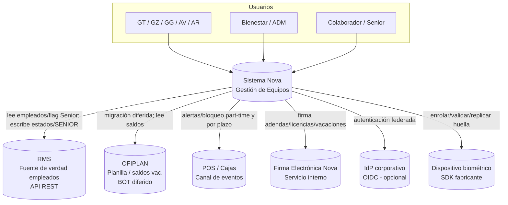
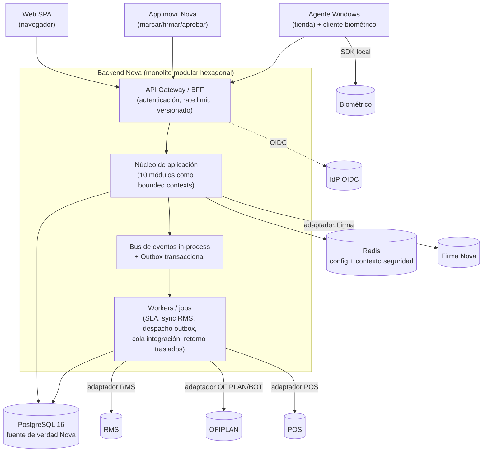
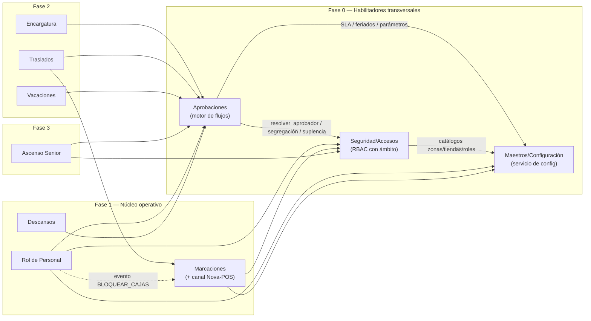
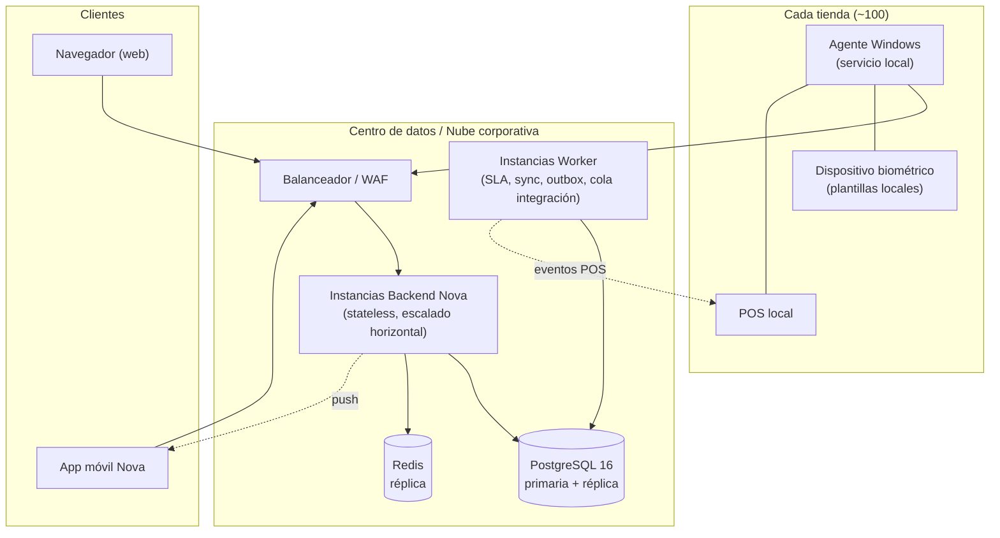

# Arquitectura de Software — Sistema Nova

| Campo | Valor |
|---|---|
| Documento | Arquitectura general del sistema Nova |
| Sistema | Nova — Gestión de Equipos (retail Cadena / Lukers, ~100 tiendas) |
| Versión | 1.0 |
| Fecha | 30/05/2026 |
| Elaborado por | Arquitecto de Software |
| Estado | PROPUESTA — contiene recomendaciones `⚠️ PENDIENTE APROBACIÓN TI` |
| Documentos base | alcance-nova.md v1.0, ENT-MOD-SEGU-001 v1.0, ENT-MOD-MAES-001 v1.2, ENT-MOD-APRO-001 v1.0, ENT-MOD-ASCE-001 v1.2, ENT-MOD-ROLP-001, ENT-MOD-MARC-001, ENT-MOD-TRAS-001, ENT-MOD-VAC-001, ENT-MOD-ENCA-001, ENT-MOD-DESC-001 |
| ADRs asociados | ADR-001 a ADR-008 (carpeta `adr/`) |
| Contratos | `contratos-integracion.md`, `requisitos-no-funcionales.md` |

> Nota de cumplimiento (rol Arquitecto): este documento no contiene credenciales, IPs ni configuraciones reales. Todo valor de infraestructura se expresa como variable de entorno o valor de ejemplo. Las integraciones externas (RMS, OFIPLAN, POS, Firma, IdP) se tratan como `⚠️ PENDIENTE APROBACIÓN TI` hasta confirmación documental de TI y de cada equipo dueño.

---

## 1. Visión de arquitectura

Nova es una plataforma de gestión de equipos de tienda con tres frentes de cliente (web, app móvil, dispositivos en tienda) que orquesta diez módulos de negocio sobre un backend único, integrado con cuatro sistemas corporativos externos (RMS, OFIPLAN, POS, Firma Electrónica Nova) y un proveedor de identidad opcional (IdP). La arquitectura debe satisfacer tres tensiones centrales detectadas en el análisis:

1. **Transversalidad fuerte.** Seguridad, Maestros y Aprobaciones son consumidos por los 7 módulos funcionales. El análisis los declara habilitadores de Fase 0. Esto empuja a un **núcleo cohesionado** con contratos internos estables, no a microservicios prematuros.
2. **Consistencia de negocio crítica.** Hay efectos con impacto legal/económico (bloqueo de cajas POS, escritura del flag SENIOR en RMS, días indemnizables) que exigen **transacciones atómicas e idempotencia** end-to-end. La consistencia eventual descontrolada es un riesgo, no una virtud, aquí.
3. **Integraciones heterogéneas y poco maduras.** RMS (API REST síncrona), OFIPLAN (BOT diferido), POS (canal de eventos), Firma (servicio interno), biométrico (SDK del fabricante), Agente Windows. Varias siguen `PENDIENTE APROBACIÓN TI`. Esto obliga a aislar cada integración tras un **adaptador (puerto/adaptador, arquitectura hexagonal)** para que un cambio de contrato externo no se propague al dominio.

### 1.1 Estilo arquitectónico elegido: **Monolito Modular (modular monolith) + Hexagonal por módulo + Event-Driven interno**

Decisión registrada en **ADR-006**. Resumen del razonamiento:

- El volumen (~100 tiendas, dominio acotado, un solo equipo de producto en fases) **no justifica microservicios** ni su coste operativo (despliegue distribuido, consistencia distribuida, observabilidad distribuida). Los microservicios introducirían justamente la consistencia eventual que el negocio penaliza.
- Un **monolito modular** con límites de módulo explícitos (cada módulo = un *bounded context* con su propio esquema lógico y su API interna) da el aislamiento conceptual del DDD sin el coste de red. Permite a DBA, Backend y Frontend trabajar en paralelo por módulo contra contratos estables.
- Cada módulo se diseña **hexagonal**: dominio puro en el centro, puertos de entrada (API/casos de uso) y puertos de salida (repositorios, adaptadores de integración). Los sistemas externos viven detrás de adaptadores → un cambio de RMS no toca el dominio.
- La comunicación entre módulos es **síncrona por contrato interno** cuando hay dependencia transaccional (p. ej. autorizar una acción) y **asíncrona por eventos de dominio** cuando es notificación/reacción (p. ej. "AscensoAprobado" → habilitar Senior en Rol/Encargatura). Un **bus de eventos in-process con outbox transaccional** evita pérdida de eventos sin introducir un broker distribuido.
- El diseño preserva la **ruta de extracción**: si en el futuro un módulo necesita escalar de forma independiente (candidato natural: Marcaciones, por el pico biométrico), su frontera hexagonal y su contrato permiten extraerlo a servicio sin reescribir el dominio.

---

## 2. Stack tecnológico propuesto

Detalle y alternativas en **ADR-007 (stack)**. Resumen y justificación:

| Capa | Propuesta | Justificación corta |
|---|---|---|
| Backend | **.NET 8 (LTS) / C#** o **Java 21 (LTS) / Spring Boot 3** | Ecosistema enterprise, soporte LTS largo, integración nativa con AD/Entra ID (relevante para SSO, VAC-SEGU-01), ORM maduro para el modelo relacional transaccional. La organización debe elegir según skills internos de TI. `⚠️ PENDIENTE APROBACIÓN TI` (definición del lenguaje base). |
| Base de datos | **PostgreSQL 16** (relacional, fuente de verdad de Nova) | El dominio es altamente relacional y transaccional (RBAC con ámbito, aprobaciones, parámetros versionados con vigencia). ACID es requisito, no opción. Soporta JSONB para payloads de parámetros tipo LISTA/RANGO. |
| Caché / configuración | **Redis** | Caché del servicio de configuración (CU-MAES-06), del contexto de seguridad (permisos/ámbito por sesión), rate limiting, y soporte a la degradación DEGRADABLE (VAC-MAES-08, ADR-005). |
| Mensajería interna | **Outbox transaccional en PostgreSQL + worker de despacho** | Eventos de dominio sin broker externo. Garantía at-least-once + idempotencia en el consumidor (base de VAC-APRO-13). |
| Cola de integración externa | **Cola persistente** (PostgreSQL-backed o broker ligero si TI lo aprueba) | Reintentos con backoff hacia RMS/OFIPLAN/POS sin acoplar el request del usuario al sistema externo. |
| API | **REST + OpenAPI 3.0** (interno y hacia clientes) | Contratos versionados consumibles por web y móvil; ver `api-contracts/`. |
| Web | **SPA** (Angular o React) | App de gestión rica (calendario del Rol, bandejas de aprobación). |
| Móvil | **App nativa o híbrida (Flutter / React Native)** | Marcación/firma/aprobación en campo; cámara (selfie firma), GPS, push. |
| Agente de tienda | **Servicio Windows (.NET worker)** + cliente del SDK biométrico | Alertas nativas de inasistencia y puente con el dispositivo biométrico local. |
| Identidad | **IdP corporativo OIDC** (Entra ID / Keycloak) recomendado; local como fallback | Ver ADR-001 (VAC-SEGU-01). |
| Observabilidad | **Logs estructurados + OpenTelemetry (trazas/métricas)** | Trazabilidad distribuida de las cadenas Nova→RMS/OFIPLAN/POS. |

> El stack concreto de lenguaje/SPA/móvil es una recomendación; la decisión final depende de los skills del equipo de TI y se confirma en ADR-007. La arquitectura (hexagonal + monolito modular + outbox) es independiente del lenguaje elegido.

---

## 3. Modelo C4

### 3.1 Nivel 1 — Contexto

### 3.2 Nivel 2 — Contenedores

### 3.3 Nivel 3 — Componentes (módulos del núcleo y dependencias)

### 3.4 Componentes transversales (compartidos por todos los módulos)

| Componente | Responsabilidad | Consumidores |
|---|---|---|
| **Servicio de Autenticación** (SEGU) | Login, sesión, OIDC opcional, contexto de seguridad. | API Gateway, todos |
| **Servicio de Autorización / enforcement** (SEGU) | `autorizar(usuario, permiso, ámbito)`; fallo seguro (ADR-005). | Todos los módulos |
| **Servicio de Resolución de aprobador** (SEGU) | `resolver_aprobador`, `resolver_superior`, `validar_segregacion`, `consultar_delegacion_suplencia`. | Aprobaciones |
| **Servicio de Configuración** (MAES) | `getParametro(clave, fecha, ámbito)` con vigencia y criticidad. | Todos |
| **Motor de Aprobaciones** (APRO) | Máquina de estados de flujos, SLA, callbacks idempotentes (ADR-003). | 7 funcionales |
| **Adaptadores de integración** | Puertos hacia RMS/OFIPLAN/POS/Firma/IdP/biométrico. | Módulos dueños |
| **Bus de eventos + Outbox** | Eventos de dominio at-least-once. | Núcleo + workers |
| **Auditoría** | Logs inmutables de seguridad, configuración y aprobaciones. | Todos |

---

## 4. Vista de despliegue

Notas de despliegue:

- **Backend stateless** → escala horizontal tras el balanceador; el estado de sesión vive en Redis/JWT, no en memoria de instancia.
- **Workers separados** del path de request del usuario: las integraciones lentas o no disponibles (RMS/OFIPLAN/POS) no degradan la latencia interactiva.
- **Agente Windows** por tienda: puente local con el biométrico (plantillas locales, RN-MARC) y con el POS local; reporta al backend central. Las alertas de inasistencia son nativas en la máquina de tienda.
- **Plantillas biométricas locales por tienda** con replicación a destino en traslados (responsabilidad de Marcaciones + Traslados); la huella no centraliza captura.
- **Datos en tránsito siempre cifrados (TLS).** El detalle de red/IP es responsabilidad de DevOps/TI; aquí solo se referencian como variables. `⚠️ PENDIENTE APROBACIÓN TI`.

---

## 5. Seguridad transversal (resumen; detalle en `seguridad-transversal.md` y ADRs 001/002/005)

La seguridad se diseña desde el inicio y se coordina con el agente `seguridad-ti`. Capas de defensa:

1. **Autenticación** — OIDC contra IdP corporativo recomendado, con credenciales locales como fallback configurable (`SEGU_AUTENTICACION_METODO`). Ver **ADR-001** (VAC-SEGU-01).
2. **Credenciales locales** — hash con **Argon2id** (o bcrypt cost ≥ 12 si la plataforma no soporta Argon2). Ver **ADR-002** (VAC-SEGU-09).
3. **MFA** — recomendado obligatorio para R-ADM y R-GG; configurable por rol (`SEGU_MFA_HABILITADO_POR_ROL`). Ver baseline §6 (VAC-SEGU-02/17).
4. **Autorización (RBAC con ámbito)** — enforcement `permiso + ámbito` en cada acción sensible (CU-SEGU-05). **Fallo seguro**: denegar por defecto en escritura/aprobación. Ver **ADR-005** (VAC-SEGU-13).
5. **Segregación de funciones** — solicitante ≠ aprobador habilitado por SEGU (RN-SEGU-19), no deshabilitable sin aprobación PO/TI.
6. **Secretos** — credenciales de integración (RMS/OFIPLAN/POS/Firma/IdP) en gestor de secretos / variables de entorno; nunca en código ni en diagramas.
7. **Cifrado en tránsito** — TLS extremo a extremo, incluido el tramo agente de tienda → backend.
8. **Datos sensibles** — identidades, vínculo a código de empleado RMS, historial de cumplimiento (ASCE) y biometría se tratan como `⚠️ DATO SENSIBLE`, con acceso restringido por ámbito y auditoría.
9. **Auditoría inmutable** — logs de seguridad, configuración y aprobaciones (append-only). Retención `⚠️ PENDIENTE APROBACIÓN TI` (VAC-SEGU-16).

---

## 6. Baseline de política de seguridad (recomendación — VAC-MAES-17 / VAC-SEGU-02 — `⚠️ PENDIENTE APROBACIÓN TI`)

Arquitectura/Seguridad propone el siguiente baseline concreto para que TI confirme o ajuste. Es coherente con OWASP ASVS y NIST SP 800-63B, y con los valores ya pre-cargados en MAES-001 §7.6. Donde se eleva el valor del analista, se justifica.

| Parámetro (clave Maestros) | Valor analista (MAES) | **Baseline recomendado** | Justificación |
|---|---|---|---|
| `SEGU_PWD_LONGITUD_MINIMA` | 10 | **12** | NIST/ASVS priorizan longitud sobre complejidad; 12 es el mínimo robusto actual para cuentas de gestión. |
| `SEGU_PWD_COMPLEJIDAD` | MAYUS+MINUS+NUM+SIMB | **Mantener, pero NO bloqueante si se usa IdP/SSO** | Si SSO está activo, la política la rige el IdP corporativo; la complejidad local aplica solo al fallback. |
| `SEGU_PWD_EXPIRACION_DIAS` | 90 | **90 para roles privilegiados; sin expiración forzada para EMP/SENIOR si hay MFA** | NIST desaconseja expiración periódica salvo indicio de compromiso; se conserva 90 en privilegiados por compliance corporativo. |
| `SEGU_PWD_HISTORIAL_NO_REUSO` | 5 | **5** | Adecuado. |
| `SEGU_LOGIN_MAX_INTENTOS` | 5 | **5** | Equilibrio bloqueo/DoS. |
| `SEGU_LOGIN_BLOQUEO_MINUTOS` | 30 | **15 con backoff progresivo** | 15 min reduce fricción legítima; backoff (15→30→60) frena fuerza bruta. |
| `SEGU_SESION_INACTIVIDAD_MIN` | 30 | **15 (web gestión) / 60 (app móvil EMP)** | Sesiones de gestión (acceso a datos sensibles) más cortas; app de campo más permisiva por UX. |
| `SEGU_SESION_ABSOLUTA_HORAS` | 12 | **8 (web) / 24 (app móvil)** | 8 h ≈ jornada para gestión; móvil de campo tolera 24 h. |
| `SEGU_AUTENTICACION_METODO` | LOCAL | **SSO (OIDC) si TI dispone de IdP; LOCAL como fallback** | Ver ADR-001. |
| `SEGU_MFA_HABILITADO_POR_ROL` | [] | **[R-ADM, R-GG, R-GG-SUP]** | MFA obligatorio en alto privilegio (roles que aprueban/configuran). Recomendación de compliance. |

> Estos valores entran como configuración en Maestros; no son código. Su confirmación es de TI/Seguridad. La longitud, expiración y MFA tienen impacto de compliance → quedan marcados `⚠️ PENDIENTE APROBACIÓN TI`.

---

## 7. Escalabilidad

- **Stateless + escalado horizontal** del backend; el cuello de botella esperado no es CPU sino las **integraciones externas** y los **picos de marcación biométrica** (entrada/salida de turno simultánea en ~100 tiendas).
- **Marcaciones** es el candidato a extracción a servicio independiente si el pico lo exige (la frontera hexagonal ya lo permite). Mitigación inicial: el procesamiento de marcación es liviano (validar contra programación activa) y el agente de tienda absorbe el evento biométrico local.
- **Servicio de configuración** se cachea agresivamente en Redis con invalidación por versión/vigencia (los parámetros cambian poco). Reduce carga sobre PostgreSQL para el patrón "leer parámetro vigente a fecha".
- **Contexto de seguridad** (permisos/ámbito) se cachea por sesión con TTL corto e invalidación ante cambio de rol/ámbito → evita recomputar el RBAC con ámbito en cada request.
- **Outbox + workers** desacoplan las escrituras a RMS/OFIPLAN/POS del request interactivo; los reintentos no afectan SLA de usuario.
- **PostgreSQL** con réplica de lectura para reportes (historiales, auditoría, exportaciones a Excel de APRO/SEGU).

## 8. Observabilidad

- **Logs estructurados** (JSON) con `correlation_id` que atraviesa cliente → backend → adaptador externo → callback. Permite reconstruir una cadena Nova→RMS→callback completa.
- **Métricas RED** (Rate, Errors, Duration) por endpoint y por adaptador de integración; **USE** (Utilization, Saturation, Errors) en PostgreSQL/Redis/colas.
- **Trazas distribuidas (OpenTelemetry)** especialmente en las cadenas críticas: aprobación de ascenso → escritura SENIOR en RMS; vencimiento de plazo del Rol → callback BLOQUEAR_CAJAS en POS.
- **Métricas de negocio/integración clave a monitorizar:** antigüedad de la última sincronización RMS de tiendas/dotación (alerta si supera umbral, RN-MAES-05), profundidad y edad de la cola de integración, tasa de callbacks reintentados (VAC-APRO-13), nº de solicitudes en `PendienteResolucionAprobador` (jerarquía incompleta, RN-SEGU-17), nº de operaciones bloqueadas por parámetro BLOQUEANTE no disponible (RN-MAES-19).
- **Alertas** a destinatarios configurados en Maestros (`APRO_ALERTA_SLA_DESTINATARIOS`, `ASCE_ALERTA_SLA_DESTINATARIOS`) y al ADM ante `APROBADOR_NO_RESOLUBLE` y antigüedad de datos RMS.
- Coordinación de SLOs y dashboards con DevOps; retención de logs de auditoría `⚠️ PENDIENTE APROBACIÓN TI` (VAC-SEGU-16).

---

## 9. Mapa de resolución de vacíos técnicos

| Vacío | Dónde se resuelve | Estado |
|---|---|---|
| VAC-SEGU-01 (SSO/IdP) | ADR-001 | Recomendación, `⚠️ PENDIENTE APROBACIÓN TI` |
| VAC-SEGU-09 (hashing) | ADR-002 | Resuelto (Argon2id) |
| VAC-SEGU-10 (vínculo/baja RMS) | `contratos-integracion.md` §4 | Contrato propuesto, `⚠️ PENDIENTE APROBACIÓN TI` |
| VAC-SEGU-13 (degradación enforcement) | ADR-005 | Resuelto (fallo seguro) |
| VAC-MAES-12 (sync RMS tiendas/puestos/dotación) | `contratos-integracion.md` §3 | Contrato propuesto, `⚠️ PENDIENTE APROBACIÓN TI` |
| VAC-MAES-16 (plazos Rol como SLA) | ADR-008 / §10 | Decidido (gestión interna del Rol con callback al motor) |
| VAC-MAES-17 (valores política seguridad) | §6 de este doc | Baseline propuesto, `⚠️ PENDIENTE APROBACIÓN TI` |
| VAC-MAES-18 (convención claves parámetro) | ADR-004 | Decidido (tabla relacional con clave lógica derivada) |
| VAC-APRO-13 (idempotencia callbacks) | ADR-003 | Resuelto (outbox + idempotency key) |
| VAC-ASCE-06 (endpoint RMS flag SENIOR / descenso) | `contratos-integracion.md` §2 | Contrato propuesto, `⚠️ PENDIENTE APROBACIÓN TI` |

---

## 10. VAC-MAES-16 — Plazos del Rol: ¿SLA del motor o gestión interna del Rol? (decisión)

**Decisión (registrada también en ADR-008): el Rol de Personal gestiona internamente sus plazos horarios (`ROL_PLAZO_*`) y usa el motor de Aprobaciones SOLO para la decisión jerárquica del GG. NO se exponen como `APRO_SLA_FL_ROL_*`.**

Razonamiento:

- Los plazos del Rol son **deadlines de calendario absoluto** (jueves 23:59, viernes mediodía, sábado 10:00, domingo mediodía) atados a la semana operativa domingo-sábado, no SLAs relativos "X días hábiles desde que la tarea entra a una bandeja" como los demás flujos (FL_LSGH, FL_ASCE: "2/5 días hábiles desde la solicitud").
- El motor de Aprobaciones modela SLA como **duración relativa al inicio del nivel** (RN-APRO-13). Forzar deadlines absolutos de calendario semanal dentro de ese modelo lo distorsiona y obliga a casos especiales.
- La **consecuencia** del vencimiento del plazo del Rol (BLOQUEAR_CAJAS en POS) sí se canaliza por el mecanismo de callback del motor: el Rol arma un nivel del flujo FL_ROL con consecuencia `CALLBACK_MODULO = BLOQUEAR_CAJAS` (RN-APRO-19, ya previsto en la plantilla FL_ROL). Es decir: **el Rol decide cuándo se vence (cron interno sobre `ROL_PLAZO_*`), y reutiliza el callback idempotente del motor para ejecutar el efecto.** Lo mejor de ambos: cronología propia del Rol + idempotencia y auditoría centralizadas del motor.

Consecuencia para Maestros: **no se crean claves `APRO_SLA_FL_ROL_*`.** Se conservan los `ROL_PLAZO_*` existentes (BLOQUEANTE, ya catalogados). VAC-APRO-03 queda alineado con esta misma decisión.

---

## 11. Qué puede arrancar en paralelo

- **DBA:** modelo de datos de SEGU (usuarios, roles, permisos, AsignacionUsuarioRolAmbito, jerarquía, delegación/suplencia, auditoría), MAES (parámetro versionado con vigencia + clave lógica de ADR-004, tabla flujo-nivel-parámetro), APRO (flujo, nivel, solicitud, tarea, outbox + idempotency keys, log inmutable). Esquema por bounded context.
- **Backend:** servicios transversales (autenticación, autorización con fallo seguro ADR-005, servicio de configuración con criticidad, motor de aprobaciones con callbacks idempotentes ADR-003) y los adaptadores de integración con sus contratos (`contratos-integracion.md`).
- **Frontend:** contra los contratos OpenAPI (login/contexto de seguridad, bandeja unificada de aprobaciones, calendario del Rol, vistas con filtrado por ámbito).
- **Seguridad TI:** confirmar baseline §6, ADR-001 (SSO), ADR-002 (hashing), retención de auditoría.
