# Modelo de Datos — Fase 0 (Cimientos): Seguridad, Maestros y Aprobaciones

| Campo | Valor |
|---|---|
| Documento | Modelo de datos relacional de la Fase 0 de Nova |
| Sistema | Nova — Gestión de Equipos (retail Cadena / Lukers, ~100 tiendas) |
| Motor | PostgreSQL 16 |
| Estilo | Monolito modular — un esquema PostgreSQL por bounded context (`segu`, `maes`, `apro`) |
| Versión | 1.0 |
| Fecha | 30/05/2026 |
| Elaborado por | DBA (Database Architect) |
| Estado | PROPUESTA — alineada a ENT-MOD-SEGU-001 v1.0, ENT-MOD-MAES-001 v1.2, ENT-MOD-APRO-001 v1.0, ADR-003, ADR-004, contratos-integracion.md |
| Documentos base | arquitectura-nova.md §2/§3/§11, ADR-003 (outbox/idempotencia), ADR-004 (clave lógica derivada de parámetros), ENT-MOD-SEGU-001 §6/§7, ENT-MOD-MAES-001 §6/§7, ENT-MOD-APRO-001 §6/§7, contratos-integracion.md §3/§4/§6/§7 |

> Nota de cumplimiento (rol DBA): este documento usa exclusivamente valores ficticios en ejemplos y datos semilla. Los campos que tocan identidad o credenciales se marcan `⚠️ DATO SENSIBLE` y su tratamiento se detalla en `datos-sensibles.md`. No se transcriben datos reales de RMS ni de producción.

---

## 0. Principios y convenciones de modelado

1. **Un esquema por bounded context.** `segu` (Seguridad/Accesos), `maes` (Maestros/Configuración), `apro` (Aprobaciones). El acoplamiento entre esquemas es por **referencia lógica, no por FK física cross-schema** cuando cruza una frontera de módulo que en el futuro podría extraerse (preserva la ruta de extracción del ADR-006). Dentro de un mismo esquema sí se usan FKs físicas.
2. **Frontera de identidades (crítica).** Las identidades —`usuario`, asignación usuario-rol-ámbito, jerarquía, delegación y suplencia— viven **solo** en `segu`. Maestros (`maes`) guarda el **catálogo de roles funcionales** y la estructura organizacional (empresa, zona, tienda, puesto) y los **parámetros** `SEGU_*` (configuración, no identidad). No se duplica ninguna identidad en `maes` (EX-SEGU-02, RN-MAES-18, sección 9.4 de MAES).
3. **Referencia a Maestros.** `segu` y `apro` referencian empresa/zona/tienda/puesto/rol **por identificador** de `maes`. Por ser todos co-residentes en la misma base PostgreSQL y por la fuerte necesidad de integridad del RBAC con ámbito, se permiten FKs físicas `segu`→`maes` y `apro`→`maes` para catálogos estables (empresa, zona, tienda, rol, flujo). Las referencias a `segu.usuario` desde `apro` (solicitante, aprobador) se modelan como **referencia lógica** (UUID sin FK física) porque Aprobaciones es candidato a consumir Seguridad por servicio, no por join.
4. **Datos de RMS = solo lectura + marca de origen + vigencia.** Tienda, puesto y dotación mínima se sincronizan desde RMS (upsert idempotente, contratos §3). Se marcan con `origen` y, donde aplica, vigencia. El `codigo_empleado` es el único vínculo persistido de identidad RMS (RN-SEGU-26); Nova **no** almacena datos personales del empleado como fuente de verdad.
5. **Normalización a 3FN** salvo desnormalizaciones justificadas (ver §6). Toda PK es `UUID` salvo catálogos enumerados de cardinalidad fija y semántica estable (empresa, rol, permiso) que usan **clave natural corta** (`VARCHAR`).
6. **Vigencia temporal (versionado bitemporal simplificado).** Parámetros, feriados, asignaciones, delegaciones y suplencias usan el par `(vigencia_desde, vigencia_hasta)`. El servicio de configuración resuelve "valor vigente a una fecha" (RN-MAES-14). No hay borrado físico de versiones (se conservan para reconstruir el pasado y para auditoría).
7. **Auditoría.** Cada esquema tiene su log inmutable append-only (`segu.auditoria_seguridad`, `maes.auditoria_configuracion`, `apro.auditoria_aprobacion`). Sin `UPDATE`/`DELETE` por diseño (privilegios y, opcionalmente, trigger de rechazo).
8. **Tipos PostgreSQL nativos:** `uuid`, `timestamptz` (siempre con zona; el negocio opera semana domingo-sábado en hora local Perú, se almacena en UTC), `date`, `jsonb` (valores de parámetro LISTA/RANGO y payloads de outbox), tipos `ENUM` nativos para enumeraciones estables, `citext` para `nombre_usuario` y `correo_contacto` (login/correo case-insensitive).
9. **Columnas de auditoría estándar** en tablas mutables de negocio: `created_at`, `updated_at`, `created_by`, `updated_by` (referencia lógica a `segu.usuario`).

---

## 1. Diagrama Entidad-Relación (Mermaid)

```mermaid
erDiagram
    %% ===================== MAESTROS (maes) =====================
    EMPRESA ||--o{ ZONA : "agrupa (opcional)"
    EMPRESA ||--o{ TIENDA : contiene
    ZONA ||--o{ TIENDA : agrupa
    EMPRESA ||--o{ PARAMETRO : "diferencia por empresa"
    PUESTO ||--o{ PUESTO_LIMITE_EMPRESA : "límites por empresa"
    EMPRESA ||--o{ PUESTO_LIMITE_EMPRESA : aplica
    FERIADO ||--o{ FERIADO_AMBITO : "aplica a tiendas/zonas (LOCAL)"
    ROL_CATALOGO ||--o{ ROL_PERMISO : compone
    PERMISO ||--o{ ROL_PERMISO : "incluido en"
    PARAMETRO ||--o{ PARAMETRO_AUDIT : versiona

    %% ===================== SEGURIDAD (segu) =====================
    USUARIO ||--|| CREDENCIAL : tiene
    USUARIO ||--o{ CREDENCIAL_HISTORIAL : "historial no-reuso"
    USUARIO ||--o{ ASIGNACION_ROL_AMBITO : "tiene roles con ámbito"
    USUARIO ||--o{ SESION : abre
    USUARIO ||--o{ DELEGACION : "delega (titular)"
    USUARIO ||--o{ SUPLENCIA : "suple/es suplido"
    ASIGNACION_ROL_AMBITO ||--o{ ASIGNACION_ZONA : "multi-zona (R-GZ)"
    NODO_JERARQUIA ||--o{ NODO_JERARQUIA : "superior de"
    ROL_CATALOGO ||--o{ ASIGNACION_ROL_AMBITO : "rol asignado (ref maes)"
    ROL_CATALOGO ||--o{ NODO_JERARQUIA : "rol del nodo (ref maes)"

    %% ===================== APROBACIONES (apro) =====================
    FLUJO_APROBACION ||--o{ NIVEL_APROBACION : "compuesto por niveles"
    FLUJO_APROBACION ||--o{ SOLICITUD : instancia
    NIVEL_APROBACION ||--o{ TAREA : genera
    SOLICITUD ||--o{ TAREA : "tiene tareas por nivel"
    SOLICITUD ||--o{ OUTBOX_EVENTO : produce
    OUTBOX_EVENTO ||--o{ EFECTO_CALLBACK_APLICADO : "idempotencia de efecto"
    SOLICITUD ||--o{ AUDITORIA_APROBACION : audita
    NIVEL_APROBACION }o--o| PARAMETRO : "clave_sla (ref lógica maes)"

    USUARIO {
        uuid id_usuario PK
        citext nombre_usuario UK
        enum tipo_usuario
        varchar codigo_empleado_rms "DATO SENSIBLE, vínculo RMS"
        citext correo_contacto "DATO SENSIBLE"
        enum estado
        enum metodo_autenticacion
        boolean mfa_habilitado
    }
    CREDENCIAL {
        uuid id_credencial PK
        uuid id_usuario FK
        varchar hash_password "DATO SENSIBLE (Argon2id)"
        timestamptz fecha_ultimo_cambio
        boolean requiere_cambio
        int intentos_fallidos
        timestamptz bloqueado_hasta
    }
    ASIGNACION_ROL_AMBITO {
        uuid id_asignacion PK
        uuid id_usuario FK
        varchar id_rol "ref maes.rol_catalogo"
        enum tipo_ambito
        varchar id_empresa
        uuid id_tienda
        text justificacion
        date vigencia_desde
        date vigencia_hasta
        enum estado
    }
    PARAMETRO {
        uuid id_parametro PK
        varchar clave "clave lógica derivada (ADR-004)"
        enum modulo
        varchar flujo "ref apro.flujo (nullable)"
        varchar nivel "ref apro.nivel (nullable)"
        varchar nombre_parametro
        enum ambito
        varchar id_empresa
        jsonb valor
        enum criticidad_consumo
        boolean es_impacto_negocio
        date vigencia_desde
        date vigencia_hasta
    }
    SOLICITUD {
        uuid id_solicitud PK
        uuid id_flujo FK
        enum tipo_objeto
        uuid id_objeto
        uuid id_solicitante "ref lógica segu.usuario"
        uuid id_zona
        varchar id_empresa
        int nivel_actual
        enum estado
    }
    TAREA {
        uuid id_tarea PK
        uuid id_solicitud FK
        uuid id_nivel FK
        uuid id_aprobador_titular "ref lógica segu.usuario"
        uuid id_aprobador_efectivo
        enum en_calidad_de
        enum estado
        timestamptz fecha_vencimiento_sla
    }
    OUTBOX_EVENTO {
        uuid id_evento PK
        uuid id_solicitud FK
        varchar idempotency_key UK
        enum tipo_transicion
        varchar accion_callback
        jsonb payload
        enum estado_despacho
        int intentos
    }
    EFECTO_CALLBACK_APLICADO {
        uuid id_efecto PK
        varchar idempotency_key UK
        varchar modulo_consumidor
        timestamptz aplicado_en
    }
```

---

## 2. Esquema `maes` — Maestros / Configuración

### Tabla: maes.empresa | Descripción: Maestro de empresas/cadenas (Cadena, Lukers) y sus reglas diferenciales (MAES §7.1)
| Campo | Tipo | NULL | Default | FK | Descripción |
|-------|------|------|---------|-----|-------------|
| id_empresa | VARCHAR(10) | NO | — | PK | Clave natural: `CADENA`, `LUKERS`. |
| nombre | VARCHAR(120) | NO | — | — | Nombre comercial. |
| dia_inicio_semana | maes.dia_semana | NO | `'DOMINGO'` | — | Inicio de semana laboral; parametrizable por empresa (VAC-MAES-14: hoy idéntico). |
| existe_cobertura_tipo_venta | BOOLEAN | NO | false | — | `true` en Lukers por defecto (RN-MAES-13). |
| tope_cuota_asesor | NUMERIC(12,2) | SÍ | — | — | Valor de referencia histórico (RN-ROLP-21); el tope operativo migra a parámetro por tienda (VAC-MAES-04). |
| estado | maes.estado_catalogo | NO | `'VIGENTE'` | — | VIGENTE / DESACTIVADO. |
| created_at / updated_at / created_by / updated_by | (estándar) | | | | Auditoría. |

`dias_no_compensables` NO se modela como columna de empresa: se gestiona como parámetro `DESC_DIAS_NO_COMPENSABLES` por empresa (lista, VAC-MAES-02 pendiente del negocio) — evita un array semiestructurado en el maestro y respeta el versionado/vigencia del catálogo de parámetros.

### Tabla: maes.zona | Descripción: Catálogo de zonas (MAES §7.2)
| Campo | Tipo | NULL | Default | FK | Descripción |
|-------|------|------|---------|-----|-------------|
| id_zona | UUID | NO | gen_random_uuid() | PK | Identificador. |
| nombre | VARCHAR(120) | NO | — | — | Nombre de la zona. |
| id_empresa | VARCHAR(10) | SÍ | — | maes.empresa | Empresa principal si la zona es mono-empresa (nullable, VAC-SEGU-07 abierto). |
| estado | maes.estado_catalogo | NO | `'VIGENTE'` | — | VIGENTE / DESACTIVADO. |

Índices: `idx_zona_empresa ON maes.zona(id_empresa)`.

### Tabla: maes.tienda | Descripción: Maestro de tiendas; base sincronizada de RMS + enriquecimiento Nova (MAES §7.3)
| Campo | Tipo | NULL | Default | FK | Descripción |
|-------|------|------|---------|-----|-------------|
| id_tienda | UUID | NO | gen_random_uuid() | PK | Identificador Nova, alineado con RMS. |
| codigo | VARCHAR(30) | NO | — | UK | Código de tienda (fuente RMS). |
| nombre | VARCHAR(160) | NO | — | — | Nombre. |
| id_empresa | VARCHAR(10) | NO | — | maes.empresa | Una única empresa (RN-MAES-06). |
| id_zona | UUID | NO | — | maes.zona | Una única zona vigente (RN-MAES-06). |
| ubicacion | maes.ubicacion_tienda | NO | — | — | CC / PC (RN-MAES-04). |
| dotacion_minima_asesores | INTEGER | NO | 0 | — | **Solo lectura, fuente RMS** (RN-MAES-05). `CHECK >= 0`. |
| fecha_vigencia_dotacion | DATE | SÍ | — | — | Vigencia de la dotación sincronizada (contratos §3). |
| estado_operativo | maes.estado_tienda | NO | `'ACTIVA'` | — | ACTIVA / SUSPENDIDA / CERRADA. |
| fecha_efecto_estado | DATE | SÍ | — | — | Obligatoria si SUSPENDIDA/CERRADA. |
| origen | maes.origen_dato | NO | `'RMS'` | — | RMS (base) / NOVA (atributos enriquecidos). |
| rms_sync_at | TIMESTAMPTZ | SÍ | — | — | Última sincronización RMS (monitoreo antigüedad, RN-MAES-05). |

Índices: `idx_tienda_zona`, `idx_tienda_empresa`, `idx_tienda_estado_op` (parcial WHERE estado_operativo='ACTIVA'). Unicidad: `uk_tienda_codigo(codigo)`.
Integridad RMS: el alta/baja de tienda lo hace RMS (RN-MAES-07); el upsert idempotente del sync (contratos §3) usa `codigo` como clave de conflicto.

### Tabla: maes.puesto | Descripción: Catálogo de puestos (base RMS) (MAES §7.5)
| Campo | Tipo | NULL | Default | FK | Descripción |
|-------|------|------|---------|-----|-------------|
| id_puesto | UUID | NO | gen_random_uuid() | PK | Alineado con RMS. |
| codigo | VARCHAR(40) | NO | — | UK | Código de puesto (fuente RMS). |
| nombre | VARCHAR(120) | NO | — | — | Nombre del puesto. |
| genera_ratios_senior | BOOLEAN | NO | false | — | Genera columnas de ratios en el Rol. |
| habilitado_senior | BOOLEAN | NO | false | — | Elegible para ascenso (consistencia con `ASCE_PUESTOS_HABILITADOS_SENIOR`). |
| origen | maes.origen_dato | NO | `'RMS'` | — | RMS / NOVA. |
| rms_sync_at | TIMESTAMPTZ | SÍ | — | — | Última sincronización. |

### Tabla: maes.puesto_limite_empresa | Descripción: Límites operativos por puesto y empresa (RN-MAES-12); normaliza el "por empresa" (3FN)
| Campo | Tipo | NULL | Default | FK | Descripción |
|-------|------|------|---------|-----|-------------|
| id_limite | UUID | NO | gen_random_uuid() | PK | Identificador. |
| id_puesto | UUID | NO | — | maes.puesto | Puesto. |
| id_empresa | VARCHAR(10) | NO | — | maes.empresa | Empresa. |
| max_dias_descanso_laboral | INTEGER | NO | — | — | Máximo días de descanso laboral/semana. `CHECK 0..7`. |
| participa_cobertura_tienda | BOOLEAN | NO | false | — | Participa de Cobertura de Tienda. |
| participa_cobertura_tipo_venta | BOOLEAN | NO | false | — | Solo si empresa lo permite (RN-MAES-13, validado por trigger/CHECK aplicativo). |
| estados_elegibles_rol | JSONB | NO | `'[]'` | — | Lista de estados elegibles en el Rol. |

Unicidad: `uk_puesto_limite(id_puesto, id_empresa)`.

### Tabla: maes.feriado | Descripción: Calendario maestro de feriados, modelo híbrido REGIONAL_OFICIAL / MANUAL_ADM, versionado (MAES §7.4)
| Campo | Tipo | NULL | Default | FK | Descripción |
|-------|------|------|---------|-----|-------------|
| id_feriado | UUID | NO | gen_random_uuid() | PK | Identificador de versión. |
| fecha | DATE | NO | — | — | Fecha del feriado. |
| descripcion | VARCHAR(160) | NO | — | — | Nombre. |
| alcance | maes.alcance_feriado | NO | — | — | NACIONAL / LOCAL. |
| origen | maes.origen_feriado | NO | — | — | REGIONAL_OFICIAL / MANUAL_ADM (RN-MAES-01). |
| empresas_aplicables | JSONB | NO | — | — | Lista de empresas (`["CADENA","LUKERS"]`). |
| compensable | BOOLEAN | NO | true | — | Si genera compensación al laborarse (consumido por Descansos). |
| vigencia_desde | DATE | NO | — | — | Inicio de vigencia de la versión. |
| vigencia_hasta | DATE | SÍ | — | — | NULL = vigente (RN-MAES-03 no retroactivo). |

Tablas/índices de apoyo: `maes.feriado_ambito(id_feriado, tipo_ambito[ZONA/TIENDA], id_ambito)` para feriados LOCAL (obligatorio ≥1 fila si alcance=LOCAL, RN-MAES-01). Unicidad parcial: un único feriado NACIONAL vigente por `(fecha, empresa)` (RN-MAES-02), resuelto con índice de exclusión/único sobre desnormalización controlada (ver `indices-y-rendimiento.md`).

### Tabla: maes.parametro | Descripción: Repositorio único de parámetros — modelo relacional con clave lógica derivada (ADR-004, MAES §7.6, RN-MAES-09/14/19)
| Campo | Tipo | NULL | Default | FK | Descripción |
|-------|------|------|---------|-----|-------------|
| id_parametro | UUID | NO | gen_random_uuid() | PK | Identificador de versión. |
| modulo | maes.modulo_param | NO | — | — | ROL/MARC/DESC/ENCA/TRAS/VAC/ASCE/APROBACIONES/SEGURIDAD/TRANSVERSAL. |
| flujo | VARCHAR(40) | SÍ | — | (ref lógica apro.flujo.codigo) | Código de flujo APRO; NULL para parámetros no-flujo (ADR-004). |
| nivel | VARCHAR(40) | SÍ | — | (ref lógica apro.nivel) | Nivel del flujo; NULL si no aplica. |
| nombre_parametro | VARCHAR(80) | NO | — | — | SLA / ESCALAMIENTO / CONSECUENCIA_VENCIMIENTO / o nombre simple (PLAZO_ENVIO_GZ, etc.). |
| clave | VARCHAR(160) | NO | — | UK (derivada) | **Clave lógica derivada** (columna `GENERATED ALWAYS`), reproduce convención MAES §7.6 (ej. `APRO_SLA_FL_ASCE_GG`). |
| ambito | maes.ambito_param | NO | `'GLOBAL'` | — | GLOBAL/EMPRESA/ZONA/TIENDA/PUESTO. |
| id_empresa | VARCHAR(10) | SÍ | — | maes.empresa | Si diferencial por empresa. |
| id_ambito | UUID | SÍ | — | — | Tienda/zona/puesto si ámbito acotado (ref lógica). |
| tipo_dato | maes.tipo_dato_param | NO | — | — | ENTERO/DECIMAL/BOOLEAN/FECHA/HORA/TEXTO/LISTA/RANGO. |
| unidad | VARCHAR(20) | SÍ | — | — | dias/horas/soles/%... |
| valor | JSONB | NO | — | — | Valor vigente (soporta ENTERO/LISTA/RANGO/BOOLEAN, MAES §7.6). |
| valor_por_defecto | JSONB | SÍ | — | — | Default si no configurado (RN-MAES-15). |
| rango_min | JSONB | SÍ | — | — | Límite inferior. |
| rango_max | JSONB | SÍ | — | — | Límite superior. |
| es_impacto_negocio | BOOLEAN | NO | false | — | Exige justificación al cambiar (RN-MAES-17). |
| criticidad_consumo | maes.criticidad_param | NO | `'DEGRADABLE'` | — | BLOQUEANTE / DEGRADABLE (RN-MAES-19, ADR-005). |
| vigencia_desde | DATE | NO | — | — | Inicio de vigencia (RN-MAES-09). |
| vigencia_hasta | DATE | SÍ | — | — | NULL = versión vigente. |

Unicidad (ADR-004): `uk_parametro_logico(modulo, COALESCE(flujo,''), COALESCE(nivel,''), nombre_parametro, ambito, COALESCE(id_empresa,''), COALESCE(id_ambito,'00000000-...'), vigencia_desde)` → un solo valor vigente por clave/ámbito a una fecha.
Índices clave: `idx_param_clave_vigencia ON maes.parametro(clave, vigencia_desde DESC) INCLUDE(valor, criticidad_consumo)` (lookup "parámetro vigente por clave+fecha", patrón crítico CU-MAES-06); `idx_param_flujo ON maes.parametro(flujo, nivel) WHERE flujo IS NOT NULL` (consulta "todos los SLA de FL_ROL").

### Tabla: maes.rol_catalogo | Descripción: Catálogo de roles funcionales del negocio (RN-MAES-10); operacionalizado por Seguridad
| Campo | Tipo | NULL | Default | FK | Descripción |
|-------|------|------|---------|-----|-------------|
| id_rol | VARCHAR(20) | NO | — | PK | Clave natural: `R-ADM`, `R-GG`, `R-GG-SUP`, `R-GZ`, `R-GT`, `R-AV`, `R-AR`, `R-BIEN`, `R-SENIOR`, `R-EMP`. |
| nombre | VARCHAR(120) | NO | — | — | Nombre del rol. |
| nivel_autoridad | INTEGER | NO | — | — | Nivel relativo para compatibilidad de delegación/suplencia (RN-SEGU-28/31). |
| ambito_permitido | maes.ambito_rol | NO | — | — | CENTRAL/EMPRESA/ZONA/TIENDA (valida RN-SEGU-05). |
| estado | maes.estado_catalogo | NO | `'VIGENTE'` | — | VIGENTE / DESACTIVADO. |

### Tabla: maes.permiso | Descripción: Catálogo de permisos granulares MODULO.RECURSO.ACCION (SEGU §7.4)
| Campo | Tipo | NULL | Default | FK | Descripción |
|-------|------|------|---------|-----|-------------|
| id_permiso | UUID | NO | gen_random_uuid() | PK | Identificador. |
| clave | VARCHAR(80) | NO | — | UK | `SEGU.USUARIO.CREAR`, `APRO.TAREA.APROBAR`, etc. |
| modulo | maes.modulo_param | NO | — | — | Módulo. |
| accion | maes.accion_permiso | NO | — | — | CREAR/LEER/EDITAR/ELIMINAR/ENVIAR/APROBAR/RECHAZAR/AUTORIZAR/EXPORTAR/CONFIGURAR. |

### Tabla: maes.rol_permiso | Descripción: Composición rol→permisos (RN-SEGU-04/21)
| Campo | Tipo | NULL | FK | Descripción |
|-------|------|------|-----|-------------|
| id_rol | VARCHAR(20) | NO | maes.rol_catalogo | Rol. |
| id_permiso | UUID | NO | maes.permiso | Permiso incluido. |

PK compuesta `(id_rol, id_permiso)`.

> **Decisión de frontera:** los catálogos `rol_catalogo`, `permiso`, `rol_permiso` viven en `maes` porque son definición de catálogo (RN-MAES-10), no identidad. La **asignación** de roles a usuarios vive en `segu`. Esto cumple EX-SEGU-02 y la separación deliberada de MAES §9.4.

### Tabla: maes.auditoria_configuracion | Descripción: Log inmutable de cambios de catálogo/parámetro (MAES §7.7, RN-MAES-16) — append-only
| Campo | Tipo | NULL | Descripción |
|-------|------|------|-------------|
| id_log | UUID PK | NO | Identificador. |
| entidad | maes.entidad_audit | NO | FERIADO/TIENDA/EMPRESA/ZONA/PUESTO/PARAMETRO. |
| id_entidad | UUID | NO | Elemento modificado (ref lógica). |
| accion | maes.accion_audit | NO | ALTA/MODIFICACION/DESACTIVACION/CAMBIO_VIGENCIA/IMPORTACION. |
| valor_anterior | JSONB | SÍ | Valor previo. |
| valor_nuevo | JSONB | SÍ | Valor nuevo. |
| es_correccion_historica | BOOLEAN | NO | Marca corrección retroactiva autorizada (RN-MAES-20). |
| justificacion | TEXT | SÍ | Obligatoria si `es_impacto_negocio` (RN-MAES-17). |
| id_usuario | UUID | NO | Actor (ref lógica segu.usuario). |
| fecha_hora | TIMESTAMPTZ | NO | Marca de tiempo. |

---

## 3. Esquema `segu` — Seguridad / Accesos

### Tabla: segu.usuario | Descripción: Usuario de Nova; identidad y vínculo RMS (SEGU §7.1) `⚠️ DATO SENSIBLE`
| Campo | Tipo | NULL | Default | FK | Descripción |
|-------|------|------|---------|-----|-------------|
| id_usuario | UUID | NO | gen_random_uuid() | PK | Identificador. |
| nombre_usuario | CITEXT | NO | — | UK | Login único (case-insensitive). |
| tipo_usuario | segu.tipo_usuario | NO | — | — | PERSONAL / TECNICO_CENTRAL (RN-SEGU-01). |
| codigo_empleado_rms | VARCHAR(30) | SÍ | — | — | `⚠️ DATO SENSIBLE`. Único vínculo RMS persistido (RN-SEGU-26). Obligatorio si PERSONAL (CHECK). |
| correo_contacto | CITEXT | NO | — | — | `⚠️ DATO SENSIBLE`. Notificaciones, reset, firma. |
| estado | segu.estado_usuario | NO | `'PENDIENTE_ASIGNACION'` | — | PENDIENTE_ASIGNACION/ACTIVO/BLOQUEADO/DESACTIVADO (SEGU §6.1). |
| metodo_autenticacion | segu.metodo_auth | NO | `'LOCAL'` | — | LOCAL / SSO (VAC-SEGU-01). |
| mfa_habilitado | BOOLEAN | NO | false | — | Requiere 2FA (VAC-SEGU-02). |
| fecha_alta | TIMESTAMPTZ | NO | now() | — | Creación. |
| fecha_baja | TIMESTAMPTZ | SÍ | — | — | Desactivación. |

Unicidad de negocio (RN-SEGU-03): índice único parcial `uk_usuario_emp_activo ON segu.usuario(codigo_empleado_rms) WHERE estado='ACTIVO' AND codigo_empleado_rms IS NOT NULL` → un solo usuario ACTIVO por empleado.
CHECK: `tipo_usuario='PERSONAL' => codigo_empleado_rms IS NOT NULL`.

### Tabla: segu.credencial | Descripción: Credencial local (1:1 con usuario) (SEGU §7.2) `⚠️ DATO SENSIBLE`
| Campo | Tipo | NULL | Default | FK | Descripción |
|-------|------|------|---------|-----|-------------|
| id_credencial | UUID | NO | gen_random_uuid() | PK | Identificador. |
| id_usuario | UUID | NO | — | segu.usuario (UK) | Propietario; 1:1. |
| hash_password | TEXT | NO | — | — | Hash Argon2id (ADR-002). Nunca en claro (RN-SEGU-10). |
| algoritmo | VARCHAR(20) | NO | `'argon2id'` | — | Algoritmo/versión para rotación. |
| fecha_ultimo_cambio | TIMESTAMPTZ | NO | now() | — | Control de expiración (RN-SEGU-12). |
| requiere_cambio | BOOLEAN | NO | true | — | Forzar cambio próximo ingreso (RN-SEGU-11). |
| intentos_fallidos | INTEGER | NO | 0 | — | Contador de bloqueo (RN-SEGU-12). |
| bloqueado_hasta | TIMESTAMPTZ | SÍ | — | — | Fin de bloqueo temporal. |

### Tabla: segu.credencial_historial | Descripción: Hashes recientes para impedir reúso (RN-SEGU-10) `⚠️ DATO SENSIBLE`
| Campo | Tipo | NULL | FK | Descripción |
|-------|------|------|-----|-------------|
| id_historial | UUID PK | NO | — | Identificador. |
| id_usuario | UUID | NO | segu.usuario | Usuario. |
| hash_password | TEXT | NO | — | Hash histórico (cantidad = `SEGU_PWD_HISTORIAL_NO_REUSO`). |
| fecha_cambio | TIMESTAMPTZ | NO | — | Cuándo se reemplazó. |

> Decisión: el historial se normaliza en tabla aparte (no como array en `credencial`) para purga por política y para no inflar la fila caliente de la credencial. 3FN.

### Tabla: segu.asignacion_rol_ambito | Descripción: Asignación usuario-rol-ámbito (núcleo del scoped RBAC, SEGU §7.3, RN-SEGU-04/05/06)
| Campo | Tipo | NULL | Default | FK | Descripción |
|-------|------|------|---------|-----|-------------|
| id_asignacion | UUID | NO | gen_random_uuid() | PK | Identificador. |
| id_usuario | UUID | NO | — | segu.usuario | Usuario. |
| id_rol | VARCHAR(20) | NO | — | maes.rol_catalogo | Rol del catálogo. |
| tipo_ambito | segu.tipo_ambito | NO | — | — | CENTRAL/EMPRESA/ZONA/TIENDA (RN-SEGU-05). |
| id_empresa | VARCHAR(10) | SÍ | — | maes.empresa | Empresa del ámbito si aplica. |
| id_tienda | UUID | SÍ | — | maes.tienda | Tienda si rol de tienda (exactamente una, RN-SEGU-05). |
| justificacion | TEXT | SÍ | — | — | Obligatoria para alto privilegio/ampliación (RN-SEGU-08, CHECK aplicativo). |
| vigencia_desde | DATE | NO | — | — | Inicio. |
| vigencia_hasta | DATE | SÍ | — | — | NULL = indefinida. |
| estado | segu.estado_vigencia | NO | `'VIGENTE'` | — | VIGENTE/PROGRAMADA/REVOCADA/EXPIRADA (SEGU §6.3). |

CHECK de coherencia ámbito↔rol: TIENDA⇒id_tienda NOT NULL; ZONA⇒≥1 fila en `asignacion_zona`; CENTRAL⇒ambos NULL (RN-SEGU-05).
Las **zonas** (multi-zona R-GZ, RN-SEGU-06) se normalizan en `segu.asignacion_zona` (1:N) en lugar de un array, para integridad referencial a `maes.zona` y para el patrón de resolución de aprobador por zona.

### Tabla: segu.asignacion_zona | Descripción: Zonas de una asignación de rol de zona (multi-zona, RN-SEGU-06)
| Campo | Tipo | NULL | FK | Descripción |
|-------|------|------|-----|-------------|
| id_asignacion | UUID | NO | segu.asignacion_rol_ambito | Asignación. |
| id_zona | UUID | NO | maes.zona | Zona cubierta. |

PK compuesta `(id_asignacion, id_zona)`. Índice inverso `idx_asignacion_zona_zona ON segu.asignacion_zona(id_zona)` (clave para resolver aprobador por zona).

### Tabla: segu.nodo_jerarquia | Descripción: Jerarquía organizacional para escalamiento (SEGU §7.5, RN-SEGU-18)
| Campo | Tipo | NULL | FK | Descripción |
|-------|------|------|-----|-------------|
| id_nodo | UUID PK | NO | — | Identificador. |
| id_rol | VARCHAR(20) | NO | maes.rol_catalogo | Rol del nodo (GT/GZ/GG/...). |
| tipo_ambito | segu.tipo_ambito | NO | — | TIENDA/ZONA/EMPRESA/CENTRAL. |
| id_ambito | UUID | SÍ | — | Tienda/zona/empresa (ref lógica; empresa como UUID-encoded o NULL para CENTRAL). |
| id_nodo_superior | UUID | SÍ | segu.nodo_jerarquia | Nodo superior (self-FK); NULL en máxima autoridad. |

> Decisión (VAC-SEGU-11 abierto): la jerarquía se mantiene como tabla explícita y editable (no derivada de ámbitos). El servicio de resolución de superior la recorre por self-FK. Self-FK previene ciclos solo parcialmente; se añade validación aplicativa anti-ciclo.

### Tabla: segu.delegacion | Descripción: Delegación temporal de facultad (SEGU §7.6, RN-SEGU-27/28/29) `⚠️ REQUIERE VALIDACION COMPLIANCE`
| Campo | Tipo | NULL | FK | Descripción |
|-------|------|------|-----|-------------|
| id_delegacion | UUID PK | NO | — | Identificador. |
| id_titular | UUID | NO | segu.usuario | Quien delega. |
| id_delegado | UUID | NO | segu.usuario | Quien recibe. |
| alcance | segu.alcance_delegacion | NO | — | ROL_COMPLETO/ACCIONES_ESPECIFICAS/TIPOS_FLUJO. |
| detalle_alcance | JSONB | SÍ | — | Acciones o tipos de flujo si acotado. |
| tipo_ambito | segu.tipo_ambito | NO | — | Ámbito. |
| id_ambito | UUID | SÍ | — | Tienda/zona/empresa (ref lógica). |
| vigencia_desde | DATE | NO | — | Inicio. |
| vigencia_hasta | DATE | SÍ | — | Fin (revocable antes). |
| estado | segu.estado_vigencia | NO | — | VIGENTE/PROGRAMADA/REVOCADA/EXPIRADA. |

### Tabla: segu.suplencia | Descripción: Suplencia de rol (base GG Suplente, SEGU §7.6, RN-SEGU-30/31) `⚠️ REQUIERE VALIDACION COMPLIANCE`
| Campo | Tipo | NULL | FK | Descripción |
|-------|------|------|-----|-------------|
| id_suplencia | UUID PK | NO | — | Identificador. |
| id_rol_titular | VARCHAR(20) | NO | maes.rol_catalogo | Rol suplido (p.ej. R-GG). |
| id_usuario_titular | UUID | SÍ | segu.usuario | Titular (NULL si por rol/ámbito). |
| id_usuario_suplente | UUID | NO | segu.usuario | Suplente (R-GG-SUP). |
| tipo_ambito | segu.tipo_ambito | NO | — | Ámbito. |
| id_ambito | UUID | SÍ | — | Tienda/zona/empresa (ref lógica). |
| vigencia_desde | DATE | NO | — | Inicio (VAC-SEGU-08). |
| vigencia_hasta | DATE | SÍ | — | Fin. |
| estado | segu.estado_vigencia | NO | — | VIGENTE/PROGRAMADA/REVOCADA/EXPIRADA. |

### Tabla: segu.sesion | Descripción: Sesión de usuario (SEGU §7.7, RN-SEGU-15)
| Campo | Tipo | NULL | Default | FK | Descripción |
|-------|------|------|---------|-----|-------------|
| id_sesion | UUID PK | NO | gen_random_uuid() | — | Identificador. |
| id_usuario | UUID | NO | — | segu.usuario | Usuario. |
| canal | segu.canal_sesion | NO | — | — | WEB / APP_MOVIL. |
| fecha_inicio | TIMESTAMPTZ | NO | now() | — | Inicio. |
| ultima_actividad | TIMESTAMPTZ | NO | now() | — | Para inactividad. |
| expira_en | TIMESTAMPTZ | NO | — | — | Expiración absoluta. |
| estado | segu.estado_sesion | NO | `'ACTIVA'` | — | ACTIVA/EXPIRADA/CERRADA. |

> Nota: el estado de sesión vive primariamente en Redis (arquitectura §7); esta tabla persiste sesiones activas para "cierre por ADM" y auditoría. TTL/limpieza por job.

### Tabla: segu.auditoria_seguridad | Descripción: Log inmutable de accesos y cambios (SEGU §7.8, RN-SEGU-25) — append-only
| Campo | Tipo | NULL | Descripción |
|-------|------|------|-------------|
| id_log | UUID PK | NO | Identificador. |
| evento | segu.evento_audit | NO | LOGIN_OK/LOGIN_FALLIDO/LOGOUT/BLOQUEO/.../DENEGACION_ACCESO/EXPORTACION (lista completa SEGU §7.8). |
| id_actor | UUID | NO | Usuario/proceso (ref lógica). |
| id_objeto | UUID | SÍ | Usuario/asignación/delegación afectado. |
| en_calidad_de | segu.calidad_actuacion | SÍ | TITULAR/DELEGADO/SUPLENTE (RN-SEGU-31). |
| detalle | JSONB | SÍ | Datos del evento (sin credenciales). |
| resultado | segu.resultado_audit | NO | EXITOSO/FALLIDO/DENEGADO. |
| fecha_hora | TIMESTAMPTZ | NO | Marca de tiempo. |

---

## 4. Esquema `apro` — Aprobaciones

### Tabla: apro.flujo | Descripción: Plantilla de flujo versionada (APRO §7.1)
| Campo | Tipo | NULL | Default | FK | Descripción |
|-------|------|------|---------|-----|-------------|
| id_flujo | UUID | NO | gen_random_uuid() | PK | Identificador de versión. |
| codigo | VARCHAR(40) | NO | — | — | FL_ROL/FL_LSGH/FL_LCGH/FL_DESC_MEDICO/FL_VAC_ANULA/FL_ASCE/FL_ENCA. |
| tipo_objeto | apro.tipo_objeto | NO | — | — | Objeto de negocio aprobado. |
| modulo_solicitante | maes.modulo_param | NO | — | — | Módulo dueño. |
| politica_rechazo | apro.politica_rechazo | NO | — | — | REINICIO_TOTAL / REINICIO_DESDE_NIVEL. |
| nivel_reinicio | INTEGER | SÍ | — | — | Si REINICIO_DESDE_NIVEL. |
| version | INTEGER | NO | 1 | — | Versión de plantilla. |
| vigencia_desde | DATE | NO | — | — | Inicio. |
| vigencia_hasta | DATE | SÍ | — | — | Fin. |
| estado | apro.estado_flujo | NO | `'ACTIVA'` | — | ACTIVA/INACTIVA. |

Unicidad: `uk_flujo_codigo_version(codigo, version)`. Índice `idx_flujo_codigo_vigente(codigo) WHERE estado='ACTIVA'`.

### Tabla: apro.nivel | Descripción: Nivel de un flujo (APRO §7.2)
| Campo | Tipo | NULL | Default | FK | Descripción |
|-------|------|------|---------|-----|-------------|
| id_nivel | UUID | NO | gen_random_uuid() | PK | Identificador. |
| id_flujo | UUID | NO | — | apro.flujo | Flujo. |
| orden | INTEGER | NO | — | — | Posición. |
| modo | apro.modo_nivel | NO | — | — | APROBACION_JERARQUICA/AUTORIZACION/AUTOAPROBACION/VALIDACION_AREA. |
| regla_resolucion_aprobador | apro.regla_resolucion | NO | — | — | ROL_FIJO/JERARQUIA_POR_ZONA/JERARQUIA_POR_EMPRESA/USUARIO_ESPECIFICO/REGLA_DEL_MODULO. |
| rol_o_usuario_aprobador | VARCHAR(40) | SÍ | — | — | Rol (ref maes.rol_catalogo) o usuario según regla. |
| cuorum | apro.cuorum | NO | — | — | TODOS/AL_MENOS_N/CUALQUIERA. |
| cuorum_n | INTEGER | SÍ | — | — | N si AL_MENOS_N. |
| comentario_aprobacion | apro.obligatoriedad | NO | `'OPCIONAL'` | — | OPCIONAL/OBLIGATORIO. |
| clave_sla | VARCHAR(160) | SÍ | — | (ref lógica maes.parametro.clave) | Clave del SLA en Maestros (ADR-004). |
| consecuencia_vencimiento | apro.consecuencia | NO | `'NINGUNA'` | — | ESCALAR/NOTIFICAR/CALLBACK_MODULO/NINGUNA. |
| destino_escalamiento | VARCHAR(40) | SÍ | — | — | Si ESCALAR. |
| accion_callback | VARCHAR(60) | SÍ | — | — | Si CALLBACK_MODULO (ej. BLOQUEAR_CAJAS). |
| requiere_compliance | BOOLEAN | NO | false | — | Marca autoaprobación solicitante=aprobador (RN-APRO-12). |

Unicidad: `uk_nivel_orden(id_flujo, orden)`.

### Tabla: apro.solicitud | Descripción: Instancia de flujo sobre un objeto (APRO §7.3, máquina de estados §6.1)
| Campo | Tipo | NULL | Default | FK | Descripción |
|-------|------|------|---------|-----|-------------|
| id_solicitud | UUID | NO | gen_random_uuid() | PK | Identificador. |
| id_flujo | UUID | NO | — | apro.flujo | Plantilla/versión instanciada. |
| tipo_objeto | apro.tipo_objeto | NO | — | — | Objeto de negocio. |
| id_objeto | UUID | NO | — | — | Objeto en el módulo dueño (ref lógica). |
| id_modulo_solicitante | maes.modulo_param | NO | — | — | Módulo. |
| id_solicitante | UUID | NO | — | (ref lógica segu.usuario) | Quien inició. |
| id_colaborador_afectado | UUID | SÍ | — | — | Sujeto del flujo. `⚠️ DATO SENSIBLE`. |
| id_zona | UUID | SÍ | — | (ref lógica maes.zona) | Contexto de resolución. |
| id_empresa | VARCHAR(10) | SÍ | — | (ref lógica maes.empresa) | Contexto. |
| nivel_actual | INTEGER | NO | 0 | — | Nivel en curso. |
| estado | apro.estado_solicitud | NO | `'EN_CURSO'` | — | PENDIENTE_RESOLUCION_APROBADOR/EN_CURSO/ESCALADA/APROBADA/RECHAZADA/CANCELADA. |
| motivo_cancelacion | TEXT | SÍ | — | — | Obligatorio si CANCELADA. |
| fecha_inicio | TIMESTAMPTZ | NO | now() | — | Inicio. |
| fecha_cierre | TIMESTAMPTZ | SÍ | — | — | Cierre. |

Índices: `idx_solicitud_objeto(tipo_objeto, id_objeto)`; `idx_solicitud_pendiente_resol(estado) WHERE estado='PENDIENTE_RESOLUCION_APROBADOR'` (monitoreo RN-SEGU-17); `idx_solicitud_zona_empresa(id_zona, id_empresa)`.

### Tabla: apro.tarea | Descripción: Tarea de aprobación por nivel; base de la bandeja (APRO §7.4, §6.3)
| Campo | Tipo | NULL | Default | FK | Descripción |
|-------|------|------|---------|-----|-------------|
| id_tarea | UUID | NO | gen_random_uuid() | PK | Identificador. |
| id_solicitud | UUID | NO | — | apro.solicitud | Solicitud. |
| id_nivel | UUID | NO | — | apro.nivel | Nivel. |
| id_aprobador_titular | UUID | NO | — | (ref lógica segu.usuario) | Aprobador resuelto. |
| id_aprobador_efectivo | UUID | SÍ | — | (ref lógica segu.usuario) | Quien decidió (titular/delegado/suplente). |
| en_calidad_de | segu.calidad_actuacion | SÍ | — | — | TITULAR/DELEGADO/SUPLENTE (auditoría RN-SEGU-31). |
| estado | apro.estado_tarea | NO | `'PENDIENTE'` | — | PENDIENTE/APROBADA/RECHAZADA/VENCIDA/REASIGNADA/RETIRADA. |
| comentario | TEXT | SÍ | — | — | Obligatorio en rechazo. |
| fecha_asignacion | TIMESTAMPTZ | NO | now() | — | Creación. |
| fecha_vencimiento_sla | TIMESTAMPTZ | SÍ | — | — | Vencimiento en días hábiles. |
| fecha_decision | TIMESTAMPTZ | SÍ | — | — | Decisión. |

Índices críticos: `idx_tarea_bandeja(id_aprobador_titular, estado) WHERE estado='PENDIENTE'` (bandeja de pendientes por usuario); `idx_tarea_sla_vencimiento(fecha_vencimiento_sla) WHERE estado='PENDIENTE'` (worker de SLA); `idx_tarea_solicitud(id_solicitud)`.

### Tabla: apro.outbox_evento | Descripción: Outbox transaccional de eventos de dominio/callbacks (ADR-003) — idempotencia at-least-once
| Campo | Tipo | NULL | Default | FK | Descripción |
|-------|------|------|---------|-----|-------------|
| id_evento | UUID | NO | gen_random_uuid() | PK | Identificador. |
| id_solicitud | UUID | NO | — | apro.solicitud | Solicitud origen. |
| id_nivel | UUID | SÍ | — | apro.nivel | Nivel asociado. |
| tipo_transicion | apro.tipo_transicion | NO | — | — | APROBADA/RECHAZADA/VENCIDA/ESCALADA/CANCELADA. |
| accion_callback | VARCHAR(60) | SÍ | — | — | Acción del módulo (ej. BLOQUEAR_CAJAS, ESCRIBIR_SENIOR_RMS). |
| idempotency_key | VARCHAR(200) | NO | — | UK | `{id_solicitud}:{id_nivel}:{tipo_transicion}:{accion_callback}` (ADR-003). |
| payload | JSONB | NO | — | — | Cuerpo del evento/callback. |
| estado_despacho | apro.estado_despacho | NO | `'PENDIENTE'` | — | PENDIENTE/DESPACHADO/FALLIDA_PROPAGACION. |
| intentos | INTEGER | NO | 0 | — | Reintentos con backoff (ADR-003). |
| proximo_intento_en | TIMESTAMPTZ | SÍ | — | — | Backoff exponencial + jitter. |
| created_at | TIMESTAMPTZ | NO | now() | — | Persistido en la misma TX de la decisión. |
| despachado_en | TIMESTAMPTZ | SÍ | — | — | Marca de despacho. |

Unicidad: `uk_outbox_idempotency(idempotency_key)` → garantiza un solo evento por efecto.
Índices: `idx_outbox_pendiente(estado_despacho, proximo_intento_en) WHERE estado_despacho IN ('PENDIENTE','FALLIDA_PROPAGACION')` (worker de despacho).

### Tabla: apro.efecto_callback_aplicado | Descripción: Tabla de "efectos aplicados" del consumidor idempotente (ADR-003 paso 3) — convierte at-least-once en exactly-once de negocio
| Campo | Tipo | NULL | Default | Descripción |
|-------|------|------|---------|-------------|
| id_efecto | UUID PK | NO | gen_random_uuid() | Identificador. |
| idempotency_key | VARCHAR(200) | NO | — | Clave del efecto; `UK`. |
| modulo_consumidor | maes.modulo_param | NO | — | Módulo que aplicó el efecto. |
| resultado | apro.resultado_efecto | NO | — | APLICADO / NO_OP. |
| aplicado_en | TIMESTAMPTZ | NO | now() | Marca. |

Unicidad: `uk_efecto_idempotency(idempotency_key)` → antes de ejecutar el efecto, el módulo inserta esta clave; si ya existe, no reejecuta (no-op).

> Nota de frontera: esta tabla es genérica del núcleo (librería común, ADR-003). Se coloca en `apro` para la Fase 0 porque el motor es el productor; cada módulo consumidor (POS/RMS handlers) puede tener su propia instancia análoga en su esquema al construirse. El Backend decide la ubicación física definitiva.

### Tabla: apro.auditoria_aprobacion | Descripción: Log inmutable de aprobaciones (APRO §7.6, RN-APRO-25) — append-only
| Campo | Tipo | NULL | Descripción |
|-------|------|------|-------------|
| id_log | UUID PK | NO | Identificador. |
| id_solicitud | UUID | NO | Solicitud (ref). |
| evento | apro.evento_audit | NO | INICIO/AUTOAPROBACION/DECISION_APROBAR/DECISION_RECHAZAR/DELEGACION/ESCALAMIENTO/VENCIMIENTO_SLA/CALLBACK/CANCELACION/NOTIFICACION. |
| id_nivel | UUID | SÍ | Nivel. |
| id_actor | UUID | NO | Usuario/proceso (ref lógica). |
| comentario | TEXT | SÍ | Comentario/motivo. |
| resultado | apro.resultado_audit | NO | EXITOSO/FALLIDO. |
| fecha_hora | TIMESTAMPTZ | NO | Marca de tiempo. |

---

## 5. Relaciones e integridad referencial (resumen)

| Relación | Tipo | Regla ON DELETE | Justificación |
|---|---|---|---|
| segu.credencial → segu.usuario | 1:1 | CASCADE | La credencial no existe sin usuario. |
| segu.asignacion_rol_ambito → segu.usuario | N:1 | RESTRICT | No se borra un usuario con asignaciones; baja lógica (estado DESACTIVADO). |
| segu.asignacion_rol_ambito → maes.rol_catalogo | N:1 | RESTRICT | No se borra un rol del catálogo en uso. |
| segu.asignacion_zona → segu.asignacion_rol_ambito | N:1 | CASCADE | Las zonas pertenecen a la asignación. |
| segu.asignacion_* → maes.tienda/zona/empresa | N:1 | RESTRICT | Catálogo en uso (RN-SEGU-09). |
| segu.nodo_jerarquia → segu.nodo_jerarquia (superior) | self | SET NULL | Al quitar el superior, el nodo queda sin superior (máxima autoridad). |
| maes.tienda → maes.zona/empresa | N:1 | RESTRICT | Tienda pertenece a una empresa/zona (RN-MAES-06). |
| maes.puesto_limite_empresa → maes.puesto/empresa | N:1 | CASCADE/RESTRICT | Límites por puesto. |
| maes.rol_permiso → maes.rol_catalogo/permiso | N:1 | CASCADE | Composición de rol. |
| apro.nivel → apro.flujo | N:1 | CASCADE | Niveles pertenecen al flujo. |
| apro.tarea → apro.solicitud/nivel | N:1 | RESTRICT | No se borran tareas (trazabilidad). |
| apro.outbox_evento → apro.solicitud | N:1 | RESTRICT | Evento ligado a su solicitud. |
| apro.* → segu.usuario (solicitante/aprobador) | ref lógica | — | **Sin FK física cross-context** (preserva extracción; ADR-006). Integridad por servicio. |
| maes.parametro.flujo/nivel → apro | ref lógica | — | Clave de texto (ADR-004); validación aplicativa. |

---

## 6. Normalización y desnormalizaciones justificadas

- **3FN general:** límites por puesto (`puesto_limite_empresa`), multi-zona (`asignacion_zona`), composición de roles (`rol_permiso`) e historial de credenciales (`credencial_historial`) están normalizados en tablas de relación en lugar de arrays, garantizando integridad referencial y consultas naturales.
- **Desnormalización controlada en `maes.parametro` (`clave` generada + `valor` JSONB):** la clave lógica derivada (ADR-004) coexiste con columnas estructuradas (`modulo/flujo/nivel/nombre_parametro/ambito`). Es una redundancia deliberada y autoconsistente (columna `GENERATED ALWAYS`) que da compatibilidad con la API por clave sin sacrificar integridad. `valor` como JSONB es necesario porque un parámetro puede ser ENTERO, LISTA o RANGO (MAES §7.6); tipar columna por columna rompería el repositorio único.
- **`empresas_aplicables` y `estados_elegibles_rol` como JSONB:** listas cortas de cardinalidad pequeña y solo-lectura para el consumidor; normalizarlas a tablas puente añadiría joins sin beneficio de integridad relevante (los valores son enums estables). Se acepta la desnormalización por simplicidad de consumo.
- **`payload`/`detalle` JSONB en outbox y auditoría:** los logs y eventos son semiestructurados por naturaleza y de escritura única; JSONB es el tipo correcto.

---

## 7. Enums / catálogos (tipos PostgreSQL)

Se crean como tipos `ENUM` por esquema (ver `schema-fase0.sql`). Resumen:
- `segu`: tipo_usuario, estado_usuario, metodo_auth, tipo_ambito, estado_vigencia, alcance_delegacion, canal_sesion, estado_sesion, evento_audit, calidad_actuacion, resultado_audit.
- `maes`: dia_semana, estado_catalogo, ubicacion_tienda, estado_tienda, origen_dato, origen_feriado, alcance_feriado, modulo_param, ambito_param, tipo_dato_param, criticidad_param, accion_permiso, ambito_rol, entidad_audit, accion_audit.
- `apro`: tipo_objeto, politica_rechazo, estado_flujo, modo_nivel, regla_resolucion, cuorum, obligatoriedad, consecuencia, estado_solicitud, estado_tarea, tipo_transicion, estado_despacho, resultado_efecto, evento_audit, resultado_audit.

`id_empresa` y `id_rol` se modelan como `VARCHAR` con FK a su catálogo (no ENUM) para permitir alta de nuevas empresas/roles sin migración de tipo (los catálogos son extensibles por configuración; ENUM exigiría DDL).

---

## 8. Modelado explícito de los requisitos transversales

| Requisito | Cómo se modela |
|---|---|
| Vigencia temporal de parámetros (valor vigente a una fecha) | `maes.parametro(vigencia_desde, vigencia_hasta)` + índice `idx_param_clave_vigencia`. Resolución: `WHERE clave=? AND vigencia_desde <= :fecha AND (vigencia_hasta IS NULL OR vigencia_hasta > :fecha)` (RN-MAES-14). |
| Criticidad BLOQUEANTE/DEGRADABLE | `maes.parametro.criticidad_consumo` (ENUM). El consumidor (ADR-005) lee la marca para decidir bloquear o degradar a cache. |
| Ámbito (empresa/zona/tienda) de asignaciones de rol | `segu.asignacion_rol_ambito.tipo_ambito` + `id_empresa`/`id_tienda` + `segu.asignacion_zona` (multi-zona). Resolución de aprobador por zona vía `asignacion_zona`. |
| Jerarquía organizacional | `segu.nodo_jerarquia` con self-FK `id_nodo_superior` (escalamiento RN-SEGU-18). |
| Outbox e idempotencia (Aprobaciones) | `apro.outbox_evento` (escrito en la misma TX de la decisión) + `apro.efecto_callback_aplicado` (unicidad de `idempotency_key`) — ADR-003. |
| Auditoría | Tres logs append-only (`segu.auditoria_seguridad`, `maes.auditoria_configuracion`, `apro.auditoria_aprobacion`), inmutables por privilegios. |

---

## 9. Puntos que requieren confirmación (Arquitecto / Negocio)

1. **FK física vs. lógica cross-context** (`apro`→`segu.usuario`, `maes.parametro`→`apro.flujo`): propongo referencia lógica para preservar la ruta de extracción (ADR-006). Confirmar con Arquitecto si en Fase 0 se prefiere FK física por simplicidad (todos co-residen hoy).
2. **Almacenamiento de credenciales** (VAC-SEGU-09): asumo Argon2id (ADR-002) en `hash_password TEXT` + columna `algoritmo` para rotación. Confirmar parámetros (memoria/iteraciones) con Seguridad TI.
3. **Cifrado de `codigo_empleado_rms` y `correo_contacto`** (`⚠️ DATO SENSIBLE`): pendiente decisión de cifrado a nivel columna (pgcrypto) vs. TDE a nivel volumen. Ver `datos-sensibles.md`. Requiere Seguridad TI.
4. **Retención de auditoría** (VAC-SEGU-16): periodo no definido por el negocio. Propuesta provisional en `respaldo-retencion.md`; requiere validación compliance.
5. **GZ multi-empresa** (VAC-SEGU-07): el modelo `asignacion_zona` ya soporta zonas de distintas empresas, pero `asignacion_rol_ambito.id_empresa` asume una empresa por asignación. Si un GZ gestiona zonas de Cadena Y Lukers en una sola asignación, confirmar si se modela como dos asignaciones (recomendado) o una multi-empresa.
6. **Ubicación física de `efecto_callback_aplicado`** (ADR-003): en Fase 0 en `apro`; al construir handlers POS/RMS, decidir si cada módulo tiene su propia tabla. Coordinar con Backend.
7. **Anti-ciclo en jerarquía** (`nodo_jerarquia` self-FK): se valida en aplicación; evaluar trigger recursivo si el negocio lo exige.
